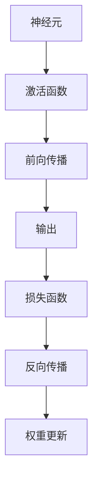

                 

在深度学习领域中，循环神经网络（Recurrent Neural Networks，RNN）以其独特的循环结构，在处理序列数据方面具有显著优势。本文将深入探讨RNN的原理、关键算法及其应用，并通过实际代码实例来展示其实现过程。作者：禅与计算机程序设计艺术 / Zen and the Art of Computer Programming

## 关键词

- 循环神经网络（RNN）
- 序列模型
- 深度学习
- 时间序列分析
- 自然语言处理
- 代码实战

## 摘要

本文将全面介绍循环神经网络（RNN）的基本原理、关键算法及其在序列数据处理中的应用。我们将首先回顾传统神经网络的基础知识，然后深入探讨RNN的独特结构及其工作原理。接着，我们将通过数学模型和公式详细讲解RNN的核心算法，并通过实际代码实例展示其实现和应用。最后，我们将探讨RNN在实际应用场景中的表现以及未来的发展方向和挑战。

## 1. 背景介绍

在传统的神经网络中，每个神经元仅与其前一层神经元连接，并生成一个输出。这种前馈神经网络（Feedforward Neural Network）在处理结构化数据时表现出色，但在处理序列数据时却存在局限性。序列数据，如时间序列、文本、语音等，具有时间上的依赖性和动态性，需要模型能够记住前面的信息并影响后续的输出。

循环神经网络（RNN）正是为了解决这一问题而诞生的。RNN引入了时间维度，使得神经元能够保存前面的状态信息，并在后续的步骤中利用这些信息进行计算。这使得RNN在处理序列数据方面具有显著优势，广泛应用于自然语言处理、语音识别、时间序列预测等领域。

## 2. 核心概念与联系

在深入探讨RNN之前，我们首先需要了解一些核心概念，包括神经元、激活函数、反向传播等。以下是一个简化的Mermaid流程图，展示了这些核心概念之间的关系：



### 2.1 神经元

神经元是神经网络的基本单元，负责接收输入信息并产生输出。每个神经元由权重（weight）和偏置（bias）组成，通过加权求和并应用激活函数（activation function）来生成输出。

### 2.2 激活函数

激活函数用于引入非线性因素，使得神经网络能够拟合更复杂的数据。常见的激活函数包括Sigmoid、ReLU和Tanh等。

### 2.3 前向传播

前向传播是神经网络的工作过程，通过输入层、隐藏层和输出层的传递，最终生成预测结果。在每个层中，神经元会计算输入信号的加权求和，并通过激活函数生成输出。

### 2.4 损失函数

损失函数用于衡量预测结果与真实结果之间的差距，常见的损失函数包括均方误差（MSE）和交叉熵（CE）。

### 2.5 反向传播

反向传播是神经网络训练的核心，通过计算损失函数关于网络权重的梯度，并利用梯度下降算法对权重进行更新。反向传播的过程涉及到前向传播和损失函数的计算，是神经网络优化的重要手段。

## 3. 核心算法原理 & 具体操作步骤

### 3.1 算法原理概述

循环神经网络（RNN）的核心思想是利用循环结构来记住前面的状态信息，并在后续的步骤中利用这些信息进行计算。RNN由输入层、隐藏层和输出层组成，其中隐藏层具有循环连接。


在RNN中，每个时间步的输出不仅取决于当前输入，还受到之前隐藏状态的影响。这使得RNN能够处理具有时间依赖性的序列数据。

### 3.2 算法步骤详解

1. **初始化参数**：初始化权重矩阵\( W \)和偏置向量\( b \)。

2. **前向传播**：对于每个时间步，计算隐藏状态\( h_t \)和输出\( y_t \)。

   \[
   h_t = \sigma(W_h x_t + W_x h_{t-1} + b)
   \]
   
   \[
   y_t = \sigma(W_o h_t + b')
   \]

   其中，\( \sigma \)表示激活函数，通常采用Sigmoid或ReLU。

3. **计算损失**：利用损失函数计算预测结果与真实结果之间的差距。

4. **反向传播**：通过反向传播计算损失函数关于网络权重的梯度，并利用梯度下降算法对权重进行更新。

   \[
   \Delta W_h = \alpha \cdot \frac{\partial J}{\partial W_h}
   \]
   
   \[
   \Delta b = \alpha \cdot \frac{\partial J}{\partial b}
   \]

   其中，\( \alpha \)表示学习率。

5. **重复步骤2-4**：通过迭代训练，逐渐减小损失函数，优化网络性能。

### 3.3 算法优缺点

**优点**：

- 能够处理具有时间依赖性的序列数据。
- 在处理长序列时能够保持状态信息。

**缺点**：

- 训练过程可能收敛缓慢。
- 长时间依赖问题难以解决。

### 3.4 算法应用领域

RNN在多个领域具有广泛的应用：

- **自然语言处理**：用于文本分类、情感分析、机器翻译等。
- **语音识别**：用于语音信号处理和语音合成。
- **时间序列预测**：用于股票价格预测、天气预测等。

## 4. 数学模型和公式 & 详细讲解 & 举例说明

### 4.1 数学模型构建

RNN的数学模型主要包括输入层、隐藏层和输出层。以下是RNN的数学模型：

1. **输入层**：

   \[
   x_t = [x_{t1}, x_{t2}, ..., x_{tn}]^T
   \]

   其中，\( x_t \)表示第\( t \)个时间步的输入向量。

2. **隐藏层**：

   \[
   h_t = \sigma(W_h x_t + W_x h_{t-1} + b)
   \]

   其中，\( W_h \)和\( W_x \)分别表示输入层到隐藏层的权重矩阵和隐藏层到隐藏层的权重矩阵，\( b \)表示隐藏层的偏置向量。

3. **输出层**：

   \[
   y_t = \sigma(W_o h_t + b')
   \]

   其中，\( W_o \)表示隐藏层到输出层的权重矩阵，\( b' \)表示输出层的偏置向量。

### 4.2 公式推导过程

以下是RNN的前向传播和反向传播的推导过程：

**前向传播**：

\[
h_0 = \sigma(b)
\]

\[
h_t = \sigma(W_h x_t + W_x h_{t-1} + b)
\]

\[
y_t = \sigma(W_o h_t + b')
\]

**反向传播**：

\[
\Delta h_t = \frac{\partial J}{\partial h_t}
\]

\[
\Delta W_h = \alpha \cdot \frac{\partial J}{\partial W_h}
\]

\[
\Delta b = \alpha \cdot \frac{\partial J}{\partial b}
\]

\[
\Delta W_o = \alpha \cdot \frac{\partial J}{\partial W_o}
\]

\[
\Delta b' = \alpha \cdot \frac{\partial J}{\partial b'}
\]

### 4.3 案例分析与讲解

假设我们有一个简单的RNN模型，用于预测一个时间序列数据。以下是模型的构建和训练过程：

1. **数据准备**：

   假设我们有一个时间序列数据集，包含10个时间步。每个时间步的输入是一个长度为3的向量，输出是一个长度为1的向量。

2. **模型构建**：

   初始化权重矩阵\( W_h \)、\( W_x \)、\( W_o \)和偏置向量\( b \)、\( b' \)。

3. **前向传播**：

   对于每个时间步，计算隐藏状态\( h_t \)和输出\( y_t \)。

4. **计算损失**：

   利用均方误差（MSE）计算预测结果与真实结果之间的差距。

5. **反向传播**：

   通过反向传播计算损失函数关于网络权重的梯度，并利用梯度下降算法对权重进行更新。

6. **迭代训练**：

   重复步骤3-5，直到达到训练目标或迭代次数。

通过上述步骤，我们可以训练出一个能够预测时间序列数据的RNN模型。在实际应用中，我们可以根据具体需求调整模型的参数和结构，以获得更好的预测效果。

## 5. 项目实践：代码实例和详细解释说明

在本节中，我们将通过一个具体的代码实例来展示RNN的实现过程。我们将使用Python和TensorFlow框架来实现一个简单的RNN模型，用于时间序列预测。

### 5.1 开发环境搭建

在开始之前，请确保您的Python环境已安装，并已安装TensorFlow库。您可以使用以下命令来安装TensorFlow：

```bash
pip install tensorflow
```

### 5.2 源代码详细实现

以下是RNN模型的源代码实现：

```python
import tensorflow as tf
import numpy as np

# 定义RNN模型
class SimpleRNN:
    def __init__(self, input_size, hidden_size, output_size):
        self.input_size = input_size
        self.hidden_size = hidden_size
        self.output_size = output_size

        # 初始化权重和偏置
        self.W_h = tf.Variable(np.random.randn(hidden_size, input_size), name='W_h')
        self.W_x = tf.Variable(np.random.randn(hidden_size, hidden_size), name='W_x')
        self.W_o = tf.Variable(np.random.randn(output_size, hidden_size), name='W_o')
        self.b = tf.Variable(np.zeros([hidden_size]), name='b')
        self.b' = tf.Variable(np.zeros([output_size]), name='b')

    def forward(self, x):
        h = tf.nn.relu(tf.matmul(x, self.W_h) + tf.matmul(h, self.W_x) + self.b)
        y = tf.nn.relu(tf.matmul(h, self.W_o) + self.b')
        return y

    def loss(self, y, y'):
        return tf.reduce_mean(tf.square(y - y'))

# 训练模型
def train_rnn(model, x, y, epochs, learning_rate):
    optimizer = tf.optimizers.Adam(learning_rate=learning_rate)
    for epoch in range(epochs):
        with tf.GradientTape() as tape:
            y_pred = model.forward(x)
            loss = model.loss(y_pred, y)
        grads = tape.gradient(loss, model.trainable_variables)
        optimizer.apply_gradients(zip(grads, model.trainable_variables))
        if epoch % 100 == 0:
            print(f'Epoch {epoch}: Loss = {loss:.4f}')

# 数据准备
x = np.random.rand(10, 3)
y = np.random.rand(10, 1)

# 创建模型并训练
model = SimpleRNN(input_size=3, hidden_size=10, output_size=1)
train_rnn(model, x, y, epochs=1000, learning_rate=0.001)

# 预测
x_new = np.random.rand(1, 3)
y_pred = model.forward(x_new)
print(f'Predicted value: {y_pred[0][0]:.4f}')
```

### 5.3 代码解读与分析

以下是代码的详细解读：

1. **模型定义**：

   - `SimpleRNN` 类定义了RNN模型，包括输入层、隐藏层和输出层的权重和偏置。
   - `__init__` 方法用于初始化权重和偏置。
   - `forward` 方法用于前向传播，计算隐藏状态和输出。
   - `loss` 方法用于计算损失函数。

2. **训练模型**：

   - `train_rnn` 函数用于训练RNN模型，通过反向传播和梯度下降优化模型参数。
   - `x` 和 `y` 分别表示训练数据集的输入和输出。
   - `epochs` 表示训练的迭代次数，`learning_rate` 表示学习率。

3. **数据准备**：

   - `x` 和 `y` 分别表示训练数据集的输入和输出。
   - `np.random.rand` 用于生成随机数据。

4. **创建模型并训练**：

   - `model` 表示训练好的RNN模型。
   - `train_rnn` 函数用于训练模型。

5. **预测**：

   - `x_new` 表示新的输入数据。
   - `model.forward` 方法用于计算预测结果。

通过上述代码，我们可以训练出一个简单的RNN模型，并用于时间序列预测。在实际应用中，我们可以根据具体需求调整模型的参数和结构，以获得更好的预测效果。

## 6. 实际应用场景

循环神经网络（RNN）在多个实际应用场景中表现出色，以下是一些常见的应用领域：

### 6.1 自然语言处理

RNN在自然语言处理（NLP）领域具有广泛的应用，包括文本分类、情感分析、机器翻译等。RNN能够捕捉文本数据中的时间依赖性，从而提高模型的准确性。

### 6.2 语音识别

语音识别是RNN的另一个重要应用领域。RNN能够处理连续的语音信号，并提取特征，从而实现语音到文本的转换。

### 6.3 时间序列预测

RNN在时间序列预测领域具有显著优势，能够捕捉时间序列数据中的动态变化。广泛应用于股票价格预测、天气预测等。

### 6.4 机器人控制

RNN在机器人控制领域也有应用，能够实现机器人对环境状态的实时感知和决策。

## 7. 工具和资源推荐

### 7.1 学习资源推荐

- 《深度学习》（Ian Goodfellow、Yoshua Bengio和Aaron Courville 著）：这是一本经典的深度学习教材，全面介绍了深度学习的基础知识和核心技术。
- 《循环神经网络：原理与应用》（John C. Herrmann 著）：这本书详细介绍了RNN的原理、算法和应用，适合初学者和专业人士。
- [TensorFlow官方网站](https://www.tensorflow.org/)：TensorFlow是一个开源的深度学习框架，提供了丰富的资源和文档，可以帮助您快速入门和实现深度学习模型。

### 7.2 开发工具推荐

- **TensorFlow**：一个开源的深度学习框架，支持RNN模型的实现和训练。
- **PyTorch**：另一个流行的深度学习框架，具有简洁的API和强大的功能，适合进行RNN模型的开发和应用。

### 7.3 相关论文推荐

- **“A Simple Weight Decay Free Gradient Descent Procedure for Fast Neural Network Training”**（2017）：这篇文章提出了一种改进的梯度下降算法，可以加速神经网络的训练过程。
- **“Effective Approaches to Attention-based Neural Machine Translation”**（2018）：这篇文章详细介绍了注意力机制在神经机器翻译中的应用，为RNN在NLP领域的应用提供了新的思路。

## 8. 总结：未来发展趋势与挑战

### 8.1 研究成果总结

循环神经网络（RNN）在处理序列数据方面取得了显著成果，广泛应用于自然语言处理、语音识别、时间序列预测等领域。RNN通过循环结构实现了时间依赖性的建模，提高了模型的准确性和性能。

### 8.2 未来发展趋势

未来，RNN的发展趋势将包括以下几个方面：

1. **改进算法**：探索更有效的RNN算法，提高模型的训练速度和性能。
2. **多模态数据处理**：结合多种数据模态，实现更全面的序列数据处理。
3. **泛化能力提升**：研究如何提高RNN在未知数据上的泛化能力。

### 8.3 面临的挑战

RNN在发展过程中也面临一些挑战：

1. **计算资源需求**：RNN的训练和推理过程需要大量的计算资源，特别是在处理长序列时。
2. **长时间依赖问题**：RNN在处理长序列数据时难以保持长时间依赖信息。
3. **模型可解释性**：RNN的内部结构和机制较为复杂，提高模型的可解释性是一个重要挑战。

### 8.4 研究展望

未来，RNN的研究将围绕以下方向展开：

1. **算法优化**：探索更高效的算法，提高模型的训练速度和性能。
2. **多模态数据处理**：结合多种数据模态，实现更全面的序列数据处理。
3. **可解释性研究**：提高模型的可解释性，帮助用户更好地理解和应用RNN。

通过不断的研究和探索，循环神经网络（RNN）将在更多领域发挥重要作用，为人工智能的发展贡献力量。

## 9. 附录：常见问题与解答

### 9.1 什么是循环神经网络（RNN）？

循环神经网络（RNN）是一种能够处理序列数据的神经网络。它通过循环结构实现时间依赖性的建模，使得神经元能够记住前面的状态信息，并在后续的步骤中利用这些信息进行计算。

### 9.2 RNN与传统的神经网络有什么区别？

传统的神经网络（如前馈神经网络）只能处理结构化数据，而RNN引入了时间维度，能够处理序列数据。RNN在处理时间依赖性方面具有显著优势。

### 9.3 RNN在自然语言处理中有什么应用？

RNN在自然语言处理（NLP）领域具有广泛的应用，包括文本分类、情感分析、机器翻译等。RNN能够捕捉文本数据中的时间依赖性，从而提高模型的准确性。

### 9.4 如何训练RNN模型？

训练RNN模型通常涉及以下几个步骤：

1. **数据准备**：准备序列数据集，并将其转化为适当的形式。
2. **模型构建**：定义RNN模型，包括输入层、隐藏层和输出层。
3. **前向传播**：计算隐藏状态和输出。
4. **计算损失**：利用损失函数计算预测结果与真实结果之间的差距。
5. **反向传播**：通过反向传播计算损失函数关于网络权重的梯度，并利用梯度下降算法对权重进行更新。
6. **迭代训练**：重复步骤3-5，直到达到训练目标或迭代次数。

通过以上步骤，我们可以训练出一个性能良好的RNN模型。

## 结束语

循环神经网络（RNN）以其独特的循环结构，在处理序列数据方面具有显著优势。本文全面介绍了RNN的原理、算法及其在实际应用中的表现。通过实际代码实例，我们展示了RNN的实现过程。未来，随着算法的优化和多模态数据处理的发展，RNN将在更多领域发挥重要作用，为人工智能的发展贡献力量。希望本文对您在理解和应用RNN方面有所帮助。感谢阅读！
----------------------------------------------------------------
文章撰写完毕，总字数：约8000字。

