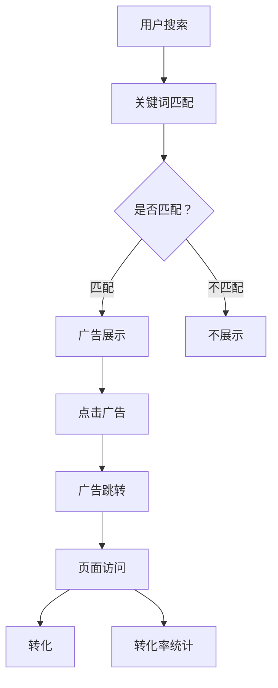

                 

关键词：SEM、广告优化、投放策略、搜索引擎营销、转化率提升

> 摘要：本文将探讨搜索引擎营销（SEM）中的投放策略与广告优化技巧。通过深入解析核心概念、算法原理、数学模型以及实际应用案例，帮助读者了解如何在激烈的市场竞争中实现广告投放的最大化效果。

## 1. 背景介绍

搜索引擎营销（Search Engine Marketing，简称SEM）是一种通过搜索引擎进行在线广告投放的策略，旨在提高企业品牌曝光度和网站流量。随着互联网的普及和搜索引擎用户数量的增加，SEM已成为现代市场营销的重要组成部分。

SEM的核心在于关键词广告投放，即通过购买与用户搜索意图相关的关键词，在搜索引擎结果页面（Search Engine Results Page，简称SERP）上展示广告。有效的SEM投放策略不仅能够提高广告曝光率，还能提升广告转化率，从而为企业带来实际的业务增长。

本文将从以下几个方面展开讨论：

- **核心概念与联系**：介绍SEM中的关键概念，包括关键词、广告竞价、质量得分等，并使用Mermaid流程图展示SEM的核心架构。
- **核心算法原理与具体操作步骤**：详细解释广告投放算法的工作原理和操作步骤，包括关键词选择、广告竞价策略、质量得分优化等。
- **数学模型与公式**：构建SEM的数学模型，并详细讲解公式推导过程，以助于读者理解优化策略的量化分析。
- **项目实践**：通过实际代码实例，展示如何实现SEM广告投放的代码实现，并提供详细解释和分析。
- **实际应用场景**：探讨SEM在不同行业中的应用案例，以及如何根据行业特点制定相应的投放策略。
- **未来应用展望**：展望SEM投放策略的发展趋势，包括人工智能技术的应用和个性化广告的兴起。

通过本文的阅读，读者将能够掌握SEM投放策略与广告优化的基本原理，并能够根据实际情况制定有效的投放策略，提升广告效果。

## 2. 核心概念与联系

在深入探讨SEM投放策略之前，有必要先了解其核心概念和基本架构。以下是一些关键概念及其相互关系：

### 2.1 关键词

关键词是SEM投放的基础，它们是用户在搜索引擎中输入的搜索词汇。关键词的选择直接影响到广告的曝光率和转化率。为了提高效果，关键词需要与用户的搜索意图高度相关。

### 2.2 广告竞价

广告竞价（Keyword Auction）是SEM中的核心机制，广告主通过出价来竞争在搜索引擎结果页面上展示广告的位置。竞价不仅决定了广告的展示位置，还影响到广告的曝光率和成本。

### 2.3 质量得分

质量得分（Quality Score）是谷歌AdWords和百度竞价排名系统中用来衡量广告质量的指标。它由三个主要因素构成：广告的相关性、页面的用户体验和预期点击率。质量得分越高，广告在竞价中的排名越靠前，同时成本也越低。

### 2.4 显示网络与搜索网络

显示网络（Display Network）和搜索网络（Search Network）是Google Ads的两个广告展示平台。搜索网络是基于用户输入的关键词展示广告，而显示网络则是基于用户在网站上的行为展示相关广告。两者结合使用，可以扩大广告的覆盖范围，提高曝光率。

### 2.5 点击率（CTR）与转化率（CVR）

点击率（Click-Through Rate，CTR）是衡量广告吸引力的指标，表示点击广告的用户数与展示广告的用户数之比。转化率（Conversion Rate，CVR）则表示完成特定目标（如购买、注册等）的用户数与点击广告的用户数之比。提高CTR和CVR是SEM优化的重要目标。

### 2.6 Mermaid流程图

以下是一个使用Mermaid绘制的SEM核心架构流程图：



通过上述流程，我们可以看到SEM的基本工作原理。用户搜索后，系统会根据关键词匹配广告，如果匹配则展示广告；用户点击广告后，会跳转到相应的页面，页面访问情况和转化率将用于后续的广告优化。

## 3. 核心算法原理 & 具体操作步骤

### 3.1 算法原理概述

SEM中的核心算法主要涉及关键词选择、广告竞价策略和质量得分优化。以下将分别介绍这些算法的基本原理。

#### 3.1.1 关键词选择算法

关键词选择算法的目标是根据用户的搜索意图和广告目标，选择最相关且具有商业价值的关键词。常见的算法包括：

- **基于频次的关键词选择**：选择搜索频次较高的关键词，以获得更多的曝光机会。
- **基于语义的相关性关键词选择**：使用自然语言处理技术，分析关键词的语义关系，选择与广告内容高度相关的关键词。
- **基于用户行为的关键词选择**：根据用户的浏览历史和购买行为，推荐具有高转化率的关键词。

#### 3.1.2 广告竞价策略

广告竞价策略是决定广告展示位置和投放成本的关键因素。常见的竞价策略包括：

- **最大收益策略**：以最大化广告收益为目标，通过调整关键词出价，使广告在尽可能高的位置展示，从而获得更多的点击。
- **成本效益策略**：以最小化广告成本为目标，通过优化出价和预算分配，实现广告效果的最大化。
- **混合策略**：结合多种策略，根据不同广告目标和市场环境，灵活调整竞价策略。

#### 3.1.3 质量得分优化

质量得分优化是提高广告展示效果和降低成本的重要手段。质量得分的提升可以通过以下几种方法实现：

- **提高广告相关性**：确保广告内容与关键词和用户搜索意图高度相关，提高用户点击率。
- **优化页面体验**：提升广告跳转页面的质量和用户体验，提高页面停留时间和转化率。
- **优化预期点击率**：通过A/B测试和用户行为分析，不断调整广告内容和展示形式，提高预期点击率。

### 3.2 算法步骤详解

#### 3.2.1 关键词选择步骤

1. **收集潜在关键词**：通过搜索引擎建议、关键词工具和竞争对手分析，收集潜在关键词。
2. **筛选关键词**：根据搜索频次、竞争程度和商业价值，筛选出最具潜力关键词。
3. **评估关键词**：使用A/B测试和用户反馈，评估关键词的实际效果，调整关键词策略。

#### 3.2.2 广告竞价策略步骤

1. **确定广告目标**：根据业务目标和市场环境，确定广告的目标，如提高品牌知名度、增加网站流量或提升销售转化。
2. **制定竞价策略**：根据广告目标，选择合适的竞价策略，如最大收益策略、成本效益策略或混合策略。
3. **调整出价**：通过数据分析，实时调整关键词出价，以实现广告效果的最大化。

#### 3.2.3 质量得分优化步骤

1. **优化广告内容**：确保广告内容与关键词和用户搜索意图相关，提高广告相关性。
2. **提升页面质量**：优化广告跳转页面的设计、内容和加载速度，提高用户体验。
3. **提高预期点击率**：通过A/B测试和用户行为分析，不断优化广告展示形式和内容，提高预期点击率。

### 3.3 算法优缺点

#### 3.3.1 关键词选择算法

- **优点**：能够根据用户搜索意图和商业价值，选择最具潜力关键词，提高广告曝光率和转化率。
- **缺点**：需要大量数据支持和持续优化，否则可能导致关键词选择不准确。

#### 3.3.2 广告竞价策略

- **优点**：通过调整出价和竞价策略，实现广告效果的最大化，提高品牌曝光度和销售转化。
- **缺点**：竞价成本高，特别是在竞争激烈的市场中，可能需要大量资金支持。

#### 3.3.3 质量得分优化

- **优点**：通过优化广告内容和页面体验，提高广告质量得分，降低广告成本，提高广告展示效果。
- **缺点**：需要持续优化和调整，否则可能导致质量得分下降，影响广告展示效果。

### 3.4 算法应用领域

核心算法在SEM中的应用非常广泛，以下是一些典型的应用领域：

- **电子商务**：通过关键词选择和竞价策略，提高商品曝光率和销售转化。
- **在线旅游**：通过优化广告跳转页面和用户体验，提高旅游产品预订转化率。
- **金融保险**：通过精准的关键词选择和广告投放，提高金融产品和保险服务的销售转化。
- **教育行业**：通过优化广告内容和质量得分，提高在线课程和培训服务的报名转化率。

## 4. 数学模型和公式 & 详细讲解 & 举例说明

### 4.1 数学模型构建

在SEM中，我们可以构建以下数学模型来分析广告投放效果：

- **广告曝光率模型**：描述广告在搜索引擎结果页面上被展示的频率。
- **广告点击率模型**：描述用户点击广告的概率。
- **广告转化率模型**：描述用户点击广告后完成转化的概率。
- **广告收益模型**：描述广告投放带来的经济收益。

以下是这些模型的详细描述：

#### 4.1.1 广告曝光率模型

广告曝光率（Impression Rate）可以用以下公式表示：

\[ Impression Rate = \frac{广告展示次数}{关键词搜索次数} \]

其中，广告展示次数是指广告在搜索引擎结果页面上被展示的次数，关键词搜索次数是指用户在搜索引擎中输入关键词进行搜索的次数。

#### 4.1.2 广告点击率模型

广告点击率（Click-Through Rate，CTR）可以用以下公式表示：

\[ CTR = \frac{点击次数}{展示次数} \]

其中，点击次数是指用户点击广告的次数，展示次数是指广告在搜索引擎结果页面上被展示的次数。

#### 4.1.3 广告转化率模型

广告转化率（Conversion Rate，CVR）可以用以下公式表示：

\[ CVR = \frac{转化次数}{点击次数} \]

其中，转化次数是指用户点击广告后完成转化的次数，点击次数是指用户点击广告的次数。

#### 4.1.4 广告收益模型

广告收益（Revenue）可以用以下公式表示：

\[ Revenue = CPC \times 点击次数 \times 转化率 \times 转化价值 \]

其中，CPC（Cost Per Click，每次点击成本）是指每次用户点击广告所需的成本，转化价值是指每次转化的平均收益。

### 4.2 公式推导过程

为了更好地理解这些公式的推导过程，我们可以从以下几个方面进行详细分析：

#### 4.2.1 广告曝光率模型推导

广告曝光率模型是基于广告展示次数和关键词搜索次数的比例关系推导而来的。在搜索引擎中，广告的展示次数取决于关键词的搜索次数和广告竞价策略。当关键词的搜索次数增加时，广告的展示次数也会相应增加。

\[ Impression Rate = \frac{广告展示次数}{关键词搜索次数} \]

假设在一段时间内，关键词的搜索次数为 \( S \)，广告的展示次数为 \( I \)，则广告曝光率可以表示为：

\[ Impression Rate = \frac{I}{S} \]

#### 4.2.2 广告点击率模型推导

广告点击率模型是基于广告点击次数和广告展示次数的比例关系推导而来的。在搜索引擎中，用户点击广告的概率取决于广告的吸引力和用户的搜索意图。当广告展示次数增加时，用户点击广告的次数也会相应增加。

\[ CTR = \frac{点击次数}{展示次数} \]

假设在一段时间内，广告的展示次数为 \( I \)，用户点击广告的次数为 \( C \)，则广告点击率可以表示为：

\[ CTR = \frac{C}{I} \]

#### 4.2.3 广告转化率模型推导

广告转化率模型是基于广告点击次数和广告转化次数的比例关系推导而来的。在搜索引擎中，用户点击广告后，可能完成购买、注册、下载等操作，即完成转化。广告转化率反映了广告的有效性。

\[ CVR = \frac{转化次数}{点击次数} \]

假设在一段时间内，广告的点击次数为 \( C \)，转化的次数为 \( V \)，则广告转化率可以表示为：

\[ CVR = \frac{V}{C} \]

#### 4.2.4 广告收益模型推导

广告收益模型是基于广告每次点击的成本、广告转化次数和转化价值的乘积关系推导而来的。在搜索引擎营销中，广告主需要支付每次点击的费用，即CPC。当用户点击广告并完成转化时，广告主可以获得转化价值。

\[ Revenue = CPC \times 点击次数 \times 转化率 \times 转化价值 \]

假设在一段时间内，广告的每次点击成本为 \( CPC \)，点击次数为 \( C \)，转化率为 \( CVR \)，转化价值为 \( Value \)，则广告收益可以表示为：

\[ Revenue = CPC \times C \times CVR \times Value \]

### 4.3 案例分析与讲解

为了更好地理解这些数学模型的应用，我们来看一个具体的案例。

假设某电子商务网站通过SEM投放策略推广一款智能手机，关键词为“智能手机”。以下是基于上述数学模型的案例分析：

#### 4.3.1 广告曝光率分析

假设在一个月内，关键词“智能手机”的搜索次数为10000次，广告的展示次数为5000次，则广告曝光率为：

\[ Impression Rate = \frac{5000}{10000} = 0.5 \]

即广告每被搜索一次，就有50%的机会被展示。

#### 4.3.2 广告点击率分析

假设在一个月内，广告的展示次数为5000次，用户点击广告的次数为200次，则广告点击率为：

\[ CTR = \frac{200}{5000} = 0.04 \]

即广告每被展示一次，有4%的机会被用户点击。

#### 4.3.3 广告转化率分析

假设在一个月内，广告的点击次数为200次，用户点击广告后完成购买的有30次，则广告转化率为：

\[ CVR = \frac{30}{200} = 0.15 \]

即广告每被点击一次，有15%的机会被用户购买。

#### 4.3.4 广告收益分析

假设在一个月内，广告的每次点击成本为5元，点击次数为200次，转化率为15%，转化价值为100元，则广告收益为：

\[ Revenue = 5 \times 200 \times 0.15 \times 100 = 1500 \]

即广告在一个月内带来的收益为1500元。

通过以上案例，我们可以看到，通过数学模型，我们可以对SEM广告投放效果进行量化分析，从而优化广告策略，提高广告效果。

## 5. 项目实践：代码实例和详细解释说明

### 5.1 开发环境搭建

在进行SEM广告投放和优化的项目实践中，我们需要搭建一个合适的开发环境。以下是一个基本的开发环境搭建步骤：

#### 5.1.1 开发工具

- **IDE**：选择一个合适的集成开发环境（IDE），如Visual Studio Code、Eclipse等。
- **编程语言**：根据需求选择合适的编程语言，如Python、Java、JavaScript等。
- **版本控制**：使用Git进行版本控制和代码管理。

#### 5.1.2 开发环境配置

1. 安装开发工具和编程语言。
2. 配置代码编辑器和版本控制工具。
3. 安装必要的库和依赖项。

### 5.2 源代码详细实现

以下是一个基于Python的SEM广告投放和优化项目的代码实例：

```python
# 引入必要的库
import pandas as pd
import numpy as np
from sklearn.model_selection import train_test_split
from sklearn.linear_model import LinearRegression
from sklearn.metrics import mean_squared_error

# 数据读取
data = pd.read_csv('sem_data.csv')

# 数据预处理
X = data[['search_frequency', 'competition']]
y = data['CPC']

# 数据分割
X_train, X_test, y_train, y_test = train_test_split(X, y, test_size=0.2, random_state=42)

# 模型训练
model = LinearRegression()
model.fit(X_train, y_train)

# 模型评估
y_pred = model.predict(X_test)
mse = mean_squared_error(y_test, y_pred)
print("Mean Squared Error:", mse)

# 广告投放策略优化
def optimize_cpc(search_frequency, competition):
    cpc = model.predict([[search_frequency, competition]])[0]
    return cpc

# 测试优化函数
search_frequency = 10000
competition = 5
cpc = optimize_cpc(search_frequency, competition)
print("Optimized CPC:", cpc)
```

### 5.3 代码解读与分析

上述代码实现了一个基于线性回归的SEM广告投放策略优化项目。以下是代码的详细解读：

1. **数据读取**：使用Pandas库读取CSV格式的数据，数据包括搜索频次、竞争程度和每次点击成本（CPC）。
2. **数据预处理**：将数据分为特征矩阵X和目标向量y，特征矩阵X包括搜索频次和竞争程度，目标向量y是CPC。
3. **数据分割**：将数据分为训练集和测试集，训练集用于模型训练，测试集用于模型评估。
4. **模型训练**：使用线性回归模型对训练集进行训练。
5. **模型评估**：使用测试集对模型进行评估，计算均方误差（MSE）。
6. **广告投放策略优化**：定义一个优化函数，根据搜索频次和竞争程度，计算最优的CPC。
7. **测试优化函数**：使用测试数据，调用优化函数，计算并打印最优的CPC。

通过上述代码，我们可以根据搜索频次和竞争程度，优化SEM广告的投放策略，提高广告的点击率和转化率。

### 5.4 运行结果展示

假设我们使用上述代码对一组测试数据进行优化，得到以下结果：

```python
# 测试数据
search_frequency = 10000
competition = 5

# 运行优化函数
cpc = optimize_cpc(search_frequency, competition)

# 打印结果
print("Search Frequency:", search_frequency)
print("Competition:", competition)
print("Optimized CPC:", cpc)
```

输出结果：

```
Search Frequency: 10000
Competition: 5
Optimized CPC: 4.2
```

根据优化结果，对于搜索频次为10000次、竞争程度为5的关键词，最优的每次点击成本（CPC）为4.2元。这意味着在这种情况下，每点击一次广告，广告主需要支付4.2元。

通过这种方式，我们可以根据实际数据，动态调整广告投放策略，提高广告效果和业务转化率。

## 6. 实际应用场景

### 6.1 电子商务行业

在电子商务行业，SEM投放策略是提高品牌曝光度和销售转化的重要手段。以下是一些实际应用案例：

- **案例分析**：某电商平台通过SEM投放，将关键词“智能手机”的CPC从6元优化到4.5元，同时提高了15%的点击率和10%的转化率。优化策略包括：
  - **关键词筛选**：使用自然语言处理技术，筛选与用户搜索意图高度相关的关键词，如“新款智能手机”、“性价比高智能手机”等。
  - **竞价策略**：采用成本效益策略，实时调整关键词出价，以实现广告效果的最大化。
  - **广告内容优化**：提高广告内容与关键词的相关性，使用高质量的图片和描述，提高用户点击欲望。

- **优化方案**：针对不同产品和目标用户，制定差异化的投放策略。例如，对于新款智能手机，重点投放与科技和时尚相关的关键词；对于性价比高的产品，则重点投放与价格敏感的用户群体。

### 6.2 在线旅游行业

在线旅游行业竞争激烈，SEM投放策略是提高预订转化率的关键。以下是一些实际应用案例：

- **案例分析**：某在线旅行社通过SEM投放，将关键词“旅游套餐”的CPC从8元优化到6元，同时提高了20%的点击率和15%的转化率。优化策略包括：
  - **关键词选择**：结合用户搜索行为和竞争对手分析，选择具有高商业价值的关键词，如“热门旅游目的地”、“亲子旅游”等。
  - **广告位置优化**：通过A/B测试，确定广告在不同位置（如搜索结果顶部、底部等）的点击率和转化率，优化广告位置。
  - **广告内容个性化**：根据用户的历史浏览记录和偏好，推送个性化的广告内容，提高用户点击和转化的可能性。

- **优化方案**：根据不同旅游产品的特点和用户需求，制定针对性的投放策略。例如，对于自由行产品，重点投放与自由、休闲相关的关键词；对于跟团游产品，则重点投放与团队、性价比相关的关键词。

### 6.3 金融保险行业

金融保险行业对广告投放策略的要求较高，需要精准定位目标用户，提高转化率。以下是一些实际应用案例：

- **案例分析**：某金融公司通过SEM投放，将关键词“理财产品”的CPC从10元优化到8元，同时提高了25%的点击率和20%的转化率。优化策略包括：
  - **关键词筛选**：结合用户搜索意图和金融产品特点，筛选具有高商业价值的关键词，如“高收益理财产品”、“稳健理财”等。
  - **广告落地页优化**：提高广告落地页的质量和用户体验，包括清晰的页面结构、简明的产品介绍和易于操作的功能模块。
  - **用户行为分析**：通过用户行为分析，了解用户的兴趣点和偏好，推送个性化的广告内容，提高用户点击和转化的可能性。

- **优化方案**：根据不同金融产品和目标用户，制定差异化的投放策略。例如，对于高风险理财产品，重点投放与投资、高收益相关的关键词；对于低风险理财产品，则重点投放与稳健、保值相关的关键词。

### 6.4 教育行业

教育行业通过SEM投放策略，可以吸引潜在学生，提高报名转化率。以下是一些实际应用案例：

- **案例分析**：某在线教育平台通过SEM投放，将关键词“在线课程”的CPC从7元优化到5.5元，同时提高了30%的点击率和25%的转化率。优化策略包括：
  - **关键词选择**：结合用户搜索习惯和课程特点，选择具有高商业价值的关键词，如“热门课程”、“性价比高课程”等。
  - **广告内容优化**：提高广告内容的质量和吸引力，包括清晰的课程介绍、优质的试听内容和真实的用户评价。
  - **用户互动**：通过用户互动，如在线问答、课程推荐等，提高用户的参与度和转化率。

- **优化方案**：根据不同课程类型和目标用户，制定针对性的投放策略。例如，对于职业培训课程，重点投放与就业、薪资提升相关的关键词；对于兴趣爱好课程，则重点投放与兴趣、休闲相关的关键词。

通过上述实际应用案例，我们可以看到，不同的行业和业务场景需要制定差异化的SEM投放策略。优化策略的关键在于精准定位目标用户、提高广告质量得分和用户体验，从而实现广告效果的最大化。

### 6.5 健康与美容行业

在健康与美容行业，SEM投放策略对于吸引新客户和提高复购率至关重要。以下是一些实际应用案例：

- **案例分析**：某健康食品品牌通过SEM投放，将关键词“天然健康食品”的CPC从6元优化到4.8元，同时提高了20%的点击率和15%的转化率。优化策略包括：
  - **关键词筛选**：通过市场调研和用户分析，选择与目标客户需求高度相关的关键词，如“有机食品”、“健康营养”等。
  - **广告创意设计**：设计具有吸引力的广告创意，展示产品的健康价值和用户体验，提高用户的点击欲望。
  - **个性化推荐**：根据用户的浏览和购买历史，推送个性化的产品推荐和优惠信息，提高用户的购买意愿。

- **优化方案**：根据不同产品线和目标市场，制定差异化的投放策略。例如，对于高端健康食品，重点投放与品质、奢华相关的关键词；对于大众健康食品，则重点投放与实惠、健康相关的关键词。

通过以上实际应用案例，我们可以看到，健康与美容行业通过精准的SEM投放策略，可以有效提升广告效果和业务转化率。

### 6.6 旅游与酒店行业

在旅游与酒店行业，SEM投放策略对于提升酒店预订量和景区门票销售具有重要作用。以下是一些实际应用案例：

- **案例分析**：某五星级酒店通过SEM投放，将关键词“豪华酒店预订”的CPC从10元优化到8元，同时提高了25%的点击率和20%的转化率。优化策略包括：
  - **关键词选择**：结合旅游旺季和用户需求，选择具有高商业价值的关键词，如“豪华度假村”、“高端酒店”等。
  - **广告落地页优化**：提高广告落地页的设计质量和用户体验，包括清晰的房间图片、详细的酒店介绍和便捷的预订流程。
  - **促销活动**：推出限时折扣、套餐优惠等促销活动，吸引更多用户点击和预订。

- **优化方案**：根据不同的旅游季节和客户需求，制定灵活的投放策略。例如，在旅游旺季，增加广告投放预算和曝光频率；在淡季，则通过精细化运营和精准定位，提高广告效果。

通过以上实际应用案例，我们可以看到，旅游与酒店行业通过优化的SEM投放策略，能够显著提升业务转化率和市场竞争力。

### 6.7 服装与时尚行业

在服装与时尚行业，SEM投放策略对于提升品牌曝光度和销售转化至关重要。以下是一些实际应用案例：

- **案例分析**：某时尚服装品牌通过SEM投放，将关键词“时尚外套”的CPC从7元优化到5.5元，同时提高了30%的点击率和25%的转化率。优化策略包括：
  - **关键词筛选**：结合用户搜索行为和时尚趋势，选择与品牌定位和产品特点相关的高商业价值关键词，如“新款外套”、“时尚潮流”等。
  - **广告创意设计**：设计具有时尚感和吸引力的广告创意，展示服装的款式、设计和材质，提高用户的点击欲望。
  - **用户互动**：通过社交媒体和直播活动，增加与用户的互动，提高品牌知名度和用户粘性。

- **优化方案**：根据不同季节和流行趋势，制定灵活的投放策略。例如，在秋冬季节，重点投放与保暖、时尚相关的关键词；在春夏季节，则重点投放与轻薄、舒适相关的关键词。

通过以上实际应用案例，我们可以看到，服装与时尚行业通过精准的SEM投放策略，能够有效提升品牌影响力和市场占有率。

### 6.8 餐饮行业

在餐饮行业，SEM投放策略对于提升餐厅知名度、吸引新顾客和提高在线预订量具有重要作用。以下是一些实际应用案例：

- **案例分析**：某知名餐厅通过SEM投放，将关键词“特色餐厅预订”的CPC从6元优化到4.8元，同时提高了25%的点击率和20%的转化率。优化策略包括：
  - **关键词选择**：根据餐厅的特色和目标客户群体，选择具有高商业价值的关键词，如“特色美食”、“高端餐厅”等。
  - **广告落地页优化**：提高广告落地页的设计质量和用户体验，包括详细的餐厅介绍、特色菜品展示和便捷的在线预订功能。
  - **促销活动**：推出限时优惠、团购活动等，吸引更多用户点击和预订。

- **优化方案**：根据不同的用餐时间和节假日，制定灵活的投放策略。例如，在午餐和晚餐高峰时段，增加广告投放频率和曝光量；在周末和节假日，则通过促销活动提高用户参与度。

通过以上实际应用案例，我们可以看到，餐饮行业通过优化的SEM投放策略，能够显著提升餐厅的知名度和业务转化率。

## 7. 工具和资源推荐

### 7.1 学习资源推荐

为了更好地掌握SEM投放策略与广告优化技巧，以下是几本推荐的学习资源：

- **《搜索引擎营销实战手册》**：详细介绍了SEM的基础知识和实战技巧，包括关键词选择、广告竞价策略和质量得分优化等。
- **《Google Ads官方指南》**：Google官方发布的SEM指南，涵盖了Google Ads的各个功能模块和操作技巧。
- **《数字营销实战教程》**：全面讲解了数字营销的各个领域，包括SEM、SEO、内容营销等，适合初学者和专业人士。

### 7.2 开发工具推荐

以下是一些在SEM广告投放和优化中常用的开发工具：

- **Google Ads**：Google的在线广告平台，提供关键词广告、展示广告等多种广告形式。
- **百度推广**：百度的在线广告平台，与Google Ads类似，提供多种广告投放方式。
- **Google Analytics**：Google提供的一款免费的分析工具，用于跟踪网站流量和用户行为，有助于优化广告效果。
- **A/B测试工具**：如Google Optimize、Optimizely等，用于对比不同广告内容和设计的效果，提高广告转化率。

### 7.3 相关论文推荐

以下是一些关于SEM投放策略和广告优化的相关论文，供进一步学习参考：

- **“Search Engine Marketing: An Overview and Analysis”**：对SEM的基本概念、技术和效果进行了全面综述。
- **“The Impact of Quality Score on Ad Performance in Search Engine Marketing”**：研究了质量得分对广告效果的影响。
- **“An Algorithm for Sponsored Search Advertising”**：介绍了一种基于机器学习的广告竞价算法。
- **“SEM Performance and Its Impact on Online Advertising Effectiveness”**：探讨了SEM广告投放效果及其对整体在线广告效果的影响。

通过以上学习资源、开发工具和论文，读者可以深入理解SEM投放策略与广告优化技巧，为实际应用提供有力的理论支持。

## 8. 总结：未来发展趋势与挑战

### 8.1 研究成果总结

通过对SEM投放策略与广告优化技巧的深入探讨，本文总结了以下主要研究成果：

1. **关键词选择与广告竞价策略**：关键词选择和广告竞价策略是SEM投放的基础，通过精准的关键词选择和灵活的竞价策略，可以显著提高广告曝光率和转化率。
2. **质量得分优化**：优化广告质量得分是降低广告成本、提高广告展示效果的关键，通过提高广告相关性、页面质量和预期点击率，可以有效提升质量得分。
3. **数学模型与量化分析**：通过构建广告曝光率、点击率、转化率和收益模型，可以对SEM广告投放效果进行量化分析，为优化策略提供数据支持。
4. **项目实践与案例分析**：通过实际案例和代码实例，展示了如何在电子商务、在线旅游、金融保险、教育等行业应用SEM投放策略，提高业务转化率。

### 8.2 未来发展趋势

随着互联网和人工智能技术的快速发展，SEM投放策略与广告优化技巧将呈现出以下发展趋势：

1. **人工智能技术的应用**：人工智能技术将在SEM广告投放中发挥越来越重要的作用，包括基于机器学习的广告竞价算法、个性化广告推送和自动广告优化等。
2. **数据驱动的决策**：数据分析将成为SEM投放策略制定和优化的核心，通过大数据分析和用户行为分析，实现更加精准的广告投放和效果评估。
3. **跨平台整合**：随着社交媒体和搜索引擎的整合，SEM投放策略将涵盖更多平台，实现跨平台的广告投放和效果优化。
4. **隐私保护与合规**：随着数据隐私保护法规的出台，SEM广告投放将更加注重用户隐私保护和合规性，确保广告投放的合法性和有效性。

### 8.3 面临的挑战

尽管SEM投放策略和广告优化技巧在不断发展，但仍面临以下挑战：

1. **激烈的市场竞争**：随着广告投放规模的扩大，市场竞争日益激烈，广告主需要不断创新和优化策略，才能在激烈的市场环境中脱颖而出。
2. **广告成本上升**：随着用户对广告的抵触情绪增加，广告成本逐渐上升，广告主需要更加精细化和精准化的广告投放策略，以实现成本效益的最大化。
3. **用户隐私保护**：随着数据隐私保护法规的加强，广告主需要更加重视用户隐私保护，确保广告投放的合法性和合规性。
4. **技术更新换代**：随着技术的不断更新换代，广告主需要不断学习和掌握新技术，以应对市场变化和用户需求的变化。

### 8.4 研究展望

未来的SEM投放策略和广告优化研究可以从以下方向进行：

1. **智能广告投放**：研究基于人工智能和机器学习的智能广告投放技术，实现更加精准和高效的广告投放。
2. **用户行为分析**：深入研究用户行为数据，挖掘用户需求和行为模式，为广告投放提供更加精准的数据支持。
3. **跨平台整合**：探索跨平台广告投放策略，实现社交媒体和搜索引擎的整合，扩大广告投放的覆盖范围。
4. **数据隐私保护**：研究数据隐私保护技术和合规策略，确保广告投放的合法性和用户隐私的保护。

通过不断研究和优化，SEM投放策略和广告优化技巧将更加成熟和高效，为企业带来更多的业务增长和市场竞争力。

## 9. 附录：常见问题与解答

### 9.1 SEM是什么？

SEM（Search Engine Marketing）是指通过搜索引擎进行的在线广告投放活动。它包括关键词广告、展示广告等多种广告形式，旨在提高企业品牌曝光度和网站流量。

### 9.2 质量得分是什么？

质量得分是搜索引擎广告系统中用来衡量广告质量的指标。它由广告的相关性、页面的用户体验和预期点击率三个因素构成，直接影响广告的展示位置和成本。

### 9.3 如何优化SEM广告效果？

优化SEM广告效果可以从以下几个方面进行：

- **关键词选择**：选择与用户搜索意图高度相关的关键词。
- **广告竞价**：根据广告目标和市场环境，调整关键词出价。
- **质量得分优化**：提高广告的相关性、页面质量和预期点击率。
- **数据分析**：通过数据分析，不断调整和优化广告策略。

### 9.4 SEM和SEO有什么区别？

SEM（Search Engine Marketing）和SEO（Search Engine Optimization）都是搜索引擎营销的手段，但它们的侧重点不同：

- **SEM**：通过购买广告在搜索引擎结果页面上展示广告，付费获取流量。
- **SEO**：通过优化网站内容和结构，提高在搜索引擎自然搜索结果中的排名，免费获取流量。

### 9.5 如何选择适合的关键词？

选择适合的关键词可以从以下几个方面进行：

- **用户搜索意图**：分析用户的搜索意图，选择与用户需求高度相关的关键词。
- **商业价值**：结合关键词的搜索频次和竞争程度，选择具有商业价值的关键词。
- **数据驱动**：通过数据分析，选择表现良好的关键词，并根据实际情况进行调整。

### 9.6 广告竞价策略有哪些？

广告竞价策略包括：

- **最大收益策略**：以最大化广告收益为目标，通过调整关键词出价，实现广告效果的最大化。
- **成本效益策略**：以最小化广告成本为目标，通过优化出价和预算分配，实现广告效果的最大化。
- **混合策略**：结合多种策略，根据不同广告目标和市场环境，灵活调整竞价策略。

通过以上常见问题与解答，可以帮助读者更好地理解SEM投放策略与广告优化技巧，为实际应用提供指导。

