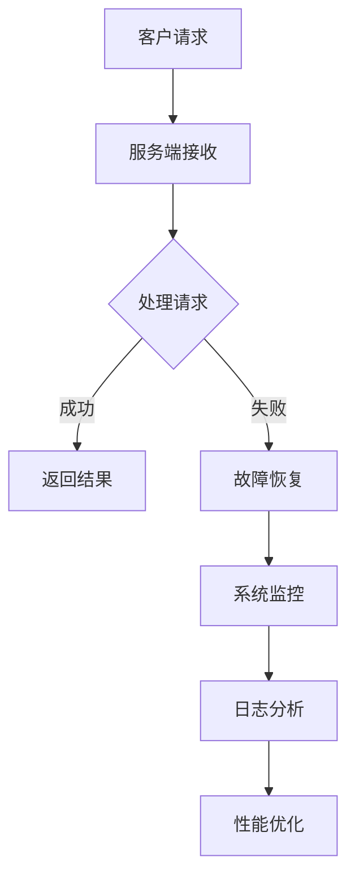

                 

关键词：SRE，站点可靠性工程，系统稳定性，故障恢复，性能优化

> 摘要：本文将深入探讨站点可靠性工程（SRE）的基本概念、核心原则以及在实际应用中的重要性。通过具体案例和算法原理的讲解，帮助读者理解和掌握确保系统稳定性的方法。

## 1. 背景介绍

在当今数字化时代，系统的稳定性和可靠性成为企业成功的关键因素之一。随着互联网技术的迅速发展，系统面临的服务请求量日益增长，服务中断或故障所带来的损失难以承受。因此，站点可靠性工程（SRE，Site Reliability Engineering）作为一项新兴的工程实践，受到了广泛关注。

SRE起源于Google，它将工程实践与运维相结合，以可靠性、性能和安全性为目标，确保系统在高可用性、高性能和易维护性方面达到最佳状态。SRE的核心目标是确保系统的持续运行，同时提供高质量的运维服务。

## 2. 核心概念与联系

### 2.1 SRE的基本概念

站点可靠性工程（SRE）是一组实践，它将软件开发和系统运维结合起来，确保系统的可用性、稳定性和性能。SRE的核心原则包括以下几点：

- **自动化**：通过自动化工具和脚本，减少人工干预，提高运维效率。
- **监控**：实时监控系统的运行状态，及时发现并处理问题。
- **故障恢复**：设计高效的故障恢复机制，确保系统在故障发生时能够快速恢复。
- **性能优化**：持续优化系统的性能，提高用户体验。

### 2.2 SRE与IT运维的关系

SRE与传统的IT运维有显著的区别。传统的IT运维更侧重于保障系统硬件和软件的运行，而SRE则更加注重系统的高可用性、性能和可靠性。SRE采用自动化、监控和故障恢复等手段，减少人为错误，提高系统的运维效率。

### 2.3 SRE与软件开发的关系

SRE与软件开发有着紧密的联系。SRE团队通常会与开发团队合作，共同设计和实现系统的可靠性保障措施。SRE团队负责编写和维护自动化脚本，监控系统的运行状态，并在故障发生时进行快速响应和恢复。这使得SRE团队能够更好地理解系统的需求，提供高质量的运维服务。

### 2.4 SRE架构的Mermaid流程图



## 3. 核心算法原理 & 具体操作步骤

### 3.1 算法原理概述

SRE的核心算法包括自动化脚本编写、监控数据采集、故障恢复策略设计等。这些算法旨在提高系统的可靠性和性能。

### 3.2 算法步骤详解

#### 3.2.1 自动化脚本编写

自动化脚本是SRE的核心组成部分。编写高效、可靠的自动化脚本，可以大幅提高运维效率，减少人为错误。以下是自动化脚本编写的步骤：

1. 分析运维需求，确定自动化脚本的功能。
2. 选择合适的脚本语言（如Python、Shell等）。
3. 编写脚本代码，实现自动化功能。
4. 测试和调试脚本，确保其正常运行。

#### 3.2.2 监控数据采集

监控是确保系统稳定性的重要手段。通过监控数据采集，可以实时了解系统的运行状态，及时发现并处理问题。以下是监控数据采集的步骤：

1. 确定监控指标，如CPU利用率、内存占用、网络流量等。
2. 选择合适的监控工具（如Prometheus、Grafana等）。
3. 配置监控规则，设置报警阈值。
4. 收集监控数据，并存储到监控平台。

#### 3.2.3 故障恢复策略设计

故障恢复策略是SRE的核心算法之一。通过设计高效的故障恢复策略，可以在故障发生时迅速恢复系统。以下是故障恢复策略设计的步骤：

1. 分析系统故障类型，确定故障恢复目标。
2. 设计故障检测机制，及时发现故障。
3. 设计故障恢复方案，包括故障转移、重启服务、数据恢复等。
4. 测试和验证故障恢复策略，确保其有效性。

### 3.3 算法优缺点

#### 3.3.1 自动化脚本编写的优点

- 提高运维效率，减少人力成本。
- 减少人为错误，提高系统稳定性。
- 可重复执行，确保操作的准确性和一致性。

#### 3.3.1 自动化脚本编写的缺点

- 脚本编写和维护需要较高的技术门槛。
- 脚本运行过程中可能出现意外错误，需要及时修复。

#### 3.3.2 监控数据采集的优点

- 实时了解系统运行状态，及时发现并处理问题。
- 提供数据支持，为系统性能优化提供依据。
- 帮助企业了解用户行为，优化产品体验。

#### 3.3.2 监控数据采集的缺点

- 监控数据量庞大，需要处理和分析。
- 监控工具的配置和运维需要投入大量人力和物力。

#### 3.3.3 故障恢复策略设计的优点

- 提高系统故障恢复速度，减少故障带来的损失。
- 提高系统可用性，降低故障率。
- 增强企业应对突发事件的能力。

#### 3.3.3 故障恢复策略设计的缺点

- 故障恢复策略设计需要丰富经验和专业知识。
- 故障恢复过程中可能引发新的问题，需要谨慎处理。

### 3.4 算法应用领域

SRE算法在各个领域都有广泛的应用。以下是一些典型的应用场景：

- **互联网企业**：通过SRE算法，互联网企业可以确保系统的稳定性和高性能，提供优质的用户体验。
- **金融行业**：金融行业的系统对稳定性和安全性要求极高，SRE算法有助于确保金融交易的顺利进行。
- **医疗行业**：医疗行业的系统涉及患者生命安全，SRE算法可以提高系统的可靠性和稳定性，保障患者安全。
- **云计算**：云计算企业通过SRE算法，确保云服务的稳定性和可靠性，提高客户满意度。

## 4. 数学模型和公式 & 详细讲解 & 举例说明

### 4.1 数学模型构建

SRE中的数学模型主要包括以下几个部分：

1. **故障率模型**：用于预测系统的故障率，评估系统的稳定性。
2. **性能模型**：用于分析系统的性能，包括响应时间、吞吐量等指标。
3. **优化模型**：用于优化系统的配置和资源分配，提高系统的性能和可靠性。

### 4.2 公式推导过程

1. **故障率模型**：故障率（λ）是单位时间内发生故障的次数。

$$
\lambda = \frac{N}{T}
$$

其中，N是单位时间内发生的故障次数，T是时间。

2. **性能模型**：响应时间（T）是系统处理请求所需的时间。

$$
T = \frac{1}{\mu}
$$

其中，μ是系统的处理速度。

3. **优化模型**：资源利用率（U）是系统资源的使用率。

$$
U = \frac{C}{C + W}
$$

其中，C是系统当前资源量，W是系统待分配资源量。

### 4.3 案例分析与讲解

假设某互联网企业的系统每天处理100万次请求，平均每次请求的处理时间为2秒。现在，需要优化系统的性能，提高用户体验。

1. **故障率模型**：根据故障率模型，计算系统的故障率。

$$
\lambda = \frac{N}{T} = \frac{100万}{1天 \times 24小时 \times 60分钟 \times 60秒} = 0.0278次/秒
$$

2. **性能模型**：根据性能模型，计算系统的平均响应时间。

$$
T = \frac{1}{\mu} = \frac{1}{\frac{100万}{2秒}} = 0.02秒
$$

3. **优化模型**：根据优化模型，计算系统的资源利用率。

$$
U = \frac{C}{C + W} = \frac{100万}{100万 + 100万} = 0.5
$$

根据计算结果，可以得出以下结论：

- 系统的故障率较低，稳定性较好。
- 系统的响应时间较短，性能良好。
- 系统的资源利用率较高，需要进一步优化资源配置。

## 5. 项目实践：代码实例和详细解释说明

### 5.1 开发环境搭建

1. 安装Python 3.8及以上版本。
2. 安装必备的Python库，如requests、pandas、numpy等。

### 5.2 源代码详细实现

以下是一个简单的SRE脚本示例，用于监控系统的运行状态并触发故障恢复。

```python
import requests
import time
import pandas as pd

# 监控API地址
url = "http://your-monitor-server/api/healthcheck"

# 故障恢复API地址
recovery_url = "http://your-recovery-server/api/recovery"

# 监控间隔时间（秒）
interval = 60

# 故障恢复阈值（秒）
threshold = 300

# 监控数据存储文件
file_path = "monitor_data.csv"

def check_health():
    try:
        response = requests.get(url)
        if response.status_code == 200:
            print("系统运行正常。")
        else:
            print("系统异常。")
            trigger_recovery()
    except Exception as e:
        print(f"监控异常：{e}")
        trigger_recovery()

def trigger_recovery():
    try:
        response = requests.post(recovery_url)
        if response.status_code == 200:
            print("故障恢复成功。")
        else:
            print("故障恢复失败。")
    except Exception as e:
        print(f"故障恢复异常：{e}")

def save_data(data):
    df = pd.DataFrame(data, index=[0])
    df.to_csv(file_path, mode='a', header=not pd.io.common.file_exists(file_path), index=False)

while True:
    check_health()
    data = {"time": time.time(), "status": "normal"}
    save_data(data)
    time.sleep(interval)
```

### 5.3 代码解读与分析

1. **函数定义**：脚本定义了三个函数，分别是`check_health()`、`trigger_recovery()`和`save_data()`。

   - `check_health()`函数用于检查系统运行状态，调用监控API并判断响应状态码。
   - `trigger_recovery()`函数用于触发故障恢复，调用故障恢复API。
   - `save_data()`函数用于将监控数据保存到CSV文件。

2. **监控逻辑**：脚本以固定的间隔时间（`interval`）调用`check_health()`函数，检查系统运行状态。如果系统异常，则调用`trigger_recovery()`函数进行故障恢复。

3. **数据存储**：脚本将每次监控的数据（时间戳和状态）保存到CSV文件，以便后续分析和处理。

### 5.4 运行结果展示

运行脚本后，监控数据将被保存到CSV文件。通过分析CSV文件中的数据，可以了解系统的运行状态和故障恢复情况。

## 6. 实际应用场景

SRE在实际应用场景中具有广泛的应用，以下是一些典型的应用场景：

- **互联网企业**：互联网企业通常需要处理海量的用户请求，通过SRE算法，可以确保系统的稳定性和高性能，提供优质的用户体验。
- **金融行业**：金融行业的系统对稳定性和安全性要求极高，SRE算法有助于确保金融交易的顺利进行，防止系统故障导致的损失。
- **医疗行业**：医疗行业的系统涉及患者生命安全，SRE算法可以提高系统的可靠性和稳定性，保障患者安全。
- **云计算**：云计算企业通过SRE算法，确保云服务的稳定性和可靠性，提高客户满意度。

## 7. 未来应用展望

随着云计算、大数据和人工智能等技术的发展，SRE在未来将具有更广阔的应用前景。以下是一些未来应用展望：

- **智能化监控与故障恢复**：通过引入人工智能技术，实现智能化监控和故障恢复，提高系统的自动化程度和响应速度。
- **混合云架构**：随着混合云架构的普及，SRE将在混合云环境中发挥重要作用，确保跨云环境的系统稳定性和可靠性。
- **边缘计算**：随着边缘计算的发展，SRE算法将应用于边缘计算场景，提高边缘节点的稳定性和性能。

## 8. 工具和资源推荐

### 8.1 学习资源推荐

- 《SRE：构建和运行大规模分布式系统》
- 《谷歌技术基础设施：大规模分布式系统的设计原则与实践》
- 《站点可靠性工程实践：构建可靠、稳定和高效的云计算平台》

### 8.2 开发工具推荐

- Prometheus：开源监控解决方案，适用于大规模分布式系统。
- Grafana：开源可视化仪表盘，可与Prometheus集成。
- Kubernetes：开源容器编排平台，适用于容器化应用部署和运维。

### 8.3 相关论文推荐

- "Principles of Site Reliability Engineering"（站点可靠性工程原理）
- "Google's Site Reliability Engineering: How Google runs production systems"（谷歌的站点可靠性工程：如何运行生产系统）
- "A Scalable and Composable Monitoring System for Cloud Services"（云服务的可扩展和可组合监控系统）

## 9. 总结：未来发展趋势与挑战

### 9.1 研究成果总结

SRE作为一项新兴的工程实践，已经在多个领域取得了显著成果。通过引入自动化、监控和故障恢复等手段，SRE显著提高了系统的可靠性和性能，降低了运维成本。

### 9.2 未来发展趋势

- **智能化**：随着人工智能技术的发展，SRE将实现智能化监控和故障恢复，提高系统的自动化程度。
- **云计算与边缘计算**：随着云计算和边缘计算的普及，SRE将在跨云环境和边缘计算场景中发挥重要作用。
- **混合云架构**：混合云架构将成为主流，SRE将在混合云环境中提供可靠性和性能保障。

### 9.3 面临的挑战

- **复杂度**：随着系统的复杂度增加，SRE的运维和管理难度也将增大。
- **数据安全**：监控系统采集的数据量庞大，需要确保数据的安全性和隐私性。
- **人才短缺**：SRE领域的人才需求不断增加，但相关人才的培养和储备仍不足。

### 9.4 研究展望

未来，SRE将在智能化、云计算、边缘计算等领域取得更多突破。通过引入新技术和新方法，SRE将实现更高的系统可靠性和性能，为企业和用户带来更好的体验。

## 9. 附录：常见问题与解答

### Q：SRE与传统运维有何区别？

A：SRE与传统运维的主要区别在于，SRE更注重系统的可靠性、性能和安全性，采用自动化、监控和故障恢复等手段，提高运维效率和系统稳定性。

### Q：如何确保SRE算法的有效性？

A：确保SRE算法的有效性，需要从以下几个方面入手：

1. **充分理解业务需求**：深入了解系统的业务需求和运行模式，设计合适的SRE算法。
2. **测试和验证**：在实施SRE算法前，进行充分的测试和验证，确保其能够正常工作。
3. **持续优化**：根据系统运行情况和用户反馈，不断优化SRE算法，提高其性能和可靠性。

### Q：SRE在云计算场景中的优势是什么？

A：SRE在云计算场景中的优势主要体现在以下几个方面：

1. **可靠性保障**：通过自动化和监控手段，确保云计算平台的稳定性和可靠性。
2. **性能优化**：通过对系统资源的优化配置和调度，提高云计算平台的性能和吞吐量。
3. **成本控制**：通过自动化和智能化手段，降低运维成本，提高资源利用率。

### Q：如何确保SRE算法的数据安全性？

A：确保SRE算法的数据安全性，需要从以下几个方面入手：

1. **数据加密**：对监控系统采集的数据进行加密，防止数据泄露。
2. **访问控制**：严格控制对数据存储和处理的访问权限，防止未经授权的访问。
3. **数据备份与恢复**：定期备份监控系统数据，确保在数据丢失或损坏时能够及时恢复。

---

**作者：禅与计算机程序设计艺术 / Zen and the Art of Computer Programming**

