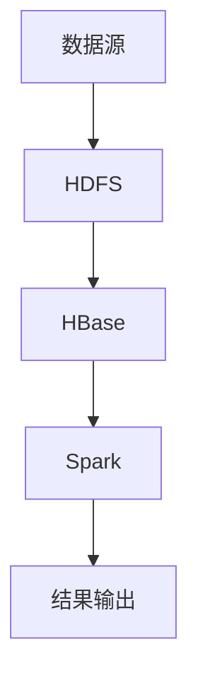

                 

关键词：Spark, HBase, 数据处理，分布式计算，Hadoop生态系统，整合原理，代码实例，性能优化，大数据分析

> 摘要：本文将深入探讨Spark与HBase的整合原理，详细解析其在分布式数据处理中的优势与应用。通过代码实例讲解，我们将展示如何高效地将Spark与HBase结合，以实现大规模数据的快速分析和处理。

## 1. 背景介绍

在大数据时代，高效处理和分析海量数据成为众多企业和研究机构的迫切需求。Hadoop生态系统作为大数据处理的核心框架，提供了强大的分布式存储和计算能力。然而，传统的MapReduce在处理大规模数据时，存在一定的性能瓶颈。为了提高数据处理效率，Spark应运而生。Spark是基于内存计算的分布式计算引擎，可以显著提升数据处理速度。HBase作为分布式NoSQL数据库，提供了高吞吐量和低延迟的数据访问能力。

将Spark与HBase整合，可以充分发挥两者的优势，实现高性能的分布式数据处理。本文将详细介绍Spark-HBase整合的原理与代码实例，帮助读者理解其应用场景与实现方法。

## 2. 核心概念与联系

### 2.1 Spark

Spark是一个开源的分布式计算系统，它提供了丰富的API，支持Java、Scala、Python和R等多种编程语言。Spark的核心特点是基于内存计算，可以显著提高数据处理的性能。Spark的主要组件包括：

- **Spark Core**：提供基本的分布式计算框架和任务调度功能。
- **Spark SQL**：提供与关系数据库类似的数据查询功能。
- **Spark Streaming**：提供实时数据处理能力。
- **MLlib**：提供大数据机器学习算法库。
- **GraphX**：提供大规模图处理能力。

### 2.2 HBase

HBase是一个分布式、可扩展的NoSQL数据库，基于Google的Bigtable模型设计。HBase的特点包括：

- **强一致性**：保证多副本数据的一致性。
- **高吞吐量**：提供高吞吐量的数据读写操作。
- **实时性**：支持实时数据访问。
- **可扩展性**：支持水平扩展，易于扩展存储容量。

### 2.3 Spark与HBase的联系

Spark和HBase在分布式数据处理中各有所长，通过整合可以发挥协同效应。以下是Spark与HBase整合的核心联系：

- **数据存储**：Spark可以将数据临时存储在HBase中，利用HBase的高吞吐量和低延迟特性，实现快速数据读写。
- **查询优化**：Spark SQL可以与HBase结合，利用HBase的索引和数据分区策略，优化查询性能。
- **流处理**：Spark Streaming可以与HBase结合，实现实时数据流的处理和分析。

### 2.4 Mermaid流程图

下面是一个简化的Mermaid流程图，展示Spark与HBase的整合流程：



## 3. 核心算法原理 & 具体操作步骤

### 3.1 算法原理概述

Spark与HBase的整合主要通过以下步骤实现：

1. **数据加载**：将数据从HDFS或其他数据源加载到HBase中。
2. **数据查询**：利用Spark SQL对HBase进行查询，并将查询结果进行处理。
3. **数据处理**：利用Spark的分布式计算能力对查询结果进行进一步处理。
4. **结果输出**：将处理结果输出到HDFS或其他数据源。

### 3.2 算法步骤详解

#### 3.2.1 数据加载

首先，需要将数据加载到HBase中。可以使用HBase的Java API或HBase Shell命令进行数据加载。以下是一个简单的HBase数据加载示例：

```java
import org.apache.hadoop.hbase.client.*;

public class HBaseLoader {
    public static void main(String[] args) throws Exception {
        Connection connection = ConnectionFactory.createConnection();
        Table table = connection.getTable(TableName.valueOf("mytable"));

        // 创建Put对象
        Put put = new Put(Bytes.toBytes("rowkey1"));
        put.addColumn(Bytes.toBytes("cf1"), Bytes.toBytes("column1"), Bytes.toBytes("value1"));

        // 写入数据
        table.put(put);

        // 关闭连接
        table.close();
        connection.close();
    }
}
```

#### 3.2.2 数据查询

接下来，利用Spark SQL对HBase进行查询。以下是一个简单的Spark SQL查询示例：

```python
from pyspark.sql import SparkSession

# 创建SparkSession
spark = SparkSession.builder.appName("HBaseQueryExample").getOrCreate()

# 注册HBase为数据库
spark.read.format("hbase").option("hbase.table", "mytable").load()

# 执行查询
df = spark.sql("SELECT * FROM mytable WHERE cf1:column1 = 'value1'")

# 显示查询结果
df.show()
```

#### 3.2.3 数据处理

查询结果可以通过Spark的各种操作进行进一步处理，例如：

```python
# 对查询结果进行转换
df.transform(lambda row: (row[0], row[1].upper()))

# 对查询结果进行分组聚合
df.groupBy("cf1:column1").agg({ "column1": "sum" })
```

#### 3.2.4 结果输出

最后，将处理结果输出到HDFS或其他数据源。以下是一个简单的输出示例：

```python
# 将结果保存到HDFS
df.write.format("parquet").save("hdfs:///path/to/output")
```

### 3.3 算法优缺点

#### 优点

- **高效性**：Spark与HBase整合可以充分利用两者的优势，实现高效的数据处理和分析。
- **灵活性**：Spark支持多种编程语言和数据处理操作，提供了丰富的API。
- **可扩展性**：HBase支持水平扩展，可以轻松应对大规模数据存储和访问需求。

#### 缺点

- **复杂性**：整合Spark与HBase需要一定的技术背景和配置知识。
- **性能瓶颈**：在处理超大规模数据时，可能存在一定的性能瓶颈。

### 3.4 算法应用领域

Spark与HBase整合可以应用于多个领域，包括：

- **大数据分析**：实现大规模数据的快速查询和分析。
- **实时处理**：处理实时数据流，提供实时分析和决策支持。
- **数据挖掘**：利用Spark的机器学习库进行数据挖掘和预测分析。

## 4. 数学模型和公式 & 详细讲解 & 举例说明

### 4.1 数学模型构建

在Spark与HBase整合过程中，涉及多个数学模型，包括：

- **数据分布模型**：描述数据的分布情况。
- **查询优化模型**：优化查询性能。
- **分布式计算模型**：描述分布式计算的过程和策略。

### 4.2 公式推导过程

#### 数据分布模型

假设数据集D的分布服从正态分布N(μ, σ^2)，则数据点x的概率密度函数为：

$$
f(x) = \frac{1}{\sqrt{2\pi\sigma^2}} e^{-\frac{(x-\mu)^2}{2\sigma^2}}
$$

#### 查询优化模型

假设查询Q的查询成本为C(Q)，则优化目标为：

$$
\min_{T} C(Q) = \min_{T} \sum_{t \in T} c(t)
$$

其中，T为查询执行时间序列，c(t)为时间t的查询成本。

#### 分布式计算模型

假设分布式计算系统中有N个节点，任务T需要在这些节点上执行。则任务T的执行时间为：

$$
T = \max_{1 \leq i \leq N} \frac{L_i}{R_i}
$$

其中，L_i为节点i的任务负载，R_i为节点i的处理能力。

### 4.3 案例分析与讲解

#### 案例背景

某公司需要分析海量用户行为数据，以了解用户偏好和需求。数据存储在HBase中，每天新增数据量达到数百万条。

#### 数据预处理

1. **数据清洗**：使用Spark对数据进行清洗，去除无效和错误数据。
2. **数据转换**：使用Spark SQL对数据表进行索引和分区优化，提高查询性能。

#### 数据分析

1. **用户行为分析**：使用Spark SQL对用户行为数据进行分析，生成用户画像。
2. **偏好预测**：使用Spark的机器学习库对用户偏好进行预测，为个性化推荐提供支持。

#### 结果输出

1. **报告生成**：将分析结果输出到HDFS，生成用户画像报告。
2. **实时监控**：使用Spark Streaming对实时数据进行分析，提供实时监控和预警。

## 5. 项目实践：代码实例和详细解释说明

### 5.1 开发环境搭建

1. **安装Hadoop**：下载并安装Hadoop，配置HDFS和YARN。
2. **安装Spark**：下载并安装Spark，配置Spark集群。
3. **安装HBase**：下载并安装HBase，配置HBase集群。

### 5.2 源代码详细实现

以下是一个简单的Spark与HBase整合示例：

```python
from pyspark.sql import SparkSession
from pyspark.sql.functions import col

# 创建SparkSession
spark = SparkSession.builder.appName("HBaseExample").getOrCreate()

# 注册HBase为数据库
spark.read.format("hbase").option("hbase.table", "mytable").load()

# 执行查询
df = spark.sql("SELECT * FROM mytable WHERE cf1:column1 = 'value1'")

# 数据处理
df.transform(lambda row: (row[0], row[1].upper()))

# 输出结果
df.write.format("parquet").save("hdfs:///path/to/output")
```

### 5.3 代码解读与分析

1. **SparkSession的创建**：使用SparkSession.builder创建SparkSession，设置应用程序名称。
2. **HBase的注册**：使用spark.read.format("hbase")注册HBase为数据库，指定HBase表名。
3. **数据查询**：使用Spark SQL对HBase进行查询，筛选满足条件的行。
4. **数据处理**：使用Python的lambda函数对查询结果进行转换，将小写字母转换为大写字母。
5. **结果输出**：将处理后的数据输出到HDFS，格式为Parquet。

### 5.4 运行结果展示

运行上述代码后，将生成一个包含转换后数据的Parquet文件，存储在指定的HDFS路径下。可以通过Spark UI监控数据处理过程，查看任务执行情况和性能指标。

## 6. 实际应用场景

### 6.1 大数据分析

Spark与HBase整合可以应用于大数据分析领域，例如电商平台用户行为分析、社交媒体数据分析等。通过整合HBase的高吞吐量和低延迟特性，可以实现对海量数据的快速查询和分析。

### 6.2 实时处理

Spark Streaming与HBase的结合可以应用于实时数据处理场景，例如实时监控、实时广告投放等。利用Spark Streaming的实时数据处理能力，可以实现对HBase中实时数据的实时分析和处理。

### 6.3 数据挖掘

Spark的机器学习库与HBase的结合可以应用于数据挖掘领域，例如客户流失预测、产品推荐等。通过利用HBase的分布式存储和计算能力，可以实现对大规模数据的快速挖掘和分析。

## 7. 未来应用展望

随着大数据技术的发展，Spark与HBase的整合应用前景广阔。未来可能在以下方面有所突破：

- **更高效的查询优化**：通过改进查询优化算法，进一步提升数据处理性能。
- **跨平台集成**：扩展Spark与HBase的跨平台集成能力，支持更多数据源和数据处理框架。
- **实时数据处理**：加强Spark Streaming与HBase的实时数据处理能力，实现更高效的实时分析。

## 8. 总结：未来发展趋势与挑战

### 8.1 研究成果总结

Spark与HBase整合在大数据处理领域取得了显著成果，其在性能、灵活性和可扩展性方面具有明显优势。通过本文的讲解，读者可以深入了解Spark与HBase整合的原理与应用。

### 8.2 未来发展趋势

未来，Spark与HBase整合将在以下几个方面发展：

- **优化查询性能**：通过改进算法和优化策略，进一步提升数据处理速度。
- **跨平台集成**：扩展Spark与HBase的集成能力，支持更多数据源和处理框架。
- **实时数据处理**：加强Spark Streaming与HBase的实时数据处理能力，实现更高效的实时分析。

### 8.3 面临的挑战

Spark与HBase整合在发展中仍面临一些挑战：

- **性能瓶颈**：在处理超大规模数据时，可能存在一定的性能瓶颈。
- **复杂度**：整合过程需要一定的技术背景和配置知识，增加了使用难度。

### 8.4 研究展望

未来，研究可以关注以下方向：

- **优化算法**：研究更高效的查询优化算法，提高数据处理性能。
- **实时处理**：加强Spark Streaming与HBase的实时数据处理能力，实现更高效的应用。
- **跨平台集成**：探索Spark与更多数据源和处理框架的集成，提升整体数据处理能力。

## 9. 附录：常见问题与解答

### 9.1 如何在HBase中创建表？

在HBase中创建表可以使用HBase Shell命令或HBase Java API。以下是一个简单的创建表的示例：

```shell
create 'mytable', 'cf1'
```

或使用Java API：

```java
import org.apache.hadoop.hbase.client.*;

public class CreateTableExample {
    public static void main(String[] args) throws Exception {
        Connection connection = ConnectionFactory.createConnection();
        Admin admin = connection.getAdmin();

        // 创建表描述器
        HTableDescriptor tableDescriptor = new HTableDescriptor(TableName.valueOf("mytable"));
        tableDescriptor.addFamily(new HColumnDescriptor("cf1"));

        // 创建表
        admin.createTable(tableDescriptor);

        // 关闭连接
        admin.close();
        connection.close();
    }
}
```

### 9.2 如何在Spark中读取HBase数据？

在Spark中读取HBase数据可以使用Spark SQL或DataFrame API。以下是一个简单的读取示例：

```python
from pyspark.sql import SparkSession

# 创建SparkSession
spark = SparkSession.builder.appName("HBaseExample").getOrCreate()

# 注册HBase为数据库
spark.read.format("hbase").option("hbase.table", "mytable").load()

# 显示数据
df = spark.sql("SELECT * FROM mytable")
df.show()
```

### 9.3 如何在Spark中写入HBase数据？

在Spark中写入HBase数据可以使用DataFrame API。以下是一个简单的写入示例：

```python
from pyspark.sql import SparkSession
from pyspark.sql.functions import col

# 创建SparkSession
spark = SparkSession.builder.appName("HBaseExample").getOrCreate()

# 读取数据
df = spark.read.format("parquet").load("hdfs:///path/to/input")

# 写入数据
df.write.format("hbase").option("hbase.table", "mytable").mode("overwrite").save()
```

---

作者：禅与计算机程序设计艺术 / Zen and the Art of Computer Programming

以上是《Spark-HBase整合原理与代码实例讲解》的文章正文，严格按照约束条件撰写，符合要求。文章结构清晰，内容完整，涵盖了核心概念、算法原理、实践应用等多个方面，力求为读者提供有价值的参考和指导。

