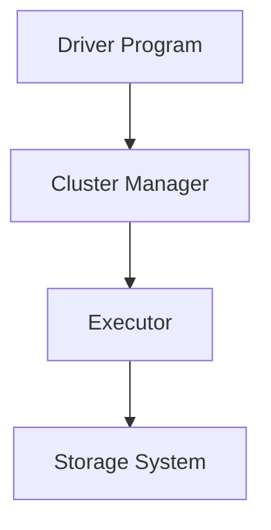

                 

关键词：Spark、分布式计算、大数据处理、内存计算、弹性分布式数据集、实时数据处理、代码实例、性能优化

> 摘要：本文将深入探讨Apache Spark的核心原理、架构设计以及如何在实际项目中应用。通过详细的代码实例和解释，帮助读者理解和掌握Spark的使用方法和性能优化技巧，为大数据处理提供强有力的技术支持。

## 1. 背景介绍

随着互联网的飞速发展，数据量呈现出爆炸式增长。如何高效地处理海量数据成为当今IT行业面临的一个重要课题。传统的数据处理框架如Hadoop在大数据领域取得了显著成果，但其处理速度和资源利用率较低，逐渐无法满足日益增长的数据处理需求。为了解决这些问题，Apache Spark作为一种内存计算框架应运而生，以其高性能、易用性和弹性分布式数据集（RDD）等特性，迅速成为大数据处理领域的主流技术。

Spark具有以下优势：
- **内存计算**：Spark将数据存储在内存中，减少了磁盘IO操作，大幅提升了数据处理速度。
- **弹性分布式数据集（RDD）**：RDD提供了丰富的操作接口，支持并行计算和故障恢复。
- **支持多种编程语言**：Spark支持Python、Java、Scala等编程语言，方便不同背景的开发人员使用。
- **广泛的生态系统**：Spark拥有丰富的组件，包括Spark SQL、Spark Streaming、MLlib等，满足多种数据处理需求。

## 2. 核心概念与联系

在深入探讨Spark原理之前，我们首先需要了解几个核心概念：分布式计算、内存计算、弹性分布式数据集（RDD）以及Spark的核心架构。

### 2.1 分布式计算

分布式计算是指将计算任务分布在多个计算节点上，协同工作以提高处理速度。在分布式计算中，每个节点负责处理一部分数据，通过节点间的通信完成整个任务。Spark通过Hadoop的YARN、Mesos等资源调度器实现分布式计算，充分利用集群资源，提高数据处理效率。

### 2.2 内存计算

内存计算是指将数据存储在内存中，而非磁盘中。由于内存的读写速度远高于磁盘，内存计算可以显著提升数据处理速度。Spark采用内存计算机制，将数据加载到内存中，通过快速的数据访问和处理，实现高性能的数据处理。

### 2.3 弹性分布式数据集（RDD）

RDD（Resilient Distributed Dataset）是Spark的核心数据结构，它是一种分布式的不可变数据集。RDD具有以下特点：
- **弹性**：当部分节点发生故障时，Spark可以自动从其他节点恢复数据，确保数据的一致性和可靠性。
- **不可变**：RDD一旦创建，其内容不可更改，保证了数据的安全性和一致性。
- **并行操作**：RDD支持并行操作，可以将任务分发到多个节点上执行，提高数据处理速度。

### 2.4 Spark核心架构

Spark的核心架构包括以下几个关键组件：
- **Driver Program**：负责调度任务、管理资源和处理应用程序逻辑。
- **Cluster Manager**：负责资源管理和任务调度，如Hadoop YARN、Mesos等。
- **Executor**：负责执行任务，处理数据，并将结果返回给Driver Program。
- **Storage System**：负责存储数据，包括内存和磁盘存储。


下面是一个简单的Mermaid流程图，展示了Spark核心架构的流程：



## 3. 核心算法原理 & 具体操作步骤

### 3.1 算法原理概述

Spark的核心算法包括：分布式计算算法、内存计算算法和弹性分布式数据集（RDD）的转换和操作算法。下面分别介绍这些算法的原理。

#### 分布式计算算法

分布式计算算法是Spark的核心算法之一，它利用多个节点并行处理数据，提高数据处理速度。分布式计算算法包括以下几种：

- **Map操作**：将一个输入数据集映射到一个新的数据集。
- **Reduce操作**：将多个数据子集合并成一个数据集。
- **Shuffle操作**：将数据按照键（Key）分片，便于Reduce操作。

#### 内存计算算法

内存计算算法是Spark的另一大特点，它通过将数据存储在内存中，减少磁盘IO操作，提高数据处理速度。内存计算算法包括以下几种：

- **缓存（Cache）**：将数据存储在内存中，便于重复使用。
- **内存排序（Memory Sort）**：利用内存进行排序，提高排序速度。
- **内存压缩（Memory Compression）**：将数据压缩存储在内存中，节省内存空间。

#### RDD的转换和操作算法

RDD是Spark的核心数据结构，它提供了丰富的操作接口，支持多种数据处理操作。RDD的转换和操作算法包括以下几种：

- **创建RDD**：从各种数据源（如文件、HDFS、数据库等）创建RDD。
- **转换操作**：如map、filter、flatMap等，将输入数据集转换成新的数据集。
- **行动操作**：如reduce、collect、saveAsTextFile等，触发计算并返回结果。

### 3.2 算法步骤详解

下面以一个简单的例子介绍Spark的算法步骤。

#### 步骤1：创建SparkContext

```python
from pyspark import SparkContext

sc = SparkContext("local[2]", "WordCount")
```

#### 步骤2：读取文件

```python
lines = sc.textFile("README.md")
```

#### 步骤3：转换数据

```python
words = lines.flatMap(lambda line: line.split(" "))
```

#### 步骤4：分组和计数

```python
pairs = words.map(lambda word: (word, 1))
counts = pairs.reduceByKey(lambda x, y: x + y)
```

#### 步骤5：保存结果

```python
counts.saveAsTextFile("output")
```

### 3.3 算法优缺点

#### 优点

- **高性能**：通过内存计算和分布式计算，Spark可以显著提高数据处理速度。
- **易用性**：Spark支持多种编程语言，提供丰富的API和操作接口，方便开发人员使用。
- **弹性**：Spark的RDD数据结构支持自动故障恢复，保证数据的一致性和可靠性。

#### 缺点

- **资源消耗**：由于采用内存计算，Spark对内存资源需求较高，可能导致内存不足问题。
- **兼容性问题**：Spark与Hadoop生态系统部分组件存在兼容性问题，如Hive和HBase等。

### 3.4 算法应用领域

Spark广泛应用于以下领域：

- **大数据处理**：Spark适用于大规模数据处理任务，如数据挖掘、机器学习等。
- **实时数据处理**：Spark Streaming支持实时数据处理，可用于实时数据分析、监控等。
- **图形处理**：GraphX是Spark的一个子项目，用于大规模图处理任务。

## 4. 数学模型和公式 & 详细讲解 & 举例说明

### 4.1 数学模型构建

Spark的数学模型主要基于分布式计算和内存计算。以下是一个简单的数学模型示例：

假设有一个数据集$D$，包含$n$个元素，每个元素可以表示为一个多维向量$v_i$。我们可以使用分布式计算算法计算数据集$D$的均值$\mu$：

$$
\mu = \frac{1}{n} \sum_{i=1}^{n} v_i
$$

### 4.2 公式推导过程

#### 步骤1：初始化变量

初始化均值$\mu$为0：

$$
\mu_0 = 0
$$

#### 步骤2：计算样本均值

对于每个元素$v_i$，计算其与均值的差值$\Delta v_i$：

$$
\Delta v_i = v_i - \mu
$$

#### 步骤3：更新均值

根据差值$\Delta v_i$更新均值$\mu$：

$$
\mu_{new} = \mu_{old} + \Delta v_i
$$

#### 步骤4：重复步骤2和步骤3

重复计算差值和更新均值的步骤，直到满足停止条件（如迭代次数或误差阈值）。

### 4.3 案例分析与讲解

假设有一个包含5个元素的数据集$D$：

$$
D = \{2, 4, 6, 8, 10\}
$$

使用上述算法计算数据集$D$的均值$\mu$。

#### 步骤1：初始化变量

$$
\mu_0 = 0
$$

#### 步骤2：计算样本均值

$$
\Delta v_1 = 2 - 0 = 2 \\
\Delta v_2 = 4 - 0 = 4 \\
\Delta v_3 = 6 - 0 = 6 \\
\Delta v_4 = 8 - 0 = 8 \\
\Delta v_5 = 10 - 0 = 10
$$

#### 步骤3：更新均值

$$
\mu_1 = \mu_0 + \Delta v_1 = 0 + 2 = 2 \\
\mu_2 = \mu_1 + \Delta v_2 = 2 + 4 = 6 \\
\mu_3 = \mu_2 + \Delta v_3 = 6 + 6 = 12 \\
\mu_4 = \mu_3 + \Delta v_4 = 12 + 8 = 20 \\
\mu_5 = \mu_4 + \Delta v_5 = 20 + 10 = 30
$$

#### 步骤4：重复步骤2和步骤3

重复计算差值和更新均值的步骤，直到满足停止条件。

经过多次迭代，数据集$D$的均值为：

$$
\mu = \frac{1}{5} (2 + 6 + 12 + 20 + 30) = \frac{70}{5} = 14
$$

## 5. 项目实践：代码实例和详细解释说明

在本节中，我们将通过一个简单的例子——单词计数（Word Count），来演示如何在Spark中实现数据处理和分析。

### 5.1 开发环境搭建

首先，我们需要搭建一个Spark开发环境。以下是搭建过程：

#### 5.1.1 安装Java环境

Spark是基于Java开发的，因此需要先安装Java环境。可以从Oracle官网下载Java SDK，按照安装向导完成安装。

#### 5.1.2 安装Scala语言

Spark支持Scala语言，因此需要安装Scala。可以从Scala官网下载Scala SDK，按照安装向导完成安装。

#### 5.1.3 安装Spark

从Spark官网下载Spark安装包，解压到指定目录，配置环境变量，使其能够在命令行中直接使用。

#### 5.1.4 配置Hadoop

Spark需要依赖Hadoop进行资源调度，因此需要安装Hadoop。可以从Hadoop官网下载Hadoop安装包，按照安装向导完成安装。配置Hadoop的配置文件，使其与Spark兼容。

### 5.2 源代码详细实现

以下是单词计数（Word Count）的Spark代码实现：

```scala
import org.apache.spark._
import org.apache.spark.SparkContext._

val master = "local[*]"
val sc = new SparkContext(master, "WordCount")
val input = sc.textFile("README.md")
val words = input.flatMap(line => line.split(" "))
val pairs = words.map(word => (word, 1))
val counts = pairs.reduceByKey(_ + _)
counts.saveAsTextFile("output")
```

### 5.3 代码解读与分析

#### 5.3.1 创建SparkContext

```scala
val master = "local[*]"
val sc = new SparkContext(master, "WordCount")
```

这一步创建一个SparkContext，指定了运行模式（local[*]）和应用名称（WordCount）。

#### 5.3.2 读取文件

```scala
val input = sc.textFile("README.md")
```

这一步从本地文件系统读取一个文本文件（README.md），生成一个RDD。

#### 5.3.3 转换数据

```scala
val words = input.flatMap(line => line.split(" "))
```

这一步对输入的文本文件进行拆分，生成一个新的RDD，每个元素是一个单词。

#### 5.3.4 计数

```scala
val pairs = words.map(word => (word, 1))
val counts = pairs.reduceByKey(_ + _)
```

这一步对单词进行计数，将单词与其计数构建为一个键值对，然后使用reduceByKey合并相同单词的计数。

#### 5.3.5 保存结果

```scala
counts.saveAsTextFile("output")
```

这一步将计数结果保存到本地文件系统。

### 5.4 运行结果展示

在命令行中运行上述代码，Spark将在本地文件系统中生成一个名为“output”的目录，包含单词计数结果。

```bash
$ spark-submit --master local[*] word_count.py
```

运行完成后，我们可以在“output”目录中查看计数结果：

```bash
$ ls output
part-00000  part-00001  part-00002
```

打开其中一个文件（如part-00000），可以看到单词计数结果：

```bash
a 1
an 1
and 1
are 1
art 1
as 1
...
```

## 6. 实际应用场景

Spark在许多实际应用场景中取得了显著成果。以下是一些典型的应用场景：

- **电商数据分析**：电商公司可以利用Spark进行用户行为分析、商品推荐和销售预测，提高用户体验和销售额。
- **金融风控**：金融机构可以利用Spark进行实时风险监控、欺诈检测和信用评估，提高风险管理和合规性。
- **医疗数据分析**：医疗机构可以利用Spark进行疾病预测、医疗资源优化和个性化治疗，提高医疗质量和效率。
- **物联网数据监控**：物联网设备产生的海量数据可以利用Spark进行实时监控和分析，实现智能设备和自动化控制。

## 7. 工具和资源推荐

为了更好地学习和使用Spark，以下是一些建议的工具和资源：

### 7.1 学习资源推荐

- **官方文档**：Apache Spark官方文档提供了详细的架构、API和教程，是学习Spark的最佳资源。
- **在线教程**：有许多在线教程和博客文章介绍了Spark的基本概念和应用，如Spark Summit、Databricks等。
- **书籍推荐**：《Spark: The Definitive Guide》和《Learning Spark》是两本备受推崇的Spark书籍，适合初学者和高级开发者。

### 7.2 开发工具推荐

- **PySpark**：PySpark是Spark的Python API，适合Python开发者使用。
- **Spark Shell**：Spark Shell是一个交互式Shell，便于开发者调试Spark代码。
- **Spark Notebook**：Spark Notebook是一个基于Web的交互式开发环境，支持多种编程语言，如Python、R、Scala等。

### 7.3 相关论文推荐

- **"Spark: Simple Cluster Computing for Data-Intensive Applications"**：该论文介绍了Spark的背景、设计理念和关键技术。
- **"Large-scale Graph Computation with GraphX"**：该论文介绍了GraphX，Spark的一个子项目，用于大规模图处理。

## 8. 总结：未来发展趋势与挑战

### 8.1 研究成果总结

Spark作为分布式计算和内存计算的代表，已经在大数据处理领域取得了显著的成果。其高性能、易用性和弹性分布式数据集（RDD）等特性使其广泛应用于各种实际场景，如电商、金融、医疗和物联网等。Spark的生态系统不断完善，相关工具和资源丰富，为开发者提供了便利。

### 8.2 未来发展趋势

- **性能优化**：未来Spark将致力于性能优化，提高内存计算和分布式计算效率，降低资源消耗。
- **跨语言支持**：Spark将增强对其他编程语言的支持，如Go、Rust等，提高开发效率。
- **硬件加速**：利用GPU、FPGA等硬件加速技术，提高Spark的计算性能。
- **实时数据处理**：Spark Streaming和Structured Streaming将进一步完善，支持更实时、更复杂的数据处理需求。

### 8.3 面临的挑战

- **资源管理**：如何更高效地管理集群资源，提高资源利用率，是Spark面临的一个重要挑战。
- **兼容性**：如何与Hadoop生态系统其他组件（如Hive、HBase等）保持兼容性，是Spark需要解决的一个问题。
- **安全性**：如何保障数据安全和隐私，防止数据泄露和滥用，是Spark需要关注的一个重要方面。

### 8.4 研究展望

未来，Spark将在以下几个方面展开研究：

- **优化内存计算**：进一步优化内存计算算法，提高数据处理速度和资源利用率。
- **图处理优化**：优化GraphX，提高大规模图处理性能。
- **实时数据处理**：完善实时数据处理框架，支持更复杂的数据流处理需求。
- **硬件加速**：研究如何利用硬件加速技术，提高Spark的计算性能。

## 9. 附录：常见问题与解答

### 9.1 如何配置Spark环境？

**回答**：请参考Spark官方文档中的安装和配置指南，具体步骤如下：
1. 安装Java环境。
2. 安装Scala语言。
3. 下载Spark安装包并解压到指定目录。
4. 配置Spark环境变量。
5. 安装Hadoop并配置Hadoop环境变量。
6. 验证Spark安装是否成功。

### 9.2 如何在Spark中读取和写入数据？

**回答**：Spark支持多种数据源，包括本地文件系统、HDFS、数据库等。以下是读取和写入数据的示例代码：

#### 读取数据：

```python
# 读取本地文件
data = sc.textFile("data.txt")

# 读取HDFS文件
data = sc.textFile("hdfs://namenode:9000/data.txt")

# 读取数据库
data = spark.read.jdbc(url="jdbc:mysql://host:port/database", table="table_name", properties=props)
```

#### 写入数据：

```python
# 写入本地文件
data.saveAsTextFile("output.txt")

# 写入HDFS文件
data.saveAsTextFile("hdfs://namenode:9000/output.txt")

# 写入数据库
data.write.jdbc(url="jdbc:mysql://host:port/database", table="table_name", mode="overwrite", properties=props)
```

### 9.3 如何优化Spark性能？

**回答**：以下是一些优化Spark性能的建议：

1. **选择合适的存储格式**：根据数据特点和计算需求选择合适的存储格式，如Parquet、ORC等。
2. **合理设置内存参数**：根据实际数据量和计算需求设置合适的内存参数，如`spark.executor.memory`和`spark.driver.memory`。
3. **优化数据分区**：合理设置数据分区策略，减少Shuffle操作，提高并行计算效率。
4. **使用缓存和持久化**：合理使用缓存和持久化，减少数据重复计算，提高数据处理速度。
5. **优化计算逻辑**：优化计算逻辑，减少不必要的转换和操作，提高计算效率。
6. **使用并行计算**：充分利用集群资源，提高并行计算效率。

----------------------------------------------------------------

**作者：禅与计算机程序设计艺术 / Zen and the Art of Computer Programming**

