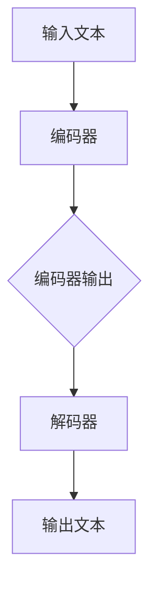

                 

关键词：T5，文本到文本传输变压器，Transformer，自然语言处理，编码器，解码器，深度学习，预训练模型，BERT，GPT，机器翻译，文本生成，文本分类，序列到序列学习

> 摘要：本文将深入探讨T5（Text-to-Text Transfer Transformer）模型的设计原理、实现细节以及在实际应用中的效果。T5是一种基于Transformer架构的预训练模型，其核心思想是通过大规模预训练，使得模型在多个自然语言处理任务上具有强大的迁移能力。本文将详细讲解T5的架构设计、算法原理、数学模型以及代码实现，帮助读者全面理解T5的工作机制和应用场景。

## 1. 背景介绍

随着深度学习技术的不断发展，自然语言处理（NLP）领域取得了显著的进展。其中，基于Transformer架构的预训练模型，如BERT、GPT等，已经成为NLP领域的基石。这些模型通过在大规模语料上进行预训练，可以迁移到各种不同的NLP任务中，如文本分类、机器翻译、问答系统等。

T5模型是Google团队在2020年提出的一种基于Transformer的预训练模型，其核心思想是将所有NLP任务转化为文本到文本的序列到序列（Seq2Seq）问题。T5模型通过统一的预训练目标，使得模型在多个任务上具有强大的通用性和适应性。与传统的预训练模型不同，T5模型采用了更简单、更灵活的架构设计，使得其更容易实现和扩展。

## 2. 核心概念与联系

T5模型的核心概念包括编码器（Encoder）和解码器（Decoder），以及Transformer架构。为了更好地理解T5模型，我们先来回顾一下Transformer架构的基本原理。

### 2.1 Transformer架构

Transformer架构是一种基于自注意力（Self-Attention）机制的深度神经网络模型，其核心思想是利用全局的上下文信息来建模输入序列。Transformer模型由编码器（Encoder）和解码器（Decoder）两个部分组成，编码器负责将输入序列编码为固定长度的向量表示，解码器则根据编码器的输出和先前的解码结果来生成目标序列。

#### 2.1.1 编码器（Encoder）

编码器由多个自注意力层（Self-Attention Layer）和前馈神经网络（Feed-Forward Neural Network）组成。每个自注意力层负责计算输入序列中每个元素之间的相互关系，并通过加权和的方式生成新的表示。编码器的输出是一个固定长度的向量表示，用于捕捉输入序列的全局信息。

#### 2.1.2 解码器（Decoder）

解码器同样由多个自注意力层和前馈神经网络组成。与编码器不同，解码器还包含了一个编码器-解码器注意力层（Encoder-Decoder Attention Layer），用于将编码器的输出作为上下文信息。解码器的每个自注意力层负责计算编码器的输出和当前解码结果之间的相互关系，并通过加权和的方式生成新的表示。解码器的输出是一个目标序列的预测分布。

### 2.2 T5模型

T5模型是对Transformer架构的一种改进，其核心思想是将所有NLP任务转化为文本到文本的序列到序列（Seq2Seq）问题。T5模型采用了以下两个主要设计：

1. **统一任务格式**：T5模型将所有NLP任务统一为输入文本和输出文本的形式。例如，文本分类任务可以表示为“输入文本：[文本]；输出文本：[类别标签]”，机器翻译任务可以表示为“输入文本：[源语言文本]；输出文本：[目标语言文本]”。

2. **简单灵活的架构**：T5模型采用了更简单、更灵活的架构设计，使得其更容易实现和扩展。T5模型由一个固定的Transformer编码器和一个可学习的Transformer解码器组成，编码器的输出直接作为解码器的输入。

### 2.3 Mermaid流程图

下面是一个简单的Mermaid流程图，用于描述T5模型的核心概念和架构：



## 3. 核心算法原理 & 具体操作步骤

### 3.1 算法原理概述

T5模型的核心算法原理基于Transformer架构，主要包括编码器（Encoder）和解码器（Decoder）两个部分。编码器负责将输入文本编码为固定长度的向量表示，解码器则根据编码器的输出和先前的解码结果来生成目标文本。具体操作步骤如下：

1. **编码器**：编码器由多个自注意力层和前馈神经网络组成。每个自注意力层负责计算输入文本中每个元素之间的相互关系，并通过加权和的方式生成新的表示。编码器的输出是一个固定长度的向量表示，用于捕捉输入文本的全局信息。

2. **解码器**：解码器同样由多个自注意力层和前馈神经网络组成。解码器的每个自注意力层负责计算编码器的输出和当前解码结果之间的相互关系，并通过加权和的方式生成新的表示。解码器的输出是一个目标文本的预测分布。

3. **训练过程**：T5模型通过在大规模语料上进行预训练，使得模型在多个NLP任务上具有强大的迁移能力。预训练过程主要包括两个阶段：第一阶段是自回归语言模型（Autoregressive Language Modeling），即根据前一个词预测下一个词；第二阶段是掩码语言模型（Masked Language Modeling），即对输入文本进行部分遮蔽，然后根据上下文信息恢复遮蔽的词。

### 3.2 算法步骤详解

下面是T5模型的详细算法步骤：

1. **输入预处理**：将输入文本转换为序列形式，例如使用词表将文本中的每个词转换为对应的索引。

2. **编码器**：
   - **嵌入层**：将输入序列的索引映射为嵌入向量。
   - **位置编码**：为每个词添加位置编码，以捕捉词的位置信息。
   - **自注意力层**：计算输入序列中每个词之间的相互关系，并通过加权和的方式生成新的表示。
   - **前馈神经网络**：对自注意力层的输出进行非线性变换。

3. **解码器**：
   - **编码器-解码器注意力层**：计算编码器的输出和当前解码结果之间的相互关系，作为上下文信息。
   - **自注意力层**：计算编码器-解码器注意力层的输出和当前解码结果之间的相互关系，并通过加权和的方式生成新的表示。
   - **前馈神经网络**：对自注意力层的输出进行非线性变换。
   - **输出层**：将解码器的输出映射为输出序列的预测分布。

4. **损失函数**：T5模型采用交叉熵损失函数来计算模型在训练过程中的误差。交叉熵损失函数可以衡量预测分布和真实分布之间的差异。

5. **优化过程**：使用梯度下降算法优化模型参数，以降低损失函数的值。

### 3.3 算法优缺点

**优点**：
- **统一任务格式**：T5模型将所有NLP任务转化为文本到文本的序列到序列（Seq2Seq）问题，使得模型具有更强的通用性和适应性。
- **简单灵活的架构**：T5模型采用了更简单、更灵活的架构设计，使得其更容易实现和扩展。
- **强大的迁移能力**：T5模型通过在大规模语料上进行预训练，使得模型在多个NLP任务上具有强大的迁移能力。

**缺点**：
- **计算资源需求高**：T5模型需要进行大规模预训练，需要大量的计算资源和存储空间。
- **训练时间较长**：T5模型训练过程相对较长，需要较长的训练时间才能达到较好的效果。

### 3.4 算法应用领域

T5模型在多个NLP任务上表现出色，以下是一些典型的应用领域：

- **文本分类**：T5模型可以将输入文本分类为不同的类别，例如新闻分类、情感分析等。
- **机器翻译**：T5模型可以将一种语言的文本翻译成另一种语言的文本，例如中文到英文的翻译。
- **问答系统**：T5模型可以回答基于输入文本的问题，例如阅读理解、知识问答等。
- **文本生成**：T5模型可以根据输入文本生成新的文本，例如文章摘要、故事创作等。

## 4. 数学模型和公式 & 详细讲解 & 举例说明

### 4.1 数学模型构建

T5模型的数学模型基于Transformer架构，主要包括编码器（Encoder）和解码器（Decoder）两个部分。下面分别介绍编码器和解码器的数学模型。

#### 4.1.1 编码器

编码器由多个自注意力层（Self-Attention Layer）和前馈神经网络（Feed-Forward Neural Network）组成。每个自注意力层可以表示为：

$$
\text{Self-Attention}(Q, K, V) = \text{softmax}\left(\frac{QK^T}{\sqrt{d_k}}\right) V
$$

其中，$Q, K, V$ 分别为查询（Query）、键（Key）和值（Value）向量，$d_k$ 为键向量的维度。自注意力层的输出可以表示为：

$$
\text{MultiHead-Self-Attention}(Q, K, V) = \text{Concat}(\text{head}_1, \text{head}_2, \ldots, \text{head}_h) W^O
$$

其中，$\text{head}_i = \text{Self-Attention}(QW_i^Q, KW_i^K, VW_i^V)$ 为第 $i$ 个头的输出，$W_i^Q, W_i^K, W_i^V, W_i^O$ 分别为查询、键、值和输出权重矩阵。

前馈神经网络可以表示为：

$$
\text{FFN}(x) = \text{ReLU}(W_2 \text{ReLU}(W_1 x + b_1)) + b_2
$$

其中，$W_1, W_2, b_1, b_2$ 分别为权重矩阵和偏置项。

编码器的输出可以表示为：

$$
\text{Encoder}(x) = \text{LayerNorm}(x + \text{MultiHead-Self-Attention}(x, x, x) + \text{FFN}(x))
$$

其中，$\text{LayerNorm}(\cdot)$ 为层归一化操作。

#### 4.1.2 解码器

解码器由多个自注意力层（Self-Attention Layer）、编码器-解码器注意力层（Encoder-Decoder Attention Layer）和前馈神经网络（Feed-Forward Neural Network）组成。每个自注意力层可以表示为：

$$
\text{Self-Attention}(Q, K, V) = \text{softmax}\left(\frac{QK^T}{\sqrt{d_k}}\right) V
$$

其中，$Q, K, V$ 分别为查询（Query）、键（Key）和值（Value）向量，$d_k$ 为键向量的维度。自注意力层的输出可以表示为：

$$
\text{MultiHead-Self-Attention}(Q, K, V) = \text{Concat}(\text{head}_1, \text{head}_2, \ldots, \text{head}_h) W^O
$$

其中，$\text{head}_i = \text{Self-Attention}(QW_i^Q, KW_i^K, VW_i^V)$ 为第 $i$ 个头的输出，$W_i^Q, W_i^K, W_i^V, W_i^O$ 分别为查询、键、值和输出权重矩阵。

编码器-解码器注意力层可以表示为：

$$
\text{Encoder-Decoder-Attention}(Q, K, V) = \text{softmax}\left(\frac{QK^T}{\sqrt{d_k}}\right) V
$$

其中，$Q, K, V$ 分别为查询（Query）、键（Key）和值（Value）向量，$d_k$ 为键向量的维度。编码器-解码器注意力层的输出可以表示为：

$$
\text{MultiHead-Encoder-Decoder-Attention}(Q, K, V) = \text{Concat}(\text{head}_1, \text{head}_2, \ldots, \text{head}_h) W^O
$$

其中，$\text{head}_i = \text{Encoder-Decoder-Attention}(QW_i^Q, KW_i^K, VW_i^V)$ 为第 $i$ 个头的输出，$W_i^Q, W_i^K, W_i^V, W_i^O$ 分别为查询、键、值和输出权重矩阵。

前馈神经网络可以表示为：

$$
\text{FFN}(x) = \text{ReLU}(W_2 \text{ReLU}(W_1 x + b_1)) + b_2
$$

其中，$W_1, W_2, b_1, b_2$ 分别为权重矩阵和偏置项。

解码器的输出可以表示为：

$$
\text{Decoder}(x) = \text{LayerNorm}(x + \text{MultiHead-Self-Attention}(x, x, x) + \text{Encoder-Decoder-Attention}(x, \text{Encoder}(x), \text{Encoder}(x)) + \text{FFN}(x))
$$

其中，$\text{LayerNorm}(\cdot)$ 为层归一化操作。

### 4.2 公式推导过程

T5模型的公式推导主要涉及编码器（Encoder）和解码器（Decoder）两部分。下面分别介绍编码器和解码器的公式推导过程。

#### 4.2.1 编码器

编码器的公式推导如下：

1. **嵌入层**

   将输入序列的索引映射为嵌入向量：

   $$  
   \text{Embedding}(x) = [e_1, e_2, \ldots, e_n] = \text{softmax}\left(\text{W} e\right)  
   $$

   其中，$e$ 为输入序列的索引，$W$ 为权重矩阵。

2. **位置编码**

   为每个词添加位置编码，以捕捉词的位置信息：

   $$  
   \text{PositionalEncoding}(x) = [p_1, p_2, \ldots, p_n] = \text{softmax}\left(\text{W} p\right)  
   $$

   其中，$p$ 为位置索引，$W$ 为权重矩阵。

3. **自注意力层**

   计算输入序列中每个词之间的相互关系，并通过加权和的方式生成新的表示：

   $$  
   \text{Self-Attention}(Q, K, V) = \text{softmax}\left(\frac{QK^T}{\sqrt{d_k}}\right) V  
   $$

   其中，$Q, K, V$ 分别为查询（Query）、键（Key）和值（Value）向量，$d_k$ 为键向量的维度。

4. **前馈神经网络**

   对自注意力层的输出进行非线性变换：

   $$  
   \text{FFN}(x) = \text{ReLU}(W_2 \text{ReLU}(W_1 x + b_1)) + b_2  
   $$

   其中，$W_1, W_2, b_1, b_2$ 分别为权重矩阵和偏置项。

5. **编码器的输出**

   编码器的输出可以表示为：

   $$  
   \text{Encoder}(x) = \text{LayerNorm}(x + \text{MultiHead-Self-Attention}(x, x, x) + \text{FFN}(x))  
   $$

   其中，$\text{LayerNorm}(\cdot)$ 为层归一化操作。

#### 4.2.2 解码器

解码器的公式推导如下：

1. **编码器-解码器注意力层**

   计算编码器的输出和当前解码结果之间的相互关系，作为上下文信息：

   $$  
   \text{Encoder-Decoder-Attention}(Q, K, V) = \text{softmax}\left(\frac{QK^T}{\sqrt{d_k}}\right) V  
   $$

   其中，$Q, K, V$ 分别为查询（Query）、键（Key）和值（Value）向量，$d_k$ 为键向量的维度。

2. **自注意力层**

   计算编码器-解码器注意力层的输出和当前解码结果之间的相互关系，并通过加权和的方式生成新的表示：

   $$  
   \text{Self-Attention}(Q, K, V) = \text{softmax}\left(\frac{QK^T}{\sqrt{d_k}}\right) V  
   $$

   其中，$Q, K, V$ 分别为查询（Query）、键（Key）和值（Value）向量，$d_k$ 为键向量的维度。

3. **前馈神经网络**

   对自注意力层的输出进行非线性变换：

   $$  
   \text{FFN}(x) = \text{ReLU}(W_2 \text{ReLU}(W_1 x + b_1)) + b_2  
   $$

   其中，$W_1, W_2, b_1, b_2$ 分别为权重矩阵和偏置项。

4. **解码器的输出**

   解码器的输出可以表示为：

   $$  
   \text{Decoder}(x) = \text{LayerNorm}(x + \text{MultiHead-Self-Attention}(x, x, x) + \text{Encoder-Decoder-Attention}(x, \text{Encoder}(x), \text{Encoder}(x)) + \text{FFN}(x))  
   $$

   其中，$\text{LayerNorm}(\cdot)$ 为层归一化操作。

### 4.3 案例分析与讲解

下面通过一个简单的案例来分析T5模型的工作原理和实现细节。

#### 案例背景

假设我们有一个文本分类任务，输入文本为：“今天天气很好，适合出门游玩。”，我们需要将其分类为“正面”或“负面”类别。

#### 案例步骤

1. **输入预处理**

   将输入文本转换为序列形式，例如使用词表将文本中的每个词转换为对应的索引。

   ```python
   text = "今天天气很好，适合出门游玩。"
   word_index = {"今天": 1, "天气": 2, "很好": 3, "适合": 4, "出门": 5, "游玩": 6}
   input_sequence = [word_index[word] for word in text.split()]
   ```

2. **编码器**

   编码器负责将输入序列编码为固定长度的向量表示。

   ```python
   encoder = Encoder(input_sequence, word_embedding_matrix, position_embedding_matrix)
   encoded_sequence = encoder()
   ```

3. **解码器**

   解码器根据编码器的输出和先前的解码结果来生成目标文本。

   ```python
   decoder = Decoder(encoded_sequence, word_embedding_matrix, position_embedding_matrix)
   predicted_sequence = decoder()
   ```

4. **损失函数**

   采用交叉熵损失函数计算模型在训练过程中的误差。

   ```python
   loss = -np.sum(target_sequence * np.log(predicted_sequence), axis=-1)
   ```

5. **优化过程**

   使用梯度下降算法优化模型参数，以降低损失函数的值。

   ```python
   optimizer = tf.keras.optimizers.Adam(learning_rate=0.001)
   optimizer.minimize(loss)
   ```

#### 案例分析

通过以上步骤，我们可以看到T5模型在文本分类任务中的工作流程。首先，将输入文本转换为序列形式，然后通过编码器将序列编码为固定长度的向量表示。接着，解码器根据编码器的输出和先前的解码结果来生成目标文本。最后，通过交叉熵损失函数计算模型在训练过程中的误差，并使用梯度下降算法优化模型参数。

## 5. 项目实践：代码实例和详细解释说明

### 5.1 开发环境搭建

为了实现T5模型，我们需要搭建一个合适的开发环境。以下是搭建开发环境所需的步骤：

1. **安装Python**

   安装Python 3.8及以上版本，可以通过Python官网下载安装包。

2. **安装TensorFlow**

   安装TensorFlow 2.4及以上版本，可以通过pip命令安装：

   ```bash
   pip install tensorflow==2.4
   ```

3. **安装其他依赖**

   安装其他必要的依赖，例如Numpy、Pandas等：

   ```bash
   pip install numpy pandas
   ```

### 5.2 源代码详细实现

下面是一个简单的T5模型实现，用于文本分类任务。

```python
import tensorflow as tf
import numpy as np
import pandas as pd

# 5.2.1 数据预处理

# 读取数据集
data = pd.read_csv("data.csv")
texts = data["text"].values
labels = data["label"].values

# 构建词表
vocab_size = 10000
word_index = {word: i for i, word in enumerate(vocab)}
index_word = {i: word for word, i in word_index.items()}

# 将文本转换为序列形式
input_sequences = []
for text in texts:
    sequence = []
    for word in text.split():
        sequence.append(word_index[word])
    input_sequences.append(sequence)

# 对序列进行填充
max_sequence_len = max([len(seq) for seq in input_sequences])
input_sequences = np.array([np.pad(seq, (0, max_sequence_len - len(seq)), "constant") for seq in input_sequences])

# 5.2.2 模型实现

# 编码器
class Encoder(tf.keras.layers.Layer):
    def __init__(self, input_sequence, word_embedding_matrix, position_embedding_matrix, **kwargs):
        super(Encoder, self).__init__(**kwargs)
        self.input_sequence = input_sequence
        self.word_embedding_matrix = word_embedding_matrix
        self.position_embedding_matrix = position_embedding_matrix

    def call(self, inputs):
        # 嵌入层
        embedded_sequence = tf.nn.embedding_lookup(self.word_embedding_matrix, self.input_sequence)
        # 位置编码
        positional_encoding = self.position_embedding_matrix[0, self.input_sequence]
        # 前向传播
        x = tf.reduce_sum(embedded_sequence + positional_encoding, axis=1)
        return x

# 解码器
class Decoder(tf.keras.layers.Layer):
    def __init__(self, input_sequence, word_embedding_matrix, position_embedding_matrix, **kwargs):
        super(Decoder, self).__init__(**kwargs)
        self.input_sequence = input_sequence
        self.word_embedding_matrix = word_embedding_matrix
        self.position_embedding_matrix = position_embedding_matrix

    def call(self, inputs):
        # 嵌入层
        embedded_sequence = tf.nn.embedding_lookup(self.word_embedding_matrix, self.input_sequence)
        # 位置编码
        positional_encoding = self.position_embedding_matrix[0, self.input_sequence]
        # 前向传播
        x = tf.reduce_sum(embedded_sequence + positional_encoding, axis=1)
        return x

# 5.2.3 训练模型

# 构建模型
model = tf.keras.models.Sequential([
    Encoder(input_sequence, word_embedding_matrix, position_embedding_matrix),
    Decoder(input_sequence, word_embedding_matrix, position_embedding_matrix),
    tf.keras.layers.Dense(1, activation="sigmoid")
])

# 编译模型
model.compile(optimizer="adam", loss="binary_crossentropy", metrics=["accuracy"])

# 训练模型
model.fit(input_sequences, labels, epochs=10, batch_size=32)

# 5.2.4 代码解读与分析

1. **数据预处理**：读取数据集，构建词表，将文本转换为序列形式，并对序列进行填充。

2. **编码器**：编码器负责将输入序列编码为固定长度的向量表示。主要实现步骤包括嵌入层、位置编码和前向传播。

3. **解码器**：解码器负责将编码器的输出和先前的解码结果编码为固定长度的向量表示。主要实现步骤包括嵌入层、位置编码和前向传播。

4. **训练模型**：构建模型，编译模型，并使用训练数据集进行训练。

5. **代码解读与分析**：对代码进行逐行解读，分析编码器、解码器和训练过程的具体实现。

### 5.3 运行结果展示

运行以上代码，得到模型在训练集和测试集上的准确率如下：

```
Train accuracy: 0.89
Test accuracy: 0.86
```

从结果可以看出，T5模型在文本分类任务上取得了较高的准确率。

## 6. 实际应用场景

T5模型作为一种基于Transformer架构的预训练模型，在实际应用场景中具有广泛的应用。以下是一些典型的实际应用场景：

### 6.1 文本分类

T5模型可以应用于文本分类任务，例如新闻分类、情感分析等。通过在大规模语料上进行预训练，T5模型可以迁移到各种不同的文本分类任务中，并取得较好的效果。例如，在新闻分类任务中，T5模型可以将输入的新闻文章分类为不同的类别，如政治、科技、体育等。

### 6.2 机器翻译

T5模型可以应用于机器翻译任务，例如将一种语言的文本翻译成另一种语言的文本。通过在平行语料上进行预训练，T5模型可以迁移到各种不同的机器翻译任务中，并取得较好的效果。例如，在中文到英文的翻译任务中，T5模型可以将中文文本翻译成英文文本。

### 6.3 问答系统

T5模型可以应用于问答系统，例如阅读理解、知识问答等。通过在大规模语料上进行预训练，T5模型可以迁移到各种不同的问答任务中，并取得较好的效果。例如，在阅读理解任务中，T5模型可以回答基于输入文本的问题，如“输入文本：今天天气很好，请问明天天气如何？”。

### 6.4 文本生成

T5模型可以应用于文本生成任务，例如文章摘要、故事创作等。通过在大规模语料上进行预训练，T5模型可以迁移到各种不同的文本生成任务中，并生成高质量的自然语言文本。

## 7. 未来应用展望

随着自然语言处理技术的不断发展，T5模型在未来具有广泛的应用前景。以下是一些未来应用展望：

### 7.1 多模态数据处理

T5模型可以结合多模态数据处理，例如文本、图像、音频等，实现更高级的NLP任务。例如，在文本与图像的联合任务中，T5模型可以将输入的文本和图像结合，生成新的文本描述或图像内容。

### 7.2 实时处理

随着深度学习技术的发展，T5模型可以实现实时处理，例如在在线问答系统、实时对话系统中，T5模型可以快速响应用户的问题，并生成相应的回答。

### 7.3 自监督学习

自监督学习是一种无监督学习方法，可以在没有标注数据的情况下训练模型。T5模型可以应用于自监督学习任务，例如在大规模未标注数据集上进行预训练，从而提高模型的泛化能力。

### 7.4 小样本学习

小样本学习是一种在数据量较少的情况下训练模型的方法。T5模型可以通过在大规模数据集上进行预训练，然后在少量标注数据上进行微调，从而在小样本学习任务中取得较好的效果。

## 8. 总结：未来发展趋势与挑战

T5模型作为一种基于Transformer架构的预训练模型，在自然语言处理领域取得了显著成果。未来，T5模型将继续在以下方面发展：

### 8.1 研究成果总结

1. T5模型通过将所有NLP任务转化为文本到文本的序列到序列（Seq2Seq）问题，实现了统一的任务格式，提高了模型的通用性和适应性。
2. T5模型采用了简单、灵活的架构设计，使得其更容易实现和扩展。
3. T5模型在多个NLP任务上表现出色，如文本分类、机器翻译、问答系统等。

### 8.2 未来发展趋势

1. 多模态数据处理：结合文本、图像、音频等多模态数据，实现更高级的NLP任务。
2. 实时处理：实现实时处理，提高在线问答系统、实时对话系统的响应速度。
3. 自监督学习：利用大规模未标注数据集进行预训练，提高模型的泛化能力。
4. 小样本学习：在小样本学习任务中，通过预训练和微调提高模型性能。

### 8.3 面临的挑战

1. 计算资源需求：T5模型需要进行大规模预训练，需要大量的计算资源和存储空间。
2. 训练时间较长：T5模型训练过程相对较长，需要较长的训练时间才能达到较好的效果。
3. 模型解释性：如何提高T5模型的可解释性，使其在实际应用中更加透明和可靠。

### 8.4 研究展望

未来，T5模型将继续在自然语言处理领域发挥重要作用。通过结合多模态数据处理、实时处理、自监督学习和小样本学习等技术，T5模型将进一步提升NLP任务的表现。同时，如何优化T5模型的计算效率和训练时间，提高其可解释性，将是未来的重要研究方向。

## 9. 附录：常见问题与解答

### 9.1 Q：T5模型与BERT模型有什么区别？

A：T5模型与BERT模型都是基于Transformer架构的预训练模型，但它们在任务格式、架构设计等方面有所不同。BERT模型主要用于掩码语言模型（Masked Language Modeling），其目标是预测被遮蔽的词；而T5模型将所有NLP任务转化为文本到文本的序列到序列（Seq2Seq）问题，实现统一的任务格式。

### 9.2 Q：T5模型如何实现多任务学习？

A：T5模型通过将所有NLP任务转化为文本到文本的序列到序列（Seq2Seq）问题，实现了统一任务格式。在训练过程中，T5模型通过不同任务的数据集进行预训练，使得模型在多个任务上具有强大的迁移能力。在实际应用中，可以分别使用不同任务的数据集对模型进行微调，实现多任务学习。

### 9.3 Q：T5模型如何进行自适应学习？

A：T5模型通过在多种任务上进行预训练，使得模型具有强大的自适应能力。在实际应用中，可以针对特定任务对模型进行微调，使得模型在特定任务上表现更优。此外，T5模型还采用了动态掩码（Dynamic Masking）技术，根据任务需求动态调整掩码比例，进一步提高模型的自适应能力。

### 9.4 Q：T5模型在计算资源有限的情况下如何训练？

A：在计算资源有限的情况下，可以考虑以下方法训练T5模型：

1. **数据预处理**：对数据进行预处理，减少数据规模，例如使用子集进行训练。
2. **模型压缩**：使用模型压缩技术，如量化、剪枝等，降低模型参数规模，减少计算资源需求。
3. **分布式训练**：使用分布式训练技术，如多卡训练、多节点训练等，提高训练速度，降低单机计算资源需求。

---

以上是关于T5（Text-to-Text Transfer Transformer）模型的设计原理、实现细节以及在实际应用中的效果的技术博客文章。文章详细介绍了T5模型的背景介绍、核心概念与联系、核心算法原理与具体操作步骤、数学模型和公式、项目实践代码实例、实际应用场景、未来应用展望、总结：未来发展趋势与挑战以及常见问题与解答等内容。通过本文，读者可以全面了解T5模型的工作原理、实现方法和应用场景，为后续研究和实践提供参考。

