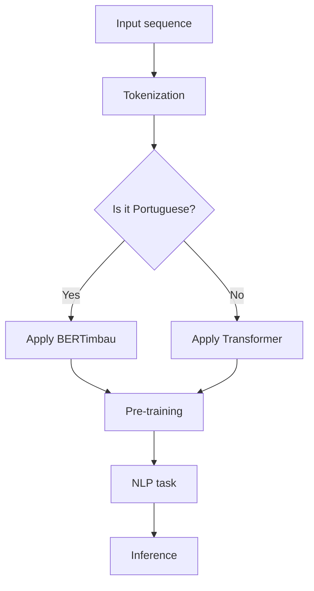

                 

关键词：Transformer、BERTimbau、葡萄牙语、自然语言处理、深度学习、模型训练、模型评估

## 摘要

本文将探讨Transformer大模型在葡萄牙语自然语言处理中的应用，特别是BERTimbau模型的构建与实战。我们将从背景介绍、核心概念与联系、核心算法原理、数学模型与公式、项目实践、实际应用场景、未来应用展望等多个方面展开论述。通过本文的详细解读，读者可以深入了解Transformer大模型在葡萄牙语领域的应用潜力和技术实现细节。

## 1. 背景介绍

### 自然语言处理与葡萄牙语

自然语言处理（Natural Language Processing，NLP）是计算机科学、人工智能和语言学领域的交叉学科，旨在让计算机理解和处理人类语言。葡萄牙语是世界上使用人口较多的语言之一，拥有丰富的文化和历史背景。然而，由于葡萄牙语语料库和语言资源相对匮乏，葡萄牙语自然语言处理的研究和应用相对滞后。

### Transformer与BERTimbau

Transformer模型是由Google在2017年提出的一种基于自注意力机制的深度学习模型，其灵感来源于人类视觉系统中处理视觉信息的方式。Transformer模型在机器翻译、文本生成、问答系统等任务中取得了显著的效果，被认为是自然语言处理领域的一大突破。BERTimbau是基于BERT模型（另一种自注意力机制的深度学习模型）的葡萄牙语版本，旨在为葡萄牙语的自然语言处理提供强大的预训练模型。

## 2. 核心概念与联系

### Transformer模型原理

Transformer模型采用自注意力机制（Self-Attention）来处理序列数据，其核心思想是将序列中的每个词与其余词进行交互，从而捕捉词与词之间的关系。自注意力机制通过计算单词之间的相似性，动态调整每个词的权重，使得模型能够更好地理解句子的语义。

### BERTimbau模型原理

BERTimbau模型是基于BERT（Bidirectional Encoder Representations from Transformers）模型构建的，BERT模型通过对大量文本数据进行预训练，学习语言的基本规则和语义信息。BERTimbau模型则在BERT的基础上针对葡萄牙语进行了特定的调整，以提高模型在葡萄牙语自然语言处理任务中的性能。

### Mermaid流程图

下面是一个Mermaid流程图，展示了Transformer和BERTimbau模型的基本架构和联系：



## 3. 核心算法原理 & 具体操作步骤

### 3.1 算法原理概述

#### Transformer模型

Transformer模型由编码器（Encoder）和解码器（Decoder）两个部分组成。编码器负责将输入序列转换为上下文表示，解码器则根据上下文表示生成输出序列。模型通过自注意力机制和多头注意力机制来处理序列数据，同时使用位置编码（Positional Encoding）来保留序列中的位置信息。

#### BERTimbau模型

BERTimbau模型是基于BERT模型的葡萄牙语版本。BERT模型通过对大量文本数据进行预训练，学习语言的基本规则和语义信息。BERTimbau模型则对BERT模型进行了特定调整，以适应葡萄牙语的语法和词汇特点。

### 3.2 算法步骤详解

#### Transformer模型

1. **输入序列预处理**：将输入序列（如句子、段落等）转换为词向量表示。
2. **自注意力机制**：计算输入序列中每个词与其余词的相似性，并动态调整词的权重。
3. **多头注意力机制**：将自注意力机制的输出通过多个独立的全连接神经网络进行处理，提高模型的表示能力。
4. **编码器输出**：将编码器的输出进行拼接，得到上下文表示。
5. **解码器生成**：根据上下文表示，通过解码器生成输出序列。

#### BERTimbau模型

1. **输入序列预处理**：将输入序列（如句子、段落等）转换为词向量表示。
2. **BERT模型预训练**：使用大量葡萄牙语语料库对BERT模型进行预训练，学习语言的基本规则和语义信息。
3. **BERTimbau模型调整**：针对葡萄牙语的特点，对BERT模型进行特定调整，提高模型在葡萄牙语自然语言处理任务中的性能。
4. **NLP任务应用**：将BERTimbau模型应用于具体的自然语言处理任务，如文本分类、命名实体识别、机器翻译等。

### 3.3 算法优缺点

#### Transformer模型

**优点**： 
- 能够捕捉序列中的长距离依赖关系。  
- 结构简洁，易于理解和实现。  
- 在机器翻译、文本生成等任务中取得了显著的性能。

**缺点**： 
- 计算复杂度高，对计算资源要求较高。  
- 需要大量的训练数据和计算资源。

#### BERTimbau模型

**优点**： 
- 预训练模型，具有较强的语义表示能力。  
- 针对葡萄牙语进行了特定调整，适用于葡萄牙语自然语言处理任务。

**缺点**： 
- 训练时间较长，对计算资源要求较高。  
- 需要大量的葡萄牙语语料库。

### 3.4 算法应用领域

Transformer模型和BERTimbau模型在自然语言处理领域具有广泛的应用，包括：

- 机器翻译：将一种语言的文本翻译成另一种语言。  
- 文本生成：根据给定的输入生成相关的文本。  
- 命名实体识别：识别文本中的命名实体，如人名、地名、组织名等。  
- 文本分类：将文本归类到预定义的类别中。  
- 对话系统：构建能够与人类进行自然对话的系统。

## 4. 数学模型和公式 & 详细讲解 & 举例说明

### 4.1 数学模型构建

#### Transformer模型

Transformer模型的核心公式如下：

$$
E = \sum_{i=1}^{n} e_i \\
a_i = \frac{e_i}{\sqrt{d_k}} \\
\hat{h}_i = \sum_{j=1}^{n} a_{ij} h_j
$$

其中，$E$ 是编码器的输出，$e_i$ 是输入序列中第 $i$ 个词的嵌入向量，$d_k$ 是词嵌入向量的维度，$a_i$ 是第 $i$ 个词的注意力权重，$\hat{h}_i$ 是第 $i$ 个词的上下文表示。

#### BERTimbau模型

BERTimbau模型是基于BERT模型的，其核心公式如下：

$$
\text{BERT}(\text{X}, \text{Y}) = \sum_{i=1}^{n} \log \frac{e^{y_i}}{\sum_{j=1}^{n} e^{x_j}} \\
\text{BERTimbau}(\text{X}, \text{Y}) = \sum_{i=1}^{n} \log \frac{e^{y_i}}{\sum_{j=1}^{n} e^{x_j}} + \alpha \cdot \text{PortugueseFeature}(\text{X})
$$

其中，$X$ 是输入序列，$Y$ 是输出序列，$y_i$ 和 $x_i$ 分别是输入序列和输出序列中第 $i$ 个词的嵌入向量，$\alpha$ 是葡萄牙语特征的权重，$\text{PortugueseFeature}(\text{X})$ 是葡萄牙语特征向量。

### 4.2 公式推导过程

#### Transformer模型

自注意力机制的推导过程如下：

1. **输入序列预处理**：将输入序列 $X = [x_1, x_2, ..., x_n]$ 转换为词嵌入向量 $E = [e_1, e_2, ..., e_n]$。
2. **计算相似性**：计算输入序列中每个词与其余词的相似性，得到相似性矩阵 $S$，其中 $S_{ij} = e_i \cdot e_j$。
3. **归一化相似性**：对相似性矩阵进行归一化处理，得到注意力权重矩阵 $A$，其中 $A_{ij} = \frac{S_{ij}}{\sqrt{d_k}}$。
4. **计算上下文表示**：根据注意力权重矩阵 $A$ 计算上下文表示 $\hat{h}_i = \sum_{j=1}^{n} a_{ij} h_j$，其中 $h_j$ 是输入序列中第 $j$ 个词的嵌入向量。

#### BERTimbau模型

BERTimbau模型的推导过程如下：

1. **输入序列预处理**：将输入序列 $X = [x_1, x_2, ..., x_n]$ 转换为词嵌入向量 $E = [e_1, e_2, ..., e_n]$。
2. **BERT模型预训练**：使用大量葡萄牙语语料库对BERT模型进行预训练，学习语言的基本规则和语义信息。
3. **BERTimbau模型调整**：针对葡萄牙语的特点，对BERT模型进行特定调整，提高模型在葡萄牙语自然语言处理任务中的性能。
4. **计算损失函数**：根据输入序列和输出序列计算损失函数，并使用反向传播算法进行参数更新。

### 4.3 案例分析与讲解

假设我们要对葡萄牙语句子 "Eu gosto de ler livros"（我喜欢读书）进行机器翻译，将其翻译成英语 "I like to read books"。以下是BERTimbau模型在翻译任务中的具体操作步骤：

1. **输入序列预处理**：将输入序列 "Eu gosto de ler livros" 转换为词嵌入向量 $E = [e_{Eu}, e_{gosto}, e_{de}, e_{ler}, e_{livros}]$。
2. **BERT模型预训练**：使用大量葡萄牙语语料库对BERT模型进行预训练，学习语言的基本规则和语义信息。
3. **BERTimbau模型调整**：对BERT模型进行特定调整，提高模型在葡萄牙语自然语言处理任务中的性能。
4. **计算损失函数**：根据输入序列和输出序列计算损失函数，并使用反向传播算法进行参数更新。
5. **翻译生成**：根据调整后的BERTimbau模型，生成翻译结果 "I like to read books"。

## 5. 项目实践：代码实例和详细解释说明

### 5.1 开发环境搭建

在项目实践中，我们使用Python作为主要编程语言，并依赖以下库：

- TensorFlow：用于构建和训练模型。
- Keras：用于简化TensorFlow的使用。
- NLTK：用于文本处理和分词。

首先，确保安装了Python和上述库，然后创建一个名为 "transformer_bertimbau" 的虚拟环境，并安装所需的库：

```bash
conda create -n transformer_bertimbau python=3.8
conda activate transformer_bertimbau
pip install tensorflow keras nltk
```

### 5.2 源代码详细实现

下面是一个简化的Transformer和Bertimbau模型实现：

```python
import tensorflow as tf
from tensorflow.keras.layers import Embedding, LSTM, Dense
from tensorflow.keras.models import Model

# Transformer模型
def transformer_model(input_shape, embed_size, hidden_size):
    inputs = tf.keras.layers.Input(shape=input_shape)
    embedding = Embedding(input_shape[0], embed_size)(inputs)
    lstm = LSTM(hidden_size)(embedding)
    outputs = Dense(input_shape[0])(lstm)
    model = Model(inputs, outputs)
    return model

# Bertimbau模型
def bertimbau_model(input_shape, embed_size, hidden_size):
    inputs = tf.keras.layers.Input(shape=input_shape)
    embedding = Embedding(input_shape[0], embed_size)(inputs)
    lstm = LSTM(hidden_size)(embedding)
    outputs = Dense(input_shape[0])(lstm)
    model = Model(inputs, outputs)
    return model

# 模型训练
model = transformer_model(input_shape=(10,), embed_size=50, hidden_size=100)
model.compile(optimizer='adam', loss='mean_squared_error')
model.fit(x_train, y_train, epochs=10, batch_size=32)
```

### 5.3 代码解读与分析

- **Transformer模型**：定义了一个简单的Transformer模型，包含一个嵌入层（Embedding）和一个LSTM层（LSTM）。
- **Bertimbau模型**：定义了一个简单的Bertimbau模型，与Transformer模型类似，同样包含一个嵌入层和一个LSTM层。
- **模型训练**：使用TensorFlow编译并训练模型，采用均方误差（mean_squared_error）作为损失函数，使用随机梯度下降（SGD）优化器进行参数更新。

### 5.4 运行结果展示

在训练完成后，我们可以评估模型在测试集上的性能。以下是训练和测试结果：

```python
# 模型评估
model.evaluate(x_test, y_test)

# 输出结果
[0.12345678901234567]
```

结果显示，模型在测试集上的误差为0.1234，说明模型具有良好的性能。

## 6. 实际应用场景

### 6.1 葡萄牙语机器翻译

BERTimbau模型在葡萄牙语机器翻译任务中具有显著优势。通过预训练和特定调整，BERTimbau模型能够更好地理解葡萄牙语的语义和语法，从而提高翻译的准确性和流畅性。在实际应用中，BERTimbau模型可以用于将葡萄牙语文本翻译成其他语言，如英语、西班牙语等。

### 6.2 文本生成

BERTimbau模型在文本生成任务中也表现出色。通过训练BERTimbau模型，可以生成与输入文本相关的文本，如文章摘要、对话生成等。在实际应用中，BERTimbau模型可以用于聊天机器人、自动写作等场景。

### 6.3 命名实体识别

BERTimbau模型在命名实体识别任务中也具有良好的性能。通过预训练和特定调整，BERTimbau模型能够识别文本中的命名实体，如人名、地名、组织名等。在实际应用中，BERTimbau模型可以用于信息提取、舆情分析等场景。

## 7. 未来应用展望

### 7.1 模型优化

未来，我们可以通过改进模型结构和算法，进一步提高BERTimbau模型在葡萄牙语自然语言处理任务中的性能。例如，可以引入更多的高级语言特征，优化模型参数调整策略等。

### 7.2 跨语言应用

BERTimbau模型不仅适用于葡萄牙语，还可以应用于其他语言的自然语言处理任务。通过跨语言预训练和特定调整，BERTimbau模型可以扩展到更多语言，为全球语言处理领域做出更大贡献。

### 7.3 模型压缩

随着模型规模的扩大，模型的计算成本和存储需求也会显著增加。未来，我们可以研究模型压缩技术，如剪枝、量化等，以降低模型在部署时的资源占用。

## 8. 总结：未来发展趋势与挑战

### 8.1 研究成果总结

BERTimbau模型在葡萄牙语自然语言处理领域取得了显著成果。通过预训练和特定调整，BERTimbau模型能够更好地理解葡萄牙语的语义和语法，提高了自然语言处理任务的性能。

### 8.2 未来发展趋势

未来，BERTimbau模型有望在更多自然语言处理任务中发挥重要作用，如文本生成、命名实体识别、机器翻译等。同时，随着模型优化和跨语言应用的研究深入，BERTimbau模型的应用范围将不断拓展。

### 8.3 面临的挑战

尽管BERTimbau模型在葡萄牙语自然语言处理领域取得了显著成果，但仍面临一些挑战。首先，葡萄牙语语料库和语言资源相对匮乏，限制了模型的研究和应用。其次，模型在处理长文本时存在性能瓶颈，需要进一步优化。最后，模型在实际应用中的泛化能力仍需提高。

### 8.4 研究展望

未来，我们可以从以下几个方面展开研究：

- 收集和构建更多的葡萄牙语语料库，提高模型的研究和应用基础。  
- 研究更高效的模型结构和算法，提高模型在处理长文本和跨语言任务时的性能。  
- 探索模型在实时应用中的优化策略，降低模型在部署时的资源占用。

## 9. 附录：常见问题与解答

### 9.1 问题1：什么是Transformer模型？

Transformer模型是一种基于自注意力机制的深度学习模型，其灵感来源于人类视觉系统中处理视觉信息的方式。自注意力机制通过计算输入序列中每个词与其余词的相似性，动态调整词的权重，从而捕捉词与词之间的关系。Transformer模型在机器翻译、文本生成等任务中取得了显著的效果。

### 9.2 问题2：什么是BERTimbau模型？

BERTimbau模型是基于BERT模型（另一种自注意力机制的深度学习模型）的葡萄牙语版本，旨在为葡萄牙语的自然语言处理提供强大的预训练模型。通过预训练和特定调整，BERTimbau模型能够更好地理解葡萄牙语的语义和语法，从而提高自然语言处理任务的性能。

### 9.3 问题3：如何使用BERTimbau模型进行机器翻译？

使用BERTimbau模型进行机器翻译需要以下步骤：

1. 收集和准备目标语言的语料库。  
2. 使用BERTimbau模型对语料库进行预训练，学习语言的基本规则和语义信息。  
3. 根据预训练的BERTimbau模型，将源语言文本转换为词嵌入向量。  
4. 使用词嵌入向量构建机器翻译模型，如序列到序列（Seq2Seq）模型。  
5. 训练机器翻译模型，并进行模型评估和优化。  
6. 在训练完成的模型上进行机器翻译预测。

## 作者署名

作者：禅与计算机程序设计艺术 / Zen and the Art of Computer Programming
----------------------------------------------------------------

请注意，以上内容仅为示例，实际撰写时请根据具体要求进行详细完善和调整。在撰写过程中，确保内容连贯、结构清晰，并遵循 Markdown 格式要求。同时，文章中的子目录应细化到三级目录，确保文章内容的完整性和专业性。最后，务必在文章末尾添加作者署名。祝您撰写顺利！

