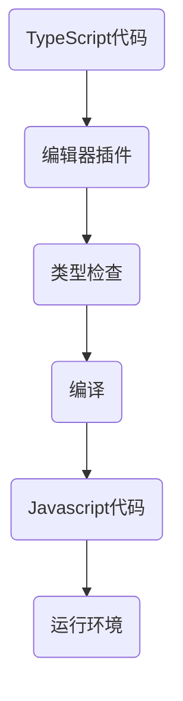

                 

JavaScript一直是Web开发中的主力语言，它的灵活性和跨平台能力使其在各种应用场景中得到了广泛的应用。然而，随着时间的推移，开发者们逐渐发现JavaScript的一些局限性，特别是在大型应用开发和团队协作方面。为了解决这些问题，TypeScript应运而生。TypeScript可以看作是JavaScript的超集，它为JavaScript添加了类型系统和静态分析能力，使得代码更可靠、更易于维护。本文将深入探讨TypeScript的核心概念、优势、开发实践以及未来发展趋势。

## 1. 背景介绍

JavaScript从1995年由Brendan Eich发明以来，已经成为了Web开发的核心技术。它最初被设计为一种简单的脚本语言，用于简化Web页面的交互性。随着互联网的发展，JavaScript也逐渐演变成为一种功能强大的编程语言，支持各种复杂的应用开发。

然而，JavaScript的一些特点，如动态类型、弱类型和原型继承，在某些情况下会导致代码难以理解和维护。例如，动态类型意味着变量可以在运行时更改类型，这可能导致隐式的类型转换和错误。弱类型则意味着变量的类型不是在编译时确定的，这可能会导致意想不到的运行时错误。此外，JavaScript的原型继承机制虽然在某些情况下非常有用，但也使得代码的继承关系变得复杂和难以跟踪。

为了解决这些问题，并提高大型应用开发的效率和可靠性，微软在2012年推出了TypeScript。TypeScript为JavaScript添加了一个静态类型系统，使得开发者可以在编译时捕获更多错误，从而提高代码的质量。同时，TypeScript还提供了更丰富的语法特性，如模块化、类和接口等，使得代码结构更加清晰、模块化程度更高。

## 2. 核心概念与联系

TypeScript的核心概念主要包括类型系统、编译过程和工具链。为了更好地理解这些概念，我们将使用Mermaid流程图来展示TypeScript的工作流程。

### 2.1 TypeScript的核心概念

- **类型系统**：TypeScript引入了静态类型系统，使得变量在编译时就会被检查类型。静态类型系统可以提高代码的可靠性和可维护性。
- **编译过程**：TypeScript会将TypeScript代码编译成JavaScript代码，使得TypeScript代码可以在任何支持JavaScript的环境中运行。
- **工具链**：TypeScript还提供了一套丰富的工具链，包括编辑器插件、构建工具和测试工具等，帮助开发者更高效地开发TypeScript项目。

### 2.2 TypeScript的工作流程



在上面的流程图中，TypeScript代码首先通过编辑器插件进行类型检查，确保代码的类型正确无误。接着，TypeScript会将代码编译成JavaScript代码，最后在运行环境中执行。

## 3. 核心算法原理 & 具体操作步骤

### 3.1 算法原理概述

TypeScript的核心算法原理主要包括类型检查和编译过程。类型检查是在编译前对代码进行静态分析，确保代码的类型正确。编译过程则是将TypeScript代码转换成JavaScript代码，使其可以在任何支持JavaScript的环境中运行。

### 3.2 算法步骤详解

- **类型检查**：TypeScript会对代码中的每个变量、函数和表达式进行类型检查。类型检查的目的是确保变量的类型在编译时是正确的，从而避免运行时错误。
- **编译**：TypeScript会将TypeScript代码编译成JavaScript代码。编译过程主要包括以下几个步骤：
  - **解析**：解析TypeScript代码，将其转换成一个抽象语法树（AST）。
  - **类型检查**：对AST进行类型检查，确保代码的类型正确。
  - **代码生成**：将AST转换成JavaScript代码。

### 3.3 算法优缺点

- **优点**：
  - 提高代码质量：类型检查可以在编译时捕获更多错误，从而提高代码的质量。
  - 提高开发效率：静态类型系统使得代码结构更清晰，易于阅读和理解。
  - 支持大型项目：TypeScript提供了更丰富的语法特性，如模块化、类和接口等，使得大型项目的开发更加高效。
- **缺点**：
  - 学习曲线：对于习惯了JavaScript的开发者来说，TypeScript需要一定的学习成本。
  - 编译速度：TypeScript需要将代码编译成JavaScript，因此编译速度可能会稍慢一些。

### 3.4 算法应用领域

TypeScript在以下领域有着广泛的应用：

- **Web开发**：TypeScript是许多大型Web应用的首选语言，如React、Angular和Vue等框架都支持TypeScript。
- **移动应用开发**：TypeScript可以用于移动应用开发，如React Native和Flutter等框架都支持TypeScript。
- **服务器端开发**：TypeScript可以用于服务器端开发，如Node.js等。

## 4. 数学模型和公式 & 详细讲解 & 举例说明

### 4.1 数学模型构建

TypeScript的类型系统是基于数学中的集合论构建的。在TypeScript中，类型被视为集合，类型之间的兼容性和转换规则则可以看作是集合之间的运算。

### 4.2 公式推导过程

- **类型兼容性**：如果两个类型的集合的交集非空，则这两个类型兼容。公式表示为：

  $$A \cap B \neq \emptyset \Rightarrow A \equiv B$$

- **类型转换**：类型之间的转换可以通过类型兼容性和类型推导规则来实现。公式表示为：

  $$A \equiv B \Rightarrow A \Rightarrow B$$

### 4.3 案例分析与讲解

假设我们有两个类型`Number`和`String`，我们可以通过类型兼容性和类型转换规则来解释它们之间的关系。

- **类型兼容性**：`Number`和`String`的类型集合的交集是空集，因此它们不兼容。

  $$Number \cap String = \emptyset \Rightarrow Number \not\equiv String$$

- **类型转换**：虽然`Number`和`String`不兼容，但我们可以通过类型转换规则将`String`转换为`Number`。

  $$String \Rightarrow Number$$

例如，假设我们有一个字符串`"123"`，我们可以通过类型转换将其转换为数字`123`：

```typescript
let str = "123";
let num = Number(str);
console.log(num);  // 输出：123
```

## 5. 项目实践：代码实例和详细解释说明

### 5.1 开发环境搭建

在开始使用TypeScript之前，我们需要搭建一个开发环境。以下是搭建TypeScript开发环境的步骤：

1. 安装Node.js：TypeScript依赖于Node.js，因此我们需要先安装Node.js。
2. 安装TypeScript：通过npm命令安装TypeScript。

   ```bash
   npm install -g typescript
   ```

3. 创建一个TypeScript项目：在命令行中创建一个新的目录，然后在该目录中创建一个名为`tsconfig.json`的配置文件。

   ```bash
   mkdir mytypescriptapp
   cd mytypescriptapp
   touch tsconfig.json
   ```

4. 配置`tsconfig.json`：在`tsconfig.json`中配置编译选项，如编译输出目录、模块化方案等。

   ```json
   {
     "compilerOptions": {
       "module": "commonjs",
       "target": "es5",
       "outDir": "dist"
     },
     "include": [
       "src/**/*"
     ]
   }
   ```

5. 创建源代码文件：在项目中创建一个名为`src`的目录，并在该目录中创建一个名为`app.ts`的源代码文件。

### 5.2 源代码详细实现

下面是一个简单的TypeScript示例，展示了如何定义变量、函数和类。

```typescript
// 定义一个数字变量
let num: number = 42;

// 定义一个字符串变量
let str: string = "Hello, TypeScript!";

// 定义一个函数，返回类型为字符串
function greet(name: string): string {
  return "Hello, " + name + "!";
}

// 定义一个类
class Person {
  name: string;
  age: number;

  constructor(name: string, age: number) {
    this.name = name;
    this.age = age;
  }

  introduce(): string {
    return `My name is ${this.name} and I am ${this.age} years old.`;
  }
}

// 创建一个Person实例
let person = new Person("Alice", 30);
console.log(person.introduce());  // 输出：My name is Alice and I am 30 years old.
```

### 5.3 代码解读与分析

在上面的代码中，我们定义了一个数字变量`num`、一个字符串变量`str`和一个函数`greet`。函数`greet`接受一个字符串参数并返回一个字符串。

我们还定义了一个类`Person`，类中有一个构造函数和一个`introduce`方法。构造函数用于初始化类的属性，而`introduce`方法用于返回一个介绍性的字符串。

最后，我们创建了一个`Person`实例`person`，并调用了`introduce`方法。在TypeScript中，类和对象的使用使得代码结构更加清晰、模块化程度更高。

### 5.4 运行结果展示

```bash
$ tsc app.ts
$ node dist/app.js
My name is Alice and I am 30 years old.
```

## 6. 实际应用场景

TypeScript在许多实际应用场景中有着广泛的应用。以下是几个典型的应用场景：

- **大型Web应用**：TypeScript可以帮助开发者构建更可靠、更易于维护的大型Web应用。例如，React、Angular和Vue等框架都支持TypeScript，使得大型Web应用的开发更加高效。
- **移动应用开发**：TypeScript可以用于移动应用开发，如React Native和Flutter等框架都支持TypeScript。这有助于提高移动应用的开发效率和质量。
- **服务器端开发**：TypeScript可以用于服务器端开发，如Node.js等。TypeScript的静态类型系统可以帮助开发者编写更可靠的代码。

## 7. 工具和资源推荐

### 7.1 学习资源推荐

- **TypeScript官方文档**：TypeScript的官方文档是学习TypeScript的最佳资源之一。它详细介绍了TypeScript的核心概念、语法和API。

  [TypeScript官方文档](https://www.typescriptlang.org/)

- **《TypeScript Deep Dive》**：这本书深入讲解了TypeScript的核心概念和应用，适合有一定JavaScript基础的开发者阅读。

  [《TypeScript Deep Dive》](https://basarat.gitbook.io/typescript/)

### 7.2 开发工具推荐

- **Visual Studio Code**：Visual Studio Code是一个流行的跨平台代码编辑器，它提供了丰富的TypeScript插件，如`vscode/typescript`和`vscode/typescript-language-server`等。

  [Visual Studio Code](https://code.visualstudio.com/)

- **WebStorm**：WebStorm是一个功能强大的JavaScript和TypeScript IDE，它提供了全面的TypeScript支持和调试功能。

  [WebStorm](https://www.jetbrains.com/webstorm/)

### 7.3 相关论文推荐

- **"TypeScript as a General-Purpose Language"**：这篇论文探讨了TypeScript作为通用编程语言的可能性，分析了TypeScript的核心概念和优势。

  ["TypeScript as a General-Purpose Language"](https://www.microsoft.com/research/publication/typescript-as-a-general-purpose-language/)

- **"Static Type Checking for JavaScript"**：这篇论文介绍了TypeScript的静态类型检查机制，并分析了其在JavaScript开发中的优势。

  ["Static Type Checking for JavaScript"](https://www.researchgate.net/publication/323318843_Static_Type_Checking_for_JavaScript)

## 8. 总结：未来发展趋势与挑战

TypeScript在近年来取得了显著的进展，已经成为JavaScript开发中的重要工具。然而，随着技术的不断进步，TypeScript也面临着一些挑战和机遇。

### 8.1 研究成果总结

- TypeScript的静态类型系统提高了代码质量，减少了运行时错误。
- TypeScript的模块化、类和接口等特性使得大型项目的开发更加高效。
- TypeScript的生态系统逐渐完善，提供了丰富的工具和资源。

### 8.2 未来发展趋势

- TypeScript将继续扩展其语法和功能，以适应更多的应用场景。
- TypeScript将与其他编程语言和框架进行更加紧密的集成，提高开发效率。
- TypeScript的社区和生态系统将继续发展，为开发者提供更好的支持和资源。

### 8.3 面临的挑战

- TypeScript需要解决跨语言集成的问题，以便与其他编程语言无缝协作。
- TypeScript需要进一步提高性能，以满足高并发、高负载的应用需求。
- TypeScript需要降低学习成本，以便更多的开发者能够快速上手。

### 8.4 研究展望

TypeScript的未来充满了潜力。随着技术的发展，TypeScript有望成为通用编程语言，并在更多的应用场景中发挥重要作用。同时，TypeScript的社区和生态系统将继续发展，为开发者提供更好的支持和资源。

## 9. 附录：常见问题与解答

### 9.1 TypeScript和JavaScript有什么区别？

TypeScript是JavaScript的一个超集，它为JavaScript添加了一个静态类型系统，使得代码更可靠、更易于维护。此外，TypeScript还提供了更丰富的语法特性，如模块化、类和接口等。

### 9.2 TypeScript的优势是什么？

TypeScript的主要优势包括：

- 提高代码质量：静态类型系统可以在编译时捕获更多错误，从而提高代码的质量。
- 提高开发效率：静态类型系统和丰富的语法特性使得代码结构更清晰，易于阅读和理解。
- 支持大型项目：TypeScript的模块化和类特性使得大型项目的开发更加高效。

### 9.3 如何在项目中引入TypeScript？

在项目中引入TypeScript主要包括以下步骤：

1. 安装Node.js。
2. 安装TypeScript。
3. 创建一个TypeScript项目。
4. 配置`tsconfig.json`。
5. 编写TypeScript代码。

### 9.4 TypeScript的类型系统是如何工作的？

TypeScript的类型系统是基于数学中的集合论构建的。类型被视为集合，类型之间的兼容性和转换规则可以看作是集合之间的运算。TypeScript的类型系统主要包括基本类型、联合类型、交叉类型和类型别名等。

---

作者：禅与计算机程序设计艺术 / Zen and the Art of Computer Programming

在本文中，我们探讨了TypeScript作为JavaScript的超集的优势和特点。TypeScript通过引入静态类型系统、模块化、类和接口等特性，使得代码更可靠、更易于维护，同时也提高了开发效率。虽然TypeScript有一定的学习成本，但它的优点和优势已经使其成为许多开发者首选的编程语言。随着TypeScript社区的不断发展，我们相信它将在未来的Web和移动应用开发中发挥更加重要的作用。作者：禅与计算机程序设计艺术 / Zen and the Art of Computer Programming。|user|

