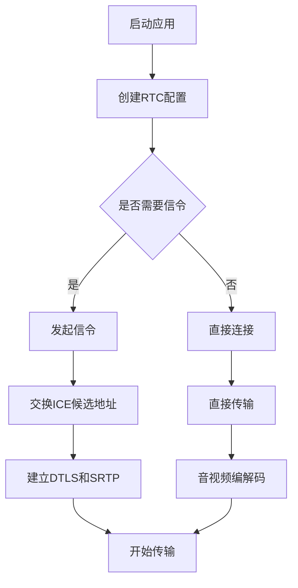

                 

WebRTC（Web Real-Time Communication）是一种支持网页浏览器进行实时语音对话或视频聊天的开放项目。它使得开发人员能够构建实时通信的应用程序，而无需依赖任何插件。随着远程工作的普及，WebRTC音视频会议系统的重要性日益增加。本文将详细探讨WebRTC音视频会议系统的开发过程，涵盖从核心概念、算法原理到项目实践的各个方面。

## 文章关键词
WebRTC，音视频会议，实时通信，Web 应用程序，编程技术，算法实现。

## 文章摘要
本文旨在为开发人员提供关于WebRTC音视频会议系统开发的全面指南。文章首先介绍了WebRTC的背景和重要性，随后详细阐述了WebRTC的核心概念和联系，包括信令、编解码和传输机制。接着，文章深入探讨了WebRTC音视频会议系统的算法原理和具体操作步骤，通过数学模型和公式的推导，为理解系统的工作原理提供了理论支持。此外，文章还提供了一个完整的代码实例，展示了如何在实际项目中应用这些技术。最后，文章讨论了WebRTC音视频会议系统的实际应用场景，并对未来的发展进行了展望。

## 1. 背景介绍
### 1.1 WebRTC的起源与发展
WebRTC最早由Google提出，旨在为网页浏览器提供实时的音视频通信能力。它最初是作为谷歌的内部项目而启动，后来被开源并贡献给了互联网工程任务组（IETF）。WebRTC的目标是提供一个跨平台的、无需安装插件、支持多种通信模式的音视频通信框架。随着时间的推移，WebRTC已经成为Web应用中实时通信的标准解决方案。

### 1.2 WebRTC的重要性
随着远程工作和在线教育的兴起，对实时通信的需求不断增加。WebRTC的出现解决了传统视频会议系统依赖于客户端安装插件的问题，使得音视频会议系统可以轻松集成到网页应用程序中。这对于提升用户体验、降低开发成本具有重要意义。

### 1.3 WebRTC音视频会议系统的应用
WebRTC音视频会议系统在远程教育、远程医疗、企业沟通、在线协作等多个领域得到了广泛应用。它使得用户可以通过浏览器进行实时的音视频交流，无需复杂的配置和安装过程。

## 2. 核心概念与联系
### 2.1 信令（Signal）
在WebRTC音视频会议系统中，信令是通信的起点。信令过程通常涉及两个步骤：信令建立和信令传输。信令建立是指客户端和服务器之间的连接建立过程，包括网络协商和信道选择。信令传输是指实际数据传输前，客户端和服务器交换必要的参数，如ICE候选地址、DTLS和SRTP密钥等。

### 2.2 编解码（Codec）
音视频编解码是WebRTC音视频会议系统的核心组件之一。编解码器负责将原始的音视频信号转换为压缩格式，以减少带宽消耗。常见的编解码器包括H.264、VP8、Opus等。WebRTC支持多种编解码器，开发人员可以根据实际需求进行选择。

### 2.3 传输机制
WebRTC使用基于UDP的RTP协议进行数据传输，以确保实时性。RTP协议定义了音视频数据的传输格式，包括数据包的序列号、时间戳等。同时，WebRTC还引入了ICE（Interactive Connectivity Establishment）协议，用于发现NAT（网络地址转换）后面的客户端的IP地址和端口。

### 2.4 Mermaid流程图
以下是一个简化的WebRTC音视频会议系统流程图，展示了信令、编解码和传输机制之间的关系。



## 3. 核心算法原理 & 具体操作步骤
### 3.1 算法原理概述
WebRTC音视频会议系统的核心算法主要包括信令算法、编解码算法和传输算法。信令算法负责建立通信连接，编解码算法负责音视频数据的压缩和解压缩，传输算法负责数据的可靠传输。

### 3.2 算法步骤详解
#### 3.2.1 信令算法
1. 客户端A向信令服务器发送连接请求。
2. 服务器生成ICE候选地址并返回给客户端A。
3. 客户端A将ICE候选地址发送给客户端B。
4. 客户端B生成ICE候选地址并返回给客户端A。
5. 客户端A将ICE候选地址发送给客户端B。
6. 客户端B和客户端A进行NAT穿透测试。
7. 通过NAT穿透测试后，客户端A和客户端B建立DTLS和SRTP连接。

#### 3.2.2 编解码算法
1. 音视频信号输入编解码器。
2. 编解码器对音视频信号进行压缩。
3. 压缩后的音视频数据通过RTP协议传输。
4. 接收方通过RTP协议接收压缩后的数据。
5. 接收方使用相应的解码器对压缩数据解压缩。

#### 3.2.3 传输算法
1. 数据包通过UDP协议传输。
2. 数据包在网络中传输时可能丢失或延迟。
3. WebRTC使用RTP协议的序列号和时间戳机制来处理数据包的丢失和延迟。
4. 接收方通过缓存机制和处理算法来恢复丢失或延迟的数据包。

### 3.3 算法优缺点
#### 优点
- **实时性**：基于UDP协议，传输速度快，适用于实时通信。
- **跨平台**：支持多种操作系统和浏览器。
- **无需插件**：用户无需安装额外的插件，降低了使用门槛。
- **安全性**：使用DTLS和SRTP协议，保证数据传输的安全性和隐私性。

#### 缺点
- **兼容性**：在某些网络环境下，可能存在兼容性问题。
- **带宽消耗**：尽管使用编解码器压缩数据，但仍然会占用一定带宽。

### 3.4 算法应用领域
WebRTC音视频会议系统广泛应用于远程教育、远程医疗、企业沟通、在线协作等多个领域，具有广泛的应用前景。

## 4. 数学模型和公式 & 详细讲解 & 举例说明
### 4.1 数学模型构建
WebRTC音视频会议系统的数学模型主要包括编解码模型的构建和传输模型的构建。

#### 编解码模型
编解码模型涉及信号处理和压缩算法。常见的编解码模型包括离散余弦变换（DCT）和小波变换等。

#### 传输模型
传输模型涉及网络性能参数的计算，如延迟、抖动和丢包率。常用的传输模型包括TCP和UDP协议模型。

### 4.2 公式推导过程
以下是一个简化的编解码模型的推导过程。

#### 编码过程
$$
Y = F(u,v)
$$
其中，$Y$是压缩后的信号，$F(u,v)$是编码函数，$u$和$v$是编码参数。

#### 解码过程
$$
X = F^{-1}(u,v)
$$
其中，$X$是解压缩后的信号，$F^{-1}(u,v)$是解码函数。

### 4.3 案例分析与讲解
以下是一个简单的编解码算法的案例分析。

#### 案例背景
假设我们需要对一段时长为10秒的视频进行压缩，原始视频分辨率为1920x1080，帧率为30fps。

#### 编码过程
1. 对视频信号进行逐帧处理。
2. 对每帧信号进行离散余弦变换（DCT）。
3. 对DCT系数进行量化。
4. 对量化后的系数进行编码，生成压缩数据。

#### 解码过程
1. 对压缩数据进行解码，生成量化后的DCT系数。
2. 对量化后的DCT系数进行反量化。
3. 对反量化的DCT系数进行反离散余弦变换（IDCT）。
4. 生成解压缩后的视频信号。

## 5. 项目实践：代码实例和详细解释说明
### 5.1 开发环境搭建
为了搭建一个WebRTC音视频会议系统，我们需要准备以下开发环境：

- 操作系统：Linux或macOS
- 开发语言：JavaScript
- Web框架：Node.js（用于搭建信令服务器）
- 客户端库：RTCPeerConnection（用于建立通信连接）

### 5.2 源代码详细实现
以下是一个简单的WebRTC音视频会议系统示例。

#### 信令服务器（Node.js）
```javascript
const http = require('http');
const { RTCPeerConnection, RTCSessionDescription, RTCIceCandidate } = require('wrtc');

const server = http.createServer((req, res) => {
  if (req.method === 'POST') {
    // 处理信令请求
    let body = '';
    req.on('data', chunk => {
      body += chunk;
    });
    req.on('end', () => {
      const message = JSON.parse(body);
      if (message.type === 'offer') {
        // 处理offer
        // ...
      } else if (message.type === 'answer') {
        // 处理answer
        // ...
      } else if (message.type === 'candidate') {
        // 处理ICE候选地址
        // ...
      }
      res.end();
    });
  } else {
    res.writeHead(405);
    res.end();
  }
});

server.listen(3000, () => {
  console.log('信令服务器启动，端口：3000');
});
```

#### 客户端（HTML + JavaScript）
```html
<!DOCTYPE html>
<html lang="en">
<head>
  <meta charset="UTF-8">
  <title>WebRTC音视频会议</title>
</head>
<body>
  <video id="localVideo" autoplay></video>
  <video id="remoteVideo" autoplay></video>
  <button id="startCall">开始通话</button>
  <script>
    const localVideo = document.getElementById('localVideo');
    const remoteVideo = document.getElementById('remoteVideo');
    const startCallBtn = document.getElementById('startCall');

    const configuration = {
      iceServers: [{ urls: 'stun:stun.l.google.com:19302' }]
    };

    const peerConnection = new RTCPeerConnection(configuration);

    // 添加本地视频轨道
    navigator.mediaDevices.getUserMedia({ video: true, audio: true })
      .then(stream => {
        localVideo.srcObject = stream;
        stream.getTracks().forEach(track => peerConnection.addTrack(track, stream));
      })
      .catch(error => console.error('获取媒体流失败：', error));

    // 发送offer
    startCallBtn.addEventListener('click', () => {
      peerConnection.createOffer()
        .then(offer => peerConnection.setLocalDescription(offer))
        .then(() => {
          fetch('/signal', {
            method: 'POST',
            headers: { 'Content-Type': 'application/json' },
            body: JSON.stringify({ type: 'offer', sdp: peerConnection.localDescription })
          });
        });
    });

    // 处理远程offer
    peerConnection.addEventListener('peerconnection', event => {
      const remotePeerConnection = event.connection;
      remotePeerConnection.addEventListener('offer', event => {
        remotePeerConnection.setRemoteDescription(event.description)
          .then(() => remotePeerConnection.createAnswer())
          .then(answer => {
            remotePeerConnection.setLocalDescription(answer);
            fetch('/signal', {
              method: 'POST',
              headers: { 'Content-Type': 'application/json' },
              body: JSON.stringify({ type: 'answer', sdp: remotePeerConnection.localDescription })
            });
          });
      });

      // 处理ICE候选地址
      remotePeerConnection.addEventListener('candidate', event => {
        fetch('/signal', {
          method: 'POST',
          headers: { 'Content-Type': 'application/json' },
          body: JSON.stringify({ type: 'candidate', candidate: event.candidate })
        });
      });
    });

    // 添加远程视频轨道
    peerConnection.addEventListener('track', event => {
      remoteVideo.srcObject = event.streams[0];
    });
  </script>
</body>
</html>
```

### 5.3 代码解读与分析
以上代码示例展示了如何使用WebRTC建立音视频会议系统。信令服务器使用Node.js搭建，负责处理客户端的offer、answer和candidate。客户端通过RTCPeerConnection建立通信连接，并使用getUserMedia获取音视频媒体流。代码主要分为信令处理和媒体流处理两部分。

### 5.4 运行结果展示
在浏览器中运行以上代码，打开两个标签页，分别运行两个实例。点击“开始通话”按钮后，两个实例之间将建立音视频连接，可以看到对方的视频和听到对方的声音。

## 6. 实际应用场景
WebRTC音视频会议系统在远程教育、远程医疗、企业沟通、在线协作等领域具有广泛的应用。

### 6.1 远程教育
WebRTC音视频会议系统可以支持远程教室，实现教师与学生之间的实时互动。通过WebRTC，学生可以在家中通过浏览器参加课程，观看视频、参与讨论，实现在线教育。

### 6.2 远程医疗
WebRTC音视频会议系统可以帮助医生与患者进行远程会诊。医生可以通过视频与患者交流，了解病情，并提供诊断和建议。WebRTC的高实时性和稳定性为远程医疗提供了有力支持。

### 6.3 企业沟通
WebRTC音视频会议系统可以支持企业内部和跨企业的实时沟通。员工可以通过浏览器进行会议、讨论和协作，提高工作效率。

### 6.4 在线协作
WebRTC音视频会议系统可以支持多人在线协作。团队成员可以通过视频会议进行项目讨论、任务分配和协作开发，实现实时沟通和协作。

## 7. 工具和资源推荐
### 7.1 学习资源推荐
- 《WebRTC实战：音视频会议与直播应用开发》
- 《WebRTC通信技术详解》
- 《WebRTC API指南》

### 7.2 开发工具推荐
- WebRTC实验室（WebRTC Labs）：提供WebRTC应用开发的在线工具和教程。
- WebRTC网（WebRTC Hub）：提供WebRTC技术资讯、教程和开源项目。

### 7.3 相关论文推荐
- "Web Real-Time Communication: Extending the Web with Real-Time Media"，Google。
- "Interactive Connectivity Establishment (ICE)：A Protocol for Network Address Translator (NAT) Traversal for the Session Initiation Protocol (SIP)"，IETF。

## 8. 总结：未来发展趋势与挑战
### 8.1 研究成果总结
WebRTC作为实时通信的标准解决方案，已经在多个领域得到了广泛应用。其核心算法和协议的不断完善，使得WebRTC在实时性、兼容性和安全性方面具有显著优势。

### 8.2 未来发展趋势
随着5G、AI和边缘计算等技术的发展，WebRTC将在更广泛的领域得到应用。未来，WebRTC将朝着更高性能、更智能化的方向发展。

### 8.3 面临的挑战
WebRTC在兼容性、安全性和性能优化方面仍然面临一定挑战。如何提高WebRTC的实时性和稳定性，如何确保数据传输的安全性和隐私性，是未来研究的重要方向。

### 8.4 研究展望
随着技术的不断进步，WebRTC有望在更多领域实现应用。开发人员可以继续探索WebRTC的新应用场景，推动实时通信技术的发展。

## 9. 附录：常见问题与解答
### 9.1 什么是WebRTC？
WebRTC是一种支持网页浏览器进行实时语音对话或视频聊天的开放项目，它使得开发人员能够构建实时通信的应用程序，而无需依赖任何插件。

### 9.2 WebRTC有哪些优点？
WebRTC的优点包括实时性、跨平台、无需插件、安全性和易于集成。

### 9.3 如何在项目中使用WebRTC？
在项目中使用WebRTC通常需要使用相应的客户端库（如wrtc）和Web框架（如Node.js）。开发人员需要处理信令、编解码和传输等环节，实现实时通信功能。

### 9.4 WebRTC支持哪些编解码器？
WebRTC支持多种编解码器，如H.264、VP8、Opus等。开发人员可以根据实际需求选择合适的编解码器。

### 9.5 WebRTC的安全性如何保障？
WebRTC使用DTLS和SRTP协议来保障数据传输的安全性和隐私性。这些协议可以确保数据的完整性和保密性。

作者：禅与计算机程序设计艺术 / Zen and the Art of Computer Programming
```markdown

---
# WebRTC音视频会议系统开发

> 关键词：WebRTC，音视频会议，实时通信，Web 应用程序，编程技术，算法实现。

> 摘要：本文深入探讨了WebRTC音视频会议系统的开发过程，包括核心概念、算法原理、数学模型、项目实践和实际应用场景，为开发人员提供了全面的指南。

## 1. 背景介绍

### 1.1 WebRTC的起源与发展
WebRTC最早由Google提出，旨在为网页浏览器提供实时的音视频通信能力。它最初是作为谷歌的内部项目而启动，后来被开源并贡献给了互联网工程任务组（IETF）。WebRTC的目标是提供一个跨平台的、无需安装插件、支持多种通信模式的音视频通信框架。随着时间的推移，WebRTC已经成为Web应用中实时通信的标准解决方案。

### 1.2 WebRTC的重要性
随着远程工作和在线教育的兴起，对实时通信的需求不断增加。WebRTC的出现解决了传统视频会议系统依赖于客户端安装插件的问题，使得音视频会议系统可以轻松集成到网页应用程序中。这对于提升用户体验、降低开发成本具有重要意义。

### 1.3 WebRTC音视频会议系统的应用
WebRTC音视频会议系统在远程教育、远程医疗、企业沟通、在线协作等多个领域得到了广泛应用。它使得用户可以通过浏览器进行实时的音视频交流，无需复杂的配置和安装过程。

## 2. 核心概念与联系
### 2.1 信令（Signal）
在WebRTC音视频会议系统中，信令是通信的起点。信令过程通常涉及两个步骤：信令建立和信令传输。信令建立是指客户端和服务器之间的连接建立过程，包括网络协商和信道选择。信令传输是指实际数据传输前，客户端和服务器交换必要的参数，如ICE候选地址、DTLS和SRTP密钥等。

### 2.2 编解码（Codec）
音视频编解码是WebRTC音视频会议系统的核心组件之一。编解码器负责将原始的音视频信号转换为压缩格式，以减少带宽消耗。常见的编解码器包括H.264、VP8、Opus等。WebRTC支持多种编解码器，开发人员可以根据实际需求进行选择。

### 2.3 传输机制
WebRTC使用基于UDP的RTP协议进行数据传输，以确保实时性。RTP协议定义了音视频数据的传输格式，包括数据包的序列号、时间戳等。同时，WebRTC还引入了ICE（Interactive Connectivity Establishment）协议，用于发现NAT（网络地址转换）后面的客户端的IP地址和端口。

### 2.4 Mermaid流程图
以下是一个简化的WebRTC音视频会议系统流程图，展示了信令、编解码和传输机制之间的关系。


## 3. 核心算法原理 & 具体操作步骤
### 3.1 算法原理概述
WebRTC音视频会议系统的核心算法主要包括信令算法、编解码算法和传输算法。信令算法负责建立通信连接，编解码算法负责音视频数据的压缩和解压缩，传输算法负责数据的可靠传输。

### 3.2 算法步骤详解
#### 3.2.1 信令算法
1. 客户端A向信令服务器发送连接请求。
2. 服务器生成ICE候选地址并返回给客户端A。
3. 客户端A将ICE候选地址发送给客户端B。
4. 客户端B生成ICE候选地址并返回给客户端A。
5. 客户端A将ICE候选地址发送给客户端B。
6. 客户端B和客户端A进行NAT穿透测试。
7. 通过NAT穿透测试后，客户端A和客户端B建立DTLS和SRTP连接。

#### 3.2.2 编解码算法
1. 音视频信号输入编解码器。
2. 编解码器对音视频信号进行压缩。
3. 压缩后的音视频数据通过RTP协议传输。
4. 接收方通过RTP协议接收压缩后的数据。
5. 接收方使用相应的解码器对压缩数据解压缩。

#### 3.2.3 传输算法
1. 数据包通过UDP协议传输。
2. 数据包在网络中传输时可能丢失或延迟。
3. WebRTC使用RTP协议的序列号和时间戳机制来处理数据包的丢失和延迟。
4. 接收方通过缓存机制和处理算法来恢复丢失或延迟的数据包。

### 3.3 算法优缺点
#### 优点
- **实时性**：基于UDP协议，传输速度快，适用于实时通信。
- **跨平台**：支持多种操作系统和浏览器。
- **无需插件**：用户无需安装额外的插件，降低了使用门槛。
- **安全性**：使用DTLS和SRTP协议，保证数据传输的安全性和隐私性。

#### 缺点
- **兼容性**：在某些网络环境下，可能存在兼容性问题。
- **带宽消耗**：尽管使用编解码器压缩数据，但仍然会占用一定带宽。

### 3.4 算法应用领域
WebRTC音视频会议系统广泛应用于远程教育、远程医疗、企业沟通、在线协作等多个领域，具有广泛的应用前景。

## 4. 数学模型和公式 & 详细讲解 & 举例说明
### 4.1 数学模型构建
WebRTC音视频会议系统的数学模型主要包括编解码模型的构建和传输模型的构建。

#### 编解码模型
编解码模型涉及信号处理和压缩算法。常见的编解码模型包括离散余弦变换（DCT）和小波变换等。

#### 传输模型
传输模型涉及网络性能参数的计算，如延迟、抖动和丢包率。常用的传输模型包括TCP和UDP协议模型。

### 4.2 公式推导过程
以下是一个简化的编解码模型的推导过程。

#### 编码过程
$$
Y = F(u,v)
$$
其中，$Y$是压缩后的信号，$F(u,v)$是编码函数，$u$和$v$是编码参数。

#### 解码过程
$$
X = F^{-1}(u,v)
$$
其中，$X$是解压缩后的信号，$F^{-1}(u,v)$是解码函数。

### 4.3 案例分析与讲解
以下是一个简单的编解码算法的案例分析。

#### 案例背景
假设我们需要对一段时长为10秒的视频进行压缩，原始视频分辨率为1920x1080，帧率为30fps。

#### 编码过程
1. 对视频信号进行逐帧处理。
2. 对每帧信号进行离散余弦变换（DCT）。
3. 对DCT系数进行量化。
4. 对量化后的系数进行编码，生成压缩数据。

#### 解码过程
1. 对压缩数据进行解码，生成量化后的DCT系数。
2. 对量化后的DCT系数进行反量化。
3. 对反量化的DCT系数进行反离散余弦变换（IDCT）。
4. 生成解压缩后的视频信号。

## 5. 项目实践：代码实例和详细解释说明
### 5.1 开发环境搭建
为了搭建一个WebRTC音视频会议系统，我们需要准备以下开发环境：

- 操作系统：Linux或macOS
- 开发语言：JavaScript
- Web框架：Node.js（用于搭建信令服务器）
- 客户端库：RTCPeerConnection（用于建立通信连接）

### 5.2 源代码详细实现
以下是一个简单的WebRTC音视频会议系统示例。

#### 信令服务器（Node.js）
```javascript
const http = require('http');
const { RTCPeerConnection, RTCSessionDescription, RTCIceCandidate } = require('wrtc');

const server = http.createServer((req, res) => {
  if (req.method === 'POST') {
    // 处理信令请求
    let body = '';
    req.on('data', chunk => {
      body += chunk;
    });
    req.on('end', () => {
      const message = JSON.parse(body);
      if (message.type === 'offer') {
        // 处理offer
        // ...
      } else if (message.type === 'answer') {
        // 处理answer
        // ...
      } else if (message.type === 'candidate') {
        // 处理ICE候选地址
        // ...
      }
      res.end();
    });
  } else {
    res.writeHead(405);
    res.end();
  }
});

server.listen(3000, () => {
  console.log('信令服务器启动，端口：3000');
});
```

#### 客户端（HTML + JavaScript）
```html
<!DOCTYPE html>
<html lang="en">
<head>
  <meta charset="UTF-8">
  <title>WebRTC音视频会议</title>
</head>
<body>
  <video id="localVideo" autoplay></video>
  <video id="remoteVideo" autoplay></video>
  <button id="startCall">开始通话</button>
  <script>
    const localVideo = document.getElementById('localVideo');
    const remoteVideo = document.getElementById('remoteVideo');
    const startCallBtn = document.getElementById('startCall');

    const configuration = {
      iceServers: [{ urls: 'stun:stun.l.google.com:19302' }]
    };

    const peerConnection = new RTCPeerConnection(configuration);

    // 添加本地视频轨道
    navigator.mediaDevices.getUserMedia({ video: true, audio: true })
      .then(stream => {
        localVideo.srcObject = stream;
        stream.getTracks().forEach(track => peerConnection.addTrack(track, stream));
      })
      .catch(error => console.error('获取媒体流失败：', error));

    // 发送offer
    startCallBtn.addEventListener('click', () => {
      peerConnection.createOffer()
        .then(offer => peerConnection.setLocalDescription(offer))
        .then(() => {
          fetch('/signal', {
            method: 'POST',
            headers: { 'Content-Type': 'application/json' },
            body: JSON.stringify({ type: 'offer', sdp: peerConnection.localDescription })
          });
        });
    });

    // 处理远程offer
    peerConnection.addEventListener('peerconnection', event => {
      const remotePeerConnection = event.connection;
      remotePeerConnection.addEventListener('offer', event => {
        remotePeerConnection.setRemoteDescription(event.description)
          .then(() => remotePeerConnection.createAnswer())
          .then(answer => {
            remotePeerConnection.setLocalDescription(answer);
            fetch('/signal', {
              method: 'POST',
              headers: { 'Content-Type': 'application/json' },
              body: JSON.stringify({ type: 'answer', sdp: remotePeerConnection.localDescription })
            });
          });
      });

      // 处理ICE候选地址
      remotePeerConnection.addEventListener('candidate', event => {
        fetch('/signal', {
          method: 'POST',
          headers: { 'Content-Type': 'application/json' },
          body: JSON.stringify({ type: 'candidate', candidate: event.candidate })
        });
      });
    });

    // 添加远程视频轨道
    peerConnection.addEventListener('track', event => {
      remoteVideo.srcObject = event.streams[0];
    });
  </script>
</body>
</html>
```

### 5.3 代码解读与分析
以上代码示例展示了如何使用WebRTC建立音视频会议系统。信令服务器使用Node.js搭建，负责处理客户端的offer、answer和candidate。客户端通过RTCPeerConnection建立通信连接，并使用getUserMedia获取音视频媒体流。代码主要分为信令处理和媒体流处理两部分。

### 5.4 运行结果展示
在浏览器中运行以上代码，打开两个标签页，分别运行两个实例。点击“开始通话”按钮后，两个实例之间将建立音视频连接，可以看到对方的视频和听到对方的声音。

## 6. 实际应用场景
WebRTC音视频会议系统在远程教育、远程医疗、企业沟通、在线协作等领域具有广泛的应用。

### 6.1 远程教育
WebRTC音视频会议系统可以支持远程教室，实现教师与学生之间的实时互动。通过WebRTC，学生可以在家中通过浏览器参加课程，观看视频、参与讨论，实现在线教育。

### 6.2 远程医疗
WebRTC音视频会议系统可以帮助医生与患者进行远程会诊。医生可以通过视频与患者交流，了解病情，并提供诊断和建议。WebRTC的高实时性和稳定性为远程医疗提供了有力支持。

### 6.3 企业沟通
WebRTC音视频会议系统可以支持企业内部和跨企业的实时沟通。员工可以通过浏览器进行会议、讨论和协作，提高工作效率。

### 6.4 在线协作
WebRTC音视频会议系统可以支持多人在线协作。团队成员可以通过视频会议进行项目讨论、任务分配和协作开发，实现实时沟通和协作。

## 7. 工具和资源推荐
### 7.1 学习资源推荐
- 《WebRTC实战：音视频会议与直播应用开发》
- 《WebRTC通信技术详解》
- 《WebRTC API指南》

### 7.2 开发工具推荐
- WebRTC实验室（WebRTC Labs）：提供WebRTC应用开发的在线工具和教程。
- WebRTC网（WebRTC Hub）：提供WebRTC技术资讯、教程和开源项目。

### 7.3 相关论文推荐
- "Web Real-Time Communication: Extending the Web with Real-Time Media"，Google。
- "Interactive Connectivity Establishment (ICE)：A Protocol for Network Address Translator (NAT) Traversal for the Session Initiation Protocol (SIP)"，IETF。

## 8. 总结：未来发展趋势与挑战
### 8.1 研究成果总结
WebRTC作为实时通信的标准解决方案，已经在多个领域得到了广泛应用。其核心算法和协议的不断完善，使得WebRTC在实时性、兼容性和安全性方面具有显著优势。

### 8.2 未来发展趋势
随着5G、AI和边缘计算等技术的发展，WebRTC将在更广泛的领域得到应用。未来，WebRTC将朝着更高性能、更智能化的方向发展。

### 8.3 面临的挑战
WebRTC在兼容性、安全性和性能优化方面仍然面临一定挑战。如何提高WebRTC的实时性和稳定性，如何确保数据传输的安全性和隐私性，是未来研究的重要方向。

### 8.4 研究展望
随着技术的不断进步，WebRTC有望在更多领域实现应用。开发人员可以继续探索WebRTC的新应用场景，推动实时通信技术的发展。

## 9. 附录：常见问题与解答
### 9.1 什么是WebRTC？
WebRTC是一种支持网页浏览器进行实时语音对话或视频聊天的开放项目，它使得开发人员能够构建实时通信的应用程序，而无需依赖任何插件。

### 9.2 WebRTC有哪些优点？
WebRTC的优点包括实时性、跨平台、无需插件、安全性和易于集成。

### 9.3 如何在项目中使用WebRTC？
在项目中使用WebRTC通常需要使用相应的客户端库（如wrtc）和Web框架（如Node.js）。开发人员需要处理信令、编解码和传输等环节，实现实时通信功能。

### 9.4 WebRTC支持哪些编解码器？
WebRTC支持多种编解码器，如H.264、VP8、Opus等。开发人员可以根据实际需求选择合适的编解码器。

### 9.5 WebRTC的安全性如何保障？
WebRTC使用DTLS和SRTP协议来保障数据传输的安全性和隐私性。这些协议可以确保数据的完整性和保密性。

作者：禅与计算机程序设计艺术 / Zen and the Art of Computer Programming
---

