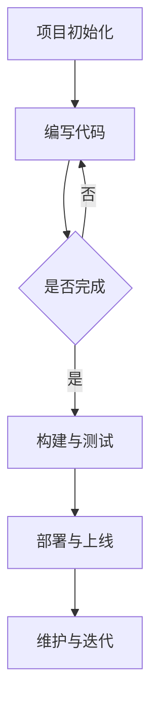

                 

 在现代互联网技术的快速发展和复杂项目需求的驱动下，Web前端工程化已经成为提高开发效率和保证代码质量的关键途径。本文将详细探讨Web前端工程化的最佳实践，包括其背景介绍、核心概念、算法原理、数学模型、项目实践以及未来应用展望等，旨在为开发者提供一套系统性的指导框架。

## 关键词
- Web前端工程化
- 架构设计
- 持续集成
- 模块化开发
- 性能优化
- 自动化工具

## 摘要
本文首先介绍了Web前端工程化的背景和重要性，随后深入讲解了核心概念、算法原理、数学模型等内容。通过具体的代码实例和实践，读者将了解到如何在实际项目中应用这些最佳实践。最后，文章探讨了Web前端工程化的未来发展趋势和面临的挑战，为开发者指明了研究方向。

## 1. 背景介绍

Web前端工程化是指通过一系列规范的流程、工具和架构设计，提高Web前端项目的开发效率、代码质量和维护性。随着互联网的普及，Web应用日益复杂，单一的开发模式已无法满足日益增长的需求。因此，工程化成为提升项目质量、保障用户体验的必要手段。

### 1.1 发展历程

Web前端工程化的发展历程可以分为以下几个阶段：

- **手动编码阶段**：最初，开发者通过手动编写HTML、CSS和JavaScript代码进行开发。这种方式简单直接，但缺乏系统性和可维护性。

- **组件化阶段**：随着模块化思想的引入，开发者开始将代码拆分为多个可复用的组件，提高了代码的复用性和可维护性。

- **工程化阶段**：随着工具和框架的成熟，如Webpack、Gulp等，Web前端工程化逐渐形成了一套完整的流程，涵盖了代码构建、测试、部署等各个环节。

### 1.2 现状与趋势

当前，Web前端工程化已成为开发者的共识，各大公司和团队纷纷引入相关工具和流程。同时，工程化也在不断演进，新的工具和框架不断涌现，如Docker、Kubernetes等容器化技术的应用，进一步提升了开发效率和部署灵活性。

## 2. 核心概念与联系

在Web前端工程化中，有几个核心概念和联系至关重要，包括模块化、组件化、打包工具、构建工具等。

### 2.1 模块化

模块化是指将代码拆分成多个独立的模块，每个模块只包含一个功能，易于维护和复用。模块化的核心思想是“高内聚、低耦合”，有助于提高代码的可读性和可维护性。

### 2.2 组件化

组件化是模块化的进一步扩展，将模块抽象为可复用的UI组件。组件化实现了UI层面的模块化，使得开发者可以像拼积木一样构建页面，提高了开发效率和代码复用性。

### 2.3 打包工具

打包工具如Webpack，用于将多个模块打包成一个或多个静态文件。Webpack不仅支持模块化开发，还提供了丰富的插件和加载器，以处理不同的资源类型。

### 2.4 构建工具

构建工具如Gulp，用于自动化执行一系列操作，如编译、压缩、测试等。构建工具提高了开发效率，减少了手动操作的工作量。

### 2.5 Mermaid流程图

以下是一个简单的Mermaid流程图，展示了Web前端工程化的基本流程：



## 3. 核心算法原理 & 具体操作步骤

### 3.1 算法原理概述

Web前端工程化的核心算法主要包括模块打包、代码分割、懒加载等。

- **模块打包**：将多个模块打包成一个或多个静态文件，以优化加载性能。
- **代码分割**：将代码分割成多个部分，根据需要按需加载，以提高首屏加载速度。
- **懒加载**：在用户需要时动态加载资源，以减少初始加载时间。

### 3.2 算法步骤详解

以下是Web前端工程化的具体步骤：

1. **项目初始化**：使用工具如Webpack或Gulp初始化项目结构。
2. **编写代码**：按照模块化和组件化的原则编写代码。
3. **构建与测试**：使用构建工具进行代码编译、压缩、测试等操作。
4. **部署与上线**：将构建后的代码部署到服务器，供用户访问。
5. **维护与迭代**：定期更新代码，修复漏洞，优化性能。

### 3.3 算法优缺点

- **模块打包**：优点是优化加载性能，缺点是构建时间较长。
- **代码分割**：优点是提高首屏加载速度，缺点是增加了复杂性。
- **懒加载**：优点是减少初始加载时间，缺点是资源加载时机难以控制。

### 3.4 算法应用领域

这些算法广泛应用于Web应用、Web组件、前端框架等场景，有助于提升开发效率和用户体验。

## 4. 数学模型和公式 & 详细讲解 & 举例说明

### 4.1 数学模型构建

在Web前端工程化中，常用的数学模型包括页面加载时间、带宽利用率等。

- **页面加载时间**：$$T = \frac{D}{B}$$，其中$$T$$为页面加载时间，$$D$$为页面数据大小，$$B$$为带宽。
- **带宽利用率**：$$U = \frac{D}{T} \times 100\%$$，其中$$U$$为带宽利用率。

### 4.2 公式推导过程

以页面加载时间为例，推导过程如下：

- **假设**：页面数据大小为$$D$$，带宽为$$B$$，网络延迟为$$L$$。
- **公式推导**：$$T = L + \frac{D}{B}$$。

### 4.3 案例分析与讲解

假设一个页面数据大小为$$1MB$$，带宽为$$10Mbps$$，则页面加载时间为：

$$T = \frac{1MB}{10Mbps} = 0.1s$$。

提高带宽或减小页面数据大小都可以减少页面加载时间。

## 5. 项目实践：代码实例和详细解释说明

### 5.1 开发环境搭建

首先，我们需要搭建一个基本的Web前端工程化环境。以下是一个简单的步骤：

1. 安装Node.js，作为构建工具的基础。
2. 安装Webpack和相关的插件。
3. 创建一个新项目，并初始化项目结构。

### 5.2 源代码详细实现

以下是一个简单的Webpack配置文件示例：

```javascript
const path = require('path');
const HtmlWebpackPlugin = require('html-webpack-plugin');

module.exports = {
  entry: './src/index.js',
  output: {
    filename: 'bundle.js',
    path: path.resolve(__dirname, 'dist'),
  },
  plugins: [
    new HtmlWebpackPlugin({
      template: './src/index.html',
    }),
  ],
  module: {
    rules: [
      {
        test: /\.css$/,
        use: ['style-loader', 'css-loader'],
      },
      {
        test: /\.jsx?$/,
        exclude: /node_modules/,
        use: 'babel-loader',
      },
    ],
  },
  resolve: {
    extensions: ['.js', '.jsx'],
  },
};
```

### 5.3 代码解读与分析

在这个配置文件中，我们设置了入口文件、输出文件、插件、加载器和解析选项等。这些配置项共同构成了一个完整的Webpack构建流程。

### 5.4 运行结果展示

执行以下命令，启动Webpack构建：

```bash
npx webpack --config webpack.config.js
```

构建完成后，生成一个`dist`目录，包含打包后的`bundle.js`和`index.html`文件。我们可以通过浏览器访问生成的HTML文件，查看构建结果。

## 6. 实际应用场景

Web前端工程化在多个实际应用场景中发挥了重要作用，包括大型电商平台、社交媒体、在线教育平台等。以下是一些应用场景的案例分析：

### 6.1 大型电商平台

大型电商平台如淘宝、京东等，拥有庞大的用户量和海量的商品信息。通过Web前端工程化，可以优化页面加载速度，提升用户体验，从而增加用户黏性和转化率。

### 6.2 社交媒体

社交媒体平台如Facebook、Twitter等，需要处理大量的用户交互和实时数据更新。通过Web前端工程化，可以实现高效的数据加载和交互，提高系统的响应速度。

### 6.3 在线教育平台

在线教育平台如Coursera、Udemy等，需要提供丰富的课程内容和互动功能。通过Web前端工程化，可以优化课程内容的加载速度，提供流畅的学习体验。

## 7. 未来应用展望

未来，Web前端工程化将继续演进，新的技术和工具将不断涌现。以下是一些可能的发展趋势：

- **前端框架的进一步优化和整合**：如React、Vue、Angular等框架将继续优化，提供更好的性能和用户体验。
- **前端与后端的深度融合**：通过技术如GraphQL、RESTful API等，前端和后端将更加紧密地集成，提高开发效率。
- **人工智能在Web前端的应用**：如自然语言处理、图像识别等，将进一步提升用户体验。

## 8. 工具和资源推荐

### 8.1 学习资源推荐

- 《Web性能优化权威指南》
- 《Webpack实战》
- 《前端模块化开发》

### 8.2 开发工具推荐

- Webpack
- Gulp
- Babel
- ESLint

### 8.3 相关论文推荐

- "A Survey of Web Performance Optimization Techniques"
- "Front-end Engineering: Building Modern Web Applications"
- "Module Systems in JavaScript: ES6 Modules and Beyond"

## 9. 总结：未来发展趋势与挑战

Web前端工程化在过去的几年中取得了显著进展，但未来仍面临诸多挑战，如性能优化、安全性、跨平台开发等。随着技术的不断演进，开发者需要不断学习和适应新的工具和理念，以应对不断变化的需求和挑战。

### 9.1 研究成果总结

本文详细介绍了Web前端工程化的背景、核心概念、算法原理、数学模型以及实际应用场景。通过具体的代码实例，读者可以更好地理解这些实践方法。

### 9.2 未来发展趋势

未来，Web前端工程化将继续向高性能、高安全性、跨平台化方向发展。新工具和框架的涌现，将推动前端技术的发展。

### 9.3 面临的挑战

性能优化、安全性、跨平台开发等仍然是Web前端工程化面临的主要挑战。开发者需要不断学习和适应新技术，以提高开发效率和代码质量。

### 9.4 研究展望

未来，Web前端工程化有望在人工智能、区块链等领域发挥更大的作用，为开发者提供更多创新的可能性。

## 10. 附录：常见问题与解答

### 10.1 什么是Webpack？

Webpack是一个模块打包工具，用于将多个模块打包成一个或多个静态文件。它提供了丰富的插件和加载器，以支持不同的资源类型。

### 10.2 什么是模块化开发？

模块化开发是将代码拆分成多个独立的模块，每个模块只包含一个功能。这种方式提高了代码的可维护性和可复用性。

### 10.3 什么是组件化开发？

组件化开发是模块化开发在UI层面的扩展，将模块抽象为可复用的UI组件。开发者可以像拼积木一样构建页面。

### 10.4 如何进行性能优化？

性能优化可以从多个方面进行，如减少HTTP请求、压缩资源、使用CDN、缓存策略等。

## 作者署名

作者：禅与计算机程序设计艺术 / Zen and the Art of Computer Programming

### 文章结构模板结尾
----------------------------------------------------------------

以上便是《Web前端工程化最佳实践》这篇文章的完整内容。希望这篇文章能为您的Web前端开发之路提供有价值的参考和指导。在未来的实践中，不断探索和优化，您将能够更好地应对复杂的Web前端项目需求。祝您开发愉快！
----------------------------------------------------------------

**文章结束。**

