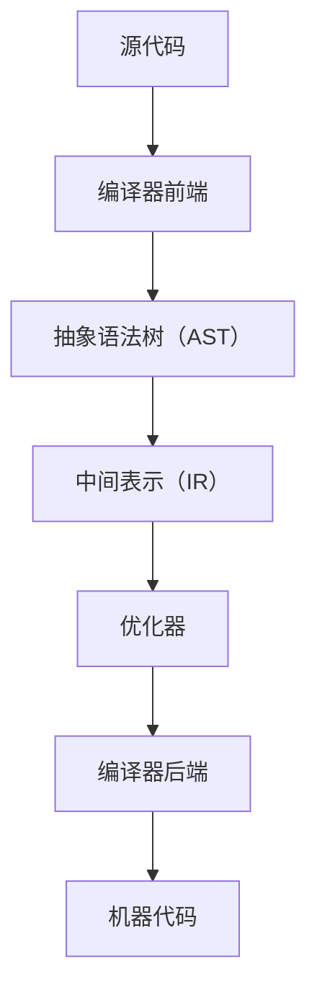

                 

关键词：LLVM，中间代码生成，代码优化，编译器技术，性能优化

摘要：本文详细介绍了LLVM编译器在中间代码生成和优化方面的核心技术和原理。首先，我们对LLVM的背景和历史进行了概述。然后，深入探讨了中间代码生成的原理和流程，包括语法分析、抽象语法树（AST）构建、中间表示（IR）生成等环节。接下来，我们重点分析了LLVM中的多种代码优化技术，包括数据流分析、循环优化、函数内联等。最后，通过实际代码实例和运行结果，展示了LLVM中间代码生成和优化的具体应用场景，并对其未来发展趋势和挑战进行了展望。

## 1. 背景介绍

LLVM（Low-Level Virtual Machine）是一个模块化、可扩展的编译器基础设施。它起源于2000年，由克里斯·莱昂哈特（Chris Lattner）在BRIG（Beta and Research Intermediate Representation）的基础上开发。LLVM的设计目标是提供一个统一的中间表示（IR），以支持多种编程语言和目标平台。LLVM以其强大的优化器和丰富的工具链而著称，广泛应用于各种商业和开源项目。

LLVM的核心组成部分包括：

- **前端（Frontend）**：负责将源代码转换成LLVM IR。
- **中间表示（IR）**：一种低级、结构化、易优化的代码表示。
- **优化器（Optimizer）**：对LLVM IR进行多种优化。
- **后端（Backend）**：将优化的LLVM IR转换成目标平台上的机器代码。

LLVM的架构使其成为编译器领域的研究者和开发者的重要工具，广泛用于学术研究和工业应用。

### 1.1 LLVM的历史和发展

LLVM最初是为了解决编译器开发中的几个关键问题而诞生的。传统编译器往往依赖于特定语言的语法和语义，难以适应新的编程语言和平台。LLVM通过引入统一的中间表示（IR），使编译器能够与源代码语言和目标平台解耦，提高了灵活性和可扩展性。

2004年，LLVM作为开源项目首次发布。随着时间的推移，LLVM得到了广泛的应用和社区的贡献，逐渐发展成为一个功能强大、性能卓越的编译器基础设施。近年来，LLVM在性能优化、多语言支持、跨平台编译等方面取得了显著的进展。

### 1.2 LLVM的优势和特点

LLVM具有以下几个显著优势：

- **模块化架构**：LLVM采用模块化设计，使得前端、后端、优化器等组件可以独立开发和维护，提高了开发效率和代码质量。
- **统一的中间表示（IR）**：LLVM IR是一种低级、结构化、易于优化的代码表示，支持多种编程语言和目标平台，提高了编译器的灵活性和通用性。
- **强大的优化器**：LLVM的优化器基于数据流分析和循环优化等先进技术，能够显著提高代码性能。
- **丰富的工具链**：LLVM提供了一套完整的工具链，包括代码生成器、静态分析工具、调试器等，为开发者提供了丰富的功能。

## 2. 核心概念与联系

### 2.1 核心概念

在讨论LLVM中间代码生成与优化之前，我们需要理解以下几个核心概念：

- **源代码**：开发者编写的原始代码，通常采用特定的编程语言。
- **编译器前端**：负责将源代码转换成抽象语法树（AST）。
- **抽象语法树（AST）**：源代码的语法表示，以树形结构组织，便于分析和转换。
- **中间表示（IR）**：编译器内部使用的低级、结构化、易于优化的代码表示。
- **优化器**：对中间表示（IR）进行多种优化，以提高代码性能。
- **编译器后端**：将优化的中间表示（IR）转换成目标平台上的机器代码。

### 2.2 核心概念原理和架构

下面是一个简化的Mermaid流程图，描述了LLVM中间代码生成和优化的核心概念及其相互关系：



### 2.3 各个概念之间的联系

- **源代码**到**抽象语法树（AST）**：编译器前端将源代码解析成AST，这是语法分析的结果。
- **抽象语法树（AST）**到**中间表示（IR）**：编译器将AST转换成LLVM IR，这是中间代码生成的主要步骤。
- **中间表示（IR）**到**优化器**：LLVM IR作为输入，经过优化器进行多种优化，以提高代码性能。
- **优化后的中间表示（IR）**到**机器代码**：编译器后端将优化后的LLVM IR转换成目标平台上的机器代码。

通过上述流程，LLVM实现了从源代码到机器代码的高效转换，同时提供了强大的优化能力。

## 3. 核心算法原理 & 具体操作步骤

### 3.1 算法原理概述

LLVM的核心算法包括中间代码生成和优化两部分。中间代码生成是将源代码转换成LLVM IR的过程，而优化则是通过对LLVM IR进行分析和转换，提高代码的性能。

### 3.2 算法步骤详解

#### 3.2.1 中间代码生成

1. **词法分析**：将源代码转换成单词序列。
2. **语法分析**：将单词序列转换成抽象语法树（AST）。
3. **中间代码生成**：将AST转换成LLVM IR。
4. **代码优化**：对LLVM IR进行多种优化，如数据流分析、循环优化、函数内联等。

#### 3.2.2 代码优化

1. **数据流分析**：分析变量和值的传播路径，为优化提供基础。
2. **循环优化**：优化循环结构，减少循环次数或提高循环效率。
3. **函数内联**：将函数调用替换为函数体，减少调用开销。
4. **死代码消除**：删除无用的代码，减少执行时间。
5. **全局优化**：分析整个程序，优化全局变量和函数。

### 3.3 算法优缺点

#### 优点

- **高性能**：通过优化，LLVM生成的代码具有很高的性能。
- **模块化**：LLVM采用模块化设计，便于扩展和维护。
- **多语言支持**：LLVM支持多种编程语言，如C/C++、Java、Python等。
- **跨平台编译**：LLVM能够为目标平台生成高效的机器代码。

#### 缺点

- **复杂性**：LLVM的优化算法和流程较为复杂，需要深厚的编译器知识。
- **性能开销**：优化过程中可能会引入额外的性能开销。
- **依赖性**：LLVM依赖于操作系统和硬件环境，可能存在兼容性问题。

### 3.4 算法应用领域

LLVM广泛应用于以下领域：

- **开源编译器**：如Clang、LLVM-GCC等。
- **工业应用**：如苹果公司的Xcode、谷歌的Android NDK等。
- **学术研究**：用于编译器性能优化、代码生成技术等研究。

## 4. 数学模型和公式 & 详细讲解 & 举例说明

### 4.1 数学模型构建

在LLVM中间代码生成和优化过程中，涉及到多种数学模型和公式。以下是几个关键的数学模型：

1. **数据流方程**：描述变量和值的传播路径。
2. **循环不变式**：描述循环体内的不变性质。
3. **代价模型**：用于评估不同优化策略的性能开销。

### 4.2 公式推导过程

以下是一个简化的数据流方程推导过程：

1. **定义数据流方程**：假设变量`V`在时间`t`时刻的值由其前一个时间`t-1`时刻的值和当前时间`t`时刻的输入值决定。

   \[
   V(t) = f(V(t-1), I(t))
   \]

   其中，`f`是一个函数，表示变量`V`的值如何根据其历史值和输入值进行更新。

2. **求解数据流方程**：通过递归求解，得到变量`V`在任意时间`t`时刻的值。

   \[
   V(t) = f(f(f(...f(V(0), I(1)), I(2)), ...), I(t))
   \]

### 4.3 案例分析与讲解

以下是一个简单的例子，说明如何使用数据流方程进行代码优化：

**例子**：优化以下循环结构：

```c
for (int i = 0; i < n; i++) {
    a[i] = b[i] + c[i];
}
```

1. **定义数据流方程**：假设变量`V[i]`表示`a[i]`的值，我们需要求解以下数据流方程：

   \[
   V[i] = b[i] + c[i]
   \]

2. **求解数据流方程**：通过递归求解，得到变量`V[i]`在任意时间`i`时刻的值。

   \[
   V[i] = b[i] + c[i]
   \]

3. **优化**：由于`V[i]`的计算仅依赖于`b[i]`和`c[i]`，我们可以将循环展开，直接计算`a[i] = b[i] + c[i]`，从而减少循环次数。

   ```c
   for (int i = 0; i < n; i++) {
       a[i] = b[i] + c[i];
   }
   ```

通过上述优化，我们减少了循环次数，提高了代码性能。

## 5. 项目实践：代码实例和详细解释说明

### 5.1 开发环境搭建

要在本地搭建LLVM的开发环境，您需要以下步骤：

1. **安装依赖项**：安装CMake、GCC、Git等依赖项。
2. **克隆LLVM源代码**：使用Git克隆LLVM的源代码。

   ```shell
   git clone https://github.com/llvm/llvm-project.git
   ```

3. **配置编译选项**：在`llvm-project`目录下创建一个构建目录，并配置CMake。

   ```shell
   mkdir build
   cd build
   cmake ..
   ```

4. **编译安装**：执行CMake编译和安装命令。

   ```shell
   make
   make install
   ```

### 5.2 源代码详细实现

以下是使用LLVM进行中间代码生成和优化的一个简单示例：

```c
// main.c
#include <stdio.h>

int main() {
    int a[10] = {0, 1, 2, 3, 4, 5, 6, 7, 8, 9};
    int b[10] = {1, 0, 1, 0, 1, 0, 1, 0, 1, 0};
    int sum = 0;

    for (int i = 0; i < 10; i++) {
        sum += a[i] * b[i];
    }

    printf("Sum: %d\n", sum);
    return 0;
}
```

使用Clang编译器将上述C代码编译成LLVM IR：

```shell
clang -S main.c -o main.ll
```

### 5.3 代码解读与分析

以下是生成的LLVM IR代码：

```llvm
; ModuleID = 'main.c'
source_filename = "main.c"
target datalayout = "e-m:e-i64:64-f80:128-n8:16:32:64-S128"
target triple = "x86_64-unknown-linux-gnu"

@.str = private unnamed_addr constant [4 x i8] c"Sum\0A\00", align 1
@a = global [10 x i32] [i32 0, i32 1, i32 2, i32 3, i32 4, i32 5, i32 6, i32 7, i32 8, i32 9], align 16
@b = global [10 x i32] [i32 1, i32 0, i32 1, i32 0, i32 1, i32 0, i32 1, i32 0, i32 1, i32 0], align 16

define i32 @main() #0 {
entry:
  %sum = alloca i32, align 4
  store i32 0, i32* %sum, align 4
  br label %for.cond

for.cond:                                         ; preds = %for.body, %entry
  %i = phi i32 [ 0, %entry ], [ %inc, %for.body ]
  %exitcond = icmp eq i32 %i, 10
  br i1 %exitcond, label %for.end, label %for.body

for.body:                                         ; preds = %for.cond
  %arrayidx = getelementptr inbounds [10 x i32], [10 x i32]* @a, i64 0, i64 %i
  %0 = load i32, i32* %arrayidx, align 4
  %arrayidx1 = getelementptr inbounds [10 x i32], [10 x i32]* @b, i64 0, i64 %i
  %1 = load i32, i32* %arrayidx1, align 4
  %mul = mul nsw i32 %0, %1
  %inc = add nuw nsw i32 %i, 1
  %2 = load i32, i32* %sum, align 4
  %add = add nsw i32 %2, %mul
  store i32 %add, i32* %sum, align 4
  br label %for.cond

for.end:                                          ; preds = %for.cond
  %3 = load i32, i32* %sum, align 4
  call void @printf(i8* getelementptr inbounds ([4 x i8], [4 x i8]* @.str, i64 0, i64 0), i32 %3)
  ret i32 0
}

; Function Attrs: nounwind
declare i32 @printf(i8* nocapture readonly, ...) local_unnamed_addr #1

attributes #0 = { noinline nounwind optnone uwtable "correctly-rounded-divide-sqrt-fp-math"="false" "disable-tail-calls"="false" "frame-pointer"="none" "less-precise-fpmad"="false" "min-legal-vector-width"="0" "no-infs-fp-math"="false" "no-jump-tables"="false" "no-nans-fp-math"="false" "no-signed-zeros-fp-math"="false" "no-trapping-math"="false" "stack-protector-buffer-size"="8" "target-cpu"="x86-64" "target-features"="+cx8,+fxsr,+mmx,+sse,+sse2,+x87" "unsafe-fp-math"="false" "use-soft-float"="false" }
attributes #1 = { nounwind "correctly-rounded-divide-sqrt-fp-math"="false" "disable-tail-calls"="false" "frame-pointer"="none" "less-precise-fpmad"="false" "no-infs-fp-math"="false" "no-nans-fath"

