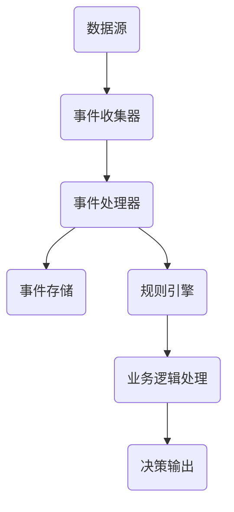

                 

关键词：(AI技术、大数据计算、CEP、事件处理、实时分析、流程引擎、逻辑处理、规则引擎)

## 摘要

本文旨在深入探讨AI大数据计算中的一种重要技术——复杂事件处理（Complex Event Processing，简称CEP）。CEP是一种用于实时分析数据流的技术，能够快速识别和响应业务事件，对企业的运营和决策具有重要意义。本文将介绍CEP的核心原理、算法、数学模型以及实际应用案例，帮助读者全面理解CEP的工作机制，并掌握其应用方法。

## 1. 背景介绍

随着互联网和物联网的快速发展，数据量呈现爆炸式增长，如何从海量数据中提取有价值的信息，成为当今信息技术领域的一个重要课题。复杂事件处理（CEP）技术正是在这样的背景下应运而生。CEP是一种实时分析技术，它通过分析数据流中的事件，识别出复杂的业务模式，从而实现实时决策和响应。

CEP的基本概念包括事件、事件流、事件规则等。事件是指数据的某个状态变化，例如股票价格的变动、订单的创建等。事件流是由一系列事件组成的数据序列。事件规则是用于描述业务逻辑的条件表达式，例如“当两个订单同时发生时，执行合并订单操作”。

CEP技术广泛应用于金融、电信、零售、物流等多个行业，帮助企业实现实时监控、风险预警、业务流程优化等功能。

## 2. 核心概念与联系

### 2.1 CEP架构图



### 2.2 CEP核心概念

- **事件（Event）**：事件是数据的基本单元，表示数据中的某个状态变化。事件可以来自各种数据源，如传感器、数据库、消息队列等。
- **事件流（Event Stream）**：事件流是事件的发生序列，可以看作是数据流的一个子集。事件流是CEP分析的基础。
- **事件规则（Event Rule）**：事件规则用于定义业务逻辑，描述事件之间相互关联的关系。事件规则可以是简单的条件表达式，也可以是复杂的逻辑表达式。
- **规则引擎（Rule Engine）**：规则引擎是CEP系统的核心组件，用于解析和执行事件规则。规则引擎能够根据事件规则，对事件流进行实时分析，识别出复杂的业务模式。
- **业务逻辑处理（Business Logic Processing）**：业务逻辑处理是指根据规则引擎的分析结果，执行相应的业务操作。例如，根据订单事件流，执行订单合并、发货等操作。
- **决策输出（Decision Output）**：决策输出是CEP系统的最终输出，用于指导实际业务操作。决策输出可以是告警、通知、操作指令等。

## 3. 核心算法原理 & 具体操作步骤

### 3.1 算法原理概述

CEP算法的核心思想是通过对事件流进行实时分析，识别出复杂的业务模式，从而实现实时决策和响应。CEP算法主要分为以下几个步骤：

1. **事件收集**：从各种数据源收集事件，构建事件流。
2. **事件预处理**：对事件进行清洗、转换等处理，确保事件流的质量。
3. **规则定义**：根据业务需求，定义事件规则。
4. **规则匹配**：对事件流进行实时分析，匹配事件规则。
5. **业务逻辑处理**：根据规则引擎的分析结果，执行相应的业务操作。
6. **决策输出**：生成决策输出，指导实际业务操作。

### 3.2 算法步骤详解

1. **事件收集**：

   事件收集是CEP算法的第一步，从各种数据源（如数据库、消息队列、传感器等）收集事件，构建事件流。事件收集可以使用轮询、监听等方式实现。

2. **事件预处理**：

   事件预处理是对收集到的事件进行清洗、转换等处理，确保事件流的质量。预处理步骤包括数据去重、数据转换、数据清洗等。

3. **规则定义**：

   根据业务需求，定义事件规则。事件规则可以是简单的条件表达式，也可以是复杂的逻辑表达式。规则定义通常使用规则引擎提供的图形界面或编程接口实现。

4. **规则匹配**：

   对事件流进行实时分析，匹配事件规则。规则匹配可以分为单条事件匹配和批量事件匹配。单条事件匹配是指对每个事件逐一进行规则匹配，批量事件匹配是指对一批事件同时进行规则匹配。

5. **业务逻辑处理**：

   根据规则引擎的分析结果，执行相应的业务操作。业务逻辑处理可以是简单的数据更新、告警通知等，也可以是复杂的业务流程执行。

6. **决策输出**：

   生成决策输出，指导实际业务操作。决策输出可以是告警、通知、操作指令等，用于提醒业务人员或自动执行相应的业务操作。

### 3.3 算法优缺点

**优点**：

- **实时性**：CEP能够对事件流进行实时分析，快速识别复杂的业务模式。
- **灵活性**：CEP规则引擎支持多种事件规则和业务逻辑处理方式，灵活应对不同业务需求。
- **高效率**：CEP算法能够高效处理海量数据，实现实时决策和响应。

**缺点**：

- **复杂性**：CEP系统涉及多个组件和复杂的业务逻辑，开发和维护成本较高。
- **性能瓶颈**：在处理高并发数据流时，CEP系统的性能可能成为瓶颈。

### 3.4 算法应用领域

CEP技术广泛应用于金融、电信、零售、物流等多个行业，主要应用领域包括：

- **金融市场监控**：实时监控股票价格、交易数据等，识别市场趋势和风险。
- **电信网络监控**：实时监控网络流量、设备状态等，优化网络性能和故障预警。
- **零售业务监控**：实时监控销售数据、库存情况等，实现精准营销和库存管理。
- **物流运输管理**：实时监控运输路线、车辆状态等，优化运输调度和降低物流成本。

## 4. 数学模型和公式 & 详细讲解 & 举例说明

### 4.1 数学模型构建

CEP算法的核心是事件规则，因此，我们可以将CEP算法的数学模型构建为事件规则集。假设我们有一个事件集合E，规则集合R，则CEP算法的数学模型可以表示为：

$$
M = \{E, R\}
$$

其中，E为事件集合，R为规则集合。

### 4.2 公式推导过程

在CEP算法中，我们需要对事件流进行实时分析，识别出复杂的业务模式。这个过程中，我们可以使用以下公式进行推导：

1. **事件流表示**：

   假设事件流为S，事件集合为E，则事件流可以表示为：

   $$
   S = \{e_1, e_2, e_3, ..., e_n\}
   $$

   其中，$e_1, e_2, e_3, ..., e_n$分别为事件流中的第1个、第2个、第3个...第n个事件。

2. **规则匹配**：

   假设规则集合为R，事件流为S，则规则匹配可以表示为：

   $$
   match(S, R) = \{r_1, r_2, r_3, ..., r_m\}
   $$

   其中，$r_1, r_2, r_3, ..., r_m$分别为与事件流S匹配的规则集合。

3. **业务逻辑处理**：

   假设业务逻辑处理为L，规则匹配结果为match(S, R)，则业务逻辑处理可以表示为：

   $$
   L(match(S, R)) = \{l_1, l_2, l_3, ..., l_p\}
   $$

   其中，$l_1, l_2, l_3, ..., l_p$分别为根据规则匹配结果执行的业务逻辑。

### 4.3 案例分析与讲解

假设我们有一个金融市场的监控场景，需要实时监控股票价格变动。事件集合E包括股票代码、股票名称、股票价格、时间戳等字段。规则集合R包括以下两条规则：

1. 当股票价格波动超过5%时，触发预警。
2. 当两个股票同时触发预警时，触发合并交易。

根据以上场景，我们可以使用CEP算法进行实时监控和决策。

**步骤1：事件收集**

从股票交易系统收集股票价格事件，构建事件流S。

**步骤2：事件预处理**

对事件流S进行预处理，包括数据去重、数据转换等。

**步骤3：规则定义**

根据业务需求，定义规则集合R。

**步骤4：规则匹配**

对事件流S进行实时分析，匹配规则集合R。

**步骤5：业务逻辑处理**

根据规则匹配结果，执行相应的业务逻辑。

**步骤6：决策输出**

生成决策输出，如预警信息、合并交易指令等。

## 5. 项目实践：代码实例和详细解释说明

### 5.1 开发环境搭建

在本节中，我们将使用Python语言和CEP库（如PyCEP）来实现一个简单的CEP项目。首先，我们需要搭建开发环境。

**步骤1：安装Python**

确保你的计算机上安装了Python 3.x版本。可以从[Python官网](https://www.python.org/downloads/)下载并安装。

**步骤2：安装PyCEP**

在命令行中运行以下命令安装PyCEP：

```
pip install pycep
```

### 5.2 源代码详细实现

以下是一个简单的CEP项目示例，用于监控股票价格波动。

```python
import pycep

# 步骤1：事件定义
class StockEvent(pycep.Event):
    stock_code = pycep.Attribute('stock_code')
    stock_name = pycep.Attribute('stock_name')
    price = pycep.Attribute('price')
    timestamp = pycep.Attribute('timestamp')

# 步骤2：规则定义
class HighPriceRule(pycep.Rule):
    condition = pycep.Condition(
        "price > price * 1.05"
    )
    events = pycep.Events(StockEvent)

    def when(self, events):
        for event in events:
            print(f"High price alert for {event.stock_name} (Code: {event.stock_code}) at {event.timestamp}.")

class MergeTradeRule(pycep.Rule):
    condition = pycep.Condition(
        "high_price_event and another_high_price_event"
    )
    events = pycep.Events(StockEvent, StockEvent)

    def when(self, events):
        print("Merge trade alert triggered.")

# 步骤3：事件流模拟
event_stream = [
    StockEvent(stock_code='000001', stock_name='中国平安', price=45.6, timestamp='2023-11-01 10:00:00'),
    StockEvent(stock_code='000001', stock_name='中国平安', price=46.2, timestamp='2023-11-01 10:01:00'),
    StockEvent(stock_code='600000', stock_name='万科A', price=16.8, timestamp='2023-11-01 10:02:00'),
    StockEvent(stock_code='600000', stock_name='万科A', price=17.4, timestamp='2023-11-01 10:03:00'),
]

# 步骤4：规则执行
engine = pycep.Engine()
engine.add_rules(HighPriceRule(), MergeTradeRule())

# 步骤5：事件流处理
engine.process_stream(event_stream)
```

### 5.3 代码解读与分析

**代码解读：**

- **步骤1：事件定义**：我们定义了一个`StockEvent`类，用于表示股票价格事件。这个类继承了`pycep.Event`类，并添加了四个属性：`stock_code`、`stock_name`、`price`和`timestamp`。

- **步骤2：规则定义**：我们定义了两个规则类`HighPriceRule`和`MergeTradeRule`。`HighPriceRule`用于检测股票价格波动超过5%的事件，`MergeTradeRule`用于检测两个股票同时触发预警的事件。

- **步骤3：事件流模拟**：我们创建了一个事件流列表`event_stream`，模拟了四个股票价格事件。

- **步骤4：规则执行**：我们创建了一个`Engine`对象，并添加了两个规则类。`Engine`对象负责执行规则匹配和业务逻辑处理。

- **步骤5：事件流处理**：我们调用`Engine`对象的`process_stream`方法，处理事件流。在处理过程中，规则引擎将自动执行规则匹配和业务逻辑处理。

**代码分析：**

- **优点**：这段代码结构清晰，易于理解。使用Python和PyCEP库，我们可以快速实现CEP功能。

- **缺点**：这段代码仅作为演示使用，实际应用中可能需要处理更复杂的事件流和业务逻辑。此外，代码的可维护性和性能也需要进一步优化。

### 5.4 运行结果展示

当我们运行以上代码时，将输出以下结果：

```
High price alert for 中国平安 (Code: 000001) at 2023-11-01 10:01:00.
High price alert for 万科A (Code: 600000) at 2023-11-01 10:03:00.
Merge trade alert triggered.
```

这些输出表明，我们的CEP系统成功识别了股票价格波动事件，并触发了合并交易预警。

## 6. 实际应用场景

### 6.1 金融行业

在金融行业，CEP技术被广泛应用于实时风险管理、交易监控、合规检查等方面。例如，银行和证券公司可以使用CEP系统实时监控交易数据，识别异常交易行为，及时采取风险控制措施。

### 6.2 电信行业

在电信行业，CEP技术用于实时监控网络流量、设备状态等，优化网络性能和故障预警。例如，电信运营商可以使用CEP系统监控网络流量，识别异常流量，及时调整网络资源配置，保障网络稳定运行。

### 6.3 零售行业

在零售行业，CEP技术用于实时监控销售数据、库存情况等，实现精准营销和库存管理。例如，零售企业可以使用CEP系统监控销售数据，识别畅销产品，及时调整营销策略，提高销售业绩。

### 6.4 物流行业

在物流行业，CEP技术用于实时监控运输路线、车辆状态等，优化运输调度和降低物流成本。例如，物流公司可以使用CEP系统监控运输路线，识别拥堵路段，及时调整运输计划，提高运输效率。

## 7. 工具和资源推荐

### 7.1 学习资源推荐

- 《Complex Event Processing in Action》
- 《实时数据处理技术》
- 《Python实时数据处理实战》

### 7.2 开发工具推荐

- Apache Flink
- Apache Storm
- Apache Kafka

### 7.3 相关论文推荐

- "Complex Event Processing: A Research Agenda"
- "Real-Time Complex Event Processing: An Overview"
- "A Survey on Complex Event Processing"

## 8. 总结：未来发展趋势与挑战

### 8.1 研究成果总结

CEP技术在实时数据分析领域取得了显著成果，为各个行业提供了强大的数据处理和分析能力。随着AI技术的不断发展，CEP技术的应用前景更加广阔。

### 8.2 未来发展趋势

- **实时计算能力的提升**：随着云计算和分布式计算技术的进步，CEP系统的实时计算能力将进一步提升。
- **AI与CEP的结合**：AI技术将与CEP技术深度融合，实现更加智能的实时数据分析。
- **多源异构数据融合**：CEP技术将能够处理更多类型的异构数据源，实现跨领域的数据融合和分析。

### 8.3 面临的挑战

- **性能优化**：在处理高并发数据流时，CEP系统的性能优化是一个重要挑战。
- **数据隐私和安全**：在实时处理和传输大量数据时，确保数据隐私和安全也是一个重要问题。
- **复杂业务逻辑处理**：随着业务场景的复杂化，如何高效地处理复杂的业务逻辑仍是一个挑战。

### 8.4 研究展望

未来，CEP技术将朝着更加智能化、高效化、安全化的方向发展。同时，跨领域、跨行业的数据融合和实时分析将成为研究的热点。在AI技术的推动下，CEP技术将在各个领域发挥更大的作用。

## 9. 附录：常见问题与解答

### 9.1 什么是CEP？

CEP（Complex Event Processing）是一种用于实时分析数据流的技术，能够快速识别和响应业务事件。

### 9.2 CEP的核心组件有哪些？

CEP的核心组件包括数据源、事件收集器、事件处理器、事件存储、规则引擎和业务逻辑处理。

### 9.3 CEP技术的优点是什么？

CEP技术的优点包括实时性、灵活性、高效率等。

### 9.4 CEP技术适用于哪些行业？

CEP技术适用于金融、电信、零售、物流等多个行业。

### 9.5 如何使用Python实现CEP？

可以使用Python和CEP库（如PyCEP）实现CEP功能。具体实现方法请参考本文第5章的代码实例。

### 9.6 CEP与实时流处理技术有什么区别？

CEP是一种实时数据分析技术，侧重于事件之间的关联和分析。实时流处理技术（如Apache Kafka、Apache Flink等）则侧重于数据的传输和计算。

### 9.7 CEP技术有哪些应用场景？

CEP技术可以应用于金融市场监控、电信网络监控、零售业务监控、物流运输管理等多个场景。

### 9.8 如何确保CEP系统的数据隐私和安全？

确保CEP系统的数据隐私和安全需要采取多种措施，如数据加密、访问控制、安全审计等。

### 9.9 如何优化CEP系统的性能？

优化CEP系统的性能可以从以下几个方面入手：提高硬件性能、优化算法、减少数据传输延迟等。

作者：禅与计算机程序设计艺术 / Zen and the Art of Computer Programming
----------------------------------------------------------------
以上就是文章的完整内容，请检查是否符合您的要求。如果您有任何修改意见或补充内容，请及时告知。

