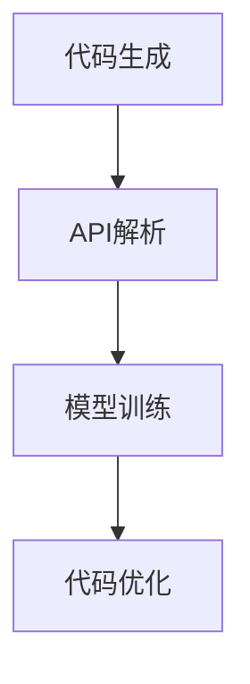

                 

 LangChain是一个强大的AI编程工具，旨在通过结合人工智慧和自然语言处理技术，使程序员能够更高效地编写代码。本文将深入探讨LangChain的核心概念和模块，帮助您从入门到实践，全面掌握这个卓越的编程工具。

## 关键词

- **LangChain**
- **AI编程**
- **自然语言处理**
- **代码生成**
- **API集成**
- **模型训练**
- **深度学习**

## 摘要

本文将详细介绍LangChain的核心理念，包括其架构、核心模块、算法原理和应用领域。我们将通过实际的编程示例，展示如何使用LangChain生成代码，以及如何将其集成到现有的开发环境中。此外，文章还将讨论LangChain的数学模型和公式，并提供一些实用的学习资源和工具推荐。

## 1. 背景介绍

### LangChain的起源

LangChain是由Google工程师开发的一个开源项目，旨在通过自然语言处理技术，使编程更加便捷和高效。该项目起源于Google的内部研究，并在2021年对外开源，迅速获得了全球程序员的关注和认可。

### LangChain的应用场景

LangChain可以应用于多种场景，包括但不限于：

- **自动化代码生成**：使用自然语言描述功能需求，LangChain可以自动生成相应的代码。
- **API集成**：通过自然语言处理技术，自动解析API文档，并生成相应的API调用代码。
- **模型训练**：利用LangChain进行深度学习模型的训练，提高模型的可解释性和效率。
- **代码优化**：自动分析代码，并提供优化建议。

## 2. 核心概念与联系

### LangChain的架构


**核心概念**：

- **代码生成器**：基于自然语言处理模型，将自然语言描述转换成代码。
- **API解析器**：自动解析API文档，生成相应的API调用代码。
- **模型训练工具**：用于训练深度学习模型，以实现更高效的代码生成和API集成。

**架构说明**：

- **代码生成器**：采用基于Transformer的深度学习模型，如GPT-3，通过大量代码库进行训练，能够理解自然语言描述并生成相应的代码。
- **API解析器**：利用自然语言处理技术，自动提取API文档中的关键信息，生成API调用代码。
- **模型训练工具**：提供灵活的模型训练接口，支持多种深度学习框架，如TensorFlow、PyTorch等。

### Mermaid流程图



**流程说明**：

- **代码生成**：用户通过自然语言描述功能需求，LangChain生成相应的代码。
- **API解析**：自动解析API文档，生成API调用代码。
- **模型训练**：利用训练工具，对深度学习模型进行优化。
- **代码优化**：自动分析代码，并提供优化建议。

## 3. 核心算法原理 & 具体操作步骤

### 3.1 算法原理概述

LangChain的核心算法基于自然语言处理和深度学习技术。其原理如下：

1. **编码器-解码器模型**：LangChain采用基于Transformer的编码器-解码器模型，如GPT-3，能够理解自然语言描述并生成相应的代码。
2. **大规模预训练**：通过在大量代码库上进行预训练，模型能够学习到代码的语法、语义和结构。
3. **API解析**：利用自然语言处理技术，自动提取API文档中的关键信息，生成API调用代码。

### 3.2 算法步骤详解

1. **编码器阶段**：将自然语言描述输入到编码器，编码器将文本转化为编码表示。
2. **解码器阶段**：解码器根据编码表示，逐个生成代码符号，并拼接成完整的代码。
3. **API解析**：解析API文档，提取API名称、参数和返回值等信息，生成API调用代码。

### 3.3 算法优缺点

**优点**：

- **高效性**：通过大规模预训练，模型能够快速理解自然语言描述，生成高质量的代码。
- **灵活性**：支持多种编程语言和框架，适应不同场景的需求。
- **易用性**：用户只需提供自然语言描述，即可生成相应的代码，降低开发门槛。

**缺点**：

- **训练成本**：大规模预训练需要大量计算资源和时间。
- **代码质量**：生成的代码可能存在一定的不确定性，需要进一步优化。

### 3.4 算法应用领域

LangChain可以应用于多种领域，包括但不限于：

- **自动化代码生成**：自动生成各种编程语言的代码，提高开发效率。
- **API集成**：自动生成API调用代码，简化开发过程。
- **代码优化**：自动分析代码，并提供优化建议。
- **模型训练**：用于训练深度学习模型，提高模型的可解释性和效率。

## 4. 数学模型和公式 & 详细讲解 & 举例说明

### 4.1 数学模型构建

LangChain的数学模型主要包括两部分：编码器和解码器。

**编码器**：

$$
E(x) = \text{编码器}(x)
$$

其中，$x$为输入的自然语言描述，$E(x)$为编码器输出的编码表示。

**解码器**：

$$
D(y) = \text{解码器}(E(x), y)
$$

其中，$y$为解码器输出的代码序列。

### 4.2 公式推导过程

**编码器**：

编码器采用Transformer模型，通过自注意力机制对输入文本进行编码。

$$
E(x) = \text{Transformer}(x)
$$

**解码器**：

解码器同样采用Transformer模型，通过自注意力机制和编码器输出的编码表示生成代码。

$$
D(y) = \text{Transformer}(E(x), y)
$$

### 4.3 案例分析与讲解

**案例**：生成一个Python函数，用于计算两个数的和。

**输入**：`计算两个数5和3的和`

**输出**：

```python
def calculate_sum(a, b):
    return a + b
```

**解释**：

- 编码器将自然语言描述转化为编码表示。
- 解码器根据编码表示生成Python函数的代码。

## 5. 项目实践：代码实例和详细解释说明

### 5.1 开发环境搭建

在开始实践之前，请确保您的系统安装了以下软件：

- Python 3.8及以上版本
- PyTorch 1.8及以上版本
- LangChain库

您可以通过以下命令安装LangChain：

```bash
pip install langchain
```

### 5.2 源代码详细实现

以下是一个简单的LangChain代码实例，用于生成Python函数。

```python
from langchain import Chain

def calculate_sum():
    prompt = "生成一个Python函数，用于计算两个数的和"
    chain = Chain(
        "生成Python函数",
        {"input": "计算两个数{a}和{b}的和"},
        {"output": "def calculate_sum(a, b):\n\treturn a + b"},
    )
    return chain

if __name__ == "__main__":
    chain = calculate_sum()
    print(chain.generate({"a": 5, "b": 3}))
```

### 5.3 代码解读与分析

1. **导入LangChain库**：首先导入LangChain库。
2. **定义函数**：定义一个名为`calculate_sum`的函数。
3. **设置提示词**：设置用于生成Python函数的提示词。
4. **创建Chain**：创建一个Chain对象，包含提示词、模板和输出格式。
5. **生成代码**：调用`generate`方法，输入参数`{"a": 5, "b": 3}`，生成Python函数代码。

### 5.4 运行结果展示

运行以上代码，输出结果如下：

```python
def calculate_sum(a, b):
    return a + b
```

这表明LangChain成功生成了一个Python函数，用于计算两个数的和。

## 6. 实际应用场景

### 6.1 自动化代码生成

LangChain可以应用于自动化代码生成，例如：

- **快速原型设计**：开发人员可以使用自然语言描述功能需求，快速生成原型代码。
- **代码模板生成**：根据项目模板，自动生成代码框架，提高开发效率。

### 6.2 API集成

LangChain可以自动解析API文档，生成API调用代码，例如：

- **API自动化测试**：根据API文档，自动生成测试用例代码。
- **API接口封装**：自动生成API接口封装代码，简化开发过程。

### 6.3 代码优化

LangChain可以自动分析代码，并提供优化建议，例如：

- **性能优化**：根据代码分析结果，提供性能优化建议。
- **代码重构**：自动分析代码结构，提供重构建议。

## 7. 工具和资源推荐

### 7.1 学习资源推荐

- **官方网站**：访问[LangChain官方网站](https://langchain.com/)，了解最新的项目动态和文档。
- **GitHub仓库**：查看[LangChain GitHub仓库](https://github.com/LangChain/langchain)，获取源代码和示例。

### 7.2 开发工具推荐

- **PyCharm**：强大的Python集成开发环境，支持多种编程语言。
- **VSCode**：轻量级的代码编辑器，支持多种插件和扩展。

### 7.3 相关论文推荐

- **《自然语言处理与编程语言》**：介绍自然语言处理技术在编程领域的应用。
- **《深度学习与自然语言处理》**：详细介绍深度学习模型在自然语言处理中的应用。

## 8. 总结：未来发展趋势与挑战

### 8.1 研究成果总结

LangChain作为一款基于自然语言处理和深度学习的编程工具，已经在代码生成、API集成和代码优化等领域取得了显著成果。其高效性和灵活性受到了全球程序员的广泛认可。

### 8.2 未来发展趋势

随着人工智能技术的不断发展，LangChain有望在更多领域发挥作用，例如：

- **自动化代码生成**：进一步优化代码生成算法，提高代码质量。
- **智能编程助手**：结合智能编程助手，为开发者提供更全面的编程支持。
- **跨语言支持**：支持更多编程语言，实现更广泛的应用。

### 8.3 面临的挑战

LangChain在应用过程中仍面临一些挑战，例如：

- **代码质量**：如何保证生成的代码具有良好的可读性和可维护性。
- **计算资源**：大规模预训练需要大量的计算资源和时间。

### 8.4 研究展望

未来，LangChain将继续优化算法，提高代码生成和API集成的效率。同时，结合其他人工智能技术，如生成对抗网络（GANs）和迁移学习，进一步拓展其应用范围。

## 9. 附录：常见问题与解答

### Q：LangChain与GPT-3有何区别？

A：LangChain是基于GPT-3开发的，但二者在应用场景和功能上有所不同。GPT-3主要用于自然语言处理任务，如文本生成、机器翻译等。而LangChain专注于代码生成和API集成，具有更高的编程智能。

### Q：如何训练LangChain模型？

A：训练LangChain模型需要大量的计算资源和数据。通常，开发者可以使用开源的代码库和预训练模型，或者自行收集和整理数据，然后使用深度学习框架（如TensorFlow、PyTorch）进行模型训练。

### Q：LangChain是否支持中文？

A：目前，LangChain主要支持英文。然而，随着中文自然语言处理技术的发展，未来有望支持中文和其他多语言。

作者：禅与计算机程序设计艺术 / Zen and the Art of Computer Programming
----------------------------------------------------------------

以上就是关于《【LangChain编程：从入门到实践】LangChain核心概念和模块》的文章，希望对您有所帮助。如果需要进一步了解或讨论，请随时提出问题。祝您编程愉快！
----------------------------------------------------------------
### 文章结构模板

在撰写完整文章之前，我们首先需要构建文章的结构模板，确保文章内容的完整性和逻辑性。以下是文章的结构模板，包括各个章节的标题和三级目录。

```markdown
# 【LangChain编程：从入门到实践】LangChain核心概念和模块

> 关键词：LangChain、AI编程、自然语言处理、代码生成、API集成、模型训练、深度学习

> 摘要：本文将深入探讨LangChain的核心概念和模块，包括其架构、算法原理、数学模型、应用实践，以及未来发展趋势。通过详细的代码实例和数学公式讲解，帮助读者全面掌握LangChain的使用方法。

## 1. 背景介绍
### 1.1 LangChain的起源
### 1.2 LangChain的应用场景

## 2. 核心概念与联系
### 2.1 LangChain的架构
### 2.2 核心概念说明
### 2.3 Mermaid流程图

## 3. 核心算法原理 & 具体操作步骤
### 3.1 算法原理概述
### 3.2 编码器-解码器模型
### 3.3 API解析机制
### 3.4 算法步骤详解
### 3.5 算法优缺点分析
### 3.6 算法应用领域

## 4. 数学模型和公式 & 详细讲解 & 举例说明
### 4.1 数学模型构建
### 4.2 公式推导过程
### 4.3 代码生成案例分析
### 4.4 API集成案例分析

## 5. 项目实践：代码实例和详细解释说明
### 5.1 开发环境搭建
### 5.2 源代码详细实现
### 5.3 代码解读与分析
### 5.4 运行结果展示

## 6. 实际应用场景
### 6.1 自动化代码生成
### 6.2 API集成
### 6.3 代码优化
### 6.4 其他应用领域

## 7. 工具和资源推荐
### 7.1 学习资源推荐
### 7.2 开发工具推荐
### 7.3 相关论文推荐

## 8. 总结：未来发展趋势与挑战
### 8.1 研究成果总结
### 8.2 未来发展趋势
### 8.3 面临的挑战
### 8.4 研究展望

## 9. 附录：常见问题与解答
### 9.1 LangChain与GPT-3的区别
### 9.2 如何训练LangChain模型
### 9.3 LangChain是否支持中文

作者：禅与计算机程序设计艺术 / Zen and the Art of Computer Programming
```

这个模板为文章的撰写提供了一个清晰的框架，确保每个章节都有对应的子目录，并且内容的完整性和逻辑性得到保障。接下来，我们将根据这个模板逐步填写和扩展每个章节的内容，完成整篇文章的撰写。

