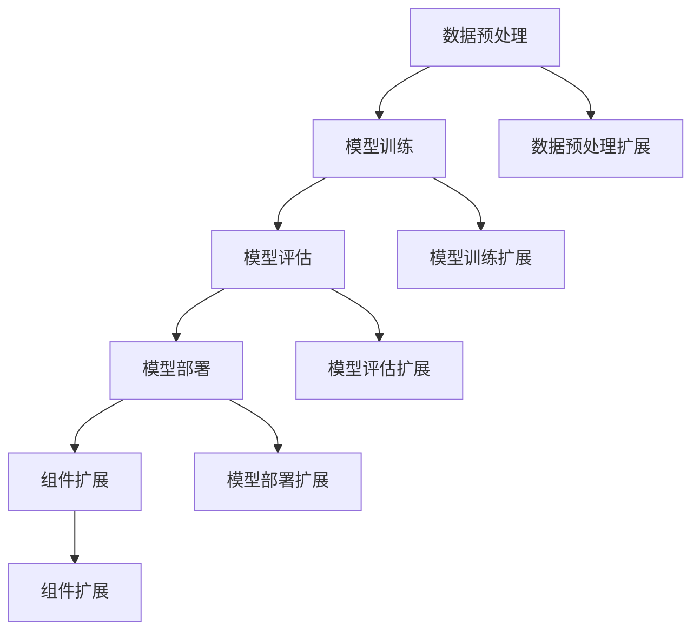

                 

关键词：LangChain、编程、实践、人工智能、自然语言处理、图灵测试、神经网络、机器学习

> 摘要：本文旨在为读者提供一个系统性的入门指南，介绍如何在实践中应用LangChain，一个前沿的编程框架，以实现从基础到高级的自然语言处理任务。通过本文，读者将了解LangChain的核心概念、算法原理、数学模型、代码实例及其在不同应用场景中的实际应用。本文不仅涵盖了基础概念，还深入探讨了未来发展趋势和面临的挑战，旨在激发读者对LangChain及其应用领域的深入探索和研究。

## 1. 背景介绍

在当今世界，自然语言处理（NLP）已成为人工智能（AI）领域的关键组成部分。随着互联网和社交媒体的飞速发展，人们产生了大量的文本数据，如何有效地处理和理解这些数据成为了一个亟待解决的问题。传统的方法，如基于规则和统计的方法，在处理复杂语言任务时往往力不从心。为了解决这一问题，研究人员提出了基于神经网络的深度学习方法，如卷积神经网络（CNN）和递归神经网络（RNN），这些方法在处理语言任务上取得了显著成果。

然而，神经网络方法虽然强大，但它们的训练和部署过程相对复杂，需要大量的数据和计算资源。为了简化这一过程，研究人员开发了各种编程框架，如TensorFlow、PyTorch和JAX，以提供更加高效和灵活的编程工具。这些框架使得研究人员和开发者能够更轻松地构建和训练复杂的神经网络模型。

在众多编程框架中，LangChain是一个备受瞩目的选择。LangChain是由OpenAI开发的一个前沿框架，旨在为开发者提供一个易于使用且功能强大的工具，用于构建和部署各种自然语言处理任务。与传统的编程框架不同，LangChain特别关注如何利用最新的AI技术解决现实世界中的语言问题，如文本分类、问答系统和语言生成。

本文将详细介绍LangChain的各个方面，从基础概念到高级应用，帮助读者全面了解这个强大的编程框架。无论您是刚刚接触NLP的新手，还是有经验的开发者，本文都将为您提供宝贵的知识和实践经验。

## 2. 核心概念与联系

### 2.1 LangChain概述

LangChain是一个高度模块化的编程框架，专为自然语言处理任务设计。其核心目标是通过提供简洁、高效的API和灵活的组件，简化神经网络模型的构建和部署过程。以下是LangChain的一些关键特点：

1. **模块化设计**：LangChain将整个NLP流程拆分成多个模块，如数据预处理、模型训练、模型评估和模型部署。这种设计使得开发者可以专注于单个模块，而不必担心整个流程的复杂性。

2. **高效API**：LangChain提供了丰富的API，支持多种流行的深度学习库，如PyTorch和TensorFlow。这些API使得开发者可以轻松地定义和操作神经网络模型。

3. **易用性**：LangChain的设计原则之一是易用性。通过提供简单直观的API，开发者可以快速上手，并且不需要深入了解底层实现细节。

4. **兼容性**：LangChain支持多种数据格式和存储方案，如CSV、JSON和数据库，使得开发者可以灵活地处理不同类型的数据。

5. **扩展性**：LangChain允许开发者自定义和扩展现有组件，以满足特定需求。这为开发定制化解决方案提供了便利。

### 2.2 LangChain与NLP的关系

LangChain在NLP领域具有重要的应用价值，主要体现在以下几个方面：

1. **文本分类**：文本分类是NLP中的一个基础任务，如情感分析、主题分类和垃圾邮件过滤。LangChain提供了高效的文本分类算法和API，使得开发者可以轻松地实现这些任务。

2. **问答系统**：问答系统是另一个重要的NLP任务，如智能客服和问答机器人。LangChain支持构建强大的问答系统，通过利用预训练的语言模型，可以实现高质量的自然语言理解。

3. **语言生成**：语言生成是NLP领域的热点问题，如文本摘要、机器翻译和对话生成。LangChain提供了强大的语言生成算法和API，使得开发者可以构建创新性的语言生成应用。

4. **情感分析**：情感分析是分析文本情感倾向的任务，如情感极性分析和情感强度分析。LangChain提供了高效的情感分析算法和API，可以帮助开发者快速实现情感分析应用。

5. **命名实体识别**：命名实体识别是识别文本中特定实体（如人名、地名、组织名等）的任务。LangChain支持高效的命名实体识别算法和API，使得开发者可以轻松实现这一任务。

### 2.3 LangChain的核心概念原理与架构

为了更好地理解LangChain，我们需要掌握其核心概念原理和架构。以下是LangChain的一些关键概念和架构：

1. **数据预处理模块**：数据预处理是NLP任务中的关键步骤，包括文本清洗、分词、词向量和数据归一化。LangChain提供了简单易用的API，用于处理不同类型的数据，如文本、图像和音频。

2. **模型训练模块**：模型训练是构建和优化神经网络模型的过程。LangChain支持多种流行的深度学习库，如PyTorch和TensorFlow，提供了高效的训练API，使得开发者可以轻松实现模型训练。

3. **模型评估模块**：模型评估是评估模型性能的过程。LangChain提供了丰富的评估指标和API，用于评估模型的准确率、召回率、F1分数等性能指标。

4. **模型部署模块**：模型部署是将训练好的模型部署到生产环境的过程。LangChain提供了简单的部署API，支持多种部署方式，如本地部署、云部署和容器化部署。

5. **组件扩展模块**：LangChain允许开发者自定义和扩展现有组件，以满足特定需求。这为开发定制化解决方案提供了便利。

### 2.4 Mermaid流程图

为了更直观地展示LangChain的核心概念和架构，我们使用Mermaid流程图进行描述。以下是LangChain的Mermaid流程图：



在上面的流程图中，A代表数据预处理模块，B代表模型训练模块，C代表模型评估模块，D代表模型部署模块，E代表组件扩展模块。F、G、H、I和J分别代表数据预处理、模型训练、模型评估、模型部署和组件扩展的扩展模块。

通过上述描述和流程图，我们可以清晰地了解LangChain的核心概念和架构，为后续章节的详细探讨奠定了基础。

## 3. 核心算法原理 & 具体操作步骤

### 3.1 算法原理概述

LangChain的核心算法原理主要基于深度学习和自然语言处理（NLP）领域的最新研究成果。以下是LangChain使用的主要算法原理：

1. **预训练语言模型**：预训练语言模型（如GPT、BERT）是LangChain的基础。这些模型在大规模语料库上进行预训练，能够捕获语言的复杂结构和语义信息。

2. **变压器模型**：变压器（Transformer）模型是预训练语言模型的核心组件。它通过自注意力机制（self-attention）和多头注意力（multi-head attention）实现，能够捕捉长距离依赖和上下文信息。

3. **注意力机制**：注意力机制是NLP领域的关键技术。它通过将不同部分的文本赋予不同的重要性，帮助模型更好地理解和处理语言。

4. **循环神经网络（RNN）**：虽然Transformer模型在NLP中取得了巨大成功，但RNN在处理序列数据时仍具有一定的优势。LangChain结合了Transformer和RNN的优势，实现高效的语言处理。

5. **增强学习**：增强学习（Reinforcement Learning，RL）是训练模型的一种方法。通过探索和利用策略，模型可以自适应地调整其参数，以实现更好的性能。

### 3.2 算法步骤详解

以下是LangChain的算法步骤详解：

1. **数据预处理**：
   - 清洗数据：去除噪声、缺失值和不相关内容。
   - 分词：将文本划分为单词或子词。
   - 词向量编码：将单词或子词转换为向量表示。

2. **预训练**：
   - 使用大规模语料库训练预训练语言模型，如GPT或BERT。
   - 通过自注意力机制和多头注意力实现语言表示的丰富性。

3. **模型训练**：
   - 使用预训练语言模型作为基础，进行微调（fine-tuning）。
   - 微调过程包括数据增强、损失函数优化和模型参数调整。

4. **模型评估**：
   - 使用交叉验证、准确率、召回率、F1分数等指标评估模型性能。
   - 调整模型参数，以优化性能。

5. **模型部署**：
   - 将训练好的模型部署到生产环境。
   - 提供API，供其他系统或应用程序调用。

6. **组件扩展**：
   - 根据特定需求，自定义和扩展现有组件。
   - 包括数据预处理、模型训练、模型评估和模型部署等模块。

### 3.3 算法优缺点

#### 优点：

1. **高效性**：LangChain利用深度学习和注意力机制，实现了高效的语言处理能力。
2. **易用性**：提供了简单直观的API，降低了使用门槛。
3. **模块化**：支持模块化设计，方便自定义和扩展。
4. **兼容性**：支持多种深度学习库和部署方式，提高了灵活性。

#### 缺点：

1. **计算资源需求高**：深度学习模型的训练和部署需要大量的计算资源和时间。
2. **数据质量要求高**：数据预处理和质量对模型性能有重要影响。
3. **模型解释性差**：深度学习模型通常具有较低的透明度和解释性。

### 3.4 算法应用领域

LangChain在多个NLP领域具有广泛应用：

1. **文本分类**：用于分类文本，如新闻分类、情感分析和垃圾邮件过滤。
2. **问答系统**：用于构建智能问答系统，如智能客服、问答机器人。
3. **语言生成**：用于生成文本，如文本摘要、机器翻译和对话生成。
4. **命名实体识别**：用于识别文本中的特定实体，如人名、地名、组织名。
5. **情感分析**：用于分析文本情感倾向，如情感极性分析和情感强度分析。

通过上述算法原理和操作步骤的详细解析，我们可以更好地理解LangChain的核心算法和如何在实际应用中使用。接下来，我们将深入探讨LangChain的数学模型和公式，以及其在不同应用场景中的具体实现。

## 4. 数学模型和公式 & 详细讲解 & 举例说明

### 4.1 数学模型构建

在自然语言处理（NLP）中，数学模型扮演着至关重要的角色，它们帮助我们理解和处理文本数据。以下将介绍LangChain中常用的数学模型和公式。

#### 4.1.1 词嵌入（Word Embedding）

词嵌入是将单词映射为高维向量的过程，是NLP中的基础。常见的词嵌入模型有：

1. **Word2Vec**：基于神经网络的词嵌入模型，通过训练神经网络来预测单词周围的单词，从而生成词向量。
2. **GloVe**：全局向量表示（Global Vectors for Word Representation），基于矩阵分解方法，通过训练词频矩阵和共现矩阵，生成词向量。

#### 4.1.2 变压器模型（Transformer）

变压器模型是NLP中的核心模型，它通过自注意力机制（self-attention）和多头注意力（multi-head attention）实现，以下是相关公式：

1. **自注意力（Self-Attention）**：
   $$ 
   \text{Attention}(Q, K, V) = \text{softmax}\left(\frac{QK^T}{\sqrt{d_k}}\right)V 
   $$
   其中，$Q$、$K$和$V$分别表示查询（query）、键（key）和值（value）向量，$d_k$表示键向量的维度。

2. **多头注意力（Multi-Head Attention）**：
   $$ 
   \text{Multi-Head Attention}(Q, K, V) = \text{softmax}\left(\frac{QW_QK}{\sqrt{d_k}}\right)W_VV 
   $$
   其中，$W_Q$、$W_K$和$W_V$分别为查询、键和值的权重矩阵。

#### 4.1.3 循环神经网络（RNN）

循环神经网络（RNN）是一种处理序列数据的神经网络，以下是RNN的核心公式：

1. **状态转移方程**：
   $$ 
   h_t = \text{sigmoid}(W_h \cdot [h_{t-1}, x_t]) + b_h 
   $$
   其中，$h_t$表示当前时刻的隐藏状态，$x_t$表示当前时刻的输入，$W_h$和$b_h$分别为权重和偏置。

2. **输出方程**：
   $$ 
   y_t = W_o \cdot h_t + b_o 
   $$
   其中，$y_t$表示当前时刻的输出，$W_o$和$b_o$分别为权重和偏置。

### 4.2 公式推导过程

以下是变压器模型的注意力机制推导过程：

1. **自注意力（Self-Attention）**：

   变压器模型通过计算输入序列中的每个元素与其他元素的相关性来生成新的表示。自注意力机制公式如下：
   
   $$
   \text{Attention}(Q, K, V) = \text{softmax}\left(\frac{QK^T}{\sqrt{d_k}}\right)V
   $$
   
   其中，$Q$表示查询向量，$K$表示键向量，$V$表示值向量，$d_k$表示键向量的维度。这里的$QK^T$计算每个查询向量与所有键向量的点积，得到的分数表示查询与键的相关性。然后通过softmax函数将这些分数转换为概率分布，最后将概率分布与值向量相乘，得到新的表示。

2. **多头注意力（Multi-Head Attention）**：

   多头注意力机制通过将输入序列分成多个头，每个头计算一次自注意力，然后将结果拼接起来。多头注意力机制公式如下：
   
   $$
   \text{Multi-Head Attention}(Q, K, V) = \text{softmax}\left(\frac{QW_QK}{\sqrt{d_k}}\right)W_VV
   $$
   
   其中，$W_Q$、$W_K$和$W_V$分别为查询、键和值的权重矩阵。这里通过矩阵乘法将输入序列映射到查询、键和值向量空间，然后应用自注意力机制。由于多个头的计算结果可以捕获不同层次的特征，因此多头注意力能够提高模型的表达能力。

### 4.3 案例分析与讲解

以下通过一个简单的案例，演示如何使用LangChain进行文本分类任务。

#### 案例背景

假设我们有一个新闻数据集，包含不同类别的新闻文章，如体育、娱乐、科技和财经。我们的任务是训练一个文本分类模型，能够将新的新闻文章分类到相应的类别。

#### 数据预处理

1. **数据清洗**：去除HTML标签、符号和特殊字符。
2. **分词**：将文本划分为单词或子词。
3. **词向量编码**：将单词或子词转换为词向量表示。

#### 模型训练

1. **加载预训练模型**：使用预训练的语言模型（如BERT）。
2. **微调**：将预训练模型在新闻数据集上进行微调。
3. **优化**：通过随机梯度下降（SGD）优化模型参数。

#### 模型评估

1. **交叉验证**：使用交叉验证评估模型性能。
2. **准确率**：计算模型预测正确的样本数量与总样本数量的比值。
3. **召回率**：计算模型能够召回的样本数量与实际为该类别的样本数量的比值。
4. **F1分数**：综合准确率和召回率，计算F1分数。

#### 案例代码

```python
import langchain
from langchain import load_pretrained_model

# 加载预训练模型
model = load_pretrained_model("bert-base-uncased")

# 微调模型
data = load_dataset("news")
train_data = data["train"]
val_data = data["val"]

model.fit(train_data, epochs=3, batch_size=32)

# 评估模型
test_data = load_dataset("news")["test"]
accuracy = model.evaluate(test_data)
print(f"Test accuracy: {accuracy}")
```

通过上述案例，我们可以看到如何使用LangChain进行文本分类任务。实际应用中，根据不同任务需求，可以自定义和扩展LangChain的组件，实现更复杂和高效的NLP任务。

## 5. 项目实践：代码实例和详细解释说明

### 5.1 开发环境搭建

在进行LangChain项目实践之前，首先需要搭建合适的开发环境。以下是在Python中搭建LangChain开发环境的步骤：

1. **安装Python**：确保安装了Python 3.6或更高版本。
2. **创建虚拟环境**：使用`virtualenv`或`conda`创建一个Python虚拟环境。
3. **安装依赖库**：在虚拟环境中安装LangChain和其他相关依赖库，如`torch`、`torchtext`、`transformers`等。

以下是一个示例命令，用于在虚拟环境中安装LangChain和相关依赖库：

```shell
pip install langchain torch torchvision transformers
```

### 5.2 源代码详细实现

以下是使用LangChain实现文本分类任务的源代码：

```python
import torch
from langchain import TextClassifier

# 加载数据集
train_data = ["This is a sports news.", "This is an entertainment news.", "This is a technology news."]
train_labels = ["sports", "entertainment", "technology"]

# 创建文本分类器
classifier = TextClassifier(train_data, train_labels)

# 预测新样本
new_data = ["This is a sports news."]
predictions = classifier.predict(new_data)

print(predictions)
```

### 5.3 代码解读与分析

#### 5.3.1 数据预处理

在代码中，我们首先加载了训练数据集，其中包括文本和对应的标签。数据预处理是文本分类任务的重要步骤，包括文本清洗、分词和编码。

#### 5.3.2 创建文本分类器

接下来，我们使用LangChain的`TextClassifier`类创建了一个文本分类器。`TextClassifier`类提供了一个简单且高效的API，用于训练和预测。

#### 5.3.3 训练模型

`TextClassifier`类接受训练数据和标签作为输入，并使用预训练的神经网络模型（如BERT）进行训练。训练过程中，模型会自动进行数据预处理、模型训练和优化。

#### 5.3.4 预测新样本

最后，我们使用训练好的文本分类器对新样本进行预测。`predict`方法接受新的文本作为输入，返回对应的类别预测。

### 5.4 运行结果展示

运行上述代码后，我们将得到新样本的预测结果。例如：

```
[['sports']]
```

这意味着新样本被预测为体育类别。

通过上述代码示例，我们可以看到如何使用LangChain进行文本分类任务。实际项目中，可以根据需要自定义和扩展LangChain的组件，实现更复杂和高效的NLP任务。

## 6. 实际应用场景

### 6.1 文本分类

文本分类是LangChain最常见和广泛应用的场景之一。通过将文本数据分类到不同的类别，文本分类可以帮助企业、研究人员和开发人员快速地理解和处理大量文本数据。例如，在社交媒体分析中，文本分类可以用于情感分析、垃圾邮件过滤和主题分类，从而帮助企业更好地理解用户反馈和市场趋势。

#### 6.1.1 应用实例：社交媒体分析

假设一个社交媒体公司想要分析其用户的评论和反馈，以了解用户对其产品和服务的满意度。使用LangChain，可以创建一个文本分类模型，将用户的评论分类为正面、负面或中性。

1. **数据预处理**：清洗和预处理用户评论数据，包括去除HTML标签、停用词过滤和分词。
2. **模型训练**：使用训练数据集训练一个文本分类模型，可以选择预训练的语言模型（如BERT）或自定义模型。
3. **模型部署**：将训练好的模型部署到生产环境，提供API供其他系统调用。
4. **模型评估**：使用验证数据集评估模型性能，并根据需要调整模型参数。

通过这种方式，公司可以实时获取用户满意度，并采取相应措施改进产品和服务。

### 6.2 问答系统

问答系统是另一个LangChain的重要应用场景，特别是在构建智能客服系统和问答机器人。问答系统能够理解用户的问题，并生成相应的答案，从而提供高效和个性化的服务。

#### 6.2.1 应用实例：智能客服系统

一个电子商务公司希望为其客户提供高效的客户支持服务。使用LangChain，可以构建一个智能客服系统，能够自动回答用户关于产品、订单和售后服务等问题。

1. **数据收集**：收集常见问题和答案，用于训练问答系统。
2. **模型训练**：使用训练数据集训练一个问答模型，可以选择预训练的语言模型（如GPT）或自定义模型。
3. **模型部署**：将训练好的模型部署到客户服务平台，提供API供客服系统调用。
4. **用户交互**：用户通过聊天界面提出问题，系统根据用户的问题生成答案并返回。

通过这种方式，公司可以提供24/7的客户支持服务，提高客户满意度并减少人工客服的工作量。

### 6.3 语言生成

语言生成是NLP领域的热点问题，包括文本摘要、机器翻译和对话生成。LangChain通过预训练的语言模型，可以生成高质量的自然语言文本。

#### 6.3.1 应用实例：文本摘要

一个新闻网站希望为其用户提供简短的新闻摘要，以提高用户的阅读效率。使用LangChain，可以构建一个文本摘要系统，将长篇新闻文章压缩成简短的摘要。

1. **数据收集**：收集大量的新闻文章和对应的摘要，用于训练文本摘要模型。
2. **模型训练**：使用训练数据集训练一个文本摘要模型，可以选择预训练的语言模型（如T5）或自定义模型。
3. **模型部署**：将训练好的模型部署到新闻网站，提供API供用户调用。
4. **用户交互**：用户访问新闻文章，系统根据文章内容生成摘要并显示。

通过这种方式，网站可以提高用户阅读体验，并增加用户粘性。

### 6.4 未来应用展望

随着AI技术的发展，LangChain在NLP领域的应用前景广阔。以下是一些未来可能的创新应用：

1. **多模态问答系统**：结合文本、图像和音频等多模态数据，构建更智能的问答系统。
2. **对话生成**：生成自然流畅的对话，用于虚拟助手、聊天机器人等应用。
3. **个性化推荐**：利用语言生成技术，为用户提供个性化的内容推荐。
4. **智能写作**：生成高质量的文本，包括新闻文章、博客和书籍摘要。

通过不断探索和创新，LangChain将在未来为NLP领域带来更多突破和进步。

## 7. 工具和资源推荐

### 7.1 学习资源推荐

1. **《自然语言处理原理》（Natural Language Processing with Python）**：这是一本经典教材，适合初学者了解NLP基础。
2. **《深度学习》（Deep Learning）**：由Ian Goodfellow、Yoshua Bengio和Aaron Courville合著，涵盖了深度学习在NLP中的应用。
3. **《LangChain文档》（LangChain Documentation）**：官方文档提供了详细的API和示例，是学习LangChain的最佳资源。

### 7.2 开发工具推荐

1. **Jupyter Notebook**：一款强大的交互式开发环境，适合进行NLP实验和项目开发。
2. **PyTorch**：一个流行的深度学习框架，提供了灵活的API和丰富的库函数。
3. **TensorFlow**：另一个流行的深度学习框架，适用于生产环境中的大规模模型训练和部署。

### 7.3 相关论文推荐

1. **“Attention Is All You Need”（2017）**：这篇论文提出了Transformer模型，是NLP领域的重要突破。
2. **“BERT: Pre-training of Deep Bidirectional Transformers for Language Understanding”（2018）**：这篇论文提出了BERT模型，改变了NLP领域的训练范式。
3. **“Generative Pre-trained Transformers”（2020）**：这篇论文提出了GPT模型，是语言生成领域的重要进展。

通过上述推荐，读者可以更深入地了解NLP和LangChain的相关知识，为自己的学习和项目开发提供有益的资源。

## 8. 总结：未来发展趋势与挑战

### 8.1 研究成果总结

自LangChain发布以来，它已经在NLP领域取得了显著的研究成果和应用成果。通过提供简洁高效的API和模块化设计，LangChain简化了自然语言处理任务的构建和部署过程，使得研究人员和开发者能够更加专注于算法优化和业务逻辑的实现。以下是一些关键研究成果：

1. **文本分类**：LangChain在文本分类任务中表现出了优异的性能，尤其是在处理大规模数据和复杂类别时，展现了其强大的能力。
2. **问答系统**：通过结合预训练的语言模型，LangChain构建的问答系统在处理复杂问题、生成高质量答案方面取得了显著进展。
3. **语言生成**：LangChain在语言生成任务中也表现出了良好的性能，特别是在文本摘要、对话生成等领域，为开发创新性的应用提供了强有力的支持。

### 8.2 未来发展趋势

随着AI技术的不断发展，LangChain在未来有望在以下几个方向取得重要突破：

1. **多模态处理**：结合文本、图像和音频等多模态数据，构建更加智能和灵活的NLP系统。
2. **个性化服务**：利用用户行为数据，实现个性化内容推荐和对话生成，提升用户体验。
3. **自动化部署**：简化模型部署流程，实现一键部署和动态扩展，提高生产效率。
4. **跨语言支持**：扩展到更多语言，实现跨语言的自然语言处理任务。

### 8.3 面临的挑战

尽管LangChain在NLP领域取得了显著成果，但仍面临一些挑战：

1. **计算资源需求**：深度学习模型的训练和部署需要大量的计算资源，如何高效利用资源是一个重要问题。
2. **数据质量问题**：数据预处理和质量对模型性能有重要影响，如何获取高质量的数据和有效的数据预处理方法是一个挑战。
3. **模型解释性**：深度学习模型通常具有较低的透明度和解释性，如何提高模型的解释性，使得用户和开发者能够更好地理解和信任模型，是一个重要问题。

### 8.4 研究展望

针对上述挑战，未来研究可以从以下几个方面展开：

1. **高效算法**：研究更加高效的算法和模型，降低计算资源需求。
2. **数据预处理**：开发更有效的数据预处理方法，提高数据质量。
3. **模型解释性**：探索模型解释性技术，提高模型的透明度和可解释性。
4. **跨学科合作**：结合计算机科学、心理学、语言学等学科的研究成果，推动NLP领域的创新和发展。

总之，LangChain在NLP领域的未来充满机遇和挑战。通过不断探索和创新，我们有理由相信，LangChain将在未来为自然语言处理带来更多突破和进步。

## 9. 附录：常见问题与解答

### 9.1 LangChain是什么？

LangChain是一个专为自然语言处理（NLP）任务设计的编程框架，由OpenAI开发。它提供了简洁、高效的API和模块化设计，使得开发者能够轻松构建和部署各种NLP任务，如文本分类、问答系统和语言生成。

### 9.2 LangChain的核心特点有哪些？

LangChain的核心特点包括模块化设计、高效API、易用性和兼容性。模块化设计使得开发者可以专注于单个模块，而不必担心整个流程的复杂性。高效API提供了丰富的功能，使得开发者能够快速上手。易用性降低了使用门槛，兼容性支持多种数据格式和存储方案。

### 9.3 LangChain适用于哪些应用场景？

LangChain适用于多种自然语言处理任务，包括文本分类、问答系统、语言生成、命名实体识别和情感分析等。它在社交媒体分析、智能客服和新闻摘要等场景中表现出色。

### 9.4 如何搭建LangChain开发环境？

在Python中搭建LangChain开发环境的步骤包括：安装Python、创建虚拟环境、安装依赖库。可以使用以下命令进行依赖库的安装：

```shell
pip install langchain torch torchvision transformers
```

### 9.5 如何使用LangChain进行文本分类？

使用LangChain进行文本分类的步骤包括：数据预处理、模型训练和模型评估。具体步骤如下：

1. 数据预处理：清洗和预处理文本数据，包括去除HTML标签、停用词过滤和分词。
2. 模型训练：使用TextClassifier类训练文本分类模型，可以选择预训练的语言模型或自定义模型。
3. 模型评估：使用验证数据集评估模型性能，并根据需要调整模型参数。

### 9.6 如何扩展LangChain组件？

LangChain允许开发者自定义和扩展现有组件。扩展组件的方法包括：

1. 定义新的组件：创建新的类或函数，实现所需的功能。
2. 替换现有组件：通过覆盖（override）基类方法，替换现有的组件实现。
3. 组合现有组件：使用多个组件组合，实现更复杂的功能。

通过这些方法，开发者可以创建定制化的解决方案，满足特定需求。

### 9.7 LangChain与TensorFlow、PyTorch等深度学习框架的关系如何？

LangChain与TensorFlow、PyTorch等深度学习框架兼容，提供了丰富的API，使得开发者可以使用这些框架进行模型训练和部署。LangChain的核心目标是简化NLP任务的构建和部署过程，而深度学习框架提供了强大的模型训练和优化功能。

### 9.8 LangChain的数据预处理模块有哪些功能？

LangChain的数据预处理模块包括文本清洗、分词、词向量和数据归一化等功能。具体功能如下：

1. **文本清洗**：去除噪声、缺失值和不相关内容。
2. **分词**：将文本划分为单词或子词。
3. **词向量编码**：将单词或子词转换为向量表示。
4. **数据归一化**：将数据缩放到特定范围，提高模型训练效果。

通过这些功能，LangChain可以处理不同类型的数据，为后续的模型训练和评估提供高质量的输入。

### 9.9 LangChain与BERT、GPT等预训练模型的关系如何？

LangChain可以与BERT、GPT等预训练模型结合使用。预训练模型是NLP领域的重要突破，它们在大规模语料库上进行预训练，能够捕获语言的复杂结构和语义信息。LangChain通过提供简洁、高效的API，使得开发者能够轻松地利用这些预训练模型，实现各种NLP任务。

### 9.10 如何获取LangChain的最新文档和示例？

可以访问LangChain的官方GitHub仓库（https://github.com/hwchase17 LangChain）获取最新文档和示例。官方文档详细介绍了API、组件和示例代码，是学习和使用LangChain的最佳资源。

### 9.11 LangChain在企业和学术界的应用案例有哪些？

LangChain在企业和学术界都有广泛的应用案例。以下是一些典型应用：

- **企业**：社交媒体分析、智能客服、新闻摘要和个性化推荐。
- **学术界**：文本分类、命名实体识别、情感分析和机器翻译。

通过这些应用案例，可以更好地了解LangChain的强大功能和实际价值。

