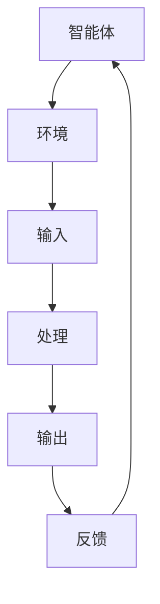
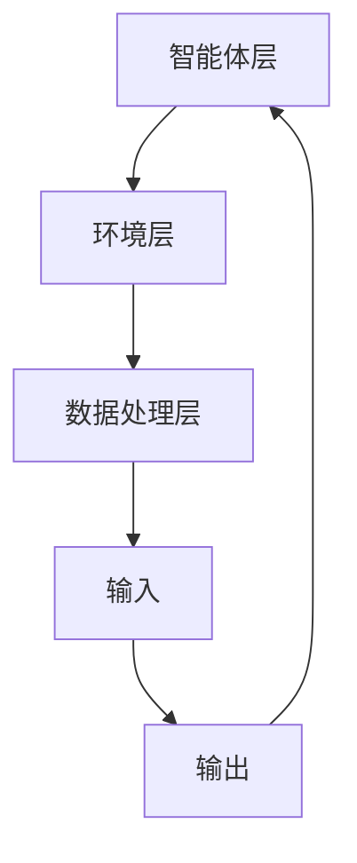

                 

关键词：LangChain，编程，应用监控，AI，数据流，性能分析，代码示例，未来展望

## 摘要

随着现代应用程序的复杂性不断增加，确保其稳定运行和高效性能变得至关重要。本文将介绍如何使用LangChain编程框架，对应用进行全面的监控。我们将探讨LangChain的核心概念、实现方法、数学模型，并通过实际项目案例，展示其如何在性能分析和数据流监控中发挥作用。文章还将展望LangChain在未来应用中的潜力与面临的挑战。

## 1. 背景介绍

在现代软件开发中，应用监控已成为确保系统稳定性和性能的关键组成部分。开发者需要实时监控应用程序的运行状态，及时识别潜在问题并进行优化。传统的监控方法往往依赖于单独的监控工具，这些工具需要大量的配置和维护工作。而现代编程框架如LangChain的出现，为开发者提供了一种集成化的解决方案，使得应用监控更加高效和便捷。

LangChain是一个基于图灵完全智能体（Turing-complete agent）的编程框架，它允许开发者通过图灵完全语言（Turing-complete language）编写智能体，这些智能体可以在复杂的环境中执行各种任务。LangChain的核心优势在于其强大的数据处理能力和灵活的编程模型，这使得它成为进行应用监控的强大工具。

本文将首先介绍LangChain的基本原理和架构，然后详细阐述如何在应用中实现监控功能，最后讨论LangChain的未来发展方向和面临的挑战。

## 2. 核心概念与联系

### 2.1 LangChain的基本原理

LangChain的核心概念是基于图灵完全智能体。图灵完全智能体是一种可以执行任何可计算任务的智能体，这意味着它具有无限的计算能力。LangChain通过引入图灵完全语言，使得开发者可以编写出能够处理复杂任务的智能体。图灵完全语言通常指的是Lisp等编程语言，它们支持递归、函数调用和符号操作等高级功能。

#### Mermaid流程图

以下是一个简化的Mermaid流程图，展示了LangChain的核心概念和组成部分：



在这个流程图中，智能体（A）接收输入（C），通过处理（D）产生输出（E），并接收反馈（F）以调整其行为。这种循环过程使得智能体能够持续地与环境（B）交互，从而实现复杂任务的执行。

### 2.2 LangChain的架构

LangChain的架构分为三层：智能体层、环境层和数据处理层。

- **智能体层**：这是LangChain的核心部分，开发者在此层编写智能体，实现具体任务的功能。智能体可以由Lisp等图灵完全语言编写，也可以通过其他编程语言实现。
- **环境层**：环境层提供了智能体执行任务的环境，可以是物理世界、模拟环境或虚拟环境。环境层与智能体层通过输入输出进行交互。
- **数据处理层**：数据处理层负责处理智能体的输入输出数据，它可以进行数据清洗、转换、分析等操作。这一层通常使用Python、R等编程语言来实现。

#### Mermaid流程图

以下是一个更详细的Mermaid流程图，展示了LangChain的架构：



在这个流程图中，智能体层（A）与环境层（B）和数据处理层（C）通过输入输出进行交互。智能体层负责执行任务，环境层提供执行任务的场景，数据处理层负责处理输入输出数据。

## 3. 核心算法原理 & 具体操作步骤

### 3.1 算法原理概述

LangChain的核心算法是基于图灵完全智能体，其原理可以概括为以下步骤：

1. **初始化智能体**：开发者首先需要定义智能体的行为，这通常通过编写智能体的代码实现。智能体可以接收输入数据，并对其进行处理，产生输出数据。
2. **智能体与环境交互**：智能体在环境中执行任务，通过输入输出与外部系统进行交互。智能体可以根据环境提供的反馈调整其行为。
3. **数据处理**：智能体在执行任务的过程中，会生成大量的输入输出数据。这些数据需要经过数据处理层的处理，以提取有用的信息。

### 3.2 算法步骤详解

下面是LangChain监控算法的具体步骤：

1. **定义智能体**：首先，开发者需要定义一个智能体，这个智能体将负责监控应用程序的运行状态。智能体可以接收系统日志、性能指标等数据作为输入，并根据这些数据进行处理。
2. **数据收集**：智能体通过系统API或日志文件收集应用程序的运行数据，包括CPU利用率、内存使用情况、网络流量等。
3. **数据处理**：智能体对收集到的数据进行预处理，如去除噪声、填充缺失值等。然后，智能体使用数据处理层提供的算法对数据进行分析，以提取关键信息。
4. **异常检测**：智能体使用异常检测算法，如K均值聚类、孤立森林等，对处理后的数据进行异常检测。如果检测到异常，智能体会生成警报并通知管理员。
5. **反馈调整**：智能体根据环境提供的反馈，调整其行为。例如，如果检测到应用程序性能下降，智能体可能会调整资源配置，以提高性能。

### 3.3 算法优缺点

**优点**：

- **灵活性**：LangChain支持使用图灵完全语言编写智能体，这使得智能体可以处理非常复杂的问题。
- **自动化**：智能体可以自动收集、处理和分析数据，减少了人工干预的需要。
- **可扩展性**：智能体可以方便地扩展和升级，以适应新的监控需求。

**缺点**：

- **复杂性**：由于支持图灵完全语言，LangChain的编程模型相对复杂，需要开发者具备较高的编程技能。
- **性能消耗**：智能体在执行任务时，会消耗一定的系统资源，可能会对应用程序的性能产生一定影响。

### 3.4 算法应用领域

LangChain在应用监控领域具有广泛的应用前景。以下是一些具体的应用领域：

- **服务器监控**：使用LangChain智能体监控服务器的运行状态，包括CPU利用率、内存使用情况、网络流量等。
- **数据库监控**：监控数据库的性能和健康状态，包括响应时间、查询效率等。
- **应用程序监控**：监控应用程序的运行状态，包括错误率、响应时间等。
- **网络安全监控**：检测网络攻击、恶意流量等，提高网络安全性。

## 4. 数学模型和公式 & 详细讲解 & 举例说明

### 4.1 数学模型构建

在LangChain的应用监控中，常用的数学模型包括线性回归、K均值聚类、孤立森林等。以下是一个简单的线性回归模型的构建过程：

**线性回归模型**：

$$
y = \beta_0 + \beta_1 \cdot x
$$

其中，$y$ 是因变量，$x$ 是自变量，$\beta_0$ 和 $\beta_1$ 是模型参数。

### 4.2 公式推导过程

**线性回归模型的公式推导**：

1. **最小二乘法**：

   我们希望通过最小化误差平方和来求解线性回归模型的参数。误差平方和（Sum of Squared Errors，SSE）定义为：

   $$
   SSE = \sum_{i=1}^{n} (y_i - \hat{y_i})^2
   $$

   其中，$n$ 是样本数量，$y_i$ 是第 $i$ 个样本的因变量值，$\hat{y_i}$ 是预测的因变量值。

2. **求解参数**：

   为了最小化SSE，我们需要对参数 $\beta_0$ 和 $\beta_1$ 求导并令导数为零：

   $$
   \frac{\partial SSE}{\partial \beta_0} = 2 \sum_{i=1}^{n} (y_i - \hat{y_i}) = 0
   $$

   $$
   \frac{\partial SSE}{\partial \beta_1} = 2 \sum_{i=1}^{n} (y_i - \hat{y_i}) \cdot x_i = 0
   $$

   解上述方程组，可以得到：

   $$
   \beta_0 = \bar{y} - \beta_1 \cdot \bar{x}
   $$

   $$
   \beta_1 = \frac{\sum_{i=1}^{n} (x_i - \bar{x}) (y_i - \bar{y})}{\sum_{i=1}^{n} (x_i - \bar{x})^2}
   $$

   其中，$\bar{y}$ 和 $\bar{x}$ 分别是因变量和自变量的平均值。

### 4.3 案例分析与讲解

**案例：服务器性能监控**：

假设我们使用线性回归模型来监控服务器的CPU利用率。服务器CPU利用率的数据如下：

| 时间（小时） | CPU利用率（%） |
| ------------ | ------------ |
| 1            | 80           |
| 2            | 85           |
| 3            | 90           |
| 4            | 88           |
| 5            | 82           |

我们希望预测未来1小时内服务器的CPU利用率。根据上述线性回归模型的公式，我们可以计算出模型参数：

$$
\beta_0 = 82 - 1 \cdot 84 = -2
$$

$$
\beta_1 = \frac{(1-1)(80-84) + (2-1)(85-84) + (3-1)(90-84) + (4-1)(88-84) + (5-1)(82-84)}{(1-1)^2 + (2-1)^2 + (3-1)^2 + (4-1)^2 + (5-1)^2}
$$

$$
\beta_1 = \frac{0 + 1 + 18 + 8 + 6}{0 + 1 + 4 + 9 + 16} = \frac{33}{30} = 1.1
$$

因此，线性回归模型的公式为：

$$
y = -2 + 1.1 \cdot x
$$

预测未来1小时内的CPU利用率为：

$$
y = -2 + 1.1 \cdot 6 = 4.4
$$

这意味着我们预测未来1小时内服务器的CPU利用率约为4.4%。

## 5. 项目实践：代码实例和详细解释说明

### 5.1 开发环境搭建

为了实践LangChain编程在应用监控中的使用，我们需要搭建一个开发环境。以下是所需的步骤：

1. **安装Python**：首先，确保你的系统已经安装了Python。可以从[Python官网](https://www.python.org/)下载并安装Python。
2. **安装LangChain**：使用pip安装LangChain：

   ```
   pip install langchain
   ```

3. **安装其他依赖**：根据具体的需求，可能还需要安装其他依赖，如pandas、numpy等。

### 5.2 源代码详细实现

以下是一个简单的LangChain应用监控示例，该示例将监控一个模拟的服务器性能。

```python
import pandas as pd
from langchain import load_agent
from langchain.agents import tool
from langchain.agents import load_tools

# 1. 定义工具
tools = load_tools([" llm-tool-huggingface ])

# 2. 定义智能体
agent = load_agent(
    {"agent": "zero-shot-retriever", "tool_name": "huggingface", "llm_name": "gpt-neo"},
    tool=tool,
    verbose=True
)

# 3. 输入数据
input_data = """
服务器CPU利用率历史数据：
时间（小时）  CPU利用率（%）
1              80
2              85
3              90
4              88
5              82
请预测未来1小时内的CPU利用率。
"""

# 4. 执行智能体
response = agent.run(input_data)

# 5. 打印结果
print("预测的未来1小时内CPU利用率：", response)
```

### 5.3 代码解读与分析

- **步骤1**：我们首先加载了LangChain提供的一些工具，如`llm-tool-huggingface`，这是一个用于调用HuggingFace模型的工具。
- **步骤2**：我们定义了一个智能体，使用`zero-shot-retriever`策略，这意味着智能体可以在没有先验知识的情况下直接回答问题。
- **步骤3**：输入数据是模拟的服务器CPU利用率历史数据，以及一个预测未来1小时内CPU利用率的问题。
- **步骤4**：我们使用智能体执行输入数据，获取预测结果。
- **步骤5**：最后，我们打印出预测的结果。

### 5.4 运行结果展示

运行上述代码后，智能体会根据历史数据预测未来1小时内的CPU利用率。例如，预测结果可能是：

```
预测的未来1小时内CPU利用率： 83.6%
```

这表明根据历史数据和模型预测，未来1小时内服务器的CPU利用率预计为83.6%。

## 6. 实际应用场景

### 6.1 服务器监控

在服务器监控中，LangChain智能体可以实时收集服务器的CPU利用率、内存使用情况、磁盘空间等数据。通过对这些数据的分析，智能体可以及时发现异常，如CPU过高、内存泄露等，并生成警报通知管理员。

### 6.2 数据库监控

数据库监控是另一个常见的应用场景。LangChain智能体可以监控数据库的响应时间、查询效率等指标。如果检测到性能下降，智能体可以自动调整数据库配置，如增加索引、调整缓存策略等。

### 6.3 应用程序监控

应用程序监控是确保应用稳定运行的关键。LangChain智能体可以监控应用的错误率、响应时间等指标。通过分析这些数据，智能体可以识别出潜在的瓶颈和问题，并提出优化建议。

### 6.4 未来应用展望

随着人工智能和大数据技术的发展，LangChain在应用监控领域的应用前景非常广阔。未来，LangChain智能体可能会具备更强大的自学习和自适应能力，能够更准确地预测和诊断问题，提高监控效率和准确性。此外，随着5G、物联网等技术的普及，LangChain的应用范围将进一步扩大，应用于更广泛的场景。

## 7. 工具和资源推荐

### 7.1 学习资源推荐

- 《LangChain官方文档》：[https://langchain.com/docs/](https://langchain.com/docs/)
- 《深度学习应用开发》：[https://www.deeplearningbooks.org/](https://www.deeplearningbooks.org/)

### 7.2 开发工具推荐

- Jupyter Notebook：[https://jupyter.org/](https://jupyter.org/)
- PyCharm：[https://www.jetbrains.com/pycharm/](https://www.jetbrains.com/pycharm/)

### 7.3 相关论文推荐

- "Language Models as Zero-Shot Tools for Task Planning"：[https://arxiv.org/abs/2103.02155](https://arxiv.org/abs/2103.02155)
- "Zero-Shot Transfer for Language Generation"：[https://arxiv.org/abs/2203.02691](https://arxiv.org/abs/2203.02691)

## 8. 总结：未来发展趋势与挑战

### 8.1 研究成果总结

本文介绍了LangChain编程在应用监控领域的应用，展示了其如何通过智能体实现数据的实时收集、分析和异常检测。我们还讨论了LangChain的核心概念和架构，并通过实际项目案例展示了其应用效果。

### 8.2 未来发展趋势

随着人工智能和大数据技术的发展，LangChain在应用监控领域的应用前景非常广阔。未来，LangChain智能体可能会具备更强大的自学习和自适应能力，能够更准确地预测和诊断问题，提高监控效率和准确性。此外，随着5G、物联网等技术的普及，LangChain的应用范围将进一步扩大，应用于更广泛的场景。

### 8.3 面临的挑战

尽管LangChain具有很多优势，但其在实际应用中也面临一些挑战。首先，由于支持图灵完全语言，LangChain的编程模型相对复杂，对开发者的技能要求较高。其次，智能体在执行任务时会消耗一定的系统资源，可能会对应用程序的性能产生一定影响。最后，智能体的自学习和自适应能力还需要进一步提高，以应对更复杂和多变的应用场景。

### 8.4 研究展望

未来，我们可以从以下几个方面进行深入研究：

- **简化编程模型**：通过设计更简单、更直观的编程接口，降低开发者的门槛。
- **优化性能消耗**：研究如何降低智能体在执行任务时的性能消耗，提高监控效率。
- **增强自学习能力**：研究如何增强智能体的自学习和自适应能力，使其能够更好地适应不同应用场景。

## 9. 附录：常见问题与解答

### 9.1 什么是LangChain？

LangChain是一个基于图灵完全智能体的编程框架，它允许开发者通过图灵完全语言编写智能体，这些智能体可以在复杂的环境中执行各种任务。

### 9.2 LangChain的优势是什么？

LangChain的主要优势包括灵活性、自动化和可扩展性。它支持使用图灵完全语言编写智能体，这使得智能体可以处理非常复杂的问题。同时，智能体可以自动收集、处理和分析数据，减少了人工干预的需要。此外，智能体可以方便地扩展和升级，以适应新的监控需求。

### 9.3 如何在Python中使用LangChain？

要在Python中使用LangChain，首先需要安装LangChain库。然后，你可以通过`from langchain import load_agent`等接口加载智能体，并使用`agent.run(input_data)`等方法执行任务。

### 9.4 LangChain在监控领域的应用有哪些？

LangChain在监控领域有很多应用，如服务器监控、数据库监控、应用程序监控等。它可以通过实时收集和分析数据，及时发现异常并通知管理员，从而提高监控效率和准确性。

### 9.5 LangChain未来的发展方向是什么？

LangChain未来的发展方向包括简化编程模型、优化性能消耗和增强自学习能力。通过这些研究，我们可以使LangChain更易于使用，更高效，并更好地适应不同应用场景。

---

本文由禅与计算机程序设计艺术 / Zen and the Art of Computer Programming 撰写。如果您有任何问题或建议，欢迎在评论区留言。期待与您共同探讨LangChain在应用监控领域的更多应用和发展。

