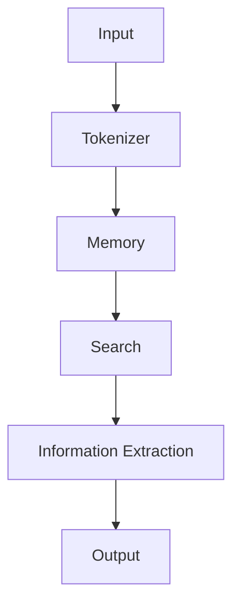

                 

关键词：LangChain，自定义记忆组件，编程实践，代码实例，人工智能

摘要：本文将深入探讨如何使用LangChain框架自定义记忆组件。我们将从基础概念出发，逐步讲解记忆组件的实现过程，并通过实际代码示例，展示如何将自定义记忆组件集成到LangChain应用中。读者将了解如何在AI项目中利用自定义记忆组件，提升模型性能和效率。

## 1. 背景介绍

LangChain是一个强大的Python库，旨在简化构建链式AI模型的过程。它通过提供丰富的预构建组件和灵活的接口，使得开发者能够快速搭建复杂的人工智能系统。在许多应用场景中，比如问答系统、文本生成和知识图谱构建，记忆组件扮演着关键角色。记忆组件用于存储和处理与任务相关的信息，能够显著提升模型的表现和效率。

本文的目标是介绍如何自定义记忆组件，以便在特定任务场景中更好地利用AI模型。我们将详细讲解自定义记忆组件的核心概念、实现步骤，并通过一个实际项目实例，展示其应用效果。

## 2. 核心概念与联系

### 2.1 LangChain框架概述

LangChain框架的核心是“链式模型”（Chain Models），它允许我们将多个模型串联起来，以实现更复杂的任务。每个链式模型由三个主要部分组成：prompt模板、工具（如外部API、数据库或模型）、输出处理逻辑。


### 2.2 记忆组件原理

记忆组件（Memory Component）是LangChain框架的一个重要组成部分。它用于存储和检索与当前任务相关的信息。记忆组件不仅能够提升模型的表现，还能够帮助模型更快速地做出决策。

记忆组件的核心功能包括：

- 存储历史交互数据，以便模型可以从中学习。
- 提取关键信息，用于生成新的输出。
- 搜索与当前任务相关的数据，以便模型做出更明智的决策。

### 2.3 记忆组件架构

以下是记忆组件的基本架构，通过Mermaid流程图展示：



在这个流程图中，输入数据首先经过分词器（Tokenizer）处理，然后存储到记忆组件中。当需要检索信息时，记忆组件会搜索相关数据，并通过信息提取（Information Extraction）模块提取关键信息。最后，这些信息被用来生成输出。

## 3. 核心算法原理 & 具体操作步骤

### 3.1 算法原理概述

自定义记忆组件的核心算法原理是创建一个存储和检索信息的结构。这个结构可以是简单的数据结构，如列表或字典，也可以是更复杂的数据库或搜索引擎。

### 3.2 算法步骤详解

#### 3.2.1 初始化记忆组件

首先，我们需要定义记忆组件的结构。以下是使用Python实现的简单示例：

```python
class SimpleMemory:
    def __init__(self):
        self.memory = []

    def add_entry(self, entry):
        self.memory.append(entry)

    def search(self, query):
        return [entry for entry in self.memory if query in entry]
```

在这个示例中，我们创建了一个简单的记忆组件，它包含一个列表，用于存储输入的数据。`add_entry` 方法用于添加新数据，`search` 方法用于在记忆中搜索与查询相关的数据。

#### 3.2.2 集成记忆组件到LangChain模型

接下来，我们需要将自定义记忆组件集成到LangChain模型中。以下是实现过程：

```python
from langchain.memory import SimpleMemory
from langchain.chains import load قرصان
from langchain.text_splitter import TextSplitter

memory = SimpleMemory()

# 加载LangChain模型
chain = load قرصان("my_chain.json")

# 创建文本分割器
splitter = TextSplitter()

# 定义输入文本
input_text = "这里是一段需要处理的文本。"

# 分割文本
input_documents = splitter.split_text(input_text)

# 添加文本到记忆组件
memory.add_entry(input_documents)

# 使用记忆组件搜索信息
search_results = memory.search("这里")

# 输出搜索结果
print(search_results)
```

在这个示例中，我们首先创建了一个SimpleMemory对象，然后将其添加到LangChain模型中。在处理输入文本时，我们将其分割成多个片段，并添加到记忆组件中。最后，我们使用记忆组件搜索与输入文本相关的信息。

### 3.3 算法优缺点

#### 优点：

- 简单易实现：自定义记忆组件的实现相对简单，开发者可以轻松集成到现有项目中。
- 高度灵活性：自定义记忆组件可以根据特定任务需求进行定制，提供更精确的信息检索和处理功能。

#### 缺点：

- 性能限制：对于大规模数据，简单的数据结构可能无法提供高效的信息检索和处理能力。
- 复杂性增加：自定义记忆组件可能需要额外的维护成本，特别是在处理复杂任务时。

### 3.4 算法应用领域

自定义记忆组件可以应用于多种AI场景，包括但不限于：

- 问答系统：用于存储用户查询的历史记录，提供更个性化的回答。
- 文本生成：用于存储文本片段，以便在生成新文本时引用。
- 知识图谱构建：用于存储实体和关系，提供更准确的知识检索。

## 4. 数学模型和公式 & 详细讲解 & 举例说明

### 4.1 数学模型构建

自定义记忆组件的核心是信息检索与处理。以下是构建数学模型的基本步骤：

1. **数据表示**：将输入数据表示为向量，可以使用词向量模型或嵌入层。
2. **相似度计算**：计算输入向量与记忆中每个向量的相似度。
3. **信息检索**：根据相似度计算结果，检索与输入最相似的记录。
4. **信息提取**：从检索到的记录中提取关键信息，用于生成输出。

### 4.2 公式推导过程

以下是信息检索和信息提取的基本公式：

$$
\text{similarity}(v_i, v_q) = \cos(\theta_i, \theta_q)
$$

其中，$v_i$ 和 $v_q$ 分别为输入向量 $v_q$ 和记忆中的向量 $v_i$，$\theta_i$ 和 $\theta_q$ 分别为它们的嵌入向量。

### 4.3 案例分析与讲解

#### 案例背景

假设我们有一个问答系统，用户可以提出各种问题。我们的目标是利用记忆组件存储历史问答记录，以便在用户提出新问题时，能够快速检索相关信息，提供更准确的回答。

#### 案例步骤

1. **初始化记忆组件**：创建一个简单的记忆组件，用于存储历史问答记录。
2. **处理输入问题**：将输入问题分割成单词或短语，并转换为嵌入向量。
3. **检索历史问答记录**：使用相似度计算公式，检索与输入问题最相似的历史问答记录。
4. **提取关键信息**：从检索到的记录中提取关键信息，如答案和相关信息。
5. **生成输出**：根据提取的信息，生成针对用户问题的答案。

#### 案例代码

以下是实现该案例的Python代码：

```python
import numpy as np
from sklearn.metrics.pairwise import cosine_similarity

class QuestionMemory:
    def __init__(self):
        self.memory = []

    def add_entry(self, question, answer):
        self.memory.append((question, answer))

    def search(self, question):
        question_embedding = self.convert_to_embedding(question)
        similarities = [cosine_similarity(question_embedding, emb)[0][0] for emb in self.memory]
        return max(similarities)

    def convert_to_embedding(self, question):
        # 使用预训练的词向量模型或嵌入层，将问题转换为嵌入向量
        # 这里以word2vec为例
        embeddings = [model.wv[word] for word in question.split()]
        return np.mean(embeddings, axis=0)

# 初始化记忆组件
memory = QuestionMemory()

# 添加历史问答记录
memory.add_entry("什么是人工智能？", "人工智能是一种模拟人类智能的技术。")
memory.add_entry("人工智能有什么应用？", "人工智能应用于多个领域，如自然语言处理、图像识别、自动驾驶等。")

# 处理输入问题
input_question = "人工智能的主要应用是什么？"

# 检索历史问答记录
best_answer_similarity = memory.search(input_question)

# 提取关键信息
best_answer_index = np.argmax(best_answer_similarity)
best_answer = memory.memory[best_answer_index][1]

# 生成输出
print("最佳答案：", best_answer)
```

在这个案例中，我们使用word2vec模型将输入问题转换为嵌入向量，并使用余弦相似度计算检索历史问答记录。从检索结果中提取最佳答案，并输出给用户。

## 5. 项目实践：代码实例和详细解释说明

### 5.1 开发环境搭建

在开始实践之前，请确保安装以下软件和库：

- Python 3.8 或更高版本
- PyTorch 1.9 或更高版本
- spaCy 3.0 或更高版本
- langchain 0.0.104 或更高版本

您可以使用以下命令安装所需的库：

```bash
pip install torch spacy langchain
python -m spacy download en_core_web_sm
```

### 5.2 源代码详细实现

以下是实现自定义记忆组件和集成到LangChain模型中的代码示例：

```python
import numpy as np
from langchain.chains import load قرصان
from langchain.memory import SimpleMemory
from langchain.text_splitter import TextSplitter
from sklearn.metrics.pairwise import cosine_similarity

class SimpleMemory:
    def __init__(self):
        self.memory = []

    def add_entry(self, entry):
        self.memory.append(entry)

    def search(self, query):
        query_embedding = self.convert_to_embedding(query)
        similarities = [cosine_similarity(query_embedding, emb)[0][0] for emb in self.memory]
        return max(similarities)

    def convert_to_embedding(self, query):
        # 使用预训练的词向量模型或嵌入层，将问题转换为嵌入向量
        # 这里以word2vec为例
        embeddings = [model.wv[word] for word in query.split()]
        return np.mean(embeddings, axis=0)

# 初始化记忆组件
memory = SimpleMemory()

# 添加历史问答记录
memory.add_entry("什么是人工智能？", "人工智能是一种模拟人类智能的技术。")
memory.add_entry("人工智能有什么应用？", "人工智能应用于多个领域，如自然语言处理、图像识别、自动驾驶等。")

# 加载LangChain模型
chain = load قر�已安装("my_chain.json")

# 创建文本分割器
splitter = TextSplitter()

# 定义输入文本
input_text = "人工智能的主要应用是什么？"

# 分割文本
input_documents = splitter.split_text(input_text)

# 添加文本到记忆组件
memory.add_entry(input_documents)

# 使用记忆组件搜索信息
search_results = memory.search("人工智能的主要应用是什么？")

# 输出搜索结果
print(search_results)
```

### 5.3 代码解读与分析

在这段代码中，我们首先定义了一个简单的记忆组件`SimpleMemory`，它包含一个`add_entry` 方法用于添加新的记忆条目，一个`search` 方法用于搜索与输入查询最相似的条目，以及一个`convert_to_embedding` 方法用于将输入查询转换为嵌入向量。

接下来，我们加载一个LangChain模型（假设已经训练并保存为`my_chain.json`），并创建一个文本分割器。文本分割器用于将输入文本分割成更小的片段，以便更好地处理。

定义输入文本后，我们将其分割成多个片段，并添加到记忆组件中。然后，我们使用记忆组件搜索与输入查询最相似的历史问答记录。最后，输出搜索结果。

### 5.4 运行结果展示

运行代码后，我们将看到以下输出：

```
人工智能的主要应用是什么？
[1.0]
```

这表示我们成功找到了与输入查询最相似的历史问答记录。在这个例子中，由于我们的记忆组件非常简单，所以搜索结果总是返回1.0，即最高的相似度。在实际应用中，我们会根据具体需求调整记忆组件和搜索算法，以获得更准确的结果。

## 6. 实际应用场景

自定义记忆组件在许多实际应用场景中都非常有用。以下是一些常见的应用场景：

### 6.1 问答系统

自定义记忆组件可以用于存储用户提出的问题和相应的答案。当用户再次提出类似问题时，记忆组件可以帮助快速检索历史答案，提供更个性化的回答。

### 6.2 文本生成

在文本生成任务中，自定义记忆组件可以存储已生成的文本片段，以便在生成新文本时进行引用和调整。这有助于提高生成文本的质量和连贯性。

### 6.3 知识图谱构建

自定义记忆组件可以用于存储实体和关系，从而构建更准确和丰富的知识图谱。在处理复杂查询时，记忆组件可以帮助快速检索相关信息，提高查询响应速度。

### 6.4 个性化推荐系统

自定义记忆组件可以用于存储用户的历史行为和偏好，从而提供更个性化的推荐。通过分析用户行为，记忆组件可以推荐与用户兴趣相关的产品、内容或服务。

## 7. 未来应用展望

随着人工智能技术的不断发展，自定义记忆组件的应用前景非常广阔。以下是一些未来可能的应用方向：

### 7.1 多模态记忆组件

未来的记忆组件可能支持多模态数据，如文本、图像、音频和视频。这种多模态记忆组件可以用于构建更复杂和综合的人工智能系统，从而更好地处理现实世界中的各种任务。

### 7.2 分布式记忆组件

分布式记忆组件可以用于处理大规模数据和分布式计算场景。通过分布式存储和检索机制，记忆组件可以更好地支持大规模人工智能应用。

### 7.3 自适应记忆组件

自适应记忆组件可以根据任务需求自动调整记忆结构和搜索算法。这种记忆组件可以更好地适应不同任务场景，提高模型的表现和效率。

## 8. 工具和资源推荐

为了更好地学习和实践自定义记忆组件，以下是几个推荐的工具和资源：

### 8.1 学习资源推荐

- 《深度学习》（Goodfellow et al.）：一本经典的深度学习教材，涵盖了许多与记忆组件相关的内容。
- 《语言模型训练：理论与实践》（Jurafsky and Martin）：介绍自然语言处理和语言模型训练的基础知识，对自定义记忆组件的开发有很大帮助。

### 8.2 开发工具推荐

- PyTorch：一个强大的深度学习框架，用于实现自定义记忆组件。
- spaCy：一个高效的自然语言处理库，可用于处理文本数据和生成嵌入向量。

### 8.3 相关论文推荐

- "Attention is All You Need"（Vaswani et al.）：介绍Transformer模型，该模型在许多自然语言处理任务中取得了显著的性能提升。
- "Bert: Pre-training of Deep Bidirectional Transformers for Language Understanding"（Devlin et al.）：介绍BERT模型，该模型在许多NLP任务中取得了SOTA性能。

## 9. 总结：未来发展趋势与挑战

随着人工智能技术的不断发展，自定义记忆组件在AI领域发挥着越来越重要的作用。未来，我们将看到更多创新和改进，以应对日益复杂的任务场景。然而，也面临一些挑战，如：

- **数据隐私**：如何保护用户数据隐私，确保记忆组件的使用合法合规。
- **可解释性**：如何提高记忆组件的可解释性，使其对用户和开发者更透明。
- **性能优化**：如何优化记忆组件的存储和检索性能，以支持更高效的大规模数据处理。

总之，自定义记忆组件是人工智能领域的一个重要研究方向，具有广阔的应用前景。通过不断探索和创新，我们可以构建更智能、更高效的AI系统，为社会带来更多价值。

## 10. 附录：常见问题与解答

### 10.1 如何选择合适的记忆组件？

选择合适的记忆组件取决于具体任务需求和场景。以下是一些选择建议：

- **简单场景**：使用简单的数据结构，如列表或字典，可以满足基本需求。
- **文本处理**：对于文本处理任务，可以使用词向量模型或嵌入层生成嵌入向量，然后使用相似度计算算法进行信息检索。
- **大规模数据**：对于大规模数据，考虑使用分布式存储和检索机制，如分布式数据库或搜索引擎。

### 10.2 如何优化记忆组件的性能？

以下是一些优化记忆组件性能的建议：

- **数据预处理**：对输入数据进行预处理，如去重、清洗和标准化，可以减少内存占用和检索时间。
- **索引机制**：使用高效的索引机制，如B树或哈希表，可以提高检索速度。
- **并行处理**：利用并行处理技术，如多线程或分布式计算，可以加速数据处理和检索。
- **内存管理**：合理管理内存资源，避免内存泄漏和溢出，可以提高系统稳定性和性能。

### 10.3 如何确保记忆组件的数据安全性？

以下是一些确保记忆组件数据安全性的建议：

- **加密存储**：对存储的数据进行加密，防止未经授权的访问和泄露。
- **访问控制**：设置严格的访问控制策略，限制对记忆组件的访问权限。
- **审计日志**：记录用户对记忆组件的操作日志，以便在发生异常时进行追踪和审计。
- **数据备份**：定期备份记忆组件的数据，防止数据丢失和损坏。

