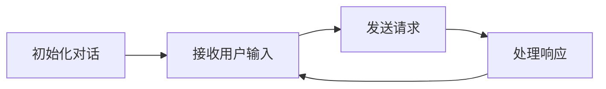

                 

 关键词：OpenAI, AI Agent, API, 聊天程序，大模型应用，动手实践，技术博客

> 摘要：本文将深入探讨如何使用 OpenAI 的 API 来创建一个简单的聊天程序，带领读者从零开始实现一个具有交互功能的人工智能代理。我们将详细介绍开发环境搭建、核心代码实现、代码解读与分析以及运行结果展示等内容，为读者提供一个完整的实践指南。

## 1. 背景介绍

随着人工智能技术的快速发展，大模型应用已经成为现代软件开发中不可或缺的一部分。OpenAI 是一家领先的人工智能研究机构，其推出的 API 提供了强大的语言处理能力，使得开发者可以轻松地将智能对话功能集成到自己的应用中。本文将结合 OpenAI 的 API，展示如何通过简单的代码实现一个具备良好交互能力的聊天程序。

## 2. 核心概念与联系

在开始具体代码实现之前，我们需要理解几个核心概念，包括 API 的基本使用方法、聊天程序的架构设计以及与 OpenAI API 的交互流程。

### 2.1 API 的基本使用方法

OpenAI API 的使用通常涉及以下几个步骤：

1. **获取 API 密钥**：在 OpenAI 的官方网站上注册账号并获取 API 密钥。
2. **安装 API 客户端**：使用 Python 的 `requests` 库来发送 HTTP 请求。
3. **发送请求**：构建请求头部和请求体，包括对话的上下文信息。

### 2.2 聊天程序的架构设计

聊天程序的架构设计通常包括以下几个组成部分：

1. **用户界面**：接收用户输入并提供输出结果。
2. **对话管理器**：管理对话的上下文和状态。
3. **API 调用模块**：负责与 OpenAI API 进行通信。

### 2.3 与 OpenAI API 的交互流程

与 OpenAI API 的交互流程大致如下：

1. **初始化对话**：通过 API 获取初始对话 ID。
2. **接收用户输入**：用户输入问题或指令。
3. **发送请求**：将用户输入发送到 OpenAI API。
4. **处理响应**：接收并处理 API 的响应，生成回复。

下面是一个简单的 Mermaid 流程图，展示了聊天程序的交互流程：



## 3. 核心算法原理 & 具体操作步骤

### 3.1 算法原理概述

OpenAI 的聊天程序基于大规模语言模型 GPT-3，该模型通过深度学习算法从大量文本数据中学习语言模式，可以生成连贯、自然的文本回复。

### 3.2 算法步骤详解

1. **获取 API 密钥**：在 OpenAI 官网注册并获取 API 密钥。
2. **搭建开发环境**：安装 Python 和 `requests` 库。
3. **编写初始化代码**：设置 API 密钥并初始化对话。
4. **实现用户输入功能**：接收用户输入。
5. **发送请求**：构建请求头部和请求体，发送到 OpenAI API。
6. **处理响应**：解析 API 的响应，生成回复。

### 3.3 算法优缺点

**优点**：

- **强大的语言生成能力**：GPT-3 可以生成自然流畅的文本回复。
- **易于集成**：OpenAI API 提供了简单的使用方法，方便开发者快速上手。

**缺点**：

- **需要一定的计算资源**：处理大型语言模型需要较高的计算资源。
- **潜在的安全风险**：未经妥善处理，API 可能会被滥用。

### 3.4 算法应用领域

- **智能客服**：用于自动回答用户常见问题。
- **自然语言处理**：用于文本分类、情感分析等任务。
- **内容创作**：辅助生成文章、故事等。

## 4. 数学模型和公式 & 详细讲解 & 举例说明

OpenAI 的聊天程序主要基于 GPT-3 模型，其数学模型可以概括为：

$$
p(y|x) = \frac{e^{\text{logit}(y|x)}}{1 + e^{\text{logit}(y|x)}}
$$

其中，`logit(y|x)` 表示模型在给定输入 `x` 下预测输出 `y` 的对数几率。

### 4.1 数学模型构建

GPT-3 模型由多个 Transformer 层组成，每层包含自注意力机制和前馈网络。自注意力机制通过计算输入序列中每个词与所有其他词的相关性，生成权重矩阵，从而在生成文本时考虑到上下文信息。

### 4.2 公式推导过程

假设输入序列为 $x = [x_1, x_2, ..., x_n]$，输出序列为 $y = [y_1, y_2, ..., y_n]$。在每一时间步 $t$，模型预测当前词 $y_t$ 的概率分布。具体推导过程如下：

$$
\text{logit}(y_t|x) = \text{softmax}(\text{Attention}(Q, K, V))
$$

其中，$Q, K, V$ 分别为自注意力机制的查询、键、值向量。$Q$ 和 $K$ 由输入序列计算得到，$V$ 由输出序列计算得到。

### 4.3 案例分析与讲解

假设用户输入一句话：“今天天气怎么样？”，我们可以使用 GPT-3 模型生成回复。

1. **初始化对话**：获取初始对话 ID。
2. **发送请求**：将用户输入发送到 OpenAI API。
3. **处理响应**：接收 API 的响应，生成回复。

例如，API 返回的回复可能是：“今天天气晴朗，非常适合户外活动。”。

## 5. 项目实践：代码实例和详细解释说明

### 5.1 开发环境搭建

首先，确保安装 Python 和 `requests` 库。在终端执行以下命令：

```bash
pip install python
pip install requests
```

### 5.2 源代码详细实现

```python
import requests
import json

API_URL = "https://api.openai.com/v1/engines/davinci-codex/completions"
API_KEY = "your_api_key_here"

def chat_with_gpt3(prompt):
    headers = {
        "Authorization": f"Bearer {API_KEY}",
        "Content-Type": "application/json",
    }

    data = {
        "prompt": prompt,
        "max_tokens": 100,
        "temperature": 0.5,
        "top_p": 1,
        "frequency_penalty": 0.0,
        "presence_penalty": 0.0,
    }

    response = requests.post(API_URL, headers=headers, data=json.dumps(data))
    result = response.json()

    if response.status_code == 200:
        return result["choices"][0]["text"]
    else:
        return "Error: Unable to get response from OpenAI API."

if __name__ == "__main__":
    while True:
        user_input = input("You: ")
        bot_response = chat_with_gpt3(user_input)
        print("Bot:", bot_response)
```

### 5.3 代码解读与分析

- **API_URL**：OpenAI API 的 URL。
- **API_KEY**：在 OpenAI 官网注册获取的 API 密钥。
- **chat_with_gpt3**：函数用于与 OpenAI API 进行通信，接收用户输入并返回回复。
- **headers**：请求头，包含 API 密钥和请求类型。
- **data**：请求体，包含用户输入和配置参数。
- **response**：发送 HTTP POST 请求并接收响应。
- **result**：解析响应，提取回复文本。

### 5.4 运行结果展示

运行程序后，用户可以通过终端与聊天程序进行交互。例如，输入“今天天气怎么样？”时，程序会返回一个关于天气情况的回复。

## 6. 实际应用场景

OpenAI API 的聊天程序在多个领域具有广泛的应用，如：

- **智能客服**：用于自动回答用户常见问题。
- **虚拟助手**：为用户提供个性化服务，如日程安排、信息查询等。
- **内容创作**：辅助生成文章、故事等。

## 7. 工具和资源推荐

### 7.1 学习资源推荐

- [OpenAI 官方文档](https://openai.com/docs/)
- [GPT-3 模型介绍](https://openai.com/blog/bidirectional-lstm/)

### 7.2 开发工具推荐

- [Visual Studio Code](https://code.visualstudio.com/)

### 7.3 相关论文推荐

- [Language Models are Few-Shot Learners](https://arxiv.org/abs/2005.14165)

## 8. 总结：未来发展趋势与挑战

OpenAI API 的聊天程序代表了人工智能技术在自然语言处理领域的最新进展。未来，随着模型规模和性能的不断提高，聊天程序将更加智能和多样化。然而，我们也需要关注以下几个方面：

### 8.1 研究成果总结

- 大模型在自然语言处理任务中的显著优势。
- 开源社区对大模型的研究和优化。

### 8.2 未来发展趋势

- 模型压缩和推理优化。
- 跨领域、跨语言的对话系统。

### 8.3 面临的挑战

- 数据隐私和安全问题。
- 模型的可解释性和透明性。

### 8.4 研究展望

- 开发更高效、更智能的聊天程序。
- 探索大模型在其他领域的应用。

## 9. 附录：常见问题与解答

**Q**：如何获取 OpenAI API 密钥？

**A**：在 [OpenAI 官网](https://openai.com/) 注册账号并提交申请，审核通过后即可获取 API 密钥。

**Q**：如何优化 API 调用的性能？

**A**：可以通过减少请求频率、增加请求并发量以及使用缓存来优化 API 调用的性能。

**Q**：如何处理 API 返回的错误？

**A**：解析 API 返回的错误信息，并根据错误类型采取相应的处理措施，如重试请求或修改请求参数。

---

作者：禅与计算机程序设计艺术 / Zen and the Art of Computer Programming

以上就是本文关于【大模型应用开发 动手做AI Agent】OpenAI API的聊天程序示例的详细探讨。通过本文，我们了解了如何使用 OpenAI API 来实现一个简单的聊天程序，并对其核心算法原理、数学模型、项目实践等进行了深入讲解。希望本文能为读者在人工智能领域的研究和实践提供有益的参考。

