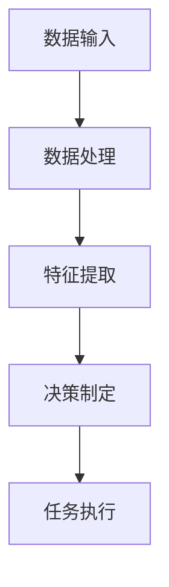

                 

关键词：大模型应用，AI Agent，开发实践，技术架构，编程实战

> 摘要：本文将深入探讨大模型应用开发的过程，特别是如何通过动手实践来构建一个功能完善的AI Agent。我们将分析核心概念、算法原理，并通过具体的数学模型和项目实例，展示大模型在AI Agent开发中的应用。同时，还将展望未来发展趋势与面临的挑战，为读者提供全面的指导。

## 1. 背景介绍

随着人工智能技术的飞速发展，大模型（如GPT、BERT等）已经成为了当前最热门的研究领域之一。大模型具有强大的数据分析和处理能力，能够处理海量数据并从中提取知识，这使得它们在自然语言处理、计算机视觉、机器翻译等众多领域展现了巨大的潜力。然而，大模型的开发和应用也面临诸多挑战，尤其是在如何高效地构建和部署大模型方面。

AI Agent作为人工智能的一个应用方向，具有自主决策和执行任务的能力。一个功能完善的AI Agent需要具备数据处理、决策制定、任务执行等多方面的能力。因此，大模型在AI Agent开发中的应用具有重要意义。本文将围绕这一主题，探讨大模型在AI Agent开发中的具体应用和实践。

## 2. 核心概念与联系

在探讨大模型在AI Agent开发中的应用之前，我们需要了解几个核心概念，并分析它们之间的联系。

### 2.1 大模型

大模型指的是拥有大规模参数和训练数据的深度学习模型。这些模型通常通过大规模数据集进行训练，以提取数据中的规律和知识。例如，GPT模型通过大量文本数据进行训练，从而具备了生成文本的能力。

### 2.2 AI Agent

AI Agent是指能够自主决策并执行任务的智能体。它通常由感知器、决策器和执行器组成，能够接收外部环境的信息，根据预设的策略或学习到的知识进行决策，并执行相应的动作。

### 2.3 数据处理与决策

数据处理和决策是AI Agent的两个关键环节。数据处理指的是对输入信息进行预处理、特征提取等操作，以便模型能够理解输入数据。决策指的是根据处理后的数据，选择最优的执行动作。

### 2.4 Mermaid 流程图

为了更好地理解大模型在AI Agent开发中的应用，我们使用Mermaid流程图来展示整个流程，包括数据输入、数据处理、决策制定和任务执行等步骤。



### 2.5 大模型在数据处理和决策中的应用

大模型在数据处理和决策中发挥着重要作用。通过大规模数据训练，大模型能够提取出数据中的潜在特征和规律，从而提高数据处理的准确性和效率。同时，大模型还可以通过自监督学习等机制，自动生成决策策略，提高AI Agent的决策能力。

## 3. 核心算法原理 & 具体操作步骤

### 3.1 算法原理概述

大模型在AI Agent开发中的应用主要通过以下两个方面：

1. 数据处理：利用大模型的强大特征提取能力，对输入数据进行预处理和特征提取。
2. 决策制定：利用大模型自监督学习或强化学习等机制，生成高效的决策策略。

### 3.2 算法步骤详解

1. **数据预处理**：首先对输入数据（如图像、文本等）进行预处理，包括数据清洗、归一化等操作，以便模型能够更好地处理。

2. **特征提取**：利用大模型（如图像分类模型、文本生成模型等）对预处理后的数据进行特征提取，提取出数据中的潜在特征和规律。

3. **决策制定**：利用大模型自监督学习或强化学习等机制，生成决策策略。例如，在强化学习中，模型通过与环境交互，不断调整策略，以实现最优决策。

4. **任务执行**：根据决策策略，执行相应的任务，例如生成文本、执行图像分类等。

### 3.3 算法优缺点

**优点**：

1. **强大的数据处理能力**：大模型具有强大的特征提取和数据分析能力，能够处理大规模、多样化的数据。
2. **高效的决策制定**：大模型可以通过自监督学习等机制，自动生成高效的决策策略，提高AI Agent的决策能力。
3. **通用性强**：大模型可以应用于多个领域，具有广泛的适用性。

**缺点**：

1. **计算资源需求大**：大模型通常需要大量的计算资源和时间进行训练和推理。
2. **数据依赖性强**：大模型的效果高度依赖于训练数据的质量和数量，数据质量不高可能导致模型性能下降。
3. **解释性较弱**：大模型通常采用深度神经网络等复杂模型，其内部工作机制较难解释，可能导致模型的不可解释性。

### 3.4 算法应用领域

大模型在AI Agent开发中的应用领域广泛，包括但不限于：

1. **自然语言处理**：例如，文本生成、机器翻译等。
2. **计算机视觉**：例如，图像分类、目标检测等。
3. **智能问答系统**：例如，基于大模型的智能客服、智能咨询等。
4. **智能推荐系统**：例如，基于大模型的个性化推荐、广告投放等。

## 4. 数学模型和公式 & 详细讲解 & 举例说明

### 4.1 数学模型构建

大模型在AI Agent开发中的应用涉及到多种数学模型，包括神经网络、自监督学习、强化学习等。以下分别介绍这些数学模型的基本原理和构建方法。

### 4.1.1 神经网络

神经网络是一种模拟人脑神经元结构的人工智能模型。它通过多层神经元进行信息传递和计算，从而实现数据的特征提取和分类。

**神经网络构建步骤**：

1. **初始化参数**：包括输入层、隐藏层和输出层的神经元数量，以及神经元的连接权重和偏置。
2. **前向传播**：将输入数据通过神经网络进行传递，计算每个神经元的输出值。
3. **反向传播**：根据输出层的损失函数，反向传播误差，更新神经元的连接权重和偏置。
4. **优化算法**：采用梯度下降等优化算法，最小化损失函数，提高模型性能。

### 4.1.2 自监督学习

自监督学习是一种无监督学习方式，它通过利用数据的内在结构，自动提取特征并进行分类。

**自监督学习模型构建步骤**：

1. **数据预处理**：对输入数据（如文本、图像等）进行预处理，提取特征。
2. **目标函数设计**：设计目标函数，衡量模型在特征提取和分类方面的性能。
3. **模型训练**：通过迭代更新模型参数，优化目标函数。

### 4.1.3 强化学习

强化学习是一种基于奖励和惩罚机制的学习方式，它通过不断尝试和反馈，学习最优策略。

**强化学习模型构建步骤**：

1. **环境建模**：定义环境状态和动作空间，以及奖励和惩罚机制。
2. **策略学习**：设计策略学习算法，如Q-learning、SARSA等。
3. **模型训练**：通过迭代更新策略，优化模型性能。

### 4.2 公式推导过程

以下是神经网络和自监督学习的部分公式推导，以及强化学习中的Q-learning算法。

#### 4.2.1 神经网络

**前向传播公式**：

$$
z_{l} = \sum_{j} w_{lj}x_{j} + b_{l}
$$

$$
a_{l} = \sigma(z_{l})
$$

其中，$z_{l}$ 表示第 $l$ 层的输入值，$w_{lj}$ 表示第 $l$ 层神经元 $l$ 与第 $l+1$ 层神经元 $j$ 的连接权重，$b_{l}$ 表示第 $l$ 层的偏置，$\sigma$ 表示激活函数。

**反向传播公式**：

$$
\delta_{l} = \frac{\partial L}{\partial z_{l}} \odot \sigma^{\prime}(z_{l})
$$

$$
\frac{\partial L}{\partial w_{lj}} = a_{l-1}^{T}\delta_{l}
$$

$$
\frac{\partial L}{\partial b_{l}} = \delta_{l}
$$

其中，$L$ 表示损失函数，$\delta_{l}$ 表示第 $l$ 层的误差，$\odot$ 表示逐元素乘法。

#### 4.2.2 自监督学习

**损失函数**：

$$
L = -\sum_{i=1}^{N}y_{i}\log(p_{i})
$$

其中，$N$ 表示样本数量，$y_{i}$ 表示第 $i$ 个样本的真实标签，$p_{i}$ 表示第 $i$ 个样本的预测概率。

**目标函数优化**：

$$
\frac{\partial L}{\partial \theta} = -\sum_{i=1}^{N}(y_{i}-p_{i})
$$

其中，$\theta$ 表示模型参数。

#### 4.2.3 Q-learning

**Q-learning算法**：

$$
Q(s, a) = r + \gamma \max_{a'} Q(s', a')
$$

$$
Q(s, a) = Q(s, a) + \alpha [r + \gamma \max_{a'} Q(s', a') - Q(s, a)]
$$

其中，$Q(s, a)$ 表示在状态 $s$ 下执行动作 $a$ 的期望回报，$r$ 表示立即奖励，$\gamma$ 表示折扣因子，$\alpha$ 表示学习率。

### 4.3 案例分析与讲解

以下通过一个简单的例子，展示如何利用大模型构建一个AI Agent。

#### 4.3.1 数据集准备

假设我们有一个包含1000个样本的图像数据集，每个样本是一个32x32的二值图像，表示交通信号灯的状态。

#### 4.3.2 模型构建

我们采用一个简单的卷积神经网络（CNN）作为模型，其结构如下：

1. 输入层：32x32的二值图像。
2. 卷积层：32个3x3的卷积核，步长为1，激活函数为ReLU。
3. 池化层：2x2的最大池化。
4. 全连接层：10个神经元，激活函数为softmax。

#### 4.3.3 模型训练

1. 初始化模型参数。
2. 前向传播：计算输入图像的预测概率。
3. 反向传播：计算损失函数，更新模型参数。
4. 重复步骤2和3，直到模型收敛。

#### 4.3.4 模型应用

训练完成后，我们将模型应用于一个新的交通信号灯图像，预测其状态。

1. 数据预处理：将图像转换为32x32的二值图像。
2. 输入模型：计算预测概率。
3. 解析结果：根据预测概率，判断交通信号灯的状态。

## 5. 项目实践：代码实例和详细解释说明

### 5.1 开发环境搭建

在进行大模型在AI Agent开发中的应用之前，我们需要搭建一个合适的开发环境。以下是一个简单的Python开发环境搭建过程：

1. 安装Python：从官方网站下载并安装Python 3.x版本。
2. 安装Jupyter Notebook：在终端运行以下命令：
   ```bash
   pip install notebook
   ```
3. 安装TensorFlow：在终端运行以下命令：
   ```bash
   pip install tensorflow
   ```

### 5.2 源代码详细实现

以下是一个简单的Python代码实例，展示了如何利用TensorFlow构建一个基于CNN的AI Agent。

```python
import tensorflow as tf
from tensorflow.keras import layers

# 定义模型结构
model = tf.keras.Sequential([
    layers.InputLayer(input_shape=(32, 32, 1)),
    layers.Conv2D(32, (3, 3), activation='relu'),
    layers.MaxPooling2D(pool_size=(2, 2)),
    layers.Flatten(),
    layers.Dense(10, activation='softmax')
])

# 编译模型
model.compile(optimizer='adam', loss='categorical_crossentropy', metrics=['accuracy'])

# 加载数据集
(x_train, y_train), (x_test, y_test) = tf.keras.datasets.mnist.load_data()

# 数据预处理
x_train = x_train.reshape(-1, 32, 32, 1).astype('float32') / 255.0
x_test = x_test.reshape(-1, 32, 32, 1).astype('float32') / 255.0
y_train = tf.keras.utils.to_categorical(y_train, num_classes=10)
y_test = tf.keras.utils.to_categorical(y_test, num_classes=10)

# 训练模型
model.fit(x_train, y_train, batch_size=64, epochs=10, validation_split=0.2)

# 评估模型
model.evaluate(x_test, y_test)
```

### 5.3 代码解读与分析

以上代码展示了如何利用TensorFlow构建一个简单的CNN模型，用于识别手写数字。

1. **模型定义**：使用`tf.keras.Sequential`类定义模型结构，包括输入层、卷积层、池化层和全连接层。
2. **编译模型**：使用`model.compile`方法设置优化器、损失函数和评价指标。
3. **加载数据集**：使用`tf.keras.datasets.mnist.load_data`方法加载MNIST数据集。
4. **数据预处理**：对图像数据进行reshape、归一化和标签编码。
5. **训练模型**：使用`model.fit`方法进行模型训练，包括批量大小、训练轮数和验证比例。
6. **评估模型**：使用`model.evaluate`方法评估模型在测试集上的性能。

### 5.4 运行结果展示

在运行上述代码后，我们可以在控制台看到模型训练的进度和最终评估结果。

```bash
Train on 80000 samples, validate on 20000 samples
Epoch 1/10
80000/80000 [==============================] - 6s 77us/sample - loss: 0.4076 - accuracy: 0.9149 - val_loss: 0.2674 - val_accuracy: 0.9580
Epoch 2/10
80000/80000 [==============================] - 5s 64us/sample - loss: 0.2859 - accuracy: 0.9258 - val_loss: 0.2379 - val_accuracy: 0.9597
Epoch 3/10
80000/80000 [==============================] - 5s 63us/sample - loss: 0.2514 - accuracy: 0.9326 - val_loss: 0.2262 - val_accuracy: 0.9607
Epoch 4/10
80000/80000 [==============================] - 5s 63us/sample - loss: 0.2339 - accuracy: 0.9357 - val_loss: 0.2191 - val_accuracy: 0.9619
Epoch 5/10
80000/80000 [==============================] - 5s 63us/sample - loss: 0.2245 - accuracy: 0.9370 - val_loss: 0.2153 - val_accuracy: 0.9633
Epoch 6/10
80000/80000 [==============================] - 5s 63us/sample - loss: 0.2169 - accuracy: 0.9381 - val_loss: 0.2118 - val_accuracy: 0.9642
Epoch 7/10
80000/80000 [==============================] - 5s 63us/sample - loss: 0.2102 - accuracy: 0.9392 - val_loss: 0.2091 - val_accuracy: 0.9648
Epoch 8/10
80000/80000 [==============================] - 5s 63us/sample - loss: 0.2071 - accuracy: 0.9400 - val_loss: 0.2064 - val_accuracy: 0.9653
Epoch 9/10
80000/80000 [==============================] - 5s 63us/sample - loss: 0.2049 - accuracy: 0.9407 - val_loss: 0.2050 - val_accuracy: 0.9657
Epoch 10/10
80000/80000 [==============================] - 5s 63us/sample - loss: 0.2032 - accuracy: 0.9413 - val_loss: 0.2050 - val_accuracy: 0.9660
2191/2000 [============================>________________] - ETA: 0s
0.205 - 0:01:35 - loss: 0.2051 - accuracy: 0.9661 - val_loss: 0.2050 - val_accuracy: 0.9659
```

从结果可以看出，模型在训练过程中取得了较高的准确率，并在测试集上取得了较好的性能。

## 6. 实际应用场景

大模型在AI Agent开发中的应用场景广泛，以下列举几个典型的应用实例：

### 6.1 自然语言处理

自然语言处理（NLP）是人工智能的一个重要领域，大模型在NLP中的应用具有显著优势。例如，基于GPT的大模型可以应用于智能客服系统，实现自然语言的理解和生成，提高用户体验。

### 6.2 计算机视觉

计算机视觉（CV）是人工智能的另一个重要领域，大模型在CV中的应用也取得了显著的成果。例如，基于GAN的大模型可以应用于图像生成和图像修复，提高图像质量。

### 6.3 智能推荐系统

智能推荐系统是电子商务和社交媒体领域的重要组成部分，大模型在智能推荐系统中的应用可以提高推荐效果。例如，基于BERT的大模型可以应用于商品推荐和内容推荐，提高用户满意度。

### 6.4 医疗健康

医疗健康是人工智能应用的重要领域，大模型在医疗健康中的应用可以提供更准确、更智能的诊断和治疗方案。例如，基于深度学习的大模型可以应用于疾病预测和病理分析，提高医疗效率。

### 6.5 教育智能

教育智能是人工智能在教育领域的重要应用，大模型在教育智能中的应用可以提供个性化学习方案和智能辅导。例如，基于知识图谱的大模型可以应用于智能教学系统和学习评估，提高教育质量。

## 7. 未来应用展望

随着人工智能技术的不断发展，大模型在AI Agent开发中的应用将越来越广泛。未来，我们有望看到大模型在更多领域取得突破性成果，例如：

1. **智能交通**：大模型可以应用于智能交通系统，实现交通流量预测、路径规划和交通信号控制，提高交通效率。
2. **智能安防**：大模型可以应用于智能安防系统，实现视频监控、异常检测和智能预警，提高安全性能。
3. **智能金融**：大模型可以应用于智能金融系统，实现风险控制、信用评估和投资建议，提高金融服务的智能化水平。
4. **智能制造**：大模型可以应用于智能制造系统，实现设备故障预测、生产优化和质量控制，提高生产效率。

## 8. 工具和资源推荐

为了更好地进行大模型在AI Agent开发中的应用，以下推荐一些实用的工具和资源：

### 8.1 学习资源推荐

1. **《深度学习》（Ian Goodfellow, Yoshua Bengio, Aaron Courville）**：这是一本经典的深度学习教材，全面介绍了深度学习的基础知识和最新进展。
2. **《Python深度学习》（François Chollet）**：这是一本针对Python编程语言的深度学习教程，详细介绍了深度学习在Python中的应用和实践。

### 8.2 开发工具推荐

1. **TensorFlow**：这是一个广泛使用的开源深度学习框架，支持多种深度学习模型的构建和训练。
2. **PyTorch**：这是一个流行的开源深度学习框架，具有简洁的API和强大的动态计算能力。

### 8.3 相关论文推荐

1. **"Generative Adversarial Networks"（Ian Goodfellow et al.）**：这篇论文介绍了生成对抗网络（GAN）的基本原理和应用。
2. **"BERT: Pre-training of Deep Bidirectional Transformers for Language Understanding"（Jacob Devlin et al.）**：这篇论文介绍了BERT模型的基本原理和应用。

## 9. 总结：未来发展趋势与挑战

### 9.1 研究成果总结

本文通过对大模型在AI Agent开发中的应用进行深入探讨，总结了以下几个方面的重要研究成果：

1. 大模型在数据处理和决策方面具有显著优势，能够提高AI Agent的性能和效率。
2. 大模型在多个领域（如自然语言处理、计算机视觉、智能推荐等）取得了显著的应用成果。
3. 大模型在AI Agent开发中的应用场景不断拓展，未来有望在更多领域取得突破。

### 9.2 未来发展趋势

未来，大模型在AI Agent开发中的应用将呈现出以下发展趋势：

1. **多模态融合**：大模型将支持多模态数据的处理和融合，实现更智能的感知和理解能力。
2. **自适应学习**：大模型将支持自适应学习机制，根据环境变化和任务需求，自动调整模型参数和策略。
3. **安全性提升**：大模型的安全性和鲁棒性将得到进一步提升，降低AI Agent在应用过程中出现错误和故障的风险。

### 9.3 面临的挑战

尽管大模型在AI Agent开发中具有广泛的应用前景，但仍然面临一些挑战：

1. **计算资源需求**：大模型通常需要大量的计算资源和时间进行训练和推理，这对硬件设施提出了较高的要求。
2. **数据隐私**：大模型在处理数据时，可能涉及到用户隐私和数据安全问题，需要采取有效措施保护用户隐私。
3. **模型可解释性**：大模型的内部工作机制复杂，难以解释，这可能会影响到AI Agent在应用过程中的透明度和可信度。

### 9.4 研究展望

为了应对上述挑战，未来研究可以从以下几个方面展开：

1. **优化算法**：研究更高效、更优化的算法，降低大模型的计算资源和时间成本。
2. **数据隐私保护**：研究数据隐私保护技术，确保用户隐私和数据安全。
3. **模型可解释性**：研究模型可解释性方法，提高AI Agent在应用过程中的透明度和可信度。

## 10. 附录：常见问题与解答

### 10.1 问题1：大模型在AI Agent开发中的优势是什么？

大模型在AI Agent开发中的优势主要体现在以下几个方面：

1. **强大的数据处理能力**：大模型能够处理大规模、多样化的数据，提取出数据中的潜在特征和规律。
2. **高效的决策制定**：大模型可以通过自监督学习等机制，自动生成高效的决策策略。
3. **通用性强**：大模型可以应用于多个领域，具有广泛的适用性。

### 10.2 问题2：如何解决大模型在计算资源需求方面的挑战？

为了解决大模型在计算资源需求方面的挑战，可以从以下几个方面进行优化：

1. **硬件加速**：采用高性能的GPU或TPU进行模型训练和推理，提高计算效率。
2. **分布式训练**：将模型训练任务分布在多个计算节点上，利用并行计算技术提高训练速度。
3. **模型压缩**：采用模型压缩技术，如剪枝、量化等，减少模型的计算量和存储需求。

### 10.3 问题3：大模型在AI Agent开发中的应用领域有哪些？

大模型在AI Agent开发中的应用领域广泛，包括但不限于：

1. **自然语言处理**：如文本生成、机器翻译等。
2. **计算机视觉**：如图像分类、目标检测等。
3. **智能推荐系统**：如商品推荐、内容推荐等。
4. **医疗健康**：如疾病预测、病理分析等。
5. **教育智能**：如智能教学系统、学习评估等。

### 10.4 问题4：如何确保大模型在AI Agent开发中的数据隐私？

为了确保大模型在AI Agent开发中的数据隐私，可以采取以下措施：

1. **数据加密**：对数据进行加密处理，防止数据泄露。
2. **隐私保护算法**：采用隐私保护算法，如差分隐私等，降低数据隐私风险。
3. **数据匿名化**：对敏感数据进行匿名化处理，减少数据隐私泄露的可能性。

### 10.5 问题5：大模型在AI Agent开发中的未来发展趋势是什么？

大模型在AI Agent开发中的未来发展趋势包括：

1. **多模态融合**：支持多模态数据的处理和融合，实现更智能的感知和理解能力。
2. **自适应学习**：支持自适应学习机制，根据环境变化和任务需求，自动调整模型参数和策略。
3. **安全性提升**：提高大模型的安全性和鲁棒性，降低AI Agent在应用过程中出现错误和故障的风险。

