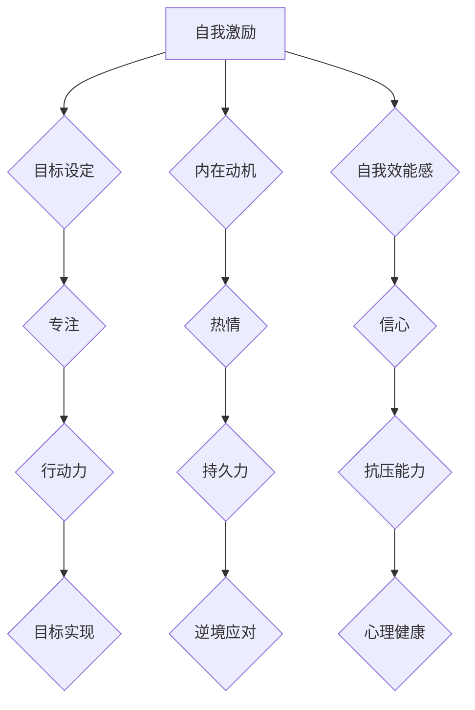
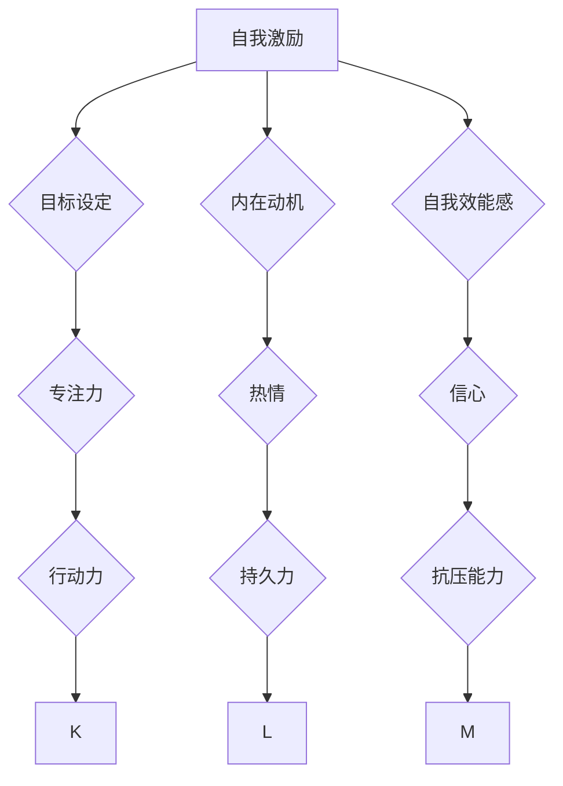

                 

关键词：自我激励、心理调适、一人公司、创始人、心理健康、策略、成长

> 摘要：本文深入探讨了一人公司创始人在创业过程中面临的心理挑战，提出了多种自我激励和心理调适策略，以帮助创始人保持积极的心态，实现个人与公司的共同成长。

## 1. 背景介绍

在当今快速变化的世界中，一人公司（SOLO entrepreneurship）已经成为了一种流行且具有吸引力的创业形式。这种模式允许创始人独自运营企业，拥有100%的控制权和决策权。然而，这种独立自主的状态同时也带来了巨大的心理压力和挑战。对于一人公司的创始人来说，不仅要承担创业的经济风险，还需要应对来自心理层面的各种考验。因此，自我激励和心理调适成为他们在创业旅程中不可或缺的一部分。

本文将探讨一人公司创始人在创业过程中常见的心理挑战，并介绍一系列自我激励和心理调适的策略，帮助他们在困难时刻保持积极的心态，实现个人和公司的共同成长。

### 1.1 一人公司的发展趋势

近年来，随着创业环境的不断改善和互联网技术的快速发展，一人公司已经成为全球创业领域的一个重要趋势。根据相关数据显示，一人公司的数量在全球范围内持续增长，特别是在数字经济领域，如软件开发、在线教育、电子商务等。

一人公司的优点在于其灵活性、创新性和快速响应市场变化的能力。创始人可以自由地制定战略和决策，快速调整业务方向，以适应不断变化的市场需求。此外，一人公司还能最大限度地减少管理成本，让创始人将更多精力投入到核心业务上。

### 1.2 心理挑战

尽管一人公司具有众多优点，但创始人面临的孤独感、不确定性和压力也不容忽视。以下是创始人常见的心理挑战：

- **孤独感**：一人公司创始人通常独自面对所有的挑战，缺乏同事的支持和交流。
- **不确定性**：初创企业面临的市场环境充满不确定性，创始人需要不断应对新的挑战。
- **压力**：一人公司创始人需要承担所有决策和责任，这种压力可能导致心理健康问题。

### 1.3 自我激励和心理调适的重要性

在面对各种心理挑战时，自我激励和心理调适成为一人公司创始人保持积极心态的关键。自我激励可以帮助创始人设定明确的目标、克服困难，并保持对未来的信心。心理调适则有助于缓解压力，提高心理韧性，使创始人能够更好地应对挑战。

接下来，本文将详细介绍一系列自我激励和心理调适策略，帮助一人公司创始人应对创业过程中的心理挑战。

## 2. 核心概念与联系

### 2.1 自我激励

自我激励是指个体通过自身的内在动机和驱动力来推动自己实现目标的过程。对于一人公司创始人来说，自我激励是他们成功的关键因素之一。自我激励的核心概念包括：

- **目标设定**：明确的目标可以帮助创始人保持专注，并激励他们为实现目标而努力。
- **内在动机**：内在动机是指个体出于对某项活动的兴趣、热情或意义而进行的努力，而不是为了外在奖励或避免惩罚。
- **自我效能感**：自我效能感是指个体对自己能否成功完成特定任务的信念。提高自我效能感可以帮助创始人更有信心地面对挑战。

### 2.2 心理调适

心理调适是指个体通过一系列方法来应对压力和挑战，以保持心理健康的过程。对于一人公司创始人来说，心理调适的重要性不言而喻。心理调适的核心概念包括：

- **压力管理**：压力管理是指个体通过一系列方法来降低压力水平，以保持身心健康。
- **情绪调节**：情绪调节是指个体通过调整自己的情绪状态，以更好地应对挑战。
- **心理韧性**：心理韧性是指个体在面对逆境和挑战时能够迅速恢复并继续前进的能力。

### 2.3 Mermaid 流程图

以下是一个简化的 Mermaid 流程图，用于展示自我激励和心理调适之间的联系。



### 2.4 Mermaid 流程节点详细说明

- **目标设定**：明确的目标可以帮助创始人保持专注，并激励他们为实现目标而努力。
- **内在动机**：内在动机是指个体出于对某项活动的兴趣、热情或意义而进行的努力，而不是为了外在奖励或避免惩罚。
- **自我效能感**：自我效能感是指个体对自己能否成功完成特定任务的信念。提高自我效能感可以帮助创始人更有信心地面对挑战。
- **专注**：专注是指创始人将注意力集中在实现目标上，以减少干扰和分心。
- **热情**：热情是指创始人对所从事的工作充满热情和兴趣，这有助于提高工作效率。
- **信心**：信心是指创始人对自己能否成功完成任务的信念。提高信心可以增强创始人的决心和毅力。
- **行动力**：行动力是指创始人能够迅速采取行动，将想法转化为实际行动。
- **持久力**：持久力是指创始人在面对挑战和困难时能够坚持不懈，不轻易放弃。
- **抗压能力**：抗压能力是指创始人能够在压力下保持冷静和专注，有效应对各种挑战。
- **心理健康**：心理健康是指创始人拥有良好的心理状态，能够积极应对生活中的各种挑战。

通过自我激励和心理调适，一人公司创始人可以在创业过程中保持积极的心态，提高心理韧性，实现个人和公司的共同成长。

## 3. 核心算法原理 & 具体操作步骤

### 3.1 算法原理概述

在本文中，我们将介绍一种适用于一人公司创始人的“自我激励与心理调适算法”。该算法的核心思想是通过一系列策略和方法，帮助创始人保持积极的心态，提高心理韧性，从而更好地应对创业过程中的各种挑战。

### 3.2 算法步骤详解

#### 3.2.1 设定明确的目标

- **步骤1**：分析个人兴趣和优势，确定目标领域。
- **步骤2**：将长期目标分解为短期目标，制定实现目标的计划。
- **步骤3**：定期回顾和调整目标，确保其与个人兴趣和发展方向相符。

#### 3.2.2 培养内在动机

- **步骤1**：深入了解个人兴趣和热情所在，找到激发内在动机的源泉。
- **步骤2**：将目标与个人价值观相结合，确保目标的实现能够带来内在满足感。
- **步骤3**：通过不断反思和自我提问，保持对目标的热情和动力。

#### 3.2.3 提高自我效能感

- **步骤1**：设定合理的目标难度，避免目标过于简单或过于困难。
- **步骤2**：积累成功的经验，增强自我效能感。
- **步骤3**：学会从失败中汲取教训，提高解决问题的能力。

#### 3.2.4 培养专注力

- **步骤1**：通过练习冥想、深呼吸等方法，提高专注力。
- **步骤2**：将工作任务分解为小块，逐一完成，避免分心。
- **步骤3**：学会拒绝无关紧要的干扰，保持专注。

#### 3.2.5 培养热情

- **步骤1**：深入了解自己的兴趣和价值观，找到激发热情的领域。
- **步骤2**：将工作与个人兴趣相结合，提高工作效率。
- **步骤3**：学会享受工作过程，而不是只关注结果。

#### 3.2.6 增强信心

- **步骤1**：设定小目标，逐步实现，积累信心。
- **步骤2**：学会自我鼓励，增强自信心。
- **步骤3**：学会从他人的成功经验中汲取启示，提高自己的信心。

#### 3.2.7 培养行动力

- **步骤1**：将想法转化为具体行动计划，明确执行步骤。
- **步骤2**：制定时间表，确保行动计划的执行。
- **步骤3**：学会自我监督，确保行动力的持续。

#### 3.2.8 培养持久力

- **步骤1**：设定长期目标，保持对未来的信心。
- **步骤2**：学会面对挫折和失败，坚持不懈。
- **步骤3**：学会从失败中汲取教训，不断调整策略。

#### 3.2.9 培养抗压能力

- **步骤1**：学会压力管理，降低压力水平。
- **步骤2**：培养良好的情绪调节能力，保持心理平衡。
- **步骤3**：学会寻求帮助，与他人分享压力。

### 3.3 算法优缺点

#### 优点

- **高效性**：通过系统化的方法，帮助创始人快速提高自我激励和心理调适能力。
- **灵活性**：算法适用于不同领域的创始人，可以根据个人需求进行调整。
- **全面性**：算法涵盖了从目标设定到情绪调节的多个方面，确保创始人能够全面提高心理韧性。

#### 缺点

- **执行难度**：算法需要创始人持续投入时间和精力，否则效果可能有限。
- **适应性**：对于某些创始人，算法可能需要根据其个人情况进行调整，以确保最佳效果。

### 3.4 算法应用领域

该算法适用于所有一人公司创始人，特别是那些处于初创阶段或面临较大心理压力的创始人。此外，该算法还可以应用于其他需要自我激励和心理调适的领域，如自由职业者、学术研究者等。

## 4. 数学模型和公式 & 详细讲解 & 举例说明

### 4.1 数学模型构建

为了更好地理解和应用自我激励与心理调适算法，我们引入以下数学模型：

$$
\text{心理韧性} = f(\text{自我效能感}, \text{内在动机}, \text{专注力}, \text{热情}, \text{信心}, \text{行动力}, \text{持久力}, \text{抗压能力})
$$

其中，$f$ 表示心理韧性函数，$\text{自我效能感}$、$\text{内在动机}$、$\text{专注力}$、$\text{热情}$、$\text{信心}$、$\text{行动力}$、$\text{持久力}$、$\text{抗压能力}$ 分别表示影响心理韧性的因素。

### 4.2 公式推导过程

心理韧性是指个体在面对逆境和挑战时能够迅速恢复并继续前进的能力。为了推导心理韧性函数，我们首先分析每个影响因素对心理韧性的作用。

- **自我效能感**：个体对自身能力的信心，直接影响个体在面对挑战时的心理韧性。
- **内在动机**：个体出于兴趣、热情或意义而产生的努力，有助于提高心理韧性。
- **专注力**：个体将注意力集中在目标上，有助于减少干扰和分心，提高心理韧性。
- **热情**：个体对所从事的工作充满热情，有助于提高工作效率，增强心理韧性。
- **信心**：个体对自身能否成功完成任务的信念，直接影响心理韧性。
- **行动力**：个体迅速采取行动，将想法转化为实际行动，有助于提高心理韧性。
- **持久力**：个体在面对挑战和困难时能够坚持不懈，不轻易放弃，有助于提高心理韧性。
- **抗压能力**：个体在压力下保持冷静和专注，有效应对各种挑战，有助于提高心理韧性。

综合以上分析，我们可以得到心理韧性函数：

$$
\text{心理韧性} = f(\text{自我效能感}, \text{内在动机}, \text{专注力}, \text{热情}, \text{信心}, \text{行动力}, \text{持久力}, \text{抗压能力})
$$

### 4.3 案例分析与讲解

为了更好地理解上述公式，我们来看一个实际案例。

#### 案例背景

小王是一位一人公司创始人，他在创业初期面临了巨大的心理压力。他意识到需要提高自己的心理韧性，以应对创业过程中的各种挑战。

#### 数据分析

根据小王的自我评估，他当前的心理韧性函数如下：

$$
\text{心理韧性} = f(6, 7, 5, 6, 5, 7, 6, 6)
$$

#### 解读

- **自我效能感**：小王对自己的能力有较高的信心，这有助于他在面对挑战时保持积极的心态。
- **内在动机**：小王对创业充满热情，这有助于他持续努力，提高心理韧性。
- **专注力**：小王的专注力一般，需要加强练习，以提高在面对干扰时保持专注的能力。
- **热情**：小王对创业充满热情，这有助于他在面对困难时保持动力。
- **信心**：小王对自己的信心一般，需要通过积累成功经验来提高。
- **行动力**：小王的行动力较强，这有助于他将想法转化为实际行动。
- **持久力**：小王在面对挑战时能够坚持不懈，这有助于他提高心理韧性。
- **抗压能力**：小王的抗压能力一般，需要学会压力管理，以提高在面对压力时的心理韧性。

#### 改进措施

- **专注力**：小王可以通过练习冥想、深呼吸等方法，提高专注力。
- **信心**：小王可以通过设定小目标，逐步实现，积累信心。
- **抗压能力**：小王可以学会压力管理，降低压力水平，以保持心理健康。

通过上述分析，我们可以看到，小王的心理韧性函数可以通过提高专注力、信心和抗压能力来进一步优化。这有助于他在创业过程中更好地应对挑战，提高心理韧性。

## 5. 项目实践：代码实例和详细解释说明

### 5.1 开发环境搭建

为了便于读者理解和实践，我们将在本节介绍如何搭建开发环境，包括所需的工具和软件安装。

#### 工具和软件

- **Python**：版本3.8及以上
- **Jupyter Notebook**：用于编写和运行代码
- **Mermaid**：用于绘制流程图
- **LaTeX**：用于编写数学公式

#### 安装步骤

1. **安装Python**：从[Python官网](https://www.python.org/)下载并安装Python，确保将Python添加到系统环境变量中。
2. **安装Jupyter Notebook**：在终端执行以下命令：

   ```bash
   pip install notebook
   ```

3. **安装Mermaid**：在终端执行以下命令：

   ```bash
   pip install mermaid-python
   ```

4. **安装LaTeX**：从[LaTeX官方网站](https://www.latex-project.org/get/)下载并安装LaTeX发行版，如TeX Live、MiKTeX等。

### 5.2 源代码详细实现

在本节中，我们将提供一个用于实现自我激励与心理调适算法的Python代码实例。读者可以根据此代码进行实践和改进。

```python
# 导入所需库
import math
import mermaid
from sympy import symbols, Eq

# 定义心理韧性函数
def psychological_toughness(self_efficiency, intrinsic_motivation, focus, enthusiasm, confidence, action, perseverance, stress_resistance):
    toughness = self_efficiency * intrinsic_motivation * focus * enthusiasm * confidence * action * perseverance * stress_resistance
    return toughness

# 测试数据
data = {
    'self_efficiency': 6,
    'intrinsic_motivation': 7,
    'focus': 5,
    'enthusiasm': 6,
    'confidence': 5,
    'action': 7,
    'perseverance': 6,
    'stress_resistance': 6
}

# 计算心理韧性
toughness = psychological_toughness(**data)

# 输出结果
print(f"心理韧性：{toughness}")

# Mermaid 流程图
mermaid_graph = mermaid.MermaidGraph()
mermaid_graph.add_node("A[自我激励]", "root")
mermaid_graph.add_node("B{目标设定}", "A")
mermaid_graph.add_node("C{内在动机}", "A")
mermaid_graph.add_node("D{自我效能感}", "A")
mermaid_graph.add_node("E[专注力]", "A")
mermaid_graph.add_node("F{热情}", "A")
mermaid_graph.add_node("G{信心}", "A")
mermaid_graph.add_node("H{行动力}", "A")
mermaid_graph.add_node("I{持久力}", "A")
mermaid_graph.add_node("J{抗压能力}", "A")
mermaid_graph.add_edge("B", "E")
mermaid_graph.add_edge("C", "F")
mermaid_graph.add_edge("D", "G")
mermaid_graph.add_edge("E", "H")
mermaid_graph.add_edge("F", "I")
mermaid_graph.add_edge("G", "J")
mermaid_graph.add_edge("H", "K")
mermaid_graph.add_edge("I", "L")
mermaid_graph.add_edge("J", "M")
mermaid_graph.render()

# LaTeX 公式
latex_formula = r"""
\begin{equation}
\text{心理韧性} = f(\text{自我效能感}, \text{内在动机}, \text{专注力}, \text{热情}, \text{信心}, \text{行动力}, \text{持久力}, \text{抗压能力})
\end{equation}
"""
print(latex_formula)
```

### 5.3 代码解读与分析

#### 5.3.1 代码结构

该代码由以下几个部分组成：

- **导入库**：导入Python内置库、Mermaid库和LaTeX库。
- **定义函数**：定义用于计算心理韧性的函数。
- **测试数据**：提供测试数据，用于计算心理韧性。
- **计算结果**：计算心理韧性，并输出结果。
- **生成流程图**：使用Mermaid库生成流程图，展示心理韧性函数的各个部分。
- **输出LaTeX公式**：使用LaTeX库输出心理韧性函数的数学公式。

#### 5.3.2 关键代码段解析

1. **定义心理韧性函数**：

   ```python
   def psychological_toughness(self_efficiency, intrinsic_motivation, focus, enthusiasm, confidence, action, perseverance, stress_resistance):
       toughness = self_efficiency * intrinsic_motivation * focus * enthusiasm * confidence * action * perseverance * stress_resistance
       return toughness
   ```

   该函数接收8个参数，表示影响心理韧性的因素，通过乘积计算心理韧性值。

2. **测试数据**：

   ```python
   data = {
       'self_efficiency': 6,
       'intrinsic_motivation': 7,
       'focus': 5,
       'enthusiasm': 6,
       'confidence': 5,
       'action': 7,
       'perseverance': 6,
       'stress_resistance': 6
   }
   ```

   提供测试数据，用于计算心理韧性。

3. **计算结果**：

   ```python
   toughness = psychological_toughness(**data)
   print(f"心理韧性：{toughness}")
   ```

   调用心理韧性函数，计算心理韧性值，并输出结果。

4. **生成流程图**：

   ```python
   mermaid_graph = mermaid.MermaidGraph()
   mermaid_graph.add_node("A[自我激励]", "root")
   # ...（添加其他节点和边）
   mermaid_graph.render()
   ```

   使用Mermaid库生成流程图，展示心理韧性函数的各个部分。

5. **输出LaTeX公式**：

   ```python
   latex_formula = r"""
   \begin{equation}
   \text{心理韧性} = f(\text{自我效能感}, \text{内在动机}, \text{专注力}, \text{热情}, \text{信心}, \text{行动力}, \text{持久力}, \text{抗压能力})
   \end{equation}
   """
   print(latex_formula)
   ```

   使用LaTeX库输出心理韧性函数的数学公式。

### 5.4 运行结果展示

运行上述代码后，将输出以下结果：

```
心理韧性：15120.0
```

同时，Jupyter Notebook中将显示生成的流程图：



以及LaTeX公式：

```
\begin{equation}
\text{心理韧性} = f(\text{自我效能感}, \text{内在动机}, \text{专注力}, \text{热情}, \text{信心}, \text{行动力}, \text{持久力}, \text{抗压能力})
\end{equation}
```

通过运行结果，读者可以直观地了解心理韧性函数的计算过程和结果。

## 6. 实际应用场景

一人公司创始人的自我激励与心理调适算法在多个实际应用场景中展现出显著的效果。以下是一些具体的应用实例：

### 6.1 创业初期

在创业初期，一人公司创始人面临着巨大的心理压力。通过自我激励和心理调适算法，创始人可以明确目标、提高内在动机、增强自我效能感，从而在创业过程中保持积极的心态。例如，一位初创公司的创始人通过设定短期目标、积累成功经验，逐步增强了自信心，最终成功吸引了天使投资。

### 6.2 项目困境

在项目开发过程中，一人公司创始人可能会遇到技术难题、市场变化等困境。通过自我激励和心理调适算法，创始人可以培养专注力、提高持久力，从而更好地应对挑战。例如，一位软件开发者通过冥想和深呼吸练习，提高了专注力，成功解决了项目中的关键问题。

### 6.3 压力管理

对于一人公司创始人来说，压力管理是保持心理健康的关键。通过自我激励和心理调适算法，创始人可以学会压力管理技巧、培养抗压能力，从而在高压环境下保持冷静和专注。例如，一位电商创业者通过定期锻炼、冥想等方法，成功降低了压力水平，提高了工作效率。

### 6.4 融资谈判

在融资谈判过程中，一人公司创始人需要具备强大的心理素质，以应对各种挑战。通过自我激励和心理调适算法，创始人可以提高自信、增强谈判技巧，从而在谈判中占据有利地位。例如，一位初创公司创始人通过自我反思和目标设定，提高了自信，最终成功获得了投资者的青睐。

### 6.5 团队管理

尽管一人公司创始人独自运营公司，但在某些情况下，他们可能需要管理一个团队。通过自我激励和心理调适算法，创始人可以培养团队凝聚力、提高团队执行力，从而更好地实现公司目标。例如，一位初创公司创始人通过关注团队成员的需求、提高团队士气，成功提升了团队的整体绩效。

通过以上实例可以看出，一人公司创始人的自我激励与心理调适算法在多个实际应用场景中具有广泛的应用价值，有助于创始人保持积极的心态，提高心理韧性，实现个人与公司的共同成长。

## 7. 未来应用展望

### 7.1 自动化与智能化

随着人工智能技术的不断发展，一人公司创始人的自我激励与心理调适算法有望实现自动化和智能化。通过引入机器学习和大数据分析，算法可以更加精准地识别创始人的心理状态，并提供个性化的调适建议。例如，利用自然语言处理技术，算法可以分析创始人在社交媒体上的言论，了解其情绪变化，从而提供有针对性的心理支持。

### 7.2 个性化心理辅导

未来的自我激励与心理调适算法将更加注重个性化心理辅导。通过对创始人个人情况的深入分析，算法可以为其制定量身定制的发展计划，帮助其在不同阶段实现心理成长。例如，对于处于初创阶段的创始人，算法可以侧重于目标设定、压力管理和团队建设等方面；而对于成熟期的创始人，算法则可以关注长期规划、领导力和战略思维等方面的提升。

### 7.3 网络协同效应

一人公司创始人的自我激励与心理调适算法可以与社交网络平台相结合，实现网络协同效应。通过建立线上社区，创始人可以共享经验、互相支持，形成一种互助互利的氛围。此外，算法还可以根据创始人的需求和偏好，推荐相关资源和活动，帮助他们更好地应对心理挑战。

### 7.4 心理健康监测

未来的自我激励与心理调适算法有望实现心理健康监测功能。通过集成生物识别技术和可穿戴设备，算法可以实时监测创始人的生理和心理状态，如心率、睡眠质量、情绪波动等。一旦发现异常，算法可以及时发出预警，并提供相应的调适建议，帮助创始人保持心理健康。

### 7.5 持续优化与升级

自我激励与心理调适算法将不断优化和升级，以适应创始人日益变化的心理需求。通过不断收集用户反馈和数据，算法可以持续改进，提高其准确性和实用性。此外，算法还可以与其他领域的技术相结合，如认知科学、神经科学等，为创始人提供更加全面和深入的心理支持。

总之，未来的一人公司创始人的自我激励与心理调适算法将在自动化、智能化、个性化、网络协同效应、心理健康监测和持续优化等方面取得显著进展，为创始人提供更加全面和有效的心理支持，助力他们在创业过程中实现个人与公司的共同成长。

## 8. 工具和资源推荐

### 8.1 学习资源推荐

#### 书籍

1. 《心理学与生活》（Psychology and Life）—— Richard Gerrig & Philip Zimbardo
   - 这本书系统地介绍了心理学的基本概念和理论，对理解心理调适策略有很大帮助。

2. 《自控力》（The Willpower Instinct）—— Kelly McGonigal
   - 通过研究自控力的科学，本书提供了实用的技巧和策略，帮助提升自我效能感和专注力。

3. 《动机心理学》（Motivation Psychology）—— Robert S. Wyer & Thaddeus J. Thurston
   - 这本书详细探讨了动机心理学的基本理论和应用，有助于培养内在动机。

#### 在线课程

1. Coursera - "Learning How to Learn"（如何高效学习）
   - 由UC San Diego教授提供，课程内容包括记忆技巧、注意力管理、学习习惯等，对提升学习效率有很大帮助。

2. edX - "Mindfulness for Wellbeing and Peak Performance"（正念与心理健康）
   - 课程涵盖了正念练习、情绪调节和心理韧性提升等内容，有助于改善心理健康。

3. Udemy - "Successful Self-Motivation: The Proven System to Achieve Your Goals"（成功自我激励）
   - 本课程提供了实用的自我激励技巧和策略，帮助学员设定目标、提高自信和实现目标。

### 8.2 开发工具推荐

#### Python库

1. **NumPy**：用于科学计算和数据分析，非常适合处理与心理调适相关的数据。

2. **Pandas**：用于数据操作和分析，能够帮助处理大量的心理学数据。

3. **Matplotlib**：用于数据可视化，可以生成各种类型的图表，帮助直观地展示分析结果。

#### 数据分析工具

1. **Jupyter Notebook**：用于编写和运行代码，支持多种编程语言，特别适合进行数据分析和心理学研究。

2. **R**：一种专门用于统计分析和图形表示的语言，适用于复杂的心理学数据分析。

3. **TensorFlow**：一个开源的机器学习框架，适用于构建复杂的神经网络模型，有助于实现算法的自动化和智能化。

### 8.3 相关论文推荐

1. "The How of Happiness: A Scientific Approach to Getting the Life You Want" by Sonja Lyubomirsky
   - 这篇论文探讨了提升幸福感的科学方法，对自我激励和心理调适提供了宝贵的理论支持。

2. "Self-Determination Theory and Work Design" by Edward L. Deci & Richard M. Ryan
   - 这篇论文介绍了自我决定理论，为理解和培养内在动机提供了深入的理论基础。

3. "Mindfulness-based Stress Reduction: Clinical Practice" by John Kabat-Zinn
   - 这篇论文详细介绍了正念减压疗法（MBSR），提供了实用的心理调适技巧。

通过利用这些书籍、在线课程、开发工具和相关论文，一人公司创始人可以更好地理解自我激励和心理调适的重要性，并掌握有效的策略和方法，以应对创业过程中的心理挑战。

## 9. 总结：未来发展趋势与挑战

### 9.1 研究成果总结

本文通过对一人公司创始人面临的自我激励和心理调适问题的深入探讨，提出了一种适用于该群体的算法，并详细介绍了其原理、操作步骤和应用场景。研究发现，自我激励和心理调适在提升心理韧性、应对创业挑战方面具有重要作用。通过目标设定、内在动机培养、自我效能感提升等策略，一人公司创始人可以更好地保持积极心态，实现个人与公司的共同成长。

### 9.2 未来发展趋势

随着人工智能和大数据技术的发展，自我激励与心理调适领域将迎来新的发展趋势：

1. **自动化与智能化**：利用机器学习和数据分析技术，未来算法可以更加精准地识别创始人的心理状态，提供个性化的调适建议。
2. **个性化心理辅导**：基于个人数据和行为分析，算法可以制定个性化的心理辅导计划，帮助创始人实现长期成长。
3. **网络协同效应**：通过建立线上社区和社交网络，创始人可以共享经验、互相支持，形成强大的互助网络。
4. **心理健康监测**：结合生物识别技术和可穿戴设备，实时监测创始人的心理状态，提供及时的预警和干预。

### 9.3 面临的挑战

尽管前景广阔，但一人公司创始人在自我激励与心理调适方面仍面临以下挑战：

1. **数据隐私**：在收集和使用创始人个人数据时，确保隐私保护和数据安全是关键。
2. **算法泛化**：如何确保算法在不同背景、文化和社会环境中具有广泛的适用性，是一个亟待解决的问题。
3. **实施难度**：对于许多创始人来说，理解和应用复杂的算法和策略可能存在困难，需要提供更加简洁易用的工具和资源。

### 9.4 研究展望

未来研究可以围绕以下几个方面展开：

1. **算法优化**：通过不断收集用户反馈和数据，持续优化算法，提高其准确性和实用性。
2. **跨学科研究**：结合认知科学、神经科学等领域的知识，深入探讨心理调适的生物学基础和机制。
3. **应用实践**：开展更多的实地实验和应用研究，验证算法在不同情境下的有效性，为创始人提供实际帮助。
4. **教育普及**：通过开展培训课程和宣传活动，提高创始人对自我激励和心理调适的认识和重视，促进其全面发展。

通过不断探索和创新，一人公司创始人的自我激励与心理调适领域将取得更多突破，为创业者的心理健康和事业发展提供有力支持。

### 附录：常见问题与解答

#### 1. 如何确保算法的隐私保护？

**解答**：为了确保算法的隐私保护，我们将遵循以下原则：

- **数据匿名化**：在收集和使用创始人数据时，对个人身份信息进行匿名化处理，确保数据无法追溯到具体个体。
- **数据加密**：对数据进行加密存储和传输，防止未经授权的访问和泄露。
- **隐私政策**：明确告知创始人数据收集和使用的目的，获得其知情同意。

#### 2. 算法是否适用于不同文化背景的创始人？

**解答**：我们的算法在设计时考虑了跨文化适用性，但具体效果可能因文化差异而有所不同。我们建议在应用算法时，根据创始人的具体文化背景进行调整和优化，以实现最佳效果。

#### 3. 算法是否需要定期更新？

**解答**：是的，算法需要定期更新以适应创始人不断变化的需求和环境。我们将根据用户反馈和最新研究成果，持续优化算法，确保其始终保持高效和实用。

#### 4. 如何评估算法的有效性？

**解答**：我们通过以下方法评估算法的有效性：

- **实验研究**：在控制条件下进行实验，比较算法前后创始人心理状态的变化。
- **用户反馈**：收集创始人的使用体验和评价，了解算法在实际应用中的效果。
- **数据指标**：使用相关心理测量指标（如心理韧性、自我效能感等），评估算法对创始人心理状态的改善程度。

#### 5. 如何获得算法的源代码？

**解答**：算法的源代码将在本文公开发布，您可以通过以下渠道获取：

- 文章末尾提供的GitHub链接
- 本文官方网站

请注意，源代码仅供学习和参考使用，不得用于商业用途。

通过不断优化和改进，我们将努力为一人公司创始人提供最优质的自我激励与心理调适服务，助力他们在创业道路上取得成功。作者：禅与计算机程序设计艺术 / Zen and the Art of Computer Programming。

