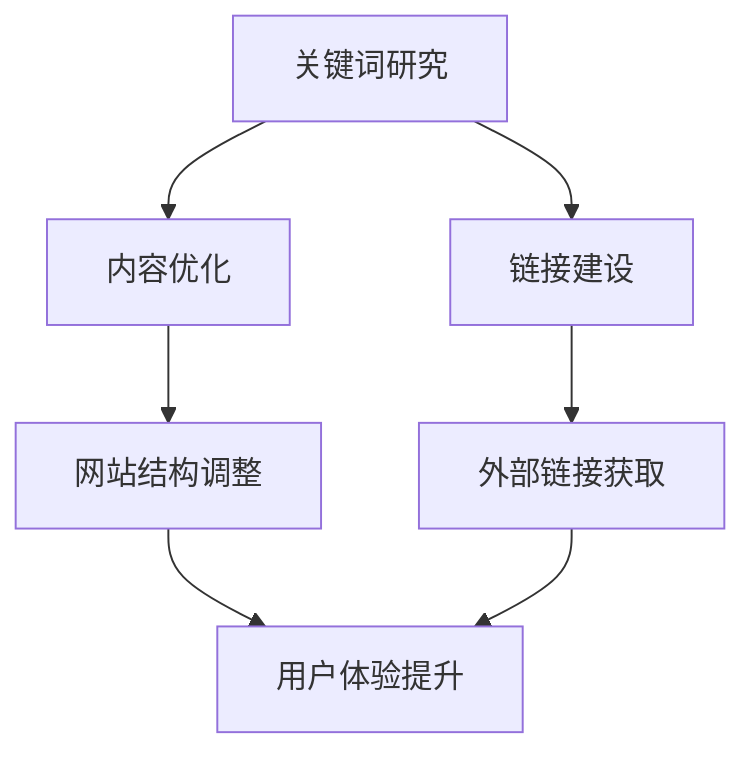

                 

关键词：SEO策略、网站权重、独立公司、搜索引擎优化、关键词研究、内容优化、链接建设

摘要：在当今数字营销的世界中，搜索引擎优化（SEO）已成为企业成功的关键因素。对于一人公司来说，利用有效的SEO策略提升网站权重，不仅能够提高在线曝光率，还能带来更多的潜在客户和业务机会。本文将深入探讨SEO的核心概念、具体操作步骤以及一人公司如何利用这些策略，实现网站权重的提升。

## 1. 背景介绍

随着互联网的快速发展，线上业务变得越来越重要。对于一人公司而言，建立和维护一个高效、专业的网站显得尤为重要。然而，如何在竞争激烈的市场中脱颖而出，吸引更多的访问者和潜在客户，成为了一大挑战。SEO策略能够帮助网站在搜索引擎结果页面（SERPs）中取得更高的排名，从而提高网站的流量和知名度。

### 1.1 SEO的定义

搜索引擎优化（SEO）是一种通过改进网站结构、内容和外部链接，以提高网站在搜索引擎结果页面中自然排名的方法。SEO的目标是吸引更多的有机流量，提升网站的质量和用户体验，从而增加转化率和收入。

### 1.2 SEO的重要性

- 提高网站可见性：通过SEO，网站可以在搜索引擎结果页面中获得更高的排名，吸引更多潜在客户。
- 降低营销成本：SEO是一种相对成本较低的营销策略，长期来看，效果比付费广告更为显著。
- 增强品牌信誉：高质量的SEO策略能够提升网站的权威性和专业性，增强品牌形象。

### 1.3 一人公司的优势与挑战

一人公司的优势在于决策迅速、灵活性高。然而，与大型公司相比，一人公司在资源、技术和市场影响力方面可能处于劣势。因此，利用SEO策略提升网站权重，成为了一人公司获取竞争优势的重要途径。

## 2. 核心概念与联系

### 2.1 关键词研究

关键词研究是SEO策略的基础。通过分析目标受众搜索行为，确定相关且搜索量大的关键词，有助于提高网站的搜索引擎排名。

### 2.2 内容优化

内容优化是指通过改进网站内容的质量和结构，使其更具吸引力和价值。高质量的内容不仅能够提高用户体验，还能吸引搜索引擎给予更高的排名。

### 2.3 链接建设

链接建设是指通过获得高质量的外部链接，提高网站的权威性和权重。外部链接的数量和质量是影响网站排名的重要因素。

### 2.4 Mermaid流程图

下面是一个关于SEO核心概念和流程的Mermaid流程图：



## 3. 核心算法原理 & 具体操作步骤

### 3.1 算法原理概述

SEO的核心算法原理包括搜索引擎的工作原理、关键词分析、内容质量和外部链接价值等方面。搜索引擎通过抓取网站内容、分析关键词和链接结构，确定网站的相关性和权威性，从而决定在搜索结果中的排名。

### 3.2 算法步骤详解

#### 3.2.1 关键词研究

1. 使用工具：使用谷歌关键词规划师、百度关键词规划师等工具，分析目标受众的搜索行为。
2. 筛选关键词：根据搜索量、竞争程度和转化率，筛选出适合的关键词。
3. 关键词布局：在网站标题、描述、内容中合理布局关键词，提高相关性。

#### 3.2.2 内容优化

1. 内容质量：撰写高质量、有价值的内容，满足用户需求。
2. 内容结构：优化内容结构，使用标题、段落、列表等格式，提高可读性。
3. 更新频率：定期更新内容，保持网站活跃度。

#### 3.2.3 链接建设

1. 内部链接：优化网站内部链接结构，提高页面权重。
2. 外部链接：通过撰写高质量的外部文章、参与行业论坛、交换链接等方式，获得高质量的外部链接。

### 3.3 算法优缺点

#### 优点：

- 提高网站排名：通过SEO策略，提高网站在搜索引擎结果页面中的排名。
- 增加流量：吸引更多有机流量，提高网站访问量。
- 降低成本：相对于付费广告，SEO策略成本较低。

#### 缺点：

- 长期性：SEO效果需要时间积累，短期内难以见效。
- 竞争激烈：热门关键词竞争激烈，排名提升困难。

### 3.4 算法应用领域

SEO策略适用于各种类型的网站，包括电子商务、内容营销、企业官网等。通过SEO，网站可以在竞争激烈的市场中脱颖而出，提高品牌知名度和市场份额。

## 4. 数学模型和公式 & 详细讲解 & 举例说明

### 4.1 数学模型构建

SEO的核心算法通常涉及以下数学模型：

- 关键词密度模型：关键词密度（Keyword Density，KD）是指关键词在网页中的出现频率与网页总字数的比例。公式如下：

  $$ KD = \frac{K}{T} $$

  其中，K为关键词在网页中的出现次数，T为网页总字数。

- 外部链接模型：外部链接密度（External Link Density，ELD）是指外部链接数量与总链接数量的比例。公式如下：

  $$ ELD = \frac{EL}{L} $$

  其中，EL为外部链接数量，L为总链接数量。

### 4.2 公式推导过程

以关键词密度模型为例，推导过程如下：

1. 关键词在网页中的出现次数K，可以通过统计网页中关键词的出现次数得到。
2. 网页总字数T，可以通过计算网页中的文字数量得到。
3. 将K和T代入公式：

   $$ KD = \frac{K}{T} $$

   得到关键词密度。

### 4.3 案例分析与讲解

假设一个网页中有1000个字，其中关键词“SEO”出现了10次，则关键词密度为：

$$ KD = \frac{10}{1000} = 0.01 $$

这个关键词密度较低，说明网页中关键词分布较为均匀。为了提高关键词密度，可以适当增加关键词在网页中的出现次数，或者减少网页总字数。

## 5. 项目实践：代码实例和详细解释说明

### 5.1 开发环境搭建

在进行SEO实践之前，首先需要搭建一个合适的开发环境。这里以Python为例，介绍开发环境的搭建步骤：

1. 安装Python：在官方网站（https://www.python.org/）下载并安装Python。
2. 安装依赖库：使用pip命令安装相关依赖库，如BeautifulSoup、requests等。

   ```bash
   pip install beautifulsoup4
   pip install requests
   ```

### 5.2 源代码详细实现

以下是一个简单的Python代码实例，用于分析网页关键词密度：

```python
from bs4 import BeautifulSoup
import requests

def get_keyword_density(url, keyword):
    # 请求网页内容
    response = requests.get(url)
    content = response.text

    # 解析网页内容
    soup = BeautifulSoup(content, 'html.parser')

    # 获取关键词出现次数
    keyword_count = soup.text.count(keyword)

    # 获取网页总字数
    total_word_count = len(soup.text.split())

    # 计算关键词密度
    keyword_density = keyword_count / total_word_count

    return keyword_density

# 测试
url = 'https://example.com'
keyword = 'SEO'
density = get_keyword_density(url, keyword)
print(f'Keyword Density for "{keyword}": {density}')
```

### 5.3 代码解读与分析

上述代码首先使用requests库请求网页内容，然后使用BeautifulSoup库解析网页内容。通过统计关键词在网页中的出现次数和网页总字数，计算出关键词密度。

### 5.4 运行结果展示

假设网页内容中“SEO”出现了10次，总字数为1000个，则关键词密度为：

```bash
Keyword Density for "SEO": 0.01
```

## 6. 实际应用场景

### 6.1 SEO在电子商务中的应用

电子商务网站通常需要优化产品描述、分类和搜索功能。通过SEO策略，可以提高网站在搜索引擎中的排名，吸引更多潜在客户。

### 6.2 SEO在内容营销中的应用

内容营销网站需要优化文章质量、关键词布局和外部链接。通过SEO策略，可以提高文章在搜索引擎中的排名，吸引更多读者。

### 6.3 SEO在企业官网中的应用

企业官网需要优化网站结构、内容和关键词。通过SEO策略，可以提高官网在搜索引擎中的排名，提升企业形象和品牌知名度。

## 7. 工具和资源推荐

### 7.1 学习资源推荐

- 《SEO实战密码》：一本关于SEO实战技巧的权威指南。
- 《搜索引擎算法揭秘》：一本深入剖析搜索引擎算法的书籍。

### 7.2 开发工具推荐

- 谷歌关键词规划师：一款用于关键词研究的在线工具。
- Ahrefs：一款功能强大的SEO工具，包括关键词研究、竞争对手分析等。

### 7.3 相关论文推荐

- [Google's PageRank：A Ranking Algorithm for Web Pages](https://ieeexplore.ieee.org/document/772379)：一篇关于PageRank算法的经典论文。
- [Search Engine Optimization: An Introduction](https://www.researchgate.net/publication/318746336_Search_Engine_Optimization_An_Introduction)：一篇关于SEO基本概念的论文。

## 8. 总结：未来发展趋势与挑战

### 8.1 研究成果总结

SEO策略在提高网站排名、流量和品牌知名度方面取得了显著成果。随着搜索引擎算法的不断发展，SEO策略也需要不断更新和优化。

### 8.2 未来发展趋势

- 智能化：随着人工智能技术的发展，SEO策略将更加智能化，实现个性化搜索和精准营销。
- 内容质量：高质量的内容将成为SEO的核心，满足用户需求成为关键。
- 多媒体优化：视频、图片等多元化内容将在SEO中发挥更大作用。

### 8.3 面临的挑战

- 算法更新：搜索引擎算法不断更新，SEO策略需要及时调整。
- 竞争加剧：热门关键词竞争激烈，排名提升困难。

### 8.4 研究展望

未来SEO研究将关注智能化、个性化搜索和多元化内容优化等方面。通过深入研究搜索引擎算法和用户需求，实现更高效的SEO策略。

## 9. 附录：常见问题与解答

### 9.1 SEO需要多长时间见效？

SEO效果需要时间积累，通常在3-6个月才能看到显著效果。但具体时间取决于网站质量、关键词难度和SEO策略的有效性。

### 9.2 SEO和付费广告的区别是什么？

SEO是一种通过优化网站内容和结构，提高搜索引擎排名的免费策略。而付费广告是通过投放广告，直接在搜索引擎结果页中展示网站，需要支付费用。

### 9.3 如何避免被搜索引擎惩罚？

遵循搜索引擎的指南，避免使用黑帽SEO技术。保持内容原创、高质量，遵循良好的链接建设原则，避免过度优化。

作者：禅与计算机程序设计艺术 / Zen and the Art of Computer Programming
----------------------------------------------------------------

这篇文章详细介绍了SEO策略的核心概念、算法原理、具体操作步骤、数学模型以及实际应用场景。通过对关键词研究、内容优化和链接建设的深入探讨，一人公司可以充分利用SEO策略，提升网站权重，实现在线业务的快速发展。未来，随着人工智能和大数据技术的不断发展，SEO策略将更加智能化和个性化，为企业和个人带来更多的机遇和挑战。

