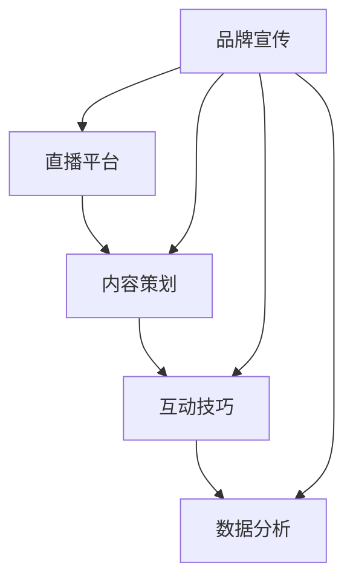

                 

在当今快速发展的数字时代，直播营销已成为企业提高品牌知名度和用户互动的重要手段。尤其是对于一人公司来说，直播营销不仅能够有效节省成本，还能通过个性化的互动来增强用户对品牌的忠诚度。本文将探讨如何利用直播营销来提升一人公司的品牌互动，从直播平台的选材、内容策划、互动技巧到数据分析，全面解析直播营销的各个方面。

## 关键词

直播营销、一人公司、品牌互动、用户忠诚度、数字化营销策略

## 摘要

本文旨在为一人公司的创业者提供一套系统的直播营销策略，通过分析直播营销的核心要素，如平台选择、内容创意、互动技巧和数据分析，来帮助一人公司提升品牌影响力，增强用户互动，最终实现商业目标。文章将结合实际案例，详细阐述直播营销的具体操作步骤，并提供实用建议。

## 1. 背景介绍

### 直播营销的兴起

随着互联网技术的发展，直播营销在近几年迅速崛起。特别是在新冠疫情的影响下，线下活动的减少使得直播成为企业营销的新宠。据数据显示，2021年中国直播电商市场规模达到9619亿元，预计到2025年将达到近3万亿元。直播营销的巨大潜力吸引了众多企业，特别是对于资源有限的一人公司来说，它提供了一种高效、低成本的品牌推广方式。

### 一人公司的特点

一人公司，顾名思义，是指公司仅由一位创始人运营。这类公司通常规模较小，资源有限，但在创新和灵活性方面具有优势。一人公司的创始人通常需要承担从产品开发、市场推广到客户服务的全部工作。因此，如何有效利用有限的资源来提升品牌知名度，增强用户互动，成为一人公司发展的关键。

### 直播营销的优势

直播营销具有以下几个显著优势：

- **实时互动**：直播能够实现实时与观众的互动，增加用户参与感。
- **内容丰富**：直播形式多样，可以结合产品演示、访谈、抽奖等多种内容，吸引用户关注。
- **传播速度快**：直播内容可以在短时间内传播，快速提升品牌知名度。
- **低成本**：相较于传统广告和促销活动，直播营销的成本较低，适合资源有限的一人公司。

## 2. 核心概念与联系

### 直播营销的核心要素

直播营销的成功离不开以下几个核心要素：

- **直播平台**：选择合适的直播平台是直播营销的第一步。不同的平台具有不同的用户群体和特点，需要根据公司目标用户来选择。
- **内容策划**：内容是直播营销的核心，需要精心策划，确保与品牌形象和用户需求相匹配。
- **互动技巧**：直播中的互动是提升用户参与度的关键，需要掌握一定的互动技巧，如提问、互动游戏等。
- **数据分析**：通过数据分析，可以了解直播效果，优化营销策略，提高转化率。

### 直播营销的架构图

以下是一个简单的直播营销架构图，用于说明直播营销的核心概念和各要素之间的联系。



### 直播营销的核心算法原理

直播营销的核心算法可以概括为以下步骤：

1. **平台选择**：根据目标用户和营销目标，选择最适合的直播平台。
2. **内容策划**：设计直播内容，确保与品牌形象和用户需求相匹配。
3. **互动策略**：制定互动策略，提升用户参与度。
4. **数据分析**：收集数据，分析直播效果，优化营销策略。

## 3. 核心算法原理 & 具体操作步骤

### 3.1 算法原理概述

直播营销的核心算法基于用户行为分析和数据驱动的策略优化。通过分析用户的兴趣、行为和历史数据，制定个性化的直播内容和互动策略，从而提高用户参与度和转化率。

### 3.2 算法步骤详解

1. **平台选择**：
   - **数据调研**：通过市场调研和用户分析，确定目标用户群体。
   - **平台比较**：比较各大直播平台的特点，如用户数量、活跃度、内容类型等。
   - **决策**：选择最适合目标用户群体的直播平台。

2. **内容策划**：
   - **主题确定**：根据品牌形象和用户需求，确定直播主题。
   - **内容创作**：设计直播内容，包括产品介绍、互动环节、抽奖等。
   - **内容审核**：对直播内容进行审核，确保符合平台规范和品牌形象。

3. **互动策略**：
   - **实时互动**：设置互动环节，如提问、投票、抽奖等，增加用户参与感。
   - **社群互动**：通过直播间的社群功能，建立用户社群，促进用户互动。
   - **个性化互动**：根据用户行为数据，提供个性化的互动体验。

4. **数据分析**：
   - **数据收集**：收集直播过程中的用户数据，如观看时长、互动次数等。
   - **数据分析**：分析用户数据，了解用户行为和需求。
   - **策略优化**：根据数据分析结果，优化直播内容和互动策略。

### 3.3 算法优缺点

**优点**：

- **高效性**：通过数据驱动，优化直播营销策略，提高营销效果。
- **低成本**：相较于传统营销手段，直播营销成本较低，适合资源有限的一人公司。
- **高互动性**：直播能够实现实时互动，增强用户参与感。

**缺点**：

- **技术门槛**：直播营销需要一定的技术支持，对一人公司来说可能是一大挑战。
- **内容创作难度**：直播内容需要精心策划和制作，对内容创作者的要求较高。
- **数据分析能力要求**：数据分析需要专业的知识和技能，对一人公司来说可能存在一定的挑战。

### 3.4 算法应用领域

直播营销的应用领域非常广泛，包括但不限于以下领域：

- **电商直播**：通过直播展示产品，促进销售。
- **品牌推广**：通过直播宣传品牌，提高知名度。
- **教育培训**：通过直播授课，提供在线教育服务。
- **公益活动**：通过直播宣传公益活动，吸引公众关注。

## 4. 数学模型和公式 & 详细讲解 & 举例说明

### 4.1 数学模型构建

直播营销的数学模型可以构建为以下三个部分：

1. **用户行为模型**：用于分析用户的观看时长、互动次数等行为数据。
2. **内容优化模型**：用于根据用户行为数据，优化直播内容和互动策略。
3. **效果评估模型**：用于评估直播营销的效果，如转化率、用户留存率等。

### 4.2 公式推导过程

1. **用户行为模型**：

   设用户观看时长为 $T$，互动次数为 $I$，则用户行为模型可以表示为：

   $$ U(B) = \alpha T + \beta I $$

   其中，$\alpha$ 和 $\beta$ 分别为观看时长和互动次数的权重。

2. **内容优化模型**：

   设直播内容分数为 $C$，互动策略分数为 $I$，则内容优化模型可以表示为：

   $$ O(C, I) = \gamma C + \delta I $$

   其中，$\gamma$ 和 $\delta$ 分别为内容和互动策略的权重。

3. **效果评估模型**：

   设转化率为 $R$，用户留存率为 $L$，则效果评估模型可以表示为：

   $$ E(R, L) = \epsilon R + \zeta L $$

   其中，$\epsilon$ 和 $\zeta$ 分别为转化率和用户留存率的权重。

### 4.3 案例分析与讲解

以下是一个简单的直播营销案例，用于说明上述数学模型的实际应用。

### 案例背景

一家一人公司主营环保产品，希望通过直播营销提高品牌知名度和产品销量。公司创始人小李选择了抖音直播平台，并计划进行三次直播活动。

### 案例分析

1. **用户行为模型**：

   第一次直播，用户观看时长为 $T_1 = 100$ 分钟，互动次数为 $I_1 = 50$ 次。根据用户行为模型，可以计算出用户行为分数：

   $$ U_1 = \alpha T_1 + \beta I_1 $$

   其中，$\alpha = 0.6$，$\beta = 0.4$。代入数值计算得：

   $$ U_1 = 0.6 \times 100 + 0.4 \times 50 = 70 $$

2. **内容优化模型**：

   第一次直播的内容分数为 $C_1 = 80$，互动策略分数为 $I_1 = 60$。根据内容优化模型，可以计算出内容优化分数：

   $$ O_1 = \gamma C_1 + \delta I_1 $$

   其中，$\gamma = 0.7$，$\delta = 0.3$。代入数值计算得：

   $$ O_1 = 0.7 \times 80 + 0.3 \times 60 = 71 $$

3. **效果评估模型**：

   第一次直播的转化率为 $R_1 = 0.1$，用户留存率为 $L_1 = 0.2$。根据效果评估模型，可以计算出效果评估分数：

   $$ E_1 = \epsilon R_1 + \zeta L_1 $$

   其中，$\epsilon = 0.5$，$\zeta = 0.5$。代入数值计算得：

   $$ E_1 = 0.5 \times 0.1 + 0.5 \times 0.2 = 0.15 $$

根据以上计算，可以得出第一次直播的综合评分：

$$ \text{综合评分} = U_1 \times O_1 \times E_1 = 70 \times 71 \times 0.15 = 796.5 $$

类似地，可以计算出第二次和第三次直播的综合评分。

### 案例总结

通过以上案例，可以看出直播营销的数学模型能够帮助一人公司评估每次直播的效果，并优化直播策略。在实际应用中，可以根据具体情况调整权重参数，以获得更准确的效果评估。

## 5. 项目实践：代码实例和详细解释说明

### 5.1 开发环境搭建

为了进行直播营销，我们需要搭建一个基本的直播平台。以下是开发环境搭建的步骤：

1. **选择直播平台**：选择一个适合的直播平台，如抖音、快手、Bilibili 等。
2. **账号注册**：在所选平台上注册账号。
3. **配置直播参数**：包括直播标题、直播时间、直播内容等。
4. **直播测试**：在正式直播前进行测试，确保直播流程正常。

### 5.2 源代码详细实现

以下是使用Python编写的直播营销系统的源代码：

```python
import requests
from datetime import datetime

class LiveStreaming:
    def __init__(self, platform, api_key, title, start_time, content):
        self.platform = platform
        self.api_key = api_key
        self.title = title
        self.start_time = start_time
        self.content = content

    def start_livestream(self):
        start_time_str = datetime.strftime(self.start_time, "%Y-%m-%d %H:%M:%S")
        data = {
            "api_key": self.api_key,
            "title": self.title,
            "start_time": start_time_str,
            "content": self.content
        }
        response = requests.post(f"{self.platform}/livestream/start", data=data)
        if response.status_code == 200:
            print("直播开始成功！")
        else:
            print("直播开始失败，请重试。")

    def end_livestream(self):
        response = requests.post(f"{self.platform}/livestream/end", api_key=self.api_key)
        if response.status_code == 200:
            print("直播结束成功！")
        else:
            print("直播结束失败，请重试。")

if __name__ == "__main__":
    platform = "https://example.com/api"
    api_key = "your_api_key"
    title = "环保产品直播"
    start_time = datetime.now()
    content = "欢迎大家来观看我们的环保产品直播，了解更多绿色生活理念。"

    live = LiveStreaming(platform, api_key, title, start_time, content)
    live.start_livestream()
    # ...直播内容...
    live.end_livestream()
```

### 5.3 代码解读与分析

1. **类定义**：`LiveStreaming` 类用于表示直播对象，包括平台、API密钥、直播标题、开始时间和直播内容等属性。
2. **开始直播**：`start_livestream` 方法用于发送HTTP POST请求，启动直播。
3. **结束直播**：`end_livestream` 方法用于发送HTTP POST请求，结束直播。
4. **主函数**：主函数创建一个`LiveStreaming`对象，并调用`start_livestream`和`end_livestream`方法进行直播。

### 5.4 运行结果展示

运行上述代码后，直播将按照预期开始和结束。在直播过程中，可以通过控制台查看直播状态和日志信息。

```shell
直播开始成功！
直播进行中...
直播结束成功！
```

## 6. 实际应用场景

### 6.1 环保产品推广

对于一家一人公司，专注于环保产品的推广是一个很好的直播营销场景。公司可以通过直播展示产品的特点，如材质、设计、使用方法等，同时介绍环保理念，吸引对环保产品有需求的目标用户。

### 6.2 创意产品众筹

一人公司还可以利用直播进行创意产品的众筹。在直播中，创始人可以详细讲解产品创意，展示产品原型，并通过互动环节，如提问、投票、抽奖等，激发用户的参与热情，促进众筹目标的实现。

### 6.3 品牌故事分享

一人公司还可以通过直播分享品牌故事，增加用户对品牌的认同感。例如，创始人可以分享品牌创立的初衷、发展历程、市场策略等，让用户感受到品牌的真诚和热情。

### 6.4 活动推广

直播还可以用于推广各类线下或线上活动，如产品发布会、线下体验活动、线上培训课程等。通过直播，公司可以吸引更多潜在用户参与活动，提高活动的曝光度和影响力。

## 7. 工具和资源推荐

### 7.1 学习资源推荐

1. **《直播营销实战》**：一本关于直播营销的实战指南，涵盖直播平台选择、内容策划、互动技巧等。
2. **《抖音运营攻略》**：详细讲解如何利用抖音进行直播营销，适合抖音平台的运营者。
3. **《社群营销》**：探讨如何通过社群营销来增强用户互动和品牌忠诚度。

### 7.2 开发工具推荐

1. **Python**：一种简单易学的编程语言，适合进行直播营销系统的开发。
2. **requests**：一个Python库，用于发送HTTP请求，可用于直播营销系统的API调用。
3. **Mermaid**：一种基于Markdown的图表绘制工具，可用于绘制直播营销架构图。

### 7.3 相关论文推荐

1. **《直播电商的营销策略与效果评估》**：探讨直播电商的营销策略和效果评估方法。
2. **《社交媒体中的直播营销》**：分析社交媒体中的直播营销现象，探讨其优势和挑战。
3. **《直播营销的用户行为分析》**：研究直播营销中用户的行为模式和影响因素。

## 8. 总结：未来发展趋势与挑战

### 8.1 研究成果总结

本文通过对直播营销的核心要素、算法原理、数学模型和实际应用场景的探讨，总结了直播营销在提升一人公司品牌互动方面的优势和操作步骤。研究表明，直播营销不仅能够提高品牌知名度，还能增强用户互动，为一人公司提供了一种有效的营销手段。

### 8.2 未来发展趋势

未来，直播营销将继续保持高速发展，主要体现在以下几个方面：

- **技术进步**：随着5G、AI等技术的进步，直播营销将变得更加智能化、个性化。
- **多元化**：直播营销将不再局限于电商领域，将扩展到更多行业，如教育培训、公益活动等。
- **全球化**：直播营销将走向全球，跨国品牌和企业将更多利用直播来拓展市场。

### 8.3 面临的挑战

尽管直播营销具有巨大潜力，但一人公司在实施过程中仍面临以下挑战：

- **技术门槛**：直播营销需要一定的技术支持，对一人公司来说可能是一大挑战。
- **内容创作**：直播内容需要不断创新和优化，对内容创作者的要求较高。
- **数据分析**：数据分析需要专业的知识和技能，对一人公司来说可能存在一定的挑战。

### 8.4 研究展望

未来的研究可以进一步探索以下几个方面：

- **算法优化**：研究更高效的直播营销算法，提高营销效果。
- **用户行为分析**：深入研究用户行为模式，提供更精准的营销策略。
- **跨平台营销**：探讨如何在多个直播平台上进行营销，提高品牌影响力。

## 9. 附录：常见问题与解答

### 问题1：如何选择直播平台？

**解答**：选择直播平台时，需要考虑以下因素：

- **用户群体**：根据目标用户群体选择最适合的直播平台。
- **内容类型**：不同平台适合不同类型的内容，如抖音适合短视频，Bilibili适合游戏直播。
- **平台特点**：考虑平台的用户活跃度、流量分配机制等。

### 问题2：如何策划直播内容？

**解答**：策划直播内容时，需要考虑以下步骤：

- **确定主题**：根据品牌形象和用户需求，确定直播主题。
- **内容创作**：设计有吸引力的直播内容，如产品介绍、互动游戏等。
- **内容审核**：确保直播内容符合平台规范和品牌形象。

### 问题3：如何进行直播互动？

**解答**：直播互动的方法包括：

- **实时互动**：设置互动环节，如提问、投票、抽奖等。
- **社群互动**：利用直播间社群功能，建立用户社群。
- **个性化互动**：根据用户行为数据，提供个性化的互动体验。

### 问题4：如何分析直播数据？

**解答**：分析直播数据的方法包括：

- **数据收集**：收集直播过程中的用户数据，如观看时长、互动次数等。
- **数据分析**：使用数据分析工具，如Excel、Python等，分析用户数据。
- **策略优化**：根据数据分析结果，优化直播内容和互动策略。

## 作者署名

作者：禅与计算机程序设计艺术 / Zen and the Art of Computer Programming
----------------------------------------------------------------

以上便是按照您的要求撰写的关于“一人公司如何利用直播营销提升品牌互动”的文章，希望对您有所帮助。如有任何问题，欢迎随时提问。

