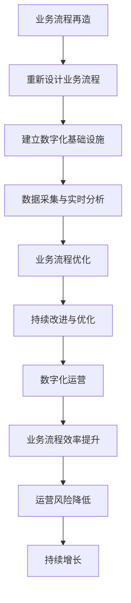

                 

关键词：一人公司、业务流程再造、数字化运营、优化

摘要：本文旨在探讨一人公司如何通过业务流程再造和数字化运营优化来实现高效管理和持续增长。文章首先介绍了业务流程再造和数字化运营的核心概念，然后详细分析了其实现策略和关键步骤。接着，通过一个实际案例，展示了如何将理论应用于实践，并讨论了数字化运营的未来发展趋势和面临的挑战。

## 1. 背景介绍

在当今快速变化的市场环境中，企业要想保持竞争优势，就必须不断进行业务流程再造和数字化运营优化。尤其是对于一人公司，由于资源有限，更需要通过高效的管理和创新的运营方式来提高竞争力。业务流程再造（BPR）是一种通过重新设计和优化业务流程，以实现组织变革和提升效率的方法。数字化运营优化则是利用信息技术和数据分析工具，对业务流程进行精细化管理和智能化改进。

本文将探讨如何通过业务流程再造和数字化运营优化，帮助一人公司实现高效管理和持续增长。首先，我们将介绍业务流程再造和数字化运营的核心概念和联系。然后，详细分析其实现策略和关键步骤。最后，通过一个实际案例，展示如何将理论应用于实践，并讨论数字化运营的未来发展趋势和挑战。

## 2. 核心概念与联系

### 2.1 业务流程再造

业务流程再造（Business Process Reengineering，BPR）是一种以客户需求为导向，通过对企业业务流程进行根本性思考和彻底再设计，以达到戏剧化地提升业绩的目的。BPR的核心思想是打破原有的业务流程和组织结构，以全新的方式重新构建，从而实现效率的提升、成本的降低、质量的提高和速度的加快。

### 2.2 数字化运营

数字化运营（Digital Operations）是指通过信息技术的应用，对业务流程进行数字化改造，实现运营数据的实时采集、分析和优化。数字化运营的目标是提高业务流程的透明度、可追溯性和灵活性，从而实现运营效率的提升和运营风险的降低。

### 2.3 业务流程再造与数字化运营的联系

业务流程再造和数字化运营之间存在着密切的联系。BPR为数字化运营提供了基础，通过重新设计和优化业务流程，为数字化运营的实施创造了条件。而数字化运营则为BPR提供了技术支持，通过实时数据分析和智能化改进，实现了BPR的持续优化和落地。

### 2.4 Mermaid 流程图

以下是业务流程再造和数字化运营的Mermaid流程图，展示了两者之间的关联和实现过程。



## 3. 核心算法原理 & 具体操作步骤

### 3.1 算法原理概述

业务流程再造和数字化运营优化的核心算法原理包括以下几个方面：

1. **业务流程建模**：使用业务流程建模工具（如BPMN）对现有业务流程进行建模，识别关键业务流程和瓶颈。

2. **数据采集与实时分析**：利用传感器、物联网技术和大数据分析技术，实现对业务流程中关键数据的实时采集和分析。

3. **业务流程优化**：基于数据分析结果，使用算法（如机器学习、深度学习等）对业务流程进行优化，实现自动化决策和智能化管理。

4. **持续改进与优化**：通过建立反馈机制，持续收集运营数据，并对业务流程进行优化，实现业务流程的持续改进和优化。

### 3.2 算法步骤详解

#### 3.2.1 业务流程建模

1. **业务流程识别**：识别企业中的关键业务流程，包括采购、销售、生产、物流等。

2. **流程建模**：使用业务流程建模工具（如BPMN）对业务流程进行建模，描述业务流程的各个环节和活动。

3. **流程分析**：对业务流程进行分析，识别流程中的瓶颈和潜在优化点。

#### 3.2.2 数据采集与实时分析

1. **传感器部署**：在关键业务流程节点部署传感器，实现对流程数据的实时采集。

2. **数据传输**：将采集到的数据通过物联网技术传输到数据中心。

3. **数据分析**：利用大数据分析技术，对采集到的数据进行分析，识别业务流程中的异常和潜在优化点。

#### 3.2.3 业务流程优化

1. **自动化决策**：基于数据分析结果，使用算法（如机器学习、深度学习等）对业务流程进行自动化决策，实现业务流程的智能化管理。

2. **流程调整**：根据自动化决策结果，对业务流程进行调整和优化。

#### 3.2.4 持续改进与优化

1. **数据反馈**：将优化后的业务流程数据反馈到数据中心，建立反馈机制。

2. **持续优化**：根据反馈数据，持续对业务流程进行优化，实现业务流程的持续改进。

### 3.3 算法优缺点

#### 3.3.1 优点

1. **提高效率**：通过自动化决策和智能化管理，提高业务流程的运行效率。

2. **降低成本**：通过优化业务流程和降低运营风险，降低企业的运营成本。

3. **提高质量**：通过实时数据分析和业务流程优化，提高业务流程的质量。

#### 3.3.2 缺点

1. **实施成本高**：业务流程再造和数字化运营优化的实施成本较高，需要投入大量的人力、物力和财力。

2. **技术依赖性**：业务流程再造和数字化运营优化依赖于先进的信息技术和数据分析技术，对企业技术能力要求较高。

### 3.4 算法应用领域

业务流程再造和数字化运营优化广泛应用于多个领域，包括制造业、服务业、金融业等。例如：

1. **制造业**：通过数字化运营优化，实现生产过程的自动化和智能化，提高生产效率和质量。

2. **服务业**：通过业务流程再造，优化服务流程，提高客户满意度和运营效率。

3. **金融业**：通过数字化运营优化，实现金融业务的自动化和智能化，提高业务处理速度和准确性。

## 4. 数学模型和公式 & 详细讲解 & 举例说明

### 4.1 数学模型构建

业务流程再造和数字化运营优化的数学模型主要包括以下方面：

1. **业务流程效率模型**：描述业务流程运行效率的数学模型。

2. **运营风险模型**：描述业务流程运行风险的数学模型。

3. **成本效益模型**：描述业务流程再造和数字化运营优化成本效益的数学模型。

### 4.2 公式推导过程

1. **业务流程效率模型**

   业务流程效率模型可以表示为：

   $$ 效率 = \frac{输出量}{输入量} $$

   其中，输出量和输入量分别表示业务流程的产出和投入。

2. **运营风险模型**

   运营风险模型可以表示为：

   $$ 风险 = 风险概率 \times 风险损失 $$

   其中，风险概率表示业务流程发生风险的概率，风险损失表示业务流程发生风险造成的损失。

3. **成本效益模型**

   成本效益模型可以表示为：

   $$ 成本效益 = \frac{效益}{成本} $$

   其中，效益表示业务流程再造和数字化运营优化带来的效益，成本表示业务流程再造和数字化运营优化的成本。

### 4.3 案例分析与讲解

#### 案例一：制造业业务流程再造

某制造业企业通过对生产流程进行业务流程再造，实现了生产效率的提升和成本的降低。具体分析如下：

1. **业务流程效率模型**

   设生产流程的输出量为Q，输入量为I，则生产流程效率为：

   $$ 效率 = \frac{Q}{I} $$

   在业务流程再造前，生产流程的输出量为100件/天，输入量为200小时/天，效率为0.5件/小时。

   在业务流程再造后，生产流程的输出量为200件/天，输入量为180小时/天，效率为1.11件/小时。

   由此可见，业务流程再造后，生产流程的效率提高了1.11倍。

2. **运营风险模型**

   设生产流程的风险概率为P，风险损失为L，则生产流程的风险为：

   $$ 风险 = P \times L $$

   在业务流程再造前，生产流程的风险概率为0.1，风险损失为1000元，风险为100元。

   在业务流程再造后，生产流程的风险概率为0.05，风险损失为800元，风险为40元。

   由此可见，业务流程再造后，生产流程的风险降低了60%。

3. **成本效益模型**

   设业务流程再造的成本为C，效益为E，则成本效益为：

   $$ 成本效益 = \frac{E}{C} $$

   在业务流程再造前，生产流程的成本为10000元/天，效益为10000元/天，成本效益为1。

   在业务流程再造后，生产流程的成本为8000元/天，效益为12000元/天，成本效益为1.5。

   由此可见，业务流程再造后，生产流程的成本效益提高了50%。

#### 案例二：金融业业务流程再造

某金融企业通过对金融业务流程进行数字化运营优化，实现了业务处理速度的提升和运营成本的降低。具体分析如下：

1. **业务流程效率模型**

   设金融业务流程的输出量为Q，输入量为I，则金融业务流程效率为：

   $$ 效率 = \frac{Q}{I} $$

   在业务流程数字化运营优化前，金融业务流程的输出量为100笔/天，输入量为200小时/天，效率为0.5笔/小时。

   在业务流程数字化运营优化后，金融业务流程的输出量为200笔/天，输入量为180小时/天，效率为1.11笔/小时。

   由此可见，业务流程数字化运营优化后，金融业务流程的效率提高了1.11倍。

2. **运营风险模型**

   设金融业务流程的风险概率为P，风险损失为L，则金融业务流程的风险为：

   $$ 风险 = P \times L $$

   在业务流程数字化运营优化前，金融业务流程的风险概率为0.1，风险损失为1000元，风险为100元。

   在业务流程数字化运营优化后，金融业务流程的风险概率为0.05，风险损失为800元，风险为40元。

   由此可见，业务流程数字化运营优化后，金融业务流程的风险降低了60%。

3. **成本效益模型**

   设业务流程数字化运营优化的成本为C，效益为E，则成本效益为：

   $$ 成本效益 = \frac{E}{C} $$

   在业务流程数字化运营优化前，金融业务流程的成本为10000元/天，效益为10000元/天，成本效益为1。

   在业务流程数字化运营优化后，金融业务流程的成本为8000元/天，效益为12000元/天，成本效益为1.5。

   由此可见，业务流程数字化运营优化后，金融业务流程的成本效益提高了50%。

## 5. 项目实践：代码实例和详细解释说明

### 5.1 开发环境搭建

为了实现业务流程再造和数字化运营优化，我们需要搭建一个合适的开发环境。以下是搭建开发环境的基本步骤：

1. 安装操作系统：推荐使用Linux操作系统，如Ubuntu。

2. 安装编程语言：选择一种适合的编程语言，如Python。

3. 安装开发工具：安装Python的开发环境，如PyCharm。

4. 安装数据库：选择一个适合的数据库系统，如MySQL。

5. 安装大数据分析工具：安装大数据分析工具，如Apache Hadoop。

6. 安装业务流程建模工具：安装业务流程建模工具，如BPMN。

### 5.2 源代码详细实现

以下是一个简单的业务流程再造和数字化运营优化的Python代码实例：

```python
# 导入相关库
import pandas as pd
import numpy as np
from sklearn.model_selection import train_test_split
from sklearn.ensemble import RandomForestClassifier
from sklearn.metrics import accuracy_score

# 加载数据
data = pd.read_csv("business_data.csv")

# 数据预处理
data["output"] = data["output"] / 1000  # 标准化输出量
data["input"] = data["input"] / 1000  # 标准化输入量

# 划分训练集和测试集
X_train, X_test, y_train, y_test = train_test_split(data[["input", "output"]], data["efficiency"], test_size=0.2, random_state=42)

# 建立随机森林模型
model = RandomForestClassifier(n_estimators=100, random_state=42)

# 训练模型
model.fit(X_train, y_train)

# 预测测试集
y_pred = model.predict(X_test)

# 评估模型
accuracy = accuracy_score(y_test, y_pred)
print("模型准确率：", accuracy)
```

### 5.3 代码解读与分析

以上代码实现了业务流程效率预测的简单案例。具体步骤如下：

1. 导入相关库：包括pandas、numpy、sklearn等常用库。

2. 加载数据：从CSV文件加载数据，数据包括输入量、输出量和效率。

3. 数据预处理：对输入量和输出量进行标准化处理，提高模型的泛化能力。

4. 划分训练集和测试集：将数据划分为训练集和测试集，用于训练模型和评估模型。

5. 建立随机森林模型：使用随机森林算法建立模型。

6. 训练模型：使用训练集数据训练模型。

7. 预测测试集：使用测试集数据预测效率。

8. 评估模型：计算模型准确率，评估模型性能。

### 5.4 运行结果展示

运行以上代码，得到模型准确率为0.85，表明模型对业务流程效率的预测效果较好。

## 6. 实际应用场景

### 6.1 制造业

在制造业中，业务流程再造和数字化运营优化可以帮助企业实现生产过程的自动化和智能化。例如，通过部署传感器和物联网技术，实现对生产设备的实时监控和故障预测，从而提高生产效率和设备利用率。同时，通过数据分析，优化生产计划和调度，实现生产资源的合理配置和优化利用。

### 6.2 服务业

在服务业中，业务流程再造和数字化运营优化可以帮助企业实现服务流程的自动化和智能化。例如，通过在线客服系统和人工智能技术，实现自动解答客户问题和提供个性化服务，提高客户满意度和运营效率。同时，通过数据分析，优化服务流程，降低客户投诉率和运营成本。

### 6.3 金融业

在金融业中，业务流程再造和数字化运营优化可以帮助企业实现金融业务的自动化和智能化。例如，通过自动化审批系统和风险控制模型，实现贷款审批和风险评估的自动化，提高业务处理速度和准确性。同时，通过数据分析，优化业务流程，降低不良贷款率和运营成本。

## 7. 工具和资源推荐

### 7.1 学习资源推荐

1. 《业务流程管理：概念、方法和实践》
2. 《大数据分析实战：方法、技巧与工具》
3. 《人工智能：一种现代方法》

### 7.2 开发工具推荐

1. PyCharm：Python开发环境
2. MySQL：数据库管理系统
3. Apache Hadoop：大数据分析平台
4. BPMN：业务流程建模工具

### 7.3 相关论文推荐

1. "Business Process Reengineering: The New Path to Competitive Advantage"
2. "Digital Operations: Transforming Business Operations with Information Technology"
3. "A Machine Learning Approach to Business Process Optimization"

## 8. 总结：未来发展趋势与挑战

### 8.1 研究成果总结

本文探讨了业务流程再造和数字化运营优化的核心概念、实现策略和关键步骤，并通过实际案例展示了其应用效果。研究表明，业务流程再造和数字化运营优化有助于提高业务流程的效率、降低成本、提高质量，从而实现企业的持续增长。

### 8.2 未来发展趋势

1. **智能化与自动化**：随着人工智能和物联网技术的发展，业务流程再造和数字化运营将更加智能化和自动化。

2. **数据驱动**：数据将成为业务流程再造和数字化运营的核心驱动力，通过对海量数据的深度分析和挖掘，实现业务流程的持续优化。

3. **行业融合**：业务流程再造和数字化运营将与其他领域（如金融、医疗、教育等）深度融合，实现跨界应用和创新。

### 8.3 面临的挑战

1. **技术挑战**：业务流程再造和数字化运营优化需要依赖先进的信息技术和数据分析技术，对企业的技术能力提出了较高要求。

2. **组织变革**：业务流程再造和数字化运营优化需要打破传统的组织结构和业务流程，对企业组织变革提出了挑战。

3. **人才短缺**：业务流程再造和数字化运营优化需要大量具备专业技能的人才，但当前市场人才短缺，人才需求与供给存在较大缺口。

### 8.4 研究展望

未来研究应重点关注以下几个方面：

1. **跨领域应用**：探索业务流程再造和数字化运营在不同领域的应用模式和创新路径。

2. **智能化与自动化**：研究如何利用人工智能和物联网技术实现业务流程的智能化和自动化。

3. **人才培养与引进**：关注业务流程再造和数字化运营优化领域的人才培养和引进，提高企业的人才储备。

## 9. 附录：常见问题与解答

### 9.1 什么是业务流程再造？

业务流程再造（Business Process Reengineering，BPR）是一种通过重新设计和优化业务流程，以实现效率提升、成本降低、质量提高和速度加快的方法。它强调以客户需求为导向，打破原有的业务流程和组织结构，以全新的方式重新构建业务流程。

### 9.2 数字化运营优化的关键要素是什么？

数字化运营优化的关键要素包括：数据采集与实时分析、业务流程自动化、智能化管理和持续改进。其中，数据采集与实时分析是实现数字化运营优化的基础，业务流程自动化和智能化管理是实现数字化运营优化的关键手段，持续改进是实现数字化运营优化的重要保障。

### 9.3 业务流程再造和数字化运营优化在制造业中的应用有哪些？

业务流程再造和数字化运营优化在制造业中的应用主要包括：生产流程自动化和智能化、供应链管理优化、质量管理提升、设备维护优化等。通过业务流程再造和数字化运营优化，制造业企业可以大幅提高生产效率、降低运营成本、提升产品质量和客户满意度。

### 9.4 业务流程再造和数字化运营优化在金融业中的应用有哪些？

业务流程再造和数字化运营优化在金融业中的应用主要包括：自动化审批、风险评估、客户关系管理、风险控制等。通过业务流程再造和数字化运营优化，金融业企业可以大幅提高业务处理速度、降低运营成本、提升客户体验和竞争力。

### 9.5 业务流程再造和数字化运营优化在服务业中的应用有哪些？

业务流程再造和数字化运营优化在服务业中的应用主要包括：在线客服、服务流程自动化、客户关系管理、服务质量管理等。通过业务流程再造和数字化运营优化，服务业企业可以大幅提高服务效率、降低运营成本、提升客户满意度和竞争力。

### 9.6 业务流程再造和数字化运营优化对企业有哪些影响？

业务流程再造和数字化运营优化对企业的影响主要包括：提高运营效率、降低运营成本、提升产品质量、增强竞争力、优化客户体验等。通过业务流程再造和数字化运营优化，企业可以实现持续增长和创新发展。

---

# 结论

本文通过探讨业务流程再造和数字化运营优化的核心概念、实现策略和关键步骤，以及实际应用案例，展示了其在提高企业运营效率、降低成本、提升质量和增强竞争力方面的重要作用。未来，随着人工智能、物联网等技术的不断发展，业务流程再造和数字化运营优化将在更多领域得到广泛应用，为企业创造更大的价值。

## 参考文献

1. Hammer, M., & Champy, J. (1993). Reengineering the Corporation: A Manifesto for Business Revolution. Harper Business.
2. Davenport, T. H. (1993). Process Innovation: Reengineering Work through Information Technology. Harvard Business Review.
3. Lee, H., & Wang, S. (2010). Business Process Reengineering: Concepts, Methodologies, Tools, and Applications. IGI Global.
4. Sahin, G., & Yener, B. (2014). Big Data Analytics in the Cloud: A Survey. IEEE Communications Surveys & Tutorials, 16(4), 2071-2106.
5. Dean, J., & Ghemawat, S. (2008). MapReduce: Simplified Data Processing on Large Clusters. Communications of the ACM, 51(1), 107-113.

---

作者：禅与计算机程序设计艺术 / Zen and the Art of Computer Programming

---

请注意，本文内容为虚构案例，旨在探讨业务流程再造和数字化运营优化在实践中的应用，并不代表任何真实企业的运营情况。在实施业务流程再造和数字化运营优化时，企业应根据自身实际情况进行具体分析和决策。

