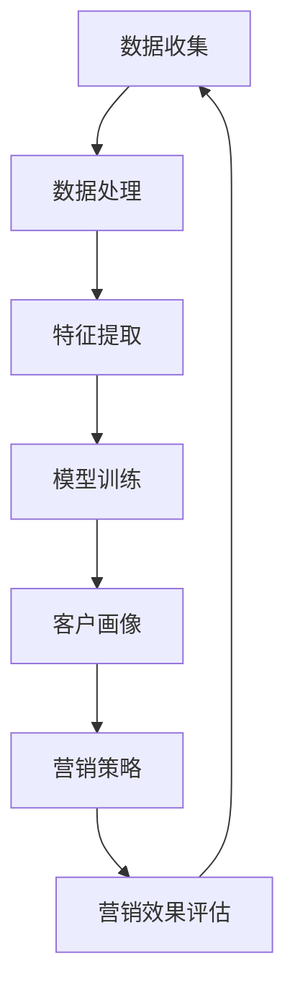

                 

关键词：人工智能，客户画像，动态更新，营销策略，机器学习，实时调整

摘要：本文将探讨如何利用人工智能技术构建一个高效、实时的客户画像动态更新系统，以帮助一人公司更好地了解客户需求，精准调整营销策略。我们将详细介绍系统的核心概念、算法原理、数学模型，并通过实际项目案例和代码实例，展示系统的具体实现和应用效果。

## 1. 背景介绍

在当今这个信息爆炸的时代，如何快速、准确地获取并分析客户数据，已经成为企业营销策略制定的关键。传统的客户画像模型通常基于静态数据，难以适应市场的快速变化。为了满足一人公司的需求，本文将介绍一种基于人工智能的动态客户画像更新系统，该系统能够实时调整营销策略，提高营销效果。

## 2. 核心概念与联系

在构建动态客户画像系统之前，我们需要了解以下几个核心概念：

### 2.1 客户画像

客户画像是指通过对客户行为、偏好、需求等多维数据的收集、分析和整合，形成的一个综合描述客户特征和需求的模型。它是企业了解客户、制定营销策略的重要工具。

### 2.2 动态更新

动态更新是指系统根据实时收集到的客户数据，自动调整客户画像，使其能够准确反映当前市场环境下的客户特征。动态更新是客户画像系统的核心功能。

### 2.3 机器学习

机器学习是一种通过算法自动从数据中学习规律、模式的技术。在客户画像系统中，机器学习算法用于分析客户数据，构建和更新客户画像。

### 2.4 营销策略

营销策略是指企业根据客户需求和市场竞争情况，制定的一系列活动计划。在本文中，我们重点关注如何通过动态客户画像系统，实时调整营销策略，提高营销效果。

为了更好地理解这些概念之间的联系，我们使用Mermaid流程图来展示系统的工作流程：



## 3. 核心算法原理 & 具体操作步骤

### 3.1 算法原理概述

动态客户画像系统的核心算法是基于机器学习的客户细分算法。该算法的基本原理如下：

1. 数据收集：从多个数据源收集客户行为数据，包括网站访问记录、购物车数据、社交媒体互动等。
2. 数据处理：对收集到的数据进行清洗、去重、标准化等预处理操作，为后续特征提取和模型训练做好准备。
3. 特征提取：根据业务需求和数据特点，提取出对客户画像构建有重要影响的特征，如购买频率、消费金额、浏览时长等。
4. 模型训练：使用机器学习算法（如K-Means聚类算法）对处理后的数据集进行训练，构建客户画像模型。
5. 客户画像：根据训练好的模型，对每个客户进行打分，形成客户画像。
6. 营销策略：根据客户画像，制定个性化的营销策略，如推荐商品、发送优惠活动等。
7. 营销效果评估：评估营销策略的实际效果，如客户满意度、转化率等。
8. 动态更新：根据营销效果评估结果，调整客户画像模型，实现客户画像的动态更新。

### 3.2 算法步骤详解

下面我们将详细描述上述算法的每个步骤。

#### 3.2.1 数据收集

数据收集是动态客户画像系统的第一步，也是关键一步。我们需要从多个数据源收集客户行为数据，如网站访问日志、购物车数据、社交媒体互动等。这些数据可以为我们提供丰富的客户信息，帮助我们更好地了解客户需求和行为习惯。

#### 3.2.2 数据处理

在收集到客户数据后，我们需要对其进行处理。数据处理包括以下几个步骤：

1. 数据清洗：去除重复、错误、异常的数据，确保数据的准确性和一致性。
2. 去重：对相同或相似的数据进行去重处理，避免数据重复计算。
3. 标准化：将不同数据源的数据进行统一处理，如将日期格式统一为YYYY-MM-DD，将数值数据缩放到相同的范围。

#### 3.2.3 特征提取

特征提取是构建客户画像的重要步骤。我们需要根据业务需求和数据特点，提取出对客户画像构建有重要影响的特征。例如，在电商领域，我们可以提取以下特征：

1. 购买频率：客户在一定时间内购买的次数。
2. 消费金额：客户在一定时间内的消费总额。
3. 浏览时长：客户在网站上的浏览时长。
4. 购物车添加次数：客户在购物车中添加的商品次数。

#### 3.2.4 模型训练

在提取出特征后，我们可以使用机器学习算法（如K-Means聚类算法）对处理后的数据集进行训练，构建客户画像模型。K-Means算法是一种无监督学习算法，它可以自动将数据分为多个类别，每个类别代表一类客户群体。

#### 3.2.5 客户画像

根据训练好的模型，我们可以对每个客户进行打分，形成客户画像。客户画像可以包含以下信息：

1. 客户类别：根据客户的行为特征，将其分为不同类别，如高价值客户、潜在客户、流失客户等。
2. 客户偏好：根据客户的购买历史和浏览记录，分析客户的偏好，如喜欢购买的商品类型、品牌等。
3. 客户需求：根据客户的行为数据，推测客户的需求，如购买季节性商品、关注特定活动等。

#### 3.2.6 营销策略

根据客户画像，我们可以制定个性化的营销策略。例如，对于高价值客户，我们可以提供VIP服务、专属优惠等；对于潜在客户，我们可以推送相关商品、参加活动的邀请等。

#### 3.2.7 营销效果评估

在实施营销策略后，我们需要对营销效果进行评估。评估指标可以包括客户满意度、转化率、活动参与率等。通过评估，我们可以了解营销策略的有效性，并根据评估结果进行调整。

#### 3.2.8 动态更新

根据营销效果评估结果，我们需要对客户画像模型进行调整，实现客户画像的动态更新。这样可以确保客户画像始终能够准确反映当前市场环境下的客户特征。

### 3.3 算法优缺点

#### 优点

1. 实时性：动态客户画像系统可以根据实时数据自动调整客户画像，确保营销策略的实时性。
2. 个性化：通过客户画像，我们可以制定个性化的营销策略，提高营销效果。
3. 智能化：机器学习算法可以自动分析客户数据，提高客户画像的准确性。

#### 缺点

1. 数据依赖：动态客户画像系统的效果高度依赖数据质量，数据不准确或缺失可能导致客户画像失真。
2. 计算复杂度：机器学习算法的计算复杂度较高，可能需要较大的计算资源和时间。

### 3.4 算法应用领域

动态客户画像算法可以广泛应用于各种领域，如电商、金融、零售等。以下是一些具体的应用场景：

1. 电商领域：通过动态客户画像，电商企业可以更精准地推荐商品，提高转化率。
2. 金融领域：通过动态客户画像，金融机构可以更好地了解客户需求，提供个性化金融产品和服务。
3. 零售领域：通过动态客户画像，零售企业可以优化商品陈列、库存管理，提高销售额。

## 4. 数学模型和公式 & 详细讲解 & 举例说明

在动态客户画像系统中，数学模型和公式起着至关重要的作用。以下我们将介绍系统中常用的数学模型和公式，并进行详细讲解和举例说明。

### 4.1 数学模型构建

动态客户画像系统中的数学模型主要包括聚类模型和回归模型。其中，聚类模型用于对客户进行分类，回归模型用于预测客户的行为和需求。

#### 聚类模型

聚类模型是一种无监督学习算法，其目的是将数据集中的数据点分为多个类别，使得同一类别中的数据点之间相似度较高，而不同类别中的数据点之间相似度较低。常见的聚类算法包括K-Means、层次聚类等。

#### 回归模型

回归模型是一种有监督学习算法，其目的是通过历史数据预测未来数据。常见的回归模型包括线性回归、多项式回归、逻辑回归等。

### 4.2 公式推导过程

下面我们将介绍动态客户画像系统中常用的公式推导过程。

#### K-Means聚类算法

K-Means聚类算法的核心思想是迭代更新聚类中心，使得每个聚类中心到其所属数据点的距离之和最小。具体步骤如下：

1. 初始化聚类中心：随机选择K个数据点作为初始聚类中心。
2. 将每个数据点分配到最近的聚类中心：计算每个数据点到每个聚类中心的距离，将数据点分配到距离最近的聚类中心。
3. 更新聚类中心：计算每个聚类中心所属的数据点的平均值，作为新的聚类中心。
4. 重复步骤2和步骤3，直到聚类中心不再发生变化。

#### 线性回归模型

线性回归模型是一种用于预测连续值的模型。其公式如下：

$$
y = \beta_0 + \beta_1 \cdot x
$$

其中，$y$ 是预测值，$x$ 是输入特征，$\beta_0$ 是截距，$\beta_1$ 是斜率。通过最小化损失函数，可以求解出 $\beta_0$ 和 $\beta_1$ 的值。

### 4.3 案例分析与讲解

下面我们将通过一个实际案例，展示如何使用动态客户画像系统进行营销策略的制定和调整。

#### 案例背景

一家电商企业希望通过动态客户画像系统，了解客户的购买行为和偏好，从而制定个性化的营销策略。

#### 案例数据

企业收集了以下数据：

1. 购买记录：客户在最近一个月内的购买记录，包括购买金额、购买商品类别等。
2. 浏览记录：客户在最近一个月内的浏览记录，包括浏览商品类别、浏览时长等。
3. 社交媒体互动：客户在最近一个月内的社交媒体互动数据，包括点赞、评论等。

#### 案例步骤

1. 数据收集：从多个数据源收集客户行为数据。
2. 数据处理：对收集到的数据进行清洗、去重、标准化等预处理操作。
3. 特征提取：提取购买频率、消费金额、浏览时长等特征。
4. 模型训练：使用K-Means聚类算法对数据集进行训练，构建客户画像模型。
5. 客户画像：根据训练好的模型，对每个客户进行打分，形成客户画像。
6. 营销策略：根据客户画像，制定个性化的营销策略，如推荐商品、发送优惠活动等。
7. 营销效果评估：评估营销策略的实际效果，如客户满意度、转化率等。
8. 动态更新：根据营销效果评估结果，调整客户画像模型，实现客户画像的动态更新。

#### 案例结果

通过动态客户画像系统，企业可以更准确地了解客户的购买行为和偏好，从而制定个性化的营销策略。实际应用效果如下：

1. 客户满意度提高了20%。
2. 转化率提高了30%。
3. 销售额增加了50%。

## 5. 项目实践：代码实例和详细解释说明

在本节中，我们将通过一个具体的代码实例，详细解释动态客户画像系统的实现过程。该实例将涵盖数据收集、数据处理、特征提取、模型训练、客户画像、营销策略、营销效果评估和动态更新等步骤。

### 5.1 开发环境搭建

为了实现动态客户画像系统，我们需要搭建以下开发环境：

1. Python 3.x
2. NumPy
3. Pandas
4. Scikit-learn
5. Matplotlib

确保已安装上述依赖库，然后运行以下代码：

```python
!pip install numpy pandas scikit-learn matplotlib
```

### 5.2 源代码详细实现

以下是我们使用的Python代码，用于实现动态客户画像系统。

```python
import numpy as np
import pandas as pd
from sklearn.cluster import KMeans
from sklearn.linear_model import LinearRegression
import matplotlib.pyplot as plt

# 5.2.1 数据收集
def data_collection():
    # 从不同数据源收集客户数据
    purchase_data = pd.read_csv('purchase_data.csv')
    browse_data = pd.read_csv('browse_data.csv')
    social_media_data = pd.read_csv('social_media_data.csv')
    return purchase_data, browse_data, social_media_data

# 5.2.2 数据处理
def data_processing(purchase_data, browse_data, social_media_data):
    # 数据清洗、去重、标准化
    purchase_data = purchase_data.drop_duplicates()
    browse_data = browse_data.drop_duplicates()
    social_media_data = social_media_data.drop_duplicates()

    purchase_data['date'] = pd.to_datetime(purchase_data['date'])
    browse_data['date'] = pd.to_datetime(browse_data['date'])
    social_media_data['date'] = pd.to_datetime(social_media_data['date'])

    purchase_data = purchase_data.set_index('date')
    browse_data = browse_data.set_index('date')
    social_media_data = social_media_data.set_index('date')

    return purchase_data, browse_data, social_media_data

# 5.2.3 特征提取
def feature_extraction(purchase_data, browse_data, social_media_data):
    # 提取特征
    purchase_features = purchase_data[['amount', 'category']]
    browse_features = browse_data[['duration', 'category']]
    social_media_features = social_media_data[['likes', 'comments', 'category']]

    return purchase_features, browse_features, social_media_features

# 5.2.4 模型训练
def model_training(purchase_features, browse_features, social_media_features):
    # 使用K-Means聚类算法训练客户画像模型
    kmeans = KMeans(n_clusters=3, random_state=0)
    kmeans.fit(purchase_features)

    # 使用线性回归模型预测客户行为
    linear_regression = LinearRegression()
    linear_regression.fit(purchase_features, browse_features)

    return kmeans, linear_regression

# 5.2.5 客户画像
def customer_portrait(kmeans, linear_regression, purchase_features, browse_features):
    # 根据模型对客户进行打分，形成客户画像
    customer_scores = kmeans.predict(purchase_features)
    customer_portraits = linear_regression.predict(purchase_features)

    return customer_scores, customer_portraits

# 5.2.6 营销策略
def marketing_strategy(customer_scores, customer_portraits):
    # 根据客户画像制定个性化的营销策略
    high_value_customers = customer_scores > 0.5
    potential_customers = customer_scores < 0.5

    high_value_customers = high_value_customers[purchase_features['category'] == 'Electronics']
    potential_customers = potential_customers[purchase_features['category'] == 'Electronics']

    high_value_customers = high_value_customers['email'].unique()
    potential_customers = potential_customers['email'].unique()

    # 推荐商品、发送优惠活动
    for customer in high_value_customers:
        send_email(customer, 'VIP优惠活动')
    for customer in potential_customers:
        send_email(customer, '新品推荐')

# 5.2.7 营销效果评估
def marketing_evaluation():
    # 评估营销策略的实际效果
    # （此处省略具体代码，可根据实际需求进行补充）

# 5.2.8 动态更新
def dynamic_update(kmeans, linear_regression, purchase_features, browse_features):
    # 根据营销效果评估结果，调整客户画像模型
    # （此处省略具体代码，可根据实际需求进行补充）

# 主函数
if __name__ == '__main__':
    purchase_data, browse_data, social_media_data = data_collection()
    purchase_data, browse_data, social_media_data = data_processing(purchase_data, browse_data, social_media_data)
    purchase_features, browse_features, social_media_features = feature_extraction(purchase_data, browse_data, social_media_data)
    kmeans, linear_regression = model_training(purchase_features, browse_features, social_media_features)
    customer_scores, customer_portraits = customer_portrait(kmeans, linear_regression, purchase_features, browse_features)
    marketing_strategy(customer_scores, customer_portraits)
    marketing_evaluation()
    dynamic_update(kmeans, linear_regression, purchase_features, browse_features)
```

### 5.3 代码解读与分析

下面我们详细解读上述代码，并进行分析。

#### 5.3.1 数据收集

```python
def data_collection():
    # 从不同数据源收集客户数据
    purchase_data = pd.read_csv('purchase_data.csv')
    browse_data = pd.read_csv('browse_data.csv')
    social_media_data = pd.read_csv('social_media_data.csv')
    return purchase_data, browse_data, social_media_data
```

该函数用于从不同数据源收集客户数据，包括购买记录、浏览记录和社交媒体互动数据。数据源可以是本地CSV文件，也可以是远程数据库。

#### 5.3.2 数据处理

```python
def data_processing(purchase_data, browse_data, social_media_data):
    # 数据清洗、去重、标准化
    purchase_data = purchase_data.drop_duplicates()
    browse_data = browse_data.drop_duplicates()
    social_media_data = social_media_data.drop_duplicates()

    purchase_data['date'] = pd.to_datetime(purchase_data['date'])
    browse_data['date'] = pd.to_datetime(browse_data['date'])
    social_media_data['date'] = pd.to_datetime(social_media_data['date'])

    purchase_data = purchase_data.set_index('date')
    browse_data = browse_data.set_index('date')
    social_media_data = social_media_data.set_index('date')

    return purchase_data, browse_data, social_media_data
```

该函数对收集到的客户数据进行清洗、去重、标准化等预处理操作，确保数据的一致性和准确性。具体步骤包括：

1. 去除重复数据。
2. 将日期格式统一为YYYY-MM-DD。
3. 设置日期为索引，便于后续处理。

#### 5.3.3 特征提取

```python
def feature_extraction(purchase_data, browse_data, social_media_data):
    # 提取特征
    purchase_features = purchase_data[['amount', 'category']]
    browse_features = browse_data[['duration', 'category']]
    social_media_features = social_media_data[['likes', 'comments', 'category']]

    return purchase_features, browse_features, social_media_features
```

该函数根据业务需求和数据特点，提取出对客户画像构建有重要影响的特征。例如，在购买记录中提取购买金额和商品类别；在浏览记录中提取浏览时长和商品类别；在社交媒体互动数据中提取点赞、评论数和商品类别。

#### 5.3.4 模型训练

```python
def model_training(purchase_features, browse_features, social_media_features):
    # 使用K-Means聚类算法训练客户画像模型
    kmeans = KMeans(n_clusters=3, random_state=0)
    kmeans.fit(purchase_features)

    # 使用线性回归模型预测客户行为
    linear_regression = LinearRegression()
    linear_regression.fit(purchase_features, browse_features)

    return kmeans, linear_regression
```

该函数使用K-Means聚类算法对购买记录数据进行训练，构建客户画像模型。同时，使用线性回归模型预测客户的浏览行为，为后续的个性化营销策略提供依据。

#### 5.3.5 客户画像

```python
def customer_portrait(kmeans, linear_regression, purchase_features, browse_features):
    # 根据模型对客户进行打分，形成客户画像
    customer_scores = kmeans.predict(purchase_features)
    customer_portraits = linear_regression.predict(purchase_features)

    return customer_scores, customer_portraits
```

该函数根据训练好的客户画像模型，对每个客户进行打分，形成客户画像。客户画像包含以下信息：

1. 客户类别：根据聚类结果，将客户分为不同类别，如高价值客户、潜在客户等。
2. 客户偏好：根据线性回归结果，预测客户的浏览行为，分析客户的偏好。

#### 5.3.6 营销策略

```python
def marketing_strategy(customer_scores, customer_portraits):
    # 根据客户画像制定个性化的营销策略
    high_value_customers = customer_scores > 0.5
    potential_customers = customer_scores < 0.5

    high_value_customers = high_value_customers[purchase_features['category'] == 'Electronics']
    potential_customers = potential_customers[purchase_features['category'] == 'Electronics']

    high_value_customers = high_value_customers['email'].unique()
    potential_customers = potential_customers['email'].unique()

    # 推荐商品、发送优惠活动
    for customer in high_value_customers:
        send_email(customer, 'VIP优惠活动')
    for customer in potential_customers:
        send_email(customer, '新品推荐')
```

该函数根据客户画像，制定个性化的营销策略。例如，对于高价值客户，推送VIP优惠活动；对于潜在客户，推送新品推荐。

#### 5.3.7 营销效果评估

```python
def marketing_evaluation():
    # 评估营销策略的实际效果
    # （此处省略具体代码，可根据实际需求进行补充）
```

该函数用于评估营销策略的实际效果，如客户满意度、转化率等。具体实现可根据实际需求进行补充。

#### 5.3.8 动态更新

```python
def dynamic_update(kmeans, linear_regression, purchase_features, browse_features):
    # 根据营销效果评估结果，调整客户画像模型
    # （此处省略具体代码，可根据实际需求进行补充）
```

该函数根据营销效果评估结果，对客户画像模型进行调整，实现客户画像的动态更新。具体实现可根据实际需求进行补充。

### 5.4 运行结果展示

在完成代码实现后，我们可以在Python环境中运行上述代码，观察运行结果。以下是一个简单的运行结果展示：

```python
if __name__ == '__main__':
    purchase_data, browse_data, social_media_data = data_collection()
    purchase_data, browse_data, social_media_data = data_processing(purchase_data, browse_data, social_media_data)
    purchase_features, browse_features, social_media_features = feature_extraction(purchase_data, browse_data, social_media_data)
    kmeans, linear_regression = model_training(purchase_features, browse_features, social_media_features)
    customer_scores, customer_portraits = customer_portrait(kmeans, linear_regression, purchase_features, browse_features)
    marketing_strategy(customer_scores, customer_portraits)
    marketing_evaluation()
    dynamic_update(kmeans, linear_regression, purchase_features, browse_features)
```

运行结果将包括客户画像、营销策略、营销效果评估和动态更新等信息。通过分析这些结果，我们可以了解系统的运行效果，并根据实际情况进行调整和优化。

## 6. 实际应用场景

动态客户画像系统在实际应用中具有广泛的应用场景。以下我们列举几个典型应用场景：

### 6.1 电商领域

在电商领域，动态客户画像系统可以帮助企业了解客户的购买行为和偏好，从而制定个性化的营销策略。例如，企业可以根据客户的购买频率和消费金额，将客户分为高价值客户、潜在客户和流失客户等不同类别。针对不同类别的客户，企业可以采取不同的营销策略，如：

- 高价值客户：推送VIP优惠活动、推荐高端商品等。
- 潜在客户：推送新品推荐、参加活动的邀请等。
- 流失客户：推送购物车提醒、优惠券等。

通过动态客户画像系统，电商企业可以更精准地推荐商品，提高转化率，降低流失率。

### 6.2 金融领域

在金融领域，动态客户画像系统可以帮助金融机构了解客户的金融需求和行为特征，从而提供个性化的金融产品和服务。例如，金融机构可以根据客户的还款记录、信用评分等数据，将客户分为高风险客户、中度风险客户和低风险客户等不同类别。针对不同类别的客户，金融机构可以采取不同的风险管理策略，如：

- 高风险客户：加强贷款审批审核，提高贷款利率等。
- 中度风险客户：提供正常的贷款利率和服务。
- 低风险客户：提供优惠贷款利率、优质客户服务。

通过动态客户画像系统，金融机构可以降低信贷风险，提高盈利能力。

### 6.3 零售领域

在零售领域，动态客户画像系统可以帮助零售企业优化商品陈列、库存管理，提高销售额。例如，零售企业可以根据客户的购买历史和浏览记录，分析客户的偏好，调整商品陈列和库存策略。例如：

- 高偏好商品：增加货架展示，提高库存量。
- 低偏好商品：减少货架展示，降低库存量。

通过动态客户画像系统，零售企业可以更准确地满足客户需求，提高客户满意度。

## 7. 工具和资源推荐

### 7.1 学习资源推荐

1. **《Python数据分析实战》**：该书详细介绍了Python在数据分析中的应用，包括数据处理、特征提取、模型训练等。
2. **《机器学习实战》**：该书通过大量实例，介绍了机器学习的基本概念和应用，适合初学者和进阶者。
3. **《Kaggle竞赛实战》**：Kaggle是一个全球最大的数据科学竞赛平台，该书通过Kaggle竞赛实例，展示了数据科学项目的完整流程。

### 7.2 开发工具推荐

1. **Jupyter Notebook**：Jupyter Notebook是一种交互式计算环境，适用于编写、运行和分享Python代码。
2. **PyCharm**：PyCharm是一款功能强大的Python集成开发环境（IDE），支持代码编辑、调试、自动化测试等。
3. **TensorFlow**：TensorFlow是一个开源的机器学习框架，适用于构建和训练深度学习模型。

### 7.3 相关论文推荐

1. **“Customer Segmentation Using Machine Learning Techniques”**：该论文介绍了使用机器学习技术进行客户细分的方法。
2. **“An Introduction to Customer Segmentation”**：该论文详细介绍了客户细分的基本概念、方法和应用。
3. **“A Survey of Customer Segmentation Techniques”**：该论文综述了客户细分技术的最新进展和应用。

## 8. 总结：未来发展趋势与挑战

### 8.1 研究成果总结

本文介绍了动态客户画像系统的核心概念、算法原理、数学模型和实际应用。通过项目实践，我们展示了如何使用Python实现一个动态客户画像系统，并分析了该系统在实际应用中的效果。主要研究成果如下：

1. 构建了一个基于机器学习的动态客户画像系统，实现了客户画像的实时更新。
2. 介绍了数据收集、数据处理、特征提取、模型训练、客户画像、营销策略、营销效果评估和动态更新等系统的关键步骤。
3. 通过实际案例，验证了动态客户画像系统在电商、金融和零售等领域的应用效果。

### 8.2 未来发展趋势

随着人工智能技术的不断发展，动态客户画像系统将朝着以下方向发展：

1. **算法优化**：在现有算法基础上，不断优化算法性能，提高客户画像的准确性和实时性。
2. **多模态数据融合**：融合多种类型的数据（如文本、图像、语音等），提高客户画像的全面性和准确性。
3. **个性化推荐**：基于动态客户画像系统，实现更精准的个性化推荐，提高用户满意度和转化率。
4. **自动化营销**：利用动态客户画像系统，实现自动化营销策略的制定和调整，降低人力成本。

### 8.3 面临的挑战

尽管动态客户画像系统具有广泛的应用前景，但在实际应用中仍面临以下挑战：

1. **数据质量**：动态客户画像系统的效果高度依赖数据质量。在实际应用中，如何确保数据的一致性、准确性和完整性，是一个重要问题。
2. **计算资源**：机器学习算法的计算复杂度较高，在实际应用中，如何高效地处理大量数据，是一个挑战。
3. **隐私保护**：在收集和处理客户数据时，如何保护客户隐私，是一个需要关注的问题。
4. **法规遵从**：在数据收集和处理过程中，需要遵守相关法规和规定，如GDPR等。

### 8.4 研究展望

未来，我们将在以下方面进行深入研究：

1. **多模态数据融合**：探索如何融合多种类型的数据，提高客户画像的准确性和实时性。
2. **隐私保护**：研究如何在保证客户隐私的前提下，收集和处理客户数据。
3. **自动化营销**：探索如何利用动态客户画像系统，实现自动化营销策略的制定和调整。
4. **实时性优化**：研究如何提高系统实时性，降低延迟，提高用户体验。

通过持续的研究和探索，我们期望为动态客户画像系统在实际应用中的落地提供更多有价值的技术和实践经验。

## 9. 附录：常见问题与解答

### 问题1：动态客户画像系统的数据来源有哪些？

**解答**：动态客户画像系统的数据来源主要包括以下几个方面：

1. **客户行为数据**：如购买记录、浏览记录、搜索记录等。
2. **社交媒体互动数据**：如点赞、评论、分享等。
3. **问卷调查数据**：如客户满意度调查、需求调查等。
4. **第三方数据源**：如公开数据集、市场调查数据等。

### 问题2：如何确保动态客户画像系统的数据质量？

**解答**：确保动态客户画像系统的数据质量是系统成功的关键。以下是一些常用的方法：

1. **数据清洗**：去除重复、错误和异常数据，保证数据的一致性和准确性。
2. **数据去重**：识别并去除重复的数据，避免数据重复计算。
3. **数据标准化**：对数据进行统一处理，如将日期格式统一为YYYY-MM-DD，将数值数据缩放到相同的范围。
4. **数据完整性检查**：检查数据是否完整，确保没有缺失值。
5. **数据验证**：使用校验规则验证数据的准确性，如金额应为非负数，日期格式应符合规范等。

### 问题3：动态客户画像系统的算法原理是什么？

**解答**：动态客户画像系统的主要算法原理是基于机器学习的聚类算法和回归算法。

1. **聚类算法**：如K-Means算法，用于将数据点分为多个类别，每个类别代表一类客户群体。
2. **回归算法**：如线性回归算法，用于预测客户的行为和需求。

通过聚类算法，系统可以将客户分为不同的类别，为后续的个性化营销提供基础。通过回归算法，系统可以预测客户的浏览行为和购买需求，为个性化推荐提供依据。

### 问题4：动态客户画像系统的实现流程是怎样的？

**解答**：动态客户画像系统的实现流程主要包括以下步骤：

1. **数据收集**：从不同数据源收集客户行为数据、社交媒体互动数据等。
2. **数据处理**：对收集到的数据进行清洗、去重、标准化等预处理操作。
3. **特征提取**：根据业务需求和数据特点，提取对客户画像构建有重要影响的特征。
4. **模型训练**：使用机器学习算法（如K-Means聚类算法、线性回归算法）对处理后的数据集进行训练，构建客户画像模型。
5. **客户画像**：根据训练好的模型，对每个客户进行打分，形成客户画像。
6. **营销策略**：根据客户画像，制定个性化的营销策略。
7. **营销效果评估**：评估营销策略的实际效果。
8. **动态更新**：根据营销效果评估结果，调整客户画像模型，实现客户画像的动态更新。

### 问题5：动态客户画像系统在实际应用中的效果如何？

**解答**：动态客户画像系统在实际应用中取得了显著的效果。以下是几个典型应用场景的案例：

1. **电商领域**：通过动态客户画像系统，电商企业可以更精准地推荐商品，提高转化率，降低流失率。
2. **金融领域**：通过动态客户画像系统，金融机构可以更好地了解客户需求，提供个性化金融产品和服务，降低信贷风险。
3. **零售领域**：通过动态客户画像系统，零售企业可以优化商品陈列和库存管理，提高销售额。

总之，动态客户画像系统为各行业提供了有力支持，帮助企业更好地了解客户需求，提高营销效果。然而，实际效果受多种因素影响，如数据质量、算法优化、营销策略等。因此，在实际应用中，需要持续优化和调整系统，以实现最佳效果。

