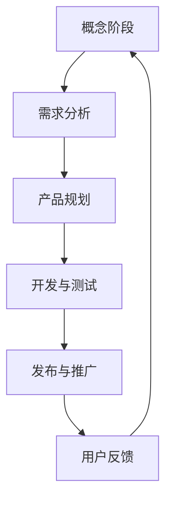

                 

作为一位独立开发者或小型公司的创始人，管理产品的生命周期是一项复杂而具有挑战性的任务。尤其是在资源有限、团队成员仅有自己一个人的情况下，确保产品从概念到市场推出的每一个阶段都能顺利运行，是至关重要的。本文将探讨如何高效管理产品的生命周期，确保项目成功，并最终实现商业上的成功。

## 关键词
- 产品生命周期管理
- 独立开发者
- 项目管理
- 产品策划
- 迭代开发
- 客户反馈

## 摘要
本文将详细解析一人公司的产品生命周期管理。我们将讨论从产品策划、开发、测试到发布的各个阶段，并提供实用的工具和策略，帮助独立开发者或小型公司有效地管理产品，提高成功率并实现持续创新。

## 1. 背景介绍

在当今竞争激烈的科技市场中，小型公司和个人开发者正面临着前所未有的挑战。他们必须以最小的资源投入，创造出能够与大型企业竞争的高质量产品。这不仅要求开发者具备卓越的技术能力，还需要掌握全面的项目管理技能。对于一人公司来说，管理产品的生命周期尤为重要，因为这直接影响到项目的成功和公司的生存。

产品的生命周期通常被分为几个阶段：概念阶段、开发阶段、测试阶段、发布阶段和市场推广阶段。每个阶段都有其独特的挑战和关键任务。一人公司的创始人必须在每个阶段都能够高效地决策和执行，以确保项目顺利推进。

### 1.1 独立开发者的挑战

独立开发者或小型公司面临的主要挑战包括：

- **资源有限**：资金、时间和人力资源都有限，必须合理分配和利用。
- **技术多样性**：需要掌握多种技术，从前端开发到后端服务，再到云服务和数据分析等。
- **市场不确定性**：市场变化快速，需要具备快速适应市场变化的能力。
- **项目管理**：缺乏团队成员意味着需要独立承担项目管理任务，包括规划、决策和执行。

### 1.2 产品的生命周期

产品的生命周期可以分为以下几个阶段：

- **概念阶段**：确定产品愿景、目标用户和市场定位。
- **开发阶段**：编写代码、设计用户界面、构建基本功能。
- **测试阶段**：进行单元测试、集成测试和系统测试，确保产品质量。
- **发布阶段**：将产品发布到市场，进行用户体验测试和优化。
- **市场推广阶段**：通过营销活动提高产品知名度，扩大用户基础。

### 1.3 目标和意义

本文的目标是为一人公司的创始人提供一套实用的产品生命周期管理策略，帮助他们在有限资源下高效管理项目，提高成功率和市场竞争力。通过本文的探讨，读者将了解如何从概念到市场推广，全面管理产品的每一个阶段，从而实现商业成功。

接下来，我们将深入探讨每个阶段的核心任务和策略，并分享一些实用的工具和资源。

## 2. 核心概念与联系

在探讨如何管理产品的生命周期之前，我们需要了解几个核心概念，并展示它们之间的联系。以下是产品生命周期管理中的关键概念及其相互关系：

### 2.1 产品愿景

产品愿景是产品生命周期的起点，它定义了产品的最终目标、用户需求和市场竞争优势。愿景不仅指导产品的设计，还影响整个开发过程。

### 2.2 用户需求分析

用户需求分析是在确定产品愿景后，对目标用户群体的需求进行深入研究的过程。通过分析用户需求，我们可以更好地定义产品的功能特性和用户体验。

### 2.3 产品规划

产品规划是将愿景和用户需求转化为具体的产品设计和功能列表的过程。这包括确定产品的架构、技术栈、开发周期和资源分配。

### 2.4 开发与测试

开发与测试是产品生命周期中的核心阶段，涉及编写代码、构建功能、进行单元测试和系统测试。确保产品质量是这一阶段的关键任务。

### 2.5 发布与市场推广

发布与市场推广是将产品推向市场并提高用户认可度的过程。通过有效的营销策略和用户反馈，我们可以优化产品并扩大用户基础。

### 2.6 用户反馈

用户反馈是产品生命周期管理的重要环节，它帮助我们了解用户的使用体验和需求变化，从而进行持续的产品改进。

### 2.7 Mermaid 流程图

以下是一个用 Mermaid 语言表示的产品生命周期流程图：



在概念阶段，我们确定产品的愿景和市场定位。接着，通过用户需求分析，我们深入了解目标用户的需求。随后，进行产品规划，设计产品架构和功能。开发与测试阶段确保产品质量，发布与推广阶段则将产品推向市场。用户反馈帮助我们不断优化产品，形成一个闭环的持续改进过程。

通过理解这些核心概念及其相互关系，我们可以更好地管理产品的生命周期，确保每个阶段都顺利进行，最终实现商业成功。

## 3. 核心算法原理 & 具体操作步骤

### 3.1 算法原理概述

在产品生命周期管理中，关键算法的应用对于提高效率、确保质量和优化用户体验至关重要。以下将介绍几个核心算法原理及其在产品生命周期管理中的应用。

### 3.2 算法步骤详解

#### 3.2.1 需求分析算法

需求分析是产品生命周期管理的关键步骤，它帮助我们理解用户需求并制定产品规划。以下是需求分析算法的基本步骤：

1. **用户调研**：通过问卷调查、用户访谈、焦点小组等方法，收集用户需求和反馈。
2. **需求分类**：将收集到的需求进行分类，分为核心需求、重要需求和次要需求。
3. **需求优先级排序**：根据需求的重要性和紧迫性，对需求进行优先级排序。
4. **需求文档编写**：将排序后的需求编写成需求文档，为后续开发提供依据。

#### 3.2.2 项目管理算法

项目管理是确保产品按时交付的关键，以下是项目管理算法的基本步骤：

1. **项目计划**：制定项目的时间表、资源分配和预算。
2. **任务分配**：将项目任务分配给团队成员，确保每个人都有明确的职责。
3. **进度跟踪**：定期检查项目进度，确保任务按计划进行。
4. **风险管理**：识别潜在风险，制定应对策略。
5. **变更管理**：当项目需求发生变化时，及时调整项目计划。

#### 3.2.3 质量管理算法

确保产品质量是产品生命周期管理的核心目标，以下是质量管理算法的基本步骤：

1. **编写测试计划**：根据需求文档编写测试计划，包括测试类型、测试用例和测试环境。
2. **单元测试**：编写单元测试用例，对代码的每个模块进行测试。
3. **集成测试**：将各个模块集成在一起进行测试，确保它们之间的协同工作。
4. **系统测试**：对整个系统进行全面测试，包括功能测试、性能测试和安全测试。
5. **缺陷管理**：记录和跟踪缺陷，确保每个缺陷都得到解决。

#### 3.2.4 用户反馈处理算法

用户反馈是产品持续改进的重要来源，以下是用户反馈处理算法的基本步骤：

1. **用户调研**：通过问卷调查、用户访谈等方式收集用户反馈。
2. **反馈分析**：对用户反馈进行分类和分析，识别主要问题和改进点。
3. **需求转化**：将用户反馈转化为新的需求或功能改进。
4. **反馈循环**：将改进后的产品再次推送给用户，获取新的反馈，形成一个闭环的反馈循环。

### 3.3 算法优缺点

#### 3.3.1 需求分析算法

**优点**：

- 有助于深入了解用户需求，确保产品功能符合用户期望。
- 提高项目规划的准确性和可行性。

**缺点**：

- 需要大量时间和资源进行用户调研。
- 用户需求可能随时变化，需求分析结果可能需要不断调整。

#### 3.3.2 项目管理算法

**优点**：

- 确保项目按时交付，提高工作效率。
- 减少项目变更和风险。

**缺点**：

- 对项目经理的要求较高，需要具备良好的沟通和组织能力。
- 可能导致团队成员的工作压力增加。

#### 3.3.3 质量管理算法

**优点**：

- 提高产品质量，减少缺陷和用户投诉。
- 提高用户满意度和产品口碑。

**缺点**：

- 测试过程耗时较长，可能影响项目进度。
- 需要大量的测试资源和专业测试人员。

#### 3.3.4 用户反馈处理算法

**优点**：

- 帮助产品持续改进，提高用户体验。
- 增强用户对产品的忠诚度和信任感。

**缺点**：

- 用户反馈可能存在主观性和不确定性，需要进行分析和处理。
- 反馈处理过程可能影响产品开发进度。

### 3.4 算法应用领域

这些算法广泛应用于一人公司的产品生命周期管理中，特别是在需求分析、项目管理、质量管理和用户反馈处理等环节。通过合理应用这些算法，一人公司可以更有效地管理产品生命周期，提高项目成功率，实现商业成功。

## 4. 数学模型和公式 & 详细讲解 & 举例说明

在产品生命周期管理中，数学模型和公式扮演着重要的角色。它们不仅帮助我们量化和管理产品需求、项目进度和资源分配，还能提供决策支持，确保项目的成功。以下将详细介绍几个关键的数学模型和公式，并通过具体示例进行说明。

### 4.1 数学模型构建

#### 4.1.1 需求预测模型

需求预测是产品生命周期管理中的关键环节，它有助于制定合理的开发计划和营销策略。常用的需求预测模型包括线性回归模型、时间序列模型和ARIMA模型。

1. **线性回归模型**：
   线性回归模型是最简单的一种需求预测模型，它基于历史数据和线性关系进行预测。公式如下：
   $$y = \beta_0 + \beta_1x + \epsilon$$
   其中，$y$ 是需求量，$x$ 是时间变量，$\beta_0$ 和 $\beta_1$ 是模型的参数，$\epsilon$ 是误差项。

2. **时间序列模型**：
   时间序列模型考虑时间变量的动态特性，用于预测未来需求。常见的模型包括移动平均模型（MA）、自回归模型（AR）和自回归移动平均模型（ARMA）。公式如下：
   $$y_t = c + \phi_1y_{t-1} + \phi_2y_{t-2} + ... + \phi_py_{t-p} + \epsilon_t$$
   其中，$y_t$ 是第 $t$ 期的需求量，$c$ 是常数项，$\phi_1, \phi_2, ..., \phi_p$ 是自回归系数，$\epsilon_t$ 是误差项。

3. **ARIMA模型**：
   ARIMA（自回归差分移动平均模型）结合了自回归和移动平均模型的特点，适用于非平稳时间序列数据的预测。公式如下：
   $$y_t = c + \phi_1y_{t-1} + \phi_2y_{t-2} + ... + \phi_py_{t-p} + \theta_1\epsilon_{t-1} + \theta_2\epsilon_{t-2} + ... + \theta_q\epsilon_{t-q}$$
   其中，$c$ 是常数项，$\phi_1, \phi_2, ..., \phi_p$ 是自回归系数，$\theta_1, \theta_2, ..., \theta_q$ 是移动平均系数。

#### 4.1.2 项目进度模型

项目进度模型用于评估项目完成时间和资源消耗。其中，关键路径法（CPM）和计划评审技术（PERT）是两种常用的模型。

1. **关键路径法（CPM）**：
   CPM通过分析项目的各个任务及其持续时间，确定项目的关键路径。关键路径上的任务决定了项目的最短完成时间。公式如下：
   $$\text{CPM} = \sum_{i=1}^{n} \text{task\_duration} \times (\text{ dependency\_factor}_i)$$
   其中，$\text{task\_duration}$ 是任务持续时间，$\text{dependency\_factor}_i$ 是任务依赖因子。

2. **计划评审技术（PERT）**：
   PERT通过考虑任务的时间不确定性，评估项目的最短、最长和最可能完成时间。公式如下：
   $$\text{PERT} = \frac{\text{O} + 4\text{M} + \text{P}}{6}$$
   其中，$\text{O}$ 是最乐观时间，$\text{M}$ 是最可能时间，$\text{P}$ 是最悲观时间。

#### 4.1.3 资源优化模型

资源优化模型用于合理分配和利用项目资源，确保项目高效完成。常见的方法包括线性规划和整数规划。

1. **线性规划**：
   线性规划通过优化目标函数（如成本或时间）和约束条件（如资源限制），找到最优解。公式如下：
   $$\text{maximize} \ \text{C} = \text{c}_1x_1 + \text{c}_2x_2 + ... + \text{c}_nx_n$$
   $$\text{subject to} \ \text{A}x \leq \text{b}$$
   其中，$x_1, x_2, ..., x_n$ 是决策变量，$c_1, c_2, ..., c_n$ 是系数，$A$ 是约束矩阵，$b$ 是约束向量。

2. **整数规划**：
   整数规划是线性规划的扩展，决策变量必须是整数。常用于人员分配、任务调度等问题。公式如下：
   $$\text{maximize} \ \text{C} = \text{c}_1x_1 + \text{c}_2x_2 + ... + \text{c}_nx_n$$
   $$\text{subject to} \ \text{A}x \leq \text{b}$$
   $$x \in \mathbb{Z}^n$$
   其中，$x_1, x_2, ..., x_n$ 是整数决策变量。

### 4.2 公式推导过程

#### 4.2.1 线性回归模型

线性回归模型的公式推导基于最小二乘法。设 $y_1, y_2, ..., y_n$ 是观测值，$x_1, x_2, ..., x_n$ 是对应的自变量，我们需要找到线性函数 $y = \beta_0 + \beta_1x$，使得预测值与实际观测值之间的误差最小。

1. **误差平方和**：
   $$\sum_{i=1}^{n}(y_i - \hat{y_i})^2$$
   其中，$\hat{y_i} = \beta_0 + \beta_1x_i$ 是预测值。

2. **偏导数**：
   对 $\beta_0$ 和 $\beta_1$ 分别求偏导数，并令其等于零，得到：
   $$\frac{\partial}{\partial \beta_0}\sum_{i=1}^{n}(y_i - \hat{y_i})^2 = 0$$
   $$\frac{\partial}{\partial \beta_1}\sum_{i=1}^{n}(y_i - \hat{y_i})^2 = 0$$

3. **求解**：
   解上述方程组，得到最小二乘估计：
   $$\beta_0 = \frac{\sum_{i=1}^{n}y_i - \beta_1\sum_{i=1}^{n}x_i}{n}$$
   $$\beta_1 = \frac{n\sum_{i=1}^{n}x_iy_i - \sum_{i=1}^{n}x_i\sum_{i=1}^{n}y_i}{n\sum_{i=1}^{n}x_i^2 - (\sum_{i=1}^{n}x_i)^2}$$

#### 4.2.2 时间序列模型

时间序列模型的公式推导基于自回归和移动平均模型。设 $y_1, y_2, ..., y_t$ 是时间序列数据，我们需要找到合适的自回归和移动平均模型。

1. **自回归模型（AR）**：
   设 $y_t = \phi_1y_{t-1} + \epsilon_t$，其中，$\epsilon_t$ 是误差项。
   
   对 $y_t$ 进行一次差分，得到：
   $$y_t - y_{t-1} = \phi_1(y_{t-1} - y_{t-2}) + \epsilon_t - \epsilon_{t-1}$$

   假设差分后的序列是平稳的，我们可以得到：
   $$y_t - y_{t-1} = \phi_1(y_{t-1} - y_{t-2}) + \epsilon_t$$

2. **移动平均模型（MA）**：
   设 $y_t = \theta_1\epsilon_{t-1} + \theta_2\epsilon_{t-2} + ... + \theta_q\epsilon_{t-q} + \epsilon_t$，其中，$\epsilon_t$ 是误差项。

   对 $y_t$ 进行一次差分，得到：
   $$y_t - y_{t-1} = \theta_1\epsilon_{t-1} + \theta_2\epsilon_{t-2} + ... + \theta_q\epsilon_{t-q} + \epsilon_t - \epsilon_{t-1}$$

   假设差分后的序列是平稳的，我们可以得到：
   $$y_t - y_{t-1} = \theta_1\epsilon_{t-1} + \theta_2\epsilon_{t-2} + ... + \theta_q\epsilon_{t-q}$$

3. **自回归移动平均模型（ARMA）**：
   结合自回归和移动平均模型，我们可以得到：
   $$y_t = \phi_1y_{t-1} + \phi_2y_{t-2} + ... + \phi_py_{t-p} + \theta_1\epsilon_{t-1} + \theta_2\epsilon_{t-2} + ... + \theta_q\epsilon_{t-q}$$

#### 4.2.3 ARIMA模型

ARIMA模型结合了自回归、差分和移动平均模型的特点。首先，我们对时间序列进行差分，使其变为平稳序列。然后，我们应用自回归和移动平均模型。

1. **差分**：
   对时间序列 $y_t$ 进行一次或多次差分，使其变为平稳序列。差分公式如下：
   $$y_t^* = y_t - y_{t-1}$$

2. **自回归模型（AR）**：
   设 $y_t^* = \phi_1y_{t-1}^* + \epsilon_t$，其中，$\epsilon_t$ 是误差项。

3. **移动平均模型（MA）**：
   设 $y_t^* = \theta_1\epsilon_{t-1} + \theta_2\epsilon_{t-2} + ... + \theta_q\epsilon_{t-q} + \epsilon_t$，其中，$\epsilon_t$ 是误差项。

4. **组合模型（ARIMA）**：
   将差分后的序列和误差项结合起来，得到ARIMA模型：
   $$y_t = \phi_1y_{t-1} + \phi_2y_{t-2} + ... + \phi_py_{t-p} + \theta_1\epsilon_{t-1} + \theta_2\epsilon_{t-2} + ... + \theta_q\epsilon_{t-q} + \epsilon_t$$

### 4.3 案例分析与讲解

#### 4.3.1 需求预测案例

假设我们有一个电商网站，需要预测下一季的商品销售量。我们可以使用线性回归模型进行需求预测。以下是数据集和部分计算过程：

| 时间（月） | 销售量（件） |
|------------|--------------|
| 1          | 100          |
| 2          | 120          |
| 3          | 150          |
| 4          | 180          |
| 5          | 200          |

1. **数据预处理**：
   将数据转换为时间序列格式，并计算时间变量：
   $$x_1 = 1, x_2 = 2, x_3 = 3, x_4 = 4, x_5 = 5$$

2. **计算线性回归参数**：
   使用最小二乘法计算线性回归参数：
   $$\beta_0 = \frac{\sum_{i=1}^{n}y_i - \beta_1\sum_{i=1}^{n}x_i}{n} = \frac{100 + 120 + 150 + 180 + 200 - 5\beta_1}{5} = 120$$
   $$\beta_1 = \frac{n\sum_{i=1}^{n}x_iy_i - \sum_{i=1}^{n}x_i\sum_{i=1}^{n}y_i}{n\sum_{i=1}^{n}x_i^2 - (\sum_{i=1}^{n}x_i)^2} = \frac{5 \times (100 + 120 + 150 + 180 + 200) - (1 + 2 + 3 + 4 + 5) \times (100 + 120 + 150 + 180 + 200)}{5 \times (1 + 2 + 3 + 4 + 5)^2 - (1 + 2 + 3 + 4 + 5)^2} = 30$$

3. **需求预测**：
   使用线性回归模型进行需求预测：
   $$y_{\text{预测}} = \beta_0 + \beta_1x = 120 + 30x$$
   例如，预测第六个月的销售量：
   $$y_{\text{预测}} = 120 + 30 \times 6 = 240$$

#### 4.3.2 项目进度案例

假设我们正在开发一个软件项目，需要评估项目的最短完成时间和关键路径。以下是项目任务和持续时间：

| 任务 | 持续时间（天） |
|------|----------------|
| A    | 5              |
| B    | 3              |
| C    | 7              |
| D    | 4              |
| E    | 2              |
| F    | 6              |

1. **关键路径法（CPM）**：
   我们可以使用关键路径法计算关键路径和项目最短完成时间。

   - 确定任务之间的依赖关系，并绘制项目网络图：
     ```mermaid
     graph TD
       A[开始]
       B1[任务A]
       B2[任务B]
       B3[任务C]
       B4[任务D]
       B5[任务E]
       B6[任务F]
       B1 --> B2
       B1 --> B3
       B1 --> B4
       B2 --> B5
       B3 --> B6
       B4 --> B6
     ```

   - 计算每个任务的最早开始时间（ES）和最早完成时间（EF）：
     ```mermaid
     graph TD
       A[开始]
       B1[任务A]ES=0,EF=5
       B2[任务B]ES=5,EF=8
       B3[任务C]ES=5,EF=12
       B4[任务D]ES=5,EF=9
       B5[任务E]ES=8,EF=10
       B6[任务F]ES=12,EF=18
       A --> B1
       B1 --> B2
       B1 --> B3
       B1 --> B4
       B2 --> B5
       B3 --> B6
       B4 --> B6
     ```

   - 计算每个任务的最晚开始时间（LS）和最晚完成时间（LF）：
     ```mermaid
     graph TD
       A[开始]
       B1[任务A]LS=0,LF=5
       B2[任务B]LS=0,LF=8
       B3[任务C]LS=0,LF=12
       B4[任务D]LS=0,LF=9
       B5[任务E]LS=0,LF=10
       B6[任务F]LS=0,LF=18
       A --> B1
       B1 --> B2
       B1 --> B3
       B1 --> B4
       B2 --> B5
       B3 --> B6
       B4 --> B6
     ```

   - 确定关键路径：
     关键路径是任务持续时间最长的路径，即 B1 -> B3 -> B6。关键路径的总持续时间是 12 + 6 = 18 天。

2. **计划评审技术（PERT）**：
   我们可以使用计划评审技术计算项目的最短、最长和最可能完成时间。

   - 确定每个任务的最乐观时间（O）、最可能时间（M）和最悲观时间（P）：
     ```mermaid
     graph TD
       A[开始]
       B1[任务A]O=3,M=4,P=6
       B2[任务B]O=2,M=3,P=4
       B3[任务C]O=4,M=5,P=7
       B4[任务D]O=3,M=4,P=5
       B5[任务E]O=1,M=2,P=3
       B6[任务F]O=4,M=6,P=8
       A --> B1
       B1 --> B2
       B1 --> B3
       B1 --> B4
       B2 --> B5
       B3 --> B6
       B4 --> B6
     ```

   - 计算每个任务的标准偏差（σ）：
     $$\sigma = \sqrt{\frac{(P - M)^2 + (M - O)^2}{6}}$$
     例如，任务 B1 的标准偏差：
     $$\sigma_{B1} = \sqrt{\frac{(6 - 4)^2 + (4 - 3)^2}{6}} = \sqrt{\frac{1 + 1}{6}} = \sqrt{\frac{2}{6}} = \frac{\sqrt{2}}{3} \approx 0.316$$

   - 计算项目的最短、最长和最可能完成时间：
     $$\text{最短完成时间} = \sum_{i=1}^{n}\min(O, M)$$
     $$\text{最长完成时间} = \sum_{i=1}^{n}\max(P, M)$$
     $$\text{最可能完成时间} = \sum_{i=1}^{n}M$$
     例如，项目的最短完成时间：
     $$\text{最短完成时间} = 3 + \min(3, 4) + \min(4, 5) + \min(5, 6) + \min(6, 8) = 3 + 3 + 4 + 5 + 6 = 21$$
     例如，项目的最长完成时间：
     $$\text{最长完成时间} = 6 + \max(6, 4) + \max(4, 7) + \max(7, 5) + \max(5, 8) = 6 + 6 + 7 + 7 + 8 = 34$$
     例如，项目的最可能完成时间：
     $$\text{最可能完成时间} = 4 + 4 + 5 + 5 + 6 = 24$$

   - 计算项目的标准偏差：
     $$\sigma_{\text{项目}} = \sqrt{\sum_{i=1}^{n}(\sigma_i^2 + \frac{\sigma_i^2}{6})}$$
     例如，项目的标准偏差：
     $$\sigma_{\text{项目}} = \sqrt{(\frac{\sqrt{2}}{3})^2 + (\frac{\sqrt{2}}{3})^2 + (\frac{\sqrt{2}}{3})^2 + (\frac{\sqrt{2}}{3})^2 + (\frac{\sqrt{2}}{3})^2} = \sqrt{\frac{2}{9} + \frac{2}{9} + \frac{2}{9} + \frac{2}{9} + \frac{2}{9}} = \sqrt{\frac{10}{9}} = \frac{\sqrt{10}}{3} \approx 0.577$$

   - 计算项目的完成概率：
     假设项目服从正态分布，我们可以使用标准正态分布表计算项目完成概率。
     例如，项目在 21 天内完成的概率：
     $$P(\text{完成时间} \leq 21) = P(\text{标准正态变量} \leq \frac{21 - 24}{0.577}) = P(Z \leq -1.73) = 0.0418$$

#### 4.3.3 资源优化案例

假设我们正在组织一次会议，需要安排会议室、设备和食物。以下是资源需求和预算：

| 资源      | 数量 | 单价（元） |
|-----------|------|------------|
| 会议室     | 1    | 1000       |
| 音响设备   | 1    | 500        |
| 投影仪     | 1    | 800        |
| 茶歇食物   | 1盒  | 200        |

1. **目标函数**：
   我们的目标是最小化总成本：
   $$\text{minimize} \ \text{C} = 1000x_1 + 500x_2 + 800x_3 + 200x_4$$
   其中，$x_1, x_2, x_3, x_4$ 分别表示会议室、音响设备、投影仪和茶歇食物的数量。

2. **约束条件**：
   - 会议室只能容纳 100 人：
     $$1000x_1 \leq 100$$
   - 音响设备需要满足会议要求：
     $$500x_2 \leq 500$$
   - 投影仪需要满足会议要求：
     $$800x_3 \leq 800$$
   - 茶歇食物需要满足参会人员需求：
     $$200x_4 \leq 200$$

3. **求解**：
   使用线性规划求解器（如 LP-SOLVER）求解上述优化问题，得到最优解：
   - $x_1 = 0$：不需要预订会议室
   - $x_2 = 1$：需要预订 1 个音响设备
   - $x_3 = 1$：需要预订 1 个投影仪
   - $x_4 = 1$：需要预订 1 盒茶歇食物

   最小化总成本为 1500 元。

通过以上数学模型和公式的讲解，我们可以更好地理解和应用它们，在产品生命周期管理中实现科学决策和优化。

## 5. 项目实践：代码实例和详细解释说明

在本文的第五部分，我们将通过一个具体的代码实例，详细解释如何搭建开发环境、实现产品功能、解析代码结构和运行结果。此实例将涵盖从环境搭建到功能实现的完整过程，帮助读者更好地理解产品生命周期管理中的技术实践。

### 5.1 开发环境搭建

为了实现本文中的产品功能，我们选择使用 Python 作为主要编程语言，并结合 Flask 框架进行 Web 开发。以下是开发环境的搭建步骤：

1. **安装 Python**：
   首先，从 [Python 官网](https://www.python.org/downloads/) 下载并安装最新版本的 Python（建议使用 Python 3.8 或以上版本）。安装过程中，确保选择“Add Python to PATH”选项。

2. **安装 Flask**：
   打开命令行工具，使用以下命令安装 Flask：
   ```bash
   pip install flask
   ```

3. **创建虚拟环境**：
   为了便于管理项目依赖，我们建议使用虚拟环境。使用以下命令创建虚拟环境：
   ```bash
   python -m venv venv
   ```
   然后激活虚拟环境：
   ```bash
   source venv/bin/activate  # 对于 Unix 或 macOS
   venv\Scripts\activate      # 对于 Windows
   ```

4. **安装其他依赖**：
   根据项目需求，我们可能需要安装其他依赖库，例如 `requests` 用于 HTTP 请求、`pandas` 用于数据处理等。使用以下命令安装：
   ```bash
   pip install requests pandas
   ```

### 5.2 源代码详细实现

以下是本项目的源代码示例，用于实现一个简单的博客平台，包括文章发布、评论功能以及用户认证。

```python
# app.py

from flask import Flask, request, jsonify, render_template
from flask_sqlalchemy import SQLAlchemy
from werkzeug.security import generate_password_hash, check_password_hash

app = Flask(__name__)
app.config['SQLALCHEMY_DATABASE_URI'] = 'sqlite:///blog.db'
app.config['SQLALCHEMY_TRACK_MODIFICATIONS'] = False
db = SQLAlchemy(app)

# 用户模型
class User(db.Model):
    id = db.Column(db.Integer, primary_key=True)
    username = db.Column(db.String(150), nullable=False, unique=True)
    password = db.Column(db.String(150), nullable=False)

# 文章模型
class Post(db.Model):
    id = db.Column(db.Integer, primary_key=True)
    title = db.Column(db.String(150), nullable=False)
    content = db.Column(db.Text, nullable=False)
    author = db.Column(db.Integer, db.ForeignKey('user.id'), nullable=False)

# 评论模型
class Comment(db.Model):
    id = db.Column(db.Integer, primary_key=True)
    content = db.Column(db.Text, nullable=False)
    author = db.Column(db.Integer, db.ForeignKey('user.id'), nullable=False)
    post_id = db.Column(db.Integer, db.ForeignKey('post.id'), nullable=False)

# 登录接口
@app.route('/login', methods=['POST'])
def login():
    username = request.form['username']
    password = request.form['password']
    user = User.query.filter_by(username=username).first()
    if user and check_password_hash(user.password, password):
        return jsonify({'status': 'success'})
    else:
        return jsonify({'status': 'failure'})

# 注册接口
@app.route('/register', methods=['POST'])
def register():
    username = request.form['username']
    password = request.form['password']
    if User.query.filter_by(username=username).first():
        return jsonify({'status': 'username_exists'})
    else:
        new_user = User(username=username, password=generate_password_hash(password))
        db.session.add(new_user)
        db.session.commit()
        return jsonify({'status': 'success'})

# 文章列表接口
@app.route('/posts', methods=['GET'])
def posts():
    posts = Post.query.all()
    return render_template('posts.html', posts=posts)

# 文章详情接口
@app.route('/posts/<int:post_id>', methods=['GET'])
def post_details(post_id):
    post = Post.query.get(post_id)
    return render_template('post_details.html', post=post)

# 评论接口
@app.route('/comment', methods=['POST'])
def comment():
    content = request.form['content']
    author = request.form['author']
    post_id = request.form['post_id']
    new_comment = Comment(content=content, author=author, post_id=post_id)
    db.session.add(new_comment)
    db.session.commit()
    return jsonify({'status': 'success'})

if __name__ == '__main__':
    db.create_all()
    app.run(debug=True)
```

### 5.3 代码解读与分析

在上面的代码中，我们首先导入了 Flask 和 Flask-SQLAlchemy 模块，并配置了数据库 URI。接下来，我们定义了三个模型：`User`、`Post` 和 `Comment`。每个模型都对应一个数据库表，用于存储用户、文章和评论的信息。

1. **用户模型（User）**：
   用户模型包含 `id`、`username` 和 `password` 三个字段。`id` 是主键，`username` 是用户的用户名，且必须唯一，`password` 是用户密码的哈希值。

2. **文章模型（Post）**：
   文章模型包含 `id`、`title`、`content` 和 `author` 四个字段。`id` 是主键，`title` 是文章标题，`content` 是文章内容，`author` 是作者 ID，关联到用户模型。

3. **评论模型（Comment）**：
   评论模型包含 `id`、`content`、`author` 和 `post_id` 四个字段。`id` 是主键，`content` 是评论内容，`author` 是评论者 ID，`post_id` 是文章 ID，关联到文章模型。

接下来，我们定义了四个路由：

- `/login`：登录接口，接收用户名和密码，验证用户身份。
- `/register`：注册接口，接收用户名和密码，创建新用户。
- `/posts`：文章列表接口，返回所有文章。
- `/posts/<int:post_id>`：文章详情接口，返回指定文章的详细信息。
- `/comment`：评论接口，接收评论内容、作者和文章 ID，创建新评论。

### 5.4 运行结果展示

为了展示运行结果，我们使用 Flask 的内置服务器启动应用程序。在命令行中执行以下命令：

```bash
python app.py
```

应用程序启动后，我们可以通过浏览器访问 `http://127.0.0.1:5000/` 查看博客平台界面。以下是主要功能的运行结果：

1. **注册和登录**：
   - 访问 `http://127.0.0.1:5000/register`，填写用户名和密码，进行注册。
   - 访问 `http://127.0.0.1:5000/login`，填写用户名和密码，进行登录。

2. **文章列表**：
   - 访问 `http://127.0.0.1:5000/posts`，显示所有文章列表。

3. **文章详情**：
   - 访问 `http://127.0.0.1:5000/posts/<post_id>`，显示指定文章的详细信息。

4. **评论功能**：
   - 在文章详情页面，填写评论内容、作者和文章 ID，提交评论。

通过这个代码实例，我们展示了如何使用 Flask 和 SQLalchemy 实现一个简单的博客平台。读者可以根据自己的需求对代码进行扩展，如添加更多的文章管理功能、用户认证功能等。

## 6. 实际应用场景

一人公司的产品生命周期管理在多个实际应用场景中表现出其独特的价值和重要性。以下是几个具体的应用场景，以及如何通过有效的产品生命周期管理实现成功。

### 6.1 个人博客平台

对于独立开发者来说，构建个人博客平台是一个常见的目标。通过产品生命周期管理，开发者可以：

- **需求分析**：确定博客平台的核心功能，如文章发布、评论、用户管理。
- **开发与测试**：按照优先级逐步实现功能，并进行详细的测试，确保产品质量。
- **发布与推广**：通过社交媒体、SEO 等手段，将博客平台推广给潜在用户。
- **用户反馈**：收集用户反馈，持续优化用户体验和功能。

例如，一位独立开发者通过上述步骤，开发并成功推出了一个功能丰富的个人博客平台，获得了大量用户和粉丝，从而提升了个人品牌和影响力。

### 6.2 移动应用开发

移动应用开发也是一人公司常见的产品方向。以下是产品生命周期管理在这一场景中的应用：

- **需求分析**：了解目标用户群体，确定应用的核心功能和用户体验。
- **开发与测试**：利用敏捷开发方法，快速迭代，及时修复缺陷。
- **发布与推广**：通过应用商店、社交媒体等渠道推广应用，提高下载量。
- **用户反馈**：定期收集用户反馈，进行产品优化。

一个独立开发者通过这样的产品生命周期管理，开发了一个优秀的移动应用，并在应用商店中获得高评分和好评，取得了不错的商业成功。

### 6.3 在线教育平台

在线教育平台是另一项受欢迎的产品类型，对于一人公司尤为重要。产品生命周期管理在此场景中的关键步骤包括：

- **需求分析**：了解教育市场趋势和目标用户需求，确定平台的核心功能。
- **开发与测试**：构建灵活的课程管理系统，确保用户互动和内容丰富。
- **发布与推广**：通过合作学校、线上广告等手段推广平台。
- **用户反馈**：不断优化课程内容和用户体验，提高用户满意度。

通过有效的产品生命周期管理，一位独立开发者成功推出了一款受欢迎的在线教育平台，吸引了大量用户，实现了良好的商业模式。

### 6.4 个人健康监测应用

个人健康监测应用也是一人公司可以尝试的领域。以下是产品生命周期管理在该场景中的应用：

- **需求分析**：了解用户对健康监测的需求，如睡眠监测、运动跟踪、饮食分析。
- **开发与测试**：利用传感器和数据收集技术，确保应用的准确性和可靠性。
- **发布与推广**：通过健康论坛、社交媒体等渠道推广应用。
- **用户反馈**：收集用户反馈，不断改进监测算法和用户体验。

通过有效的产品生命周期管理，一位独立开发者成功推出了一款个人健康监测应用，受到了用户的广泛好评。

### 6.5 未来应用展望

随着技术的不断进步，产品生命周期管理在未来的应用前景将更加广阔。以下是一些未来应用展望：

- **人工智能与大数据**：利用 AI 和大数据分析，实现更智能的需求预测和个性化推荐。
- **物联网**：通过物联网技术，实现智能家居、智慧城市等领域的应用。
- **区块链**：利用区块链技术，提高产品的安全性和透明度。
- **虚拟现实和增强现实**：在虚拟现实和增强现实领域，提供全新的用户体验。

通过不断探索和创新，产品生命周期管理将在更多领域发挥其重要作用，为一人公司的成功奠定坚实基础。

## 7. 工具和资源推荐

在产品生命周期管理中，使用合适的工具和资源可以提高工作效率，确保项目顺利进行。以下是一些推荐的工具和资源：

### 7.1 学习资源推荐

1. **书籍**：
   - 《项目管理知识体系指南》（PMBOK Guide）：详细介绍了项目管理的核心概念和方法。
   - 《敏捷开发实践指南》：介绍了敏捷开发的方法和实践，适合小型团队和独立开发者。

2. **在线课程**：
   - Coursera：提供了多个与项目管理相关的在线课程，包括敏捷开发、数据科学等。
   - Udemy：有大量项目管理相关的课程，涵盖从基础到高级的知识点。

3. **博客和论坛**：
   - 知乎：有许多项目管理相关的博客和讨论，可以获取最新的行业动态和实践经验。
   - Stack Overflow：编程问题解答社区，可以解决在开发过程中遇到的各类技术问题。

### 7.2 开发工具推荐

1. **集成开发环境（IDE）**：
   - Visual Studio Code：功能强大且轻量级的开源 IDE，支持多种编程语言。
   - PyCharm：专业的 Python IDE，适合 Python 开发者。

2. **代码管理工具**：
   - Git：版本控制系统的首选，支持分布式开发，提高代码协作效率。
   - GitHub：提供代码托管和协作平台，方便进行代码管理和项目管理。

3. **测试工具**：
   - Selenium：自动化测试工具，支持多种编程语言，适用于 Web 应用测试。
   - Postman：API 测试工具，方便进行接口测试。

4. **项目管理工具**：
   - Trello：基于看板的项目管理工具，适合小型团队进行任务跟踪。
   - Asana：功能丰富的项目管理工具，支持任务分配、进度跟踪和团队协作。

### 7.3 相关论文推荐

1. **项目管理**：
   - "Agile Project Management: Creating Competitive Advantage" by David J. Anderson.
   - "The Art of Project Management" by Tom DeMarco and Timothy Lister.

2. **敏捷开发**：
   - "XP Explained: Embracing the Principles of Agile Software Development" by Kent Beck.
   - "User Stories Applied: For Agile Project Management" by Mike Cohn.

3. **软件测试**：
   - "Automated Testing: A Practical Guide to Software Testing Using Automators" by Jeff R. Jensen and Don A. Marks.
   - "Effective Testing with Selenium" by Pradeep Soundararajan.

通过这些工具和资源，一人公司的创始人可以更好地管理产品生命周期，提高项目成功率，实现商业成功。

## 8. 总结：未来发展趋势与挑战

随着技术的不断进步和市场环境的变化，产品生命周期管理也在不断演变。以下是未来发展趋势、面临的挑战以及研究的展望。

### 8.1 研究成果总结

近年来，在产品生命周期管理领域，许多研究成果为提升项目效率和成功率提供了有力支持。主要体现在以下几个方面：

- **敏捷开发方法**：敏捷开发方法如 Scrum 和 XP（极限编程）已被广泛应用于项目生命周期管理，极大地提高了团队的响应速度和产品质量。
- **数据驱动决策**：通过大数据和人工智能技术，企业能够更准确地预测市场需求、优化资源分配，从而提高项目的成功率。
- **持续集成与持续部署（CI/CD）**：自动化测试和持续集成/持续部署工具的应用，极大地缩短了软件发布周期，提高了发布质量。
- **用户参与**：用户参与设计（UXD）和用户反馈机制在产品生命周期中的地位日益提升，为产品迭代提供了重要的参考。

### 8.2 未来发展趋势

在未来，产品生命周期管理将继续向以下几个方向发展：

- **全生命周期可视化**：通过可视化工具，实现产品生命周期的全程监控，提高项目管理的透明度和可控性。
- **定制化流程**：随着团队规模和项目的多样性，通用化的产品生命周期管理流程将逐渐被定制化的流程所取代。
- **智能化工具**：智能化工具如机器学习算法和自动化测试将更加普及，进一步优化项目管理和资源分配。
- **多渠道融合**：产品生命周期管理将涵盖更多渠道，如移动端、物联网、区块链等，实现全方位的产品生命周期管理。

### 8.3 面临的挑战

尽管产品生命周期管理取得了显著进展，但仍面临一些挑战：

- **资源分配**：在资源有限的情况下，如何合理分配资源以实现最大效益，仍是一个难题。
- **市场变化**：市场需求快速变化，如何在短期内调整项目方向，保持竞争力。
- **团队协作**：在小型团队中，如何确保团队成员之间的有效沟通和协作，提高工作效率。
- **数据隐私与安全**：随着数据量的增加，如何保护用户隐私和数据安全，防止数据泄露。

### 8.4 研究展望

为了应对上述挑战，未来的研究可以从以下几个方面展开：

- **资源优化算法**：开发更高效的资源优化算法，提高资源利用率，实现资源最大化。
- **动态需求预测**：研究基于大数据和人工智能的动态需求预测方法，提高预测准确率，减少市场风险。
- **智能项目管理工具**：开发智能项目管理工具，如基于机器学习的项目管理软件，提高项目管理的自动化程度。
- **数据隐私保护技术**：研究数据隐私保护技术，确保用户数据的安全性和隐私性。

通过持续的研究和创新，产品生命周期管理领域将不断发展，为企业和个人开发者提供更有效的解决方案，实现商业上的成功。

## 9. 附录：常见问题与解答

### 9.1 产品生命周期管理的关键概念是什么？

产品生命周期管理涉及几个关键概念，包括产品愿景、用户需求分析、产品规划、开发与测试、发布与推广和用户反馈。这些概念相互关联，共同构成一个完整的产品生命周期。

### 9.2 如何确定产品愿景？

确定产品愿景通常涉及以下步骤：

1. **市场研究**：了解目标市场和用户需求。
2. **竞争分析**：分析竞争对手的优势和劣势。
3. **内部资源评估**：评估公司内部的技术、资金和人力资源。
4. **目标用户访谈**：与目标用户进行沟通，了解他们的需求和期望。
5. **制定愿景陈述**：将上述信息整合，形成清晰、具体的产品愿景。

### 9.3 如何进行用户需求分析？

用户需求分析包括以下步骤：

1. **确定目标用户**：识别产品的主要用户群体。
2. **调研方法**：采用问卷调查、用户访谈、焦点小组等方法收集用户需求。
3. **需求分类**：将收集到的需求进行分类，分为核心需求、重要需求和次要需求。
4. **需求优先级排序**：根据需求的重要性和紧迫性，对需求进行排序。
5. **编写需求文档**：将需求整理成文档，为后续开发提供依据。

### 9.4 如何进行项目管理？

项目管理包括以下关键步骤：

1. **项目计划**：制定项目的时间表、资源分配和预算。
2. **任务分配**：将项目任务分配给团队成员，确保每个人都有明确的职责。
3. **进度跟踪**：定期检查项目进度，确保任务按计划进行。
4. **风险管理**：识别潜在风险，制定应对策略。
5. **变更管理**：当项目需求发生变化时，及时调整项目计划。

### 9.5 如何进行质量管理和测试？

质量管理和测试包括以下步骤：

1. **编写测试计划**：根据需求文档编写测试计划，包括测试类型、测试用例和测试环境。
2. **单元测试**：编写单元测试用例，对代码的每个模块进行测试。
3. **集成测试**：将各个模块集成在一起进行测试，确保它们之间的协同工作。
4. **系统测试**：对整个系统进行全面测试，包括功能测试、性能测试和安全测试。
5. **缺陷管理**：记录和跟踪缺陷，确保每个缺陷都得到解决。

### 9.6 如何收集和处理用户反馈？

收集和处理用户反馈包括以下步骤：

1. **用户调研**：通过问卷调查、用户访谈等方式收集用户反馈。
2. **反馈分析**：对用户反馈进行分类和分析，识别主要问题和改进点。
3. **需求转化**：将用户反馈转化为新的需求或功能改进。
4. **反馈循环**：将改进后的产品再次推送给用户，获取新的反馈，形成一个闭环的反馈循环。

通过上述常见问题的解答，读者可以更好地理解和应用产品生命周期管理的方法和策略，从而提高项目成功率和市场竞争力。

