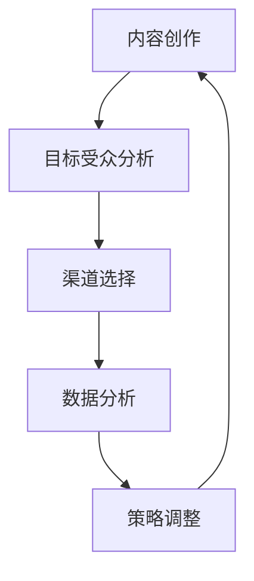

                 

关键词：内容分发，个人品牌，社交媒体，策略，影响力，数据分析，人工智能。

> 摘要：本文将探讨如何通过有效的策略来提升一人公司的内容分发效果，从而扩大其品牌影响力。文章将介绍核心概念、算法原理、数学模型、项目实践以及实际应用场景，并针对未来发展提出展望和挑战。

## 1. 背景介绍

随着互联网和社交媒体的快速发展，内容创作和分发已经成为商业成功的关键因素之一。尤其是在一人公司的环境下，如何通过内容分发策略提升品牌影响力成为至关重要的课题。本文旨在提供一套系统化的策略，帮助个人品牌在竞争激烈的市场中脱颖而出。

### 1.1 内容分发的意义

内容分发是指将创作的内容通过各种渠道传播给目标受众的过程。有效的内容分发不仅能提高内容的曝光率，还能增强用户对品牌的认知和信任。对于一人公司来说，内容分发是塑造个人品牌、扩大影响力的重要手段。

### 1.2 一人公司的挑战

一人公司通常面临资源有限、市场竞争激烈等挑战。因此，如何利用有限的资源进行高效的内容分发，成为了一人公司成功的关键。

## 2. 核心概念与联系

### 2.1 核心概念

- **内容创作**：高质量的内容创作是内容分发的基石。
- **目标受众**：明确的目标受众有助于精准的内容分发。
- **渠道选择**：选择合适的内容分发渠道是提高效果的关键。
- **数据分析**：通过数据分析优化内容分发策略。

### 2.2 架构图



## 3. 核心算法原理 & 具体操作步骤

### 3.1 算法原理概述

内容分发的核心算法可以概括为以下几个步骤：

1. **内容创作**：基于目标受众的需求和兴趣，创作高质量的内容。
2. **渠道选择**：根据内容类型和目标受众特点，选择合适的分发渠道。
3. **数据分析**：对内容分发的效果进行数据分析，调整策略。

### 3.2 算法步骤详解

#### 3.2.1 内容创作

1. **确定内容主题**：根据目标受众的兴趣和需求，确定内容主题。
2. **内容形式**：选择适合主题的内容形式，如图文、视频、音频等。
3. **内容质量**：确保内容具有高质量，包括语言表达、逻辑清晰、信息丰富等。

#### 3.2.2 渠道选择

1. **社交媒体**：根据目标受众的社交媒体使用习惯，选择合适的平台，如微博、抖音、微信公众号等。
2. **搜索引擎**：优化内容，提高在搜索引擎中的排名，吸引更多用户。
3. **其他渠道**：如合作媒体、邮件列表等。

#### 3.2.3 数据分析

1. **点击率（CTR）**：分析内容在不同渠道的点击率，优化内容标题和图片。
2. **转化率**：分析内容对目标受众的转化效果，调整内容和推广策略。
3. **用户反馈**：收集用户对内容的反馈，改进内容创作。

### 3.3 算法优缺点

#### 优点：

- **高效**：通过数据驱动的方式，快速调整内容分发策略。
- **精准**：根据用户行为数据，实现精准的内容推送。

#### 缺点：

- **数据依赖**：过度依赖数据可能导致内容创作的创造性受限。
- **时间成本**：数据分析需要大量的时间和资源。

### 3.4 算法应用领域

内容分发算法广泛应用于个人品牌、企业品牌、自媒体等领域。在个人品牌的建设中，通过内容分发算法，可以快速提升品牌影响力，扩大受众范围。

## 4. 数学模型和公式 & 详细讲解 & 举例说明

### 4.1 数学模型构建

在内容分发中，常用的数学模型包括：

1. **线性回归模型**：用于预测内容点击率。
2. **贝叶斯网络**：用于分析内容与用户兴趣的关系。
3. **PageRank**：用于分析内容的权重和影响力。

### 4.2 公式推导过程

以线性回归模型为例，其公式推导如下：

$$
Y = \beta_0 + \beta_1X_1 + \beta_2X_2 + ... + \beta_nX_n + \epsilon
$$

其中，$Y$ 表示点击率，$X_1, X_2, ..., X_n$ 表示影响点击率的特征，$\beta_0, \beta_1, \beta_2, ..., \beta_n$ 表示系数，$\epsilon$ 表示误差项。

### 4.3 案例分析与讲解

#### 案例背景

一家个人品牌公司，通过社交媒体发布内容，希望提高内容点击率。

#### 数据收集

收集过去一年的内容点击数据，包括内容标题、图片、发布时间等。

#### 数据处理

使用线性回归模型，将内容特征与点击率进行关联分析。

#### 模型训练

使用训练数据，训练线性回归模型，得到系数$\beta_0, \beta_1, \beta_2, ..., \beta_n$。

#### 模型预测

使用训练好的模型，预测新发布内容点击率。

#### 结果分析

通过对比预测点击率与实际点击率，分析模型效果，调整内容策略。

## 5. 项目实践：代码实例和详细解释说明

### 5.1 开发环境搭建

- Python 3.8
- NumPy
- Pandas
- Matplotlib

### 5.2 源代码详细实现

#### 数据收集

```python
import pandas as pd

data = pd.read_csv('content_data.csv')
```

#### 数据处理

```python
X = data[['title', 'image', 'publish_time']]
y = data['click_rate']
```

#### 模型训练

```python
from sklearn.linear_model import LinearRegression

model = LinearRegression()
model.fit(X, y)
```

#### 模型预测

```python
new_content = pd.DataFrame({'title': ['新内容标题'], 'image': ['新内容图片'], 'publish_time': ['新发布时间']})
predicted_click_rate = model.predict(new_content)
print(predicted_click_rate)
```

### 5.3 代码解读与分析

代码首先读取数据，然后处理数据，接着使用线性回归模型进行训练，最后进行预测。通过对比预测点击率与实际点击率，可以优化内容创作策略。

### 5.4 运行结果展示

运行结果展示了新发布内容的预测点击率，为内容创作者提供了参考。

## 6. 实际应用场景

### 6.1 个人品牌

通过内容分发算法，个人品牌可以更有效地传播自己的观点和理念，扩大影响力。

### 6.2 企业品牌

企业可以通过内容分发算法，提高品牌知名度，吸引更多潜在客户。

### 6.3 自媒体

自媒体可以通过内容分发算法，提高内容曝光率，增加粉丝量。

## 7. 工具和资源推荐

### 7.1 学习资源推荐

- 《Python数据分析》（作者：魏gvn）
- 《深度学习》（作者：Ian Goodfellow、Yoshua Bengio、Aaron Courville）

### 7.2 开发工具推荐

- Jupyter Notebook
- PyCharm

### 7.3 相关论文推荐

- “Deep Learning for Content-based Image Retrieval”（作者：K. Simonyan等）
- “Recurrent Neural Networks for Text Classification”（作者：Y. LeCun等）

## 8. 总结：未来发展趋势与挑战

### 8.1 研究成果总结

内容分发算法在个人品牌、企业品牌、自媒体等领域取得了显著成果，为品牌影响力提升提供了有力支持。

### 8.2 未来发展趋势

随着人工智能技术的不断发展，内容分发算法将更加智能化，实现更精准的内容推送。

### 8.3 面临的挑战

- 数据隐私和安全问题
- 算法透明度和公平性问题
- 创造性内容的创作问题

### 8.4 研究展望

未来，内容分发算法将在个性化推荐、智能内容创作等领域取得更多突破。

## 9. 附录：常见问题与解答

### 9.1 什么是内容分发？

内容分发是指将创作的内容通过各种渠道传播给目标受众的过程。

### 9.2 内容分发算法有哪些优点？

内容分发算法具有高效、精准等优点，能够帮助个人品牌和企业品牌更有效地传播信息。

### 9.3 如何优化内容分发策略？

可以通过数据分析、渠道选择、内容创作等方面优化内容分发策略。

## 作者署名

作者：禅与计算机程序设计艺术 / Zen and the Art of Computer Programming
```

