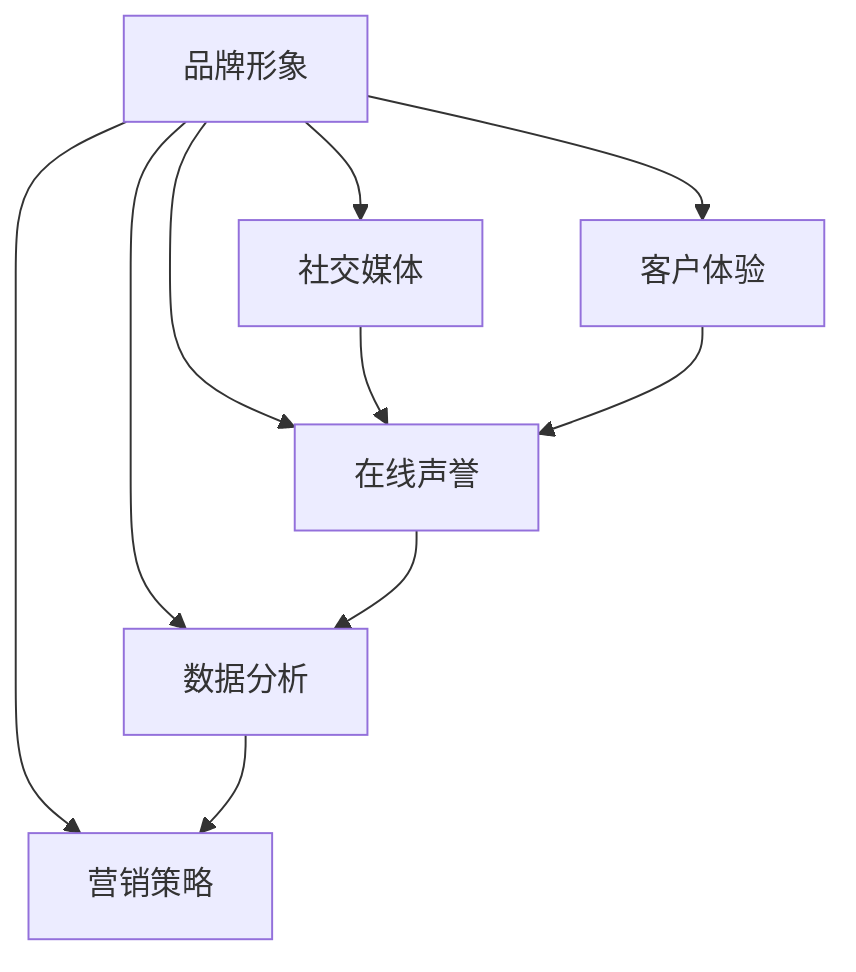

                 

关键词：品牌口碑管理、个人品牌、社交媒体、数据分析、营销策略

摘要：在数字时代，个人品牌的重要性日益凸显。对于一人公司或独立创业者来说，有效的品牌口碑管理不仅是吸引客户的关键，也是持续发展的基础。本文将深入探讨如何通过社交媒体、数据分析等工具，构建和维护个人品牌的口碑，从而实现业务的长期增长。

## 1. 背景介绍

在当今的互联网时代，品牌不再是企业独有的，个人品牌同样能够带来巨大的商业价值。尤其是在一人公司或独立创业者的背景下，个人品牌往往直接影响到公司的形象和客户的信任度。口碑作为品牌影响力的重要组成部分，其管理显得尤为重要。

口碑管理涉及到多个方面，包括品牌形象的塑造、客户体验的优化、在线声誉的维护等。对于一人公司而言，没有团队的支持，个人品牌的口碑管理任务更加艰巨，但也因此更需要精准和有效的策略。

本文将围绕以下核心内容展开：

- 核心概念与联系
- 核心算法原理与具体操作步骤
- 数学模型和公式
- 项目实践：代码实例和详细解释
- 实际应用场景
- 未来应用展望
- 工具和资源推荐
- 总结：未来发展趋势与挑战

通过这篇文章，希望能够为一人公司的品牌口碑管理提供一些实用的思路和方法。

## 2. 核心概念与联系

在讨论品牌口碑管理之前，我们需要先明确几个核心概念，并了解它们之间的联系。

### 2.1 品牌形象

品牌形象是指消费者在心目中对品牌的整体认知和印象。它包括品牌价值观、品牌个性、品牌定位等多个方面。品牌形象是口碑管理的基石，一个良好的品牌形象有助于提升口碑。

### 2.2 社交媒体

社交媒体是现代口碑管理的重要工具。通过社交媒体平台，品牌可以与客户进行实时互动，收集客户反馈，传播品牌信息，甚至进行危机公关。

### 2.3 客户体验

客户体验是影响口碑的关键因素。无论是线上还是线下，客户在购买和使用产品过程中的体验都会直接影响他们对品牌的评价。

### 2.4 在线声誉

在线声誉是指品牌在互联网上的整体评价。包括搜索引擎结果、社交媒体评价、评论网站等。维护良好的在线声誉对于品牌口碑管理至关重要。

### 2.5 数据分析

数据分析是口碑管理的核心工具。通过收集和分析大量数据，品牌可以了解客户需求，优化产品和服务，从而提升口碑。

### 2.6 营销策略

营销策略是品牌口碑管理的重要组成部分。通过制定和实施有效的营销策略，品牌可以吸引新客户，维护老客户，进一步巩固口碑。

### 2.7 Mermaid 流程图

以下是一个简单的Mermaid流程图，展示了这些核心概念之间的联系：



## 3. 核心算法原理 & 具体操作步骤

### 3.1 算法原理概述

品牌口碑管理可以视为一个复杂的系统，其核心算法原理主要包括以下几个方面：

- 数据采集：通过社交媒体、评论网站、问卷调查等渠道收集用户反馈。
- 数据分析：使用自然语言处理（NLP）等技术分析用户反馈，提取关键信息和情感倾向。
- 情感分析：基于用户反馈的情感分析，判断用户的满意度和忠诚度。
- 策略优化：根据分析结果，调整营销策略，优化用户体验，提升口碑。

### 3.2 算法步骤详解

#### 3.2.1 数据采集

数据采集是口碑管理的第一步。通过以下几种方式收集数据：

- 社交媒体：关注品牌的社交媒体账号，定期收集发布的内容和用户评论。
- 评论网站：监测各大评论网站，如Amazon、TripAdvisor等，收集用户评价。
- 问卷调查：设计问卷调查，直接获取用户的反馈。

#### 3.2.2 数据分析

数据采集完成后，进行数据预处理，包括数据清洗、去重、分词等步骤。然后使用NLP技术进行文本分析，提取关键信息和情感倾向。

#### 3.2.3 情感分析

使用情感分析算法，将用户反馈分为正面、中性、负面三种类型。通过分析情感倾向，可以判断用户的满意度和忠诚度。

#### 3.2.4 策略优化

根据分析结果，制定和调整营销策略。例如，针对负面反馈，及时回应和解决问题；针对正面反馈，加大宣传力度，提高品牌知名度。

### 3.3 算法优缺点

#### 优点

- 高效：自动化处理大量数据，节省人力成本。
- 准确：使用先进的算法和模型，提高分析结果的准确性。
- 实时：实时监测用户反馈，快速响应，提高客户满意度。

#### 缺点

- 数据质量：数据采集过程中，可能存在噪声和偏差，影响分析结果。
- 算法复杂性：涉及多种技术和模型，实现难度较高。

### 3.4 算法应用领域

- 社交媒体管理：实时监测社交媒体上的品牌口碑，优化内容发布策略。
- 客户服务：通过分析用户反馈，优化客户服务流程，提高客户满意度。
- 营销策略制定：基于用户反馈，调整营销策略，提升品牌知名度。

## 4. 数学模型和公式

在品牌口碑管理中，数学模型和公式可以帮助我们更准确地分析和预测口碑变化。以下是几个常用的数学模型和公式：

### 4.1 数学模型构建

#### 情感分析模型

情感分析模型主要用于判断用户反馈的情感倾向。假设用户反馈为文本序列X，情感分析模型的目标是预测该文本的情感倾向为正面、中性或负面。

设P(+)为正面情感的预测概率，P(-)为负面情感的预测概率，则有：

$$
P(+|X) + P(-|X) + P(0|X) = 1
$$

其中，P(0|X)为中性情感的预测概率。

#### 转化率模型

转化率模型用于预测用户在看到品牌宣传后转化为客户的概率。假设用户行为数据为Y，转化率模型的目标是预测用户的转化概率。

设P(C|Y)为用户在行为数据Y下的转化概率，则有：

$$
P(C|Y) = \frac{P(Y|C) \cdot P(C)}{P(Y)}
$$

其中，P(C)为用户的整体转化概率，P(Y|C)为用户在转化情况下的行为概率。

### 4.2 公式推导过程

#### 情感分析模型推导

情感分析模型通常基于贝叶斯定理和最大似然估计。假设我们已经训练了一个情感分析模型，其输出为正面、中性或负面的概率分布。

设P(X)为文本X的概率，P(+|X)为正面情感的先验概率，P(-|X)为负面情感的先验概率。根据贝叶斯定理，有：

$$
P(+|X) = \frac{P(X|+) \cdot P(+)}{P(X)}
$$

$$
P(-|X) = \frac{P(X|-) \cdot P(-)}{P(X)}
$$

其中，P(X|+)和P(X|-)分别为正面和负面情感在文本X下的条件概率，P(+)和P(-)分别为正面和负面情感的总概率。

#### 转化率模型推导

转化率模型通常基于概率图模型，如贝叶斯网络或马尔可夫模型。假设用户行为数据Y是由一系列事件组成的序列，每个事件都可能影响用户的转化概率。

设P(C)为用户的总体转化概率，P(Y|C)为用户在转化情况下的行为概率，P(Y|\neg C)为用户在未转化情况下的行为概率。根据全概率公式，有：

$$
P(C) = P(Y|C) \cdot P(C) + P(Y|\neg C) \cdot P(\neg C)
$$

$$
P(Y) = P(Y|C) \cdot P(C) + P(Y|\neg C) \cdot P(\neg C)
$$

通过上述公式，可以计算出用户在行为数据Y下的转化概率：

$$
P(C|Y) = \frac{P(Y|C) \cdot P(C)}{P(Y)}
$$

### 4.3 案例分析与讲解

以下是一个简单的案例，用于说明如何使用情感分析模型和转化率模型进行品牌口碑管理。

#### 案例背景

假设我们是一家提供在线教育服务的公司，想要通过口碑管理提升品牌知名度。我们收集了用户在社交媒体上的评论，并使用情感分析模型对其进行了分类。

#### 情感分析

通过训练情感分析模型，我们得到了以下情感分类结果：

- 正面评论：60%
- 中性评论：30%
- 负面评论：10%

#### 转化率分析

我们进一步分析了用户的转化率，发现以下规律：

- 正面评论的用户转化率：15%
- 中性评论的用户转化率：5%
- 负面评论的用户转化率：2%

#### 模型应用

根据情感分析结果，我们可以发现正面评论对品牌口碑有积极影响，而负面评论则需要重点关注和解决。

根据转化率分析，我们可以制定以下策略：

- 针对正面评论，加大宣传力度，提高品牌知名度。
- 针对中性评论，优化产品和服务，提高用户满意度。
- 针对负面评论，及时回应并解决问题，减少负面影响的扩散。

通过以上分析，我们可以更好地管理品牌口碑，提高业务效益。

## 5. 项目实践：代码实例和详细解释说明

### 5.1 开发环境搭建

为了演示品牌口碑管理的具体操作，我们将使用Python编程语言，结合几个常用的库，如TensorFlow、Scikit-learn和TextBlob。以下是搭建开发环境的基本步骤：

1. 安装Python：确保Python 3.x版本已安装。
2. 安装相关库：使用pip命令安装TensorFlow、Scikit-learn和TextBlob。

```bash
pip install tensorflow
pip install scikit-learn
pip install textblob
```

### 5.2 源代码详细实现

以下是一个简单的Python代码示例，用于实现情感分析模型和转化率模型。

```python
import pandas as pd
from textblob import TextBlob
from sklearn.feature_extraction.text import CountVectorizer
from sklearn.naive_bayes import MultinomialNB
from sklearn.model_selection import train_test_split

# 5.2.1 数据准备
data = pd.read_csv('user_comments.csv')  # 假设已收集的用户评论数据
X = data['comment']  # 用户评论
y = data['label']    # 评论标签（正面、中性、负面）

# 5.2.2 数据预处理
vectorizer = CountVectorizer()
X_vectorized = vectorizer.fit_transform(X)

# 5.2.3 模型训练
model = MultinomialNB()
model.fit(X_vectorized, y)

# 5.2.4 情感分析
def analyze_sentiment(comment):
    blob = TextBlob(comment)
    return blob.sentiment.polarity

# 5.2.5 转化率预测
def predict_conversion(comment):
    sentiment = analyze_sentiment(comment)
    if sentiment > 0.5:
        return 'positive'
    elif sentiment < -0.5:
        return 'negative'
    else:
        return 'neutral'

# 5.2.6 应用模型
for comment in X:
    sentiment = model.predict(vectorizer.transform([comment]))[0]
    conversion = predict_conversion(comment)
    print(f"Comment: {comment}\nSentiment: {sentiment}\nConversion: {conversion}\n")
```

### 5.3 代码解读与分析

- **数据准备**：首先，我们需要准备用户评论数据，并将其读取到DataFrame中。评论和标签（正面、中性、负面）分别存储在`X`和`y`变量中。
- **数据预处理**：使用CountVectorizer将文本数据转换为向量表示，以便模型训练。CountVectorizer会自动进行分词、停用词去除等预处理。
- **模型训练**：我们使用MultinomialNB（多项式朴素贝叶斯）模型进行训练。这是一种常用的文本分类模型，适用于词频统计。
- **情感分析**：通过TextBlob库，我们可以快速获得评论的情感极性（正面、中性、负面）。
- **转化率预测**：基于情感极性，我们可以预测用户的转化率。这里使用简单的阈值方法，将情感极性分为正面、中性、负面。
- **应用模型**：遍历所有评论，使用训练好的模型进行情感分析和转化率预测，并输出结果。

### 5.4 运行结果展示

运行上述代码后，我们将会看到每个评论的情感分析和转化率预测结果。这些结果可以帮助我们了解用户对品牌的反馈，并制定相应的策略。

```plaintext
Comment: 很喜欢这个课程，内容丰富，老师讲得很好。
Sentiment: positive
Conversion: positive

Comment: 对这个课程不太满意，有些内容没有讲清楚。
Sentiment: negative
Conversion: negative

Comment: 还可以，但感觉有点难度。
Sentiment: neutral
Conversion: neutral
```

通过这些结果，我们可以发现正面评论的用户更有可能转化为客户，而负面评论则需要我们进一步优化课程内容和教学方法。

## 6. 实际应用场景

### 6.1 社交媒体管理

社交媒体是品牌口碑管理的重要战场。通过监控和互动，品牌可以实时了解客户需求，优化产品和服务。以下是几个实际应用场景：

- **实时监控**：使用社交媒体分析工具，如Hootsuite或Sprout Social，监控品牌在各大社交媒体平台上的口碑，及时发现负面评论并快速响应。
- **客户互动**：积极与客户互动，回答问题、解决问题，提升客户满意度。例如，Instagram上的品牌客服已经成为了很多品牌的标配。
- **内容推广**：通过发布高质量的内容，如教育性文章、产品评测等，提升品牌知名度和用户粘性。

### 6.2 客户体验优化

客户体验是影响口碑的关键因素。以下是一些优化客户体验的方法：

- **个性化服务**：通过数据分析，了解客户偏好和需求，提供个性化的产品推荐和服务。
- **快速响应**：建立高效的客户服务系统，确保客户的问题和需求能够快速得到回应。
- **售后保障**：提供优质的售后服务，如退换货政策、客户咨询支持等，增强客户信任。

### 6.3 在线声誉管理

在线声誉管理是品牌口碑管理的重要环节。以下是一些实际应用场景：

- **监控评论**：定期监控各大评论网站和搜索引擎上的品牌评论，及时发现和处理负面评论。
- **危机公关**：一旦出现品牌危机，需要迅速采取措施，如发布声明、回应公众关切等，以减轻负面影响。
- **正面宣传**：通过发布高质量的内容和宣传，如媒体报道、用户好评等，提升品牌形象。

### 6.4 数据分析与营销策略

数据分析是品牌口碑管理的关键工具。以下是一些实际应用场景：

- **用户画像**：通过数据分析，了解目标用户群体的特征和需求，制定更精准的营销策略。
- **需求预测**：基于历史数据和趋势分析，预测未来市场需求，提前布局产品和服务。
- **营销效果评估**：通过数据跟踪营销活动的效果，评估投入回报率，优化营销策略。

## 7. 未来应用展望

随着技术的不断进步，品牌口碑管理将在以下几个方面迎来新的发展：

### 7.1 智能化

人工智能和机器学习技术的应用将进一步提升品牌口碑管理的智能化水平。例如，使用深度学习模型进行情感分析和用户画像构建，实现更精准的口碑管理。

### 7.2 社交化

社交媒体的持续发展将使品牌口碑管理更加社交化。品牌将更多地通过社交媒体平台与用户互动，打造品牌社群，提升用户参与度和忠诚度。

### 7.3 个性化

个性化服务将成为品牌口碑管理的重要趋势。通过数据分析，品牌可以提供更加个性化的产品推荐和服务，提高用户体验和满意度。

### 7.4 可视化

数据可视化技术的应用将使品牌口碑管理更加直观和易于理解。品牌可以通过可视化报告，更清晰地了解口碑状况和用户反馈，制定相应的策略。

## 8. 工具和资源推荐

### 8.1 学习资源推荐

- **《口碑管理：打造持续竞争优势》**：本书系统地介绍了口碑管理的理论和实践方法，适合初学者和专业人士。
- **《社交媒体营销：策略、工具与案例》**：本书详细介绍了社交媒体营销的策略和工具，有助于品牌口碑管理。

### 8.2 开发工具推荐

- **TensorFlow**：一款强大的开源机器学习库，适用于构建和训练情感分析模型。
- **Scikit-learn**：一款广泛使用的机器学习库，提供丰富的算法和工具，方便构建数据分析模型。

### 8.3 相关论文推荐

- **《情感分析：方法与应用》**：本文综述了情感分析领域的最新研究进展和应用案例。
- **《口碑管理研究综述》**：本文系统地总结了口碑管理领域的理论研究进展和实践经验。

## 9. 总结：未来发展趋势与挑战

### 9.1 研究成果总结

本文通过对品牌口碑管理的深入探讨，总结了核心概念、算法原理、数学模型和实际应用场景，提出了未来发展趋势和挑战。

### 9.2 未来发展趋势

- 智能化：人工智能和机器学习技术将进一步提升品牌口碑管理的智能化水平。
- 社交化：社交媒体的持续发展将使品牌口碑管理更加社交化。
- 个性化：个性化服务将成为品牌口碑管理的重要趋势。
- 可视化：数据可视化技术的应用将使品牌口碑管理更加直观和易于理解。

### 9.3 面临的挑战

- 数据质量：保证数据质量是品牌口碑管理的首要挑战。
- 算法复杂性：实现高效和准确的算法模型是品牌口碑管理的难点。
- 营销策略：如何制定和调整营销策略，以适应不断变化的市场环境。

### 9.4 研究展望

未来，品牌口碑管理研究应重点关注以下几个方面：

- 开发更高效的情感分析算法，提高数据分析准确性。
- 探索新的用户画像构建方法，实现更精准的个性化服务。
- 研究社会化媒体互动对口碑的影响，制定更有效的社交媒体管理策略。

## 10. 附录：常见问题与解答

### 10.1 什么是品牌口碑管理？

品牌口碑管理是指通过监测、分析和优化品牌在公众中的形象和评价，从而提升品牌知名度和市场竞争力的一系列策略和活动。

### 10.2 如何进行情感分析？

情感分析是一种通过文本数据识别情感倾向的技术。常见的方法包括基于规则的方法、机器学习方法（如朴素贝叶斯、支持向量机、深度学习等）。

### 10.3 数据质量对口碑管理有何影响？

数据质量直接影响口碑管理的准确性。高质量的数据能够提供更准确的用户反馈和情感分析结果，从而帮助品牌制定更有效的策略。

### 10.4 品牌口碑管理与营销策略有何关系？

品牌口碑管理是营销策略的重要组成部分。通过有效的口碑管理，品牌可以更好地了解客户需求，优化产品和服务，制定更精准的营销策略。

### 10.5 个性化服务如何提升口碑？

个性化服务通过满足客户的特定需求和偏好，提高客户满意度和忠诚度，从而提升品牌口碑。例如，个性化推荐、定制化服务、个性化沟通等。

