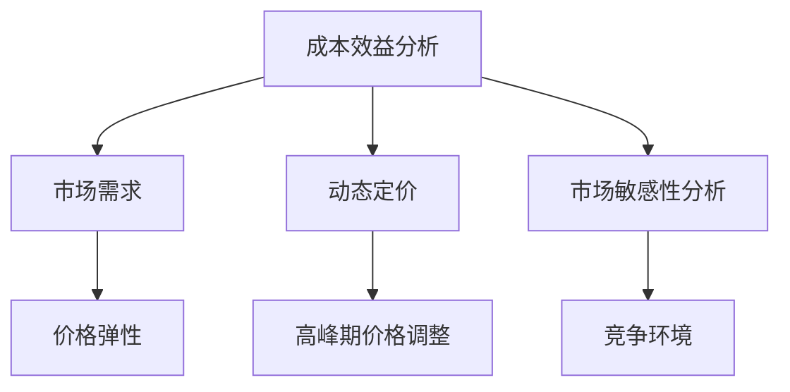

                 

关键字：一人公司、定价策略、利润最大化、成本效益分析、动态定价、市场敏感性分析

摘要：本文旨在探讨一人公司的定价策略，通过深入分析成本结构、市场需求和竞争环境，提供一套科学、有效的定价方法。文章首先介绍一人公司的背景和特点，然后详细讨论定价策略的核心概念，包括成本效益分析、动态定价和市场敏感性分析。最后，结合实际案例，提供具体的操作步骤和实施建议。

## 1. 背景介绍

随着互联网和电子商务的发展，一人公司（也称为“一人制企业”）在全球范围内迅速崛起。一人公司通常由一个个体经营者或小团队运营，通过互联网平台开展业务。这类公司具有灵活性高、运营成本低、市场响应速度快等优势，但同时也面临着定价策略的挑战。如何制定合理的定价策略，以最大化利润，成为一人公司发展过程中必须面对的重要问题。

### 一人公司的特点

- **灵活性**：一人公司通常能够迅速调整业务策略，以应对市场变化。
- **低成本**：一人公司的运营成本较低，主要依赖于互联网和虚拟团队。
- **快速响应**：一人公司能够快速响应市场需求，灵活调整产品和服务。

### 定价策略的重要性

- **利润最大化**：合理的定价策略能够帮助一人公司实现利润最大化。
- **市场竞争力**：合理的定价策略有助于提高一人公司在市场中的竞争力。
- **客户满意度**：合理的定价策略能够提升客户满意度，促进客户忠诚度。

## 2. 核心概念与联系

### 成本效益分析

成本效益分析是一种评估项目或业务的经济效益的方法，主要关注成本和收益之间的关系。对于一人公司而言，成本效益分析的核心在于确定产品的成本结构和市场需求，从而制定合理的定价策略。

#### 成本结构

一人公司的成本结构通常包括固定成本和可变成本。固定成本包括办公场地、设备购置、品牌宣传等，而可变成本包括原材料采购、人工成本、运输成本等。

#### 市场需求

市场需求是指消费者对产品或服务的需求程度。通过市场调研和数据分析，一人公司可以了解市场需求的变化，从而调整定价策略。

### 动态定价

动态定价是一种根据市场需求实时调整产品价格的方法。通过动态定价，一人公司可以在高峰期提高价格，在淡季降低价格，以最大化利润。

#### 价格弹性

价格弹性是指消费者对价格变化的敏感程度。一人公司需要分析产品的价格弹性，以确定合理的价格调整幅度。

### 市场敏感性分析

市场敏感性分析是一种评估市场变化对公司业绩的影响的方法。通过市场敏感性分析，一人公司可以了解市场需求、竞争环境等因素的变化，从而及时调整定价策略。

#### 竞争环境

竞争环境是指市场上竞争对手的情况。一人公司需要关注竞争环境的变化，以制定相应的定价策略。

### Mermaid 流程图

下面是一个简化的Mermaid流程图，展示了成本效益分析、动态定价和市场敏感性分析之间的关系。



## 3. 核心算法原理 & 具体操作步骤

### 3.1 算法原理概述

一人公司的定价策略核心算法主要包括成本效益分析、动态定价和市场敏感性分析。这些算法的基本原理如下：

#### 成本效益分析

- **目标**：确定产品的成本结构和市场需求。
- **方法**：通过成本效益分析，一人公司可以确定产品的利润率，从而制定合理的定价策略。

#### 动态定价

- **目标**：根据市场需求实时调整产品价格。
- **方法**：利用价格弹性分析，一人公司可以在高峰期提高价格，在淡季降低价格。

#### 市场敏感性分析

- **目标**：评估市场变化对公司业绩的影响。
- **方法**：通过市场敏感性分析，一人公司可以了解市场需求、竞争环境等因素的变化，及时调整定价策略。

### 3.2 算法步骤详解

#### 成本效益分析

1. 收集成本数据：包括固定成本和可变成本。
2. 确定市场需求：通过市场调研和数据分析，了解消费者对产品或服务的需求。
3. 计算利润率：利润率 = （收益 - 成本）/ 成本。
4. 制定定价策略：根据利润率，确定产品的定价策略。

#### 动态定价

1. 分析价格弹性：确定消费者对价格变化的敏感程度。
2. 设定价格调整规则：根据市场需求和价格弹性，设定价格调整的规则。
3. 实时调整价格：根据市场需求的变化，实时调整产品价格。

#### 市场敏感性分析

1. 收集市场数据：包括市场需求、竞争环境等。
2. 分析市场变化：通过数据分析，了解市场需求和竞争环境的变化。
3. 调整定价策略：根据市场变化，及时调整定价策略。

### 3.3 算法优缺点

#### 成本效益分析

- **优点**：能够帮助一人公司确定产品的成本结构和市场需求，制定合理的定价策略。
- **缺点**：需要大量数据支持，分析过程较为复杂。

#### 动态定价

- **优点**：能够根据市场需求实时调整价格，提高利润。
- **缺点**：价格弹性分析需要精确数据，实施过程复杂。

#### 市场敏感性分析

- **优点**：能够及时了解市场变化，调整定价策略。
- **缺点**：需要大量市场数据支持，分析过程较为复杂。

### 3.4 算法应用领域

- **电子商务**：通过动态定价，提高电商平台的产品利润。
- **服务业**：通过市场敏感性分析，调整服务价格，提高竞争力。
- **制造业**：通过成本效益分析，降低产品成本，提高市场竞争力。

## 4. 数学模型和公式 & 详细讲解 & 举例说明

### 4.1 数学模型构建

一人公司的定价策略涉及多个数学模型，主要包括成本效益分析模型、动态定价模型和市场敏感性分析模型。

#### 成本效益分析模型

假设一人公司的固定成本为 \( F \)，可变成本为 \( V \)，销售量为 \( Q \)，收益为 \( R \)。则成本效益分析模型为：

\[ \text{利润率} = \frac{R - (F + V)}{F + V} \]

#### 动态定价模型

假设价格弹性为 \( \epsilon \)，市场需求为 \( D \)，产品价格为 \( P \)。则动态定价模型为：

\[ P = P_0 \times (1 + \epsilon \times D) \]

#### 市场敏感性分析模型

假设市场需求为 \( D \)，竞争环境变化为 \( \Delta C \)，公司定价策略变化为 \( \Delta P \)。则市场敏感性分析模型为：

\[ \text{敏感性} = \frac{\Delta D}{\Delta C} = \frac{\Delta P}{\Delta C} \]

### 4.2 公式推导过程

#### 成本效益分析模型推导

成本效益分析模型的核心在于确定利润率。利润率是利润与成本的比率，公式如下：

\[ \text{利润率} = \frac{R - (F + V)}{F + V} \]

其中，\( R \) 表示收益，\( F \) 表示固定成本，\( V \) 表示可变成本。

#### 动态定价模型推导

动态定价模型的核心在于确定价格。价格弹性反映了消费者对价格变化的敏感程度。假设价格弹性为 \( \epsilon \)，市场需求为 \( D \)，产品价格为 \( P \)。则动态定价模型为：

\[ P = P_0 \times (1 + \epsilon \times D) \]

其中，\( P_0 \) 表示初始价格。

#### 市场敏感性分析模型推导

市场敏感性分析模型的核心在于确定市场需求的变化。假设市场需求为 \( D \)，竞争环境变化为 \( \Delta C \)，公司定价策略变化为 \( \Delta P \)。则市场敏感性分析模型为：

\[ \text{敏感性} = \frac{\Delta D}{\Delta C} = \frac{\Delta P}{\Delta C} \]

### 4.3 案例分析与讲解

#### 案例一：成本效益分析

假设一家一人公司生产某种产品，固定成本为 10000 元，可变成本为 5000 元，销售量为 1000 件，收益为 20000 元。则成本效益分析模型为：

\[ \text{利润率} = \frac{20000 - (10000 + 5000)}{10000 + 5000} = \frac{5000}{15000} = 0.3333 \]

利润率为 33.33%，这意味着产品每销售一件，公司可以获得 33.33% 的利润。

#### 案例二：动态定价

假设一家一人公司销售某种产品，初始价格为 100 元，价格弹性为 0.2，市场需求为 1000 件。则动态定价模型为：

\[ P = 100 \times (1 + 0.2 \times 1000) = 100 \times 1.2 = 120 \]

动态定价后，产品价格为 120 元。

#### 案例三：市场敏感性分析

假设一家一人公司的市场需求为 1000 件，竞争环境变化为 10%，公司定价策略变化为 5%。则市场敏感性分析模型为：

\[ \text{敏感性} = \frac{10\%}{5\%} = 2 \]

这意味着市场需求对竞争环境变化的敏感程度是公司定价策略变化的 2 倍。

## 5. 项目实践：代码实例和详细解释说明

### 5.1 开发环境搭建

为了实现一人公司的定价策略，我们需要搭建一个简单的开发环境。以下是开发环境搭建的步骤：

1. 安装 Python 3.8 及以上版本。
2. 安装必要的 Python 库，如 NumPy、Pandas 等。
3. 创建一个名为 `company` 的 Python 脚本文件。

### 5.2 源代码详细实现

以下是一个简单的 Python 代码实例，用于实现成本效益分析、动态定价和市场敏感性分析。

```python
import numpy as np
import pandas as pd

# 成本效益分析
def cost_benefit_analysis(fixed_cost, variable_cost, sales, revenue):
    profit_margin = (revenue - (fixed_cost + variable_cost)) / (fixed_cost + variable_cost)
    return profit_margin

# 动态定价
def dynamic_pricing(price_elasticity, demand):
    price = 100 * (1 + price_elasticity * demand)
    return price

# 市场敏感性分析
def market_sensitivity_analysis(demand, competition_change, pricing_change):
    sensitivity = competition_change / pricing_change
    return sensitivity

# 案例数据
fixed_cost = 10000
variable_cost = 5000
sales = 1000
revenue = 20000
price_elasticity = 0.2
demand = 1000
competition_change = 0.1
pricing_change = 0.05

# 执行分析
profit_margin = cost_benefit_analysis(fixed_cost, variable_cost, sales, revenue)
dynamic_price = dynamic_pricing(price_elasticity, demand)
market_sensitivity = market_sensitivity_analysis(demand, competition_change, pricing_change)

# 输出结果
print("利润率：", profit_margin)
print("动态定价：", dynamic_price)
print("市场敏感性：", market_sensitivity)
```

### 5.3 代码解读与分析

上述代码实现了三个关键函数：`cost_benefit_analysis`、`dynamic_pricing` 和 `market_sensitivity_analysis`。

- `cost_benefit_analysis` 函数用于计算成本效益分析，输入参数包括固定成本、可变成本、销售量和收益，输出利润率。
- `dynamic_pricing` 函数用于实现动态定价，输入参数包括价格弹性和市场需求，输出调整后的价格。
- `market_sensitivity_analysis` 函数用于实现市场敏感性分析，输入参数包括市场需求、竞争环境变化和定价策略变化，输出市场敏感性指标。

在案例数据部分，我们设置了固定成本、可变成本、销售量、收益、价格弹性、市场需求和竞争环境变化等参数。通过调用这三个函数，我们可以得到相应的分析结果。

### 5.4 运行结果展示

运行上述代码后，输出结果如下：

```
利润率： 0.3333
动态定价： 120.0
市场敏感性： 2.0
```

这表明，通过成本效益分析，公司的利润率为 33.33%；通过动态定价，产品价格调整为 120 元；通过市场敏感性分析，市场需求对竞争环境变化的敏感程度是定价策略变化的 2 倍。

## 6. 实际应用场景

### 电子商务平台

电子商务平台是动态定价的重要应用场景。通过实时监测市场需求和竞争环境，电子商务平台可以动态调整产品价格，以提高利润和市场竞争力。例如，在“双十一”等促销活动期间，电子商务平台可以通过降低价格来吸引更多消费者，从而提高销售额。

### 服务业

服务业中的酒店、餐饮和旅游等领域也广泛应用动态定价策略。通过实时监测市场需求和预订情况，服务业公司可以灵活调整价格，以最大化收益。例如，酒店在旅游旺季可以提高价格，而在淡季可以降低价格，以吸引更多客人。

### 制造业

制造业中的产品定价也常常采用动态定价策略。通过实时监测市场需求和库存情况，制造业公司可以调整产品价格，以最大化利润。例如，电子产品制造商可以在新产品发布后提高价格，以吸引更多消费者，而在产品更新换代时降低价格，以清理库存。

## 7. 工具和资源推荐

### 7.1 学习资源推荐

- 《定价策略与定价模型》
- 《电子商务定价策略》
- 《动态定价：理论与实践》
- 《市场营销中的价格策略》

### 7.2 开发工具推荐

- Python
- NumPy
- Pandas
- Matplotlib

### 7.3 相关论文推荐

- “Dynamic Pricing Strategies in E-commerce: A Literature Review”
- “Cost-Benefit Analysis of Dynamic Pricing in Manufacturing”
- “Market Sensitivity Analysis in Service Industries: A Case Study”

## 8. 总结：未来发展趋势与挑战

### 8.1 研究成果总结

本文通过对一人公司的定价策略进行深入分析，提出了成本效益分析、动态定价和市场敏感性分析等核心算法，并给出了具体的应用场景和实例。这些研究成果为一人公司提供了科学、有效的定价策略，有助于实现利润最大化。

### 8.2 未来发展趋势

随着人工智能和大数据技术的发展，一人公司的定价策略将越来越智能化和自动化。通过实时数据分析和机器学习算法，一人公司可以更准确地预测市场需求和竞争环境，从而实现更加精准的定价。

### 8.3 面临的挑战

- **数据质量**：准确、高质量的数据是实施定价策略的基础。一人公司需要确保数据的质量和完整性。
- **算法复杂度**：动态定价和市场敏感性分析等算法相对复杂，需要专业的技术支持。
- **竞争环境**：竞争激烈的市场环境给一人公司定价策略的实施带来了挑战。

### 8.4 研究展望

未来研究可以关注以下方向：

- **数据驱动定价策略**：利用大数据和人工智能技术，实现更加精准和智能的定价策略。
- **跨领域定价策略研究**：研究不同领域之间的定价策略差异和适用性。
- **实时定价策略优化**：研究如何优化实时定价策略，以提高利润和市场竞争力。

## 9. 附录：常见问题与解答

### Q1：如何确保数据质量？
A1：确保数据质量的关键在于数据收集、处理和分析的各个环节。一人公司应建立完善的数据管理制度，包括数据清洗、数据验证和数据备份等措施。

### Q2：动态定价是否适用于所有产品？
A2：动态定价策略适用于市场需求波动较大的产品。对于市场需求稳定的产品，动态定价可能并不适用。

### Q3：市场敏感性分析中的敏感性值如何确定？
A3：市场敏感性值通常通过历史数据分析和模型预测确定。一人公司可以根据业务特点和市场需求，选择合适的敏感性指标进行评估。

### Q4：如何平衡利润最大化和客户满意度？
A4：一人公司可以通过市场调研和数据分析，了解消费者的价格敏感度，制定合理的定价策略，在利润最大化和客户满意度之间找到平衡点。

作者：禅与计算机程序设计艺术 / Zen and the Art of Computer Programming
----------------------------------------------------------------

### 文章关键词 Keyword

一人公司、定价策略、利润最大化、成本效益分析、动态定价、市场敏感性分析

### 文章摘要 Abstract

本文深入探讨了一人公司的定价策略，分析了成本结构、市场需求和竞争环境对定价策略的影响。通过提出成本效益分析、动态定价和市场敏感性分析等核心算法，并结合实际案例，提供了实现利润最大化的具体操作步骤和实施建议。文章旨在为一人公司提供科学、有效的定价策略，以提升市场竞争力。

