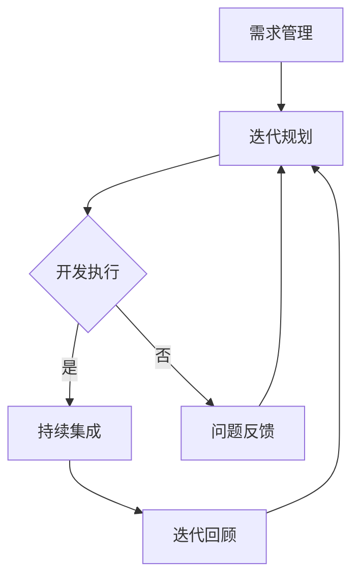

                 

关键词：敏捷开发、独立公司、快速迭代、市场适应、个人开发效率

> 摘要：本文旨在探讨敏捷开发在独立公司中的实践方法，分析其如何通过快速迭代和适应市场变化，提高个人开发效率和公司整体竞争力。本文将深入讨论敏捷开发的核心理念、具体实施步骤、以及在实际项目中的应用，为独立开发者提供实用的指导。

## 1. 背景介绍

在现代信息技术的快速发展下，市场竞争日益激烈，市场需求变化多端。对于独立公司和个人开发者来说，如何高效地适应市场变化，快速响应客户需求，成为亟待解决的问题。敏捷开发作为一种应对快速变化的需求、迭代开发软件的方法论，逐渐受到广泛关注。

敏捷开发起源于20世纪90年代末的软件开发领域，其核心理念是“个体和互动重于过程与工具”、“可工作的软件重于详尽的文档”、“客户合作重于合同谈判”、“响应变化重于遵循计划”。通过采用敏捷开发方法，独立公司和个人开发者可以在不断变化的市场环境中保持竞争力。

## 2. 核心概念与联系

为了更好地理解敏捷开发的实际应用，我们首先需要掌握几个核心概念。

### 2.1 敏捷开发的关键原则

- **需求优先**：敏捷开发强调需求的优先级，通过持续的客户沟通，确保开发方向与客户需求保持一致。
- **迭代开发**：将项目划分为多个小周期（迭代），在每个迭代结束时交付可运行的软件。
- **持续集成**：通过自动化测试和持续集成工具，确保代码的持续稳定。
- **团队协作**：敏捷开发强调团队成员之间的沟通与协作，提高开发效率。

### 2.2 敏捷开发的架构

敏捷开发的架构通常包括以下几个层次：

- **需求管理**：通过客户访谈、用户故事等方法收集和管理需求。
- **迭代规划**：将需求划分为用户故事，为每个迭代分配任务。
- **开发执行**：进行编码、测试和集成。
- **回顾与改进**：在迭代结束时进行回顾，识别问题并改进流程。

### 2.3 Mermaid 流程图

以下是敏捷开发流程的 Mermaid 流程图表示：



## 3. 核心算法原理 & 具体操作步骤

### 3.1 算法原理概述

敏捷开发的核心理法是迭代开发和持续集成。迭代开发通过将项目划分为多个迭代周期，每个迭代周期内完成一部分功能开发，并在迭代结束时交付可运行软件。持续集成通过自动化测试和集成工具，确保每次代码提交都是稳定的。

### 3.2 算法步骤详解

1. **需求管理**：与客户进行沟通，收集和管理需求。
2. **用户故事划分**：将需求划分为用户故事，确定每个迭代周期的任务。
3. **迭代规划**：为每个迭代分配任务，设定迭代目标。
4. **开发执行**：进行编码、测试和集成。
5. **持续集成**：定期运行自动化测试，确保代码的稳定性。
6. **迭代回顾**：总结经验教训，改进开发流程。

### 3.3 算法优缺点

#### 优点

- **快速响应市场需求**：通过迭代开发和持续集成，能够快速响应市场需求。
- **提高开发效率**：团队成员之间的协作和反馈机制，提高了开发效率。
- **质量保障**：通过持续集成和自动化测试，保证了代码质量。

#### 缺点

- **项目管理复杂度增加**：需要不断调整计划和资源分配，增加了项目管理复杂度。
- **团队成员要求高**：敏捷开发要求团队成员具有较高的沟通能力和协作能力。

### 3.4 算法应用领域

敏捷开发适用于各种类型的软件开发项目，特别是需求变化频繁的项目。常见的应用领域包括：

- **Web 应用开发**
- **移动应用开发**
- **定制化软件项目**
- **敏捷IT运维**

## 4. 数学模型和公式 & 详细讲解 & 举例说明

### 4.1 数学模型构建

在敏捷开发中，关键的性能指标包括迭代周期、任务完成率和客户满意度。以下是一个简化的数学模型：

$$
绩效指数 = \frac{迭代周期 \times 任务完成率 \times 客户满意度}{3}
$$

### 4.2 公式推导过程

1. **迭代周期**：定义为完成一个迭代所需的时间，单位为天。
2. **任务完成率**：定义为在给定时间内完成任务的百分比。
3. **客户满意度**：通过客户反馈调查得到，通常以百分制表示。

### 4.3 案例分析与讲解

假设一个敏捷开发团队，每个迭代周期为两周，最近四个迭代的数据如下：

| 迭代周期 | 任务完成率 | 客户满意度 |
| --- | --- | --- |
| 14天 | 90% | 85% |
| 14天 | 95% | 90% |
| 13天 | 92% | 88% |
| 14天 | 93% | 87% |

根据上述数据，计算绩效指数：

$$
绩效指数 = \frac{(14+14+13+14) \times (0.9+0.95+0.92+0.93) \times (0.85+0.90+0.88+0.87)}{3} = 87.7
$$

通过这个案例，我们可以看到绩效指数在逐渐提高，说明团队的敏捷开发实践正在逐步优化。

## 5. 项目实践：代码实例和详细解释说明

### 5.1 开发环境搭建

在本节中，我们将使用 Python 编写一个简单的用户管理系统，演示敏捷开发在实际项目中的应用。

1. 安装 Python 3.8 及以上版本。
2. 安装必要的库，如 Flask、SQLAlchemy 等。

```bash
pip install flask sqlalchemy
```

### 5.2 源代码详细实现

以下是用户管理系统的源代码实现：

```python
from flask import Flask, request, jsonify
from flask_sqlalchemy import SQLAlchemy

app = Flask(__name__)
app.config['SQLALCHEMY_DATABASE_URI'] = 'sqlite:///users.db'
db = SQLAlchemy(app)

class User(db.Model):
    id = db.Column(db.Integer, primary_key=True)
    username = db.Column(db.String(80), unique=True, nullable=False)
    email = db.Column(db.String(120), unique=True, nullable=False)

@app.route('/users', methods=['POST'])
def create_user():
    data = request.get_json()
    username = data['username']
    email = data['email']
    user = User(username=username, email=email)
    db.session.add(user)
    db.session.commit()
    return jsonify({'message': 'User created successfully.'})

@app.route('/users/<int:user_id>', methods=['GET'])
def get_user(user_id):
    user = User.query.get_or_404(user_id)
    return jsonify({'id': user.id, 'username': user.username, 'email': user.email})

if __name__ == '__main__':
    db.create_all()
    app.run(debug=True)
```

### 5.3 代码解读与分析

1. **数据库配置**：使用 SQLAlchemy 连接 SQLite 数据库。
2. **用户模型**：定义了 User 类，包括 id、username 和 email 字段。
3. **创建用户接口**：定义了一个 POST 接口，用于创建新用户。
4. **获取用户接口**：定义了一个 GET 接口，用于获取指定用户的详细信息。

### 5.4 运行结果展示

运行代码后，可以使用 curl 或 Postman 等工具测试接口：

```bash
# 创建用户
curl -X POST -H "Content-Type: application/json" -d '{"username": "testuser", "email": "testuser@example.com"}' http://localhost:5000/users

# 获取用户
curl -X GET http://localhost:5000/users/1
```

## 6. 实际应用场景

### 6.1 敏捷开发在独立公司中的应用

敏捷开发在独立公司中具有广泛的应用，以下是一些实际案例：

- **初创公司**：初创公司通常资源有限，需求变化快。敏捷开发可以帮助初创公司快速响应市场变化，提高产品竞争力。
- **自由职业者**：对于自由职业者来说，敏捷开发可以帮助他们更好地管理项目和客户需求，提高工作效率。

### 6.2 敏捷开发在不同行业中的应用

- **软件行业**：软件行业是敏捷开发的发源地，许多软件开发公司已采用敏捷开发方法。
- **咨询行业**：咨询行业也可以通过敏捷开发方法提高项目交付质量和客户满意度。
- **制造业**：敏捷开发在制造业中的应用也越来越多，特别是在定制化生产领域。

## 7. 工具和资源推荐

### 7.1 学习资源推荐

- **《敏捷软件开发：实践者之路》**：作者：杰拉尔德·摩尔曼
- **《敏捷实践指南》**：作者：布鲁克斯·莱恩
- **敏捷开发博客**：如：Agile Alliance、Scrum Alliance 等

### 7.2 开发工具推荐

- **JIRA**：项目管理工具，支持敏捷开发。
- **Trello**：项目管理工具，适用于敏捷开发。
- **GitLab**：代码管理工具，支持持续集成。

### 7.3 相关论文推荐

- **《敏捷开发方法论研究》**：作者：李明
- **《敏捷开发与持续集成的结合研究》**：作者：张晓红
- **《敏捷开发在软件行业中的应用》**：作者：王文博

## 8. 总结：未来发展趋势与挑战

### 8.1 研究成果总结

敏捷开发作为一种应对快速变化的需求、迭代开发软件的方法论，在独立公司和团队中得到了广泛应用。通过敏捷开发，个人和团队可以更好地适应市场需求，提高开发效率。

### 8.2 未来发展趋势

- **自动化和智能化**：未来敏捷开发将更多地借助自动化和智能化工具，提高开发效率和准确性。
- **跨领域应用**：敏捷开发将在更多领域得到应用，如制造业、咨询行业等。

### 8.3 面临的挑战

- **项目管理复杂度增加**：敏捷开发要求团队成员具备较高的项目管理能力和沟通能力。
- **技术选型难度加大**：随着技术的发展，敏捷开发面临的技术选型难度也在加大。

### 8.4 研究展望

未来，敏捷开发将在以下几个方面进行深入研究：

- **敏捷开发与持续集成的结合**：探讨如何更好地将敏捷开发与持续集成相结合，提高开发效率。
- **敏捷开发的定制化**：针对不同行业和团队的特点，研究敏捷开发的定制化方法。
- **敏捷开发的国际化**：探讨敏捷开发在不同国家和地区的应用和实践。

## 9. 附录：常见问题与解答

### 9.1 什么是敏捷开发？

敏捷开发是一种应对快速变化的需求、迭代开发软件的方法论。它强调个体和互动、可工作的软件、客户合作和响应变化。

### 9.2 敏捷开发与传统的瀑布开发有何区别？

敏捷开发与传统的瀑布开发相比，更加强调灵活性和快速响应需求变化。瀑布开发通常按照固定的流程进行，而敏捷开发则采用迭代和增量的方式。

### 9.3 敏捷开发如何提高开发效率？

敏捷开发通过迭代开发、持续集成和团队协作，提高了开发效率。团队成员之间的沟通和反馈机制，有助于快速识别和解决问题。

### 9.4 敏捷开发是否适用于所有项目？

敏捷开发适用于需求变化频繁的项目，如初创公司、软件行业等。对于需求相对稳定的项目，传统开发方法可能更为适用。

### 9.5 敏捷开发需要哪些工具支持？

敏捷开发需要项目管理工具（如 JIRA、Trello）、代码管理工具（如 GitLab）和持续集成工具（如 Jenkins）等支持。

## 作者署名

作者：禅与计算机程序设计艺术 / Zen and the Art of Computer Programming

通过以上内容的撰写，本文系统地介绍了敏捷开发在独立公司中的实践方法，分析了其如何通过快速迭代和适应市场变化，提高个人开发效率和公司整体竞争力。希望本文能对广大独立开发者提供有价值的指导。

