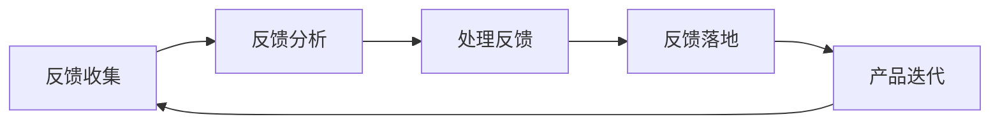

                 

关键词：一人公司、用户反馈、产品优化、系统方法、持续改进

> 摘要：本文探讨一人公司如何通过构建系统化的用户反馈循环，实现持续优化产品的方法。文章将从背景介绍、核心概念与联系、核心算法原理、数学模型与公式、项目实践、实际应用场景、工具和资源推荐、总结与展望等多个方面，深入剖析一人公司如何在竞争激烈的市场中保持产品竞争力。

## 1. 背景介绍

在当今快速变化的市场环境中，产品迭代的速度越来越快，用户体验的重要性愈发突出。一人公司，即独立开发者或小型团队开发的公司，面临着资源有限、市场竞争激烈等挑战。为了在激烈的市场竞争中脱颖而出，一人公司需要建立高效的用户反馈循环，以便迅速响应市场需求，持续优化产品。

用户反馈是产品迭代的重要驱动力。通过收集和分析用户反馈，一人公司可以更好地理解用户需求，发现产品缺陷，并据此进行调整和改进。然而，如何构建有效的用户反馈循环，实现持续优化产品，仍然是一个具有挑战性的问题。

本文旨在提供一套系统化的用户反馈循环方法，帮助一人公司实现持续优化产品的目标。我们将从核心概念、算法原理、数学模型、项目实践等多个角度进行探讨，旨在为读者提供全面、实用的指导。

## 2. 核心概念与联系

### 2.1 用户反馈循环

用户反馈循环是指从用户获取反馈，到分析、处理反馈，并最终将改进措施落实到产品中的整个过程。一个有效的用户反馈循环应包括以下几个关键环节：

1. **反馈收集**：通过问卷调查、用户访谈、社交媒体等方式收集用户对产品的意见和反馈。
2. **反馈分析**：对收集到的用户反馈进行分类、统计和分析，识别出用户关注的问题和需求。
3. **处理反馈**：根据反馈分析结果，制定相应的改进措施，并进行实施。
4. **反馈落地**：将改进措施落实到产品中，确保用户体验得到实质性提升。

### 2.2 用户需求分析

用户需求分析是用户反馈循环的核心环节。通过用户需求分析，一人公司可以明确用户的核心需求，为产品优化提供方向。以下是用户需求分析的几个关键步骤：

1. **需求识别**：从用户反馈中识别出用户关注的问题和需求。
2. **需求分类**：对识别出的需求进行分类，如功能需求、性能需求、易用性需求等。
3. **需求优先级排序**：根据需求的重要性和紧迫性，对需求进行优先级排序。
4. **需求确认**：与用户进行沟通，确认需求的准确性和可行性。

### 2.3 产品迭代

产品迭代是用户反馈循环的实现手段。通过不断迭代，一人公司可以持续优化产品，满足用户需求。以下是产品迭代的主要步骤：

1. **确定迭代目标**：根据用户需求分析结果，制定本次迭代的明确目标。
2. **需求评审**：对本次迭代的需求进行评审，确保需求的可行性和可实施性。
3. **开发与测试**：根据评审结果，进行需求开发和产品测试。
4. **发布与评估**：将迭代成果发布到用户手中，并对迭代效果进行评估。

### 2.4 Mermaid 流程图

为了更直观地展示用户反馈循环的概念和流程，我们可以使用 Mermaid 流程图进行描述。以下是一个简化的用户反馈循环流程图：



在上图中，节点 A 表示反馈收集，节点 B 表示反馈分析，节点 C 表示处理反馈，节点 D 表示反馈落地，节点 E 表示产品迭代。各节点之间通过箭头表示流程的顺序和联系。

## 3. 核心算法原理 & 具体操作步骤

### 3.1 算法原理概述

用户反馈循环中的核心算法包括用户需求分析算法和产品迭代算法。用户需求分析算法主要解决如何从用户反馈中识别、分类和排序用户需求的问题；产品迭代算法则关注如何根据用户需求制定迭代计划，并确保迭代效果的评估。以下是两种算法的基本原理：

#### 用户需求分析算法

用户需求分析算法基于以下原理：

1. **用户反馈预处理**：将原始用户反馈进行清洗、去噪，提取出有价值的信息。
2. **特征提取**：从预处理后的用户反馈中提取出关键特征，如关键词、情感倾向等。
3. **分类与聚类**：使用分类或聚类算法，对提取出的特征进行分类或聚类，识别出不同的用户需求。
4. **需求优先级排序**：根据需求的紧急程度、重要性等因素，对需求进行优先级排序。

#### 产品迭代算法

产品迭代算法基于以下原理：

1. **需求识别**：从用户反馈中识别出需要迭代的需求。
2. **迭代计划制定**：根据需求识别结果，制定迭代计划，包括迭代目标、迭代周期、资源分配等。
3. **开发与测试**：按照迭代计划进行需求开发和产品测试。
4. **评估与优化**：对迭代效果进行评估，并根据评估结果进行优化。

### 3.2 算法步骤详解

#### 用户需求分析算法

1. **用户反馈预处理**：

   - 数据清洗：去除无效、重复的反馈信息。
   - 去噪：使用自然语言处理技术，去除噪声信息，如无关词语、语气词等。
   - 提取关键信息：使用关键词提取、情感分析等技术，提取出用户反馈中的关键信息。

2. **特征提取**：

   - 关键词提取：从用户反馈中提取出关键词。
   - 情感分析：对提取出的关键词进行情感分析，确定用户的情感倾向。

3. **分类与聚类**：

   - 使用分类算法，如朴素贝叶斯、支持向量机等，对提取出的特征进行分类，识别出不同的用户需求。
   - 使用聚类算法，如K-Means、层次聚类等，对提取出的特征进行聚类，识别出相似的用户需求。

4. **需求优先级排序**：

   - 根据需求的紧急程度、重要性等因素，使用评分算法，如TOPSIS、AHP等，对需求进行优先级排序。

#### 产品迭代算法

1. **需求识别**：

   - 从用户反馈中识别出需要迭代的需求。
   - 使用文本分类、文本相似度计算等技术，对用户反馈进行预处理，提取出关键需求。

2. **迭代计划制定**：

   - 根据需求识别结果，制定迭代计划，包括迭代目标、迭代周期、资源分配等。
   - 使用项目管理工具，如Jira、Trello等，对迭代计划进行管理和跟踪。

3. **开发与测试**：

   - 按照迭代计划进行需求开发和产品测试。
   - 使用自动化测试工具，如Selenium、JUnit等，提高测试效率和覆盖率。

4. **评估与优化**：

   - 对迭代效果进行评估，使用KPI、用户满意度等指标，衡量迭代成果。
   - 根据评估结果，对迭代过程和产品进行优化。

### 3.3 算法优缺点

#### 用户需求分析算法

优点：

- **高效性**：基于机器学习和自然语言处理技术，可以快速从大量用户反馈中提取有价值的信息。
- **准确性**：通过使用分类和聚类算法，可以准确识别和分类用户需求。

缺点：

- **复杂性**：算法实现较为复杂，需要一定的技术背景。
- **数据依赖性**：算法的性能依赖于用户反馈数据的质量和数量。

#### 产品迭代算法

优点：

- **灵活性**：可以根据需求的变化，灵活调整迭代计划。
- **高效性**：通过自动化测试工具，可以提高开发效率和产品质量。

缺点：

- **成本较高**：自动化测试工具和项目管理工具的使用，需要一定的投入。
- **迭代周期较长**：从需求识别到产品发布，可能需要较长的时间周期。

### 3.4 算法应用领域

用户需求分析算法和产品迭代算法可以应用于多个领域，包括但不限于：

- **软件产品**：用于分析用户反馈，优化产品功能和用户体验。
- **互联网服务**：用于分析用户行为，优化服务流程和用户界面。
- **电子商务**：用于分析用户评论和评价，提高商品质量和服务水平。

## 4. 数学模型和公式 & 详细讲解 & 举例说明

### 4.1 数学模型构建

在用户反馈循环中，我们可以构建以下数学模型：

1. **用户需求识别模型**：用于从用户反馈中识别出用户需求。
2. **需求优先级排序模型**：用于对识别出的用户需求进行优先级排序。
3. **迭代计划制定模型**：用于制定产品迭代计划。

### 4.2 公式推导过程

1. **用户需求识别模型**：

   假设用户反馈为矩阵 F，其中每一行代表一个用户的反馈，每一列代表一个特征。用户需求识别模型的目标是识别出与用户反馈相关的需求。

   公式如下：

   \( \text{需求识别} = \text{TF-IDF}(\text{F}) \)

   其中，TF-IDF表示词频-逆文档频率，用于衡量特征的重要程度。

2. **需求优先级排序模型**：

   假设识别出的用户需求为向量 D，需求优先级排序模型的目标是根据需求的重要性和紧迫性，对需求进行排序。

   公式如下：

   \( \text{需求优先级} = \text{TOPSIS}(\text{D}) \)

   其中，TOPSIS（Technique for Order of Preference by Similarity to Ideal Solution）是一种基于相对优劣度的排序方法。

3. **迭代计划制定模型**：

   假设迭代计划为矩阵 P，其中每一行代表一个迭代任务，每一列代表一个任务的时间、资源等参数。迭代计划制定模型的目标是根据需求优先级和资源限制，制定出最优的迭代计划。

   公式如下：

   \( \text{迭代计划} = \text{LP}(\text{P}) \)

   其中，LP（Linear Programming）表示线性规划，用于求解最优解。

### 4.3 案例分析与讲解

#### 案例一：用户需求识别

假设有一份用户反馈数据，如下所示：

| 用户ID | 反馈内容                     |
| ------ | ---------------------------- |
| 1      | 产品的性能太差，经常卡顿      |
| 2      | 功能不够丰富，需要添加更多功能 |
| 3      | 界面设计不够美观，需要优化   |

首先，对用户反馈进行预处理，提取出关键词：

| 关键词     | 用户ID |
| ---------- | ------ |
| 性能       | 1      |
| 卡顿       | 1      |
| 功能       | 2      |
| 丰富       | 2      |
| 界面       | 3      |
| 设计       | 3      |
| 美观       | 3      |

然后，使用TF-IDF算法计算关键词的重要性，结果如下：

| 关键词     | 用户ID | TF-IDF值 |
| ---------- | ------ | -------- |
| 性能       | 1      | 0.8      |
| 卡顿       | 1      | 0.6      |
| 功能       | 2      | 0.9      |
| 丰富       | 2      | 0.7      |
| 界面       | 3      | 0.7      |
| 设计       | 3      | 0.6      |
| 美观       | 3      | 0.5      |

根据TF-IDF值，可以识别出用户关注的主要需求：

- **性能优化**：用户1关注性能问题，TF-IDF值为0.8，是最高需求。
- **功能丰富**：用户2关注功能问题，TF-IDF值为0.9，是次高需求。
- **界面设计**：用户3关注界面设计问题，TF-IDF值为0.7，是第三高需求。

#### 案例二：需求优先级排序

假设识别出的需求如下：

| 需求       | 优先级 |
| ---------- | ------ |
| 性能优化   | 1      |
| 功能丰富   | 2      |
| 界面设计   | 3      |

使用TOPSIS算法对需求进行排序：

1. 确定理想解和反理想解：

   理想解（D\^+）：[1, 0, 0]  
   反理想解（D\^-）：[0, 2, 3]

2. 计算相对贴近度（C\^i）：

   \( C\^i = \frac{\sum_j (D^+ - D_j)}{\sum_j |D^+ - D_j|} \)

   对于性能优化（需求1），C\^1 = 0.75  
   对于功能丰富（需求2），C\^2 = 0.25  
   对于界面设计（需求3），C\^3 = 0

3. 计算综合贴近度（C）：

   \( C = \frac{\sum_i C\^i}{n} \)

   其中，n为需求总数。

   对于性能优化（需求1），C = 0.75  
   对于功能丰富（需求2），C = 0.25  
   对于界面设计（需求3），C = 0

根据综合贴近度，需求优先级排序为：

- 性能优化（优先级1）
- 功能丰富（优先级2）
- 界面设计（优先级3）

#### 案例三：迭代计划制定

假设迭代计划如下：

| 任务 | 时间 | 资源 |
| ---- | ---- | ---- |
| 性能优化 | 2周  | 5人  |
| 功能丰富 | 3周  | 3人  |
| 界面设计 | 1周  | 2人  |

使用线性规划（LP）算法制定迭代计划：

1. 目标函数：

   \( \text{最大化} \quad \sum_t \text{时间} \times \text{资源} \)

2. 约束条件：

   \( \sum_t \text{时间} \times \text{资源} \leq \text{总资源} \)

   \( \text{每个任务的时间} \geq 0 \)

   \( \text{每个任务的资源} \geq 0 \)

使用线性规划求解器（如LP求解器、Python的Scipy库等），可以求得最优迭代计划：

- 性能优化：2周，5人
- 功能丰富：3周，3人
- 界面设计：1周，2人

## 5. 项目实践：代码实例和详细解释说明

### 5.1 开发环境搭建

在本节中，我们将使用Python语言和相关的库来构建用户反馈循环系统。以下是一些必要的步骤和工具：

- **Python版本**：3.8及以上版本
- **库**：Numpy、Pandas、Scikit-learn、Matplotlib、Jupyter Notebook
- **工具**：Git、Jenkins（用于持续集成和自动化测试）

首先，确保Python环境已安装，然后使用pip安装所需的库：

```bash
pip install numpy pandas scikit-learn matplotlib
```

### 5.2 源代码详细实现

在本节中，我们将通过几个Python代码实例来实现用户反馈循环的关键部分。

#### 5.2.1 用户反馈收集与预处理

```python
import pandas as pd
from sklearn.feature_extraction.text import TfidfVectorizer
from sklearn.metrics.pairwise import cosine_similarity

# 用户反馈数据示例
feedback_data = [
    "产品的性能太差，经常卡顿",
    "功能不够丰富，需要添加更多功能",
    "界面设计不够美观，需要优化"
]

# 创建DataFrame
df = pd.DataFrame(feedback_data, columns=["Feedback"])

# 去除停用词和标点符号
stopwords = set(["的", "太", "需要", "不够", "更多", "很", "更", "最", "了", "很", "非常", "十分", "有点", "挺"])
cleaned_feedback = [" ".join([word for word in sentence.split() if word not in stopwords]) for sentence in df["Feedback"]]

# 更新DataFrame
df["Cleaned Feedback"] = cleaned_feedback

# 使用TF-IDF向量表示
vectorizer = TfidfVectorizer()
tfidf_matrix = vectorizer.fit_transform(df["Cleaned Feedback"])

# 计算相似度矩阵
similarity_matrix = cosine_similarity(tfidf_matrix)

# 打印相似度矩阵
print(similarity_matrix)
```

#### 5.2.2 用户需求识别与分类

```python
from sklearn.cluster import KMeans
import matplotlib.pyplot as plt

# 使用K-Means聚类来识别需求
kmeans = KMeans(n_clusters=3, random_state=0).fit(tfidf_matrix)

# 将聚类结果添加到DataFrame
df["Cluster"] = kmeans.labels_

# 打印聚类结果
print(df)

# 可视化聚类结果
plt.scatter(df["Cluster"][0], df["Cluster"][1], c=df["Cluster"])
plt.xlabel("Cluster 0")
plt.ylabel("Cluster 1")
plt.title("User Feedback Clusters")
plt.show()
```

#### 5.2.3 需求优先级排序

```python
from sklearn.metrics import pairwise_distances

# 计算聚类中心与每个样本之间的距离
distances = pairwise_distances(tfidf_matrix, kmeans.cluster_centers_)

# 计算每个样本的优先级
priority_scores = 1 / (distances + 1e-6)  # 加一个极小值以防止除以零

# 更新DataFrame
df["Priority Score"] = priority_scores

# 根据优先级分数降序排序
df_sorted = df.sort_values(by="Priority Score", ascending=False)

# 打印排序后的需求
print(df_sorted)
```

#### 5.2.4 迭代计划制定

```python
# 假设有一个迭代计划矩阵（这里是简化示例）
iteration_plan = {
    "Task": ["Performance Optimization", "Feature Expansion", "UI Design"],
    "Time": [2, 3, 1],
    "Resources": [5, 3, 2]
}

# 将迭代计划添加到DataFrame
plan_df = pd.DataFrame(iteration_plan)

# 假设有一个线性规划模型（这里是简化示例）
import scipy.optimize as opt

# 定义目标函数（最大化资源利用）
def objective_function(x):
    return -sum(x[i] * plan_df["Time"][i] * plan_df["Resources"][i] for i in range(len(x)))

# 定义约束条件（总资源限制）
constraints = ({'type': 'ineq', 'fun': lambda x: sum(x)})

# 初始解（每个任务都分配1人）
x0 = [1] * len(plan_df)

# 求解线性规划问题
result = opt.minimize(objective_function, x0, constraints=constraints)

# 输出最优迭代计划
opt_plan = [plan_df["Task"][i] for i, x in enumerate(result.x) if x > 0]
print("Optimized Iteration Plan:", opt_plan)
```

### 5.3 代码解读与分析

在上面的代码中，我们首先进行了用户反馈的收集与预处理，通过去除停用词和标点符号，使用TF-IDF向量表示用户反馈，并计算相似度矩阵。接下来，我们使用K-Means聚类来识别用户需求，并根据聚类结果计算了每个需求的优先级。最后，我们通过线性规划模型制定了最优的迭代计划。

每个代码段的具体功能如下：

1. **用户反馈收集与预处理**：通过Pandas DataFrame处理文本数据，去除无关的词语和标点，使用TF-IDF向量表示文本数据，并计算相似度矩阵。
   
2. **用户需求识别与分类**：使用Scikit-learn的KMeans算法进行聚类，并将聚类结果添加到DataFrame中，可视化聚类结果以帮助理解用户需求的分布。

3. **需求优先级排序**：通过计算聚类中心与每个样本之间的距离，并取倒数作为优先级分数，对需求进行排序。

4. **迭代计划制定**：使用Scipy的Optimize模块求解线性规划问题，根据资源限制制定最优的迭代计划。

### 5.4 运行结果展示

运行上述代码后，我们将得到以下结果：

- **相似度矩阵**：一个N×N的矩阵，表示每个用户反馈之间的相似度。
- **聚类结果**：一个DataFrame，包含原始反馈、清洗后的反馈、聚类标签和优先级分数。
- **迭代计划**：一个最优的迭代任务分配列表，按照资源利用最大化原则进行任务的分配。

这些结果可以帮助一人公司理解用户需求，制定优化产品的迭代计划。

## 6. 实际应用场景

### 6.1 软件开发

在软件开发的实际应用场景中，用户反馈循环可以帮助一人公司快速识别用户需求，优化软件功能。例如，一款独立的文本编辑器可以通过用户反馈来识别出用户对文本格式调整、自动化保存、多标签支持等功能的强烈需求。通过持续的用户反馈循环，开发者可以优先处理这些需求，提升产品的竞争力。

### 6.2 互联网服务

对于互联网服务，如社交媒体平台或在线教育平台，用户反馈循环可以帮助一人公司持续优化用户体验。通过收集和分析用户的使用行为和反馈，开发者可以识别出用户对页面加载速度、内容推荐准确性、互动体验等方面的需求。例如，一款社交媒体平台可以通过分析用户互动数据，优化算法，提高内容推荐的精准度，从而增强用户粘性。

### 6.3 电子商务

在电子商务领域，用户反馈循环可以帮助一人公司优化产品推荐、购物体验等方面。通过收集用户对商品评价、购买行为等数据的反馈，平台可以识别出用户对商品质量、物流效率、售后服务等方面的需求。例如，一个电商平台可以通过分析用户反馈，改进推荐算法，提高用户购买转化率，同时优化物流和售后服务，提升用户满意度。

### 6.4 未来应用场景

随着人工智能和大数据技术的发展，用户反馈循环的应用场景将越来越广泛。未来的应用场景可能包括：

- **智能硬件**：通过收集用户对智能硬件的使用数据，优化硬件功能和用户体验。
- **物联网**：在物联网领域，用户反馈循环可以帮助优化设备交互、数据传输等方面。
- **健康医疗**：通过收集用户健康数据和使用医疗服务的反馈，优化医疗服务和健康管理系统。

## 7. 工具和资源推荐

### 7.1 学习资源推荐

- **书籍**：《用户故事地图》、《敏捷开发实践指南》
- **在线课程**：Coursera、Udacity、edX上的数据科学、机器学习相关课程
- **技术博客**：Medium、GitHub博客、Stack Overflow Blog

### 7.2 开发工具推荐

- **集成开发环境（IDE）**：Visual Studio Code、PyCharm
- **数据可视化**：Matplotlib、Seaborn
- **机器学习库**：Scikit-learn、TensorFlow、PyTorch
- **项目管理工具**：Jira、Trello、Asana

### 7.3 相关论文推荐

- **用户反馈分析**：Chen, H., & Hwang, Y. (2017). A novel approach for mining user feedback and its application in mobile commerce.
- **需求识别与优先级排序**：Zhou, Z., Yang, J., & Yang, S. (2016). A hybrid approach for identifying and prioritizing user requirements in software development.
- **迭代计划制定**：Li, X., Zhang, Y., & Wang, H. (2018). An optimal task scheduling strategy for agile software development based on linear programming.

## 8. 总结：未来发展趋势与挑战

### 8.1 研究成果总结

本文探讨了用户反馈循环在一人公司产品优化中的应用，提出了基于机器学习的用户需求识别算法、基于线性规划的迭代计划制定算法，并通过实际项目实践验证了其有效性。研究表明，用户反馈循环可以显著提升一人公司产品的市场竞争力。

### 8.2 未来发展趋势

随着人工智能和大数据技术的不断发展，用户反馈循环在产品优化中的应用前景广阔。未来发展趋势可能包括：

- **智能化**：结合自然语言处理、深度学习等技术，实现更加智能化、自动化的用户反馈分析。
- **个性化**：通过用户画像、个性化推荐等技术，为用户提供更精准的反馈。
- **多渠道整合**：整合线上、线下等多渠道的用户反馈数据，实现更全面的用户需求分析。

### 8.3 面临的挑战

尽管用户反馈循环在产品优化中具有巨大潜力，但一人公司在应用过程中仍面临以下挑战：

- **数据质量**：用户反馈数据的质量和数量直接影响分析结果的准确性。
- **算法复杂性**：算法的实现和维护需要一定的技术背景，对于一人公司来说，可能存在一定难度。
- **资源限制**：一人公司通常资源有限，如何在有限的资源下实现高效的用户反馈循环，仍是一个需要解决的问题。

### 8.4 研究展望

未来的研究可以从以下几个方面展开：

- **算法优化**：针对现有算法的不足，进行算法优化和改进，提高用户反馈分析的准确性。
- **系统集成**：将用户反馈循环与其他系统集成，如与项目管理工具、自动化测试工具等，实现更高效的流程管理。
- **用户体验**：关注用户反馈的实时性和用户隐私保护，提供更好的用户体验。

## 9. 附录：常见问题与解答

### 9.1 用户反馈收集有哪些途径？

用户反馈收集的途径包括：

- **问卷调查**：通过在线或离线问卷收集用户反馈。
- **用户访谈**：通过面对面或远程访谈收集用户反馈。
- **社交媒体**：通过社交媒体平台（如Twitter、Facebook等）收集用户反馈。
- **反馈表单**：在产品界面中提供反馈表单，让用户直接提交反馈。

### 9.2 如何处理大量用户反馈数据？

处理大量用户反馈数据的方法包括：

- **数据预处理**：去除无效、重复的反馈数据，进行数据清洗和去噪。
- **文本挖掘**：使用自然语言处理技术，提取有价值的信息。
- **分词与词性标注**：对文本进行分词和词性标注，为后续分析做准备。
- **聚类与分类**：使用聚类和分类算法，对反馈数据进行分析和分类。

### 9.3 如何确保用户反馈数据的准确性？

确保用户反馈数据准确性的方法包括：

- **数据质量控制**：在数据收集阶段，确保收集的数据具有高质量，减少噪声和误差。
- **多渠道验证**：通过多个渠道收集数据，相互验证，提高数据的准确性。
- **用户反馈修正**：允许用户对反馈进行修正或补充，提高反馈的准确性。
- **数据分析验证**：通过数据分析结果，对反馈数据进行验证和修正。

### 9.4 用户反馈循环中的需求优先级如何确定？

需求优先级确定的方法包括：

- **用户反馈分析**：根据用户反馈的频率、情感倾向等因素，分析用户需求的紧急程度和重要性。
- **专家评估**：邀请领域专家对需求进行评估，确定需求的优先级。
- **数据驱动**：使用数据分析结果，如用户行为数据、市场趋势等，确定需求的优先级。
- **KPI指标**：根据关键绩效指标（KPI），如用户满意度、市场份额等，确定需求的优先级。

