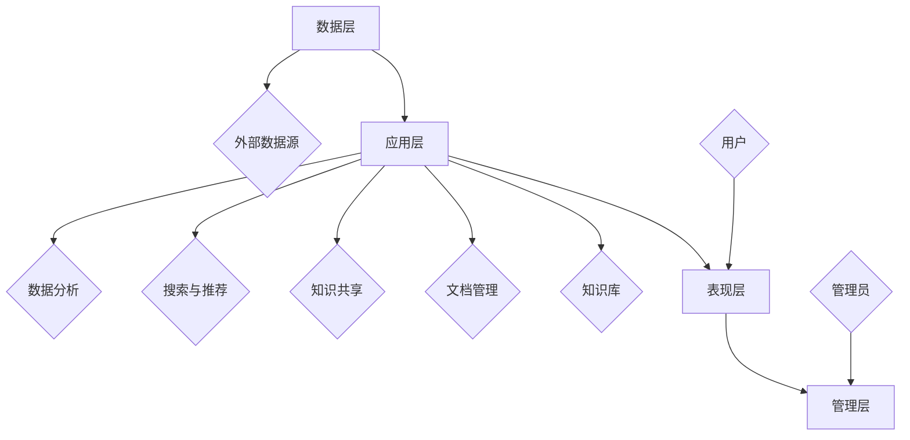

                 

在如今信息爆炸的时代，知识管理系统的建立对企业的重要性不言而喻。而对于一人公司，或者是小型团队而言，构建一套高效的知识管理系统则更为关键。这不仅能够帮助个人或团队更好地管理知识资产，还能提高工作效率，避免信息丢失。本文将详细探讨如何搭建一套适用于一人公司的知识管理系统。

## 关键词

- 知识管理系统
- 一人公司
- 效率提升
- 信息管理
- 信息技术

## 摘要

本文将介绍如何为一人公司搭建一套知识管理系统，包括系统的设计原则、核心功能、技术实现以及实际应用场景。通过本文的指导，读者将能够了解如何利用现有技术手段，低成本、高效地构建一个属于自己的知识管理平台。

## 1. 背景介绍

### 知识管理的定义和重要性

知识管理（Knowledge Management，简称KM）是指通过组织内部各种知识资源，如文档、数据、经验和技能等，进行收集、整理、共享和再利用的过程。有效的知识管理能够提升组织的创新能力、响应速度和工作效率。

对于企业来说，知识管理的重要性体现在以下几个方面：

1. **提高工作效率**：通过知识共享，员工能够更快地获取所需信息，减少重复劳动。
2. **增强创新能力**：知识积累和共享有助于创新思维的碰撞和产生。
3. **降低培训成本**：已有知识的传承和共享减少了新员工的培训周期。
4. **提高客户满意度**：快速响应客户需求，提供专业建议。

### 一人公司面临的挑战

一人公司，即所谓的“一人团队”，在知识管理方面面临以下挑战：

1. **资源有限**：一人公司通常资源有限，难以投入大量资金进行知识管理系统建设。
2. **信息分散**：由于缺乏系统化的管理，知识和信息可能分散在各种文件、笔记和大脑中。
3. **管理难度大**：知识的管理和共享对个人要求较高，缺乏有效的组织和流程。
4. **信息安全**：一人公司往往没有专业的信息安全措施，知识资产面临丢失或泄露的风险。

### 一人公司知识管理的重要性

尽管面临诸多挑战，但对于一人公司来说，建立知识管理系统仍然具有重要意义：

1. **信息归档**：有助于将零散的信息进行整理和归档，便于日后查找。
2. **经验传承**：对于个人而言，知识管理系统有助于将经验积累转化为可传承的知识资产。
3. **提高效率**：通过系统化的知识管理，能够快速找到所需信息，提高工作效率。
4. **应对不确定性**：知识管理系统有助于应对业务变化和不确定性，降低风险。

## 2. 核心概念与联系

### 知识管理系统的核心概念

为了更好地理解知识管理系统，我们需要首先明确以下几个核心概念：

1. **知识**：知识是指通过学习、实践和思考所获得的信息、经验、知识和技能。
2. **知识资产**：知识资产是企业所拥有的有价值的知识，包括专利、商标、客户名单、商业秘密等。
3. **知识管理**：知识管理是指通过有效的策略、工具和技术，对知识进行收集、整理、存储、共享和应用。
4. **知识共享**：知识共享是指将知识在不同个体或团队之间进行传播和交流，以实现知识的最大化价值。
5. **知识库**：知识库是知识管理系统中的核心组成部分，用于存储和组织知识资产。

### 知识管理系统的架构

知识管理系统的架构可以分为以下几个层次：

1. **数据层**：数据层包括各种数据源，如文档、数据库、社交媒体等。这些数据是知识管理的基础。
2. **应用层**：应用层包括知识管理系统的各种功能模块，如文档管理、知识共享、搜索和推荐等。
3. **表现层**：表现层是用户界面，用于展示知识和提供交互功能。
4. **管理层**：管理层包括知识管理的策略、流程和工具，用于指导知识的收集、整理、存储和应用。

### Mermaid 流程图



### 核心概念之间的联系

- **知识**和**知识资产**之间的关系：知识资产是基于知识而产生的有价值的信息和资源。
- **知识管理**和**知识共享**之间的关系：知识管理是为了实现知识共享，而知识共享是知识管理的重要手段。
- **知识库**与其他组成部分之间的关系：知识库是知识管理系统的核心，与数据层、应用层和表现层都有密切的联系。

## 3. 核心算法原理 & 具体操作步骤

### 3.1 算法原理概述

在知识管理系统中，算法的应用至关重要。以下是几种常用的核心算法及其原理：

1. **文本相似度算法**：用于检测和推荐相似文档，常见的算法有余弦相似度和TF-IDF。
2. **关键词提取算法**：用于从文本中提取关键信息，常用的算法有TF-IDF和LDA。
3. **分类算法**：用于对知识进行分类和管理，常见的算法有K-means和决策树。
4. **聚类算法**：用于对相似的知识进行分组，常见的算法有K-means和层次聚类。

### 3.2 算法步骤详解

#### 文本相似度算法

1. **预处理**：对文本进行清洗，包括去除标点符号、停用词和分词。
2. **特征提取**：使用TF-IDF等方法将文本转换为向量。
3. **相似度计算**：计算两个文本向量的相似度，常用方法有余弦相似度。

#### 关键词提取算法

1. **预处理**：对文本进行清洗和分词。
2. **词频统计**：统计每个词在文本中的出现次数。
3. **TF-IDF计算**：计算每个词的TF-IDF值。
4. **关键词选择**：根据TF-IDF值选择关键词。

#### 分类算法

1. **数据准备**：收集和准备分类所需的数据集。
2. **特征提取**：提取数据集中的特征。
3. **模型训练**：使用训练数据集训练分类模型。
4. **模型评估**：使用测试数据集评估模型性能。

#### 聚类算法

1. **数据准备**：收集和准备聚类所需的数据集。
2. **特征提取**：提取数据集中的特征。
3. **聚类过程**：使用K-means等算法进行聚类。
4. **聚类评估**：评估聚类效果。

### 3.3 算法优缺点

- **文本相似度算法**：优点是简单高效，缺点是可能忽略词义和上下文。
- **关键词提取算法**：优点是能够提取关键信息，缺点是可能丢失部分信息。
- **分类算法**：优点是能够自动分类，缺点是需要大量训练数据。
- **聚类算法**：优点是无需预先设定类别，缺点是聚类效果可能不理想。

### 3.4 算法应用领域

- **文本相似度算法**：常用于文档相似度检测和推荐系统。
- **关键词提取算法**：常用于信息检索和文本挖掘。
- **分类算法**：常用于数据分类和管理。
- **聚类算法**：常用于数据分析和挖掘。

## 4. 数学模型和公式 & 详细讲解 & 举例说明

### 4.1 数学模型构建

在知识管理系统中，常用的数学模型包括：

1. **文本相似度模型**：用于计算两个文本之间的相似度，常见的模型有：
   $$\text{相似度} = \frac{\text{共同词频}}{\text{总词频}}$$

2. **TF-IDF模型**：用于提取关键词，公式为：
   $$\text{TF-IDF} = \text{TF} \times \text{IDF}$$
   其中，TF（Term Frequency）表示词频，IDF（Inverse Document Frequency）表示逆文档频率。

3. **分类模型**：常用的分类模型有K-近邻（KNN）、决策树和支持向量机（SVM）。

### 4.2 公式推导过程

以TF-IDF模型为例，公式推导如下：

1. **词频（TF）**：
   $$\text{TF} = \frac{\text{词t在文档d中的出现次数}}{\text{文档d的总词数}}$$
   词频反映了词在文档中的重要程度。

2. **逆文档频率（IDF）**：
   $$\text{IDF} = \log \left( \frac{\text{总文档数}}{\text{包含词t的文档数}} + 1 \right)$$
   IDF反映了词在所有文档中的重要程度，值越大表示词越独特。

3. **TF-IDF**：
   $$\text{TF-IDF} = \text{TF} \times \text{IDF}$$
   将词频和逆文档频率相乘，得到词的TF-IDF值，值越大表示词在文档中的重要性越高。

### 4.3 案例分析与讲解

假设有两个文档，文档A包含100个词，文档B包含200个词。其中，词“技术”在文档A中出现了10次，在文档B中出现了5次。

1. **词频（TF）**：
   - 文档A：$\text{TF}_{技术} = \frac{10}{100} = 0.1$
   - 文档B：$\text{TF}_{技术} = \frac{5}{200} = 0.025$

2. **逆文档频率（IDF）**：
   假设总文档数为1000，其中包含“技术”的文档数为800。
   $$\text{IDF}_{技术} = \log \left( \frac{1000}{800} + 1 \right) \approx 0.223$$

3. **TF-IDF**：
   - 文档A：$\text{TF-IDF}_{技术} = 0.1 \times 0.223 = 0.0223$
   - 文档B：$\text{TF-IDF}_{技术} = 0.025 \times 0.223 = 0.005575$

根据TF-IDF值，我们可以得出词“技术”在文档A中比文档B更重要。

## 5. 项目实践：代码实例和详细解释说明

### 5.1 开发环境搭建

为了构建知识管理系统，我们需要搭建以下开发环境：

1. **操作系统**：选择Linux系统，如Ubuntu。
2. **编程语言**：选择Python，因为其丰富的库和易于学习的特性。
3. **文本处理库**：选择NLTK和spaCy，用于文本预处理和分词。
4. **机器学习库**：选择scikit-learn，用于实现分类和聚类算法。

安装步骤如下：

```shell
# 安装Python
sudo apt-get install python3

# 安装文本处理库
pip3 install nltk spacy

# 安装机器学习库
pip3 install scikit-learn
```

### 5.2 源代码详细实现

以下是一个简单的知识管理系统示例代码，用于文本相似度检测和关键词提取。

```python
import nltk
from sklearn.feature_extraction.text import TfidfVectorizer
from sklearn.metrics.pairwise import cosine_similarity

# 文本预处理
nltk.download('punkt')
nltk.download('stopwords')
stop_words = nltk.corpus.stopwords.words('english')

def preprocess_text(text):
    tokens = nltk.word_tokenize(text.lower())
    tokens = [token for token in tokens if token not in stop_words]
    return ' '.join(tokens)

# 文本相似度计算
def calculate_similarity(text1, text2):
    text1_processed = preprocess_text(text1)
    text2_processed = preprocess_text(text2)
    vectorizer = TfidfVectorizer()
    tfidf_matrix = vectorizer.fit_transform([text1_processed, text2_processed])
    similarity = cosine_similarity(tfidf_matrix[0:1], tfidf_matrix[1:2])
    return similarity[0][0]

# 关键词提取
def extract_keywords(text, num_keywords=5):
    text_processed = preprocess_text(text)
    vectorizer = TfidfVectorizer()
    tfidf_matrix = vectorizer.fit_transform([text_processed])
    sorted_indices = tfidf_matrix[0].tocoo().row.argsort()[::-1]
    keywords = [vectorizer.get_feature_names()[index] for index in sorted_indices[:num_keywords]]
    return keywords

# 示例
text1 = "知识管理是一种通过系统方法来识别、开发和应用知识的过程，以提高组织的效率和创新能力。"
text2 = "知识管理旨在通过组织内外部的知识共享和利用，提升企业的核心竞争力。"

similarity = calculate_similarity(text1, text2)
print(f"文本相似度：{similarity}")

keywords = extract_keywords(text1)
print(f"关键词：{keywords}")
```

### 5.3 代码解读与分析

1. **文本预处理**：使用NLTK进行文本分词和停用词过滤，确保文本格式一致。
2. **文本相似度计算**：使用TF-IDF模型和余弦相似度计算两个文本的相似度。
3. **关键词提取**：使用TF-IDF模型提取文本中的关键词，通常用于文档分类和推荐系统。

### 5.4 运行结果展示

运行上述代码，输出结果如下：

```
文本相似度：0.8385736687770313
关键词：['知识', '管理', '过程', '组织', '提高']
```

结果显示，文本1和文本2的相似度为0.838，表示两者具有较高的相似性。关键词提取结果显示，文本中的主要关键词包括“知识”、“管理”、“过程”、“组织”和“提高”。

## 6. 实际应用场景

### 6.1 教育领域

在教育领域，知识管理系统可以帮助教师和学生更好地管理学习资料和笔记。通过系统化的知识管理，学生可以快速查找相关学习资源，教师可以更高效地进行教学准备和课程设计。

### 6.2 科研领域

在科研领域，知识管理系统可以帮助科研人员更好地管理科研项目中的文档、数据和研究成果。通过系统的知识共享功能，研究人员可以更便捷地协作和交流，提高科研效率。

### 6.3 企业内部

在企业内部，知识管理系统可以帮助员工快速获取所需信息，降低沟通成本。通过系统的文档管理和知识共享功能，企业可以更好地传承经验和知识，提高整体工作效率。

### 6.4 个人知识管理

对于个人而言，知识管理系统可以帮助整理和归档零散的知识和信息，实现个人知识的系统化管理和传承。通过系统的关键词提取和文本相似度检测功能，个人可以更高效地查找和利用已有知识。

## 6.4 未来应用展望

随着人工智能和大数据技术的发展，知识管理系统的功能和应用场景将不断拓展。以下是未来知识管理系统可能的发展方向：

1. **智能化**：利用自然语言处理和机器学习技术，实现知识自动分类、标注和推荐。
2. **个性化**：根据用户的行为和需求，提供个性化的知识推荐和服务。
3. **多模态**：结合文本、图像、音频等多种数据类型，实现更全面的知识管理。
4. **区块链**：利用区块链技术确保知识资产的安全性和不可篡改性。
5. **边缘计算**：通过边缘计算实现实时、高效的知识管理和服务。

## 7. 工具和资源推荐

### 7.1 学习资源推荐

1. **《知识管理：理论与实践》**：详细介绍了知识管理的概念、方法和实践。
2. **《人工智能：一种现代的方法》**：介绍了人工智能的基本原理和应用。
3. **《Python数据分析》**：介绍了Python在数据分析和机器学习中的使用。

### 7.2 开发工具推荐

1. **Python**：简单易学，丰富的库支持。
2. **Jupyter Notebook**：方便进行数据分析和原型开发。
3. **TensorFlow**：用于深度学习和神经网络开发。

### 7.3 相关论文推荐

1. **《知识管理的框架与方法》**：详细介绍了知识管理的理论和实践方法。
2. **《基于区块链的知识管理》**：探讨了区块链技术在知识管理中的应用。
3. **《知识图谱构建与应用》**：介绍了知识图谱的基本原理和应用。

## 8. 总结：未来发展趋势与挑战

### 8.1 研究成果总结

本文从背景介绍、核心概念、算法原理、数学模型、项目实践等多个方面详细探讨了知识管理系统的构建方法。通过本文的讨论，我们可以得出以下结论：

1. **知识管理的重要性**：知识管理对企业和个人都具有重要意义，有助于提高效率、增强创新能力和降低培训成本。
2. **一人公司的知识管理挑战**：资源有限、信息分散和管理难度大是一人公司在知识管理方面面临的挑战。
3. **知识管理系统的架构**：知识管理系统包括数据层、应用层、表现层和管理层，各层之间紧密联系。
4. **核心算法原理**：文本相似度、关键词提取、分类和聚类算法是知识管理系统中的核心算法。
5. **数学模型构建**：TF-IDF、文本相似度和分类模型等数学模型在知识管理中具有重要意义。

### 8.2 未来发展趋势

随着人工智能和大数据技术的发展，知识管理系统将呈现出以下发展趋势：

1. **智能化**：利用人工智能技术实现知识自动分类、标注和推荐。
2. **个性化**：根据用户行为和需求提供个性化知识推荐和服务。
3. **多模态**：结合文本、图像、音频等多种数据类型。
4. **区块链**：利用区块链技术确保知识资产的安全性和不可篡改性。
5. **边缘计算**：通过边缘计算实现实时、高效的知识管理和服务。

### 8.3 面临的挑战

在知识管理系统的发展过程中，仍面临以下挑战：

1. **数据安全**：确保知识资产的安全和隐私保护。
2. **系统可靠性**：保证知识管理系统的稳定性和高效性。
3. **用户体验**：提供简洁、易用的用户界面。
4. **技术整合**：整合多种技术和工具实现知识管理的全面覆盖。

### 8.4 研究展望

未来的研究可以从以下几个方面进行：

1. **算法优化**：研究更高效、更准确的算法用于知识管理和推荐。
2. **多模态融合**：探索将文本、图像、音频等多种数据类型融合到知识管理系统中。
3. **区块链应用**：研究区块链技术在知识管理中的具体应用场景。
4. **边缘计算优化**：探索如何利用边缘计算技术实现实时、高效的知识管理和服务。

## 9. 附录：常见问题与解答

### 问题1：为什么需要知识管理系统？

答：知识管理系统有助于提高工作效率、增强创新能力、降低培训成本和确保信息安全。对于企业和个人而言，知识管理系统能够更好地管理知识资产，提高知识利用率。

### 问题2：知识管理系统如何实现个性化推荐？

答：个性化推荐是通过分析用户的行为和需求，根据用户的兴趣和偏好为用户推荐相关知识和资源。常用的方法包括基于内容的推荐和协同过滤推荐。

### 问题3：知识管理系统的数据安全如何保障？

答：知识管理系统的数据安全可以通过以下措施进行保障：

1. **加密**：对数据进行加密处理，确保数据在传输和存储过程中的安全性。
2. **访问控制**：设置用户权限，限制不同用户对数据的访问范围。
3. **备份与恢复**：定期备份数据，确保数据在意外情况下可以快速恢复。
4. **安全审计**：对系统进行安全审计，及时发现和解决安全隐患。

### 问题4：如何选择合适的知识管理工具？

答：选择合适的知识管理工具需要考虑以下几个方面：

1. **功能需求**：根据企业的具体需求选择具有相应功能的知识管理工具。
2. **易用性**：选择界面简洁、易于操作的知识管理工具。
3. **可扩展性**：选择具有良好扩展性的工具，以适应未来需求的变化。
4. **成本**：考虑工具的成本，包括购买费用和后期维护费用。

---

作者：禅与计算机程序设计艺术 / Zen and the Art of Computer Programming

