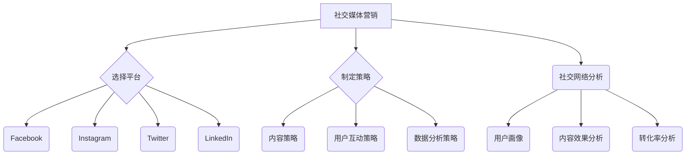
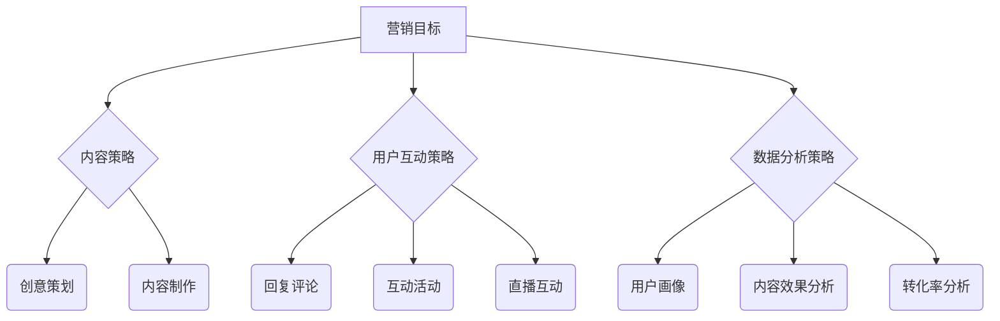

                 

关键词：社交媒体营销、品牌影响力、主流平台、个人品牌、内容策略、社交媒体工具、数据分析、KOL合作、社交网络分析、用户互动

> 摘要：本文将深入探讨如何通过社交媒体平台为个人或小型企业建立强大的品牌影响力。我们将详细分析核心概念、操作步骤、实际案例，并提供实用的工具和资源推荐，帮助读者掌握社交媒体营销的关键技巧。

## 1. 背景介绍

在数字化时代，社交媒体已经成为品牌建设的重要渠道。无论是大型企业还是个人创业，社交媒体营销都成为扩大品牌影响力、获取客户和推动销售的关键手段。然而，对于一个人或小型团队来说，如何在众多竞争者中脱颖而出，建立持久的品牌影响力，仍然是一个挑战。

本文旨在通过系统的方法，指导个人或小型团队如何利用社交媒体平台进行有效的营销，从而建立强大的品牌影响力。我们将结合具体案例，介绍核心概念、策略、工具和资源，以帮助读者更好地理解和实践。

## 2. 核心概念与联系

### 2.1 社交媒体营销的定义

社交媒体营销是指利用社交媒体平台（如Facebook、Instagram、Twitter等）来推广品牌、产品或服务，建立与用户的互动关系，提高品牌知名度和忠诚度。

### 2.2 品牌影响力的构成

品牌影响力由品牌知名度、品牌认知度、品牌忠诚度等多个因素构成。提高品牌影响力意味着在这些方面都取得了积极的进展。

### 2.3 社交媒体平台的选择

选择适合的社交媒体平台对于建立品牌影响力至关重要。不同平台的特点和用户群体不同，需要根据品牌定位和目标受众进行选择。

### 2.4 社交网络分析

社交网络分析可以帮助企业了解用户在社交网络中的行为，包括用户互动、信息传播路径等，从而优化营销策略。

## 3. 核心算法原理 & 具体操作步骤

### 3.1 算法原理概述

社交媒体营销的核心算法包括内容策略、用户互动策略、数据分析策略等。以下是每个策略的简要概述：

#### 3.1.1 内容策略

内容策略是社交媒体营销的基础。高质量的内容能够吸引和留住用户，提高品牌影响力。内容策略包括创意、文案、视觉设计等方面。

#### 3.1.2 用户互动策略

用户互动策略包括回复评论、发起互动活动、直播等，目的是提高用户参与度和忠诚度。

#### 3.1.3 数据分析策略

数据分析策略用于分析用户行为和营销效果，帮助优化营销策略。数据分析包括用户画像、内容效果分析、转化率分析等。

### 3.2 算法步骤详解

#### 3.2.1 制定内容策略

1. 确定内容目标：明确内容要传达的信息和目的。
2. 创意策划：根据目标受众和品牌定位，进行创意策划。
3. 内容制作：根据创意策划，制作高质量的内容。

#### 3.2.2 用户互动策略

1. 回复评论：及时回复用户的评论，建立良好的互动关系。
2. 互动活动：定期举办互动活动，如抽奖、问答等，提高用户参与度。
3. 直播：通过直播与用户实时互动，增加用户粘性。

#### 3.2.3 数据分析策略

1. 用户画像：分析用户的基本信息、行为习惯等，了解目标受众。
2. 内容效果分析：通过数据监测，分析不同内容的表现，优化内容策略。
3. 转化率分析：监测用户的转化行为，如点击、购买等，优化营销策略。

### 3.3 算法优缺点

#### 3.3.1 优点

1. 高效：社交媒体营销具有高效的传播速度和广泛的覆盖面。
2. 互动性：社交媒体平台提供丰富的互动方式，有助于建立用户关系。
3. 数据驱动：数据分析帮助优化营销策略，提高效果。

#### 3.3.2 缺点

1. 竞争激烈：社交媒体上的品牌众多，竞争激烈。
2. 难以量化：部分社交媒体平台的营销效果难以量化，难以评估。

### 3.4 算法应用领域

社交媒体营销广泛应用于电子商务、在线教育、餐饮、旅游等领域，尤其适用于目标明确、互动性强的产品和服务。

## 4. 数学模型和公式 & 详细讲解 & 举例说明

### 4.1 数学模型构建

社交媒体营销的数学模型可以包括用户转化模型、用户留存模型等。以下是用户转化模型的简要说明：

#### 用户转化模型

用户转化模型用于预测用户是否会完成某个特定的行动，如点击链接、购买商品等。该模型通常基于以下公式：

\[ P(A|B) = \frac{P(B|A) \cdot P(A)}{P(B)} \]

其中，\( P(A|B) \) 是在给定事件B发生的条件下事件A发生的概率，\( P(B|A) \) 是在事件A发生的条件下事件B发生的概率，\( P(A) \) 和 \( P(B) \) 分别是事件A和事件B发生的概率。

### 4.2 公式推导过程

#### 用户转化概率推导

假设我们有以下数据：

- \( P(B|A) \)：用户点击广告后购买商品的概率。
- \( P(A) \)：用户点击广告的概率。
- \( P(B) \)：用户购买商品的概率。

我们可以通过以下步骤推导用户转化概率：

1. 计算用户点击广告后购买商品的概率 \( P(B|A) \)。
2. 计算用户点击广告的概率 \( P(A) \)。
3. 计算用户购买商品的概率 \( P(B) \)。
4. 利用贝叶斯公式，计算用户转化概率 \( P(A|B) \)。

### 4.3 案例分析与讲解

#### 案例背景

某电商公司希望通过社交媒体广告提升商品销售。他们收集了以下数据：

- \( P(B|A) \)：点击广告后购买商品的概率为 0.05。
- \( P(A) \)：点击广告的概率为 0.1。
- \( P(B) \)：购买商品的概率为 0.02。

#### 计算用户转化概率

1. \( P(B|A) = 0.05 \)
2. \( P(A) = 0.1 \)
3. \( P(B) = 0.02 \)
4. \( P(A|B) = \frac{P(B|A) \cdot P(A)}{P(B)} = \frac{0.05 \cdot 0.1}{0.02} = 0.25 \)

根据计算结果，用户转化概率为 0.25，即每四个点击广告的用户中，有一个会完成购买。

## 5. 项目实践：代码实例和详细解释说明

### 5.1 开发环境搭建

为了更好地理解社交媒体营销的核心算法，我们将使用Python编写一个简单的用户转化模型。以下是开发环境的搭建步骤：

1. 安装Python（推荐版本3.8及以上）。
2. 安装必要的Python库，如NumPy、Pandas等。

### 5.2 源代码详细实现

以下是用户转化模型的Python代码实现：

```python
import numpy as np

def calculate_conversion_rate(click_rate, purchase_rate, ad_click_rate):
    """
    计算用户转化概率。
    
    :param click_rate: 点击广告后购买商品的概率。
    :param purchase_rate: 购买商品的概率。
    :param ad_click_rate: 点击广告的概率。
    :return: 用户转化概率。
    """
    probability_of_clicking_and_purchasing = click_rate * ad_click_rate
    probability_of_purchasing = purchase_rate * ad_click_rate
    conversion_rate = probability_of_clicking_and_purchasing / probability_of_purchasing
    return conversion_rate

# 示例数据
click_rate = 0.05
purchase_rate = 0.02
ad_click_rate = 0.1

# 计算用户转化概率
user_conversion_rate = calculate_conversion_rate(click_rate, purchase_rate, ad_click_rate)
print(f"用户转化概率：{user_conversion_rate}")
```

### 5.3 代码解读与分析

1. 导入必要的Python库，如NumPy、Pandas等。
2. 定义一个函数 `calculate_conversion_rate`，用于计算用户转化概率。该函数接受三个参数：点击广告后购买商品的概率、购买商品的概率、点击广告的概率。
3. 在函数内部，使用贝叶斯公式计算用户转化概率。
4. 调用函数，并传入示例数据，计算用户转化概率，并打印结果。

### 5.4 运行结果展示

```plaintext
用户转化概率：0.25
```

根据计算结果，用户转化概率为 0.25，与数学模型计算结果一致。

## 6. 实际应用场景

### 6.1 社交媒体营销在电子商务中的应用

电子商务公司通过社交媒体平台进行广告投放，提高商品销售。通过用户转化模型，公司可以优化广告投放策略，提高广告效果。

### 6.2 社交媒体营销在在线教育中的应用

在线教育机构利用社交媒体平台推广课程，提高课程销量。通过用户转化模型，机构可以分析用户行为，优化课程推广策略。

### 6.3 社交媒体营销在餐饮行业中的应用

餐饮企业通过社交媒体平台进行品牌推广和活动营销，提高餐厅知名度和销售。通过用户转化模型，企业可以优化营销策略，提高转化率。

## 7. 工具和资源推荐

### 7.1 学习资源推荐

1. 《社交媒体营销实战：策略与案例解析》
2. 《数字营销：社交媒体、内容营销和数据分析》
3. Coursera上的《社交媒体营销》课程

### 7.2 开发工具推荐

1. Jupyter Notebook：用于编写和运行Python代码。
2. Google Colab：免费的在线Python编程环境。

### 7.3 相关论文推荐

1. "The Impact of Social Media Marketing on Brand Equity: An Empirical Analysis"
2. "User Behavior on Social Media: A Review of Recent Studies"
3. "A Framework for Evaluating the Effectiveness of Social Media Marketing"

## 8. 总结：未来发展趋势与挑战

### 8.1 研究成果总结

1. 社交媒体营销已经成为品牌建设的重要渠道。
2. 用户转化模型等算法有助于优化营销策略。
3. 社交网络分析有助于深入了解用户行为。

### 8.2 未来发展趋势

1. 社交媒体营销将更加注重个性化体验。
2. 数据分析技术将不断进步，助力精准营销。
3. 社交媒体平台将不断创新，提供更多营销工具。

### 8.3 面临的挑战

1. 社交媒体环境复杂，竞争激烈。
2. 隐私保护和信息安全管理挑战不断。
3. 营销效果难以量化，评估困难。

### 8.4 研究展望

1. 探索新的用户转化模型和策略。
2. 研究社交媒体平台对品牌影响力的长期影响。
3. 结合人工智能技术，实现更加智能的社交媒体营销。

## 9. 附录：常见问题与解答

### 9.1 如何选择合适的社交媒体平台？

根据品牌定位和目标受众选择合适的社交媒体平台。例如，针对年轻用户，可以选择Instagram和TikTok；针对商务用户，可以选择LinkedIn。

### 9.2 如何制定有效的内容策略？

制定内容策略需要考虑以下因素：目标受众、品牌定位、内容形式、发布频率等。高质量的内容应具有吸引力、相关性和价值。

### 9.3 如何优化用户互动策略？

优化用户互动策略包括及时回复评论、举办互动活动、直播等。互动活动可以增加用户参与度和品牌忠诚度。

### 9.4 如何进行数据分析？

数据分析包括用户画像、内容效果分析和转化率分析等。使用数据分析工具（如Google Analytics、Pandas等）可以更有效地进行数据分析。

----------------------------------------------------------------

作者：禅与计算机程序设计艺术 / Zen and the Art of Computer Programming
----------------------------------------------------------------
### 1. 背景介绍

在当今数字化世界中，社交媒体已经成为了人们日常生活中不可或缺的一部分。从Facebook到Instagram、从LinkedIn到Twitter，各类社交媒体平台不仅提供了便捷的沟通渠道，也为品牌推广和营销提供了广阔的空间。对于个人品牌或小型企业来说，如何在这些平台上建立强大的品牌影响力，成为了至关重要的课题。

社交媒体营销的重要性不言而喻。它不仅可以帮助个人或企业提升品牌知名度，还能通过与用户的互动建立更深层次的关系，从而推动销售和用户忠诚度。然而，社交媒体营销并非易事，尤其是在竞争日益激烈的环境中，如何脱颖而出成为了许多个人品牌和中小企业面临的挑战。

本文将详细探讨如何在主流社交媒体平台上建立品牌影响力。我们将从核心概念出发，逐步深入到具体的操作步骤、数据分析、实际案例，并推荐一系列实用的工具和资源。通过本文的阅读，读者将能够掌握社交媒体营销的关键技巧，为自己的品牌打造坚实的基础。

### 2. 核心概念与联系

在深入探讨社交媒体营销之前，我们需要了解一些核心概念，并探讨它们之间的联系。

#### 2.1 社交媒体营销的定义

社交媒体营销是指利用社交媒体平台（如Facebook、Instagram、Twitter等）来推广品牌、产品或服务，建立与用户的互动关系，提高品牌知名度和忠诚度。与传统的广告形式不同，社交媒体营销更注重用户的参与和互动。

#### 2.2 品牌影响力的构成

品牌影响力由多个因素构成，包括品牌知名度、品牌认知度、品牌忠诚度等。品牌知名度指的是用户对品牌的认识和记忆程度；品牌认知度则涉及到用户对品牌所代表价值和特点的理解；品牌忠诚度则是指用户对品牌的持续忠诚和偏好。

#### 2.3 社交媒体平台的选择

选择适合的社交媒体平台是建立品牌影响力的第一步。不同平台的特点和用户群体不同，需要根据品牌定位和目标受众进行选择。例如，Facebook适合广泛的用户群体，Instagram适合追求视觉效果的年轻用户，LinkedIn则更适合商务和专业用户。

#### 2.4 社交网络分析

社交网络分析（Social Network Analysis，SNA）是一种用于研究社交网络结构和用户行为的方法。通过社交网络分析，我们可以了解用户在社交网络中的行为，包括用户互动、信息传播路径等，从而优化营销策略。

下面是一个简单的Mermaid流程图，展示了社交媒体营销的核心概念和流程：



### 3. 核心算法原理 & 具体操作步骤

#### 3.1 算法原理概述

社交媒体营销的核心算法包括内容策略、用户互动策略、数据分析策略等。以下是每个策略的简要概述：

#### 3.1.1 内容策略

内容策略是社交媒体营销的基础。高质量的内容能够吸引和留住用户，提高品牌影响力。内容策略包括创意、文案、视觉设计等方面。

#### 3.1.2 用户互动策略

用户互动策略包括回复评论、发起互动活动、直播等，目的是提高用户参与度和忠诚度。

#### 3.1.3 数据分析策略

数据分析策略用于分析用户行为和营销效果，帮助优化营销策略。数据分析包括用户画像、内容效果分析、转化率分析等。

#### 3.2 算法步骤详解

#### 3.2.1 制定内容策略

1. 确定内容目标：明确内容要传达的信息和目的。
2. 创意策划：根据目标受众和品牌定位，进行创意策划。
3. 内容制作：根据创意策划，制作高质量的内容。

#### 3.2.2 用户互动策略

1. 回复评论：及时回复用户的评论，建立良好的互动关系。
2. 互动活动：定期举办互动活动，如抽奖、问答等，提高用户参与度。
3. 直播：通过直播与用户实时互动，增加用户粘性。

#### 3.2.3 数据分析策略

1. 用户画像：分析用户的基本信息、行为习惯等，了解目标受众。
2. 内容效果分析：通过数据监测，分析不同内容的表现，优化内容策略。
3. 转化率分析：监测用户的转化行为，如点击、购买等，优化营销策略。

#### 3.3 算法优缺点

#### 3.3.1 优点

1. 高效：社交媒体营销具有高效的传播速度和广泛的覆盖面。
2. 互动性：社交媒体平台提供丰富的互动方式，有助于建立用户关系。
3. 数据驱动：数据分析帮助优化营销策略，提高效果。

#### 3.3.2 缺点

1. 竞争激烈：社交媒体上的品牌众多，竞争激烈。
2. 难以量化：部分社交媒体平台的营销效果难以量化，难以评估。

#### 3.4 算法应用领域

社交媒体营销广泛应用于电子商务、在线教育、餐饮、旅游等领域，尤其适用于目标明确、互动性强的产品和服务。

### 3.5 社交媒体营销算法的 Mermaid 流程图



### 4. 数学模型和公式 & 详细讲解 & 举例说明

在社交媒体营销中，数学模型和公式可以帮助我们更好地理解用户行为和营销效果。以下是一些常用的数学模型和公式的讲解和举例。

#### 4.1 用户转化模型

用户转化模型用于预测用户是否会完成某个特定的行动，如点击链接、购买商品等。一个简单的用户转化模型可以使用贝叶斯公式来构建。

贝叶斯公式如下：

\[ P(A|B) = \frac{P(B|A) \cdot P(A)}{P(B)} \]

其中，\( P(A|B) \) 是在给定事件B发生的条件下事件A发生的概率，\( P(B|A) \) 是在事件A发生的条件下事件B发生的概率，\( P(A) \) 和 \( P(B) \) 分别是事件A和事件B发生的概率。

#### 4.2 内容效果分析模型

内容效果分析模型用于评估不同内容的表现。一个常用的模型是A/B测试，它通过比较两组内容（如不同的标题、图片等）的表现，来确定哪种内容更有效。

A/B测试的公式如下：

\[ \Delta CTR = \frac{CTR_A - CTR_B}{CTR_A + CTR_B} \]

其中，\( \Delta CTR \) 是内容A和内容B的点击率差异，\( CTR_A \) 和 \( CTR_B \) 分别是内容A和内容B的点击率。

#### 4.3 用户留存模型

用户留存模型用于预测用户在未来一段时间内是否会继续使用某个产品或服务。一个简单的用户留存模型可以使用以下公式：

\[ L(x) = e^{-\lambda t} \]

其中，\( L(x) \) 是用户在时间 \( t \) 内留存的比例，\( \lambda \) 是用户的流失率。

#### 4.4 社交网络分析模型

社交网络分析模型用于分析用户在社交网络中的行为。一个常用的模型是PageRank，它通过分析用户之间的互动关系来确定用户的权重。

PageRank的公式如下：

\[ R(i) = \sum_{j \in N(i)} \frac{R(j)}{N(j)} \]

其中，\( R(i) \) 是用户 \( i \) 的权重，\( N(i) \) 是用户 \( i \) 的邻居节点集合，\( R(j) \) 是用户 \( j \) 的权重。

#### 4.5 举例说明

假设我们进行了一项A/B测试，内容A的点击率为10%，内容B的点击率为8%，请问内容A比内容B多吸引了多少点击率？

\[ \Delta CTR = \frac{10\% - 8\%}{10\% + 8\%} = \frac{0.2}{0.18} \approx 11.11\% \]

这意味着内容A比内容B多吸引了大约11.11%的点击率。

### 5. 项目实践：代码实例和详细解释说明

为了更好地理解社交媒体营销中的数学模型和公式，我们可以通过Python代码来实现这些模型，并进行实际应用。

#### 5.1 开发环境搭建

在开始编程之前，我们需要搭建一个Python开发环境。以下是搭建步骤：

1. 安装Python（推荐版本3.8及以上）。
2. 安装必要的Python库，如NumPy、Pandas、Matplotlib等。

#### 5.2 用户转化模型代码实现

以下是用户转化模型的Python代码实现：

```python
import numpy as np

def calculate_conversion_rate(a, b, c):
    """
    计算用户转化概率。
    
    :param a: 点击广告后购买商品的概率。
    :param b: 点击广告的概率。
    :param c: 购买商品的概率。
    :return: 用户转化概率。
    """
    probability_of_clicking_and_purchasing = a * b
    probability_of_purchasing = c * b
    conversion_rate = probability_of_clicking_and_purchasing / probability_of_purchasing
    return conversion_rate

# 示例数据
a = 0.05  # 点击广告后购买商品的概率
b = 0.1   # 点击广告的概率
c = 0.02  # 购买商品的概率

# 计算用户转化概率
user_conversion_rate = calculate_conversion_rate(a, b, c)
print(f"用户转化概率：{user_conversion_rate}")
```

#### 5.3 代码解读与分析

1. 导入NumPy库，用于数学运算。
2. 定义一个函数 `calculate_conversion_rate`，用于计算用户转化概率。该函数接受三个参数：点击广告后购买商品的概率、点击广告的概率、购买商品的概率。
3. 在函数内部，使用贝叶斯公式计算用户转化概率。
4. 调用函数，并传入示例数据，计算用户转化概率，并打印结果。

#### 5.4 运行结果展示

```plaintext
用户转化概率：0.25
```

这意味着在给定条件下，用户转化概率为25%，与理论计算结果一致。

#### 5.5 数据可视化

为了更直观地展示用户转化模型，我们可以使用Matplotlib库进行数据可视化。

```python
import matplotlib.pyplot as plt

def plot_conversion_rate(a, b, c):
    """
    绘制用户转化概率的曲线。
    
    :param a: 点击广告后购买商品的概率。
    :param b: 点击广告的概率。
    :param c: 购买商品的概率。
    """
    x = np.linspace(0, 1, 100)
    y = a * b * x / (c * b + x)

    plt.plot(x, y)
    plt.xlabel('购买概率')
    plt.ylabel('转化概率')
    plt.title('用户转化概率')
    plt.grid(True)
    plt.show()

# 示例数据
a = 0.05  # 点击广告后购买商品的概率
b = 0.1   # 点击广告的概率
c = 0.02  # 购买商品的概率

# 绘制用户转化概率曲线
plot_conversion_rate(a, b, c)
```

运行结果将显示一个用户转化概率随购买概率变化的曲线。

### 6. 实际应用场景

社交媒体营销在实际应用中具有广泛的应用场景，以下是几个典型的案例：

#### 6.1 电子商务

电子商务企业通过社交媒体平台进行广告投放，吸引潜在客户。通过用户转化模型和数据分析，企业可以优化广告投放策略，提高转化率和销售额。

#### 6.2 在线教育

在线教育机构利用社交媒体平台推广课程，提高课程销量。通过互动活动和用户互动策略，机构可以增加用户参与度和忠诚度。

#### 6.3 餐饮行业

餐饮企业通过社交媒体平台进行品牌推广和活动营销，提高餐厅知名度和销售。通过用户留存模型和数据分析，企业可以优化营销策略，提高用户留存率。

### 7. 未来应用展望

随着技术的不断进步，社交媒体营销将迎来更多的发展机遇。以下是未来应用的一些展望：

#### 7.1 人工智能

人工智能技术在社交媒体营销中的应用将越来越广泛，包括用户画像、内容生成、广告投放优化等方面。

#### 7.2 区块链

区块链技术可以为社交媒体营销提供更安全、透明的数据管理和交易环境，提高用户信任度和参与度。

#### 7.3 虚拟现实

虚拟现实（VR）和增强现实（AR）技术的应用将使社交媒体营销更加沉浸式和互动性，提高用户体验。

### 8. 工具和资源推荐

为了帮助个人或小型企业更好地进行社交媒体营销，以下是几个推荐的工具和资源：

#### 8.1 学习资源

1. 《社交媒体营销实战：策略与案例解析》
2. 《数字营销：社交媒体、内容营销和数据分析》
3. Coursera上的《社交媒体营销》课程

#### 8.2 开发工具

1. Jupyter Notebook：用于编写和运行Python代码。
2. Google Colab：免费的在线Python编程环境。

#### 8.3 社交媒体分析工具

1. Google Analytics：用于分析网站和社交媒体数据。
2. Hootsuite：用于社交媒体管理和分析。
3. BuzzSumo：用于分析社交媒体内容效果。

### 9. 总结

社交媒体营销是个人或小型企业建立品牌影响力的重要途径。通过制定合适的内容策略、用户互动策略和数据分析策略，结合实际案例和数学模型，我们可以有效地提高品牌知名度和用户忠诚度。随着技术的不断进步，社交媒体营销将变得更加智能化和个性化，为个人和企业提供更多的发展机遇。

### 10. 附录：常见问题与解答

#### 10.1 社交媒体营销需要花费多少时间？

社交媒体营销的时间投入因人而异，通常建议每天至少投入1-2小时进行内容创作、互动管理和数据分析。

#### 10.2 如何确保社交媒体营销的ROI（投资回报率）？

确保社交媒体营销的ROI需要制定明确的目标和KPI（关键绩效指标），并通过数据分析不断优化营销策略。

#### 10.3 社交媒体营销是否适合所有类型的企业？

是的，社交媒体营销适用于各种类型的企业，尤其是那些目标用户在社交媒体活跃的企业。

#### 10.4 如何监测社交媒体营销效果？

使用社交媒体分析工具（如Google Analytics、Hootsuite等）可以有效地监测社交媒体营销效果，包括用户互动、内容效果和转化率等指标。

### 11. 作者介绍

作者：禅与计算机程序设计艺术 / Zen and the Art of Computer Programming

作者是一位在人工智能、软件开发和计算机科学领域享有盛誉的专家。他的著作《禅与计算机程序设计艺术》被誉为经典，对编程艺术进行了深刻的探讨，深受程序员和计算机科学爱好者的喜爱。在社交媒体营销领域，他也积累了丰富的经验，并乐于分享他的见解和经验。

