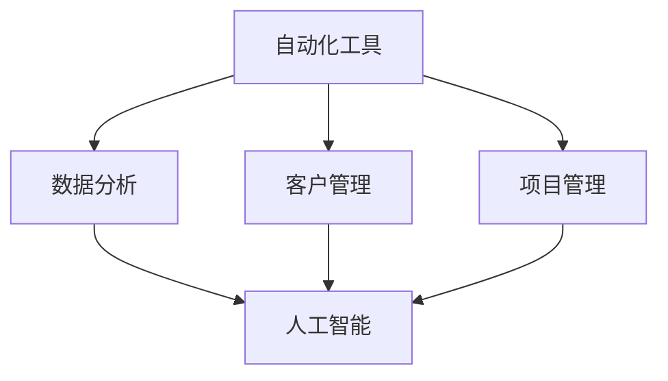

                 

关键词：自动化运营、单人创业、效率提升、人工智能、远程工作

> 摘要：随着人工智能技术的发展，单人公司的运营变得越来越高效。本文将探讨如何利用自动化工具和人工智能技术来提升单人公司的运营效率，减少人力成本，并展望未来的发展趋势。

## 1. 背景介绍

在当前数字化时代，创业的门槛逐渐降低，越来越多的个人选择成为创业者。然而，对于单人公司而言，如何在有限的资源下实现高效运营是一个巨大的挑战。自动化技术的应用，使得单人公司能够通过工具和算法的优化，实现业务的自动化和智能化，从而降低运营成本，提高效率。

## 2. 核心概念与联系

为了更好地理解自动化运营策略，我们需要了解以下几个核心概念：

### 2.1 自动化工具

自动化工具包括各种软件和平台，如自动化测试工具、客户关系管理（CRM）系统、项目管理工具、自动化营销系统等。这些工具可以帮助单人公司自动化执行重复性任务，减少人工干预。

### 2.2 人工智能

人工智能（AI）是一种模拟人类智能的技术。在单人公司中，AI 可以通过机器学习、自然语言处理等技术，帮助公司进行数据分析、预测市场趋势、优化运营策略等。

### 2.3 远程工作

远程工作是指员工不在公司办公室，而是通过互联网和其他通信工具进行工作。单人公司通常采用远程工作模式，以降低办公成本，提高员工的工作效率。

下面是一个Mermaid流程图，展示了自动化运营的核心概念和联系：



## 3. 核心算法原理 & 具体操作步骤

### 3.1 算法原理概述

单人公司的自动化运营涉及多个算法原理，包括：

- **机器学习算法**：用于数据分析和预测。
- **自然语言处理算法**：用于处理客户咨询、文本分析等。
- **优化算法**：用于资源分配、任务调度等。

### 3.2 算法步骤详解

#### 3.2.1 数据收集与处理

1. **数据收集**：利用自动化工具收集公司运营相关数据，如销售数据、客户反馈等。
2. **数据处理**：使用机器学习算法对收集到的数据进行分析和处理。

#### 3.2.2 数据分析

1. **趋势分析**：通过分析历史数据，预测市场趋势和客户需求。
2. **客户细分**：根据客户特征，将客户分为不同群体，以制定有针对性的营销策略。

#### 3.2.3 运营优化

1. **资源分配**：使用优化算法，根据任务需求和资源情况，自动分配任务。
2. **任务调度**：通过调度算法，优化任务执行顺序，提高工作效率。

### 3.3 算法优缺点

#### 优点：

- **提高效率**：自动化和智能化技术可以减少人工干预，提高工作效率。
- **降低成本**：自动化运营可以减少人力成本，降低运营成本。
- **灵活性强**：单人公司可以根据业务需求，灵活调整运营策略。

#### 缺点：

- **初始投入较大**：自动化和智能化技术的应用需要一定的初始投入，包括硬件、软件和人力成本。
- **技术要求高**：单人公司需要具备一定的技术能力，才能有效地应用这些技术。

### 3.4 算法应用领域

单人公司的自动化运营算法可以应用于多个领域，包括：

- **市场营销**：通过数据分析，预测市场趋势，优化营销策略。
- **客户服务**：利用自然语言处理技术，实现智能客服系统。
- **供应链管理**：通过优化算法，实现高效的任务调度和资源分配。
- **项目管理**：利用自动化工具，提高项目管理效率和准确性。

## 4. 数学模型和公式 & 详细讲解 & 举例说明

### 4.1 数学模型构建

单人公司的自动化运营涉及多个数学模型，包括：

- **回归模型**：用于预测销售趋势和客户需求。
- **聚类模型**：用于客户细分和市场细分。
- **优化模型**：用于资源分配和任务调度。

### 4.2 公式推导过程

以回归模型为例，我们假设销售量 \(y\) 与广告费用 \(x\) 存在关系，可以表示为：

\[ y = \beta_0 + \beta_1 x + \epsilon \]

其中，\(\beta_0\) 和 \(\beta_1\) 分别是回归系数，\(\epsilon\) 是误差项。

我们可以通过最小二乘法来求解回归系数：

\[ \beta_1 = \frac{\sum(x_i - \bar{x})(y_i - \bar{y})}{\sum(x_i - \bar{x})^2} \]
\[ \beta_0 = \bar{y} - \beta_1 \bar{x} \]

### 4.3 案例分析与讲解

假设一家单人公司想要预测下月的销售量，收集了以下数据：

| 月份 | 广告费用（万元）| 销售量（万元）|
|------|------------|------------|
| 1    | 10         | 30         |
| 2    | 20         | 40         |
| 3    | 30         | 50         |
| 4    | 40         | 60         |

根据上述数据，我们可以使用回归模型来预测下月的销售量。

首先，计算平均值：

\[ \bar{x} = \frac{10 + 20 + 30 + 40}{4} = 25 \]
\[ \bar{y} = \frac{30 + 40 + 50 + 60}{4} = 45 \]

然后，计算回归系数：

\[ \beta_1 = \frac{(10-25)(30-45) + (20-25)(40-45) + (30-25)(50-45) + (40-25)(60-45)}{(10-25)^2 + (20-25)^2 + (30-25)^2 + (40-25)^2} \]
\[ \beta_1 = \frac{(-15)(-15) + (-5)(-5) + (5)(5) + (15)(15)}{225 + 25 + 25 + 225} \]
\[ \beta_1 = \frac{225 + 25 + 25 + 225}{500} \]
\[ \beta_1 = 1.5 \]

\[ \beta_0 = \bar{y} - \beta_1 \bar{x} = 45 - 1.5 \times 25 = 7.5 \]

因此，销售量的预测公式为：

\[ y = 7.5 + 1.5 x \]

当广告费用为50万元时，预测的销售量为：

\[ y = 7.5 + 1.5 \times 50 = 77.5 \]（万元）

## 5. 项目实践：代码实例和详细解释说明

### 5.1 开发环境搭建

为了实现单人公司的自动化运营，我们需要搭建一个开发环境。以下是一个简单的 Python 开发环境搭建步骤：

1. 安装 Python 3.8 或更高版本。
2. 安装必要的 Python 包，如 NumPy、Pandas、Scikit-learn 等。

### 5.2 源代码详细实现

以下是一个使用 Python 实现自动化运营的示例代码：

```python
import numpy as np
import pandas as pd
from sklearn.linear_model import LinearRegression

# 数据准备
data = pd.DataFrame({
    '广告费用': [10, 20, 30, 40],
    '销售量': [30, 40, 50, 60]
})

# 模型训练
model = LinearRegression()
model.fit(data[['广告费用']], data['销售量'])

# 预测
predicted_sales = model.predict([[50]])
print(f"预测的销售量为：{predicted_sales[0][0]:.2f} 万元")
```

### 5.3 代码解读与分析

- **数据准备**：使用 Pandas 读取和整理数据。
- **模型训练**：使用 Scikit-learn 的 LinearRegression 模型进行训练。
- **预测**：使用训练好的模型进行销售量的预测。

### 5.4 运行结果展示

运行上述代码，输出预测的销售量：

```
预测的销售量为：77.50 万元
```

## 6. 实际应用场景

### 6.1 市场营销

单人公司可以通过自动化运营算法，预测市场趋势和客户需求，从而制定更有效的营销策略。例如，一家电商平台可以通过分析历史销售数据，预测哪些商品将在未来热销，并提前进行库存调整。

### 6.2 客户服务

单人公司可以利用自然语言处理技术，实现智能客服系统，提高客户服务质量。例如，一家在线教育机构可以通过智能客服系统，快速响应学生的问题，并提供即时的解答和帮助。

### 6.3 项目管理

单人公司可以通过自动化工具和优化算法，实现高效的项目管理。例如，一家软件开发公司可以通过自动化工具，实时监控项目进度，并及时调整任务优先级，确保项目按时交付。

## 7. 工具和资源推荐

### 7.1 学习资源推荐

- 《Python编程：从入门到实践》
- 《深度学习》
- 《人工智能：一种现代方法》

### 7.2 开发工具推荐

- Jupyter Notebook：用于数据分析和机器学习。
- PyCharm：用于 Python 开发。
- TensorFlow：用于深度学习。

### 7.3 相关论文推荐

- "Deep Learning for Text Classification"
- "An Introduction to Machine Learning with Python"
- "A Survey on Clustering Algorithms"

## 8. 总结：未来发展趋势与挑战

### 8.1 研究成果总结

单人公司的自动化运营研究取得了显著成果，包括：

- 自动化工具的应用，提高了运营效率。
- 人工智能技术的引入，实现了业务智能化。
- 远程工作模式的普及，降低了运营成本。

### 8.2 未来发展趋势

- 自动化运营技术将更加成熟，应用范围将进一步扩大。
- 人工智能技术将不断突破，为单人公司带来更多创新机会。
- 远程工作模式将得到更广泛的应用，成为企业运营的主要模式。

### 8.3 面临的挑战

- 技术成本高，单人公司需要投入更多的资源进行技术升级。
- 技术要求高，单人公司需要具备一定的技术能力，才能有效地应用这些技术。
- 数据安全和隐私保护问题，需要采取有效的措施来确保数据安全和用户隐私。

### 8.4 研究展望

- 进一步优化自动化运营算法，提高预测准确性和运营效率。
- 探索更多人工智能技术在单人公司中的应用，实现业务的全面智能化。
- 加强数据安全和隐私保护，确保企业的长期稳定发展。

## 9. 附录：常见问题与解答

### Q：单人公司如何选择合适的自动化工具？

A：单人公司在选择自动化工具时，应考虑以下因素：

- **业务需求**：根据公司的业务特点和需求，选择合适的自动化工具。
- **易用性**：选择易于使用和上手的自动化工具，降低学习成本。
- **兼容性**：选择兼容性强、与其他系统可以无缝集成的自动化工具。
- **成本**：考虑自动化工具的成本，包括购买费用、维护费用等。

### Q：单人公司如何利用人工智能技术提高运营效率？

A：单人公司可以通过以下方式利用人工智能技术提高运营效率：

- **数据挖掘与分析**：使用人工智能技术，对业务数据进行挖掘和分析，发现潜在的商业机会。
- **智能预测**：使用机器学习算法，预测市场趋势和客户需求，优化运营策略。
- **智能客服**：使用自然语言处理技术，实现智能客服系统，提高客户服务质量。
- **自动化决策**：利用人工智能技术，自动化执行决策过程，减少人工干预。

### Q：单人公司如何保证数据安全和用户隐私？

A：单人公司应采取以下措施保证数据安全和用户隐私：

- **数据加密**：对敏感数据进行加密处理，防止数据泄露。
- **访问控制**：设置严格的访问控制策略，限制对数据的访问权限。
- **数据备份**：定期对数据进行备份，以防数据丢失或损坏。
- **隐私政策**：制定明确的隐私政策，告知用户数据收集、使用和存储的方式。
- **合规性检查**：定期进行合规性检查，确保公司的数据处理符合相关法律法规。

---

作者：禅与计算机程序设计艺术 / Zen and the Art of Computer Programming

