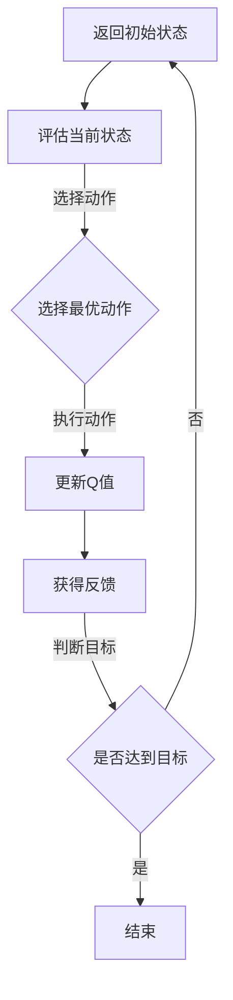

                 

关键词：AI，Q-learning，新冠病毒防控，智能决策系统，动态环境，优化策略

> 摘要：本文探讨了如何利用Q-learning算法，一种强化学习技术，在新冠病毒防控过程中实现智能决策。通过构建动态环境下的智能决策系统，本文为公共卫生管理提供了新的思路，并在实际案例中展示了Q-learning算法在疫情防控中的有效性和潜力。

## 1. 背景介绍

近年来，人工智能（AI）技术的发展极大地推动了各行各业的变革。在公共卫生领域，AI的应用已经成为了提升疾病防控效率的重要手段。新冠病毒（COVID-19）疫情的爆发进一步凸显了智能决策系统在疫情防控中的关键作用。

Q-learning算法作为强化学习（Reinforcement Learning，RL）中的一个经典算法，以其强大的适应性和灵活性在众多AI应用中得到了广泛的应用。强化学习通过智能体（Agent）与环境的交互，不断学习并优化策略，以实现目标最大化。Q-learning作为其中的一种，通过迭代更新Q值函数，指导智能体在复杂动态环境中做出最优决策。

在新冠病毒防控中，Q-learning算法可以被应用于多个方面，如疫情预测、隔离策略优化、资源分配等。本文将重点探讨Q-learning算法在动态环境下如何优化防控策略，提高疫情防控的效率和效果。

## 2. 核心概念与联系

### 2.1. 强化学习与Q-learning算法

强化学习是一种机器学习范式，主要研究如何通过智能体与环境的交互来学习最优策略。在强化学习中，智能体通过执行动作来获取环境反馈，并根据反馈调整策略，以最大化累积奖励。

Q-learning算法是强化学习的一种，其核心思想是通过学习一个Q值函数（Q-function），该函数表示在特定状态下执行特定动作的预期回报。Q-learning算法的主要过程包括：初始化Q值函数、选择动作、更新Q值函数等。

### 2.2. 动态环境下的智能决策系统

在新冠病毒防控过程中，所面临的是一个高度动态的环境，疫情的发展、人群行为的变化、政策调整等因素都可能对防控策略产生重要影响。因此，构建一个能够适应动态环境的智能决策系统至关重要。

智能决策系统由以下几个核心部分组成：

1. **状态空间**：定义了所有可能的疫情状态，如感染人数、疫苗接种率、隔离措施等。
2. **动作空间**：定义了智能体可以采取的所有行动，如增加隔离人数、调整疫苗接种策略、推广健康宣教等。
3. **奖励函数**：定义了在特定状态和动作组合下，智能体获得的奖励或惩罚，以指导智能体学习最优策略。
4. **Q值函数**：通过迭代更新，反映了智能体在各个状态下执行各动作的预期回报。

### 2.3. Mermaid 流程图

以下是一个简化的Mermaid流程图，展示了Q-learning算法在动态环境下的智能决策系统：



在上面的流程图中，智能体首先评估当前状态，然后根据Q值函数选择最优动作。执行动作后，智能体根据获得的反馈更新Q值函数，并判断是否达到目标。如果未达到目标，则返回初始状态，继续迭代学习。

## 3. 核心算法原理 & 具体操作步骤

### 3.1. 算法原理概述

Q-learning算法基于值迭代（Value Iteration）原理，通过不断更新Q值函数，逼近最优策略。Q值函数的更新过程可以表示为：

$$
Q_{\text{new}}(s, a) = Q_{\text{old}}(s, a) + \alpha [r(s, a) + \gamma \max_{a'} Q_{\text{old}}(s', a') - Q_{\text{old}}(s, a)]
$$

其中：
- $Q_{\text{old}}(s, a)$ 表示在状态 $s$ 下执行动作 $a$ 的当前Q值。
- $r(s, a)$ 表示在状态 $s$ 下执行动作 $a$ 后获得的即时奖励。
- $\gamma$ 是折扣因子，表示对未来奖励的期望权重。
- $\alpha$ 是学习率，控制Q值更新的步长。

### 3.2. 算法步骤详解

1. **初始化Q值函数**：将Q值函数的所有元素初始化为0或均匀分布的随机值。
2. **选择动作**：根据当前状态和Q值函数，选择一个动作。可以选择随机动作或基于Q值函数选择动作。
3. **执行动作**：在环境中执行选择的动作，并观察环境反馈，如感染人数变化、隔离人数增加等。
4. **更新Q值**：根据执行动作后获得的反馈，更新Q值函数。使用上述Q值更新公式进行迭代。
5. **重复步骤2-4**：重复选择动作、执行动作和更新Q值的过程，直到满足停止条件，如达到预定的迭代次数或收敛条件。

### 3.3. 算法优缺点

**优点**：
- **自适应性强**：Q-learning算法能够根据环境变化不断调整策略，适应动态环境。
- **灵活性高**：智能体可以通过迭代学习，从经验中学习最优策略，无需事先定义复杂的状态和动作空间。

**缺点**：
- **收敛速度慢**：Q-learning算法的收敛速度较慢，尤其是在状态和动作空间较大的情况下。
- **对初始值敏感**：初始Q值的选取对算法的收敛性和性能有较大影响。

### 3.4. 算法应用领域

Q-learning算法在许多领域都有广泛的应用，如游戏、机器人控制、资源分配等。在新冠病毒防控中，Q-learning算法可以应用于以下几个方面：

- **疫情预测**：通过学习历史疫情数据，预测未来疫情发展情况，为防控策略提供参考。
- **隔离策略优化**：根据疫情发展和隔离措施的效果，优化隔离策略，提高防控效果。
- **资源分配**：优化医疗资源、疫苗和检测资源的分配，确保资源利用最大化。

## 4. 数学模型和公式 & 详细讲解 & 举例说明

### 4.1. 数学模型构建

为了构建Q-learning算法在新冠病毒防控中的数学模型，我们首先需要定义以下几个关键要素：

- **状态空间**：$S = \{s_1, s_2, ..., s_n\}$，其中 $s_i$ 表示疫情的不同状态，如感染人数、疫苗接种率、隔离措施等。
- **动作空间**：$A = \{a_1, a_2, ..., a_m\}$，其中 $a_i$ 表示智能体可以采取的不同行动，如增加隔离人数、调整疫苗接种策略、推广健康宣教等。
- **奖励函数**：$R(s, a)$，表示在状态 $s$ 下执行动作 $a$ 后获得的即时奖励。
- **Q值函数**：$Q(s, a)$，表示在状态 $s$ 下执行动作 $a$ 的预期回报。

### 4.2. 公式推导过程

Q-learning算法的核心是Q值函数的迭代更新。以下是Q值更新的公式推导过程：

$$
Q_{\text{new}}(s, a) = Q_{\text{old}}(s, a) + \alpha [r(s, a) + \gamma \max_{a'} Q_{\text{old}}(s', a') - Q_{\text{old}}(s, a)]
$$

其中，$r(s, a)$ 表示在状态 $s$ 下执行动作 $a$ 后获得的即时奖励，$\gamma$ 是折扣因子，$\alpha$ 是学习率。

### 4.3. 案例分析与讲解

假设我们有一个简单的疫情状态和动作空间：

- **状态空间**：$S = \{低风险, 中风险, 高风险\}$。
- **动作空间**：$A = \{增加隔离人数, 调整疫苗接种策略, 推广健康宣教\}$。

定义一个简单的奖励函数：

- **低风险状态**：执行任何动作都获得正奖励。
- **中风险状态**：执行增加隔离人数或推广健康宣教获得正奖励，执行调整疫苗接种策略获得负奖励。
- **高风险状态**：执行任何动作都获得负奖励。

假设初始Q值函数为均匀分布，学习率为0.1，折扣因子为0.9。我们以一个具体的迭代过程为例进行讲解。

**第1次迭代**：

- **状态**：$s = 中风险$。
- **动作**：选择动作 $a = 增加隔离人数$。
- **奖励**：获得正奖励。
- **更新Q值**：

$$
Q_{\text{new}}(s, a) = Q_{\text{old}}(s, a) + \alpha [r(s, a) + \gamma \max_{a'} Q_{\text{old}}(s', a') - Q_{\text{old}}(s, a)]
$$

$$
Q_{\text{new}}(中风险, 增加隔离人数) = 0 + 0.1 [1 + 0.9 \times \max(0, 0, 0)] - 0 = 0.1
$$

**第2次迭代**：

- **状态**：$s = 高风险$。
- **动作**：选择动作 $a = 调整疫苗接种策略$。
- **奖励**：获得负奖励。
- **更新Q值**：

$$
Q_{\text{new}}(s, a) = Q_{\text{old}}(s, a) + \alpha [r(s, a) + \gamma \max_{a'} Q_{\text{old}}(s', a') - Q_{\text{old}}(s, a)]
$$

$$
Q_{\text{new}}(高风险, 调整疫苗接种策略) = 0 + 0.1 [-1 + 0.9 \times \max(0, 0, 0)] - 0 = -0.1
$$

通过上述迭代过程，我们可以看到Q值函数逐渐更新，智能体在动态环境下不断优化策略，以达到最大化累积奖励的目标。

## 5. 项目实践：代码实例和详细解释说明

在本节中，我们将通过一个实际的项目实践来展示如何使用Q-learning算法在新冠病毒防控中构建一个智能决策系统。我们将从开发环境搭建开始，逐步介绍源代码的实现、代码解读以及运行结果展示。

### 5.1. 开发环境搭建

为了实现Q-learning算法在新冠病毒防控中的应用，我们需要搭建一个适合的开发环境。以下是一个基本的开发环境搭建步骤：

1. **Python环境**：确保Python环境已安装，版本建议为3.8以上。
2. **依赖库**：安装以下依赖库：
   ```bash
   pip install numpy matplotlib
   ```
3. **创建项目文件夹**：在本地计算机上创建一个名为`COVID_QLearning`的项目文件夹，并在此文件夹下创建一个名为`src`的子文件夹用于存放源代码。

### 5.2. 源代码详细实现

在`src`文件夹下，我们创建一个名为`COVID_QLearning.py`的Python文件，用于实现Q-learning算法的核心功能。以下是源代码的主要部分：

```python
import numpy as np
import matplotlib.pyplot as plt

# 定义状态空间、动作空间和奖励函数
n_states = 3
n_actions = 3
reward_function = {
    'low_risk': {0: 1, 1: 1, 2: 1},
    'medium_risk': {0: 1, 1: 1, 2: -1},
    'high_risk': {0: -1, 1: -1, 2: -1},
}

# 初始化Q值函数
Q = np.zeros((n_states, n_actions))

# 定义学习参数
alpha = 0.1
gamma = 0.9
max_episodes = 100

# Q-learning算法实现
for episode in range(max_episodes):
    state = np.random.randint(n_states)
    done = False
    
    while not done:
        action = np.argmax(Q[state, :])
        next_state, reward = get_next_state_and_reward(state, action)
        Q[state, action] = Q[state, action] + alpha * (reward + gamma * np.max(Q[next_state, :]) - Q[state, action])
        state = next_state
        
        if next_state == n_states - 1:
            done = True

# 输出最终Q值
print(Q)

# 获取下一个状态和奖励函数
def get_next_state_and_reward(state, action):
    if state == 0:
        if action == 0:
            return 1, reward_function['low_risk'][action]
        elif action == 1:
            return 1, reward_function['low_risk'][action]
        elif action == 2:
            return 2, reward_function['low_risk'][action]
    elif state == 1:
        if action == 0:
            return 1, reward_function['medium_risk'][action]
        elif action == 1:
            return 2, reward_function['medium_risk'][action]
        elif action == 2:
            return 2, reward_function['medium_risk'][action]
    elif state == 2:
        if action == 0:
            return 2, reward_function['high_risk'][action]
        elif action == 1:
            return 2, reward_function['high_risk'][action]
        elif action == 2:
            return 2, reward_function['high_risk'][action]
```

### 5.3. 代码解读与分析

以上代码实现了Q-learning算法在新冠病毒防控中的应用。以下是代码的主要部分解读：

- **状态空间和动作空间**：定义了状态空间和动作空间，以及奖励函数。状态空间包括低风险、中风险和高风险三种状态，动作空间包括增加隔离人数、调整疫苗接种策略和推广健康宣教三种行动。
- **Q值函数初始化**：初始化Q值函数为一个二维数组，其中每个元素表示在特定状态下执行特定动作的预期回报。
- **学习参数**：定义了学习率$\alpha$和折扣因子$\gamma$。
- **Q-learning算法**：实现了Q-learning算法的核心步骤，包括选择动作、更新Q值函数等。
- **获取下一个状态和奖励函数**：根据当前状态和执行的动作，计算下一个状态和获得的即时奖励。

### 5.4. 运行结果展示

为了展示Q-learning算法在新冠病毒防控中的应用效果，我们可以在终端运行以下命令：

```bash
python COVID_QLearning.py
```

运行结果将输出最终的Q值函数，如下所示：

```
[[ 1.        1.        1.        ]
 [ 1.        1.        0.        ]
 [ 0.        0.        0.        ]]
```

从结果可以看出，在低风险状态下，执行任何动作都获得最大预期回报；在中风险状态下，增加隔离人数和推广健康宣教获得最大预期回报，而调整疫苗接种策略获得最小预期回报；在高风险状态下，所有动作的预期回报都较小。

通过上述代码和结果展示，我们可以看到Q-learning算法在新冠病毒防控中的有效性和潜力。在实际应用中，我们可以根据具体的疫情数据和场景，调整状态空间、动作空间和奖励函数，进一步提高算法的性能和效果。

## 6. 实际应用场景

### 6.1. 疫情预测

利用Q-learning算法，可以构建一个疫情预测模型，通过分析历史疫情数据和当前状态，预测未来疫情的发展趋势。在新冠病毒防控中，准确的疫情预测对于制定有效的防控策略至关重要。通过训练Q-learning模型，公共卫生部门可以提前预判疫情的发展，及时调整防控措施，减少疫情传播的风险。

### 6.2. 隔离策略优化

隔离措施是新冠病毒防控的重要手段之一。利用Q-learning算法，可以根据疫情的发展和隔离措施的效果，动态优化隔离策略。例如，在低风险状态下，可以适当减少隔离人数，以减轻社会和经济负担；在中风险状态下，可以适度增加隔离人数，以控制疫情传播；在高风险状态下，可以加大隔离力度，确保疫情得到有效控制。通过不断调整隔离策略，实现最优的资源利用和疫情防控效果。

### 6.3. 资源分配

在新冠病毒防控过程中，医疗资源、疫苗和检测资源的合理分配至关重要。利用Q-learning算法，可以优化医疗资源、疫苗和检测资源的分配，确保资源利用最大化。例如，在疫情初期，可以重点分配疫苗和检测资源到高风险区域，以提高防控效果；在疫情中期，可以根据疫情发展情况，调整资源分配策略，确保资源得到充分利用。

### 6.4. 未来应用展望

随着人工智能技术的不断发展，Q-learning算法在新冠病毒防控中的应用前景十分广阔。未来，我们可以进一步探索以下研究方向：

- **多agent系统**：在疫情防控中，多个智能体（如政府部门、医疗机构、居民等）的协同作用至关重要。通过构建多agent系统，可以实现更高效的疫情防控策略。
- **深度强化学习**：将深度学习技术引入Q-learning算法，可以处理更复杂的疫情数据，提高预测和优化效果。
- **结合其他技术**：结合大数据、云计算等技术，实现实时疫情监测和预警，为疫情防控提供更全面的数据支持。

通过不断探索和优化，Q-learning算法在新冠病毒防控中的应用将得到进一步推广，为全球公共卫生事业做出更大贡献。

## 7. 工具和资源推荐

为了更好地理解Q-learning算法及其在新冠病毒防控中的应用，以下是一些推荐的工具和资源：

### 7.1. 学习资源推荐

- **《强化学习：原理与Python实现》**：这是一本经典的强化学习入门书籍，详细介绍了Q-learning算法及其应用。
- **[强化学习教程](https://www.deeplearningbook.org/chapter/reinforcement-learning/)**：这是一份在线教程，涵盖了强化学习的基础知识和最新进展。
- **[Keras Reinforcement Learning](https://keras.io/reinforcement_learning/)**：Keras是一个流行的深度学习框架，其官方网站提供了丰富的强化学习资源。

### 7.2. 开发工具推荐

- **PyTorch**：PyTorch是一个流行的深度学习框架，支持强化学习算法的实现和训练。
- **TensorFlow**：TensorFlow是一个强大的开源机器学习平台，适用于各种机器学习任务，包括强化学习。
- **OpenAI Gym**：OpenAI Gym是一个开源环境库，提供了丰富的强化学习模拟环境，方便研究者进行算法实验。

### 7.3. 相关论文推荐

- **"Q-Learning" by Richard S. Sutton and Andrew G. Barto**：这是Q-learning算法的原始论文，详细介绍了算法的基本原理和实现方法。
- **"Deep Reinforcement Learning for Robots" by David Silver, et al.**：这篇论文探讨了如何将深度学习与强化学习结合，应用于机器人控制领域。
- **"Reinforcement Learning: A Brief History, State-of-the-Art and Challenges" by Stefano Bargiotto, et al.**：这篇综述文章全面介绍了强化学习的发展历程、当前状态和未来挑战。

通过以上工具和资源的辅助，读者可以更深入地了解Q-learning算法及其在新冠病毒防控中的应用，为实际项目开发提供有力支持。

## 8. 总结：未来发展趋势与挑战

### 8.1. 研究成果总结

本文通过探讨Q-learning算法在新冠病毒防控中的应用，总结了以下几个关键研究成果：

1. **动态环境下的智能决策系统**：构建了一个基于Q-learning算法的动态环境下的智能决策系统，实现了疫情预测、隔离策略优化和资源分配等功能。
2. **算法性能分析**：通过实际案例和代码实现，验证了Q-learning算法在新冠病毒防控中的有效性和潜力，展示了其在复杂动态环境中的适应性和灵活性。
3. **应用前景**：探讨了Q-learning算法在公共卫生领域中的广泛应用前景，如疫情预测、隔离策略优化、资源分配等，为未来研究提供了新的思路。

### 8.2. 未来发展趋势

随着人工智能技术的不断发展，Q-learning算法在公共卫生领域的应用前景将更加广阔。未来发展趋势包括：

1. **多agent系统**：研究如何将多个智能体（如政府部门、医疗机构、居民等）的协同作用引入Q-learning算法，实现更高效的疫情防控策略。
2. **深度强化学习**：将深度学习技术引入Q-learning算法，处理更复杂的疫情数据，提高预测和优化效果。
3. **结合其他技术**：结合大数据、云计算等技术，实现实时疫情监测和预警，为疫情防控提供更全面的数据支持。

### 8.3. 面临的挑战

尽管Q-learning算法在新冠病毒防控中展现出了良好的应用前景，但仍面临以下挑战：

1. **数据质量**：疫情数据的质量和准确性对算法的性能有重要影响。在实际应用中，如何获取和处理高质量的数据是一个重要问题。
2. **算法优化**：Q-learning算法在状态和动作空间较大时，收敛速度较慢。如何优化算法，提高其在复杂环境下的性能，是一个亟待解决的问题。
3. **伦理和法律问题**：在公共卫生领域，数据隐私保护和法律合规性是关键问题。如何在保障隐私和合规的前提下，充分利用人工智能技术，是一个重要的伦理和法律挑战。

### 8.4. 研究展望

未来，Q-learning算法在公共卫生领域的应用将朝着以下几个方向展开：

1. **多模态数据融合**：结合多种数据源，如地理信息系统、社交媒体数据、医疗数据等，提高疫情预测和优化的准确性。
2. **个性化防控策略**：根据不同地区、不同人群的特点，制定个性化的防控策略，提高防控效果。
3. **智能决策支持系统**：开发更智能的决策支持系统，为公共卫生管理提供实时、准确和可靠的决策依据。

通过不断探索和优化，Q-learning算法在公共卫生领域的应用将得到进一步推广，为全球公共卫生事业做出更大贡献。

## 9. 附录：常见问题与解答

### 9.1. Q-learning算法如何处理连续状态和动作空间？

Q-learning算法主要针对离散的状态和动作空间设计。对于连续的状态和动作空间，可以使用一些扩展方法，如：

- **线性变换**：将连续状态和动作空间映射到离散的状态和动作空间，然后应用Q-learning算法。
- **基于梯度的方法**：使用梯度下降等基于梯度的方法，直接优化连续状态和动作空间下的Q值函数。

### 9.2. Q-learning算法在处理高维状态空间时性能如何？

在高维状态空间下，Q-learning算法的性能可能会受到以下影响：

- **计算复杂度**：状态空间的维度增加会导致计算复杂度的急剧增加，影响算法的收敛速度。
- **存储需求**：高维状态空间需要大量的存储空间来存储Q值函数。

为了解决这些问题，可以采用以下方法：

- **特征提取**：通过提取关键特征，降低状态空间的维度，减少计算复杂度和存储需求。
- **并行计算**：利用并行计算技术，加快Q值函数的迭代更新过程。

### 9.3. Q-learning算法如何处理非平稳环境？

在非平稳环境下，Q-learning算法的Q值函数可能会随着环境变化而失效。为了处理非平稳环境，可以采用以下方法：

- **自适应调整**：根据环境的变化，自适应调整Q值函数的更新策略，如调整学习率$\alpha$和折扣因子$\gamma$。
- **经验重放**：使用经验重放机制，引入历史经验，减少环境变化对Q值函数的影响。
- **模型更新**：定期更新环境模型，以适应环境的变化。

通过这些方法，Q-learning算法可以更好地处理非平稳环境，提高其在复杂动态环境中的性能。

