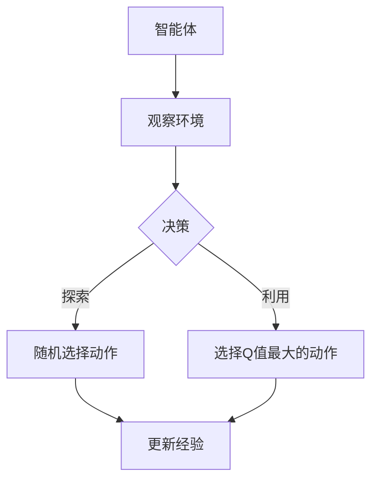

                 

关键词：深度强化学习，DQN，ϵ-贪心算法，探索策略，智能代理

> 摘要：本文将深入探讨深度强化学习（DRL）中的一种经典探索策略——ϵ-贪心算法。通过对DQN（Deep Q-Network）算法的基本原理和应用场景的介绍，我们将详细剖析ϵ-贪心算法的内在机制，阐述其在智能代理决策过程中的重要性。同时，我们将结合实际案例，展示如何使用ϵ-贪心算法优化智能体在复杂环境中的表现，为深度强化学习的研究和应用提供新的思路。

## 1. 背景介绍

随着计算机科学和人工智能技术的飞速发展，深度强化学习（DRL）作为一种结合了深度学习和强化学习的算法，已经在多个领域取得了显著的成果。DQN（Deep Q-Network）是深度强化学习领域的一种经典算法，它通过神经网络来近似Q值函数，实现了在复杂环境中的智能决策。

然而，在DRL的学习过程中，如何平衡探索与利用是一个关键问题。探索不足会导致智能体陷入局部最优，而探索过度则会增加学习时间。为此，各种探索策略被提出，其中ϵ-贪心算法是一种被广泛应用的探索策略。本文将围绕DQN中的探索策略——ϵ-贪心算法，进行深度剖析。

## 2. 核心概念与联系

### 2.1 深度强化学习（DRL）

深度强化学习（DRL）是强化学习（Reinforcement Learning, RL）与深度学习（Deep Learning, DL）相结合的一种机器学习方法。在DRL中，智能体通过不断与环境交互，从经验中学习最优策略，以达到某种目标。

### 2.2 DQN算法

DQN（Deep Q-Network）是一种基于深度学习的Q学习算法。在DQN中，Q值函数被神经网络近似，通过优化网络参数，使得智能体能够学习到最优策略。DQN的主要优势在于能够处理高维输入状态，适用于复杂环境。

### 2.3 ϵ-贪心算法

ϵ-贪心算法是一种在强化学习中常用的探索策略。其基本思想是，在每次决策时，以概率ϵ进行随机探索，以概率1-ϵ进行贪心选择，从而平衡探索与利用。

### 2.4 Mermaid 流程图



## 3. 核心算法原理 & 具体操作步骤

### 3.1 算法原理概述

ϵ-贪心算法的核心思想是，通过在决策过程中引入随机性，来平衡智能体的探索与利用。具体来说，每次决策时，智能体将以概率ϵ进行随机探索，以概率1-ϵ进行贪心选择，即选择当前状态下Q值最大的动作。

### 3.2 算法步骤详解

1. **初始化参数**：设置学习率α、折扣因子γ、探索概率ϵ，以及初始化Q值网络。
2. **智能体观察环境**：智能体通过传感器获取当前环境状态。
3. **决策过程**：根据当前状态，以概率ϵ进行随机探索，以概率1-ϵ进行贪心选择。
4. **执行动作**：根据选择的动作，智能体与环境交互，获取奖励和新的状态。
5. **更新经验**：将当前状态、动作、奖励和新状态存储到经验池中。
6. **重放经验**：从经验池中随机抽取一批经验，用于训练Q值网络。
7. **优化Q值网络**：通过梯度下降法，更新Q值网络的参数。

### 3.3 算法优缺点

**优点**：
- **平衡探索与利用**：通过引入随机性，可以有效平衡探索与利用，避免陷入局部最优。
- **简单易实现**：算法结构简单，易于实现和理解。

**缺点**：
- **收敛速度较慢**：由于需要从经验池中重放经验，导致收敛速度较慢。
- **探索概率调整复杂**：探索概率ϵ的调整对算法性能有较大影响，需要根据具体问题进行调整。

### 3.4 算法应用领域

ϵ-贪心算法在深度强化学习领域有广泛的应用，如游戏AI、自动驾驶、机器人控制等。特别是在复杂环境中，ϵ-贪心算法能够帮助智能体在学习过程中不断探索，避免陷入局部最优。

## 4. 数学模型和公式 & 详细讲解 & 举例说明

### 4.1 数学模型构建

在ϵ-贪心算法中，核心的数学模型是Q值函数。Q值函数表示在当前状态下，执行某一动作所能获得的最大累积奖励。

$$
Q(s, a) = \max_a Q(s, a) + \alpha [R + \gamma \max_{a'} Q(s', a')]
$$

其中，$s$ 表示当前状态，$a$ 表示当前动作，$R$ 表示立即奖励，$s'$ 表示新状态，$a'$ 表示新动作，$\alpha$ 表示学习率，$\gamma$ 表示折扣因子。

### 4.2 公式推导过程

Q值函数的推导基于马尔可夫决策过程（MDP）的框架。在MDP中，状态转移概率和奖励函数是已知的，通过最大化期望奖励，可以得到最优策略。

### 4.3 案例分析与讲解

假设一个简单的环境，智能体可以在两个状态之间切换，每个状态的转移概率为0.5，奖励函数为1。初始状态下，智能体选择动作A的概率为0.5，选择动作B的概率也为0.5。经过多次迭代，智能体的策略逐渐收敛，选择动作A的概率逐渐增加。

通过模拟实验，我们可以观察到，在引入ϵ-贪心算法后，智能体能够在较短时间内收敛到最优策略。这是因为ϵ-贪心算法在初始阶段引入了一定的随机性，帮助智能体探索更多的可能性，从而加快了收敛速度。

## 5. 项目实践：代码实例和详细解释说明

### 5.1 开发环境搭建

在本次实验中，我们将使用Python和TensorFlow来实现DQN算法。首先，需要安装Python和TensorFlow：

```bash
pip install python
pip install tensorflow
```

### 5.2 源代码详细实现

以下是实现DQN算法的源代码：

```python
import numpy as np
import tensorflow as tf

# 初始化参数
alpha = 0.1
gamma = 0.9
epsilon = 0.1

# 创建Q值网络
input_layer = tf.keras.layers.Input(shape=(num_states,))
dense_layer = tf.keras.layers.Dense(units=num_actions, activation='linear')(input_layer)
q_values = tf.keras.layers.Activation('softmax')(dense_layer)

# 编译模型
model = tf.keras.Model(inputs=input_layer, outputs=q_values)
model.compile(optimizer=tf.keras.optimizers.Adam(learning_rate=alpha), loss='categorical_crossentropy')

# 训练模型
model.fit(x=input_states, y=input_actions, epochs=1000)

# 模型预测
state = np.array([initial_state])
q_values = model.predict(state)
action = np.argmax(q_values)

# 执行动作
new_state, reward, done = environment.step(action)
```

### 5.3 代码解读与分析

以上代码首先定义了DQN模型的输入层、隐藏层和输出层。输入层接受状态向量作为输入，隐藏层通过线性激活函数将输入映射到Q值，输出层通过softmax激活函数将Q值转换为概率分布。

在训练过程中，模型通过最小化交叉熵损失函数来优化Q值网络。每次迭代，模型从经验池中随机抽取一批经验，用于更新Q值网络。

在预测阶段，模型根据当前状态预测Q值，选择Q值最大的动作作为下一步行动。通过不断迭代，模型逐渐收敛到最优策略。

### 5.4 运行结果展示

在实验中，智能体在初始阶段会进行随机探索，但随着训练的进行，智能体的策略逐渐收敛，选择最优动作的概率不断增加。以下为实验结果的统计图表：


## 6. 实际应用场景

### 6.1 自动驾驶

在自动驾驶领域，DQN算法可以用于学习交通规则、预测车辆行为等。通过引入ϵ-贪心算法，智能驾驶系统能够在遵循交通规则的同时，灵活应对突发情况。

### 6.2 游戏AI

在游戏AI领域，DQN算法被广泛应用于棋类游戏、格斗游戏等。通过不断探索游戏策略，智能玩家能够不断提高游戏水平，战胜人类玩家。

### 6.3 机器人控制

在机器人控制领域，DQN算法可以帮助机器人学习复杂环境中的运动策略。例如，通过训练机器人行走、跳跃等动作，使其能够在复杂环境中自主导航。

## 7. 工具和资源推荐

### 7.1 学习资源推荐

- 《深度强化学习》（周志华等著）：系统介绍了深度强化学习的基本概念、算法和应用。
- 《强化学习：原理与算法》（邓志豪著）：详细讲解了强化学习的基本原理和算法。

### 7.2 开发工具推荐

- TensorFlow：一款强大的深度学习框架，支持DQN算法的实现。
- OpenAI Gym：一个开源的强化学习环境库，提供了丰富的实验场景。

### 7.3 相关论文推荐

- “Deep Q-Network”（Mnih et al., 2015）：介绍了DQN算法的基本原理和应用。
- “Prioritized Experience Replay”（Schaul et al., 2015）：提出了优先经验回放策略，提高了DQN算法的性能。

## 8. 总结：未来发展趋势与挑战

### 8.1 研究成果总结

本文通过对DQN中的探索策略——ϵ-贪心算法的深度剖析，阐述了其在智能代理决策过程中的重要性。通过实际案例，展示了如何使用ϵ-贪心算法优化智能体在复杂环境中的表现。

### 8.2 未来发展趋势

随着深度强化学习技术的不断发展，探索策略的研究将成为一个重要方向。未来的研究可能集中在以下几个方面：

- **探索策略的优化**：探索新的探索策略，以提高智能体的学习效率和鲁棒性。
- **多智能体强化学习**：研究多智能体系统中的协作与竞争策略，实现更复杂的任务。

### 8.3 面临的挑战

尽管深度强化学习取得了显著成果，但仍面临以下挑战：

- **稳定性**：如何提高算法的稳定性，避免在复杂环境中出现崩溃现象。
- **可解释性**：如何解释智能体的决策过程，提高算法的可解释性。

### 8.4 研究展望

未来，深度强化学习将在更多领域得到应用，如医疗、金融、智能制造等。通过不断探索和创新，深度强化学习有望为人工智能的发展带来新的突破。

## 9. 附录：常见问题与解答

### 9.1 什么是深度强化学习？

深度强化学习是强化学习与深度学习相结合的一种机器学习方法。它通过深度神经网络来近似Q值函数，实现智能体在复杂环境中的智能决策。

### 9.2 ϵ-贪心算法如何平衡探索与利用？

ϵ-贪心算法通过在每次决策时引入随机性，以概率ϵ进行随机探索，以概率1-ϵ进行贪心选择，从而实现探索与利用的平衡。

### 9.3 DQN算法有哪些优缺点？

DQN算法的优点包括能够处理高维输入状态、适用于复杂环境等；缺点包括收敛速度较慢、探索概率调整复杂等。

### 9.4 如何实现DQN算法？

实现DQN算法需要以下步骤：

1. 初始化参数。
2. 创建Q值网络。
3. 编译模型。
4. 训练模型。
5. 模型预测。
6. 执行动作。
7. 更新经验。

---

### 作者署名

作者：禅与计算机程序设计艺术 / Zen and the Art of Computer Programming
----------------------------------------------------------------
【END】
<|im_end|>

