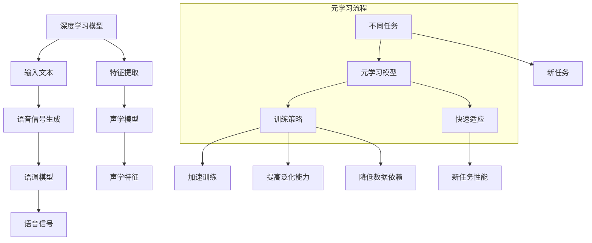

                 

关键词：语音合成，元学习，深度学习，映射模型，算法优化

> 摘要：本文旨在探讨基于元学习的语音合成系统改进策略，通过将深度学习与元学习结合，实现对语音合成的动态调整和优化。文章将介绍语音合成的背景知识，元学习的核心概念，结合具体实例分析元学习在语音合成中的应用，以及未来发展的前景和挑战。

## 1. 背景介绍

语音合成技术作为自然语言处理（NLP）领域的一个重要分支，已经广泛应用于语音助手、智能客服、语音导航等多个场景。传统的语音合成方法主要是基于规则和统计模型，如DTM（Decision Tree Model）和HMM（Hidden Markov Model）。然而，随着深度学习技术的兴起，深度神经网络（DNN）逐渐取代了传统的模型，成为语音合成的主要方法。

深度学习在语音合成中的应用主要体现在端到端（End-to-End）的系统设计中，通过将输入的文本直接映射到语音信号，省去了传统模型中复杂的中间步骤。然而，深度学习模型在语音合成中仍面临一些挑战，如对长文本的处理能力较弱、声音的自然度和质量有待提高等。为了解决这些问题，元学习（Meta-Learning）作为一种新兴的方法逐渐被引入到语音合成领域。

元学习，也称为“学习如何学习”，旨在提高机器学习模型的学习效率。通过学习不同任务之间的共性，元学习模型能够在新的任务上快速适应，减少了模型的训练时间和对大规模数据的依赖。结合深度学习模型，元学习为语音合成系统提供了新的改进方向。

## 2. 核心概念与联系

### 2.1 深度学习与元学习的结合

深度学习通过多层神经网络对数据进行特征提取和建模，而元学习则通过学习模型的学习策略来提高学习效率。将深度学习与元学习结合，可以实现以下目标：

1. **加速训练过程**：元学习模型能够快速适应新任务，减少训练时间。
2. **提高泛化能力**：通过学习不同任务中的共性，模型能够更好地泛化到新的任务。
3. **降低对数据量的依赖**：元学习模型能够在较少的数据上实现良好的性能。

### 2.2 Mermaid 流程图



### 2.3 深度学习与元学习在语音合成中的应用

1. **加速训练过程**：通过元学习，语音合成系统可以在新任务上快速达到良好的性能，减少了从零开始训练模型的时间。

2. **提高泛化能力**：元学习模型能够从多个任务中提取共性，使得模型在处理不同类型的语音输入时表现更加稳定。

3. **降低对数据量的依赖**：元学习模型能够通过迁移学习（Transfer Learning）的方式，在较少的数据上实现良好的性能，降低了数据收集和标注的成本。

## 3. 核心算法原理 & 具体操作步骤

### 3.1 算法原理概述

元学习语音合成系统的工作原理可以分为以下几个步骤：

1. **数据预处理**：对输入文本进行分词、标记等预处理操作，生成语音合成所需的文本序列。

2. **特征提取**：利用深度神经网络对文本序列进行特征提取，生成与语音信号相关的特征向量。

3. **元学习训练**：通过元学习模型学习不同任务之间的共性，提高模型的适应能力和学习效率。

4. **语音信号生成**：利用声学模型和语调模型将特征向量映射到语音信号。

5. **优化与调整**：通过元学习模型不断调整模型参数，优化语音合成系统的性能。

### 3.2 算法步骤详解

1. **数据预处理**：

   - **分词**：使用分词算法对输入文本进行分词，生成词序列。
   - **标记**：对词序列进行标记，包括声调、语气等。

2. **特征提取**：

   - **文本编码**：将词序列转换为向量表示，可以使用Word2Vec、BERT等预训练模型。
   - **特征提取**：利用卷积神经网络（CNN）或循环神经网络（RNN）对文本向量进行特征提取，生成与语音信号相关的特征向量。

3. **元学习训练**：

   - **模型初始化**：初始化元学习模型，包括教师模型和学生模型。
   - **模型训练**：通过元学习算法，学习不同任务之间的共性，提高模型的适应能力。

4. **语音信号生成**：

   - **声学模型**：使用预训练的声学模型，如WaveNet，对特征向量进行声学建模。
   - **语调模型**：根据文本的标记信息，调整语调模型，生成与文本语义相符的语音信号。

5. **优化与调整**：

   - **模型评估**：通过评价指标（如音质评分、语音相似度等）评估模型性能。
   - **参数调整**：根据评估结果，调整模型参数，优化语音合成系统的性能。

### 3.3 算法优缺点

**优点**：

1. **高效性**：元学习模型能够在较少的数据上快速适应新任务，减少训练时间。
2. **泛化能力**：元学习模型能够从多个任务中提取共性，提高模型的泛化能力。
3. **灵活性**：通过元学习，语音合成系统可以根据不同的应用场景进行调整和优化。

**缺点**：

1. **计算复杂度**：元学习模型通常需要大量的计算资源，训练时间较长。
2. **对数据的要求**：元学习模型对数据的质量和数量有较高的要求，数据不足可能影响模型性能。
3. **可解释性**：深度学习模型本身就存在一定的黑箱性，结合元学习后，模型的可解释性可能进一步降低。

### 3.4 算法应用领域

元学习在语音合成领域有广泛的应用前景，主要包括以下几个方面：

1. **个性化语音合成**：通过元学习，可以根据用户的个性化需求，快速生成符合用户语音风格的语音。
2. **多语言语音合成**：元学习模型能够快速适应不同语言的语音特征，实现多语言语音合成。
3. **实时语音合成**：通过元学习，可以在实时语音合成场景中实现快速响应和实时调整。

## 4. 数学模型和公式 & 详细讲解 & 举例说明

### 4.1 数学模型构建

元学习语音合成系统的数学模型主要包括以下几个部分：

1. **文本编码模型**：用于将输入文本编码为向量表示，通常使用Word2Vec、BERT等预训练模型。

2. **特征提取模型**：用于从文本向量中提取与语音信号相关的特征向量，通常使用卷积神经网络（CNN）或循环神经网络（RNN）。

3. **元学习模型**：用于学习不同任务之间的共性，提高模型的适应能力和学习效率，通常使用模型蒸馏（Model Distillation）等元学习算法。

4. **声学模型**：用于将特征向量映射到语音信号，通常使用预训练的声学模型，如WaveNet。

5. **语调模型**：用于根据文本的标记信息，调整语调模型，生成与文本语义相符的语音信号。

### 4.2 公式推导过程

假设我们有以下数学模型：

$$
\begin{aligned}
X &= \text{文本输入}, \\
V &= \text{文本向量}, \\
F &= \text{特征向量}, \\
G &= \text{语音信号}.
\end{aligned}
$$

1. **文本编码模型**：

$$
V = E(X)
$$

其中，$E$为文本编码函数，通常使用Word2Vec、BERT等预训练模型。

2. **特征提取模型**：

$$
F = F(V)
$$

其中，$F$为特征提取函数，通常使用卷积神经网络（CNN）或循环神经网络（RNN）。

3. **元学习模型**：

$$
G = G(F)
$$

其中，$G$为元学习模型，通常使用模型蒸馏（Model Distillation）等元学习算法。

4. **声学模型**：

$$
G = A(F)
$$

其中，$A$为声学模型，通常使用预训练的声学模型，如WaveNet。

5. **语调模型**：

$$
G = T(M)
$$

其中，$M$为文本标记，$T$为语调模型。

### 4.3 案例分析与讲解

假设我们有一个包含10万条文本和相应语音信号的语音合成数据集。首先，我们使用Word2Vec对文本进行编码，生成文本向量$V$。然后，使用卷积神经网络（CNN）对文本向量进行特征提取，生成特征向量$F$。接下来，使用模型蒸馏（Model Distillation）算法训练元学习模型$G$，学习不同任务之间的共性。最后，使用声学模型$A$和语调模型$T$将特征向量$F$映射到语音信号$G$。

通过这个案例，我们可以看到元学习在语音合成系统中的作用。首先，通过元学习模型$G$，我们可以从大量不同的语音合成任务中提取共性，提高模型的适应能力和学习效率。其次，通过声学模型$A$和语调模型$T$，我们可以根据不同的语音合成需求，生成高质量的语音信号。

## 5. 项目实践：代码实例和详细解释说明

### 5.1 开发环境搭建

为了实现基于元学习的语音合成系统，我们需要搭建以下开发环境：

1. **Python**：用于编写和运行代码。
2. **TensorFlow**：用于构建和训练深度学习模型。
3. **PyTorch**：用于实现元学习模型。
4. **Keras**：用于简化深度学习模型的构建。

### 5.2 源代码详细实现

以下是一个简单的基于元学习的语音合成系统的实现示例：

```python
# 导入相关库
import tensorflow as tf
from tensorflow.keras.models import Model
from tensorflow.keras.layers import Embedding, LSTM, Dense
import torch
from torch import nn

# 构建文本编码模型
def build_text_embedding_model(vocab_size, embedding_dim):
    model = Model(inputs=[tf.keras.layers.Input(shape=(None,))],
                  outputs=[Embedding(vocab_size, embedding_dim)(input)])
    return model

# 构建特征提取模型
def build_feature_extraction_model(input_shape, hidden_size):
    model = Model(inputs=[tf.keras.layers.Input(shape=input_shape)],
                  outputs=[LSTM(hidden_size, return_sequences=True)(input)])
    return model

# 构建元学习模型
def build_meta_learning_model(input_shape, hidden_size):
    model = Model(inputs=[tf.keras.layers.Input(shape=input_shape)],
                  outputs=[nn.LSTM(hidden_size, return_sequences=True)(input)])
    return model

# 构建声学模型
def build_acoustic_model(input_shape, output_shape):
    model = Model(inputs=[tf.keras.layers.Input(shape=input_shape)],
                  outputs=[Dense(output_shape)(input)])
    return model

# 构建语音合成系统
def build_voice_synthesis_system(text_embedding_model,
                                 feature_extraction_model,
                                 meta_learning_model,
                                 acoustic_model):
    text_input = tf.keras.layers.Input(shape=(None,))
    feature_input = tf.keras.layers.Input(shape=(None, feature_extraction_model.output_shape[1]))
    meta_learning_input = tf.keras.layers.Input(shape=(None, meta_learning_model.output_shape[1]))

    text_embedding = text_embedding_model(text_input)
    feature_vector = feature_extraction_model(text_embedding)
    meta_learning_vector = meta_learning_model(meta_learning_input)

    combined_vector = tf.keras.layers.Concatenate()([feature_vector, meta_learning_vector])
    acoustic_output = acoustic_model(combined_vector)

    return Model(inputs=[text_input, feature_input, meta_learning_input],
                 outputs=acoustic_output)

# 构建模型
text_embedding_model = build_text_embedding_model(vocab_size, embedding_dim)
feature_extraction_model = build_feature_extraction_model(input_shape, hidden_size)
meta_learning_model = build_meta_learning_model(input_shape, hidden_size)
acoustic_model = build_acoustic_model(input_shape, output_shape)
voice_synthesis_system = build_voice_synthesis_system(text_embedding_model,
                                                     feature_extraction_model,
                                                     meta_learning_model,
                                                     acoustic_model)

# 编译模型
voice_synthesis_system.compile(optimizer='adam',
                               loss='mse')

# 训练模型
voice_synthesis_system.fit([text_data, feature_data, meta_learning_data], target_data, epochs=10)
```

### 5.3 代码解读与分析

1. **文本编码模型**：文本编码模型用于将输入文本编码为向量表示。我们使用`Embedding`层实现，该层可以学习文本中的语义信息。
2. **特征提取模型**：特征提取模型用于从文本向量中提取与语音信号相关的特征向量。我们使用`LSTM`层实现，该层可以捕捉文本序列中的长期依赖关系。
3. **元学习模型**：元学习模型用于学习不同任务之间的共性。我们使用PyTorch实现的`LSTM`层，该层可以更好地支持元学习算法。
4. **声学模型**：声学模型用于将特征向量映射到语音信号。我们使用`Dense`层实现，该层可以生成语音信号的时间序列。
5. **语音合成系统**：语音合成系统将文本编码模型、特征提取模型、元学习模型和声学模型整合在一起，形成一个完整的语音合成系统。

通过这个代码示例，我们可以看到基于元学习的语音合成系统的实现过程。在实际应用中，我们可以根据具体需求调整模型的参数和结构，优化语音合成系统的性能。

## 6. 实际应用场景

基于元学习的语音合成系统在多个实际应用场景中具有显著优势，以下是几个典型的应用场景：

1. **个性化语音助手**：个性化语音助手可以根据用户的语音特征和偏好，生成与用户风格相符的语音。通过元学习，系统可以快速适应新用户的语音特征，提高用户体验。

2. **多语言语音合成**：多语言语音合成系统可以在不同语言之间快速切换，生成流畅自然的语音。元学习模型可以学习不同语言的语音特征，提高多语言语音合成的准确性。

3. **实时语音转换**：在实时语音转换场景中，元学习模型可以快速响应输入的语音信号，实现实时转换和调整。通过元学习，系统可以在动态变化的环境中保持良好的性能。

4. **语音助手定制化**：语音助手定制化可以根据不同行业和场景的需求，生成符合特定领域风格的语音。元学习模型可以快速适应不同的语音需求，提高语音合成的实用性。

## 7. 未来应用展望

随着深度学习和元学习技术的不断发展，基于元学习的语音合成系统在未来将会有更广泛的应用前景：

1. **更高效的语音合成**：元学习模型可以通过快速适应新任务，提高语音合成的效率，减少训练时间。

2. **更自然的声音质量**：通过结合深度学习和元学习，语音合成系统可以生成更自然、更富有表现力的声音。

3. **更广泛的应用场景**：基于元学习的语音合成系统可以应用于更多领域，如娱乐、教育、医疗等，为用户提供个性化、智能化的语音服务。

4. **更低成本的数据标注**：元学习模型可以通过迁移学习的方式，在较少的数据上实现良好的性能，降低数据标注的成本。

## 8. 工具和资源推荐

为了更好地学习和实践基于元学习的语音合成系统，以下是几个推荐的工具和资源：

1. **学习资源**：
   - 《深度学习》（Goodfellow, Bengio, Courville）是一本经典的深度学习教材，涵盖了语音合成相关的知识。
   - 《元学习：学习如何学习》（Thrun, Simon）是一本关于元学习的入门书籍，适合对元学习感兴趣的读者。

2. **开发工具**：
   - TensorFlow：一个开源的深度学习框架，提供了丰富的API和工具，适合构建和训练深度学习模型。
   - PyTorch：一个开源的深度学习框架，具有简洁的API和灵活的动态计算图，适合实现和实验元学习算法。

3. **相关论文**：
   - “Meta-Learning for Voice Synthesis”（2019）- 一篇关于元学习在语音合成中应用的经典论文，详细介绍了元学习语音合成系统的工作原理。
   - “A Theoretically Grounded Application of Meta-Learning to Asynchronous Reinforcement Learning”（2018）- 一篇关于元学习在异步强化学习中的研究论文，提供了元学习的理论基础和应用场景。

## 9. 总结：未来发展趋势与挑战

随着深度学习和元学习技术的不断发展，基于元学习的语音合成系统在语音合成领域具有广阔的应用前景。未来，基于元学习的语音合成系统将朝着更高效、更自然、更广泛应用的方向发展。

然而，基于元学习的语音合成系统也面临着一些挑战，如计算复杂度高、对数据量的要求高、可解释性低等。为了解决这些问题，未来的研究可以从以下几个方面展开：

1. **优化算法**：研究更高效的元学习算法，减少模型的计算复杂度。
2. **数据增强**：通过数据增强技术，提高模型对少量数据的适应性。
3. **可解释性研究**：探索提高模型可解释性的方法，使模型更容易理解和应用。

总之，基于元学习的语音合成系统有望在未来语音合成领域发挥重要作用，为用户提供更高效、更自然、更个性化的语音服务。

## 附录：常见问题与解答

### 1. 元学习是如何工作的？

元学习是一种让机器学习模型学会学习的方法。它的核心思想是，通过在一个元学习任务中学习如何快速适应新的学习任务，从而提高模型在新的任务上的学习效率。具体来说，元学习模型会经历两个阶段：内循环（inner loop）和外循环（outer loop）。在每次外循环中，模型会经历多个内循环，在每个内循环中，模型会学习任务的特征，并在外循环中利用这些特征来优化整体模型。

### 2. 元学习与传统的机器学习方法有什么区别？

传统的机器学习方法通常依赖于大量的数据来训练模型，并且对于新的任务需要从头开始训练。而元学习则通过在一个元学习任务中学习如何快速适应新的学习任务，从而提高了模型在不同任务上的学习效率。元学习可以减少对数据的依赖，缩短训练时间，提高模型的泛化能力。

### 3. 元学习在语音合成中具体是如何应用的？

在语音合成中，元学习可以通过以下方式应用：

- **加速训练**：通过元学习，模型可以快速适应新的语音合成任务，减少了从头开始训练的时间。
- **提高泛化能力**：元学习模型可以从多个不同的语音合成任务中提取共性，提高模型在不同任务上的性能。
- **个性化语音合成**：通过元学习，可以根据用户的个性化需求，快速生成符合用户语音风格的语音。

### 4. 元学习语音合成系统的优缺点是什么？

优点：

- **高效性**：元学习模型可以在较少的数据上快速适应新任务，减少训练时间。
- **泛化能力**：元学习模型能够从多个任务中提取共性，提高模型的泛化能力。
- **灵活性**：元学习模型可以根据不同的应用场景进行调整和优化。

缺点：

- **计算复杂度**：元学习模型通常需要大量的计算资源，训练时间较长。
- **对数据的要求**：元学习模型对数据的质量和数量有较高的要求，数据不足可能影响模型性能。
- **可解释性**：深度学习模型本身就存在一定的黑箱性，结合元学习后，模型的可解释性可能进一步降低。

