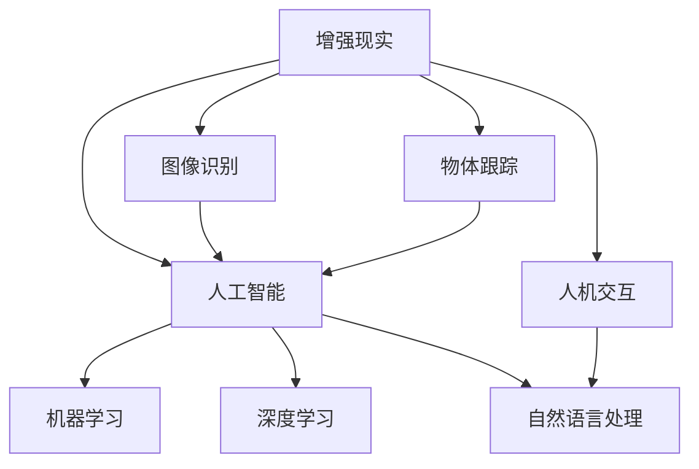

                 

关键词：增强现实(AR)，人工智能(AI)，深度学习，图像识别，映射技术，人机交互，虚拟现实(VR)，计算机视觉，机器学习

> 摘要：本文将探讨增强现实(AR)中的人工智能驱动技术，深入分析AR技术的核心概念和其在各领域的应用。我们将讨论AR系统中的关键算法，包括图像识别、计算机视觉和机器学习。此外，文章还将展示实际项目中的代码实例，并展望未来AR与AI融合的发展趋势。

## 1. 背景介绍

### 1.1 增强现实的定义与发展

增强现实（Augmented Reality，AR）是一种通过计算机技术将虚拟信息与现实世界融合的技术。它能够将计算机生成的信息叠加到用户眼前的真实环境中，使用户能够与虚拟信息互动。增强现实起源于虚拟现实（Virtual Reality，VR），但与VR完全沉浸式的体验不同，AR用户仍然能够保持与现实世界的联系。

自20世纪90年代以来，AR技术得到了迅速发展。随着计算能力的提升和移动设备的普及，AR技术逐渐从实验室走向了日常生活。从简单的屏幕叠加到复杂的实时图像识别和3D物体生成，AR技术展示了巨大的潜力和应用前景。

### 1.2 人工智能在AR中的作用

人工智能（AI）在AR技术中的应用极大地提升了AR系统的交互性和智能化水平。AI技术，尤其是机器学习和深度学习，使得AR系统能够实时处理和分析大量的视觉数据，从而实现更精确的虚拟信息叠加和更自然的用户交互。

在AR系统中，人工智能主要用于以下几个方面：

- **图像识别**：通过深度学习算法，AR系统可以识别现实世界中的物体、场景和标志，从而进行精确的虚拟信息叠加。
- **物体跟踪**：AI算法可以跟踪并识别用户在现实世界中的动作，从而实现与虚拟信息的互动。
- **自然语言处理**：通过自然语言处理技术，AR系统可以理解用户的语音指令，提供更加人性化的交互体验。
- **场景理解**：AI系统能够对现实场景进行理解和分析，从而优化虚拟信息的呈现方式。

## 2. 核心概念与联系

为了更好地理解AR中的AI驱动技术，我们首先需要介绍几个核心概念，并使用Mermaid流程图展示它们之间的联系。

### 2.1 核心概念

- **增强现实（AR）**：通过计算机技术将虚拟信息叠加到现实环境中。
- **人工智能（AI）**：包括机器学习、深度学习、自然语言处理等技术，用于处理和分析数据。
- **图像识别**：通过AI算法识别现实世界中的物体和场景。
- **物体跟踪**：AI算法跟踪并识别用户在现实中的动作。
- **人机交互**：用户与AR系统之间的交互过程。

### 2.2 Mermaid 流程图



## 3. 核心算法原理 & 具体操作步骤

### 3.1 算法原理概述

在AR系统中，核心算法包括图像识别、物体跟踪和人机交互等。这些算法主要通过深度学习和计算机视觉技术实现。

- **图像识别**：使用卷积神经网络（CNN）对图像进行特征提取和分类，从而识别现实世界中的物体。
- **物体跟踪**：使用光流法、多帧匹配等方法跟踪物体的位置和运动。
- **人机交互**：通过自然语言处理（NLP）技术理解用户的语音指令，并通过语音合成技术返回反馈。

### 3.2 算法步骤详解

#### 3.2.1 图像识别

1. **图像采集**：通过摄像头捕捉现实世界中的图像。
2. **预处理**：对图像进行缩放、裁剪、灰度化等预处理操作。
3. **特征提取**：使用CNN提取图像的特征。
4. **分类**：使用预训练的模型或自定义模型对图像进行分类。
5. **输出结果**：将识别结果叠加到现实环境中。

#### 3.2.2 物体跟踪

1. **初始化**：根据图像识别结果确定初始跟踪区域。
2. **光流法**：计算相邻帧之间的像素位移，确定物体的运动轨迹。
3. **多帧匹配**：通过图像匹配算法更新物体的位置和运动轨迹。
4. **反馈**：将跟踪结果反馈给用户，如通过摄像头视图显示追踪框。

#### 3.2.3 人机交互

1. **语音识别**：使用语音识别技术将用户的语音转化为文本。
2. **自然语言理解**：使用NLP技术理解用户的指令。
3. **语音合成**：使用语音合成技术生成系统的反馈语音。
4. **交互反馈**：通过语音或屏幕文字反馈给用户。

### 3.3 算法优缺点

#### 3.3.1 图像识别

- **优点**：能够精确识别多种物体和场景，提升AR系统的交互性和智能化水平。
- **缺点**：对光照、角度和图像质量要求较高，且在复杂场景中可能存在识别错误。

#### 3.3.2 物体跟踪

- **优点**：实时性强，能够快速响应用户动作，提高用户体验。
- **缺点**：在动态场景中可能存在跟踪丢失的问题，且计算资源消耗较大。

#### 3.3.3 人机交互

- **优点**：提供更加自然和直观的交互方式，提升用户的使用体验。
- **缺点**：对语音识别和自然语言理解技术的依赖较高，可能存在识别错误或理解偏差。

### 3.4 算法应用领域

- **医疗**：通过AR技术辅助医生进行手术，提供实时的3D图像和手术指导。
- **教育**：通过AR技术增强课堂教学，提供互动式学习体验。
- **娱乐**：通过AR技术创造全新的游戏和娱乐体验。
- **工业**：通过AR技术提升工业设计和维修的效率。

## 4. 数学模型和公式 & 详细讲解 & 举例说明

### 4.1 数学模型构建

在AR系统中，常用的数学模型包括卷积神经网络（CNN）、循环神经网络（RNN）和生成对抗网络（GAN）等。以下以CNN为例进行详细讲解。

#### 4.1.1 卷积神经网络（CNN）

CNN是一种前馈神经网络，特别适合处理图像数据。其核心思想是通过多层卷积和池化操作提取图像特征。

#### 4.1.2 数学公式

1. **卷积操作**：
   $$ (f * g)(x) = \sum_{y} f(y) \cdot g(x-y) $$

2. **池化操作**：
   $$ P(y) = \max(P(y_1), P(y_2), ..., P(y_n)) $$

3. **反向传播**：
   $$ \delta_{i,j} = \frac{\partial E}{\partial w_{i,j}} = -\frac{\partial L}{\partial a_{j}} \cdot \frac{\partial a_{j}}{\partial z_{j}} \cdot \frac{\partial z_{j}}{\partial w_{i,j}} $$

### 4.2 公式推导过程

假设我们有一个简单的CNN模型，包含一个卷积层和一个全连接层。我们以卷积操作为例，推导其数学公式。

1. **卷积操作**：

   设输入图像为 \( I \in \mathbb{R}^{H \times W \times C} \)，卷积核为 \( K \in \mathbb{R}^{F \times F \times C} \)，输出特征图为 \( O \in \mathbb{R}^{H' \times W' \times 1} \)。

   根据卷积操作的公式，我们有：
   $$ O(x,y) = \sum_{c} I(x_c, y_c) \cdot K(c,x-y,y-y) $$

   其中，\( x_c \) 和 \( y_c \) 分别表示输入图像和卷积核在空间上的坐标。

2. **反向传播**：

   在反向传播过程中，我们需要计算卷积核的梯度。根据链式法则，我们有：
   $$ \frac{\partial L}{\partial K} = \frac{\partial L}{\partial O} \cdot \frac{\partial O}{\partial K} = \frac{\partial L}{\partial O} \cdot \frac{\partial O}{\partial I} \cdot \frac{\partial I}{\partial K} $$

   由于卷积操作是线性的，\( \frac{\partial O}{\partial I} = I \)，因此：
   $$ \frac{\partial L}{\partial K} = \frac{\partial L}{\partial O} \cdot I $$

   同理，对于 \( I \) 的梯度，我们有：
   $$ \frac{\partial L}{\partial I} = \frac{\partial L}{\partial O} \cdot \frac{\partial O}{\partial K} $$

### 4.3 案例分析与讲解

假设我们有一个简单的图像识别任务，输入图像为 \( 32 \times 32 \times 3 \)，卷积核大小为 \( 3 \times 3 \)，输出特征图大小为 \( 30 \times 30 \)。

1. **卷积操作**：

   根据卷积操作的公式，我们有：
   $$ O(x,y) = \sum_{c} I(x_c, y_c) \cdot K(c,x-y,y-y) $$

   其中，\( x_c \) 和 \( y_c \) 分别在 \( [0, 32] \) 的范围内取值。

2. **反向传播**：

   在反向传播过程中，我们需要计算卷积核和输入图像的梯度。

   - **卷积核的梯度**：
     $$ \frac{\partial L}{\partial K} = \frac{\partial L}{\partial O} \cdot I $$
     
     其中，\( \frac{\partial L}{\partial O} \) 是输出特征图的梯度，\( I \) 是输入图像。

   - **输入图像的梯度**：
     $$ \frac{\partial L}{\partial I} = \frac{\partial L}{\partial O} \cdot \frac{\partial O}{\partial K} $$
     
     由于卷积操作是线性的，\( \frac{\partial O}{\partial K} = I \)，因此：
     $$ \frac{\partial L}{\partial I} = \frac{\partial L}{\partial O} \cdot I $$

## 5. 项目实践：代码实例和详细解释说明

### 5.1 开发环境搭建

为了进行AR项目的开发，我们需要搭建一个合适的开发环境。以下是推荐的开发工具和软件：

- **操作系统**：Windows或macOS
- **编程语言**：Python
- **框架**：PyTorch（深度学习框架）
- **AR框架**：ARCore（Google开发的AR框架）或ARKit（Apple开发的AR框架）

### 5.2 源代码详细实现

以下是一个简单的AR项目实例，展示了如何使用PyTorch和ARCore实现图像识别和物体跟踪。

```python
import torch
import torchvision.models as models
import numpy as np
import cv2

# 加载预训练的卷积神经网络模型
model = models.resnet50(pretrained=True)
model.eval()

# 读取摄像头画面
cap = cv2.VideoCapture(0)

while True:
    # 读取一帧画面
    ret, frame = cap.read()
    
    # 对画面进行预处理
    frame = cv2.resize(frame, (224, 224))
    frame = frame[:, :, ::-1].transpose(2, 0, 1)
    frame = torch.tensor(frame).float()
    frame = torch.unsqueeze(frame, 0)
    
    # 进行图像识别
    with torch.no_grad():
        output = model(frame)
    _, index = torch.max(output, 1)
    predicted_class = index.item()
    
    # 根据识别结果在画面上叠加文字
    cv2.putText(frame, f"Object: {predicted_class}", (10, 30), cv2.FONT_HERSHEY_SIMPLEX, 1, (0, 0, 255), 2)
    
    # 显示画面
    cv2.imshow('AR Camera', frame)
    
    # 按下'q'键退出循环
    if cv2.waitKey(1) & 0xFF == ord('q'):
        break

# 释放摄像头资源
cap.release()
cv2.destroyAllWindows()
```

### 5.3 代码解读与分析

1. **加载模型**：我们使用预训练的ResNet-50模型，这是一个常用的卷积神经网络模型，适用于多种图像识别任务。

2. **读取画面**：通过OpenCV库读取摄像头画面。这里我们假设摄像头已经打开并连接到计算机。

3. **预处理画面**：对画面进行缩放和色彩转换，使其符合模型的输入要求。同时，将画面转换为Tensor格式，便于PyTorch操作。

4. **图像识别**：使用模型对预处理后的画面进行识别。由于模型是预训练的，我们可以直接使用其输出结果。

5. **叠加文字**：根据识别结果，在画面上叠加文字，以便用户查看。

6. **显示画面**：使用OpenCV库显示处理后的画面。

7. **退出循环**：用户可以通过按下'q'键退出程序。

### 5.4 运行结果展示

运行上述代码后，摄像头画面会实时显示在窗口中。每次捕获一帧画面，程序会对其进行预处理和图像识别，并在画面上叠加识别结果。用户可以看到实时变化的识别结果，从而实现简单的AR应用。

## 6. 实际应用场景

### 6.1 医疗

在医疗领域，AR技术可以辅助医生进行手术。通过将3D图像叠加在手术现场，医生可以更直观地了解患者体内的解剖结构，提高手术的精确度和成功率。此外，AR技术还可以用于医疗培训，通过虚拟患者和场景模拟，医生和医学生可以更安全地学习和练习手术技巧。

### 6.2 教育

在教育领域，AR技术可以增强课堂教学，提供更加丰富的学习体验。教师可以使用AR应用程序将知识点以三维形式展示给学生，使学生能够更直观地理解和记忆。例如，在生物学课堂上，学生可以通过AR眼镜看到细胞和组织的3D模型，从而更好地理解生物学概念。

### 6.3 娱乐

在娱乐领域，AR技术为游戏和虚拟现实体验带来了全新的可能。通过将虚拟角色和环境与现实世界融合，用户可以体验到更加逼真的游戏场景。此外，AR技术还可以用于虚拟旅游、现场表演等娱乐活动，为用户带来独特的互动体验。

### 6.4 工业

在工业领域，AR技术可以提高设计和维修的效率。通过在现实场景中叠加设计图纸和维修指南，工程师可以更快速地找到问题并进行修复。此外，AR技术还可以用于远程协作，使工程师能够实时与现场人员进行沟通和协作，提高工作效率。

## 7. 工具和资源推荐

### 7.1 学习资源推荐

- **《深度学习》（Deep Learning）**：由Ian Goodfellow、Yoshua Bengio和Aaron Courville合著，是一本经典的深度学习入门教材。
- **《增强现实技术与应用》（Augmented Reality: Principles and Practice）**：由Daniel Thalmann和William L. Richards合著，详细介绍了AR技术的原理和应用。

### 7.2 开发工具推荐

- **ARCore**：Google开发的AR开发框架，适用于Android和iOS平台。
- **ARKit**：Apple开发的AR开发框架，仅适用于iOS平台。
- **PyTorch**：用于深度学习和计算机视觉的开源Python库。

### 7.3 相关论文推荐

- **“Mobile Augmented Reality: an Overview”**：一篇综述性论文，介绍了移动AR技术的发展和应用。
- **“Deep Learning for Augmented Reality”**：一篇关于深度学习在AR中应用的论文，详细讨论了AR系统中的深度学习算法。

## 8. 总结：未来发展趋势与挑战

### 8.1 研究成果总结

近年来，AR和AI技术在各个领域取得了显著成果。从图像识别和物体跟踪到自然语言处理和人机交互，AR系统在智能化和交互性方面取得了巨大进步。同时，深度学习和计算机视觉技术的发展为AR系统的性能提升提供了强有力的支持。

### 8.2 未来发展趋势

未来，AR和AI技术将继续融合发展，推动AR技术的广泛应用。以下是一些发展趋势：

- **更加逼真的交互体验**：随着计算能力和算法的进步，AR系统将提供更加逼真和自然的交互体验。
- **跨平台兼容性**：AR技术将更加跨平台，支持多种设备和操作系统。
- **垂直行业应用**：AR技术在医疗、教育、工业等垂直行业的应用将更加深入，提供行业定制化的解决方案。
- **隐私和安全**：随着AR技术的普及，隐私和安全问题将变得更加重要，需要采取有效的措施保护用户数据。

### 8.3 面临的挑战

尽管AR和AI技术在各个方面取得了显著进展，但仍面临一些挑战：

- **性能优化**：在低计算资源和低带宽环境下，如何优化AR系统的性能，提供流畅的用户体验。
- **数据隐私和安全**：如何保护用户数据隐私，防止数据泄露和滥用。
- **算法公平性和可解释性**：如何确保AI算法的公平性和可解释性，避免歧视和偏见。
- **标准化和规范化**：如何制定统一的AR标准和规范，促进技术的互操作性和可维护性。

### 8.4 研究展望

未来，AR和AI技术的融合将带来更多的创新和应用。研究者可以关注以下方向：

- **新型传感器和显示技术**：开发新型传感器和显示技术，提升AR系统的感知能力和显示效果。
- **跨学科研究**：结合心理学、人机交互、计算机图形学等多学科知识，探索更加自然和高效的AR交互方式。
- **边缘计算**：通过边缘计算技术，降低AR系统的计算和通信负担，提高系统的响应速度和稳定性。

## 9. 附录：常见问题与解答

### 9.1 增强现实（AR）是什么？

增强现实（AR）是一种通过计算机技术将虚拟信息叠加到现实世界中的技术。用户通过摄像头或其他传感器捕捉现实世界的画面，计算机处理并叠加虚拟信息，使用户能够在现实环境中看到虚拟元素。

### 9.2 人工智能（AI）在AR中有哪些应用？

人工智能（AI）在AR中的应用非常广泛，包括图像识别、物体跟踪、自然语言处理和人机交互等。AI技术可以实时处理和分析大量的视觉数据，提高AR系统的交互性和智能化水平。

### 9.3 如何选择AR开发框架？

选择AR开发框架时，应考虑以下因素：

- **平台兼容性**：框架是否支持目标平台（如Android、iOS）。
- **性能**：框架是否能够提供流畅的用户体验。
- **社区和支持**：框架是否有活跃的社区和支持资源。

常见的AR开发框架包括ARCore（Google）、ARKit（Apple）和Vuforia（Facebook）。

### 9.4 AR技术在哪些领域有应用？

AR技术在医疗、教育、娱乐、工业、营销等多个领域有广泛应用。例如，在医疗领域，AR技术可以辅助医生进行手术和培训；在教育领域，AR技术可以增强课堂教学和互动体验。

### 9.5 AR技术有哪些隐私和安全挑战？

AR技术的隐私和安全挑战主要包括：

- **用户数据隐私**：如何保护用户在AR环境中产生的数据。
- **设备安全**：防止恶意软件和攻击对AR设备造成危害。
- **算法公平性和透明度**：确保AI算法的公平性和透明度，避免歧视和偏见。

解决这些挑战需要采取有效的隐私保护和安全措施，如数据加密、访问控制和算法解释性等。

## 作者署名

作者：禅与计算机程序设计艺术 / Zen and the Art of Computer Programming

