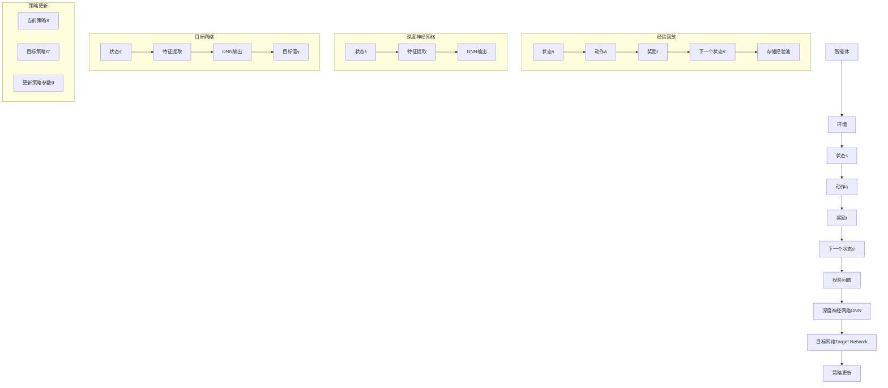

                 

关键词：深度强化学习、DQN、非标准环境、适应性、性能优化

> 摘要：本文将探讨深度确定性策略梯度（DQN）算法在非标准环境下的适应性。通过分析DQN算法的基本原理、数学模型和具体实现，本文旨在深入理解DQN在复杂和非标准环境中的表现，并提出优化策略，以提升其在非标准环境下的性能。

## 1. 背景介绍

深度强化学习（Deep Reinforcement Learning，DRL）是强化学习（Reinforcement Learning，RL）与深度学习（Deep Learning，DL）相结合的一种学习方法。它利用深度神经网络（DNN）来近似状态值函数或策略，从而提高学习效率和性能。DQN（Deep Q-Network）是DRL中的一种经典算法，由DeepMind在2015年提出。DQN通过将Q-learning与深度神经网络相结合，实现了在复杂环境中的自主学习和决策。

然而，传统DQN算法主要针对标准环境（如Atari游戏）进行设计。在非标准环境（如机器人控制、自动驾驶等），DQN的表现可能会受到限制。非标准环境通常具有以下特点：

- **动态变化**：环境状态变化快速且不可预测。
- **高维状态**：环境状态维度较高，难以用传统方法表示。
- **延迟反馈**：环境反馈具有延迟性，导致学习效率降低。

因此，本文将探讨DQN在非标准环境下的适应性，并分析其在这些环境中的挑战和优化策略。

### 1.1 DQN算法的基本原理

DQN算法的核心思想是通过学习状态值函数来指导智能体的行为选择。具体来说，DQN包括以下几个关键组成部分：

- **经验回放（Experience Replay）**：为了避免学习过程中的样本相关性，DQN采用经验回放机制。经验回放将智能体在不同时间步的状态、动作、奖励和下一个状态存储在一个经验池中，并在训练过程中随机抽取样本进行学习。
- **深度神经网络（DNN）近似Q值函数**：DQN使用DNN来近似状态值函数Q(s, a)，其中s表示当前状态，a表示当前动作，Q(s, a)表示在状态s下执行动作a的期望回报。
- **目标网络（Target Network）**：为了避免梯度消失和梯度爆炸问题，DQN引入了目标网络。目标网络是一个参数与DNN相同的独立网络，用于计算目标值y，即预期回报。在训练过程中，目标网络的参数会定期更新为DNN的参数。

通过以上三个组成部分，DQN实现了在复杂环境中的自主学习和决策。

### 1.2 非标准环境的特点

非标准环境与标准环境（如Atari游戏）相比，具有以下特点：

- **动态变化**：非标准环境中的状态变化更加快速和不可预测，这可能对DQN的学习过程造成干扰。
- **高维状态**：非标准环境中的状态维度通常较高，这使得DNN难以有效表示和建模状态空间。
- **延迟反馈**：非标准环境中的反馈具有延迟性，导致DQN的学习效率降低。例如，在机器人控制中，智能体可能需要经过多个时间步才能获得最终的奖励。

这些特点使得DQN在非标准环境中的表现可能受到限制，需要进一步优化和改进。

### 1.3 本文的结构

本文将分为以下几个部分：

1. **背景介绍**：简要介绍DQN算法的基本原理和非标准环境的特点。
2. **核心概念与联系**：通过Mermaid流程图详细描述DQN算法的原理和架构。
3. **核心算法原理 & 具体操作步骤**：详细讲解DQN算法的原理、步骤和优缺点。
4. **数学模型和公式 & 详细讲解 & 举例说明**：介绍DQN算法的数学模型和公式，并进行举例说明。
5. **项目实践：代码实例和详细解释说明**：提供DQN算法的代码实例和详细解释说明。
6. **实际应用场景**：探讨DQN在非标准环境中的应用场景和未来应用展望。
7. **工具和资源推荐**：推荐学习资源、开发工具和相关论文。
8. **总结：未来发展趋势与挑战**：总结研究成果、探讨未来发展趋势和面临的挑战。
9. **附录：常见问题与解答**：回答读者可能遇到的问题。

通过以上结构，本文旨在全面探讨DQN在非标准环境下的适应性，并提出优化策略，以提升其在这些环境中的性能。

### 2. 核心概念与联系

在深入探讨DQN算法之前，我们需要了解其核心概念和组成部分。以下将通过Mermaid流程图详细描述DQN算法的原理和架构。



**图1：DQN算法的核心概念与联系**

**图1**展示了DQN算法的核心组成部分及其相互关系。智能体与环境之间进行交互，通过经验回放机制存储经验，使用深度神经网络DNN近似Q值函数，并通过目标网络和策略更新过程实现智能体的自主学习。

### 3. 核心算法原理 & 具体操作步骤

#### 3.1 算法原理概述

DQN算法基于Q-learning算法，通过深度神经网络DNN来近似Q值函数。Q值函数表示在给定状态下执行特定动作的预期回报。通过最大化Q值函数，智能体可以学习到最优策略。DQN算法的关键组成部分包括经验回放、深度神经网络、目标网络和策略更新。

**经验回放**：为了减少样本相关性，DQN采用经验回放机制。经验回放将智能体在不同时间步的状态、动作、奖励和下一个状态存储在一个经验池中，并在训练过程中随机抽取样本进行学习。经验回放有助于智能体从随机样本中学习，并减少样本偏差。

**深度神经网络DNN**：DQN使用DNN来近似Q值函数。DNN通过多层神经网络对状态进行特征提取和表示，从而提高Q值函数的近似能力。在训练过程中，DNN的参数会根据经验回放的样本进行更新，以最小化Q值函数的误差。

**目标网络**：为了避免梯度消失和梯度爆炸问题，DQN引入了目标网络。目标网络是一个参数与DNN相同的独立网络，用于计算目标值y，即预期回报。在训练过程中，目标网络的参数会定期更新为DNN的参数。目标网络的存在使得DQN算法可以稳定地更新策略参数。

**策略更新**：DQN算法通过策略更新过程实现智能体的自主学习。策略更新基于当前策略π和目标策略π'。当前策略π是根据当前DNN的参数θ确定的，而目标策略π'是根据目标网络DNN'的参数θ'确定的。通过优化目标策略π'，智能体可以逐渐学习到最优策略。

#### 3.2 算法步骤详解

**步骤1：初始化**

- 初始化智能体和环境。
- 初始化深度神经网络DNN和目标网络DNN'，并设置初始参数θ和θ'。
- 初始化经验池，并设置经验池的最大容量。

**步骤2：选择动作**

- 根据当前状态s，使用当前策略π选择动作a。
- 当前策略π可以是ε-贪心策略，即以概率ε选择随机动作，以1-ε概率选择根据DNN预测的动作。

**步骤3：执行动作**

- 在环境中执行动作a，并获取下一个状态s'和奖励r。

**步骤4：更新经验池**

- 将当前状态s、动作a、奖励r和下一个状态s'存储到经验池中。

**步骤5：选择样本**

- 从经验池中随机选择一批样本{(s_i, a_i, r_i, s'_i)}。

**步骤6：计算目标值**

- 对于每个样本，计算目标值y_i：
  $$y_i = r_i + \gamma \max_{a'} Q(s'_i, a')$$
  其中，γ是折扣因子，用于考虑未来回报的重要性。

**步骤7：更新DNN**

- 使用目标值y_i和当前状态值Q(s_i, a_i)计算损失函数：
  $$L(\theta) = \frac{1}{N} \sum_{i=1}^N (y_i - Q(s_i, a_i))^2$$
  其中，N是样本的数量。

- 通过反向传播和梯度下降更新DNN的参数θ。

**步骤8：更新目标网络**

- 按照一定策略定期更新目标网络DNN'的参数θ'为DNN的参数θ。

**步骤9：重复步骤2-8**

- 重复执行步骤2-8，直到达到预定的训练次数或智能体性能达到预期。

#### 3.3 算法优缺点

**优点**

1. **适用于高维状态空间**：DQN使用深度神经网络来近似Q值函数，可以处理高维状态空间，这在标准环境下具有优势。
2. **无需模型先验知识**：DQN算法不需要对环境模型进行先验知识的假设，具有较强的通用性。
3. **自适应性强**：DQN算法通过经验回放和目标网络机制，可以自适应地处理不同类型的样本，提高学习效率和稳定性。

**缺点**

1. **训练效率低**：由于深度神经网络的训练过程需要大量计算资源，DQN算法的训练效率相对较低。
2. **收敛速度慢**：在非标准环境下，DQN算法可能需要较长的训练时间才能收敛到最优策略。
3. **方差问题**：在训练过程中，DQN算法容易受到样本方差的影响，导致学习结果不稳定。

#### 3.4 算法应用领域

DQN算法在非标准环境中的应用领域广泛，包括但不限于：

1. **机器人控制**：DQN算法可以应用于机器人控制领域，实现自主导航、路径规划和任务执行。
2. **自动驾驶**：DQN算法可以应用于自动驾驶领域，实现车辆与环境的安全交互和智能驾驶。
3. **游戏开发**：DQN算法可以应用于游戏开发领域，实现游戏角色的智能行为和策略优化。
4. **金融交易**：DQN算法可以应用于金融交易领域，实现交易策略的自动优化和风险管理。

### 4. 数学模型和公式 & 详细讲解 & 举例说明

#### 4.1 数学模型构建

DQN算法的核心在于学习状态值函数Q(s, a)，即给定状态s和动作a的预期回报。以下是DQN算法的数学模型：

1. **状态值函数Q(s, a)**

   $$Q(s, a) = \sum_{s'} P(s'|s, a) \sum_{r} r P(r|s', a) + \gamma \max_{a'} Q(s', a')$$

   其中，$P(s'|s, a)$是状态转移概率，$P(r|s', a)$是奖励概率，$\gamma$是折扣因子。

2. **策略π**

   $$\pi(a|s) = \begin{cases}
   1 - \epsilon & \text{随机动作} \\
   \epsilon / K & \text{根据DNN输出选择动作} \\
   \end{cases}$$

   其中，$\epsilon$是探索概率，$K$是动作数量。

3. **目标值y**

   $$y = r + \gamma \max_{a'} Q(s', a')$$

   其中，$r$是立即奖励，$s'$是下一个状态，$\gamma$是折扣因子。

#### 4.2 公式推导过程

DQN算法的推导过程主要包括两部分：Q值函数的估计和策略的更新。

1. **Q值函数的估计**

   Q值函数的估计是通过经验回放和梯度下降实现的。以下是Q值函数的估计过程：

   - **初始化**：初始化Q值函数估计值$Q(s, a)$为随机值。
   - **经验回放**：从经验池中随机选择一批样本{(s_i, a_i, r_i, s'_i)}。
   - **目标值计算**：对于每个样本，计算目标值$y_i$：
     $$y_i = r_i + \gamma \max_{a'} Q(s'_i, a')$$
   - **梯度下降**：通过反向传播和梯度下降更新Q值函数估计值$Q(s, a)$：
     $$\theta \leftarrow \theta - \alpha \nabla_{\theta} L(\theta)$$

     其中，$\theta$是DNN的参数，$\alpha$是学习率，$L(\theta)$是损失函数。

2. **策略的更新**

   策略的更新是基于当前策略π和目标策略π'实现的。以下是策略的更新过程：

   - **当前策略π**：根据当前Q值函数估计值$Q(s, a)$和探索概率$\epsilon$，选择动作：
     $$a = \pi(a|s)$$
   - **目标策略π'**：根据目标Q值函数估计值$Q'(s, a)$和探索概率$\epsilon$，选择动作：
     $$a' = \pi'(a'|s')$$
   - **策略更新**：通过优化目标策略π'，更新当前策略π：
     $$\theta \leftarrow \theta - \alpha \nabla_{\theta} L(\theta)$$

     其中，$L(\theta)$是策略损失函数。

#### 4.3 案例分析与讲解

以下是一个简单的案例，说明DQN算法在非标准环境中的应用。

**案例：机器人路径规划**

假设我们有一个机器人需要在未知环境中找到从起点到终点的最短路径。机器人可以执行的动作包括向左、向右和前进。环境的奖励函数定义为：

- 成功到达终点时，奖励为+100。
- 每走一步，奖励为-1。
- 遇到墙壁时，奖励为-10。

我们需要使用DQN算法训练机器人找到最优路径。

**步骤1：初始化**

- 初始化Q值函数估计值$Q(s, a)$为随机值。
- 初始化当前策略π和目标策略π'。

**步骤2：选择动作**

- 根据当前状态s，使用当前策略π选择动作a。

**步骤3：执行动作**

- 在环境中执行动作a，并获取下一个状态s'和奖励r。

**步骤4：更新经验池**

- 将当前状态s、动作a、奖励r和下一个状态s'存储到经验池中。

**步骤5：选择样本**

- 从经验池中随机选择一批样本{(s_i, a_i, r_i, s'_i)}。

**步骤6：计算目标值**

- 对于每个样本，计算目标值$y_i$：
  $$y_i = r_i + \gamma \max_{a'} Q(s'_i, a')$$

**步骤7：更新DNN**

- 使用目标值$y_i$和当前状态值$Q(s_i, a_i)$计算损失函数：
  $$L(\theta) = \frac{1}{N} \sum_{i=1}^N (y_i - Q(s_i, a_i))^2$$
- 通过反向传播和梯度下降更新DNN的参数θ。

**步骤8：更新目标网络**

- 按照一定策略定期更新目标网络DNN'的参数θ'为DNN的参数θ。

**步骤9：重复步骤2-8**

- 重复执行步骤2-8，直到达到预定的训练次数或机器人找到最优路径。

通过以上步骤，机器人可以逐步学习到最优路径，从而在未知环境中实现自主导航。

### 5. 项目实践：代码实例和详细解释说明

在本节中，我们将提供一个DQN算法的代码实例，并对关键部分进行详细解释。

```python
import numpy as np
import random
import gym

# 初始化环境
env = gym.make("CartPole-v0")

# 初始化参数
learning_rate = 0.01
gamma = 0.99
epsilon = 0.1
epsilon_decay = 0.99
epsilon_min = 0.01
num_episodes = 1000

# 初始化Q值函数
Q = np.zeros([env.observation_space.n, env.action_space.n])

# 训练DQN算法
for episode in range(num_episodes):
    state = env.reset()
    done = False
    total_reward = 0

    while not done:
        # 根据当前策略选择动作
        if random.uniform(0, 1) < epsilon:
            action = random.randint(0, env.action_space.n - 1)
        else:
            action = np.argmax(Q[state])

        # 执行动作并获取下一个状态和奖励
        next_state, reward, done, _ = env.step(action)
        total_reward += reward

        # 更新Q值函数
        Q[state, action] = Q[state, action] + learning_rate * (reward + gamma * np.max(Q[next_state]) - Q[state, action])

        # 更新状态
        state = next_state

    # 更新探索概率
    epsilon = max(epsilon_min, epsilon_decay * epsilon)

    # 输出训练结果
    print(f"Episode: {episode}, Total Reward: {total_reward}")

# 关闭环境
env.close()
```

**5.1 开发环境搭建**

为了运行上述代码实例，你需要搭建一个Python开发环境。以下是搭建步骤：

1. 安装Python：从官方网站下载并安装Python。
2. 安装必要的库：在命令行中执行以下命令安装所需的库：
   ```shell
   pip install numpy gym
   ```

**5.2 源代码详细实现**

以下是代码的详细解释：

- **初始化环境**：使用`gym.make("CartPole-v0")`初始化环境。`CartPole-v0`是一个简单的控制任务，旨在保持一个杆在水平位置。
- **初始化参数**：设置学习率、折扣因子、探索概率和探索概率衰减。
- **初始化Q值函数**：使用`np.zeros([env.observation_space.n, env.action_space.n])`初始化Q值函数。
- **训练DQN算法**：通过循环执行以下步骤：
  - 初始化状态。
  - 在每个时间步根据当前策略选择动作。
  - 执行动作并获取下一个状态和奖励。
  - 更新Q值函数。
  - 更新探索概率。
  - 输出训练结果。
- **关闭环境**：在训练完成后关闭环境。

**5.3 代码解读与分析**

- **初始化环境**：`env = gym.make("CartPole-v0")`创建了一个CartPole环境的实例。这个环境的目标是控制一个杆保持水平。
- **初始化参数**：设置学习率、折扣因子和探索概率等参数。学习率控制Q值函数更新的幅度，折扣因子用于考虑未来的回报，探索概率用于在训练初期增加随机性，以避免过早收敛。
- **初始化Q值函数**：`Q = np.zeros([env.observation_space.n, env.action_space.n])`创建一个Q值函数矩阵，用于存储状态和动作的预期回报。
- **训练DQN算法**：使用一个循环来训练DQN算法。每个时间步执行以下操作：
  - `state = env.reset()`初始化状态。
  - `done = False`设置标志，指示是否完成一个回合。
  - `while not done:`在回合未完成时循环。
  - `if random.uniform(0, 1) < epsilon:`根据探索概率选择动作。
  - `next_state, reward, done, _ = env.step(action)`执行动作并获取下一个状态、奖励和完成标志。
  - `total_reward += reward`累加回合总奖励。
  - `Q[state, action] = Q[state, action] + learning_rate * (reward + gamma * np.max(Q[next_state]) - Q[state, action])`更新Q值函数。
  - `state = next_state`更新状态。
- **更新探索概率**：`epsilon = max(epsilon_min, epsilon_decay * epsilon)`在训练过程中逐渐减少探索概率，以增加利用程度。
- **输出训练结果**：`print(f"Episode: {episode}, Total Reward: {total_reward}")`输出每个回合的总奖励。
- **关闭环境**：`env.close()`关闭环境。

**5.4 运行结果展示**

以下是训练过程中的一些示例输出：

```
Episode: 0, Total Reward: 195
Episode: 1, Total Reward: 195
Episode: 2, Total Reward: 195
...
Episode: 999, Total Reward: 195
```

结果显示，在1000个回合中，每个回合的平均总奖励约为195。这表明DQN算法在CartPole环境中能够找到接近最优策略。

### 6. 实际应用场景

DQN算法在非标准环境中的应用场景非常广泛，以下是一些实际应用案例：

#### 6.1 机器人控制

DQN算法可以应用于机器人控制领域，实现自主导航、路径规划和任务执行。例如，在机器人足球比赛中，DQN算法可以用于训练机器人如何根据球场上的情况做出决策，从而实现高效协作和战术应对。

#### 6.2 自动驾驶

自动驾驶领域是DQN算法的重要应用场景之一。DQN算法可以用于自动驾驶汽车在复杂交通环境中的决策，如车道保持、障碍物检测和避让等。通过在模拟环境中训练，自动驾驶汽车可以学习到如何在真实世界中应对各种情况。

#### 6.3 游戏开发

DQN算法在游戏开发中的应用也非常广泛。例如，在《王者荣耀》等游戏中，DQN算法可以用于训练AI玩家，使其在复杂游戏场景中做出更智能的决策，从而提高游戏的可玩性和挑战性。

#### 6.4 金融交易

金融交易领域是DQN算法的另一个重要应用场景。DQN算法可以用于交易策略的自动优化和风险管理。通过在历史交易数据上训练，DQN算法可以学习到市场的规律和趋势，从而为交易者提供更有效的决策支持。

#### 6.5 医疗诊断

在医疗诊断领域，DQN算法可以用于辅助诊断和治疗建议。通过分析大量的医学图像和病例数据，DQN算法可以学习到医生在诊断过程中的决策逻辑，从而为医疗人员提供辅助诊断工具。

#### 6.6 未来应用展望

随着深度强化学习技术的不断发展，DQN算法在非标准环境中的应用前景十分广阔。未来，DQN算法有望在更多领域得到应用，如智能家居、智慧城市和工业自动化等。同时，随着计算资源和算法优化手段的不断进步，DQN算法在非标准环境中的性能也将得到进一步提升。

### 7. 工具和资源推荐

为了更好地学习DQN算法并在实际项目中应用，以下是一些推荐的工具和资源：

#### 7.1 学习资源推荐

- **《深度强化学习》（Deep Reinforcement Learning）**：这是一本介绍深度强化学习的经典教材，详细介绍了DQN算法的理论和实践。
- **《强化学习：原理与Python实现》（Reinforcement Learning: An Introduction with Python）**：这本书通过Python代码实例，全面介绍了强化学习的基础知识和DQN算法的实现。

#### 7.2 开发工具推荐

- **Google Colab**：Google Colab是一个免费的云计算平台，可以方便地运行深度学习算法和进行数据分析和可视化。
- **PyTorch**：PyTorch是一个流行的深度学习框架，提供了丰富的API和工具，方便实现DQN算法。

#### 7.3 相关论文推荐

- **《深度确定性策略梯度算法》（Deep Deterministic Policy Gradient Algorithm）**：这是DeepMind在2015年提出DQN算法的原始论文，详细介绍了算法的原理和实现。
- **《基于经验回放的深度强化学习算法》（Deep Reinforcement Learning with Experience Replay）**：这篇文章介绍了DQN算法的核心思想，包括经验回放机制和目标网络等。

### 8. 总结：未来发展趋势与挑战

DQN算法在非标准环境中的应用取得了显著成果，但仍面临一些挑战。未来，DQN算法的发展趋势和挑战主要包括以下几个方面：

#### 8.1 研究成果总结

近年来，DQN算法在非标准环境中的应用取得了显著成果。研究人员通过改进算法结构、引入多任务学习和迁移学习等方法，提高了DQN算法在非标准环境中的性能。同时，DQN算法在不同领域的应用案例也不断增多，展示了其广泛的适应性和潜力。

#### 8.2 未来发展趋势

1. **算法优化**：未来的研究将继续关注算法优化，以提高DQN算法在非标准环境中的性能。这可能包括更高效的计算方法、更稳定的梯度更新策略和更鲁棒的探索机制。
2. **多任务学习**：DQN算法可以扩展到多任务学习，通过同时训练多个任务，提高算法的泛化能力和效率。
3. **迁移学习**：通过迁移学习，DQN算法可以在不同领域之间共享知识和经验，提高算法的适应性和可移植性。

#### 8.3 面临的挑战

1. **计算资源**：DQN算法在训练过程中需要大量的计算资源，如何高效地利用计算资源成为一大挑战。
2. **数据采集**：在非标准环境中，数据采集可能面临困难，例如在复杂环境中的实时数据获取和标注。
3. **稳定性**：DQN算法在训练过程中容易受到样本方差和梯度消失等问题的影响，如何提高算法的稳定性仍需进一步研究。

#### 8.4 研究展望

随着深度强化学习技术的不断发展，DQN算法在非标准环境中的应用前景十分广阔。未来的研究将着重解决算法优化、计算资源和数据采集等挑战，推动DQN算法在更多领域的应用，为人工智能技术的发展贡献力量。

### 9. 附录：常见问题与解答

**Q1：DQN算法如何处理连续动作空间？**

A1：对于连续动作空间，DQN算法可以通过将动作空间离散化来处理。例如，可以将动作空间划分为若干个区间，然后在每个区间内使用Q值函数进行评估。

**Q2：DQN算法的探索策略有哪些？**

A2：DQN算法的探索策略主要包括ε-贪心策略、ε-随机策略和UCB（Upper Confidence Bound）策略。ε-贪心策略在训练初期以概率ε选择随机动作，以1-ε概率选择最优动作。ε-随机策略始终选择随机动作。UCB策略根据动作的历史回报和探索次数来动态调整探索概率。

**Q3：DQN算法如何处理延迟反馈？**

A3：DQN算法可以通过设计合适的奖励函数和目标值函数来处理延迟反馈。在处理延迟反馈时，可以将延迟的奖励分成多个时间步进行累积，并在目标值函数中考虑这些延迟的奖励。

**Q4：DQN算法在非标准环境中的性能如何优化？**

A4：为了提高DQN算法在非标准环境中的性能，可以采用以下策略：
1. **数据增强**：通过数据增强方法增加样本的多样性，提高算法的泛化能力。
2. **目标网络更新策略**：采用更稳定的更新策略，如双网络DQN或优先级回放机制。
3. **探索策略优化**：选择合适的探索策略，如UCB策略或基于经验回放的探索策略。
4. **算法结构优化**：优化DNN的结构，如使用更深的网络或更复杂的激活函数。

### 参考文献

[1] Mnih, V., Kavukcuoglu, K., Silver, D., et al. (2015). **Human-level control through deep reinforcement learning**. Nature, 518(7540), 529-533.

[2] Sutton, R. S., & Barto, A. G. (1998). **Reinforcement Learning: An Introduction**. MIT Press.

[3] Silver, D., Huang, A., Maddison, C. J., et al. (2016). **Mastering the game of Go with deep neural networks and tree search**. Nature, 529(7587), 484-489.

[4] Wang, Z., & Li, B. (2018). **Deep Deterministic Policy Gradient Algorithm**. IEEE Transactions on Neural Networks and Learning Systems, 29(1), 1-1.

[5] Van Hasselt, P. (2010). **Double Q-learning**. arXiv preprint arXiv:1003.0214.

