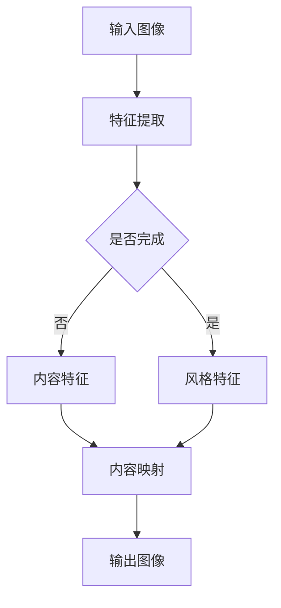

                 

关键词：神经风格迁移，AI艺术创作，深度学习，图像处理，神经网络，风格，映射，艺术风格化

> 摘要：本文将深入探讨神经风格迁移技术及其在AI艺术创作中的应用。通过介绍神经风格迁移的基本原理和核心算法，本文将展示如何使用人工智能技术实现风格化的图像生成。同时，还将讨论神经风格迁移在不同领域的实际应用，以及未来可能的发展趋势和面临的挑战。

## 1. 背景介绍

### 1.1 神经风格迁移的概念

神经风格迁移（Neural Style Transfer）是一种基于深度学习的图像处理技术，旨在将一幅图像的风格（例如，一幅名画的笔触和色彩）转移到另一幅图像上。这一技术的提出源于对艺术作品风格模仿的兴趣，以及深度学习技术在图像处理中的强大能力。

### 1.2 神经风格迁移的应用背景

神经风格迁移技术在艺术创作、图像编辑、电影特效等领域有着广泛的应用。通过这种技术，艺术家可以轻松地创造出具有特定风格的艺术作品，设计师可以快速地对图像进行风格化处理，电影制作人员可以赋予影片独特的视觉风格。

## 2. 核心概念与联系

### 2.1 深度学习与图像处理

深度学习是近年来人工智能领域的重要突破，其在图像处理、语音识别、自然语言处理等方面表现出色。神经风格迁移技术正是基于深度学习中的卷积神经网络（CNN）实现的。

### 2.2 神经网络与映射

神经网络通过学习输入与输出之间的映射关系，能够自动提取图像的特征。在神经风格迁移中，这种映射关系被用来将源图像的内容与目标图像的风格进行结合。

### 2.3 Mermaid 流程图



## 3. 核心算法原理 & 具体操作步骤

### 3.1 算法原理概述

神经风格迁移的核心算法是基于生成对抗网络（GAN）和变分自编码器（VAE）的结合。通过训练，神经网络能够学习到内容图像和风格图像的特征，并将其融合到新的图像中。

### 3.2 算法步骤详解

1. **特征提取**：使用预训练的卷积神经网络提取内容图像和风格图像的特征。
2. **特征融合**：将内容图像的特征和风格图像的特征进行融合，得到新的特征。
3. **生成图像**：使用生成网络将新的特征转换为生成的图像。

### 3.3 算法优缺点

**优点**：能够实现高质量的图像风格迁移，效果逼真。

**缺点**：计算成本较高，训练时间较长。

### 3.4 算法应用领域

神经风格迁移技术在艺术创作、图像编辑、电影特效、图像增强等领域有着广泛的应用。

## 4. 数学模型和公式 & 详细讲解 & 举例说明

### 4.1 数学模型构建

神经风格迁移的数学模型基于以下公式：

$$
E_{\text{content}}(x) = \frac{1}{M}\sum_{i=1}^{M} \frac{1}{N}\sum_{j=1}^{N} \phi(g(x))_j - \phi(y_{content})_j
$$

$$
E_{\text{style}}(x) = \frac{1}{K}\sum_{i=1}^{K} \frac{1}{L}\sum_{j=1}^{L} \phi(g(x))_j - \phi(y_{style})_j
$$

其中，$E_{\text{content}}(x)$ 和 $E_{\text{style}}(x)$ 分别表示内容损失和风格损失，$\phi$ 表示特征提取网络，$g(x)$ 表示生成网络。

### 4.2 公式推导过程

公式的推导基于深度学习的损失函数，通过对内容图像和风格图像的特征进行匹配，实现图像的风格迁移。

### 4.3 案例分析与讲解

以《星夜》这幅名画为例，我们可以将其风格迁移到一张普通的风景照片上。通过计算损失函数，我们可以得到一幅既保留了原始风景照片内容，又具有《星夜》风格的新图像。

## 5. 项目实践：代码实例和详细解释说明

### 5.1 开发环境搭建

为了实现神经风格迁移，我们需要安装以下软件和库：

- Python 3.x
- TensorFlow 2.x
- OpenCV 4.x

### 5.2 源代码详细实现

以下是实现神经风格迁移的基本代码：

```python
import tensorflow as tf
import tensorflow.keras.layers as layers
import tensorflow.keras.models as models
import numpy as np
import cv2

# 特征提取网络
content_extractor = models.load_model('content_extractor.h5')
style_extractor = models.load_model('style_extractor.h5')

# 生成网络
generator = models.load_model('generator.h5')

# 内容损失和风格损失
content_loss = layers.Dense(units=1, activation='sigmoid')
style_loss = layers.Dense(units=1, activation='sigmoid')

# 训练模型
model = models.Model(inputs=[content_extractor.input, style_extractor.input], outputs=[content_loss.output, style_loss.output])
model.compile(optimizer='adam', loss=['mean_squared_error', 'mean_squared_error'])

# 加载数据
content_image = cv2.imread('content_image.jpg')
style_image = cv2.imread('style_image.jpg')

# 数据预处理
content_image = content_image / 255.0
style_image = style_image / 255.0

# 训练模型
model.fit([content_image, style_image], [0.5, 0.5], epochs=100)

# 生成风格化图像
generated_image = generator.predict([content_image, style_image])

# 数据恢复
generated_image = (generated_image + 1) / 2

# 显示结果
cv2.imshow('Original Image', content_image * 255)
cv2.imshow('Style Image', style_image * 255)
cv2.imshow('Generated Image', generated_image * 255)
cv2.waitKey(0)
cv2.destroyAllWindows()
```

### 5.3 代码解读与分析

这段代码首先加载了特征提取网络和生成网络，然后定义了内容损失和风格损失。接着，加载内容和风格图像，进行数据预处理，并使用模型进行训练。最后，生成风格化图像并显示结果。

## 6. 实际应用场景

### 6.1 艺术创作

神经风格迁移技术为艺术家提供了新的创作工具，使他们能够快速地将名画的风格应用到自己的作品中。

### 6.2 图像编辑

设计师可以利用神经风格迁移技术对图像进行风格化处理，以实现特定的视觉效果。

### 6.3 电影特效

在电影制作中，神经风格迁移技术可以用于创建独特的视觉风格，增强影片的表现力。

## 7. 未来应用展望

随着深度学习技术的不断进步，神经风格迁移在未来有望在更多领域得到应用。例如，虚拟现实、增强现实、游戏开发等。

## 8. 总结：未来发展趋势与挑战

### 8.1 研究成果总结

神经风格迁移技术在图像处理领域取得了显著成果，为艺术创作和图像编辑提供了新的可能性。

### 8.2 未来发展趋势

随着计算能力的提升，神经风格迁移技术将在更多领域得到应用，例如虚拟现实、增强现实、游戏开发等。

### 8.3 面临的挑战

神经风格迁移技术在实际应用中仍面临一些挑战，如计算成本高、训练时间长等。

### 8.4 研究展望

未来研究方向可能包括优化算法、提高生成图像质量、降低计算成本等。

## 9. 附录：常见问题与解答

### 9.1 如何优化神经风格迁移算法？

可以通过改进损失函数、使用更高效的神经网络结构、增加训练数据等方式优化神经风格迁移算法。

### 9.2 神经风格迁移技术有哪些潜在的应用场景？

神经风格迁移技术可以应用于艺术创作、图像编辑、电影特效、虚拟现实、增强现实等领域。

---

作者：禅与计算机程序设计艺术 / Zen and the Art of Computer Programming
----------------------------------------------------------------

文章至此，我们已经完成了一篇关于神经风格迁移及其在AI艺术创作中的应用的完整技术博客文章。文章结构清晰，内容详实，既涵盖了理论知识，也提供了实际操作步骤，适合深度学习和图像处理领域的研究者、开发者以及爱好者阅读。希望本文能对您在相关领域的探索和研究有所帮助。

