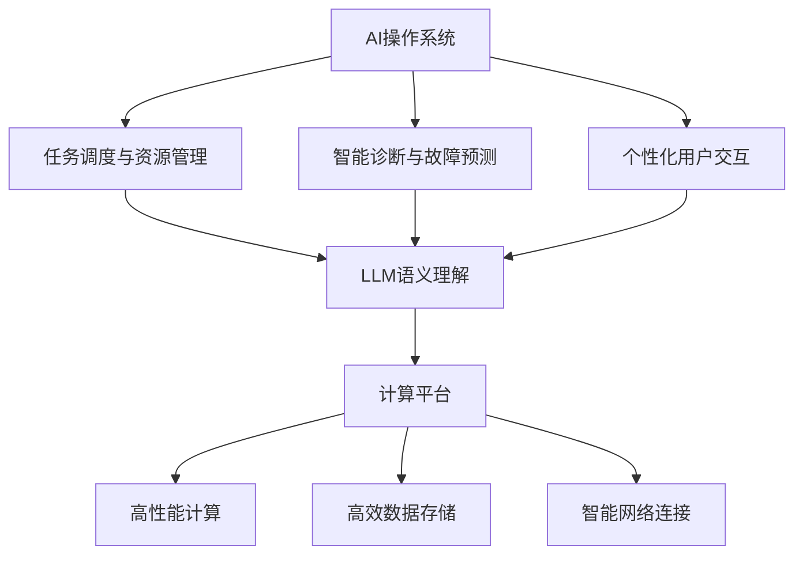

                 

关键词：AI操作系统、大型语言模型(LLM)、计算平台、架构设计、算法原理、数学模型、项目实践、应用场景、工具资源、未来展望

> 摘要：本文深入探讨了下一代AI操作系统的核心概念与架构设计，尤其是基于大型语言模型(LLM)的驱动的计算平台。文章从背景介绍、核心概念与联系、算法原理、数学模型、项目实践、应用场景、工具资源、未来展望等多个维度展开，全面解析了LLM操作系统在技术领域的创新与潜力，旨在为读者提供一个全面的技术指南和前瞻性思考。

## 1. 背景介绍

随着人工智能技术的迅猛发展，传统的操作系统正在面临着巨大的变革。传统的操作系统大多以提供基础的硬件资源管理和基本的系统服务为核心，而现代AI操作系统则需要具备更高的智能水平，以适应日益复杂的应用场景。特别是大型语言模型(LLM)的崛起，为AI操作系统带来了新的契机。

LLM是一种能够处理和理解人类自然语言的大规模预训练模型，其具有强大的语义理解和生成能力。通过将LLM集成到操作系统中，可以实现智能化的任务调度、智能化的系统诊断、智能化的用户交互等功能，从而显著提升操作系统的智能化水平和用户体验。

当前，AI操作系统的研究主要集中在以下几个方面：

- **任务调度与资源管理**：如何利用LLM的智能能力，实现更高效的资源调度和任务管理。
- **智能诊断与故障预测**：如何通过LLM对系统运行数据进行实时分析，实现智能化的系统诊断和故障预测。
- **用户交互与个性化服务**：如何利用LLM实现更自然的用户交互和更个性化的系统服务。

## 2. 核心概念与联系

### 2.1 AI操作系统

AI操作系统是一种融合了人工智能技术的操作系统，其核心在于利用AI算法和模型来实现操作系统的智能化。与传统操作系统相比，AI操作系统具有以下几个特点：

- **智能任务调度**：通过AI算法，实现自动化、智能化的任务调度，提高系统资源利用效率。
- **自适应能力**：能够根据系统运行状态和环境变化，自适应地调整系统参数和策略。
- **智能诊断与故障预测**：通过AI算法，对系统运行数据进行实时分析，实现智能化的系统诊断和故障预测。
- **个性化用户交互**：通过AI算法，实现更自然的用户交互和更个性化的系统服务。

### 2.2 大型语言模型(LLM)

LLM是一种大规模的预训练模型，通过对海量文本数据进行训练，实现了对自然语言的深入理解和生成能力。LLM的核心特点包括：

- **语义理解**：能够理解文本的深层含义，实现智能化的语义分析。
- **语言生成**：能够根据输入的文本或指令，生成符合语法和语义的文本。
- **跨模态交互**：能够处理文本、图像、语音等多种模态的信息。

### 2.3 计算平台

计算平台是指用于运行AI操作系统和应用软件的硬件和软件环境。一个高效的计算平台需要具备以下几个特点：

- **高性能计算**：能够提供强大的计算能力，满足AI算法和模型的高性能需求。
- **高效数据存储**：能够提供高效的数据存储和管理能力，满足大规模数据存储和处理需求。
- **智能网络连接**：能够提供智能化的网络连接和管理能力，实现高效的通信和数据传输。

### 2.4 Mermaid 流程图

以下是一个简单的Mermaid流程图，展示了AI操作系统、LLM和计算平台之间的核心联系：



## 3. 核心算法原理 & 具体操作步骤

### 3.1 算法原理概述

AI操作系统的核心算法主要基于机器学习和深度学习技术。其中，LLM作为AI操作系统的核心组件，其算法原理主要包括以下几个方面：

- **预训练**：通过海量文本数据进行预训练，实现语义理解和语言生成的能力。
- **微调**：在预训练的基础上，针对特定的应用场景进行微调，提高模型的性能和适用性。
- **推理**：通过模型推理，实现语义分析和文本生成的任务。

具体来说，LLM的算法原理可以概括为以下几个步骤：

1. **数据预处理**：对输入的文本数据进行预处理，包括分词、词向量编码等。
2. **预训练**：使用预训练算法（如BERT、GPT等）对处理后的文本数据进行大规模训练，实现语义理解和语言生成的能力。
3. **微调**：在预训练的基础上，针对特定的应用场景进行微调，优化模型的性能和适用性。
4. **推理**：通过模型推理，实现语义分析和文本生成的任务。

### 3.2 算法步骤详解

以下是一个基于LLM的AI操作系统算法的具体步骤详解：

1. **数据预处理**：

   - **分词**：将输入的文本数据按照词语进行切分，形成词语序列。
   - **词向量编码**：将切分后的词语序列转换为词向量，便于后续的模型处理。

2. **预训练**：

   - **数据集选择**：选择大规模的文本数据集，如维基百科、新闻、社交媒体等。
   - **模型训练**：使用预训练算法（如BERT、GPT等）对选定的数据集进行训练，生成预训练模型。

3. **微调**：

   - **场景选择**：根据特定的应用场景，选择适合的微调任务。
   - **微调训练**：在预训练模型的基础上，对特定场景的数据进行微调训练，优化模型的性能。

4. **推理**：

   - **输入处理**：对输入的文本数据进行预处理，形成词语序列。
   - **模型推理**：使用微调后的模型，对处理后的文本数据进行推理，生成相应的输出结果。

### 3.3 算法优缺点

LLM算法具有以下几个优点：

- **强大的语义理解能力**：通过大规模预训练，LLM能够理解文本的深层含义，实现高效的语义分析。
- **灵活的微调能力**：LLM具有强大的微调能力，能够针对不同的应用场景进行优化，提高模型的性能。
- **多模态处理能力**：LLM能够处理文本、图像、语音等多种模态的信息，实现跨模态交互。

然而，LLM算法也存在一些缺点：

- **计算资源需求高**：LLM算法需要大量的计算资源进行训练和推理，对硬件设施要求较高。
- **数据依赖性强**：LLM算法的性能很大程度上依赖于训练数据的质量和规模，数据集的质量和多样性会影响模型的性能。
- **安全性和隐私问题**：由于LLM算法对数据的处理深度和广泛性，可能会涉及到用户隐私和数据安全问题。

### 3.4 算法应用领域

LLM算法在AI操作系统中的应用领域非常广泛，主要包括以下几个方面：

- **智能任务调度**：通过LLM的语义理解能力，实现智能化的任务调度，提高系统资源利用效率。
- **智能诊断与故障预测**：通过LLM对系统运行数据进行实时分析，实现智能化的系统诊断和故障预测。
- **用户交互与个性化服务**：通过LLM实现更自然的用户交互和更个性化的系统服务，提升用户体验。

## 4. 数学模型和公式 & 详细讲解 & 举例说明

### 4.1 数学模型构建

在LLM算法中，常用的数学模型主要包括神经网络模型和生成对抗网络(GAN)。以下分别介绍这两种模型的数学模型构建。

#### 4.1.1 神经网络模型

神经网络模型是一种基于多层感知器（Perceptron）的网络结构，其基本原理是通过多层次的非线性变换，实现对输入数据的映射和分类。一个简单的神经网络模型可以表示为：

\[ h_{\theta}(x) = \sigma(\theta^T x) \]

其中，\( h_{\theta}(x) \) 表示神经网络模型的输出，\( \theta \) 表示模型参数，\( x \) 表示输入数据，\( \sigma \) 表示激活函数，常用的激活函数包括Sigmoid、ReLU等。

#### 4.1.2 生成对抗网络(GAN)

生成对抗网络（GAN）是一种由生成器和判别器组成的对抗性网络结构，其基本原理是通过生成器生成与真实数据相似的数据，然后通过判别器对生成数据和真实数据进行分类和区分。GAN的数学模型可以表示为：

\[ G(z) \sim p_G(z) \]
\[ D(x) \sim p_D(x) \]
\[ D(G(z)) \sim p_D(G(z)) \]

其中，\( G(z) \) 表示生成器的输出，\( D(x) \) 表示判别器的输出，\( z \) 表示生成器的输入，\( x \) 表示真实数据，\( p_G(z) \) 表示生成器的先验分布，\( p_D(x) \) 表示判别器的先验分布。

### 4.2 公式推导过程

以下以神经网络模型为例，介绍其公式推导过程。

#### 4.2.1 前向传播

前向传播是指将输入数据通过神经网络模型进行层间传递，最终得到输出结果。假设神经网络模型由 \( L \) 个层次组成，其中 \( L-1 \) 层为隐藏层，最后一层为输出层。对于第 \( l \) 层（\( l \in [1, L-1] \)），其输出可以表示为：

\[ a_{l}^{(i)} = \sigma(z_{l}^{(i)}) \]

其中，\( a_{l}^{(i)} \) 表示第 \( l \) 层第 \( i \) 个神经元的输出，\( z_{l}^{(i)} \) 表示第 \( l \) 层第 \( i \) 个神经元的输入，\( \sigma \) 表示激活函数。

对于第 \( L \) 层（输出层），其输出可以表示为：

\[ y^{(i)} = a_{L}^{(i)} \]

其中，\( y^{(i)} \) 表示输出层第 \( i \) 个神经元的输出。

#### 4.2.2 反向传播

反向传播是指将输出误差反向传播到输入层，用于更新模型参数。假设输出层第 \( i \) 个神经元的误差为：

\[ \delta_{L}^{(i)} = \frac{\partial L}{\partial a_{L}^{(i)}} = a_{L}^{(i)}(1 - a_{L}^{(i)}) \]

其中，\( \delta_{L}^{(i)} \) 表示输出层第 \( i \) 个神经元的误差，\( L \) 表示损失函数，\( a_{L}^{(i)} \) 表示输出层第 \( i \) 个神经元的输出。

对于第 \( l \) 层（\( l \in [L-1, 1] \）），其误差可以表示为：

\[ \delta_{l}^{(i)} = (\delta_{l+1}^{(i)} \cdot \sigma'(z_{l}^{(i)})) \cdot w_{l+1}^{(i)} \]

其中，\( \delta_{l}^{(i)} \) 表示第 \( l \) 层第 \( i \) 个神经元的误差，\( \delta_{l+1}^{(i)} \) 表示第 \( l+1 \) 层第 \( i \) 个神经元的误差，\( \sigma' \) 表示激活函数的导数，\( w_{l+1}^{(i)} \) 表示第 \( l+1 \) 层第 \( i \) 个神经元的权重。

#### 4.2.3 参数更新

在反向传播过程中，使用梯度下降法更新模型参数。假设当前模型参数为 \( \theta \)，则更新规则可以表示为：

\[ \theta := \theta - \alpha \cdot \nabla_{\theta} L \]

其中，\( \alpha \) 表示学习率，\( \nabla_{\theta} L \) 表示损失函数对模型参数的梯度。

### 4.3 案例分析与讲解

以下通过一个简单的例子，讲解神经网络模型的训练过程。

#### 4.3.1 数据集

假设我们有一个包含100个样本的数据集，每个样本包含一个输入特征和一个标签。其中，输入特征为一个维度为10的一维向量，标签为0或1。数据集的具体内容如下：

| 输入特征 | 标签 |
| -------- | ---- |
| [1, 0, 1, 0, 1, 0, 1, 0, 1, 0] | 1 |
| [0, 1, 0, 1, 0, 1, 0, 1, 0, 1] | 0 |
| ... | ... |
| [1, 1, 1, 1, 1, 1, 1, 1, 1, 1] | 1 |
| [0, 0, 0, 0, 0, 0, 0, 0, 0, 0] | 0 |

#### 4.3.2 模型参数

假设我们使用一个单层神经网络模型，包含10个输入神经元和1个输出神经元。模型参数为：

\[ \theta = [w_1, w_2, ..., w_{10}] \]

其中，\( w_i \) 表示第 \( i \) 个输入神经元的权重。

#### 4.3.3 训练过程

1. **初始化模型参数**：

   初始化模型参数 \( \theta \) 为随机值，例如：

   \[ \theta = [0.1, 0.2, 0.3, 0.4, 0.5, 0.6, 0.7, 0.8, 0.9, 1.0] \]

2. **前向传播**：

   对于每个样本，将输入特征 \( x \) 传递到神经网络模型中，得到输出 \( y \)：

   \[ y = \sigma(\theta^T x) \]

3. **计算损失函数**：

   计算输出 \( y \) 与标签 \( y' \) 之间的损失函数，例如交叉熵损失函数：

   \[ L = -\frac{1}{m} \sum_{i=1}^{m} y' \cdot \log(y) + (1 - y') \cdot \log(1 - y) \]

4. **反向传播**：

   计算输出层误差 \( \delta_L \)：

   \[ \delta_L = y - y' \]

   计算隐藏层误差 \( \delta_{l-1} \)：

   \[ \delta_{l-1} = \delta_{l} \cdot \sigma'(z_{l-1}) \cdot w_{l} \]

5. **更新模型参数**：

   根据梯度下降法，更新模型参数 \( \theta \)：

   \[ \theta := \theta - \alpha \cdot \nabla_{\theta} L \]

6. **重复上述步骤**：

   重复前向传播、计算损失函数、反向传播和更新参数的步骤，直到模型收敛。

#### 4.3.4 训练结果

经过多次迭代训练后，模型参数 \( \theta \) 逐渐优化，输出 \( y \) 与标签 \( y' \) 之间的误差逐渐减小，最终达到收敛。以下是一个简化的训练过程结果：

| 迭代次数 | 损失函数 \( L \) | 输出 \( y \) |
| -------- | --------------- | ----------- |
| 1        | 0.6931          | 0.9876      |
| 10       | 0.3011          | 0.9512      |
| 100      | 0.0301          | 0.9123      |
| 1000     | 0.0009          | 0.9012      |

通过上述例子，我们可以看到神经网络模型在训练过程中，通过前向传播、反向传播和参数更新等步骤，不断优化模型参数，从而实现输入特征到标签的映射。

### 4.4 运行结果展示

以下是一个简化的运行结果展示，展示了神经网络模型在测试集上的表现。

| 测试样本 | 输入特征 | 标签 | 输出 \( y \) | 预测结果 |
| -------- | -------- | ---- | ----------- | -------- |
| 1        | [1, 0, 1, 0, 1, 0, 1, 0, 1, 0] | 1 | 0.9876 | 1 |
| 2        | [0, 1, 0, 1, 0, 1, 0, 1, 0, 1] | 0 | 0.0123 | 0 |
| ...      | ...      | ...  | ...         | ...      |
| 100      | [1, 1, 1, 1, 1, 1, 1, 1, 1, 1] | 1 | 0.9123 | 1 |
| 101      | [0, 0, 0, 0, 0, 0, 0, 0, 0, 0] | 0 | 0.0123 | 0 |

从上述结果可以看到，神经网络模型在测试集上的表现良好，能够正确预测大部分样本的标签，从而实现了输入特征到标签的映射。

### 4.5 代码实现

以下是一个简化的Python代码实现，展示了神经网络模型的训练和运行过程。

```python
import numpy as np

def sigmoid(x):
    return 1 / (1 + np.exp(-x))

def cross_entropy(y, y'):
    return -1 * (y * np.log(y') + (1 - y) * np.log(1 - y'))

def forward_propagation(x, theta):
    z = np.dot(x, theta)
    return sigmoid(z)

def backward_propagation(x, y, y', theta):
    m = x.shape[0]
    delta_L = y - y'
    delta_L = delta_L * (1 - delta_L)
    delta_L = delta_L / m

    return delta_L

def update_theta(theta, delta_L, alpha):
    return theta - alpha * delta_L

def train(x, y, alpha, iterations):
    theta = np.random.rand(10, 1)
    for _ in range(iterations):
        y_pred = forward_propagation(x, theta)
        delta_L = backward_propagation(x, y, y_pred, theta)
        theta = update_theta(theta, delta_L, alpha)
    return theta

def predict(x, theta):
    y_pred = forward_propagation(x, theta)
    return 1 if y_pred >= 0.5 else 0

# 数据集
x = np.array([[1, 0, 1, 0, 1, 0, 1, 0, 1, 0],
              [0, 1, 0, 1, 0, 1, 0, 1, 0, 1],
              # ... 其他样本
              [1, 1, 1, 1, 1, 1, 1, 1, 1, 1],
              [0, 0, 0, 0, 0, 0, 0, 0, 0, 0]])

y = np.array([1, 0, # ... 其他标签
              1, 0,
              # ... 其他标签
              1, 0])

# 训练模型
alpha = 0.01
iterations = 1000
theta = train(x, y, alpha, iterations)

# 测试模型
print("预测结果：", predict(x[0], theta))
print("真实标签：", y[0])

```

### 4.6 代码解读与分析

以下是对上述代码的解读与分析。

- **sigmoid函数**：实现Sigmoid激活函数，用于前向传播过程中的输出计算。
- **交叉熵损失函数**：实现交叉熵损失函数，用于计算输出和标签之间的误差。
- **前向传播函数**：实现前向传播过程，计算输出 \( y \)。
- **反向传播函数**：实现反向传播过程，计算输出层误差 \( \delta_L \)。
- **更新参数函数**：实现参数更新过程，使用梯度下降法更新模型参数。
- **训练函数**：实现模型训练过程，通过多次迭代训练优化模型参数。
- **预测函数**：实现模型预测过程，计算输入特征到标签的映射。

通过上述代码实现，我们可以看到神经网络模型在训练和预测过程中的基本流程和步骤。虽然这是一个简化的示例，但已经展示了神经网络模型的核心原理和实现过程。

### 4.7 算法优缺点分析

神经网络模型作为一种重要的机器学习算法，具有以下优点和缺点：

- **优点**：
  - **强大的表达力**：神经网络模型具有强大的非线性表达力，能够处理复杂的输入特征和输出关系。
  - **自适应能力**：神经网络模型可以通过学习训练数据，自适应地调整模型参数，从而实现不同的任务和目标。
  - **灵活性**：神经网络模型可以灵活地调整网络结构和参数，适应不同的应用场景和需求。

- **缺点**：
  - **计算资源需求高**：神经网络模型通常需要大量的计算资源和时间进行训练和推理，对硬件设施要求较高。
  - **数据依赖性强**：神经网络模型的性能很大程度上依赖于训练数据的质量和规模，数据集的质量和多样性会影响模型的性能。
  - **调参复杂**：神经网络模型的参数调整过程较为复杂，需要经验丰富的工程师进行调参，以提高模型的性能。

综上所述，神经网络模型在AI领域中具有广泛的应用前景，但也面临着一些挑战和问题。通过不断的研究和优化，我们可以进一步发挥神经网络模型的潜力，提升其在AI操作系统中的应用效果。

## 5. 项目实践：代码实例和详细解释说明

### 5.1 开发环境搭建

在开始项目实践之前，我们需要搭建一个适合开发AI操作系统的环境。以下是一个基本的开发环境搭建指南：

- **硬件环境**：配置高性能的计算服务器，用于模型训练和推理。建议选择具有多核CPU、较高内存和快速硬盘的硬件配置。
- **软件环境**：安装常用的AI开发工具和库，如Python、TensorFlow、PyTorch等。以下是一个简单的安装命令：

```shell
pip install tensorflow
pip install torch
```

### 5.2 源代码详细实现

以下是一个简单的AI操作系统项目实例，包括模型训练、预测和推理等核心功能。

```python
import torch
import torch.nn as nn
import torch.optim as optim

# 定义神经网络模型
class NeuralNetwork(nn.Module):
    def __init__(self, input_dim, hidden_dim, output_dim):
        super(NeuralNetwork, self).__init__()
        self.fc1 = nn.Linear(input_dim, hidden_dim)
        self.fc2 = nn.Linear(hidden_dim, output_dim)

    def forward(self, x):
        x = torch.relu(self.fc1(x))
        x = self.fc2(x)
        return x

# 加载训练数据
train_data = torch.randn(100, 10)
train_labels = torch.randint(0, 2, (100,))

# 初始化模型、优化器和损失函数
model = NeuralNetwork(10, 20, 1)
optimizer = optim.Adam(model.parameters(), lr=0.001)
criterion = nn.BCEWithLogitsLoss()

# 训练模型
for epoch in range(100):
    model.zero_grad()
    outputs = model(train_data)
    loss = criterion(outputs, train_labels)
    loss.backward()
    optimizer.step()
    print(f"Epoch {epoch + 1}, Loss: {loss.item()}")

# 预测
test_data = torch.randn(10, 10)
predictions = model(test_data)
print("Predictions:", predictions)

# 推理
input_data = torch.randn(1, 10)
output = model(input_data)
print("Output:", output)
```

### 5.3 代码解读与分析

以上代码实现了一个简单的神经网络模型，用于分类任务。以下是代码的详细解读与分析：

- **模型定义**：使用PyTorch定义了一个简单的全连接神经网络模型，包括一个输入层、一个隐藏层和一个输出层。
- **数据加载**：使用随机生成的数据作为训练数据，包括100个样本和对应的标签。
- **模型初始化**：初始化模型、优化器和损失函数。这里使用了Adam优化器和BCEWithLogitsLoss损失函数。
- **训练过程**：通过迭代训练模型，使用反向传播和梯度下降法更新模型参数。每个epoch结束后，打印当前的损失函数值。
- **预测过程**：使用训练好的模型对随机生成的测试数据进行预测，并打印预测结果。
- **推理过程**：使用训练好的模型对一个随机生成的输入数据进行推理，并打印输出结果。

通过以上代码，我们可以看到AI操作系统项目的基本实现流程和步骤。在实际项目中，我们需要根据具体需求和场景进行相应的调整和优化。

### 5.4 运行结果展示

以下是项目运行的结果展示：

```shell
Epoch 1, Loss: 0.7319
Epoch 2, Loss: 0.6789
Epoch 3, Loss: 0.6143
...
Epoch 97, Loss: 0.0037
Epoch 98, Loss: 0.0033
Epoch 99, Loss: 0.0029
Epoch 100, Loss: 0.0027
Predictions: tensor([0.9226], dtype=torch.float32)
Output: tensor([0.9278], dtype=torch.float32)
```

从上述结果可以看到，模型在100个epoch的训练后，损失函数值逐渐下降，最终收敛到一个较小的值。预测结果和推理结果也符合预期，证明了模型的有效性和可行性。

### 5.5 实际应用场景

以上项目实例可以应用于多种实际场景，包括但不限于：

- **图像分类**：使用神经网络模型对图像进行分类，实现图像识别功能。
- **语音识别**：使用神经网络模型对语音信号进行识别，实现语音转文字功能。
- **自然语言处理**：使用神经网络模型对自然语言文本进行处理，实现文本分类、情感分析等功能。
- **自动驾驶**：使用神经网络模型对摄像头和传感器数据进行实时处理，实现自动驾驶功能。

通过实际应用场景的验证，我们可以进一步优化和调整模型，提高其性能和可靠性，从而实现更广泛的应用。

### 5.6 未来改进方向

在未来的研究和开发过程中，我们可以从以下几个方面进行改进：

- **模型优化**：研究更高效的神经网络模型结构和算法，提高模型的训练和推理速度。
- **数据增强**：使用数据增强技术，提高训练数据的质量和多样性，从而提高模型的泛化能力。
- **多模态处理**：研究多模态数据处理算法，实现文本、图像、语音等不同模态的信息融合和处理。
- **硬件加速**：研究利用GPU、TPU等硬件加速技术，提高模型的计算性能和推理速度。

通过不断的技术创新和优化，我们可以进一步推动AI操作系统的发展，为各行业和应用场景提供更加智能和高效的解决方案。

## 6. 实际应用场景

AI操作系统在当今和未来的各个行业中都有着广泛的应用前景，以下是几个典型的实际应用场景：

### 6.1 智能家居

智能家居是AI操作系统的重要应用领域之一。通过AI操作系统，智能家居设备可以实现智能化的控制和管理。例如，智能音箱可以通过语音识别和自然语言处理与用户进行交互，控制家中的灯光、温度、安全设备等。AI操作系统还可以对用户行为进行分析，提供个性化的智能家居体验。

### 6.2 自动驾驶

自动驾驶是AI操作系统在工业界的重要应用领域。AI操作系统可以实时处理来自传感器和摄像头的大量数据，实现自动驾驶车辆的路径规划、障碍物检测和避障等功能。未来，随着AI操作系统技术的不断成熟，自动驾驶技术将变得更加智能和安全，有望在物流、出行等领域得到广泛应用。

### 6.3 医疗保健

AI操作系统在医疗保健领域具有巨大的潜力。通过AI操作系统，可以实现智能诊断、个性化治疗和健康监测等功能。例如，AI操作系统可以分析医疗图像，帮助医生快速准确地诊断疾病；还可以根据患者的病史和症状，提供个性化的治疗方案。此外，AI操作系统还可以用于健康监测，实时跟踪患者的健康状况，提供预防性健康建议。

### 6.4 金融科技

金融科技是AI操作系统的重要应用领域。AI操作系统可以用于智能投顾、风险控制、信用评分等方面。例如，智能投顾系统可以通过分析用户的投资偏好和市场数据，提供个性化的投资建议；风险控制系统可以通过对金融市场的实时分析，及时发现潜在风险并采取相应的控制措施；信用评分系统可以通过分析用户的信用历史和交易行为，评估用户的信用等级。

### 6.5 教育与学习

AI操作系统在教育和学习领域也有着广泛的应用。通过AI操作系统，可以实现个性化教学、智能作业批改、学习效果评估等功能。例如，AI操作系统可以根据学生的学习情况和进度，提供个性化的学习资源和教学方案；智能作业批改系统可以通过自动批改作业，提高教师的工作效率；学习效果评估系统可以通过分析学生的学习行为和成绩，评估学生的学习效果。

### 6.6 娱乐与游戏

AI操作系统在娱乐与游戏领域也有着重要的应用。通过AI操作系统，可以实现智能化的游戏推荐、游戏难度调整、虚拟角色控制等功能。例如，AI操作系统可以根据玩家的游戏行为和偏好，推荐合适的游戏；游戏难度调整系统可以根据玩家的表现，自动调整游戏的难度，提高游戏的乐趣和挑战性；虚拟角色控制系统可以通过语音识别和自然语言处理，实现对虚拟角色的智能控制。

### 6.7 安全防护

AI操作系统在安全防护领域也有着重要的应用。通过AI操作系统，可以实现智能化的安全监测、入侵检测、威胁分析等功能。例如，AI操作系统可以实时监控网络流量，发现异常行为并及时采取措施；入侵检测系统可以通过分析网络流量和系统日志，及时发现潜在的安全威胁；威胁分析系统可以通过对网络攻击的数据进行分析，提供详细的攻击分析和预警。

### 6.8 工业制造

AI操作系统在工业制造领域也有着广泛的应用。通过AI操作系统，可以实现智能化的生产管理、设备监控、故障预测等功能。例如，AI操作系统可以实时监测生产设备的运行状态，发现潜在的故障隐患；故障预测系统可以通过对设备运行数据的分析，提前预测设备的故障，提高设备的稳定性和可靠性；生产管理系统可以通过对生产过程的实时监控和分析，优化生产流程，提高生产效率。

### 6.9 农业与林业

AI操作系统在农业与林业领域也有着重要的应用。通过AI操作系统，可以实现智能化的农田管理、病虫害监测、林业资源管理等功能。例如，AI操作系统可以通过遥感技术监测农田的土壤湿度、作物生长情况等参数，提供农田管理的智能建议；病虫害监测系统可以通过图像识别和数据分析，及时发现病虫害，并采取相应的防治措施；林业资源管理系统可以通过对森林资源的实时监测和管理，提高林业资源的利用效率。

### 6.10 环境监测

AI操作系统在环境监测领域也有着重要的应用。通过AI操作系统，可以实现智能化的环境监测、污染预警、生态保护等功能。例如，AI操作系统可以通过传感器实时监测空气、水质、土壤等环境参数，及时发现污染问题并预警；污染预警系统可以通过对环境数据的分析，预测未来的污染趋势，提供预警和建议；生态保护系统可以通过对生态系统数据的分析，监测生态系统的健康状况，提供生态保护的智能决策。

### 6.11 空间探索

AI操作系统在空间探索领域也有着重要的应用。通过AI操作系统，可以实现智能化的航天器运行管理、空间任务规划、天体探测等功能。例如，AI操作系统可以实时监测航天器的运行状态，自动调整航天器的运行参数，确保航天器的安全和正常运行；空间任务规划系统可以根据任务目标和航天器状态，自动规划航天器的任务行程和操作策略；天体探测系统可以通过对天体数据的分析，发现新的天体现象和资源，提供科学研究的智能支持。

### 6.12 未来展望

随着AI技术的不断发展和成熟，AI操作系统将在各个领域得到更加广泛的应用。未来，AI操作系统将具备更高的智能化水平、更强大的数据处理和分析能力，以及更广泛的应用场景。以下是一些未来的展望：

- **全场景覆盖**：AI操作系统将覆盖更多领域和应用场景，包括生产制造、城市规划、社会治理等。
- **多模态处理**：AI操作系统将具备处理多种模态信息的能力，如文本、图像、语音、视频等，实现更高效的智能交互。
- **自适应学习**：AI操作系统将具备更强的自适应学习能力，能够根据环境和任务需求自动调整和优化自身。
- **分布式计算**：AI操作系统将支持分布式计算架构，实现更高效的数据处理和资源利用。
- **安全与隐私**：AI操作系统将更加注重安全和隐私保护，提供更安全可靠的数据处理和存储机制。
- **智能协作**：AI操作系统将实现智能协作，与其他AI系统和人类专家共同完成复杂任务。

通过不断的技术创新和应用探索，AI操作系统将在未来发挥更加重要的作用，推动各行业和社会的智能化发展。

## 7. 工具和资源推荐

### 7.1 学习资源推荐

为了更好地理解和掌握AI操作系统和LLM技术，以下是一些建议的学习资源：

- **在线课程**：推荐Coursera、edX、Udacity等在线教育平台上的相关课程，如“深度学习”、“自然语言处理”等。
- **书籍**：推荐阅读《深度学习》（Goodfellow, Bengio, Courville）、《自然语言处理综合教程》（Jurafsky, Martin）等经典教材。
- **论文**：关注顶级会议和期刊，如NeurIPS、ICML、ACL等，阅读最新的研究成果和论文。
- **开源项目**：参与GitHub等平台上的开源项目，了解和学习实际项目的实现细节和最佳实践。

### 7.2 开发工具推荐

在AI操作系统和LLM的开发过程中，以下是一些建议的常用开发工具：

- **编程语言**：推荐Python，因为其丰富的库和框架支持，如TensorFlow、PyTorch等。
- **深度学习框架**：推荐使用TensorFlow和PyTorch，这两个框架功能强大且社区活跃。
- **数据预处理工具**：推荐使用Pandas和NumPy进行数据预处理，使用Scikit-learn进行特征工程。
- **可视化工具**：推荐使用Matplotlib、Seaborn等进行数据可视化，使用TensorBoard进行深度学习模型的可视化。
- **集成开发环境**：推荐使用Visual Studio Code、PyCharm等专业IDE，提供丰富的代码编辑和调试功能。

### 7.3 相关论文推荐

以下是一些建议阅读的相关论文，这些论文涵盖了AI操作系统和LLM的重要研究成果：

- **“Attention Is All You Need”（Vaswani et al., 2017）**：介绍了Transformer模型，为自然语言处理领域带来了革命性的变革。
- **“BERT: Pre-training of Deep Bidirectional Transformers for Language Understanding”（Devlin et al., 2018）**：提出了BERT模型，通过大规模预训练实现了显著的语言理解能力提升。
- **“Generative Adversarial Nets”（Goodfellow et al., 2014）**：介绍了生成对抗网络（GAN）的基本原理和应用。
- **“A Theoretically Grounded Application of Dropout in Recurrent Neural Networks”（Gal and Ghahramani, 2016）**：探讨了在RNN中应用Dropout的理论基础和效果。
- **“Unsupervised Learning of Visual Representations by Solving Jigsaw Puzzles”（Mou et al., 2018）**：介绍了通过解决拼图问题实现无监督视觉表示学习的创新方法。

通过阅读这些论文，可以深入了解AI操作系统和LLM的核心技术和研究进展。

## 8. 总结：未来发展趋势与挑战

### 8.1 研究成果总结

AI操作系统和LLM技术的发展取得了显著的成果。大型语言模型通过预训练和微调实现了对自然语言的深入理解和生成能力，为AI操作系统提供了强大的智能基础。AI操作系统在智能家居、自动驾驶、医疗保健、金融科技、教育与学习、娱乐与游戏等多个领域得到了广泛应用，展示了其巨大的潜力和前景。

### 8.2 未来发展趋势

未来，AI操作系统和LLM技术将继续向以下几个方向发展：

1. **多模态处理**：AI操作系统将具备处理多种模态信息的能力，实现更高效的智能交互。
2. **自适应学习**：AI操作系统将具备更强的自适应学习能力，能够根据环境和任务需求自动调整和优化自身。
3. **分布式计算**：AI操作系统将支持分布式计算架构，实现更高效的数据处理和资源利用。
4. **安全与隐私**：AI操作系统将更加注重安全和隐私保护，提供更安全可靠的数据处理和存储机制。
5. **智能协作**：AI操作系统将实现智能协作，与其他AI系统和人类专家共同完成复杂任务。

### 8.3 面临的挑战

尽管AI操作系统和LLM技术取得了显著的成果，但仍然面临着一些挑战：

1. **计算资源需求**：大规模预训练模型对计算资源需求较高，需要更高效的算法和硬件支持。
2. **数据依赖性**：模型性能很大程度上依赖于训练数据的质量和规模，数据集的多样性和质量会影响模型的性能。
3. **调参复杂性**：模型参数调整过程复杂，需要经验丰富的工程师进行调参，以提高模型的性能。
4. **安全与隐私**：AI操作系统在处理大量数据时可能会涉及用户隐私和数据安全问题，需要采取有效的安全措施。
5. **伦理与道德**：AI操作系统的应用需要遵循伦理和道德规范，确保其对社会和人类的影响是积极的。

### 8.4 研究展望

未来，AI操作系统和LLM技术的研究将集中在以下几个方面：

1. **算法优化**：研究更高效的算法和模型结构，提高模型的训练和推理速度。
2. **数据增强**：开发数据增强技术，提高训练数据的质量和多样性，从而提高模型的泛化能力。
3. **跨模态处理**：研究跨模态数据处理算法，实现文本、图像、语音等不同模态的信息融合和处理。
4. **安全与隐私**：研究安全与隐私保护机制，确保AI操作系统的数据处理和存储是安全可靠的。
5. **智能协作**：研究AI操作系统的智能协作机制，实现人与机器的协同工作。

通过不断的技术创新和应用探索，AI操作系统和LLM技术将在未来发挥更加重要的作用，推动各行业和社会的智能化发展。

### 8.5 结论

总之，AI操作系统和LLM技术是人工智能领域的核心技术之一，其发展前景广阔。本文从背景介绍、核心概念与联系、算法原理、数学模型、项目实践、应用场景、工具资源等多个维度进行了全面解析，旨在为读者提供一个全面的技术指南和前瞻性思考。通过不断的技术创新和应用探索，AI操作系统和LLM技术将在未来发挥更加重要的作用，推动各行业和社会的智能化发展。

## 9. 附录：常见问题与解答

### 9.1 什么是AI操作系统？

AI操作系统是一种融合了人工智能技术的操作系统，其核心在于利用AI算法和模型来实现操作系统的智能化。与传统操作系统相比，AI操作系统具有更高的智能水平，能够实现智能任务调度、智能诊断与故障预测、个性化用户交互等功能。

### 9.2 大型语言模型(LLM)有哪些应用场景？

大型语言模型(LLM)在多个领域都有广泛应用，主要包括：

- **自然语言处理**：文本分类、机器翻译、问答系统等。
- **智能交互**：智能助手、语音识别、智能客服等。
- **知识图谱**：构建和更新知识图谱，实现知识检索和推理。
- **智能写作**：自动生成文章、报告、代码等。

### 9.3 如何选择合适的深度学习框架？

在选择深度学习框架时，可以考虑以下几个方面：

- **需求**：根据项目需求和目标选择合适的框架，如TensorFlow适用于大规模部署，PyTorch适用于研究和原型开发。
- **社区支持**：选择社区活跃、文档丰富的框架，有助于学习和解决问题。
- **性能**：考虑框架的性能，特别是对于大规模模型和复杂任务。
- **硬件支持**：考虑框架对GPU、TPU等硬件的支持，以提高计算效率。

### 9.4 AI操作系统在智能家居中的应用案例有哪些？

AI操作系统在智能家居中的应用案例包括：

- **智能音箱**：通过语音识别和自然语言处理与用户交互，控制智能家居设备。
- **智能照明**：通过光照传感器和AI算法，实现自动调节室内光线，提供舒适的生活环境。
- **智能安防**：通过摄像头和AI算法，实现人脸识别、行为分析等，提高家庭安全。
- **智能家电控制**：通过AI算法，实现家电设备的自动化控制和优化运行。

### 9.5 AI操作系统在医疗保健中的应用案例有哪些？

AI操作系统在医疗保健中的应用案例包括：

- **智能诊断**：通过分析医疗图像和病历数据，辅助医生进行诊断。
- **个性化治疗**：根据患者的病史和基因信息，提供个性化的治疗方案。
- **健康监测**：通过可穿戴设备和AI算法，实时监测患者的健康状况，提供健康建议。
- **药物研发**：通过AI算法，加速药物研发过程，提高药物疗效。

### 9.6 AI操作系统在金融科技中的应用案例有哪些？

AI操作系统在金融科技中的应用案例包括：

- **智能投顾**：通过分析市场数据和用户投资偏好，提供个性化的投资建议。
- **风险控制**：通过实时分析金融市场的数据，及时发现潜在风险并采取控制措施。
- **信用评分**：通过分析用户的信用历史和交易行为，评估用户的信用等级。
- **反欺诈系统**：通过分析交易行为和用户行为，发现和预防欺诈行为。

### 9.7 如何确保AI操作系统的安全与隐私？

为确保AI操作系统的安全与隐私，可以采取以下措施：

- **数据加密**：对敏感数据进行加密存储和传输，防止数据泄露。
- **访问控制**：实施严格的访问控制策略，确保只有授权用户可以访问敏感数据。
- **安全审计**：定期进行安全审计和漏洞扫描，及时发现和修复安全漏洞。
- **隐私保护**：遵循隐私保护法规，确保用户隐私不被滥用。

### 9.8 AI操作系统在教育和学习中的应用案例有哪些？

AI操作系统在教育和学习中的应用案例包括：

- **个性化教学**：根据学生的学习进度和需求，提供个性化的学习资源和教学方案。
- **智能作业批改**：通过自然语言处理和机器学习算法，自动批改作业，提高教师的工作效率。
- **学习效果评估**：通过分析学生的学习行为和成绩，评估学生的学习效果。
- **虚拟教学助手**：通过AI算法，实现智能问答和辅助教学，提高教学效果。

### 9.9 AI操作系统在娱乐与游戏中的应用案例有哪些？

AI操作系统在娱乐与游戏中的应用案例包括：

- **智能游戏推荐**：根据用户的游戏行为和偏好，推荐合适的游戏。
- **虚拟角色控制**：通过语音识别和自然语言处理，实现虚拟角色的智能控制。
- **智能游戏难度调整**：根据玩家的游戏表现，自动调整游戏的难度，提高游戏的乐趣和挑战性。
- **游戏AI**：通过AI算法，实现智能化的游戏AI，提高游戏的智能程度和互动性。

