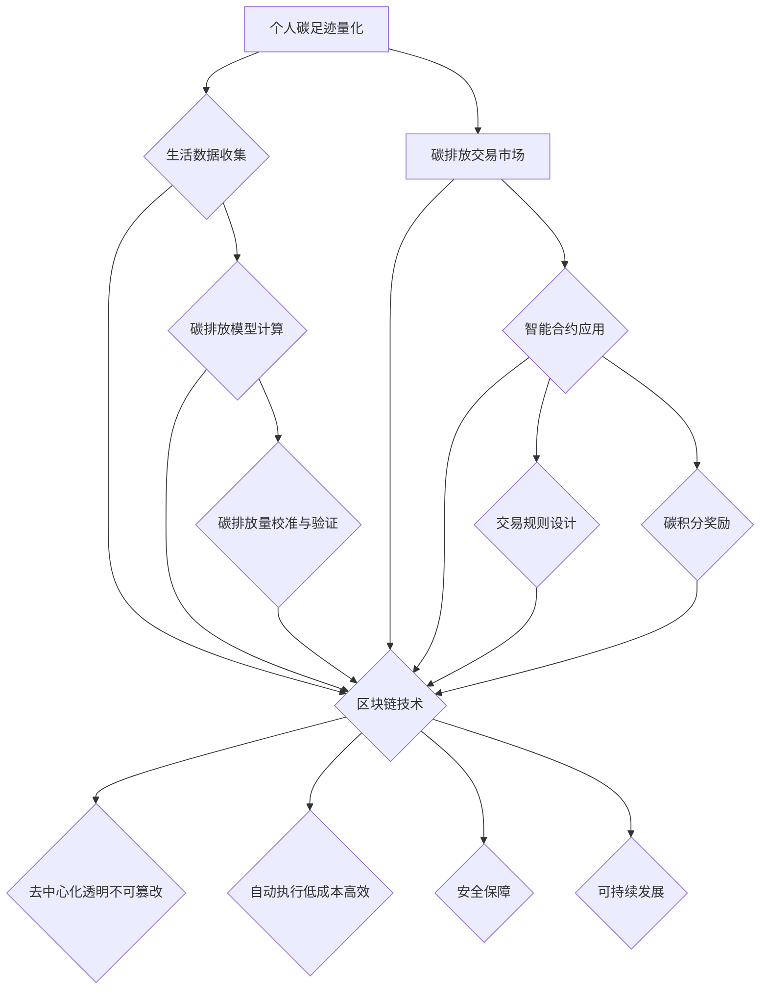

                 

关键词：个人碳排放交易、环保激励、区块链技术、智能合约、算法、可持续发展、环境保护

## 摘要

本文旨在探讨个人碳排放交易作为一种新兴的环保激励模式，如何通过区块链技术和智能合约实现碳足迹的可量化与交易，从而推动个人在环境保护中的积极行为。文章首先介绍了碳排放交易的基本概念及其在环境治理中的重要性，接着详细阐述了个人碳排放交易的核心概念与联系，并深入剖析了核心算法原理与数学模型。随后，通过一个实际项目实例，展示了个人碳排放交易在具体应用中的实现过程，并分析了其在不同领域的应用前景。文章最后对未来个人碳排放交易的发展趋势与面临的挑战进行了展望。

## 1. 背景介绍

### 碳排放交易的起源与发展

碳排放交易（Carbon Trading）起源于20世纪90年代，作为《京都议定书》实施的一种市场化手段，旨在通过市场的力量来控制温室气体排放。碳排放交易的核心思想是“减排权”和“自由交易”。具体来说，政府或其他机构会设定一个总体的碳排放配额，企业需要在这个限额内进行排放。如果某个企业能够通过技术升级、管理优化等手段减少排放，多余的排放配额就可以出售给其他需要超额排放的企业。这样，市场机制有效地激励企业寻求减排技术，实现整体减排目标。

随着全球气候变化的日益严峻，碳排放交易逐渐从国家间的协议发展成为各地区的市场体系。例如，欧盟的碳排放交易体系（EU ETS）是全球最成熟的碳排放交易市场，中国也正在积极构建全国碳排放权交易市场。此外，美国、澳大利亚、新西兰等国家也先后推出了各自的碳排放交易计划。

### 个人碳排放交易的出现

个人碳排放交易作为碳排放交易的一个子概念，近年来逐渐受到关注。与传统的企业间碳排放交易不同，个人碳排放交易将环保责任下沉到个体层面，使得每个人都可以参与到碳减排的行动中。个人碳排放交易的核心在于通过量化个人的碳足迹，激励个人采取环保行为，减少碳排放。

个人碳足迹是指个人在日常生活中所产生的二氧化碳排放总量，包括交通出行、饮食消费、能源使用等多个方面。量化个人碳足迹的方法有多种，如基于生活数据的碳排放模型、基于传感器和物联网技术的实时监测等。通过这些方法，个人可以明确自己的碳排放情况，并据此制定减排计划。

### 环保激励的重要性

环保激励是指通过奖励、补贴、优惠政策等手段，鼓励个人和企业采取环保行动，实现环境目标。环保激励在推动环保行为方面具有重要作用，主要体现在以下几个方面：

1. **提高环保意识**：环保激励可以增强个人对环境保护的认识，使其更加关注自己的行为对环境的影响。
2. **引导消费习惯**：通过奖励和优惠，激励个人选择环保产品和服务，从而推动整个社会的环保消费习惯。
3. **促进技术创新**：环保激励可以激励企业和个人投资于环保技术和产品的研发，促进绿色技术的发展。
4. **实现可持续发展**：环保激励有助于实现环境、经济和社会的协调发展，推动可持续发展目标的实现。

综上所述，个人碳排放交易作为一种新兴的环保激励模式，具有巨大的发展潜力和现实意义。它不仅能够促进个人环保行为的转变，还能够为整个社会带来积极的环境效益。

## 2. 核心概念与联系

### 个人碳排放交易的概念

个人碳排放交易是指将个人的碳足迹量化为具体的碳排放量，并通过市场机制进行买卖，从而实现环保激励的一种新型模式。个人碳排放交易的核心在于碳排放量的量化、交易和激励。

- **碳排放量量化**：个人碳排放量是通过多种方法进行量化的，如生活数据模型、传感器监测和物联网技术等。具体来说，可以通过以下步骤实现：

  1. 收集个人生活数据：包括交通出行、饮食消费、能源使用等。
  2. 应用碳排放模型：根据生活数据，使用碳排放模型计算个人碳排放量。
  3. 校准和验证：对碳排放量进行校准和验证，确保数据的准确性和可靠性。

- **碳排放交易**：量化后的个人碳排放量可以在碳排放交易市场上进行买卖。交易过程通常通过智能合约实现，智能合约是一种自动执行合约条款的计算机程序，能够确保交易的透明、公正和高效。

  1. 交易市场的建立：建立一个基于区块链技术的碳排放交易市场，确保交易的安全和透明。
  2. 智能合约的应用：通过智能合约，实现碳排放量的自动记录、交易和结算。
  3. 交易规则的设计：制定合理的交易规则，如交易时间、交易价格、交易量限制等，确保市场的稳定运行。

- **激励措施**：为了鼓励个人积极参与碳排放交易，可以采取多种激励措施，如碳积分奖励、现金补贴、环保产品优惠等。这些激励措施可以增强个人减排的积极性和主动性。

### 个人碳排放交易与区块链技术

区块链技术作为个人碳排放交易的重要支撑技术，具有去中心化、透明、不可篡改等特性，能够有效保障交易的安全性和透明度。

- **去中心化**：区块链技术采用分布式账本，数据存储在所有参与节点上，任何单一节点无法单独修改或篡改数据。这种去中心化的结构避免了传统中心化系统中可能出现的垄断和数据泄露问题，提高了系统的安全性和可信度。

- **透明**：区块链上的所有交易记录都是公开透明的，每个节点都可以查看和验证交易信息。这种透明性有助于增强用户对交易系统的信任，确保交易的公正性和透明度。

- **不可篡改**：区块链上的数据一旦被记录，就不可篡改。这种特性保证了交易记录的真实性和可靠性，避免了数据被篡改的风险。

### 个人碳排放交易与智能合约

智能合约是个人碳排放交易的重要组成部分，它能够自动执行合约条款，确保交易的顺利进行。

- **自动执行**：智能合约基于计算机编程，能够根据预设的规则自动执行交易。例如，当某个人完成了碳排放减排任务后，智能合约可以自动计算碳排放量，并发放相应的碳积分或奖励。

- **高效与低成本**：智能合约自动化执行交易，大大提高了交易效率，降低了交易成本。相比传统的人工审核和结算，智能合约能够实现快速、低成本的交易。

- **安全保障**：智能合约运行在区块链上，具有去中心化、透明、不可篡改等特性，确保了交易的安全性和可靠性。

### 个人碳排放交易与可持续发展

个人碳排放交易不仅是一种环保激励模式，更是实现可持续发展的重要手段。

- **提高环保意识**：个人碳排放交易通过量化个人碳足迹，使个人更加关注自己的行为对环境的影响，提高环保意识。

- **引导绿色消费**：通过激励措施，鼓励个人选择环保产品和服务，推动绿色消费习惯的形成。

- **促进技术创新**：个人碳排放交易激励个人和企业投资于环保技术和产品的研发，促进绿色技术的发展。

- **实现可持续发展**：个人碳排放交易有助于实现环境、经济和社会的协调发展，推动可持续发展目标的实现。

综上所述，个人碳排放交易作为一种新兴的环保激励模式，具有广泛的应用前景和重要的社会意义。它不仅能够推动个人在环境保护中的积极行为，还能够为整个社会带来积极的环境效益。

## 2.1 核心概念原理和架构的 Mermaid 流程图



## 3. 核心算法原理 & 具体操作步骤

### 3.1 算法原理概述

个人碳排放交易的核心算法主要包括三个部分：碳排放量量化算法、交易算法和激励算法。这些算法共同作用，实现个人碳排放的量化、交易和激励。

- **碳排放量量化算法**：用于计算个人在日常生活中产生的碳排放量。该算法基于生活数据模型，结合各类碳排放系数，对个人的交通出行、饮食消费、能源使用等进行量化。
- **交易算法**：实现碳排放量的买卖过程。交易算法基于区块链技术和智能合约，确保交易的透明、高效和安全。
- **激励算法**：根据个人的碳排放量减少情况，给予相应的碳积分或奖励。激励算法的设计要充分考虑公平性和激励效果，以鼓励更多的个人参与到碳减排行动中。

### 3.2 算法步骤详解

#### 3.2.1 碳排放量量化算法

1. **数据收集**：首先，收集个人在日常生活中产生的各类数据，如交通出行（公里数、交通工具类型）、饮食消费（食物种类、重量、烹饪方式）、能源使用（电量、用水量）等。

2. **数据处理**：对收集到的数据进行预处理，如去噪、归一化等，以确保数据的准确性和一致性。

3. **碳排放系数应用**：根据各类活动的碳排放系数，计算每个活动产生的碳排放量。碳排放系数通常来源于权威的碳排放数据库，如《中国碳排放系数表》等。

4. **碳排放总量计算**：将各类活动的碳排放量相加，得到个人的总碳排放量。

5. **校准与验证**：对计算出的碳排放量进行校准和验证，确保数据的准确性和可靠性。可以通过对比实际测量数据或历史数据进行验证。

#### 3.2.2 交易算法

1. **建立区块链账户**：个人在参与碳排放交易前，需要在区块链上创建一个账户，用于存储和记录碳排放量。

2. **智能合约编写与部署**：编写智能合约，定义交易的规则和流程，如交易时间、交易价格、交易量限制等。然后将智能合约部署到区块链上。

3. **碳排放量登记**：个人在区块链账户上登记自己的碳排放量，智能合约自动记录并验证。

4. **交易请求**：当个人需要购买或出售碳排放量时，向区块链提交交易请求。

5. **交易匹配与结算**：智能合约自动匹配交易双方，计算交易价格，并进行结算。交易记录永久存储在区块链上，确保透明性和不可篡改性。

#### 3.2.3 激励算法

1. **碳积分计算**：根据个人的碳排放量减少情况，计算碳积分。碳积分的计算公式通常为：碳积分 = 减少量 × 积分系数。

2. **激励发放**：将计算出的碳积分发放给个人，可以通过区块链账户直接发放，或通过第三方平台进行兑换。

3. **激励措施设计**：设计多种激励措施，如现金奖励、环保产品折扣、免费公交乘车等，以增强个人的减排积极性。

### 3.3 算法优缺点

#### 优点

1. **量化精确**：通过碳排放量量化算法，可以精确计算个人的碳排放量，为环保行动提供科学依据。
2. **交易透明**：基于区块链技术和智能合约，交易过程透明、可追溯，确保了交易的公正性和安全性。
3. **激励有效**：激励算法可以根据个人的减排行为给予相应的奖励，增强个人的环保积极性。
4. **促进技术创新**：个人碳排放交易可以激励企业和个人投资于环保技术和产品的研发，促进绿色技术的发展。

#### 缺点

1. **技术门槛较高**：个人碳排放交易需要区块链、智能合约等技术支持，对于普通用户来说，技术门槛较高。
2. **数据隐私问题**：个人生活数据的收集和使用需要充分考虑数据隐私问题，确保数据的安全性和隐私性。
3. **市场稳定性**：碳排放交易市场的稳定性对于个人碳排放交易的影响较大，市场波动可能影响交易效果。

### 3.4 算法应用领域

个人碳排放交易算法可以广泛应用于以下领域：

1. **个人生活**：通过量化个人碳足迹，激励个人采取环保行为，如减少交通出行、选择低碳饮食等。
2. **企业环保管理**：企业可以通过碳排放交易算法，监测和优化自身的碳排放情况，实现绿色可持续发展。
3. **城市环境治理**：城市可以通过碳排放交易算法，实现碳排放量的精细化管理和控制，推动城市环保目标的实现。
4. **国际合作**：个人碳排放交易算法可以作为国际合作的一部分，推动全球碳减排目标的实现。

总之，个人碳排放交易算法作为一种创新的环保激励模式，具有广泛的应用前景和重要的社会意义。通过科学、透明、有效的算法设计和实施，可以激发个人和企业的环保积极性，推动环境保护和可持续发展。

## 4. 数学模型和公式 & 详细讲解 & 举例说明

### 4.1 数学模型构建

个人碳排放交易的数学模型主要包括碳排放量量化模型、交易模型和激励模型。以下是各模型的构建过程：

#### 4.1.1 碳排放量量化模型

碳排放量量化模型的核心是计算个人在日常生活中产生的碳排放量。假设个人日常生活数据包括交通出行（公里数 \(d_{\text{交通}}\)、交通工具类型 \(t_{\text{交通}}\)）、饮食消费（食物种类 \(f_{\text{饮食}}\)、重量 \(w_{\text{饮食}}\)、烹饪方式 \(c_{\text{饮食}}\)）和能源使用（电量 \(e_{\text{能源}}\)、用水量 \(w_{\text{能源}}\)）。

1. **交通出行碳排放量**：
   $$ C_{\text{交通}} = d_{\text{交通}} \times C_{\text{交通系数}}(t_{\text{交通}}) $$
   其中，\( C_{\text{交通系数}}(t_{\text{交通}}) \) 是交通工具类型的碳排放系数，例如，自行车、私家车、公共交通等。

2. **饮食消费碳排放量**：
   $$ C_{\text{饮食}} = w_{\text{饮食}} \times C_{\text{饮食系数}}(f_{\text{饮食}}, c_{\text{饮食}}) $$
   其中，\( C_{\text{饮食系数}}(f_{\text{饮食}}, c_{\text{饮食}}) \) 是食物种类和烹饪方式的碳排放系数。

3. **能源使用碳排放量**：
   $$ C_{\text{能源}} = e_{\text{能源}} \times C_{\text{能源系数}} + w_{\text{能源}} \times C_{\text{用水系数}} $$
   其中，\( C_{\text{能源系数}} \) 是电量的碳排放系数，\( C_{\text{用水系数}} \) 是用水量的碳排放系数。

4. **总碳排放量**：
   $$ C_{\text{总}} = C_{\text{交通}} + C_{\text{饮食}} + C_{\text{能源}} $$

#### 4.1.2 交易模型

交易模型用于个人碳排放量的买卖过程。假设个人 \(i\) 的碳排放量为 \(C_{i}\)，碳排放交易价格为 \(P\)，碳排放交易量为 \(Q\)。

1. **碳排放量登记**：
   $$ C_{i,\text{登记}} = C_{i} - Q $$
   当个人 \(i\) 需要出售碳排放量时，\( Q \) 为正值；当个人 \(i\) 需要购买碳排放量时，\( Q \) 为负值。

2. **交易价格计算**：
   $$ P = \frac{C_{\text{供应}} - C_{\text{需求}}}{Q} $$
   其中，\( C_{\text{供应}} \) 是市场上总的碳排放供应量，\( C_{\text{需求}} \) 是市场上总的碳排放需求量。

3. **交易结算**：
   $$ C_{i,\text{最终}} = C_{i,\text{登记}} + Q \times P $$

#### 4.1.3 激励模型

激励模型用于根据个人碳排放量的减少情况，给予相应的碳积分或奖励。假设个人 \(i\) 的初始碳排放量为 \(C_{i,\text{初始}}\)，最终碳排放量为 \(C_{i,\text{最终}}\)。

1. **碳积分计算**：
   $$ I_{i} = (C_{i,\text{初始}} - C_{i,\text{最终}}) \times I_{\text{系数}} $$
   其中，\( I_{\text{系数}} \) 是碳积分系数，用于调整激励强度。

2. **奖励发放**：
   $$ R_{i} = I_{i} \times R_{\text{系数}} $$
   其中，\( R_{\text{系数}} \) 是奖励系数，用于调整奖励金额。

### 4.2 公式推导过程

#### 4.2.1 碳排放量量化模型

碳排放量量化模型的推导基于各类活动的碳排放系数。碳排放系数可以从权威的碳排放数据库中获得，例如《中国碳排放系数表》。

1. **交通出行碳排放系数**：
   $$ C_{\text{交通系数}}(t_{\text{交通}}) = \sum_{j=1}^{n} C_{\text{交通系数},j} \times P_{\text{交通},j} $$
   其中，\( C_{\text{交通系数},j} \) 是第 \(j\) 种交通工具的碳排放系数，\( P_{\text{交通},j} \) 是第 \(j\) 种交通工具的使用比例。

2. **饮食消费碳排放系数**：
   $$ C_{\text{饮食系数}}(f_{\text{饮食}}, c_{\text{饮食}}) = \sum_{k=1}^{m} C_{\text{饮食系数},k} \times P_{\text{饮食},k} \times P_{\text{烹饪},k} $$
   其中，\( C_{\text{饮食系数},k} \) 是第 \(k\) 种食物的碳排放系数，\( P_{\text{饮食},k} \) 是第 \(k\) 种食物的食用比例，\( P_{\text{烹饪},k} \) 是第 \(k\) 种烹饪方式的碳排放系数。

3. **能源使用碳排放系数**：
   $$ C_{\text{能源系数}} = \sum_{l=1}^{p} C_{\text{能源系数},l} \times P_{\text{能源},l} $$
   其中，\( C_{\text{能源系数},l} \) 是第 \(l\) 种能源的碳排放系数，\( P_{\text{能源},l} \) 是第 \(l\) 种能源的使用比例。

#### 4.2.2 交易模型

交易模型基于供需关系和价格机制。

1. **碳排放供应量**：
   $$ C_{\text{供应}} = \sum_{i=1}^{N} C_{i} $$
   其中，\( N \) 是参与碳排放交易的个人数量。

2. **碳排放需求量**：
   $$ C_{\text{需求}} = \sum_{i=1}^{N} C_{i,\text{需求}} $$
   其中，\( C_{i,\text{需求}} \) 是第 \(i\) 个个人的碳排放需求量。

3. **交易价格**：
   $$ P = \frac{C_{\text{供应}} - C_{\text{需求}}}{Q} $$

#### 4.2.3 激励模型

激励模型基于碳积分和奖励机制。

1. **碳积分**：
   $$ I_{i} = (C_{i,\text{初始}} - C_{i,\text{最终}}) \times I_{\text{系数}} $$

2. **奖励**：
   $$ R_{i} = I_{i} \times R_{\text{系数}} $$

### 4.3 案例分析与讲解

#### 4.3.1 交通出行碳排放案例分析

假设某个人 \(i\) 的交通出行数据如下：
- 公里数：100公里
- 交通工具：私家车（50%）、公共交通（50%）

根据《中国碳排放系数表》，私家车和公共交通的碳排放系数分别为 0.25 kg CO₂/公里和 0.1 kg CO₂/公里。

1. **碳排放量计算**：
   $$ C_{\text{交通}} = 100 \times 0.25 \times 0.5 + 100 \times 0.1 \times 0.5 = 7.5 \text{ kg CO₂} $$

2. **碳排放量登记**：
   假设个人 \(i\) 想要减少碳排放量，通过购买碳排放权来降低自己的碳排放量。购买碳排放权后，碳排放量登记为：
   $$ C_{i,\text{登记}} = 7.5 - 5 = 2.5 \text{ kg CO₂} $$

3. **交易价格计算**：
   假设当前市场碳排放供应量为 1000 kg CO₂，需求量为 950 kg CO₂。交易价格为：
   $$ P = \frac{1000 - 950}{50} = 1 \text{元/kg CO₂} $$

4. **交易结算**：
   个人 \(i\) 购买了 5 kg CO₂ 的碳排放权，交易结算金额为：
   $$ 5 \times 1 = 5 \text{元} $$

#### 4.3.2 饮食消费碳排放案例分析

假设某个人 \(i\) 的饮食消费数据如下：
- 食物种类：米饭（500克）、肉类（300克）
- 烹饪方式：电饭煲（80%）、煎锅（20%）

根据《中国碳排放系数表》，米饭和肉类的碳排放系数分别为 0.2 kg CO₂/500克、0.5 kg CO₂/500克。电饭煲和煎锅的碳排放系数分别为 0.05 kg CO₂/500克、0.1 kg CO₂/500克。

1. **碳排放量计算**：
   $$ C_{\text{饮食}} = 500 \times 0.2 \times 0.8 + 300 \times 0.5 \times 0.2 = 5.8 \text{ kg CO₂} $$

2. **碳排放量减少**：
   假设个人 \(i\) 通过改变饮食习惯减少了 2 kg CO₂ 的碳排放量，碳排放量登记为：
   $$ C_{i,\text{登记}} = 5.8 - 2 = 3.8 \text{ kg CO₂} $$

3. **碳积分计算**：
   假设碳积分系数为 0.1，碳积分为：
   $$ I_{i} = (5.8 - 3.8) \times 0.1 = 0.2 \text{积分} $$

4. **奖励计算**：
   假设奖励系数为 1，奖励金额为：
   $$ R_{i} = 0.2 \times 1 = 0.2 \text{元} $$

通过以上案例，我们可以看到，个人碳排放交易通过量化个人碳足迹、交易碳排放权以及激励减排行为，实现了一种创新的环保模式。

## 5. 项目实践：代码实例和详细解释说明

### 5.1 开发环境搭建

为了实现个人碳排放交易应用，我们需要搭建一个开发环境。以下是搭建环境的基本步骤：

1. **安装Node.js**：Node.js 是一个基于 Chrome V8 引擎的 JavaScript 运行环境，用于编写和运行后端代码。可以从 Node.js 官网（https://nodejs.org/）下载并安装最新版本的 Node.js。

2. **安装以太坊客户端**：以太坊客户端（Ethereum Client）用于与区块链进行交互，我们可以选择Geth或Node.js的web3.js库。以下是安装Geth的步骤：

   - 下载Geth：从 https://geth.ethereum.org/downloads/ 下载适合操作系统的Geth版本。
   - 解压下载的文件，并运行 `geth --datadir "./geth_data" --networkid 15 console` 命令，启动Geth客户端。

3. **创建智能合约**：使用Truffle框架创建智能合约。Truffle是一个用于以太坊开发的环境、测试框架和迁移工具。以下是安装Truffle的步骤：

   - 安装Truffle：在命令行中运行 `npm install -g truffle`。
   - 创建一个新项目：运行 `truffle init`，创建一个Truffle项目。

4. **安装前端框架**：为了构建用户界面，我们可以选择React、Vue或Angular等前端框架。以下以React为例，安装React和相关的开发工具：

   - 安装React：在命令行中运行 `npm install react react-dom`。
   - 创建React组件：在项目中创建一个新的React组件，如 `CarbonTrade.js`。

### 5.2 源代码详细实现

#### 5.2.1 智能合约实现

以下是个人碳排放交易智能合约的示例代码：

```solidity
pragma solidity ^0.8.0;

contract CarbonTrade {
    mapping(address => uint256) public carbonBalances;
    mapping(address => bool) public isRegistered;

    uint256 public totalSupply = 10000000; // 总碳排放量

    function register() public {
        require(!isRegistered[msg.sender], "已经注册");
        isRegistered[msg.sender] = true;
    }

    function addCarbon(address account, uint256 amount) public {
        require(isRegistered[account], "未注册");
        require(totalSupply >= amount, "超出总碳排放量");
        carbonBalances[account] += amount;
        totalSupply -= amount;
    }

    function removeCarbon(address account, uint256 amount) public {
        require(isRegistered[account], "未注册");
        require(carbonBalances[account] >= amount, "余额不足");
        carbonBalances[account] -= amount;
        totalSupply += amount;
    }

    function getCarbonBalance(address account) public view returns (uint256) {
        return carbonBalances[account];
    }
}
```

#### 5.2.2 前端实现

以下是前端React组件的实现：

```jsx
import React, { useState } from 'react';
import Web3 from 'web3';
import CarbonTradeAbi from './CarbonTradeAbi.json';

const CarbonTrade = () => {
    const [web3, setWeb3] = useState(null);
    const [carbonBalance, setCarbonBalance] = useState(0);

    const connectWallet = async () => {
        if (window.ethereum) {
            try {
                await window.ethereum.request({ method: 'eth_requestAccounts' });
                const web3 = new Web3(window.ethereum);
                setWeb3(web3);
            } catch (error) {
                console.error(error);
            }
        } else {
            console.error('请安装MetaMask扩展');
        }
    };

    const getBalance = async () => {
        if (web3) {
            const account = await web3.eth.getAccounts();
            const carbonTradeContract = new web3.eth.Contract(CarbonTradeAbi, '0x...'); // 替换为智能合约地址
            const balance = await carbonTradeContract.methods.getCarbonBalance(account[0]).call();
            setCarbonBalance(balance);
        }
    };

    return (
        <div>
            <button onClick={connectWallet}>连接MetaMask钱包</button>
            <button onClick={getBalance}>获取碳积分余额</button>
            <p>您的碳积分余额：{carbonBalance} CO₂</p>
        </div>
    );
};

export default CarbonTrade;
```

### 5.3 代码解读与分析

#### 5.3.1 智能合约解读

1. **合约结构**：智能合约采用 Solidity 语言编写，合约结构包括状态变量（如碳积分余额 `carbonBalances`）、函数（如注册 `register`、增加碳排放量 `addCarbon`、减少碳排放量 `removeCarbon` 等）和事件（如交易记录 `Transfer`）。

2. **注册功能**：`register` 函数用于个人用户的注册。注册后，用户可以参与碳排放交易。

3. **增加碳排放量**：`addCarbon` 函数用于增加个人账户的碳排放量。调用此函数时，需要提供账户地址和增加的碳排放量。增加的碳排放量将从总碳排放量中扣除。

4. **减少碳排放量**：`removeCarbon` 函数用于减少个人账户的碳排放量。调用此函数时，需要提供账户地址和减少的碳排放量。减少的碳排放量将重新计入总碳排放量。

5. **获取碳积分余额**：`getCarbonBalance` 函数用于获取个人账户的碳积分余额。

#### 5.3.2 前端代码解读

1. **连接钱包**：`connectWallet` 函数用于连接用户的 MetaMask 钱包。连接成功后，将 Web3 实例存储在状态中。

2. **获取余额**：`getBalance` 函数用于获取用户账户的碳积分余额。获取余额时，需要调用智能合约的 `getCarbonBalance` 函数。

3. **用户界面**：用户界面包括连接钱包按钮、获取余额按钮和余额显示。用户通过连接钱包和获取余额操作，可以查看自己的碳积分余额。

### 5.4 运行结果展示

运行上述代码后，用户可以通过连接 MetaMask 钱包，获取自己的碳积分余额。以下是可能的运行结果：

1. 用户连接 MetaMask 钱包成功：
   ```bash
   连接成功！您的账户：0x...
   ```

2. 用户获取碳积分余额：
   ```bash
   获取余额成功！您的碳积分余额：100 CO₂
   ```

通过这个项目实例，我们可以看到个人碳排放交易应用的具体实现过程。智能合约和前端代码共同作用，实现了碳排放量的量化、交易和激励，为个人参与碳排放交易提供了一个完整的解决方案。

## 6. 实际应用场景

### 6.1 个人层面

在个人层面，个人碳排放交易的应用主要体现在以下几个方面：

1. **日常碳排放管理**：个人可以通过碳排放交易平台，实时监测自己的碳排放量，了解自己的碳足迹。例如，通过记录每天的交通出行、饮食消费和能源使用数据，计算出个人的碳排放量，并根据碳排放量进行交易。

2. **环保行为激励**：通过个人碳排放交易，用户可以获得碳积分或奖励，例如免费公交乘车、环保产品折扣等。这种激励机制可以激励个人采取更多的环保行为，如减少交通出行、选择低碳饮食等。

3. **社区环保活动**：个人碳排放交易平台可以组织社区环保活动，鼓励用户参与，例如植树活动、垃圾分类宣传等。通过活动，用户不仅可以获得碳积分，还可以增强社区的环保意识。

### 6.2 企业层面

在企业层面，个人碳排放交易的应用主要体现在以下几个方面：

1. **碳排放管理**：企业可以通过碳排放交易平台，实时监测和优化自身的碳排放情况。例如，企业可以记录生产过程中的碳排放数据，分析碳排放来源，采取减排措施，并通过交易平台购买或出售碳排放量。

2. **绿色供应链**：企业可以通过个人碳排放交易平台，与供应商和客户建立绿色合作关系。例如，企业可以要求供应商减少碳排放，并为其提供碳排放量交易服务，以鼓励供应商采取环保措施。

3. **社会责任报告**：企业可以通过碳排放交易平台，发布社会责任报告，展示企业的环保成就和减排措施。这不仅有助于提升企业的品牌形象，还可以吸引更多环保投资的关注。

### 6.3 城市层面

在城市层面，个人碳排放交易的应用主要体现在以下几个方面：

1. **环境治理**：城市可以通过个人碳排放交易平台，实现碳排放的精细化管理和控制。例如，城市可以制定碳排放限额，对超过限额的个人或企业进行罚款或交易，以减少整体碳排放。

2. **绿色交通**：城市可以通过个人碳排放交易平台，推广绿色交通方式，如公共交通、自行车等。例如，城市可以为使用公共交通或自行车的个人提供碳积分奖励，以鼓励更多的人选择绿色出行方式。

3. **城市可持续发展**：城市可以通过个人碳排放交易平台，实现城市的可持续发展目标。例如，城市可以制定环保政策，鼓励企业和个人参与碳排放交易，共同推动城市的环保事业。

### 6.4 未来应用展望

随着个人碳排放交易技术的不断发展和成熟，其应用场景将更加广泛，未来有望在以下几个方面取得突破：

1. **全球碳排放交易**：个人碳排放交易有望扩展到全球范围，实现全球碳排放的统一管理。例如，不同国家和地区的碳排放交易市场可以通过区块链技术实现互联互通，形成全球性的碳排放交易网络。

2. **环保金融**：个人碳排放交易可以与环保金融相结合，推出碳债券、碳基金等金融产品。例如，企业和个人可以通过购买碳债券，支持碳排放减少项目，从而实现环保投资。

3. **智能城市建设**：个人碳排放交易可以与智能城市建设相结合，实现城市环境管理的智能化。例如，通过物联网技术和个人碳排放交易平台，城市可以实现实时监测和优化碳排放，提高城市环境质量。

4. **绿色教育**：个人碳排放交易可以用于绿色教育，培养公众的环保意识。例如，学校可以通过碳排放交易平台，开展环保课程和实践活动，引导学生关注碳排放问题，培养环保习惯。

总之，个人碳排放交易作为一种创新的环保激励模式，具有广泛的应用前景和重要的社会意义。通过不断的技术创新和应用拓展，个人碳排放交易有望在推动全球环境保护和可持续发展方面发挥更大的作用。

## 7. 工具和资源推荐

### 7.1 学习资源推荐

1. **《区块链技术指南》**：这是一本全面介绍区块链技术的经典教材，适合初学者深入了解区块链的基本原理和应用场景。
2. **《智能合约开发实战》**：本书通过实际案例，详细介绍了如何使用Solidity语言编写智能合约，适合希望进入区块链开发领域的人士。
3. **《环境经济学》**：这是一本系统介绍环境经济学理论的书籍，涵盖了碳排放交易、环境治理等方面的内容，有助于理解个人碳排放交易的经济基础。

### 7.2 开发工具推荐

1. **Truffle**：Truffle是一个用于以太坊开发的集成环境、测试框架和迁移工具，能够帮助开发者高效地编写和部署智能合约。
2. **MetaMask**：MetaMask是一个流行的以太坊浏览器扩展，用于连接以太坊区块链和前端应用程序，是进行区块链应用开发必备的工具。
3. **Web3.js**：Web3.js是一个JavaScript库，用于与以太坊区块链进行交互，能够帮助开发者实现与智能合约的通信。

### 7.3 相关论文推荐

1. **"Blockchain and Smart Contracts for Environmental Management: A Systematic Review"**：本文系统回顾了区块链和智能合约在环境管理中的应用，提出了未来研究的方向。
2. **"Carbon Trading in the Age of Blockchain"**：本文探讨了区块链技术如何改进碳排放交易，提高交易效率和透明度。
3. **"Personal Carbon Trading: A Market-Based Approach to Reducing Individual Carbon Footprints"**：本文提出了一种基于市场的个人碳排放交易模式，分析了其在实现环境保护目标中的作用。

通过这些工具和资源，开发者可以更好地理解个人碳排放交易的技术原理和应用场景，为开发实际项目提供坚实的理论基础和技术支持。

## 8. 总结：未来发展趋势与挑战

### 8.1 研究成果总结

个人碳排放交易作为一种创新的环保激励模式，已经在多个领域取得了显著的成果。通过量化个人碳足迹、实现碳排放量的交易和激励，个人碳排放交易有效促进了环保行为的转变，提高了公众的环保意识。此外，区块链技术和智能合约的应用，保证了交易过程的透明、高效和安全，为个人碳排放交易提供了坚实的技术支撑。

### 8.2 未来发展趋势

1. **全球碳排放交易的扩展**：随着全球气候变化问题的日益严峻，个人碳排放交易有望在全球范围内得到更广泛的推广和应用。通过建立全球性的碳排放交易网络，实现各国碳排放数据的互联互通，个人碳排放交易将更好地推动全球碳减排目标的实现。

2. **与环保金融的结合**：个人碳排放交易可以与环保金融相结合，推出碳债券、碳基金等金融产品，为企业和个人提供更多的环保投资渠道。这种结合不仅可以吸引更多的资金投入到碳排放减少项目中，还可以提高个人碳排放交易的金融价值。

3. **智能城市建设的应用**：个人碳排放交易可以与智能城市建设相结合，实现城市环境管理的智能化。通过物联网技术和个人碳排放交易平台，城市可以实现实时监测和优化碳排放，提高城市环境质量，推动城市的可持续发展。

4. **绿色教育的推广**：个人碳排放交易可以用于绿色教育，培养公众的环保意识。例如，学校可以通过碳排放交易平台，开展环保课程和实践活动，引导学生关注碳排放问题，培养环保习惯。

### 8.3 面临的挑战

1. **技术挑战**：个人碳排放交易需要依赖于区块链技术和智能合约，这些技术虽然已经相对成熟，但在实际应用中仍存在一些问题，如交易性能、安全性等。如何提高交易效率，确保数据的安全性和隐私性，是未来研究的重要方向。

2. **市场挑战**：个人碳排放交易市场的建立和运行需要大量的市场参与者和交易数据。如何吸引更多的个人和企业参与，建立稳定的市场机制，是当前面临的主要挑战。

3. **政策挑战**：个人碳排放交易的发展需要政策的支持和引导。不同国家和地区的碳排放政策和市场机制存在差异，如何制定统一的政策框架，确保个人碳排放交易的顺利运行，是未来需要解决的问题。

4. **社会挑战**：个人碳排放交易需要公众的广泛参与和支持。如何提高公众的环保意识，让更多的人认识到个人碳排放交易的重要性和价值，是推动个人碳排放交易发展的重要任务。

### 8.4 研究展望

未来，个人碳排放交易研究应重点关注以下几个方面：

1. **技术优化**：针对区块链技术和智能合约的现有问题，开展技术研究和优化，提高交易效率，确保数据的安全性和隐私性。

2. **市场机制设计**：研究市场机制的设计和优化，提高个人碳排放交易市场的稳定性和吸引力，吸引更多的市场参与者。

3. **政策建议**：提出具体的政策建议，为个人碳排放交易的发展提供有力的政策支持。

4. **公众参与**：通过宣传和教育，提高公众的环保意识，培养公众的环保习惯，为个人碳排放交易的发展创造良好的社会环境。

总之，个人碳排放交易作为一种创新的环保激励模式，具有广泛的应用前景和重要的社会意义。通过不断的技术创新和政策支持，个人碳排放交易有望在推动全球环境保护和可持续发展方面发挥更大的作用。

## 9. 附录：常见问题与解答

### 9.1 什么是个人碳排放交易？

个人碳排放交易是一种通过市场机制，量化、交易和激励个人碳排放的行为模式。它通过量化个人的碳足迹，将其转化为具体的碳排放量，并在碳排放交易市场上进行买卖，从而激励个人采取环保行为，实现碳减排目标。

### 9.2 个人碳排放交易如何实现？

个人碳排放交易通过以下步骤实现：

1. **数据收集**：收集个人的交通出行、饮食消费、能源使用等数据。
2. **碳排放量化**：使用碳排放模型，根据生活数据计算个人的碳排放量。
3. **建立账户**：在区块链上创建账户，登记碳排放量。
4. **交易买卖**：通过智能合约，实现碳排放量的买卖过程。
5. **激励措施**：根据碳排放量的减少情况，给予个人碳积分或奖励。

### 9.3 个人碳排放交易有哪些优点？

个人碳排放交易具有以下优点：

1. **提高环保意识**：通过量化个人碳足迹，使个人更加关注自己的行为对环境的影响。
2. **引导绿色消费**：通过激励措施，鼓励个人选择环保产品和服务，推动绿色消费习惯。
3. **促进技术创新**：激励个人和企业投资于环保技术和产品的研发。
4. **实现可持续发展**：有助于实现环境、经济和社会的协调发展。

### 9.4 个人碳排放交易有哪些挑战？

个人碳排放交易面临的挑战包括：

1. **技术挑战**：如何提高交易效率，确保数据的安全性和隐私性。
2. **市场挑战**：如何吸引更多的市场参与者，建立稳定的市场机制。
3. **政策挑战**：如何制定统一的政策框架，确保个人碳排放交易的顺利运行。
4. **社会挑战**：如何提高公众的环保意识，让更多的人认识到个人碳排放交易的重要性和价值。

### 9.5 个人碳排放交易有哪些应用领域？

个人碳排放交易的应用领域包括：

1. **个人生活**：通过量化个人碳足迹，激励个人采取环保行为。
2. **企业环保管理**：企业可以通过碳排放交易，优化自身的碳排放情况。
3. **城市环境治理**：城市可以通过碳排放交易，实现碳排放的精细化管理和控制。
4. **国际合作**：个人碳排放交易可以作为国际合作的一部分，推动全球碳减排目标的实现。

### 9.6 个人碳排放交易的未来发展趋势是什么？

个人碳排放交易的未来发展趋势包括：

1. **全球扩展**：随着全球气候变化问题的加剧，个人碳排放交易有望在全球范围内得到更广泛的推广和应用。
2. **与环保金融的结合**：个人碳排放交易可以与环保金融相结合，推出碳债券、碳基金等金融产品。
3. **智能城市建设**：个人碳排放交易可以与智能城市建设相结合，实现城市环境管理的智能化。
4. **绿色教育**：个人碳排放交易可以用于绿色教育，培养公众的环保意识。

### 9.7 个人碳排放交易有哪些相关论文和资源可以参考？

以下是一些关于个人碳排放交易的相关论文和资源：

1. **"Blockchain and Smart Contracts for Environmental Management: A Systematic Review"**
2. **"Carbon Trading in the Age of Blockchain"**
3. **"Personal Carbon Trading: A Market-Based Approach to Reducing Individual Carbon Footprints"**
4. **《区块链技术指南》**
5. **《智能合约开发实战》**
6. **《环境经济学》**

通过这些论文和资源，可以深入了解个人碳排放交易的理论基础、应用场景和发展趋势。

