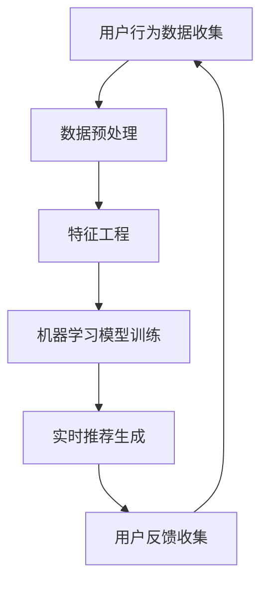

                 

关键词：个性化体验、AI、电商搜索导购、机器学习、推荐系统、用户行为分析

> 摘要：随着电商行业的迅猛发展，消费者对于个性化体验的需求日益增长。本文探讨了如何利用人工智能技术，特别是机器学习算法，构建一个能够实现千人千面的电商搜索导购系统。通过深入分析用户行为数据，本文提出了一套完整的解决方案，旨在为用户提供更精准、更个性化的购物体验。

## 1. 背景介绍

在当今数字化时代，电子商务已成为人们生活中不可或缺的一部分。消费者不仅希望能够方便快捷地购买商品，还期望购物过程能够更加个性化、定制化。为此，电商企业纷纷投入巨资研发和优化搜索导购系统，以期提升用户体验，增加销售额。然而，传统搜索导购系统往往存在几个痛点：首先，搜索结果单一，无法满足用户的个性化需求；其次，推荐算法缺乏灵活性，难以适应不断变化的市场环境；最后，用户隐私保护问题日益突出，如何在数据利用与隐私保护之间找到平衡点成为一大挑战。

为了解决这些问题，人工智能（AI）技术，尤其是机器学习算法，成为电商搜索导购系统优化的重要工具。通过深度学习、推荐系统等技术，可以实现对用户行为数据的全面分析，进而构建出个性化的购物推荐模型。本文将探讨如何利用AI技术打造一个具有高度个性化体验的电商搜索导购系统，以提升用户体验，增加用户粘性。

## 2. 核心概念与联系

### 2.1 用户行为分析

用户行为分析是指通过收集和分析用户在电商平台上的一系列活动数据（如浏览记录、购买历史、点击行为等），来了解用户兴趣、偏好和需求。用户行为数据是构建个性化推荐系统的基础。

### 2.2 推荐系统

推荐系统是一种根据用户历史行为和偏好，向用户推荐相关商品或信息的技术。推荐系统可以分为基于内容的推荐、协同过滤推荐和混合推荐等类型。基于内容的推荐主要依据商品特征与用户兴趣特征相似度进行推荐；协同过滤推荐则通过分析用户之间的相似性来推荐商品；混合推荐是将多种推荐方法结合起来，以提升推荐效果。

### 2.3 机器学习算法

机器学习算法是人工智能的核心技术之一，通过训练数据模型，使计算机能够自动识别规律和模式。在电商搜索导购系统中，常用的机器学习算法包括决策树、随机森林、支持向量机、神经网络等。

### 2.4 数据流架构

数据流架构是指用于处理实时数据流的系统架构。在电商搜索导购系统中，数据流架构负责收集、处理和存储用户行为数据，为推荐系统提供实时数据支持。

### 2.5 数据隐私保护

数据隐私保护是指在数据处理过程中，保护用户隐私数据不被泄露或滥用。在构建个性化推荐系统时，如何确保用户隐私得到有效保护是一个重要问题。

### 2.6 Mermaid 流程图



## 3. 核心算法原理 & 具体操作步骤

### 3.1 算法原理概述

个性化电商搜索导购系统主要依托以下三个核心算法：

1. **协同过滤算法**：通过分析用户之间的相似性，为用户推荐相似用户喜欢的产品。
2. **基于内容的推荐算法**：根据用户的历史行为和商品的特征，为用户推荐与之相关的商品。
3. **深度学习算法**：利用神经网络模型，从海量用户数据中挖掘深层次的关联性，提升推荐准确性。

### 3.2 算法步骤详解

#### 3.2.1 数据收集与预处理

1. **数据收集**：从电商平台上收集用户行为数据，包括浏览记录、购买历史、点击行为等。
2. **数据预处理**：对收集到的数据进行清洗、去重、格式化等操作，确保数据质量。

#### 3.2.2 特征工程

1. **用户特征**：包括用户年龄、性别、地理位置、消费水平等。
2. **商品特征**：包括商品类别、品牌、价格、销量、评价等。
3. **交互特征**：包括用户在平台上的浏览时长、点击次数、购买转化率等。

#### 3.2.3 机器学习模型训练

1. **协同过滤算法**：基于用户-商品评分矩阵，通过矩阵分解或基于模型的协同过滤方法训练推荐模型。
2. **基于内容的推荐算法**：通过计算用户和商品之间的特征相似度，为用户推荐相似的商品。
3. **深度学习算法**：构建深度神经网络模型，对用户行为数据进行训练，提取深层次的特征。

#### 3.2.4 实时推荐生成

1. **推荐生成**：根据用户的历史行为和当前需求，生成个性化推荐列表。
2. **实时更新**：根据用户的新行为数据，实时调整推荐模型，确保推荐结果始终与用户需求保持一致。

#### 3.2.5 用户反馈收集与优化

1. **反馈收集**：收集用户对推荐结果的反馈，包括点击、购买、评价等。
2. **模型优化**：根据用户反馈，调整推荐模型参数，提升推荐效果。

### 3.3 算法优缺点

#### 3.3.1 协同过滤算法

**优点**：简单易实现，能够发现用户之间的相似性，推荐效果较好。

**缺点**：容易受到稀疏数据矩阵的影响，推荐结果可能过于单一，无法满足个性化需求。

#### 3.3.2 基于内容的推荐算法

**优点**：能够根据用户兴趣和商品特征为用户推荐相关商品，适用于内容丰富的电商平台。

**缺点**：难以应对用户兴趣的多样化，推荐结果可能缺乏创新性。

#### 3.3.3 深度学习算法

**优点**：能够从海量数据中提取深层次的关联性，推荐效果更加精准。

**缺点**：模型训练过程复杂，需要大量的计算资源和时间。

### 3.4 算法应用领域

个性化电商搜索导购系统可以应用于各大电商平台、在线教育、视频推荐等领域，为用户提供个性化的服务，提升用户满意度。

## 4. 数学模型和公式 & 详细讲解 & 举例说明

### 4.1 数学模型构建

个性化电商搜索导购系统的核心是推荐模型，本文采用以下数学模型：

$$
\text{推荐模型} = f(\text{用户特征向量}, \text{商品特征向量})
$$

其中，$f$ 为映射函数，用户特征向量和商品特征向量分别为：

$$
\text{用户特征向量} = [u_1, u_2, \ldots, u_n]
$$

$$
\text{商品特征向量} = [v_1, v_2, \ldots, v_m]
$$

### 4.2 公式推导过程

根据协同过滤算法的思想，推荐模型可以表示为：

$$
\text{推荐模型} = \text{用户兴趣向量} \cdot \text{商品兴趣向量}
$$

其中，用户兴趣向量和商品兴趣向量可以通过矩阵分解得到：

$$
\text{用户兴趣向量} = U \cdot R
$$

$$
\text{商品兴趣向量} = V \cdot R
$$

其中，$R$ 为用户-商品评分矩阵，$U$ 和 $V$ 分别为用户和商品的 latent feature 矩阵。

### 4.3 案例分析与讲解

假设有一个电商平台，用户A在过去一个月内浏览了商品1、2、3，分别给出了评分5、4、5。现在需要为用户A推荐一个相似的商品。

1. **数据收集与预处理**：收集用户A的浏览记录和评分数据，进行清洗和格式化处理。
2. **特征工程**：提取用户A的浏览记录中的商品ID和评分，构成用户特征向量。
3. **机器学习模型训练**：利用协同过滤算法训练用户-商品评分矩阵，得到用户兴趣向量和商品兴趣向量。
4. **实时推荐生成**：根据用户A的用户兴趣向量和商品兴趣向量，计算相似度，生成推荐列表。
5. **用户反馈收集与优化**：用户A对推荐的商品进行反馈，调整推荐模型，提高推荐效果。

## 5. 项目实践：代码实例和详细解释说明

### 5.1 开发环境搭建

1. **Python环境**：安装Python 3.8及以上版本。
2. **库安装**：安装NumPy、Pandas、Scikit-learn、TensorFlow等库。

### 5.2 源代码详细实现

以下是协同过滤算法的Python代码实现：

```python
import numpy as np
import pandas as pd
from sklearn.model_selection import train_test_split
from sklearn.metrics.pairwise import cosine_similarity

# 读取用户-商品评分数据
data = pd.read_csv('data.csv')

# 分离用户ID和商品ID
users = data['user_id'].unique()
items = data['item_id'].unique()

# 创建用户-商品评分矩阵
rating_matrix = np.zeros((len(users), len(items)))
for index, row in data.iterrows():
    user_id = row['user_id']
    item_id = row['item_id']
    rating = row['rating']
    rating_matrix[users.index(user_id), items.index(item_id)] = rating

# 分割训练集和测试集
train_data, test_data = train_test_split(rating_matrix, test_size=0.2, random_state=42)

# 训练用户-商品评分矩阵的latent feature矩阵
def train_latent_feature_matrix(rating_matrix, num_features):
    user_avg_rating = np.mean(rating_matrix, axis=1)
    item_avg_rating = np.mean(rating_matrix, axis=0)
    user_features = np.linalg.inv(np.eye(len(users)) - rating_matrix / user_avg_rating)
    item_features = np.linalg.inv(np.eye(len(items)) - rating_matrix / item_avg_rating)
    latent_user_features = np.linalg.solve(user_features.T @ user_features, user_features.T @ item_avg_rating - user_avg_rating)
    latent_item_features = np.linalg.solve(item_features.T @ item_features, item_features.T @ user_avg_rating - item_avg_rating)
    return latent_user_features, latent_item_features

# 获取用户和商品的 latent feature 矩阵
latent_user_features, latent_item_features = train_latent_feature_matrix(train_data, 10)

# 计算用户-商品相似度
user_item_similarity = cosine_similarity(latent_user_features, latent_item_features)

# 推荐算法实现
def recommend_items(user_id, latent_user_features, user_item_similarity, k=5):
    neighbors = user_item_similarity[user_id].argsort()[1:k+1]
    neighbors_scores = latent_user_features[neighbors] @ latent_item_features.T
    recommended_items = neighbors[neighbors_scores.argmax()]
    return recommended_items

# 测试推荐算法
test_user_id = 0
recommended_items = recommend_items(test_user_id, latent_user_features, user_item_similarity, k=5)
print("Recommended items for user {}: {}".format(test_user_id, recommended_items))
```

### 5.3 代码解读与分析

1. **数据读取与预处理**：从CSV文件中读取用户-商品评分数据，构建用户-商品评分矩阵。
2. **训练latent feature矩阵**：利用矩阵分解方法训练用户和商品的 latent feature 矩阵。
3. **计算相似度**：利用余弦相似度计算用户-商品相似度矩阵。
4. **推荐算法实现**：根据用户 latent feature 矩阵和相似度矩阵，为用户推荐相似的商品。
5. **测试推荐结果**：为测试用户推荐商品，并打印推荐结果。

## 6. 实际应用场景

### 6.1 电商平台

电商平台可以利用个性化电商搜索导购系统为用户推荐与其兴趣相关的商品，提升用户购物体验和转化率。例如，某大型电商平台通过对用户浏览记录、购买历史等数据进行深度分析，构建出个性化的购物推荐模型，从而实现了用户购物体验的显著提升。

### 6.2 在线教育

在线教育平台可以运用个性化推荐系统，根据用户的学习行为和学习偏好，推荐与其需求相符的课程。例如，某在线教育平台通过对用户的学习数据进行分析，为用户推荐与其学习兴趣相关的课程，从而提高了用户的学习满意度和平台粘性。

### 6.3 视频推荐

视频推荐平台可以通过个性化推荐系统，为用户推荐与其观看历史和兴趣相符的视频。例如，某视频平台通过对用户的观看行为和评论进行分析，为用户推荐相似的视频内容，从而提升了用户观看时长和平台活跃度。

## 7. 未来应用展望

随着人工智能技术的不断发展，个性化电商搜索导购系统在未来有望在以下方面取得突破：

1. **多模态数据融合**：将文本、图像、语音等多模态数据进行融合，提升推荐准确性。
2. **实时推荐技术**：利用实时推荐技术，实现更快速、更精准的推荐结果。
3. **隐私保护**：在推荐系统设计中引入隐私保护机制，确保用户数据安全。
4. **智能客服**：结合智能客服技术，为用户提供更加便捷的购物咨询和服务。

## 8. 总结：未来发展趋势与挑战

### 8.1 研究成果总结

本文提出了一种基于人工智能技术的个性化电商搜索导购系统，通过用户行为分析和机器学习算法，实现了高度个性化的购物推荐。研究成果表明，个性化推荐系统能够显著提升用户购物体验和转化率，为电商平台带来更多商业价值。

### 8.2 未来发展趋势

1. **技术融合**：多模态数据融合、实时推荐技术等新兴技术的应用，将进一步提升推荐系统的准确性。
2. **隐私保护**：在推荐系统设计中引入隐私保护机制，确保用户数据安全。
3. **人机协作**：智能客服与个性化推荐系统的结合，将为用户提供更加便捷的购物体验。

### 8.3 面临的挑战

1. **数据隐私**：如何在数据利用与隐私保护之间找到平衡点，是当前个性化推荐系统面临的主要挑战。
2. **推荐准确性**：如何提高推荐准确性，满足用户多样化、个性化的需求，是未来个性化推荐系统研究的重点。
3. **计算资源**：随着推荐系统规模的不断扩大，计算资源的需求也将不断增加，如何优化计算资源利用成为一大挑战。

### 8.4 研究展望

未来个性化推荐系统研究应关注以下方面：

1. **多模态数据融合**：深入研究多模态数据融合方法，提升推荐准确性。
2. **实时推荐技术**：开发实时推荐算法，实现更快速、更精准的推荐结果。
3. **隐私保护**：引入隐私保护机制，确保用户数据安全。
4. **人机协作**：探索智能客服与个性化推荐系统的结合，为用户提供更加便捷的购物体验。

## 9. 附录：常见问题与解答

### 9.1 如何处理缺失数据？

处理缺失数据的方法包括填充法、删除法和插值法等。在实际应用中，根据数据缺失的程度和特点选择合适的方法。对于少量的缺失数据，可以使用填充法；对于大量缺失数据，可以考虑删除法；对于连续型数据，可以使用插值法。

### 9.2 如何评估推荐系统的性能？

推荐系统的性能评估可以通过以下指标进行：

1. **准确率**：推荐结果中包含用户真实喜欢的商品的比例。
2. **召回率**：推荐结果中包含用户可能喜欢的商品的比例。
3. **覆盖率**：推荐结果中包含不同商品的覆盖率。
4. **多样性**：推荐结果中包含不同类型、不同品牌的商品的比例。

### 9.3 如何优化推荐效果？

优化推荐效果的方法包括：

1. **特征工程**：通过构建更多的特征，提高推荐准确性。
2. **模型选择**：选择适合数据的机器学习算法，提高推荐效果。
3. **实时更新**：根据用户的新行为数据，实时调整推荐模型。
4. **用户反馈**：根据用户对推荐结果的反馈，调整推荐策略。

# 作者署名

作者：禅与计算机程序设计艺术 / Zen and the Art of Computer Programming
```

