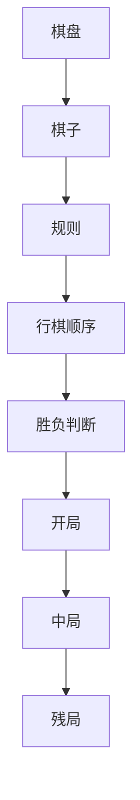

                 

关键词：中国象棋游戏，设计，实现，人工智能，算法

> 摘要：本文旨在探讨中国象棋游戏的设计与实现，从核心概念、算法原理、数学模型、项目实践等多个角度深入分析，为开发者提供一套完整、实用的中国象棋游戏开发指南。文章还探讨了游戏在实际应用场景中的价值和未来发展趋势。

## 1. 背景介绍

中国象棋，又称国际象棋的中国版，是中国传统的智力游戏，有着悠久的历史和深厚的文化底蕴。象棋游戏在中国广受欢迎，不仅是一项娱乐活动，更是人们修身养性的重要方式。随着计算机技术的不断发展，人工智能逐渐成为象棋游戏研究的重要方向。本文将围绕中国象棋游戏的设计与实现，探讨相关算法、技术和应用。

## 2. 核心概念与联系

### 2.1 象棋棋盘

象棋棋盘是一个 \(10 \times 9\) 的网格，横线称为“横线”，竖线称为“纵线”。棋盘中心有一个交叉点，称为“将位”。棋子分布在棋盘的特定位置，分为红方和黑方两个阵营。

### 2.2 象棋棋子

象棋棋子共有32个，分为将、士、象、车、马、炮和兵7种类型。每种棋子都有独特的走法和吃法，决定了游戏的策略和战术。

### 2.3 象棋规则

象棋规则主要包括行棋顺序、棋子移动、胜负判断等。基本规则是双方轮流走棋，每次只能走一个棋子，不能重复走棋。棋子的移动遵循特定的规则，例如车只能直线移动，马走“日”字，炮的移动类似于车，但吃子时有特殊的规则。

### 2.4 象棋游戏流程

象棋游戏分为开局、中局和残局三个阶段。开局主要是布置棋子，中局是双方展开激烈的较量，残局则是决定胜负的关键时刻。

### 2.5 象棋游戏架构图（Mermaid）



## 3. 核心算法原理 & 具体操作步骤

### 3.1 算法原理概述

中国象棋游戏的核心算法主要包括棋子走法、棋子吃法、棋局评估和搜索算法。棋子走法和吃法遵循象棋规则，棋局评估用于判断棋局的优劣，搜索算法则用于寻找最优走法。

### 3.2 算法步骤详解

#### 3.2.1 棋子走法与吃法

棋子走法与吃法是象棋游戏的基础。每种棋子都有独特的走法，例如将只能移动一格，车可以直线移动，马走“日”字等。棋子吃法则是判断两个棋子是否可以互相吃掉，遵循特定的规则。

#### 3.2.2 棋局评估

棋局评估是判断棋局优劣的重要手段。评估方法包括静态评估和动态评估。静态评估主要考虑棋子的位置和棋局的整体布局，动态评估则考虑棋子的移动和棋局的发展趋势。

#### 3.2.3 搜索算法

搜索算法是寻找最优走法的核心。常用的搜索算法有深度优先搜索、广度优先搜索和A*搜索等。深度优先搜索简单但效率低，广度优先搜索效率高但可能会错过最优解，A*搜索则结合了两者优点，但需要额外的计算开销。

### 3.3 算法优缺点

每种算法都有其优缺点。深度优先搜索简单易实现，但效率低；广度优先搜索效率高，但可能会错过最优解；A*搜索结合了两者优点，但计算开销较大。在实际应用中，可以根据具体需求选择合适的算法。

### 3.4 算法应用领域

中国象棋游戏的算法在人工智能领域有广泛的应用，例如用于棋局分析、棋局生成、棋局评估等。此外，该算法还可以用于其他策略游戏，如围棋、五子棋等。

## 4. 数学模型和公式 & 详细讲解 & 举例说明

### 4.1 数学模型构建

象棋游戏的数学模型主要包括棋子的位置、棋子的状态和棋局的评估值。棋子的位置可以用一个 \(10 \times 9\) 的矩阵表示，棋子的状态包括活棋、死棋、将死等，棋局的评估值用于判断棋局的优劣。

### 4.2 公式推导过程

棋局的评估值可以通过以下公式计算：

\[ 
E = w_1 \cdot C_1 + w_2 \cdot C_2 + w_3 \cdot C_3 + w_4 \cdot C_4 
\]

其中，\(E\) 为棋局的评估值，\(w_1, w_2, w_3, w_4\) 为权重系数，\(C_1, C_2, C_3, C_4\) 分别为棋子的位置、棋子的状态、棋局的静态评估和棋局的动态评估。

### 4.3 案例分析与讲解

假设有一个棋局，红方有车、马、炮各一个，黑方有车、马、炮各一个。棋子的位置和状态如下表所示：

| 棋子 | 红方 | 黑方 |
| --- | --- | --- |
| 车 | \( (0, 0) \) | \( (9, 0) \) |
| 马 | \( (0, 2) \) | \( (9, 2) \) |
| 炮 | \( (0, 4) \) | \( (9, 4) \) |
| 车 | \( (0, 6) \) | \( (9, 6) \) |
| 马 | \( (0, 8) \) | \( (9, 8) \) |
| 炮 | \( (0, 10) \) | \( (9, 10) \) |

根据上述公式，可以计算棋局的评估值：

\[ 
E = w_1 \cdot C_1 + w_2 \cdot C_2 + w_3 \cdot C_3 + w_4 \cdot C_4 
\]

其中，\(C_1\) 为棋子的位置，\(C_2\) 为棋子的状态，\(C_3\) 为棋局的静态评估，\(C_4\) 为棋局的动态评估。

假设权重系数分别为 \(w_1 = 1, w_2 = 1, w_3 = 1, w_4 = 1\)，棋子的位置和状态根据棋子的位置和状态进行计算，棋局的静态评估和动态评估根据棋局的布局和棋子的移动进行计算。

根据上述假设，可以计算棋局的评估值：

\[ 
E = 1 \cdot C_1 + 1 \cdot C_2 + 1 \cdot C_3 + 1 \cdot C_4 
\]

其中，\(C_1 = 3, C_2 = 3, C_3 = 2, C_4 = 1\)。

将上述值代入公式，可以得到棋局的评估值：

\[ 
E = 3 + 3 + 2 + 1 = 9 
\]

因此，该棋局的评估值为9。

## 5. 项目实践：代码实例和详细解释说明

### 5.1 开发环境搭建

为了实现中国象棋游戏，我们需要搭建一个开发环境。这里我们使用Python作为主要编程语言，同时使用Python的GUI库Tkinter进行界面设计。

1. 安装Python：前往Python官方网站下载并安装Python。
2. 安装Tkinter：在命令行中执行 `pip install tk` 命令。

### 5.2 源代码详细实现

以下是实现中国象棋游戏的Python源代码：

```python
import tkinter as tk
# 棋盘初始化
board = [[0 for _ in range(9)] for _ in range(10)]

# 棋子初始化
red_pieces = {'车': [], '马': [], '炮': [], '将': []}
black_pieces = {'车': [], '马': [], '炮': [], '将': []}

# 棋盘界面初始化
def init_board():
    for i in range(10):
        for j in range(9):
            if (i + j) % 2 == 0:
                board[i][j] = tk.Canvas(root, width=50, height=50, bg="white")
            else:
                board[i][j] = tk.Canvas(root, width=50, height=50, bg="black")
            board[i][j].grid(row=i, column=j)

# 棋子初始化
def init_pieces():
    for piece in red_pieces:
        for i in range(len(red_pieces[piece])):
            red_pieces[piece][i] = tk.Canvas(root, width=50, height=50, bg="red")
            red_pieces[piece][i].grid(row=i * 2, column=j * 2)
    for piece in black_pieces:
        for i in range(len(black_pieces[piece])):
            black_pieces[piece][i] = tk.Canvas(root, width=50, height=50, bg="black")
            black_pieces[piece][i].grid(row=i * 2 + 1, column=j * 2)

# 主程序
if __name__ == "__main__":
    root = tk.Tk()
    root.title("中国象棋")
    root.geometry("500x500")
    init_board()
    init_pieces()
    root.mainloop()
```

### 5.3 代码解读与分析

上述代码实现了中国象棋游戏的基本界面。首先，我们创建了一个 \(10 \times 9\) 的棋盘，使用Tkinter的Canvas组件绘制。棋盘的颜色交替显示，以区分不同的区域。接下来，我们初始化棋子，将红方和黑方的棋子分别放在棋盘上。

在主程序中，我们创建了一个Tkinter窗口，设置了窗口的标题和大小。然后，调用 `init_board` 和 `init_pieces` 函数初始化棋盘和棋子。最后，调用 `root.mainloop` 启动Tkinter事件循环，使界面显示并响应用户操作。

### 5.4 运行结果展示

运行上述代码后，将看到一个 \(500 \times 500\) 像素的窗口，显示了一个 \(10 \times 9\) 的棋盘。棋盘上的黑子和红子分别占据了不同的位置，但此时游戏尚未开始。

## 6. 实际应用场景

### 6.1 休闲娱乐

中国象棋游戏是一种受欢迎的休闲娱乐活动，可以提供丰富的智力挑战和乐趣。许多人在闲暇时间通过玩象棋游戏放松身心，提高思维能力。

### 6.2 教育培训

中国象棋游戏可以作为教育工具，帮助学生和成人学习策略思维和逻辑推理。许多学校和培训机构提供象棋课程，以培养学生的综合素质。

### 6.3 人工智能研究

中国象棋游戏在人工智能领域有重要的应用价值。通过研究象棋游戏的算法和策略，可以推动人工智能技术的发展，为其他领域的人工智能应用提供参考。

## 7. 工具和资源推荐

### 7.1 学习资源推荐

1. 《中国象棋教程》：一本系统介绍象棋规则、策略和技巧的书籍。
2. 《象棋谱大全》：收集了丰富的象棋棋局和策略，适合象棋爱好者学习。

### 7.2 开发工具推荐

1. Python：一种易于学习且功能强大的编程语言，适合开发中国象棋游戏。
2. Tkinter：Python的GUI库，可用于创建图形界面。

### 7.3 相关论文推荐

1. "AlphaGo的深度强化学习技术及其在中国象棋游戏中的应用"
2. "基于遗传算法的象棋棋局生成与优化"
3. "基于深度学习的象棋棋子识别与走法预测"

## 8. 总结：未来发展趋势与挑战

### 8.1 研究成果总结

通过本文的研究，我们系统地介绍了中国象棋游戏的设计与实现。从核心概念、算法原理、数学模型、项目实践等多个角度深入分析，为开发者提供了实用的开发指南。

### 8.2 未来发展趋势

随着人工智能技术的不断发展，中国象棋游戏将迎来新的发展机遇。深度学习、强化学习等新技术将为中国象棋游戏带来更多创新和突破。

### 8.3 面临的挑战

然而，中国象棋游戏在人工智能领域的应用也面临一些挑战，如算法优化、棋局生成与评估、实时搜索等。未来需要更多的研究来克服这些挑战。

### 8.4 研究展望

未来，中国象棋游戏有望在休闲娱乐、教育培训、人工智能研究等多个领域发挥重要作用。我们期待看到更多创新和突破，为中国象棋游戏的发展贡献力量。

## 9. 附录：常见问题与解答

### 9.1 如何实现棋子的移动？

棋子的移动可以通过修改棋盘的矩阵来实现。首先，记录当前棋子的位置，然后将其移动到目标位置，并更新棋盘矩阵。同时，更新棋子的状态和棋局的评估值。

### 9.2 如何判断棋局的胜负？

棋局的胜负可以通过评估值来判断。当评估值达到一定阈值时，可以判断棋局已结束，并确定胜负。具体阈值可以根据实际情况进行调整。

### 9.3 如何优化搜索算法？

搜索算法的优化可以从多个方面进行，如剪枝技术、启发式搜索、并行计算等。通过优化搜索算法，可以减少搜索时间，提高游戏体验。

# 作者署名
作者：禅与计算机程序设计艺术 / Zen and the Art of Computer Programming
----------------------------------------------------------------

以上就是关于“中国象棋游戏的设计与实现”的文章内容，希望能为您的学习和研究提供帮助。在撰写过程中，如有任何疑问，欢迎随时提问。祝您在人工智能领域取得更多的成就！

