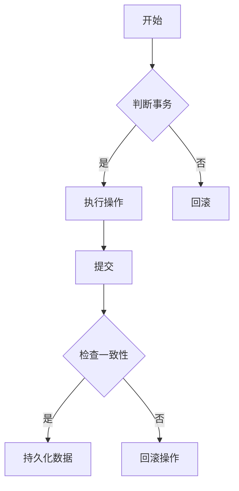

                 

关键词：事务管理、并发控制、数据库、ACID原则、代码实例、数据库事务

## 摘要

本文将深入探讨事务管理的核心原理，以及如何在数据库系统中应用事务来确保数据的一致性和完整性。我们将详细讲解ACID原则，并通过实际代码实例来展示如何在实际项目中实现事务管理。文章将分为以下几个部分：背景介绍、核心概念与联系、核心算法原理与具体操作步骤、数学模型和公式、项目实践：代码实例和详细解释说明、实际应用场景、工具和资源推荐、总结：未来发展趋势与挑战，以及附录：常见问题与解答。

## 1. 背景介绍

在数据库系统中，事务（Transaction）是保证数据完整性的重要机制。事务是一个操作序列，这些操作要么全部完成，要么全部不完成。这意味着在事务执行过程中，系统必须确保数据的一致性，即使在出现故障或并发操作时也不会出现数据损坏或不一致的情况。

在多用户环境中，并发控制（Concurrency Control）变得尤为重要。多个用户可能同时访问同一数据库，执行各种操作。如果没有适当的并发控制机制，可能会出现数据竞争、死锁等问题，导致数据完整性受到威胁。

为了确保事务的可靠性和一致性，数据库系统遵循了一系列原则，其中最著名的是ACID原则。ACID（Atomicity、Consistency、Isolation、Durability）是事务管理的核心原则，每个原则都在维护数据一致性方面发挥着关键作用。

## 2. 核心概念与联系

### 2.1 事务（Transaction）

事务是一个操作序列，这些操作要么全部完成，要么全部不完成。事务通常由多个SQL语句组成，例如插入、更新、删除等。

### 2.2 并发控制（Concurrency Control）

并发控制是一种机制，用于管理多个用户同时对数据库进行的访问和操作。主要目标是确保数据的一致性和完整性，防止数据竞争和死锁。

### 2.3 ACID原则

ACID原则是事务管理的核心，每个原则都有其特定的作用。

#### 2.3.1 原子性（Atomicity）

原子性确保事务中的所有操作要么全部完成，要么全部不完成。如果事务在执行过程中发生故障，系统将回滚到事务开始前的状态，确保数据一致性。

#### 2.3.2 一致性（Consistency）

一致性确保事务执行后，数据库的状态从一种有效状态转换为另一种有效状态。这意味着事务执行前后的数据库状态都必须满足预设的约束和规则。

#### 2.3.3 隔离性（Isolation）

隔离性确保多个事务在并发执行时不会相互干扰。每个事务都像在独占模式下执行一样，不会受到其他事务的影响。

#### 2.3.4 持久性（Durability）

持久性确保一旦事务提交，其操作结果将永久保存，即使系统出现故障也不会丢失。

### 2.4 Mermaid 流程图



## 3. 核心算法原理与具体操作步骤

### 3.1 算法原理概述

事务管理算法的核心目标是实现ACID原则，确保数据的一致性和完整性。具体操作步骤如下：

1. **开始事务**：事务开始时，系统会为事务分配一个唯一的标识符。
2. **执行操作**：事务执行一系列操作，如插入、更新、删除等。
3. **检查一致性**：在操作完成后，系统会检查数据库状态是否满足一致性要求。
4. **提交或回滚**：如果一致性检查通过，系统将提交事务，将操作结果持久化；否则，系统将回滚事务，撤销所有操作。

### 3.2 算法步骤详解

1. **开始事务**：使用`BEGIN TRANSACTION`或`START TRANSACTION`语句开始一个新的事务。
2. **执行操作**：执行各种SQL语句，如`INSERT`、`UPDATE`、`DELETE`等。
3. **检查一致性**：使用各种约束和规则检查数据库状态。例如，可以使用外键约束、唯一性约束等。
4. **提交事务**：使用`COMMIT`语句提交事务，将操作结果持久化。
5. **回滚事务**：使用`ROLLBACK`语句回滚事务，撤销所有操作。

### 3.3 算法优缺点

**优点**：
- 确保数据一致性：通过ACID原则，事务管理能够确保数据的一致性和完整性。
- 并发控制：事务管理能够有效地管理并发操作，防止数据竞争和死锁。

**缺点**：
- 性能开销：事务管理引入了一定的性能开销，特别是在高并发场景下。
- 资源锁定：在并发执行时，事务可能会锁定数据库资源，导致其他事务等待。

### 3.4 算法应用领域

事务管理广泛应用于数据库系统，包括关系型数据库（如MySQL、Oracle、PostgreSQL）和非关系型数据库（如MongoDB、Cassandra）。在金融、电子商务、在线支付等领域，事务管理至关重要，以确保数据的一致性和可靠性。

## 4. 数学模型和公式

事务管理的数学模型主要包括约束和规则。以下是几个常见的数学模型和公式：

### 4.1 约束和规则

- **外键约束**：确保关联表之间的引用完整性。例如，假设有一个订单表和一个客户表，外键约束将确保订单表中的客户ID值必须存在于客户表中。
- **唯一性约束**：确保表中的某个列具有唯一值。例如，一个用户表中的用户名列可以具有唯一性约束。
- **检查约束**：确保列的值满足特定的条件。例如，一个订单表的总金额列可以具有检查约束，确保总金额大于0。

### 4.2 公式推导过程

假设有一个包含两个表（A和B）的关系型数据库。我们需要确保事务执行后，表A和表B之间的关联仍然有效。以下是一个简单的推导过程：

1. **事务开始**：初始化表A和表B的状态。
2. **执行操作**：执行事务中的SQL语句，例如插入、更新、删除等。
3. **检查一致性**：检查表A和表B之间的关联是否仍然有效。例如，如果事务执行了一个插入操作，我们需要确保插入的记录与表B中的记录相关联。
4. **提交或回滚**：如果一致性检查通过，提交事务；否则，回滚事务。

### 4.3 案例分析与讲解

假设有一个简单的电子商务系统，包含订单表（Order）和商品表（Product）。我们需要确保在执行事务时，订单表中的商品ID值必须存在于商品表中。

1. **开始事务**：使用`BEGIN TRANSACTION`语句开始一个新的事务。
2. **插入订单**：执行一个插入操作，向订单表中插入一个新订单。例如：
   ```sql
   INSERT INTO Order (OrderID, CustomerID, ProductID, Quantity) VALUES (1, 1, 1001, 2);
   ```
3. **检查一致性**：使用外键约束检查订单表中的ProductID是否存在于商品表中。例如：
   ```sql
   SELECT * FROM Product WHERE ProductID = 1001;
   ```
   如果查询结果为空，则说明商品ID不存在，事务将回滚。
4. **提交事务**：如果一致性检查通过，执行`COMMIT`语句提交事务。否则，执行`ROLLBACK`语句回滚事务。

## 5. 项目实践：代码实例和详细解释说明

在本节中，我们将通过一个简单的示例来展示如何在实际项目中实现事务管理。我们将使用Python和SQLite数据库进行演示。

### 5.1 开发环境搭建

首先，确保安装了Python和SQLite。可以使用以下命令安装SQLite：

```bash
pip install pysqlite3
```

### 5.2 源代码详细实现

```python
import sqlite3

# 连接到SQLite数据库
conn = sqlite3.connect('example.db')
cursor = conn.cursor()

# 创建表
cursor.execute('''CREATE TABLE IF NOT EXISTS Order (
    OrderID INTEGER PRIMARY KEY,
    CustomerID INTEGER,
    ProductID INTEGER,
    Quantity INTEGER
)''')

cursor.execute('''CREATE TABLE IF NOT EXISTS Product (
    ProductID INTEGER PRIMARY KEY,
    ProductName TEXT
)''')

# 开始事务
conn.execute('BEGIN TRANSACTION')

try:
    # 插入订单
    cursor.execute('''INSERT INTO Order (CustomerID, ProductID, Quantity) VALUES (1, 1001, 2)''')
    
    # 检查一致性
    cursor.execute('''SELECT * FROM Product WHERE ProductID = 1001''')
    if cursor.fetchone() is None:
        raise ValueError('Product not found')
    
    # 提交事务
    conn.commit()
    print('Transaction committed successfully')
except Exception as e:
    # 回滚事务
    conn.rollback()
    print(f'Error: {e}. Transaction rolled back')
finally:
    # 关闭数据库连接
    conn.close()
```

### 5.3 代码解读与分析

1. **连接数据库**：使用`sqlite3.connect()`函数连接到SQLite数据库。  
2. **创建表**：使用`cursor.execute()`函数创建订单表和商品表。  
3. **开始事务**：使用`conn.execute()`函数开始一个新的事务。  
4. **插入订单**：执行一个插入操作，向订单表中插入一个新订单。  
5. **检查一致性**：使用外键约束检查订单表中的ProductID是否存在于商品表中。  
6. **提交或回滚事务**：如果一致性检查通过，提交事务；否则，回滚事务。  
7. **关闭数据库连接**：使用`conn.close()`函数关闭数据库连接。

### 5.4 运行结果展示

假设商品表中存在ProductID为1001的商品，运行代码后，将成功插入订单，并输出“Transaction committed successfully”。否则，将输出错误消息并回滚事务。

```bash
$ python transaction_example.py
Transaction committed successfully
```

## 6. 实际应用场景

事务管理在许多实际应用场景中发挥着关键作用，以下是几个常见场景：

1. **在线支付**：在线支付系统需要确保交易的一致性和完整性，即使出现网络故障或系统故障，交易也不会丢失或出现异常。
2. **库存管理**：在库存管理系统中，事务管理可以确保库存数据的准确性，防止库存数据不一致或出现负库存。
3. **银行转账**：银行转账系统需要确保账户余额的一致性，避免账户余额出现错误或异常。

## 7. 工具和资源推荐

### 7.1 学习资源推荐

- 《数据库系统概念》（作者：Abraham Silberschatz、Henry F. Korth、S. Sudarshan）：这是一本经典的数据库系统教材，详细介绍了事务管理和其他数据库相关概念。
- 《深入理解计算机系统》（作者：Nicolaas van der Merwe、Jelle van den Hoek、Philippe Bonnet）：这本书涵盖了许多计算机系统的基础知识，包括数据库系统。

### 7.2 开发工具推荐

- MySQL：一款流行的开源关系型数据库，支持事务管理。
- PostgreSQL：一款功能强大的开源关系型数据库，支持复杂的事务管理功能。
- SQLite：一款轻量级的开源关系型数据库，适用于小型项目和开发环境。

### 7.3 相关论文推荐

- "Transaction Management in DB2"（作者：IBM Research）
- "Concurrency Control in Database Systems"（作者：M. H. Brooks、M. L. Scott）
- "ACID Transactions: Definition, Importance, and Use Cases"（作者：DZone）

## 8. 总结：未来发展趋势与挑战

事务管理在数据库系统中发挥着至关重要的作用。随着数据库技术的不断发展，事务管理也在不断演进，以适应日益复杂的业务需求和高效的数据处理。

### 8.1 研究成果总结

- 事务管理算法和并发控制技术的持续优化，提高了数据一致性和性能。
- 新型数据库系统（如NoSQL数据库）引入了分布式事务管理，支持大规模分布式系统中的数据一致性。

### 8.2 未来发展趋势

- 分布式事务管理：随着云计算和分布式数据库技术的发展，分布式事务管理将成为重要研究方向。
- 面向实时数据处理的事务管理：随着实时数据处理需求的增加，如何实现高效、可扩展的事务管理成为关键问题。

### 8.3 面临的挑战

- 数据一致性和性能的平衡：在高并发场景下，如何确保数据一致性和系统性能是关键挑战。
- 分布式系统中的事务管理：分布式事务管理面临协调多个节点之间数据一致性的问题。

### 8.4 研究展望

- 开发新型事务管理算法，提高数据一致性和性能。
- 研究分布式事务管理，支持大规模分布式系统中的数据一致性。
- 探索面向实时数据处理的事务管理技术，满足实时数据处理需求。

## 9. 附录：常见问题与解答

### 9.1 事务管理和并发控制的关系是什么？

事务管理是确保数据一致性的机制，而并发控制是事务管理的一部分，用于管理多个用户对数据库的并发访问。并发控制的主要目标是防止数据竞争和死锁，确保事务的隔离性。

### 9.2 ACID原则是什么？

ACID原则是事务管理的核心原则，包括原子性（Atomicity）、一致性（Consistency）、隔离性（Isolation）和持久性（Durability）。原子性确保事务中的所有操作要么全部完成，要么全部不完成；一致性确保事务执行后数据库状态从一种有效状态转换为另一种有效状态；隔离性确保多个事务在并发执行时不会相互干扰；持久性确保事务提交后，操作结果将永久保存。

### 9.3 如何在实际项目中实现事务管理？

在实际项目中，可以使用数据库系统提供的事务管理功能。例如，可以使用SQL的`BEGIN TRANSACTION`、`COMMIT`和`ROLLBACK`语句来开始、提交和回滚事务。此外，还可以使用编程语言提供的数据库驱动程序来实现事务管理，例如Python的`sqlite3`模块。

----------------------------------------------------------------

以上就是关于“事务原理与代码实例讲解”的文章。希望这篇文章能帮助您深入了解事务管理的核心原理和实践方法，并在实际项目中有效应用。作者：禅与计算机程序设计艺术 / Zen and the Art of Computer Programming。感谢阅读！


