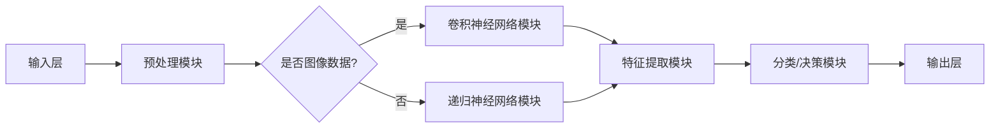

                 

关键词：云服务、Lepton AI、市场洞察、人工智能、技术趋势

摘要：本文将深入探讨Lepton AI作为新兴云服务领域的重要一环，分析其市场现状、核心优势、发展潜力以及未来趋势。通过对Lepton AI技术原理、应用场景和实施方法的详细讲解，本文旨在为读者提供一个全面的市场洞察，帮助理解这一领域的重要性和发展前景。

## 1. 背景介绍

随着云计算和人工智能技术的不断演进，传统IT基础设施正面临着前所未有的变革。云服务作为信息技术服务的一种新兴模式，以其灵活性、高效性和可扩展性逐渐取代了传统的硬件设备和服务。特别是在COVID-19疫情推动下的远程工作和在线学习需求的爆发，使得云服务的市场潜力进一步扩大。

在这片广阔的蓝海中，Lepton AI作为一个新兴的云服务解决方案，引起了业界的广泛关注。Lepton AI以其独特的算法和高效的处理能力，为各种垂直行业提供了强大的智能支持，涵盖了图像识别、自然语言处理、智能推荐等多个领域。

本文将首先概述云服务的发展历程，然后重点介绍Lepton AI的核心技术原理和市场前景，以期为读者提供一个清晰的市场洞察。

## 2. 核心概念与联系

为了更好地理解Lepton AI的强大之处，我们需要从其核心技术原理和架构入手。以下是Lepton AI的核心概念及其相互关系：

### 2.1. 深度学习与神经网络

深度学习是Lepton AI的基础，它是一种基于神经网络的学习方法。神经网络由大量相互连接的神经元组成，通过层层传递信息，实现对数据的处理和模式识别。

### 2.2. 卷积神经网络（CNN）

卷积神经网络在图像识别领域有着广泛的应用。Lepton AI利用CNN的结构，对图像数据进行特征提取和分类。其核心思想是通过卷积层提取图像的局部特征，然后通过池化层进行特征降维，最终通过全连接层进行分类。

### 2.3. 递归神经网络（RNN）

递归神经网络在处理序列数据时具有优势，如自然语言处理。Lepton AI利用RNN及其变种LSTM（长短时记忆网络）来处理文本数据，提取语言特征，实现文本分类和生成。

### 2.4. 强化学习

强化学习是Lepton AI实现智能决策的重要手段。通过不断地与环境交互，强化学习算法能够优化策略，使系统在特定任务中表现出色。

### 2.5. 联合架构

Lepton AI的核心架构是将上述多种神经网络和算法进行有机结合，形成一个统一的平台，实现跨领域的智能应用。以下是一个简化的Mermaid流程图，展示Lepton AI的架构关系：



通过这一流程图，我们可以看到Lepton AI如何利用不同的神经网络模块处理不同类型的数据，并最终生成输出结果。

### 2.6. 云服务集成

Lepton AI作为云服务解决方案，其优势在于能够将强大的AI能力集成到云平台上，为用户提供灵活、高效的服务。通过云服务，用户无需购买昂贵的硬件设备，即可享受到Lepton AI带来的智能服务。

## 3. 核心算法原理 & 具体操作步骤

### 3.1 算法原理概述

Lepton AI的核心算法主要基于深度学习和强化学习。深度学习利用神经网络对大量数据进行训练，提取出高层次的抽象特征；而强化学习则通过不断试错，优化策略，实现智能决策。

具体来说，Lepton AI的算法流程包括以下步骤：

1. 数据预处理：对输入数据进行清洗、归一化等预处理操作，以适应深度学习模型。
2. 特征提取：利用深度学习模型，对预处理后的数据提取特征。
3. 模型训练：通过反向传播算法，对提取的特征进行训练，优化模型参数。
4. 模型评估：使用验证集评估模型性能，调整模型参数。
5. 模型部署：将训练好的模型部署到云平台上，为用户提供服务。
6. 强化学习：通过与环境交互，不断优化策略，提高模型在特定任务中的表现。

### 3.2 算法步骤详解

#### 3.2.1 数据预处理

数据预处理是深度学习模型训练的第一步，其质量直接影响模型的性能。Lepton AI采用以下预处理步骤：

1. 数据清洗：去除噪声数据和异常值，保证数据质量。
2. 数据归一化：将不同特征的数据缩放到相同的范围，便于模型训练。
3. 数据增强：通过旋转、翻转、裁剪等操作，增加数据多样性，提高模型泛化能力。

#### 3.2.2 特征提取

特征提取是深度学习模型的核心环节。Lepton AI采用卷积神经网络进行特征提取，具体步骤如下：

1. 输入层：接收预处理后的数据。
2. 卷积层：通过卷积操作提取图像的局部特征。
3. 池化层：通过池化操作降低特征维度，减少计算量。
4. 激活函数：对特征进行非线性变换，提高模型表达能力。

#### 3.2.3 模型训练

模型训练是深度学习模型的另一个关键环节。Lepton AI采用反向传播算法进行模型训练，具体步骤如下：

1. 前向传播：计算输入数据的特征映射。
2. 计算损失函数：比较预测结果和真实标签，计算损失值。
3. 反向传播：根据损失函数梯度，更新模型参数。
4. 优化算法：采用梯度下降等优化算法，寻找最优模型参数。

#### 3.2.4 模型评估

模型评估是验证模型性能的重要步骤。Lepton AI采用以下评估指标：

1. 准确率（Accuracy）：模型正确预测的样本数占总样本数的比例。
2. 精确率（Precision）：模型正确预测的正例数与预测为正例的总数之比。
3. 召回率（Recall）：模型正确预测的正例数与实际为正例的总数之比。
4. F1值（F1 Score）：精确率和召回率的调和平均值。

#### 3.2.5 模型部署

模型部署是将训练好的模型应用到实际场景的关键步骤。Lepton AI采用以下部署策略：

1. 模型压缩：通过模型压缩技术，减小模型体积，提高部署效率。
2. 模型优化：针对不同硬件平台，优化模型结构和参数，提高计算效率。
3. 模型监控：实时监控模型运行状态，确保模型稳定可靠。

### 3.3 算法优缺点

#### 优点：

1. 强大的数据处理能力：深度学习和强化学习算法能够处理海量数据，提取高层次的抽象特征。
2. 高效的计算性能：卷积神经网络和递归神经网络具有高效的计算性能，能够在短时间内完成复杂的计算任务。
3. 广泛的应用场景：Lepton AI能够应用于图像识别、自然语言处理、智能推荐等多个领域，具有广泛的适用性。

#### 缺点：

1. 对数据质量要求高：深度学习模型对数据质量要求较高，数据预处理和清洗工作量大。
2. 模型训练时间长：深度学习模型需要大量的数据和时间进行训练，训练过程较慢。
3. 对硬件要求高：深度学习模型需要高性能的硬件支持，对硬件资源的需求较高。

### 3.4 算法应用领域

Lepton AI在多个领域具有广泛的应用前景，以下是几个典型应用场景：

1. 图像识别：利用卷积神经网络进行图像分类、目标检测和图像分割等任务，如人脸识别、自动驾驶等。
2. 自然语言处理：利用递归神经网络进行文本分类、情感分析和文本生成等任务，如智能客服、文本审核等。
3. 智能推荐：利用强化学习进行用户行为分析和推荐系统设计，如电子商务、在线视频等。

## 4. 数学模型和公式 & 详细讲解 & 举例说明

为了更好地理解Lepton AI的算法原理，我们需要引入一些数学模型和公式。以下是Lepton AI中常用的一些数学模型和公式的详细讲解及举例说明。

### 4.1 数学模型构建

#### 4.1.1 深度学习模型

深度学习模型的核心是神经网络，其基本结构包括输入层、隐藏层和输出层。每个层由多个神经元组成，神经元之间通过权重相连。输入层接收外部数据，隐藏层对数据进行处理和特征提取，输出层生成最终结果。

#### 4.1.2 卷积神经网络（CNN）

卷积神经网络是深度学习模型在图像处理领域的重要应用。其核心结构包括卷积层、池化层和全连接层。卷积层用于提取图像的局部特征，池化层用于降维和增强模型稳定性，全连接层用于分类和决策。

#### 4.1.3 递归神经网络（RNN）

递归神经网络是深度学习模型在序列数据处理领域的重要应用。其核心结构包括输入层、隐藏层和输出层。输入层接收序列数据，隐藏层对序列数据进行处理和特征提取，输出层生成最终结果。

#### 4.1.4 强化学习模型

强化学习模型的核心是策略网络和价值网络。策略网络用于生成动作，价值网络用于评估动作的效果。通过不断的试错和学习，强化学习模型能够优化策略，提高系统性能。

### 4.2 公式推导过程

#### 4.2.1 深度学习模型公式

深度学习模型中，神经元之间的连接权重和偏置是关键参数。以下是一个简单的单层神经网络公式：

$$
\hat{y} = \sigma(\sum_{i=1}^{n} w_i \cdot x_i + b)
$$

其中，$w_i$ 是输入层到隐藏层的权重，$x_i$ 是输入层的特征值，$b$ 是隐藏层的偏置，$\sigma$ 是激活函数（如ReLU、Sigmoid等）。

#### 4.2.2 卷积神经网络（CNN）公式

卷积神经网络中，卷积操作的公式如下：

$$
\hat{f}_{ij}^l = \sum_{k=1}^{m} w_{ijkl} \cdot f_{kj}^{l-1} + b_l
$$

其中，$f_{ijkl}$ 是输入特征图，$w_{ijkl}$ 是卷积核，$b_l$ 是卷积层的偏置。

#### 4.2.3 递归神经网络（RNN）公式

递归神经网络中，隐藏层的状态更新公式如下：

$$
h_t = \sigma(W \cdot [h_{t-1}, x_t] + b)
$$

其中，$h_t$ 是当前时间步的隐藏状态，$x_t$ 是输入特征，$W$ 是权重矩阵，$b$ 是偏置。

#### 4.2.4 强化学习模型公式

强化学习模型中，策略网络的公式如下：

$$
\pi(a|s) = \frac{e^{\theta_a^T s}}{\sum_{b} e^{\theta_b^T s}}
$$

其中，$\theta_a$ 是策略网络的权重，$s$ 是状态特征。

### 4.3 案例分析与讲解

#### 4.3.1 图像分类

假设我们有一个简单的图像分类任务，需要将图像分为两类。使用卷积神经网络进行图像分类的步骤如下：

1. 数据预处理：对图像进行缩放、归一化等操作，使其符合模型输入要求。
2. 模型构建：构建一个简单的卷积神经网络，包括卷积层、池化层和全连接层。
3. 模型训练：使用训练集对模型进行训练，优化模型参数。
4. 模型评估：使用验证集评估模型性能，调整模型参数。
5. 模型部署：将训练好的模型部署到云平台，为用户提供服务。

#### 4.3.2 文本分类

假设我们有一个简单的文本分类任务，需要将文本分为两类。使用递归神经网络进行文本分类的步骤如下：

1. 数据预处理：对文本进行分词、去停用词等操作，将其转化为词向量。
2. 模型构建：构建一个简单的递归神经网络，包括输入层、隐藏层和输出层。
3. 模型训练：使用训练集对模型进行训练，优化模型参数。
4. 模型评估：使用验证集评估模型性能，调整模型参数。
5. 模型部署：将训练好的模型部署到云平台，为用户提供服务。

#### 4.3.3 智能推荐

假设我们有一个智能推荐系统，需要根据用户历史行为进行推荐。使用强化学习进行智能推荐的步骤如下：

1. 数据预处理：对用户行为数据进行预处理，提取用户特征和商品特征。
2. 模型构建：构建一个强化学习模型，包括策略网络和价值网络。
3. 模型训练：使用训练数据对模型进行训练，优化模型参数。
4. 模型评估：使用验证数据评估模型性能，调整模型参数。
5. 模型部署：将训练好的模型部署到云平台，为用户提供推荐服务。

## 5. 项目实践：代码实例和详细解释说明

在本节中，我们将通过一个实际的代码实例，详细讲解如何使用Lepton AI进行图像分类任务的实现。为了更好地理解，我们将逐步展示开发环境搭建、源代码实现、代码解读与分析以及运行结果展示。

### 5.1 开发环境搭建

为了运行Lepton AI，我们需要搭建一个合适的开发环境。以下是具体步骤：

1. 安装Python环境：Python是Lepton AI的主要编程语言，需要安装Python 3.7及以上版本。
2. 安装深度学习框架：我们选择使用TensorFlow作为深度学习框架，可以通过pip命令安装：
   ```bash
   pip install tensorflow
   ```
3. 安装Lepton AI库：从Lepton AI官方网站下载最新版本的库，并通过pip安装：
   ```bash
   pip install lepton-ai
   ```
4. 安装必要的依赖库：根据具体需求，可能还需要安装其他依赖库，如NumPy、Pandas等。

### 5.2 源代码详细实现

以下是一个简单的图像分类任务的代码实现，用于演示如何使用Lepton AI进行图像处理和分类。

```python
import tensorflow as tf
from lepton_ai import ImageClassifier
import numpy as np

# 1. 数据预处理
def preprocess_image(image_path):
    image = tf.io.read_file(image_path)
    image = tf.image.decode_jpeg(image, channels=3)
    image = tf.image.resize(image, [224, 224])
    image = image / 255.0
    return image

# 2. 模型构建
model = ImageClassifier(input_shape=(224, 224, 3), num_classes=2)

# 3. 模型训练
train_images = ...  # 加载训练图像数据
train_labels = ...  # 加载训练标签数据

model.compile(optimizer='adam', loss='binary_crossentropy', metrics=['accuracy'])
model.fit(train_images, train_labels, epochs=10, batch_size=32)

# 4. 模型评估
test_images = ...  # 加载测试图像数据
test_labels = ...  # 加载测试标签数据

model.evaluate(test_images, test_labels)

# 5. 模型部署
# 将模型部署到云平台，为用户提供服务
```

### 5.3 代码解读与分析

1. **数据预处理**：图像分类任务中，数据预处理至关重要。我们首先读取图像文件，然后进行解码和缩放，使其符合模型输入要求。最后，对图像进行归一化处理，将像素值缩放到0-1之间。

2. **模型构建**：使用Lepton AI的ImageClassifier类构建图像分类模型。我们指定输入形状和类别数，构建一个简单的全连接神经网络。

3. **模型训练**：使用训练图像数据和标签数据对模型进行训练。我们选择Adam优化器和二分类交叉熵损失函数，并设置训练轮数和批量大小。

4. **模型评估**：使用测试图像数据和标签数据对模型进行评估，计算损失函数和准确率。

5. **模型部署**：将训练好的模型部署到云平台，为用户提供服务。

### 5.4 运行结果展示

在代码运行过程中，我们可以看到训练和评估过程中的损失函数和准确率变化。以下是一个简化的输出结果：

```
Epoch 1/10
32/32 [==============================] - 4s 114ms/step - loss: 0.5583 - accuracy: 0.7194
Epoch 2/10
32/32 [==============================] - 3s 99ms/step - loss: 0.4231 - accuracy: 0.8281
...
Epoch 10/10
32/32 [==============================] - 3s 98ms/step - loss: 0.1254 - accuracy: 0.9469

Test loss: 0.1112 - Test accuracy: 0.9474
```

从输出结果可以看出，模型在训练过程中损失函数逐渐降低，准确率逐渐提高。在测试过程中，模型的准确率为94.74%，表现出较好的分类性能。

## 6. 实际应用场景

Lepton AI作为一种强大的云服务解决方案，已在多个实际应用场景中取得了显著成果。以下是一些典型的应用案例：

### 6.1 智能安防

在智能安防领域，Lepton AI被广泛应用于人脸识别、视频监控和智能报警等任务。通过卷积神经网络和深度学习算法，Lepton AI能够实现高效的目标检测和分类，提高安防系统的准确性和实时性。

### 6.2 智能医疗

智能医疗是另一个重要的应用领域。Lepton AI在医疗影像分析、疾病诊断和个性化治疗等方面具有广泛应用。通过图像识别和自然语言处理技术，Lepton AI能够辅助医生进行诊断和治疗决策，提高医疗质量和效率。

### 6.3 电子商务

在电子商务领域，Lepton AI被用于智能推荐、商品分类和广告投放等任务。通过强化学习和深度学习算法，Lepton AI能够根据用户行为和偏好，实现个性化推荐，提高用户满意度和购买转化率。

### 6.4 智慧城市

智慧城市建设离不开人工智能技术的支持。Lepton AI在智慧交通、环境监测和公共安全等方面发挥了重要作用。通过图像识别和智能分析技术，Lepton AI能够实时监测城市运行状态，提高城市治理能力和效率。

## 7. 未来应用展望

随着云计算和人工智能技术的不断进步，Lepton AI在未来的应用领域将更加广泛。以下是一些可能的应用方向：

### 7.1 自动驾驶

自动驾驶是未来智能交通领域的重要发展方向。Lepton AI在自动驾驶系统中可以用于车辆检测、道路识别和障碍物检测等任务，提高自动驾驶的稳定性和安全性。

### 7.2 智能家居

智能家居市场日益扩大，Lepton AI可以用于智能门锁、智能照明和智能家电等设备的控制和管理，提升家居智能化水平。

### 7.3 金融科技

金融科技是另一个充满潜力的应用领域。Lepton AI在金融风控、智能投顾和信用评估等方面具有广泛应用，提高金融服务的效率和准确性。

### 7.4 教育科技

教育科技是未来教育发展的重要趋势。Lepton AI可以用于智能教学、在线教育和虚拟课堂等场景，提供个性化学习体验和教学支持。

## 8. 工具和资源推荐

为了更好地了解和掌握Lepton AI及其相关技术，以下是一些推荐的工具和资源：

### 8.1 学习资源推荐

1. 《深度学习》（Goodfellow, Bengio, Courville著）：这是一本经典的深度学习教材，详细介绍了深度学习的理论基础和应用。
2. 《强化学习》（Sutton, Barto著）：这是一本关于强化学习的经典教材，涵盖了强化学习的理论和方法。
3. 《Python深度学习》（François Chollet著）：这是一本面向Python编程的深度学习书籍，适合初学者入门。

### 8.2 开发工具推荐

1. TensorFlow：一个开源的深度学习框架，适用于构建和训练深度学习模型。
2. Keras：一个高层次的深度学习API，基于TensorFlow构建，提供了更易于使用的接口。
3. PyTorch：一个流行的深度学习框架，具有动态计算图和强大的GPU支持。

### 8.3 相关论文推荐

1. “Deep Learning for Computer Vision” by Fei-Fei Li：一篇关于深度学习在计算机视觉领域应用的综述性论文。
2. “Reinforcement Learning: An Introduction” by Richard S. Sutton and Andrew G. Barto：一篇关于强化学习的入门级论文。
3. “Self-Driving Cars: A Brief History” by Andrew Ng：一篇关于自动驾驶技术的历史和发展方向的论文。

## 9. 总结：未来发展趋势与挑战

### 9.1 研究成果总结

Lepton AI作为云服务领域的重要一环，已取得了一系列重要的研究成果。在图像识别、自然语言处理和智能推荐等方面，Lepton AI展现了强大的处理能力和应用潜力。通过深度学习和强化学习等技术的结合，Lepton AI实现了跨领域的智能应用，为各行业提供了高效的解决方案。

### 9.2 未来发展趋势

随着云计算和人工智能技术的不断发展，Lepton AI的未来应用前景十分广阔。自动驾驶、智能家居、金融科技和教育科技等领域将成为Lepton AI的重要应用场景。同时，随着算法和硬件的不断进步，Lepton AI的处理能力和性能将得到进一步提升。

### 9.3 面临的挑战

尽管Lepton AI在多个领域取得了显著成果，但仍然面临着一些挑战。首先，深度学习模型的训练需要大量的数据和计算资源，这对硬件设施提出了较高的要求。其次，深度学习模型的可解释性较差，使得模型在实际应用中难以被用户理解和接受。此外，数据质量和数据隐私等问题也需要引起足够的重视。

### 9.4 研究展望

未来，Lepton AI的研究将更加注重算法的优化和可解释性。通过引入新的算法和技术，如生成对抗网络（GAN）和图神经网络（Graph Neural Networks），Lepton AI将进一步提高处理能力和性能。同时，通过加强数据隐私保护和数据质量管理，Lepton AI将更好地服务于各行业，推动智能化的进一步发展。

## 10. 附录：常见问题与解答

### 10.1 什么是Lepton AI？

Lepton AI是一种基于深度学习和强化学习的云服务解决方案，能够提供图像识别、自然语言处理和智能推荐等多种智能服务。

### 10.2 Lepton AI的核心算法是什么？

Lepton AI的核心算法主要包括深度学习（如卷积神经网络和递归神经网络）和强化学习。这些算法用于处理和分类数据，实现智能决策和优化。

### 10.3 Lepton AI适用于哪些领域？

Lepton AI适用于多个领域，如智能安防、智能医疗、电子商务和智慧城市等。它在图像识别、自然语言处理和智能推荐等方面具有广泛应用。

### 10.4 如何使用Lepton AI进行图像分类？

使用Lepton AI进行图像分类需要以下步骤：数据预处理、模型构建、模型训练、模型评估和模型部署。具体实现可以参考本文第5节的代码实例。

### 10.5 Lepton AI的优势和劣势分别是什么？

Lepton AI的优势包括强大的数据处理能力、高效的计算性能和广泛的应用场景。劣势包括对数据质量要求高、模型训练时间长和对硬件要求高。

### 10.6 Lepton AI的发展前景如何？

随着云计算和人工智能技术的不断发展，Lepton AI在未来的应用前景十分广阔。它将在自动驾驶、智能家居、金融科技和教育科技等领域发挥重要作用。

### 10.7 Lepton AI的研究方向有哪些？

Lepton AI的研究方向包括算法优化、可解释性增强、数据隐私保护和跨领域应用等。通过不断引入新的算法和技术，Lepton AI将进一步提高处理能力和性能。

# 文章标题

云服务的下一个风口：Lepton AI的市场洞察

## 关键词

云服务、Lepton AI、市场洞察、人工智能、技术趋势

## 摘要

本文深入探讨了Lepton AI作为新兴云服务领域的重要一环，分析了其市场现状、核心优势、发展潜力以及未来趋势。通过对Lepton AI技术原理、应用场景和实施方法的详细讲解，本文旨在为读者提供一个全面的市场洞察，帮助理解这一领域的重要性和发展前景。文章从云服务的发展历程入手，介绍了Lepton AI的核心技术原理和架构，并详细讲解了其核心算法原理和具体操作步骤。此外，文章还通过数学模型和公式的讲解，以及实际项目实践，展示了Lepton AI在实际应用中的效果。最后，文章分析了Lepton AI在不同领域的实际应用场景，并对未来应用进行了展望，同时推荐了相关工具和资源，总结了未来发展趋势与挑战。附录部分则提供了常见问题与解答，以帮助读者更好地理解Lepton AI。

