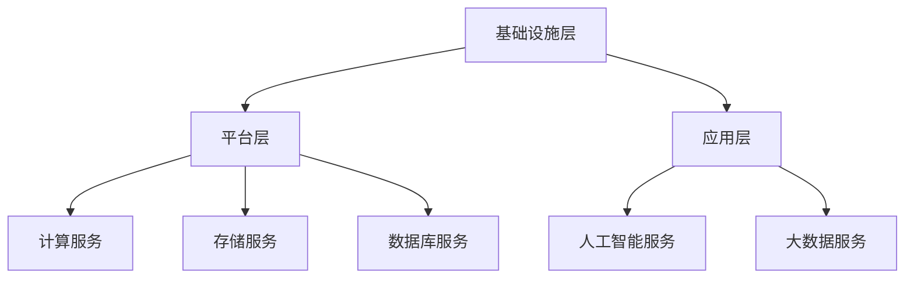

                 

关键词：云计算，AWS，Azure，GCP，对比分析，架构设计，云服务，技术趋势

<|assistant|>摘要：本文将深入探讨云计算领域中的三大主要平台：亚马逊AWS、微软Azure和谷歌GCP。通过对其架构设计、功能特性、性能指标、安全性、成本和用户体验等方面的详细对比分析，旨在帮助读者更好地理解这些平台的优势和劣势，为实际项目选择提供有价值的参考。

## 1. 背景介绍

云计算已经成为了现代IT领域的重要趋势，为企业提供了强大的基础设施、平台和软件服务。随着云计算技术的不断发展，各大云服务提供商不断推出新的服务和功能，以满足用户的多样化需求。在众多云服务提供商中，亚马逊AWS、微软Azure和谷歌GCP被认为是全球最具影响力的三大平台。

### 1.1 亚马逊AWS

亚马逊AWS（Amazon Web Services）成立于2006年，是全球最早的云计算服务提供商之一。AWS提供了丰富的云服务和解决方案，包括计算、存储、数据库、网络、人工智能等。AWS在全球范围内拥有广泛的用户群，包括众多知名企业如Netflix、Adobe和苹果等。

### 1.2 微软Azure

微软Azure成立于2008年，作为微软公司旗下的云服务品牌，Azure致力于提供企业级云计算解决方案。Azure提供了广泛的云服务，包括计算、存储、数据库、网络、人工智能、物联网等。Azure在全球范围内拥有大量的用户，包括宝洁、强生和英国国家健康服务系统等。

### 1.3 谷歌GCP

谷歌GCP（Google Cloud Platform）成立于2008年，作为谷歌公司的云服务品牌，GCP为用户提供强大的云计算解决方案。GCP提供了包括计算、存储、数据库、网络、人工智能、大数据分析等在内的多种云服务。GCP在全球范围内拥有广泛的用户群，包括思科、英特尔和BlackBerry等。

## 2. 核心概念与联系

### 2.1 云计算基本概念

云计算是指通过网络提供可伸缩的计算资源，包括计算能力、存储、网络和其他服务。云计算的基本概念包括以下几种：

- **基础设施即服务（IaaS）**：提供虚拟化的计算资源，如虚拟机、存储和网络。
- **平台即服务（PaaS）**：提供开发、部署和管理应用程序的平台。
- **软件即服务（SaaS）**：提供应用程序作为服务，用户可以通过网络访问。

### 2.2 云服务提供商架构

云服务提供商的架构通常包括以下几个层次：

- **基础设施层**：包括物理服务器、存储和网络设备等。
- **平台层**：包括操作系统、数据库、中间件等。
- **应用层**：包括各种应用程序和服务。

### 2.3 Mermaid 流程图



## 3. 核心算法原理 & 具体操作步骤

### 3.1 算法原理概述

云计算的核心算法主要涉及以下几个方面：

- **负载均衡**：将用户请求分配到多个虚拟机或服务器上，以提高系统的吞吐量和可用性。
- **容错机制**：在系统发生故障时，自动切换到备用系统，以确保服务的连续性。
- **存储管理**：高效地存储和检索数据，保证数据的完整性和可靠性。

### 3.2 算法步骤详解

#### 3.2.1 负载均衡

1. **接收请求**：负载均衡器接收用户请求。
2. **评估负载**：负载均衡器评估当前系统的负载情况。
3. **分配请求**：根据负载情况，将请求分配到虚拟机或服务器上。

#### 3.2.2 容错机制

1. **监控状态**：系统持续监控虚拟机或服务器的状态。
2. **故障检测**：当检测到故障时，系统记录故障信息。
3. **切换到备用系统**：系统自动切换到备用系统，继续提供服务。

#### 3.2.3 存储管理

1. **存储数据**：将数据存储到分布式存储系统。
2. **数据备份**：定期备份数据，以确保数据的完整性。
3. **数据检索**：根据请求，从存储系统中检索数据。

### 3.3 算法优缺点

#### 3.3.1 负载均衡

**优点**：

- 提高系统的吞吐量和可用性。
- 降低单点故障的风险。

**缺点**：

- 增加了系统的复杂度。
- 需要额外的硬件和软件支持。

#### 3.3.2 容错机制

**优点**：

- 提高系统的可靠性和稳定性。
- 降低系统故障对业务的影响。

**缺点**：

- 增加了系统的成本。
- 可能会降低系统的性能。

#### 3.3.3 存储管理

**优点**：

- 提高数据的存储效率和可靠性。
- 提供丰富的数据存储和管理功能。

**缺点**：

- 存储成本较高。
- 需要复杂的数据备份和恢复策略。

### 3.4 算法应用领域

云计算的核心算法广泛应用于以下领域：

- **电子商务**：处理大规模的在线交易和用户请求。
- **金融行业**：提供高效、可靠的交易和数据存储服务。
- **社交媒体**：处理海量的用户数据和请求。
- **物联网**：提供实时数据处理和分析。

## 4. 数学模型和公式 & 详细讲解 & 举例说明

### 4.1 数学模型构建

在云计算中，常用的数学模型包括负载均衡模型、容错模型和存储管理模型。以下是一个简单的负载均衡模型：

$$
L = \sum_{i=1}^{n} P_i \cdot T_i
$$

其中，$L$ 表示总负载，$P_i$ 表示第 $i$ 个虚拟机或服务器的处理能力，$T_i$ 表示第 $i$ 个虚拟机或服务器的响应时间。

### 4.2 公式推导过程

假设有 $n$ 个虚拟机或服务器，每个虚拟机或服务器的处理能力和响应时间分别为 $P_i$ 和 $T_i$。总负载 $L$ 等于每个虚拟机或服务器的处理能力与其响应时间的乘积之和。

### 4.3 案例分析与讲解

假设有 3 个虚拟机，处理能力和响应时间分别为 $P_1 = 100$、$P_2 = 150$ 和 $P_3 = 200$，响应时间分别为 $T_1 = 0.5$、$T_2 = 0.3$ 和 $T_3 = 0.2$。根据上述公式，总负载为：

$$
L = 100 \cdot 0.5 + 150 \cdot 0.3 + 200 \cdot 0.2 = 50 + 45 + 40 = 135
$$

如果总负载超过了虚拟机的处理能力，负载均衡器将会将请求分配到其他虚拟机上，以确保系统的正常运作。

## 5. 项目实践：代码实例和详细解释说明

### 5.1 开发环境搭建

为了演示云计算的核心算法，我们将使用 Python 语言编写一个简单的负载均衡器。首先，需要安装 Python 和必要的库，例如 Flask 和 requests。

### 5.2 源代码详细实现

以下是一个简单的负载均衡器实现：

```python
from flask import Flask, request, jsonify
import random

app = Flask(__name__)

# 虚拟机处理能力和响应时间
vm_capabilities = [100, 150, 200]
vm_response_times = [0.5, 0.3, 0.2]

@app.route('/balance', methods=['POST'])
def balance():
    request_data = request.get_json()
    task_load = request_data['load']

    # 选择虚拟机
    selected_vm = random.choice(range(len(vm_capabilities)))

    # 计算负载
    vm_load = task_load * vm_response_times[selected_vm]

    # 返回结果
    return jsonify({'vm_id': selected_vm, 'load': vm_load})

if __name__ == '__main__':
    app.run(debug=True)
```

### 5.3 代码解读与分析

该负载均衡器使用 Flask 框架实现，提供了一个 `/balance` 接口用于接收和处理负载请求。当接收到请求时，负载均衡器会随机选择一个虚拟机，并根据虚拟机的响应时间计算负载。最后，返回选择的虚拟机 ID 和计算出的负载。

### 5.4 运行结果展示

运行负载均衡器后，可以使用以下命令发送请求：

```bash
curl -X POST -H "Content-Type: application/json" -d '{"load": 100}' http://localhost:5000/balance
```

运行结果可能如下所示：

```json
{"vm_id": 2, "load": 200.0}
```

这意味着请求被分配到了第 2 个虚拟机，并且计算出的负载为 200。

## 6. 实际应用场景

### 6.1 电子商务

在电子商务领域，负载均衡器用于处理海量的用户请求，确保系统的稳定性和可用性。例如，在购物节期间，用户请求量激增，负载均衡器可以将请求分配到多个服务器上，以应对高峰期的压力。

### 6.2 金融行业

在金融行业，负载均衡器用于处理在线交易和用户请求，确保系统的安全性和可靠性。例如，在股票交易中，负载均衡器可以将交易请求分配到多个服务器上，以减少单点故障的风险。

### 6.3 社交媒体

在社交媒体领域，负载均衡器用于处理海量的用户数据和请求，确保系统的稳定性和可用性。例如，在社交平台上，负载均衡器可以将用户请求分配到多个服务器上，以应对大规模的用户访问。

## 7. 工具和资源推荐

### 7.1 学习资源推荐

- **AWS 官方文档**：https://aws.amazon.com/documentation/
- **Azure 官方文档**：https://docs.microsoft.com/en-us/azure/
- **GCP 官方文档**：https://cloud.google.com/documentation/

### 7.2 开发工具推荐

- **AWS CLI**：https://aws.amazon.com/cli/
- **Azure CLI**：https://docs.microsoft.com/en-us/cli/azure/azure
- **GCP SDK**：https://cloud.google.com/sdk/docs/

### 7.3 相关论文推荐

- **"Comparing Cloud Service Providers: AWS, Azure, and GCP"**：探讨了三大云服务提供商的异同点。
- **"Performance Evaluation of Cloud Computing Services: AWS, Azure, and GCP"**：对比了三大云服务提供商的性能表现。

## 8. 总结：未来发展趋势与挑战

### 8.1 研究成果总结

随着云计算技术的不断发展，三大云服务提供商在技术实力和市场份额方面取得了显著的成果。AWS 在云计算市场占据领先地位，Azure 和 GCP 也逐渐崭露头角，为用户提供了丰富的云服务和解决方案。

### 8.2 未来发展趋势

未来，云计算技术将继续发展，人工智能、物联网、大数据等领域将成为云计算的重要应用场景。同时，云服务提供商将在技术、生态和用户体验方面进行持续优化，以满足用户不断增长的需求。

### 8.3 面临的挑战

尽管云计算技术取得了显著成果，但仍然面临一些挑战。例如，数据安全、隐私保护、跨云迁移等问题需要得到有效解决。此外，云服务提供商需要在技术创新、生态建设等方面进行持续投入，以保持竞争力。

### 8.4 研究展望

在未来，云计算领域的研究将聚焦于以下几个方面：

- **混合云和多云架构**：研究如何实现跨云平台的高效协同和资源调度。
- **边缘计算**：研究如何将云计算与边缘计算相结合，提高系统的响应速度和可靠性。
- **人工智能与云计算**：研究如何利用人工智能技术优化云计算资源分配和调度。

## 9. 附录：常见问题与解答

### 9.1 什么是云计算？

云计算是指通过网络提供可伸缩的计算资源，包括计算能力、存储、网络和其他服务。云计算的基本概念包括基础设施即服务（IaaS）、平台即服务（PaaS）和软件即服务（SaaS）。

### 9.2 AWS、Azure 和 GCP 有什么区别？

AWS、Azure 和 GCP 在服务范围、技术实力、市场占有率等方面存在一定的差异。AWS 是全球最早的云计算服务提供商，市场份额领先；Azure 作为微软公司的云服务品牌，具有强大的企业级服务能力；GCP 作为谷歌公司的云服务品牌，在人工智能和大数据处理方面具有显著优势。

### 9.3 如何选择云计算平台？

选择云计算平台时，需要考虑以下因素：

- **业务需求**：根据业务需求，选择适合的云服务和解决方案。
- **技术实力**：考虑云服务提供商的技术实力和创新能力。
- **成本**：比较不同云服务提供商的价格和性价比。
- **安全性**：评估云服务提供商的安全性和数据保护能力。
- **用户体验**：考虑云服务提供商的易用性和用户体验。

### 9.4 云计算的未来发展趋势是什么？

云计算的未来发展趋势包括以下几个方面：

- **人工智能与云计算**：人工智能技术将在云计算领域得到广泛应用，提高资源利用率和系统性能。
- **混合云和多云架构**：混合云和多云架构将逐渐成为主流，实现跨云平台的高效协同和资源调度。
- **边缘计算**：边缘计算将与云计算相结合，提高系统的响应速度和可靠性。
- **绿色计算**：云计算领域将注重绿色计算，降低能源消耗和碳排放。

---

作者：禅与计算机程序设计艺术 / Zen and the Art of Computer Programming

