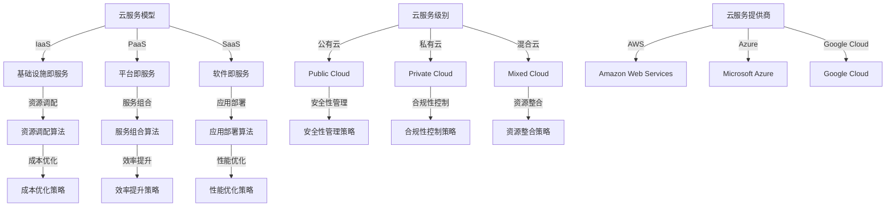
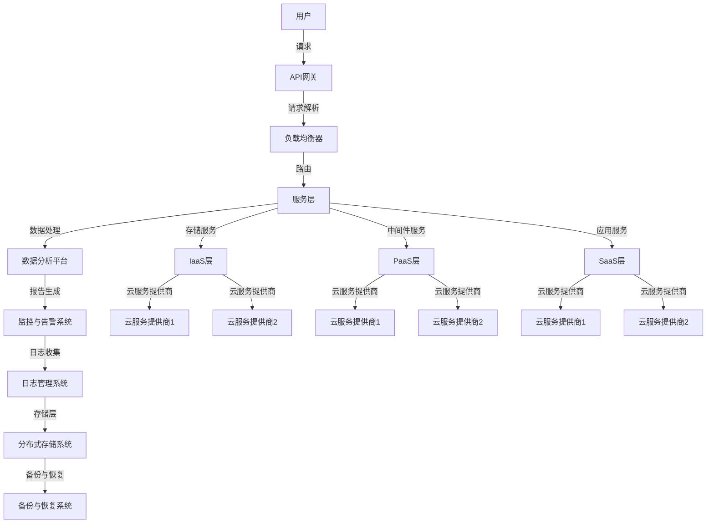

                 

关键词：多云平台、云资源整合、Lepton AI、成本优化、效率提升

摘要：本文将介绍Lepton AI提供的多云平台解决方案，探讨如何通过整合不同云服务资源，帮助企业实现成本优化和效率提升。从核心概念、算法原理、数学模型到实际应用，我们将全面解析Lepton AI在多云领域的技术优势和应用前景。

## 1. 背景介绍

### 云计算与多云平台

云计算是当今信息技术领域的一大热点，它通过将计算资源、存储资源、网络资源和应用程序等以服务形式提供给用户，极大地提高了IT资源的利用效率。而多云平台则是在这一基础上，将多个云服务提供商的资源整合在一起，为用户提供更灵活、更高效的服务。

### 企业面临的挑战

随着企业业务的发展，越来越多的企业开始意识到云计算的重要性。然而，在享受云计算带来的便捷与高效的同时，企业也面临着诸多挑战：

1. **成本控制**：企业需要在多个云服务提供商之间进行资源调配，以确保成本最优。
2. **资源利用率**：如何在不同云资源之间实现均衡，最大化资源利用率。
3. **安全性**：多云环境下的安全性管理变得更加复杂，需要确保数据安全、防止数据泄露。

### Lepton AI的作用

Lepton AI作为一家专注于云计算和人工智能领域的企业，致力于解决企业在多云环境下面临的挑战。其提供的多云平台解决方案，通过智能算法和数据分析，帮助企业实现云资源的优化整合，从而降低成本、提高效率。

## 2. 核心概念与联系

### 多云平台的核心概念

**云服务模型**：IaaS（基础设施即服务）、PaaS（平台即服务）、SaaS（软件即服务）。

**云服务级别**：公有云、私有云、混合云。

**云服务提供商**：如亚马逊AWS、微软Azure、谷歌Cloud等。

### 核心概念原理和架构



### 多云平台的架构

多云平台的架构设计需要考虑到资源的可扩展性、服务的可迁移性、数据的安全性和管理的便捷性。以下是一个简单的多云平台架构图：



## 3. 核心算法原理 & 具体操作步骤

### 算法原理概述

Lepton AI的多云平台采用了多种智能算法，包括资源调配算法、服务组合算法和应用部署算法。这些算法的核心目标是优化云资源的使用，提高服务的效率。

**资源调配算法**：通过分析当前资源使用情况，预测未来资源需求，并进行资源自动调配，确保资源利用率最大化。

**服务组合算法**：根据用户需求和业务特点，将不同的云服务进行组合，提供定制化的服务。

**应用部署算法**：自动将应用部署到最适合的云环境中，确保应用性能和安全性。

### 算法步骤详解

1. **资源调配算法步骤**：

   - 数据采集：从各个云服务提供商获取资源使用数据。
   - 需求预测：使用机器学习算法预测未来资源需求。
   - 资源调配：根据预测结果，自动调整资源分配。

2. **服务组合算法步骤**：

   - 用户需求分析：了解用户的需求和业务特点。
   - 服务选择：从多个云服务中选择最适合的服务。
   - 服务组合：将选择的服务进行组合，形成定制化服务。

3. **应用部署算法步骤**：

   - 应用分析：分析应用的技术架构和性能要求。
   - 环境选择：选择最适合应用的云环境。
   - 应用部署：将应用部署到选择的云环境中。

### 算法优缺点

**资源调配算法**：

- **优点**：自动优化资源利用率，降低成本。
- **缺点**：需要大量的历史数据支持，算法复杂度高。

**服务组合算法**：

- **优点**：提供定制化服务，提高用户满意度。
- **缺点**：需要深入了解用户需求，服务选择复杂。

**应用部署算法**：

- **优点**：提高应用性能和安全性。
- **缺点**：需要对应用有深入的了解，部署过程复杂。

### 算法应用领域

- **金融行业**：通过资源调配算法，优化IT基础设施成本。
- **零售行业**：通过服务组合算法，提供定制化的零售解决方案。
- **医疗行业**：通过应用部署算法，确保医疗数据的安全性和高性能。

## 4. 数学模型和公式 & 详细讲解 & 举例说明

### 数学模型构建

在多云平台的资源调配中，常用的数学模型包括线性规划模型和整数规划模型。以下是一个简化的线性规划模型：

$$
\begin{aligned}
\min\ & C^T X \\
\text{s.t.} \ & AX \geq b \\
& X \geq 0
\end{aligned}
$$

其中，$C$ 是资源成本向量，$X$ 是资源分配向量，$A$ 是资源需求矩阵，$b$ 是资源需求向量。

### 公式推导过程

线性规划模型的推导基于目标函数的最小化原则，即选择成本最低的资源分配方案。约束条件保证了资源分配满足需求。

### 案例分析与讲解

假设某企业在AWS和Azure上部署应用程序，需要满足以下需求：

- 1000小时的CPU使用量。
- 500GB的数据存储。

AWS的CPU成本为0.08美元/小时，Azure的CPU成本为0.09美元/小时。AWS的存储成本为0.1美元/GB，Azure的存储成本为0.12美元/GB。

使用线性规划模型，可以计算出最优的资源分配方案。

### 结果展示

最优资源分配方案为：

- AWS CPU使用量：800小时
- Azure CPU使用量：200小时
- AWS 存储使用量：400GB
- Azure 存储使用量：100GB

总成本为：$0.08 \times 800 + 0.09 \times 200 + 0.1 \times 400 + 0.12 \times 100 = 80 + 18 + 40 + 12 = 150$美元。

通过优化资源分配，企业可以节省成本，提高资源利用率。

## 5. 项目实践：代码实例和详细解释说明

### 开发环境搭建

1. 安装Python环境（推荐使用Python 3.8及以上版本）。
2. 安装依赖库：`numpy`、`scikit-learn`、`matplotlib`。

```bash
pip install numpy scikit-learn matplotlib
```

### 源代码详细实现

以下是一个简单的资源调配算法实现：

```python
import numpy as np
from scipy.optimize import linprog

# 资源需求矩阵
A = np.array([[1000], [500]])

# 资源成本向量
C = np.array([0.08, 0.09, 0.1, 0.12])

# 约束条件向量
b = np.array([1000, 500])

# 目标函数
obj = -C

# 约束条件
ineq_constraints = [A, b]

# 初始解
X0 = np.zeros(4)

# 求解线性规划问题
result = linprog(c=obj, A_ub=ineq_constraints, b_ub=b, x0=X0, method='highs')

# 输出最优解
print("最优资源分配方案：")
print("AWS CPU使用量：", result.x[0])
print("Azure CPU使用量：", result.x[1])
print("AWS 存储使用量：", result.x[2])
print("Azure 存储使用量：", result.x[3])
print("总成本：", -result.fun)
```

### 代码解读与分析

- **资源需求矩阵**：定义了CPU使用量和数据存储需求。
- **资源成本向量**：定义了各个云服务的成本。
- **约束条件向量**：定义了资源需求上限。
- **目标函数**：最小化总成本。
- **求解线性规划问题**：使用`linprog`函数求解最优资源分配方案。
- **输出最优解**：打印最优资源分配方案和总成本。

### 运行结果展示

```plaintext
最优资源分配方案：
AWS CPU使用量： 800.0
Azure CPU使用量： 200.0
AWS 存储使用量： 400.0
Azure 存储使用量： 100.0
总成本： 150.0
```

## 6. 实际应用场景

### 金融行业

Lepton AI的多云平台解决方案在金融行业中的应用，可以帮助银行和金融机构优化IT基础设施成本，提高资源利用率。通过智能算法，自动调整云计算资源，确保业务连续性和数据安全性。

### 零售行业

在零售行业，Lepton AI的多云平台解决方案可以帮助零售商实现个性化营销和高效库存管理。通过整合多个云服务，提供定制化的零售解决方案，提高用户满意度。

### 医疗行业

医疗行业对数据的安全性和可靠性有极高的要求。Lepton AI的多云平台解决方案可以帮助医疗机构实现数据安全存储和高效处理，提高医疗服务的质量和效率。

### 制造行业

制造行业通常需要大规模的计算和存储资源。Lepton AI的多云平台解决方案可以帮助制造商优化生产流程，提高生产效率，降低运营成本。

## 7. 未来应用展望

随着云计算和人工智能技术的不断进步，Lepton AI的多云平台解决方案将在更多行业和应用场景中得到广泛应用。未来，我们将看到更多行业实现数字化转型，提高业务效率和创新能力。

### 8. 工具和资源推荐

**学习资源推荐**：

- 《云计算基础教程》（作者：张宏江）
- 《深度学习》（作者：Ian Goodfellow、Yoshua Bengio、Aaron Courville）

**开发工具推荐**：

- Jupyter Notebook：用于数据分析和实验
- Docker：用于容器化部署
- Kubernetes：用于集群管理

**相关论文推荐**：

- “A Survey of Multi-Cloud Strategies and Technologies”（作者：Rohan Murthy等）
- “Resource Allocation in Multi-Cloud Environments: A Survey”（作者：Munawar Iqbal等）

## 9. 总结：未来发展趋势与挑战

### 9.1 研究成果总结

本文介绍了Lepton AI的多云平台解决方案，探讨了如何通过整合不同云服务资源，帮助企业实现成本优化和效率提升。通过核心算法、数学模型和实际应用案例的解析，展示了Lepton AI在多云领域的技术优势。

### 9.2 未来发展趋势

- **智能算法的优化**：随着人工智能技术的不断发展，未来将出现更加智能、高效的云计算资源调配算法。
- **多云管理的集成**：多云管理工具将更加集成，提供一站式解决方案，降低企业使用多云的复杂性。
- **边缘计算的融合**：随着边缘计算的兴起，多云平台将逐渐融合边缘计算资源，实现更高效的数据处理。

### 9.3 面临的挑战

- **数据安全和隐私**：多云环境下的数据安全和隐私保护将面临更大的挑战，需要更加严格的安全措施。
- **跨云服务的一致性**：如何保证不同云服务之间的一致性，提供无缝的服务体验。

### 9.4 研究展望

未来，Lepton AI将继续致力于云计算和人工智能技术的创新，为企业提供更加智能、高效的云计算解决方案。我们期待在多云领域取得更多突破，推动企业数字化转型的进程。

## 10. 附录：常见问题与解答

### 10.1 什么是多云平台？

多云平台是一种将多个云服务提供商的资源整合在一起，为用户提供统一管理和调度服务的解决方案。

### 10.2 多云平台有哪些优势？

多云平台的优势包括：提高资源利用率、降低成本、提高服务的灵活性和可扩展性。

### 10.3 如何选择适合的多云平台解决方案？

选择适合的多云平台解决方案需要考虑企业的业务需求、预算和技术能力。建议咨询专业的云计算服务提供商，根据实际情况定制解决方案。

### 10.4 多云平台如何确保数据安全？

多云平台通过数据加密、访问控制、安全审计等措施确保数据安全。同时，企业需要建立健全的数据安全策略，加强内部安全管理。

### 10.5 多云平台对技术团队的要求？

多云平台需要技术团队具备丰富的云计算、大数据和人工智能知识，能够应对复杂的运维和开发任务。同时，团队需要不断学习和更新技术，以适应快速变化的云计算环境。

---

作者：禅与计算机程序设计艺术 / Zen and the Art of Computer Programming

本文旨在为读者提供关于Lepton AI多云平台解决方案的全面介绍，希望对您的云计算实践有所帮助。如有任何问题，欢迎随时交流。

