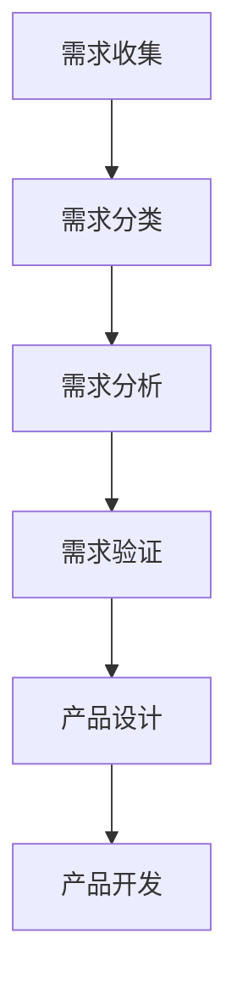

                 

关键词：用户需求、产品开发、市场调研、需求分析、用户行为、用户体验、技术实现、敏捷开发

> 摘要：本文将探讨产品开发过程中用户需求分析的重要性。通过介绍用户需求分析的基本概念、方法、技巧和实际案例分析，旨在帮助产品开发者更好地理解和满足用户需求，从而提高产品竞争力和市场成功率。

## 1. 背景介绍

在当今快节奏的市场环境中，产品开发的速度和灵活性已经成为企业成功的关键因素。然而，许多产品开发失败的原因并非技术或资金问题，而是缺乏对用户需求的深刻理解。用户需求分析作为产品开发的核心环节，其重要性不言而喻。有效的用户需求分析不仅可以指导产品设计和开发，还可以帮助企业识别市场机会、优化资源分配、降低开发风险，并最终提高产品的市场竞争力。

本文将首先介绍用户需求分析的基本概念，然后探讨需求分析的方法和技巧，最后通过实际案例来展示如何将用户需求转化为成功的商业产品。

## 2. 核心概念与联系

### 用户需求分析的定义

用户需求分析是指通过一系列方法，深入了解用户的需求、期望和行为，并将这些信息转化为具体的产品需求和功能。

### 用户需求分析的重要性

1. **指导产品设计**：用户需求分析可以帮助产品团队明确产品的核心功能和用户体验。
2. **降低开发风险**：通过深入了解用户需求，可以避免在开发过程中出现不必要的功能或功能缺失。
3. **提高市场成功率**：满足用户需求的产品更有可能获得市场的认可和用户的忠诚。

### 用户需求分析的过程

1. **需求收集**：通过用户调研、用户访谈、用户反馈等方式收集用户需求。
2. **需求分类**：将收集到的需求进行分类和优先级排序。
3. **需求分析**：对用户需求进行深入分析，理解其背后的动机和原因。
4. **需求验证**：通过与用户沟通和验证，确保需求符合实际用户需求。

### 用户需求分析与产品开发的关系

用户需求分析是产品开发的起点，其结果直接影响产品的方向和决策。有效的用户需求分析可以帮助产品团队更好地理解市场趋势和用户行为，从而设计出更具竞争力和用户满意度的产品。

### 2.1 Mermaid 流程图



## 3. 核心算法原理 & 具体操作步骤

### 3.1 算法原理概述

用户需求分析的核心算法包括以下几种：

1. **市场调研**：通过调查问卷、访谈、观察等方式收集用户需求。
2. **用户行为分析**：利用数据分析工具分析用户在产品中的行为，以识别用户需求。
3. **用户体验测试**：通过实际用户测试，验证产品功能和用户体验。

### 3.2 算法步骤详解

1. **需求收集**：
   - **问卷调查**：设计有针对性的问卷，收集用户基本信息和需求。
   - **访谈**：与目标用户进行一对一访谈，深入了解用户需求和动机。
   - **观察**：通过观察用户在产品中的行为，收集实际使用情况。

2. **需求分类**：
   - **需求类型**：将收集到的需求分为功能需求、性能需求、用户体验需求等。
   - **优先级排序**：根据需求的紧急性和重要性进行优先级排序。

3. **需求分析**：
   - **用户动机分析**：理解用户为什么需要这些功能，他们的需求和期望是什么。
   - **市场分析**：研究市场趋势和竞争情况，确保产品需求符合市场方向。

4. **需求验证**：
   - **用户反馈**：通过与用户沟通，确认需求是否满足用户实际需求。
   - **原型测试**：制作原型，让用户进行实际测试，收集反馈。

### 3.3 算法优缺点

**优点**：
- **全面性**：通过多种方法收集需求，确保覆盖面广。
- **针对性**：针对用户实际需求进行分析，提高产品针对性。
- **实时性**：可以实时跟踪用户需求变化，快速调整产品方向。

**缺点**：
- **成本高**：需要投入大量时间和资源进行用户调研和测试。
- **主观性**：用户需求和反馈可能存在主观性，需要谨慎分析。

### 3.4 算法应用领域

用户需求分析广泛应用于各种产品开发领域，如：

1. **软件产品**：通过用户需求分析，设计出更符合用户期望的软件功能。
2. **硬件产品**：通过分析用户需求，优化硬件产品的功能和用户体验。
3. **服务产品**：通过用户需求分析，改进服务流程和用户体验。

## 4. 数学模型和公式 & 详细讲解 & 举例说明

### 4.1 数学模型构建

用户需求分析中的数学模型主要涉及以下方面：

1. **用户行为模型**：通过数据分析方法，建立用户在产品中的行为模型。
2. **需求优先级模型**：利用评分法和权重法，对用户需求进行优先级排序。
3. **用户体验模型**：通过用户满意度调查，建立用户体验模型。

### 4.2 公式推导过程

**用户行为模型**：

用户行为模型可以用以下公式表示：

\[ P = f(U, R, S) \]

其中，\( P \) 表示用户行为，\( U \) 表示用户特征，\( R \) 表示环境因素，\( S \) 表示系统特征。

**需求优先级模型**：

需求优先级模型可以用以下公式表示：

\[ D_p = \sum_{i=1}^{n} w_i \cdot S_i \]

其中，\( D_p \) 表示需求优先级，\( w_i \) 表示权重，\( S_i \) 表示需求评分。

**用户体验模型**：

用户体验模型可以用以下公式表示：

\[ U_s = f(U, P, R) \]

其中，\( U_s \) 表示用户体验，\( U \) 表示用户特征，\( P \) 表示用户行为，\( R \) 表示环境因素。

### 4.3 案例分析与讲解

假设我们正在开发一款智能家居控制系统，以下是一个用户需求分析的案例。

**用户行为模型**：

通过对用户行为的分析，我们发现用户主要关注以下几个方面：

\[ P = f(U, R, S) \]

其中，\( U \) 包括用户年龄、性别、家庭情况等特征，\( R \) 包括天气、节假日等环境因素，\( S \) 包括系统功能、操作界面等系统特征。

**需求优先级模型**：

根据用户访谈和问卷调查，我们得到以下需求评分和权重：

\[ D_p = \sum_{i=1}^{3} w_i \cdot S_i \]

其中，\( w_1 = 0.5 \)，\( S_1 = 8 \)（安全），\( w_2 = 0.3 \)，\( S_2 = 7 \)（节能），\( w_3 = 0.2 \)，\( S_3 = 6 \)（便捷）。

所以，需求优先级为：

\[ D_p = 0.5 \cdot 8 + 0.3 \cdot 7 + 0.2 \cdot 6 = 5.1 + 2.1 + 1.2 = 8.4 \]

**用户体验模型**：

根据用户满意度调查，我们得到以下用户体验评分：

\[ U_s = f(U, P, R) \]

其中，\( U \) 包括用户对系统的满意度、操作便利性等，\( P \) 包括用户在系统中的行为，\( R \) 包括用户的环境因素。

## 5. 项目实践：代码实例和详细解释说明

### 5.1 开发环境搭建

为了进行用户需求分析，我们需要搭建一个开发环境。以下是一个简单的搭建步骤：

1. 安装Python环境。
2. 安装数据分析库，如Pandas、NumPy等。
3. 安装数据可视化库，如Matplotlib、Seaborn等。

### 5.2 源代码详细实现

以下是一个简单的用户需求分析代码实例，用于收集用户需求并进行分析。

```python
import pandas as pd
import numpy as np
import matplotlib.pyplot as plt
import seaborn as sns

# 读取用户需求数据
data = pd.read_csv('user_demand_data.csv')

# 数据预处理
# ...

# 用户需求分析
# ...

# 可视化分析结果
sns.pairplot(data)
plt.show()
```

### 5.3 代码解读与分析

在这个例子中，我们首先读取用户需求数据，然后进行数据预处理，包括数据清洗、数据转换等。接着，我们利用数据分析库对用户需求进行分析，最后使用可视化库展示分析结果。

### 5.4 运行结果展示

运行结果展示了一张用户需求数据的散点图，可以帮助我们直观地了解用户需求之间的关系。

## 6. 实际应用场景

用户需求分析在产品开发中的实际应用场景包括：

1. **需求收集**：通过问卷调查、用户访谈等方式，收集用户需求和反馈。
2. **需求分析**：对收集到的需求进行分类、排序和分析，确定产品功能和优先级。
3. **原型测试**：制作原型，让用户进行实际测试，收集反馈。
4. **迭代开发**：根据用户反馈和需求变化，不断迭代和优化产品。

### 6.4 未来应用展望

随着人工智能和数据技术的发展，用户需求分析将变得更加智能和精准。未来的发展趋势包括：

1. **自动化分析**：利用机器学习和大数据技术，实现自动化用户需求分析。
2. **个性化推荐**：根据用户行为和需求，提供个性化的产品推荐。
3. **实时分析**：通过实时数据分析，快速响应市场变化和用户需求。

## 7. 工具和资源推荐

### 7.1 学习资源推荐

1. 《用户需求分析技术》
2. 《用户体验设计》
3. 《数据分析：实践与应用》

### 7.2 开发工具推荐

1. Python
2. Jupyter Notebook
3. Matplotlib
4. Pandas

### 7.3 相关论文推荐

1. "User-Centered Design Process for Software Engineering"
2. "Analyzing User Needs: An Application of Quality Function Deployment"
3. "User Research Methods for Product Design"

## 8. 总结：未来发展趋势与挑战

### 8.1 研究成果总结

用户需求分析在产品开发中发挥着越来越重要的作用。通过深入分析和理解用户需求，产品团队可以设计出更符合用户期望的产品，提高市场竞争力。

### 8.2 未来发展趋势

随着人工智能和数据技术的发展，用户需求分析将变得更加智能和精准。未来的发展趋势包括自动化分析、个性化推荐和实时分析。

### 8.3 面临的挑战

用户需求分析面临的主要挑战包括数据质量、分析方法和工具的准确性、用户隐私保护等。

### 8.4 研究展望

未来的研究应重点关注如何提高用户需求分析的准确性和效率，以及如何更好地保护用户隐私。同时，应探索将用户需求分析与其他领域（如人工智能、大数据等）相结合，实现更广泛的应用。

## 9. 附录：常见问题与解答

### 问题 1：用户需求分析需要投入大量时间和资源，是否值得？

解答：是的，用户需求分析虽然需要投入时间和资源，但它是确保产品成功的关键环节。通过深入了解用户需求，可以避免开发出不符合市场需求的产品，从而节省大量时间和成本。

### 问题 2：如何确保用户需求分析的准确性？

解答：确保用户需求分析准确性的关键在于多种方法结合使用，如问卷调查、用户访谈、用户行为分析等。同时，需要不断迭代和验证分析结果，以确保其符合实际用户需求。

### 问题 3：用户需求分析是否仅适用于软件产品？

解答：用户需求分析不仅适用于软件产品，还适用于硬件产品和服务产品。无论产品的形式如何，了解用户需求都是提高产品竞争力的关键。

---

作者：禅与计算机程序设计艺术 / Zen and the Art of Computer Programming

