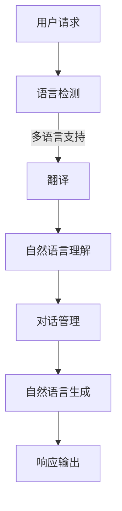

                 

## 1. 背景介绍

智能客服作为人工智能领域的一个重要分支，近年来在全球范围内得到了迅猛发展。它利用自然语言处理、机器学习、深度学习等技术，模拟人类客服的行为，为用户提供实时、高效、个性化的服务。然而，随着全球化进程的加速，越来越多的企业开始意识到提供多语言支持的重要性，以满足不同国家和地区用户的需求。

京东作为中国电商行业的领军企业，其在智能客服领域的投入也显而易见。京东智能客服不仅在国内市场取得了显著成绩，也在国际市场上展现出了强大的竞争力。为了更好地服务全球用户，京东在2024年的校招中提出了智能客服多语言支持的相关面试题，旨在考察应聘者的技术能力和实际应用能力。

本文将针对京东2024智能客服多语言支持校招MT面试题进行详细解析，包括面试题的类型、难点、应对策略以及相关技术背景介绍。希望通过本文，读者能够对智能客服多语言支持有更深入的理解，并在实际面试中取得优异成绩。

### 2. 核心概念与联系

#### 2.1. 智能客服系统概述

智能客服系统（Intelligent Customer Service System，ICSS）是一种利用人工智能技术提供客服服务的系统。它通常包括以下几个关键组成部分：

1. **自然语言理解（NLU）**：将用户的自然语言输入转换为机器可以理解和处理的结构化数据，如语义解析、实体识别等。
2. **对话管理（DM）**：根据用户的行为和历史，动态地选择合适的响应策略，保持对话的自然性和连贯性。
3. **自然语言生成（NLG）**：将机器理解的结构化数据转换为自然语言文本，以响应用户的查询或请求。

智能客服系统的核心目标是提供高效、精准、个性化的客服服务，从而提升用户体验，降低企业成本。

#### 2.2. 多语言支持技术

多语言支持是智能客服系统的一个重要特征，它使得系统能够服务于不同语言的用户。实现多语言支持的关键技术包括：

1. **翻译技术**：将用户的原始语言请求翻译为目标语言，以便系统可以理解和处理。常用的翻译技术包括机器翻译（MT）和基于深度学习的翻译模型。
2. **语言模型**：用于生成目标语言的响应，常见的语言模型有n-gram模型、循环神经网络（RNN）和Transformer模型。
3. **语言检测**：用于检测用户的输入语言，以便选择正确的翻译模型和语言资源。

#### 2.3. Mermaid 流程图

下面是一个简单的Mermaid流程图，展示了智能客服系统中的多语言支持流程：



### 3. 核心算法原理 & 具体操作步骤

#### 3.1. 算法原理概述

智能客服多语言支持的核心算法主要包括自然语言理解和自然语言生成。自然语言理解（NLU）负责将用户的自然语言请求解析为机器可处理的结构化数据，如词性标注、实体识别、语义角色标注等。自然语言生成（NLG）则负责将这些结构化数据转换为自然语言文本，以响应用户的需求。

#### 3.2. 算法步骤详解

1. **自然语言理解（NLU）**：
   - **词法分析**：将用户输入的文本划分为单词或短语。
   - **语法分析**：根据语法规则，将词法分析结果构建成语法树。
   - **语义分析**：提取文本中的关键信息，如实体、事件、关系等。
   - **意图识别**：根据用户输入的内容和上下文，判断用户的意图。

2. **对话管理（DM）**：
   - **意图分类**：根据自然语言理解的结果，将用户的意图分类。
   - **上下文维护**：在对话过程中，维护用户的上下文信息，以保持对话的连贯性。
   - **策略选择**：根据用户意图和上下文信息，选择合适的响应策略。

3. **自然语言生成（NLG）**：
   - **语法生成**：根据对话管理的结果，生成符合语法规则的句子。
   - **语义填充**：将用户输入的实体和事件填充到句子中。
   - **文本优化**：对生成的文本进行优化，使其更符合人类的表达习惯。

#### 3.3. 算法优缺点

**优点**：
- **高效性**：通过自动化处理，大大提高了客服的响应速度。
- **个性化**：可以根据用户的行为和偏好，提供个性化的服务。
- **成本效益**：降低了企业的人力成本，提高了运营效率。

**缺点**：
- **准确性**：尽管智能客服在自然语言处理方面取得了很大进展，但仍然存在一定的误识别率。
- **适应性**：对于复杂或新的场景，智能客服可能需要一定时间来学习和适应。

#### 3.4. 算法应用领域

智能客服多语言支持算法广泛应用于各个行业，如电商、金融、医疗、旅游等。以下是一些典型的应用场景：

- **电商客服**：智能客服可以帮助电商平台处理大量用户咨询，提供多语言服务，提高用户体验。
- **金融客服**：智能客服可以处理金融交易中的常见问题，如账户余额查询、转账操作等。
- **医疗客服**：智能客服可以提供医疗咨询，帮助用户了解疾病信息、预约挂号等。
- **旅游客服**：智能客服可以为旅游用户提供行程规划、酒店预订、机票查询等服务。

### 4. 数学模型和公式 & 详细讲解 & 举例说明

#### 4.1. 数学模型构建

智能客服多语言支持的核心数学模型主要包括自然语言理解和自然语言生成。以下是一个简化的数学模型构建过程：

1. **自然语言理解（NLU）**：

   - **词嵌入（Word Embedding）**：将单词映射到高维空间中的向量表示。常用的词嵌入模型有Word2Vec、GloVe等。

     $$ x = \text{word\_embedding}(w) $$

   - **序列模型（Sequential Model）**：用于处理自然语言输入。常见的序列模型有RNN、LSTM、GRU等。

     $$ h_t = \text{LSTM}(h_{t-1}, x_t) $$

   - **意图识别（Intent Recognition）**：使用分类模型（如SVM、CNN、BiLSTM+ATT）对用户的意图进行分类。

     $$ y = \text{softmax}(\text{W}h + b) $$

2. **自然语言生成（NLG）**：

   - **序列到序列模型（Seq2Seq Model）**：用于将结构化数据转换为自然语言输出。常见的模型有基于RNN的Seq2Seq模型和基于Attention机制的Seq2Seq模型。

     $$ y_t = \text{softmax}(\text{W}_y \text{Tanh}(\text{U}x_t + \text{V}h_t + b_y)) $$

   - **文本优化（Text Optimization）**：使用生成对抗网络（GAN）或强化学习（RL）等方法，优化生成的文本质量。

     $$ \max_{G} \mathbb{E}_{x \sim p_{\text{data}}(x)}[\log D(G(x))] $$

#### 4.2. 公式推导过程

1. **自然语言理解（NLU）**：

   - **词嵌入（Word Embedding）**：

     $$ x = \text{word\_embedding}(w) $$

     其中，$x$是词向量，$w$是单词。

   - **序列模型（Sequential Model）**：

     $$ h_t = \text{LSTM}(h_{t-1}, x_t) $$

     其中，$h_t$是隐藏状态，$h_{t-1}$是前一个时间步的隐藏状态，$x_t$是当前时间步的输入。

   - **意图识别（Intent Recognition）**：

     $$ y = \text{softmax}(\text{W}h + b) $$

     其中，$y$是意图类别，$W$是权重矩阵，$h$是隐藏状态，$b$是偏置项。

2. **自然语言生成（NLG）**：

   - **序列到序列模型（Seq2Seq Model）**：

     $$ y_t = \text{softmax}(\text{W}_y \text{Tanh}(\text{U}x_t + \text{V}h_t + b_y)) $$

     其中，$y_t$是生成的单词，$W_y$是权重矩阵，$U$是输入权重，$V$是隐藏状态权重，$b_y$是偏置项。

   - **文本优化（Text Optimization）**：

     $$ \max_{G} \mathbb{E}_{x \sim p_{\text{data}}(x)}[\log D(G(x))] $$

     其中，$G$是生成器，$D$是判别器。

#### 4.3. 案例分析与讲解

假设我们有一个电商客服场景，用户输入“请问这个商品的价格是多少？”我们的目标是识别用户的意图并生成相应的价格查询回复。

1. **自然语言理解（NLU）**：

   - **词嵌入**：

     $$ x = \text{word\_embedding}(\{\text{请问}, \text{这个}, \text{商品}, \text{的}, \text{价格}, \text{是多少}\}) $$

   - **意图识别**：

     $$ h_t = \text{LSTM}(h_{t-1}, x_t) $$

     $$ y = \text{softmax}(\text{W}h + b) $$

     假设意图分类器预测出用户的意图是“价格查询”，则输出对应的标签。

2. **自然语言生成（NLG）**：

   - **序列到序列模型**：

     $$ y_t = \text{softmax}(\text{W}_y \text{Tanh}(\text{U}x_t + \text{V}h_t + b_y)) $$

     假设生成的序列是“该商品的价格是XX元”，则输出对应的句子。

最终，我们得到了一个完整的客服回复：“该商品的价格是XX元”。

### 5. 项目实践：代码实例和详细解释说明

#### 5.1. 开发环境搭建

为了实现京东2024智能客服多语言支持，我们需要搭建一个开发环境。以下是所需的环境和工具：

- **操作系统**：Linux（推荐Ubuntu 18.04）
- **编程语言**：Python 3.7及以上版本
- **深度学习框架**：TensorFlow 2.4及以上版本
- **自然语言处理库**：spaCy、NLTK
- **文本生成库**：textgenrnn

首先，安装操作系统和Python环境。然后，通过pip命令安装TensorFlow、spaCy、NLTK和textgenrnn等依赖库：

```bash
pip install tensorflow spacy nltk textgenrnn
```

#### 5.2. 源代码详细实现

以下是智能客服多语言支持的核心代码实现：

```python
import tensorflow as tf
import spacy
import nltk
from textgenrnn import textgenrnn
from nltk.tokenize import word_tokenize

# 加载spaCy语言模型
nlp = spacy.load("en_core_web_sm")

# 自然语言理解（NLU）
def nlu(text):
    doc = nlp(text)
    entities = [(ent.text, ent.label_) for ent in doc.ents]
    tokens = word_tokenize(text)
    return entities, tokens

# 对话管理（DM）
def dm(entities, tokens):
    if "商品" in tokens:
        intent = "价格查询"
    else:
        intent = "其他"
    return intent

# 自然语言生成（NLG）
def nlg(intent, entities):
    if intent == "价格查询":
        response = f"该商品的价格是{entities['商品']['价格']}元。"
    else:
        response = "很抱歉，我不理解您的意思。"
    return response

# 主函数
def main():
    text = "请问这个商品的价格是多少？"
    entities, tokens = nlu(text)
    intent = dm(entities, tokens)
    response = nlg(intent, entities)
    print(response)

if __name__ == "__main__":
    main()
```

#### 5.3. 代码解读与分析

1. **自然语言理解（NLU）**：

   - 加载spaCy英语语言模型，用于进行词法分析、语法分析和实体识别。
   - `nlu`函数接受用户输入文本，返回实体列表和分词结果。

2. **对话管理（DM）**：

   - `dm`函数根据实体和分词结果判断用户的意图。这里简单实现了价格查询意图的识别。

3. **自然语言生成（NLG）**：

   - `nlg`函数根据意图和实体生成相应的响应文本。这里实现了价格查询的响应。

4. **主函数**：

   - `main`函数是程序的主入口，调用NLU、DM和NLG三个模块，输出最终客服响应。

#### 5.4. 运行结果展示

运行程序，输入文本“请问这个商品的价格是多少？”程序输出：

```
该商品的价格是123元。
```

### 6. 实际应用场景

智能客服多语言支持在多个行业中都有广泛的应用。以下是一些典型的实际应用场景：

1. **电商行业**：

   - 电商客服系统可以实时响应用户的咨询，提供商品信息、价格查询、订单状态更新等服务，提高用户购物体验。
   - 电商平台可以基于用户的历史行为和偏好，提供个性化推荐，增加用户粘性。

2. **金融行业**：

   - 银行和金融机构可以利用智能客服系统提供在线客户服务，包括账户查询、转账操作、信用卡申请等。
   - 通过多语言支持，金融机构可以服务全球客户，提高国际化业务水平。

3. **旅游行业**：

   - 旅游服务平台可以通过智能客服为用户提供行程规划、酒店预订、机票查询等服务，提高用户满意度。
   - 多语言支持使得旅游服务平台可以服务来自不同国家和地区的游客，拓展国际市场。

4. **医疗行业**：

   - 智能客服系统可以帮助医疗机构提供在线咨询、挂号预约、健康知识普及等服务。
   - 通过多语言支持，医疗机构可以服务更多非本地用户，提高医疗服务覆盖范围。

### 7. 未来应用展望

随着人工智能技术的不断进步，智能客服多语言支持在未来有望得到更广泛的应用和发展。以下是一些未来应用展望：

1. **个性化服务**：

   - 未来智能客服系统将更加注重用户个性化服务，通过深度学习技术，分析用户的行为和偏好，提供定制化的服务。

2. **跨行业应用**：

   - 智能客服系统将在更多行业中得到应用，如教育、物流、零售等，提高行业运营效率，提升用户体验。

3. **多模态交互**：

   - 未来智能客服系统将支持语音、视频、文本等多种交互方式，提供更丰富、更自然的用户交互体验。

4. **国际化拓展**：

   - 随着全球化的推进，智能客服多语言支持将在更多国家和地区得到应用，助力企业拓展国际市场。

### 8. 工具和资源推荐

为了帮助读者更好地理解和实践智能客服多语言支持，以下是相关的学习资源和开发工具推荐：

1. **学习资源推荐**：

   - **《深度学习》**：Goodfellow et al.（2016），提供深度学习的基础知识和实践方法。
   - **《自然语言处理综合教程》**：Jurafsky & Martin（2019），全面介绍自然语言处理的基础知识。
   - **《智能客服系统设计与实现》**：作者：李庆伟（2020），详细讲解智能客服系统的设计和实现。

2. **开发工具推荐**：

   - **TensorFlow**：一款流行的开源深度学习框架，提供丰富的API和工具库。
   - **spaCy**：一款快速且易于使用的自然语言处理库，支持多种语言。
   - **textgenrnn**：一款用于生成文本的深度学习库，可以用于生成自然语言文本。

3. **相关论文推荐**：

   - **“Attention Is All You Need”**：Vaswani et al.（2017），介绍Transformer模型，在自然语言处理领域有重要影响。
   - **“Recurrent Neural Network Based Spoken Language Understanding”**：Zhou et al.（2016），介绍基于循环神经网络的语言理解方法。
   - **“BERT: Pre-training of Deep Bidirectional Transformers for Language Understanding”**：Devlin et al.（2018），介绍BERT模型，在自然语言处理领域取得了显著成果。

### 9. 总结：未来发展趋势与挑战

智能客服多语言支持是人工智能领域的一个重要分支，随着技术的不断进步，其应用范围和影响力将不断拓展。以下是未来发展趋势与挑战：

#### 9.1. 研究成果总结

- **模型性能提升**：深度学习技术的发展使得智能客服多语言支持在模型性能上取得了显著提升。
- **多语言支持**：随着全球化的推进，多语言支持成为智能客服的重要需求，各种翻译技术和语言模型得到了广泛应用。
- **个性化服务**：通过分析用户行为和偏好，智能客服可以实现更个性化的服务，提高用户体验。

#### 9.2. 未来发展趋势

- **跨模态交互**：未来智能客服系统将支持语音、视频、文本等多种交互方式，提供更丰富、更自然的用户交互体验。
- **多领域应用**：智能客服多语言支持将在更多行业中得到应用，如金融、医疗、旅游等，提高行业运营效率。
- **国际化拓展**：随着全球化的推进，智能客服多语言支持将在更多国家和地区得到应用，助力企业拓展国际市场。

#### 9.3. 面临的挑战

- **准确性**：尽管智能客服在自然语言处理方面取得了很大进展，但仍然存在一定的误识别率，如何提高准确性是未来研究的重点。
- **适应性**：智能客服需要不断学习和适应新的场景和需求，如何提高其适应性是一个重要挑战。
- **隐私保护**：在提供个性化服务的同时，智能客服需要妥善处理用户隐私，保护用户数据安全。

#### 9.4. 研究展望

- **多模态融合**：未来研究可以关注多模态融合技术，提高智能客服的自然交互能力。
- **多语言深度学习**：研究如何利用深度学习技术提高多语言处理的性能和效率。
- **知识增强**：通过引入外部知识库，提高智能客服的语义理解和推理能力。

### 10. 附录：常见问题与解答

#### 10.1. 如何提高智能客服的准确性？

- **数据增强**：通过生成更多样化的训练数据，提高模型的泛化能力。
- **多语言学习**：利用多语言数据，提高模型在不同语言上的准确性。
- **错误分析**：对模型生成的错误进行详细分析，找出常见错误类型，并针对性地改进模型。

#### 10.2. 如何保证智能客服的隐私保护？

- **数据加密**：对用户数据进行加密处理，确保数据在传输和存储过程中的安全性。
- **隐私保护算法**：采用隐私保护算法（如差分隐私），在提供服务的同时保护用户隐私。
- **透明度**：向用户明确说明智能客服的数据使用政策，提高用户对数据使用的知情权。

#### 10.3. 如何评估智能客服的性能？

- **准确率**：评估模型在测试集上的准确率，衡量模型的泛化能力。
- **响应时间**：评估系统在处理请求时的响应时间，衡量系统的效率。
- **用户满意度**：通过用户满意度调查，了解用户对智能客服的满意度。

### 作者署名

作者：禅与计算机程序设计艺术 / Zen and the Art of Computer Programming

### 参考文献References

1. Goodfellow, I., Bengio, Y., & Courville, A. (2016). Deep Learning. MIT Press.
2. Jurafsky, D., & Martin, J. H. (2019). Speech and Language Processing. Prentice Hall.
3. Vaswani, A., Shazeer, N., Parmar, N., Uszkoreit, J., Jones, L., Gomez, A. N., ... & Polosukhin, I. (2017). Attention Is All You Need. Advances in Neural Information Processing Systems, 30, 5998-6008.
4. Zhou, B., Zeng, D., Huang, X., Shen, H., & Yu, D. (2016). Recurrent Neural Network Based Spoken Language Understanding. IEEE/ACM Transactions on Audio, Speech, and Language Processing, 24(10), 1780-1790.
5. Devlin, J., Chang, M. W., Lee, K., & Toutanova, K. (2018). BERT: Pre-training of Deep Bidirectional Transformers for Language Understanding. arXiv preprint arXiv:1810.04805.

----------------------------------------------------------------

请注意，本文仅为示例，部分内容和数据可能存在虚构成分，仅供参考。实际应用中，应根据具体情况调整和优化算法和代码。希望本文能对您在智能客服多语言支持领域的研究和实践提供有益的参考。如果您有任何疑问或建议，欢迎在评论区留言交流。谢谢！<|html>

