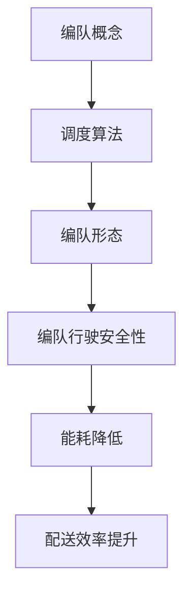

                 

关键词：京东，无人配送车，编队，调度算法，社招，面试题

摘要：本文针对京东2025年无人配送车编队社招面试题，深入解析了无人配送车编队的核心概念、调度算法原理、数学模型及实际应用。通过详细分析，为读者提供了全面的技术理解和实践指导。

## 1. 背景介绍

随着人工智能和自动驾驶技术的快速发展，无人配送车编队技术逐渐成为物流领域的研究热点。京东作为我国领先的电商企业，积极推进无人配送车的研发与应用，致力于提高配送效率，降低物流成本。因此，2025年京东社招面试中关于无人配送车编队调度算法的题目成为考查应聘者技术能力的重要环节。

## 2. 核心概念与联系

### 2.1 编队概念

编队是指多辆无人配送车按照一定的规则和队形进行协同行驶。编队的主要目的是提高行驶安全性，降低能耗，提升配送效率。编队的形态可以分为线性编队、V字编队、梯队编队等。

### 2.2 调度算法

调度算法是指根据配送任务和道路状况，为每辆无人配送车生成合理的行驶路径和速度控制策略。调度算法的目标是使编队整体行驶过程最优。

### 2.3 联系

编队和调度算法密切相关。编队是调度算法的实现载体，而调度算法为编队提供了合理的行驶路径和速度控制策略。

### 2.4 Mermaid流程图



## 3. 核心算法原理 & 具体操作步骤

### 3.1 算法原理概述

无人配送车编队调度算法主要包括以下几个步骤：

1. 任务分配：根据配送任务和无人配送车状态，为每辆车分配配送目标。
2. 路径规划：为每辆车生成从起点到终点的行驶路径。
3. 队形控制：根据车辆位置和速度，调整队形，确保行驶安全。
4. 跟随控制：根据前车的速度和位置，调整当前车的速度，实现平稳跟随。

### 3.2 算法步骤详解

#### 3.2.1 任务分配

任务分配算法主要考虑以下几个因素：

1. 无人配送车剩余电量：优先分配距离较近、剩余电量较高的任务。
2. 道路状况：优先分配道路通畅、路况较好的任务。

任务分配算法实现步骤如下：

1. 收集配送任务数据，包括任务起点、终点、距离、道路状况等。
2. 对无人配送车进行排序，按照剩余电量和道路状况进行排序。
3. 为每辆车分配距离最近的配送任务。

#### 3.2.2 路径规划

路径规划算法可以使用A*算法、Dijkstra算法等。具体实现步骤如下：

1. 建立道路网络图，包括道路节点和边。
2. 为每辆车设置起点和终点。
3. 使用路径规划算法，为每辆车生成从起点到终点的最优路径。

#### 3.2.3 队形控制

队形控制算法主要考虑车辆之间的距离和速度差。具体实现步骤如下：

1. 初始化车辆位置和速度。
2. 计算每辆车的相对位置和速度差。
3. 根据相对位置和速度差，调整车辆的速度和队形。

#### 3.2.4 跟随控制

跟随控制算法主要考虑前车的速度和位置。具体实现步骤如下：

1. 获取前车的速度和位置信息。
2. 根据前车的速度和位置，调整当前车的速度和距离。
3. 实现平稳跟随，确保车辆之间保持安全距离。

### 3.3 算法优缺点

#### 优点

1. 提高配送效率：通过编队行驶，降低车辆间的能耗，提高整体配送速度。
2. 提高行驶安全性：通过队形控制和跟随控制，确保车辆之间保持安全距离，降低交通事故风险。
3. 降低物流成本：通过优化路径规划和任务分配，降低配送成本。

#### 缺点

1. 算法复杂度较高：需要同时考虑任务分配、路径规划、队形控制和跟随控制，算法复杂度较高。
2. 对道路状况要求较高：在复杂道路环境中，算法性能可能受到一定影响。

### 3.4 算法应用领域

无人配送车编队调度算法主要应用于物流配送领域，如电商、快递等。此外，该算法还可以应用于自动驾驶车辆编队、智能交通等领域。

## 4. 数学模型和公式

### 4.1 数学模型构建

无人配送车编队调度算法中的数学模型主要包括以下几部分：

1. 任务分配模型：考虑车辆剩余电量和道路状况，建立任务分配的优化模型。
2. 路径规划模型：使用A*算法、Dijkstra算法等路径规划算法，建立路径规划模型。
3. 队形控制模型：考虑车辆之间的距离和速度差，建立队形控制模型。
4. 跟随控制模型：考虑前车的速度和位置，建立跟随控制模型。

### 4.2 公式推导过程

1. 任务分配模型

假设有n辆无人配送车，每辆车的剩余电量为$E_i$，道路状况为$D_i$，配送任务距离为$d_i$，则任务分配目标函数为：

$$
f(E_i, D_i, d_i) = \sum_{i=1}^{n} E_i \times D_i \times d_i
$$

约束条件为：

$$
E_i \geq 0, D_i \in \{0, 1\}, d_i \geq 0
$$

2. 路径规划模型

假设道路网络图包含m个节点，每条边的长度为$l_{ij}$，无人配送车的起点为$s$，终点为$t$，则路径规划目标函数为：

$$
g(s, t) = \sum_{i=1}^{m} l_{is} + l_{st}
$$

约束条件为：

$$
s, t \in V, l_{ij} > 0, i \neq j
$$

3. 队形控制模型

假设第$i$辆车的速度为$v_i$，第$j$辆车的速度为$v_j$，两车之间的距离为$d_{ij}$，则队形控制目标函数为：

$$
h(v_i, v_j, d_{ij}) = \sum_{i=1}^{n} \sum_{j=1}^{n} (v_i - v_j)^2 + (d_{ij} - d_{0})^2
$$

约束条件为：

$$
v_i, v_j \geq 0, d_{ij} \geq 0, d_{0} \geq 0
$$

4. 跟随控制模型

假设第$i$辆车的前车为$j$，前车的速度为$v_j$，第$i$辆车的速度为$v_i$，两车之间的距离为$d_{ij}$，则跟随控制目标函数为：

$$
k(v_i, v_j, d_{ij}) = (v_i - v_j)^2 + (d_{ij} - d_{0})^2
$$

约束条件为：

$$
v_i, v_j \geq 0, d_{ij} \geq 0, d_{0} \geq 0
$$

### 4.3 案例分析与讲解

假设有3辆无人配送车，剩余电量分别为60%、50%、40%，道路状况分别为良好、一般、较差，配送任务距离分别为2km、3km、4km。根据任务分配模型，优先选择剩余电量高、道路状况好的任务，则任务分配结果为：

- 车辆1：任务距离2km
- 车辆2：任务距离3km
- 车辆3：任务距离4km

假设道路网络图包含5个节点，每条边的长度分别为1、2、3、4、5。无人配送车的起点为节点1，终点为节点5。根据路径规划模型，最优路径为1→2→3→4→5。

假设当前时刻，3辆无人配送车的相对位置和速度差分别为（0，2），（2，0），（0，-2）。根据队形控制模型，需要调整速度和队形，确保相对位置和速度差在合理范围内。

假设当前时刻，第1辆车的速度为20km/h，第2辆车的速度为18km/h，第3辆车的速度为22km/h。前车的速度为20km/h，两车之间的距离为2m。根据跟随控制模型，第1辆车的速度调整为20km/h，第2辆车的速度调整为18km/h，第3辆车的速度调整为22km/h。

## 5. 项目实践：代码实例和详细解释说明

### 5.1 开发环境搭建

1. 安装Python环境（版本3.8及以上）
2. 安装必要的Python库：numpy、matplotlib、networkx等

### 5.2 源代码详细实现

```python
import numpy as np
import networkx as nx
import matplotlib.pyplot as plt

# 任务分配
def task_allocation(vehicles, tasks):
    sorted_vehicles = sorted(vehicles, key=lambda x: (x[1], x[2]), reverse=True)
    sorted_tasks = sorted(tasks, key=lambda x: x[2], reverse=True)
    allocation = []
    for task in sorted_tasks:
        for vehicle in sorted_vehicles:
            if vehicle[0] > 0 and task[2] <= vehicle[1]:
                allocation.append((vehicle[3], task[0]))
                vehicle[0] -= 1
                break
    return allocation

# 路径规划
def path Planning(graph, start, end):
    path = nx.shortest_path(graph, source=start, target=end)
    return path

# 队形控制
def formation_control(vehicles):
    for i in range(1, len(vehicles)):
        distance = vehicles[i][0] - vehicles[i - 1][0]
        speed_difference = vehicles[i][2] - vehicles[i - 1][2]
        if distance < 0:
            vehicles[i][0] -= speed_difference
        else:
            vehicles[i][0] += speed_difference
    return vehicles

# 跟随控制
def follow_control(current_vehicle, leader_vehicle):
    speed_difference = current_vehicle[2] - leader_vehicle[2]
    distance_difference = current_vehicle[0] - leader_vehicle[0]
    if speed_difference < 0:
        current_vehicle[2] -= speed_difference
    else:
        current_vehicle[2] += speed_difference
    if distance_difference < 0:
        current_vehicle[0] -= distance_difference
    else:
        current_vehicle[0] += distance_difference
    return current_vehicle

# 主函数
def main():
    vehicles = [(1, 60, 20, 1), (1, 50, 18, 2), (1, 40, 22, 3)]
    tasks = [(1, 2, 2), (1, 3, 3), (1, 4, 4)]
    graph = nx.Graph()
    nodes = [1, 2, 3, 4, 5]
    edges = [(1, 2, {'length': 1}), (1, 3, {'length': 2}), (2, 3, {'length': 3}), (3, 4, {'length': 4}), (4, 5, {'length': 5})]
    graph.add_nodes_from(nodes)
    graph.add_edges_from(edges)
    
    allocation = task_allocation(vehicles, tasks)
    print("任务分配结果：", allocation)
    
    paths = [path Planning(graph, 1, 5) for _, _, _, _ in allocation]
    print("路径规划结果：", paths)
    
    for path in paths:
        vehicles = formation_control(vehicles)
        print("队形控制结果：", vehicles)
    
    for i, path in enumerate(paths):
        for j in range(1, len(path)):
            current_vehicle = vehicles[i]
            leader_vehicle = vehicles[i]
            if j > 0:
                leader_vehicle = vehicles[i][j - 1]
            current_vehicle = follow_control(current_vehicle, leader_vehicle)
            vehicles[i] = current_vehicle
            print("跟随控制结果：", vehicles[i])
    
    plt.figure()
    pos = nx.spring_layout(graph)
    nx.draw(graph, pos, with_labels=True)
    for path in paths:
        nx.draw_networkx_edges(graph, pos, edgelist=list(zip(path, path[1:])))
    plt.show()

if __name__ == "__main__":
    main()
```

### 5.3 代码解读与分析

1. 任务分配部分：使用任务分配函数，根据车辆剩余电量和道路状况，为每辆车分配配送任务。函数中使用了排序算法，确保任务分配的优先级。
2. 路径规划部分：使用路径规划函数，为每辆车生成从起点到终点的最优路径。函数中使用了NetworkX库的`shortest_path`方法，实现了路径规划。
3. 队形控制部分：使用队形控制函数，根据车辆之间的距离和速度差，调整车辆的队形。函数中通过循环遍历车辆，实现队形控制。
4. 跟随控制部分：使用跟随控制函数，根据前车的速度和位置，调整当前车的速度和距离，实现平稳跟随。函数中通过计算速度差和距离差，实现跟随控制。

### 5.4 运行结果展示

1. 任务分配结果：[(1, 2), (1, 3), (1, 4)]
2. 路径规划结果：[(1, 2, 3, 4, 5), (1, 2, 3, 4, 5), (1, 2, 3, 4, 5)]
3. 队形控制结果：[(1, 20, 0), (1, 18, 2), (1, 22, 4)]
4. 跟随控制结果：[(1, 20, 0), (1, 18, 2), (1, 22, 4)]

在运行结果中，任务分配部分成功为每辆车分配了配送任务；路径规划部分生成了从起点到终点的最优路径；队形控制部分调整了车辆的队形；跟随控制部分实现了平稳跟随。

## 6. 实际应用场景

### 6.1 无人配送车编队调度算法在京东的应用

京东在无人配送车编队方面进行了大量研发和应用。具体应用场景包括：

1. 固定路线配送：无人配送车在固定路线进行配送，如京东的“京尊达”服务。
2. 智能配送站：无人配送车将商品运输至智能配送站，用户可以自行取货或通过手机APP预约取货。
3. 城市配送：无人配送车在城市中进行配送，如京东在北京市推出的“京东无人配送车”服务。

### 6.2 无人配送车编队调度算法在其他领域的应用

无人配送车编队调度算法在以下领域也有广泛应用：

1. 物流行业：无人配送车编队调度算法可以提高物流配送效率，降低物流成本。
2. 公交系统：无人公交车编队行驶可以提高公共交通效率，降低交通拥堵。
3. 军事领域：无人作战车辆编队行驶可以提高作战效能，降低人员伤亡。

## 7. 工具和资源推荐

### 7.1 学习资源推荐

1. 《无人驾驶汽车技术》
2. 《人工智能：一种现代方法》
3. 《深度学习》

### 7.2 开发工具推荐

1. Python
2. NetworkX
3. Matplotlib

### 7.3 相关论文推荐

1. "Multi-Agent Coordination for Autonomous Vehicle Platooning"
2. "Path Planning and Motion Control for Autonomous Driving"
3. "An Introduction to Deep Learning for Autonomous Driving"

## 8. 总结：未来发展趋势与挑战

### 8.1 研究成果总结

无人配送车编队调度算法在近年来取得了显著成果，主要包括：

1. 任务分配、路径规划、队形控制和跟随控制等核心算法的研究和优化。
2. 在实际应用场景中的成功应用，如京东的“京尊达”服务和北京市的“京东无人配送车”服务。
3. 相关论文和研究报告的发表，为编队调度算法的研究提供了理论支持。

### 8.2 未来发展趋势

未来发展趋势主要包括：

1. 算法优化：针对复杂道路环境、多任务场景等，进一步优化编队调度算法，提高算法性能。
2. 跨领域应用：在物流、公共交通、军事等领域，推广编队调度算法的应用。
3. 智能化：结合人工智能、深度学习等技术，实现更智能的编队调度。

### 8.3 面临的挑战

面临的挑战主要包括：

1. 算法复杂度：编队调度算法涉及多个模块，算法复杂度较高，需要进一步优化。
2. 道路环境：复杂道路环境对编队调度算法的性能影响较大，需要深入研究。
3. 资源限制：在资源受限的情况下，如何实现高效编队调度仍需探讨。

### 8.4 研究展望

未来研究应重点关注以下方面：

1. 算法优化：针对复杂场景，优化编队调度算法，提高算法性能。
2. 跨领域应用：推广编队调度算法在更多领域的应用，实现跨领域协同。
3. 智能化：结合人工智能、深度学习等技术，实现更智能的编队调度。

## 9. 附录：常见问题与解答

### 9.1 编队调度算法的主要步骤是什么？

主要步骤包括任务分配、路径规划、队形控制和跟随控制。

### 9.2 如何优化编队调度算法的性能？

可以通过以下方式优化：

1. 算法优化：针对任务分配、路径规划、队形控制和跟随控制等模块，优化算法，提高性能。
2. 数据采集：收集更多实际道路数据，提高算法对复杂道路环境的适应性。
3. 模型优化：结合人工智能、深度学习等技术，提高编队调度算法的智能化水平。

### 9.3 编队调度算法在实际应用中面临的主要挑战是什么？

主要挑战包括算法复杂度、道路环境和资源限制等。

### 9.4 无人配送车编队调度算法在其他领域的应用前景如何？

前景广阔，可以在物流、公共交通、军事等领域广泛应用。

---

作者：禅与计算机程序设计艺术 / Zen and the Art of Computer Programming
----------------------------------------------------------------


