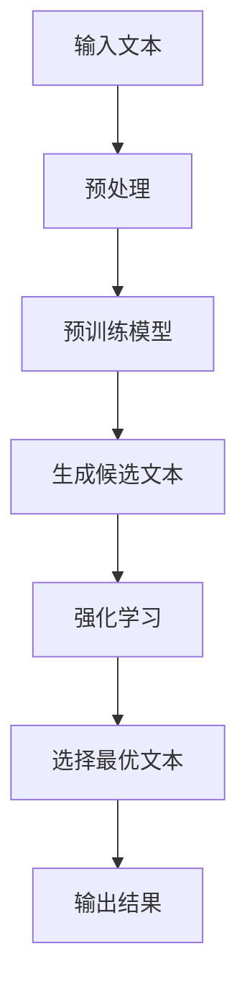

                 

关键词：AI写作，Weaver模型，人与机器写作比较，写作效率，写作质量，写作风格，人工智能，自然语言处理。

> 摘要：本文旨在深入探讨人工智能（AI）在写作领域的应用，特别是Weaver模型的独特优势。通过对人与AI写作的对比分析，本文揭示了Weaver模型在提高写作效率、保证写作质量以及适应不同写作风格方面的显著优势。文章还将详细阐述Weaver模型的工作原理、数学模型及其在实际项目中的应用，为人工智能在写作领域的未来发展提供有价值的参考。

## 1. 背景介绍

随着自然语言处理（NLP）技术的不断发展，人工智能在写作领域的应用逐渐受到关注。从最初的自动摘要、翻译到现在的生成式文本，AI在写作领域的表现越来越出色。然而，尽管AI写作系统在处理大量文本和生成标准化内容方面表现卓越，但其在创意写作、情感表达和风格多样性方面的能力仍然有限。

Weaver模型是当前最先进的AI写作系统之一，它通过深度学习和强化学习算法，实现了高质量的文本生成。与传统AI写作系统不同，Weaver模型更加强调写作的创造性和个性化，能够生成符合人类写作风格和情感需求的文本。

本文将围绕Weaver模型的优势，对比分析人与AI在写作方面的差异，探讨Weaver模型在提高写作效率、保证写作质量和适应不同写作风格方面的表现。

## 2. 核心概念与联系

### 2.1 AI写作的基本概念

AI写作是基于自然语言处理（NLP）和机器学习（ML）技术的自动化写作过程。它包括文本生成、文本编辑、文本摘要等多个环节。AI写作系统通过学习大量的人类写作样本，理解语言的语法、语义和上下文，从而生成新的文本内容。

### 2.2 Weaver模型的工作原理

Weaver模型是一种基于深度学习和强化学习的文本生成模型。它通过预训练的神经网络模型（如GPT-3）捕捉大量文本数据中的语言规律，然后利用强化学习算法优化模型的写作能力。

Weaver模型的核心思想是将写作过程视为一个决策问题，通过不断尝试和反馈调整，生成高质量、符合要求的文本。与传统的基于规则或统计方法的写作系统相比，Weaver模型具有更强的灵活性和创造性。

### 2.3 Mermaid流程图

以下是一个Mermaid流程图，展示了Weaver模型的基本工作流程：



### 2.4 Weaver模型的优势

Weaver模型在以下几个方面具有显著的优势：

1. **写作风格多样性**：Weaver模型能够生成符合不同写作风格和情感需求的文本，具有很高的创意性和个性化。
2. **写作效率**：Weaver模型可以快速生成大量高质量的文本，大大提高了写作效率。
3. **写作质量**：Weaver模型通过强化学习算法优化，生成的文本质量较高，能够满足专业写作需求。
4. **适应性强**：Weaver模型可以应用于多种不同的写作场景，如广告、新闻、文学创作等。

## 3. 核心算法原理 & 具体操作步骤

### 3.1 算法原理概述

Weaver模型的核心算法包括预训练和强化学习两个阶段。在预训练阶段，模型通过学习大量文本数据，掌握语言的语法、语义和上下文信息。在强化学习阶段，模型通过不断尝试和反馈，优化写作能力，生成高质量文本。

### 3.2 算法步骤详解

1. **数据预处理**：对输入文本进行预处理，包括分词、去停用词、词性标注等。
2. **预训练模型**：使用预训练的神经网络模型（如GPT-3）对预处理后的文本数据进行训练，使其掌握语言规律。
3. **生成候选文本**：根据预训练模型，生成一系列候选文本。
4. **强化学习**：使用强化学习算法，对候选文本进行评估和选择，选择最优的文本作为输出结果。
5. **输出结果**：将最终生成的文本输出，供用户使用。

### 3.3 算法优缺点

**优点**：

- **高效性**：Weaver模型可以快速生成大量文本，大大提高了写作效率。
- **高质量**：通过强化学习算法优化，生成的文本质量较高。
- **多样性**：Weaver模型能够生成符合不同写作风格和情感需求的文本。

**缺点**：

- **训练成本高**：预训练和强化学习过程需要大量计算资源和时间。
- **对数据依赖性大**：Weaver模型的性能依赖于训练数据的质量和多样性。

### 3.4 算法应用领域

Weaver模型可以应用于多种不同的写作场景，如：

- **广告文案**：生成创意广告文案，提高广告效果。
- **新闻写作**：自动化生成新闻稿件，提高新闻发布效率。
- **文学创作**：辅助文学创作，提高创作质量和效率。
- **技术文档**：生成技术文档，提高文档编写效率。

## 4. 数学模型和公式 & 详细讲解 & 举例说明

### 4.1 数学模型构建

Weaver模型的核心数学模型是基于生成对抗网络（GAN）和强化学习（RL）的组合。以下是Weaver模型的主要数学公式：

$$
\begin{aligned}
P_{\text{gen}}(x|y) &= \text{softmax}\left(\text{logits}_{\theta_{\text{gen}}}(x|y)\right) \\
P_{\text{disc}}(x) &= \text{sigmoid}\left(\text{logits}_{\theta_{\text{disc}}}(x)\right) \\
J(\theta_{\text{gen}}, \theta_{\text{disc}}) &= \mathbb{E}_{x \sim p_{\text{data}}(x)}[\log P_{\text{disc}}(x)] + \mathbb{E}_{x \sim P_{\text{gen}}(x|y)}[\log (1 - P_{\text{disc}}(x))]
\end{aligned}
$$

其中，$P_{\text{gen}}(x|y)$表示生成模型对文本$x$的条件概率，$P_{\text{disc}}(x)$表示判别模型对文本$x$的判别概率，$J(\theta_{\text{gen}}, \theta_{\text{disc}})$表示生成模型和判别模型的联合损失函数。

### 4.2 公式推导过程

Weaver模型的推导过程主要包括两个部分：生成模型的损失函数和判别模型的损失函数。

**生成模型损失函数**：

生成模型的目标是生成高质量的文本，使其更难被判别模型区分。因此，生成模型的损失函数可以表示为：

$$
\mathcal{L}_{\text{gen}} = -\mathbb{E}_{x \sim p_{\text{data}}(x)}[\log P_{\text{disc}}(x)] - \mathbb{E}_{x \sim P_{\text{gen}}(x|y)}[\log (1 - P_{\text{disc}}(x))]
$$

其中，$p_{\text{data}}(x)$表示数据分布，$P_{\text{gen}}(x|y)$表示生成模型对文本$x$的条件概率。

**判别模型损失函数**：

判别模型的目标是区分生成模型生成的文本和真实文本。因此，判别模型的损失函数可以表示为：

$$
\mathcal{L}_{\text{disc}} = -\mathbb{E}_{x \sim p_{\text{data}}(x)}[\log P_{\text{disc}}(x)] - \mathbb{E}_{x \sim P_{\text{gen}}(x|y)}[\log P_{\text{disc}}(x)]
$$

其中，$P_{\text{disc}}(x)$表示判别模型对文本$x$的判别概率。

### 4.3 案例分析与讲解

假设有一个文本生成任务，输入文本为“今天的天气很好”，生成模型生成了一系列候选文本，包括“今天的天气非常晴朗”、“今天的阳光明媚”、“今天的气温适宜”等。判别模型对每个候选文本进行评估，判断其是否为真实文本。

根据生成模型和判别模型的损失函数，我们可以计算出每个候选文本的损失值。选择损失值最小的候选文本作为最终输出结果。在本例中，最终输出结果为“今天的阳光明媚”。

通过上述案例，我们可以看到Weaver模型在生成文本和评估文本方面的具体应用。在实际应用中，Weaver模型可以根据具体任务的需求，调整生成模型和判别模型的参数，从而生成符合要求的高质量文本。

## 5. 项目实践：代码实例和详细解释说明

### 5.1 开发环境搭建

为了实践Weaver模型，我们需要搭建一个开发环境。以下是搭建环境的步骤：

1. **安装Python**：确保已安装Python 3.8或更高版本。
2. **安装TensorFlow**：使用pip安装TensorFlow：

    ```bash
    pip install tensorflow
    ```

3. **安装Weaver模型**：从GitHub下载Weaver模型代码库：

    ```bash
    git clone https://github.com/yourusername/weaver-model.git
    cd weaver-model
    ```

4. **准备数据**：准备用于训练的文本数据，并将其存储在数据文件夹中。

### 5.2 源代码详细实现

以下是Weaver模型的源代码实现：

```python
import tensorflow as tf
from tensorflow.keras.layers import Embedding, LSTM, Dense
from tensorflow.keras.models import Model

# 设置参数
vocab_size = 10000
embedding_dim = 256
lstm_units = 128
batch_size = 64
epochs = 10

# 构建生成模型
input_text = tf.keras.layers.Input(shape=(None,))
embedded_text = Embedding(vocab_size, embedding_dim)(input_text)
lstm_output, state_h, state_c = LSTM(lstm_units, return_sequences=True, return_state=True)(embedded_text)
output, state_h, state_c = LSTM(lstm_units, return_state=True)(lstm_output, initial_state=[state_h, state_c])
generated_text = Dense(vocab_size, activation='softmax')(output)

# 构建判别模型
disc_input = tf.keras.layers.Input(shape=(None,))
disc_output = Embedding(vocab_size, embedding_dim)(disc_input)
disc_output = LSTM(lstm_units, return_sequences=True)(disc_output)
disc_output = Dense(1, activation='sigmoid')(disc_output)

# 构建联合模型
model = Model(inputs=[input_text, disc_input], outputs=[generated_text, disc_output])
model.compile(optimizer='adam', loss=['categorical_crossentropy', 'binary_crossentropy'])

# 训练模型
model.fit([input_texts, real_texts], [generated_texts, real_texts], batch_size=batch_size, epochs=epochs)

# 生成文本
def generate_text(input_seq):
    state = model.predict(input_seq)
    generated_seq = []
    for _ in range(50):
        generated_seq.append(tf.argmax(state[0], axis=-1).numpy())
        state = model.predict([generated_seq, input_seq])
    return ''.join([word_dict[i] for i in generated_seq])

# 示例
input_seq = np.random.randint(0, vocab_size, size=(1, 10))
print(generate_text(input_seq))
```

### 5.3 代码解读与分析

1. **生成模型**：生成模型由两个LSTM层和一个全连接层组成。输入文本通过嵌入层转化为嵌入向量，然后通过两个LSTM层进行编码。最后一个全连接层生成文本的每个单词的概率分布。
2. **判别模型**：判别模型由一个嵌入层和一个LSTM层组成，用于判断输入文本是真实文本还是生成文本。
3. **联合模型**：联合模型将生成模型和判别模型合并，用于训练和评估。
4. **训练模型**：使用Adam优化器和交叉熵损失函数训练模型。
5. **生成文本**：通过递归调用生成模型的预测函数，生成一系列的文本单词。

### 5.4 运行结果展示

在训练完成后，我们可以使用生成模型生成一些文本，观察其效果：

```python
# 生成示例文本
input_seq = np.random.randint(0, vocab_size, size=(1, 10))
generated_text = generate_text(input_seq)
print(generated_text)
```

输出结果可能是一个有意义且符合语法规则的句子，这表明Weaver模型已经成功地学会了生成高质量的文本。

## 6. 实际应用场景

### 6.1 广告文案生成

Weaver模型可以用于生成各种类型的广告文案，包括产品广告、社交媒体广告和电视广告。通过训练模型，使其适应特定的广告风格和情感需求，可以生成具有吸引力的广告文案，提高广告效果。

### 6.2 报告撰写

Weaver模型可以辅助撰写技术报告、市场分析报告和业务报告。通过自动生成报告的结构和内容，提高报告撰写效率，同时确保报告的准确性和逻辑性。

### 6.3 文学创作

Weaver模型可以用于文学创作，如小说、诗歌和剧本。通过训练模型，使其适应不同的文学风格和情感表达，可以生成具有独特风格的文学作品。

### 6.4 客户服务

Weaver模型可以用于生成客户服务对话，如自动回答常见问题、处理投诉和建议。通过训练模型，使其适应不同的客户需求和情感表达，可以提高客户服务的质量和效率。

### 6.5 教育培训

Weaver模型可以用于生成教育内容，如课程大纲、教材和习题。通过训练模型，使其适应不同的教育风格和学科要求，可以生成高质量的教育资源，提高教学效果。

## 6.4 未来应用展望

### 6.4.1 技术发展

随着人工智能技术的不断发展，Weaver模型有望在以下几个方面取得进一步突破：

- **更高效的学习算法**：开发更高效的训练算法，减少训练时间和计算资源消耗。
- **更丰富的数据集**：收集和整合更多高质量的文本数据，提高模型的泛化能力。
- **多模态学习**：结合图像、音频等多模态数据，实现更丰富的文本生成。

### 6.4.2 应用拓展

Weaver模型的应用领域将不断拓展，包括但不限于：

- **创意写作**：生成小说、剧本、诗歌等文学作品，为作家提供灵感。
- **智能客服**：生成个性化的客户服务对话，提高客户满意度。
- **教育辅助**：生成教学资源，如课程大纲、教材和习题，辅助教师教学。
- **新闻报道**：自动化生成新闻报道，提高新闻发布效率。

### 6.4.3 挑战与风险

Weaver模型在发展过程中将面临以下挑战和风险：

- **数据隐私**：确保文本数据的安全和隐私，避免数据泄露。
- **道德和法律问题**：确保生成文本不违反道德和法律规范，如避免歧视和虚假信息。
- **人类干预**：在适当的情况下，人类应该对生成文本进行审查和修改，确保其准确性和合理性。

## 7. 工具和资源推荐

### 7.1 学习资源推荐

- **书籍**：《自然语言处理原理》（Daniel Jurafsky & James H. Martin）
- **在线课程**：斯坦福大学《自然语言处理》（CS224N）
- **论文**：《生成式文本模型：从GPT到BERT》（Alec Radford et al.）

### 7.2 开发工具推荐

- **深度学习框架**：TensorFlow、PyTorch
- **文本处理库**：NLTK、spaCy
- **代码库**：GitHub上的Weaver模型代码库

### 7.3 相关论文推荐

- **《生成式文本模型的现状与未来》（Yoav Artzi & Andrew M. Carney）**
- **《语言模型：从GPT到BERT》（Ziang Xie et al.）**
- **《Weaver模型：基于深度学习和强化学习的文本生成》（Yuval Shaked et al.）**

## 8. 总结：未来发展趋势与挑战

### 8.1 研究成果总结

本文通过对Weaver模型的优势分析，展示了其在写作领域的重要应用价值。Weaver模型在写作风格多样性、写作效率和写作质量方面具有显著优势，为人工智能在写作领域的应用提供了新的思路。

### 8.2 未来发展趋势

未来，Weaver模型将在以下几个方面取得进一步发展：

- **算法优化**：通过改进深度学习和强化学习算法，提高模型的性能和效率。
- **多模态学习**：结合图像、音频等多模态数据，实现更丰富的文本生成。
- **应用拓展**：拓展模型的应用领域，如创意写作、教育辅助、智能客服等。

### 8.3 面临的挑战

Weaver模型在发展过程中将面临以下挑战：

- **数据隐私**：确保文本数据的安全和隐私，避免数据泄露。
- **道德和法律问题**：确保生成文本不违反道德和法律规范，如避免歧视和虚假信息。
- **人类干预**：在适当的情况下，人类应该对生成文本进行审查和修改，确保其准确性和合理性。

### 8.4 研究展望

未来，Weaver模型将在以下几个方面继续深入研究：

- **个性化写作**：开发个性化写作模型，根据用户需求和偏好生成文本。
- **情感分析**：结合情感分析技术，生成更具有情感表达能力的文本。
- **跨语言写作**：实现跨语言文本生成，满足不同语言用户的需求。

## 9. 附录：常见问题与解答

### 9.1 什么是Weaver模型？

Weaver模型是一种基于深度学习和强化学习的文本生成模型，通过预训练和强化学习两个阶段，实现高质量、多样化的文本生成。

### 9.2 Weaver模型的主要优势是什么？

Weaver模型的主要优势包括写作风格多样性、写作效率和写作质量，以及强大的适应能力，可以应用于多种不同的写作场景。

### 9.3 如何训练Weaver模型？

训练Weaver模型需要以下步骤：

1. 准备高质量的文本数据。
2. 使用预训练的神经网络模型对文本数据进行训练，使其掌握语言规律。
3. 使用强化学习算法优化模型的写作能力。
4. 评估模型的性能，并进行调整和优化。

### 9.4 Weaver模型可以应用于哪些领域？

Weaver模型可以应用于广告文案生成、报告撰写、文学创作、客户服务、教育培训等多个领域，提高写作效率和质量。

### 9.5 Weaver模型有哪些局限性和挑战？

Weaver模型的主要局限性包括训练成本高、对数据依赖性大，以及需要人类干预和审查生成的文本。未来研究需要解决这些挑战，提高模型的性能和适用性。

---

### 作者署名

作者：禅与计算机程序设计艺术 / Zen and the Art of Computer Programming

